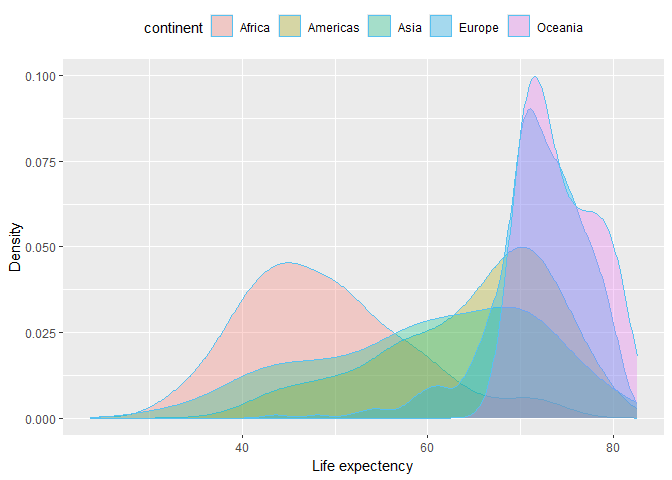
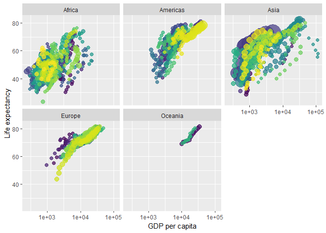

# Preamble

In this course we take you through a focused establishment of R, there
are many courses available that you can take to further improve your
skills with R programming but the focus here is to enable you to use
this language comfortably for your health data science projects. We will
cover:

-   Set up Testing workability of the repo
-   Importing data
-   Data Analysis
-   Statistical inference
-   Comparison of means
-   Analysis of Variance
-   Correlation
-   Regression
-   Prediction
-   Model comparison
-   Statistical power

# Set up

# Importing data

# Data Analysis

# Statistical inference

# Comparison of means

# Analysis of Variance

# Correlation

# Regression

# Prediction

# Model comparison

# Statistical power

# Report structure

### Abstract

Provide the reader with a succinct summary of your work

### Introduction

Provide an introduction to you portfolio to reader.

### Method

covering data access requirements, ethics, metadata and all
methodological aspects of your project

### Results

Use this section to showcase the results of your data manipulation that
will contribute to the project

### Conclusion

Summaries your findings,discuss them in the context of other similar
work or questions and suggestions for future work. Conclude your
portfolio with what started your data exploration and what have the data
contributed in the decisions for patient care or health service
delivery.

# Data Visualisation

## Area graph

    ## `geom_smooth()` using formula = 'y ~ x'
    ## Setting the `off` event (i.e., 'plotly_doubleclick') to match the `on` event (i.e., 'plotly_hover'). You can change this default via the `highlight()` function.

<script type="application/json" data-for="htmlwidget-6a97910e26bdd65fab9f">{"x":{"data":[{"x":[3.3889902366128295,3.546617951893976,3.0264320126717377,2.9300526050205478,2.7350039250646971,2.5305793268568042,3.0691749464286691,3.029915447835549,3.0713907290818487,3.042571943572232,2.8923964580961394,3.3274859174242151,3.1425755133131092,3.4264347203837331,3.1519280501569278,2.5747754426179159,2.5171174236159328,2.5588840279669709,3.6328090876363524,2.6859482337800413,2.9596608637313313,2.7077374684251021,2.4769045152043669,2.9312243461536549,2.4754477554867704,2.7601004101431883,3.3779521224475015,3.1592698569002877,2.56722061382276,2.6554620948372682,2.8710565594093267,3.2940153194906676,3.2274248143258331,2.6707337315928892,3.3844932769166256,2.8818862174230904,3.0323293453507603,3.4343908858518062,2.6931321343486228,2.9442771161033847,3.1614749102802429,2.9443779036382201,3.0552826850697294,3.6744289754841963,3.2084389723810651,3.0600843443064192,2.8553071488998873,2.9344018133538139,3.1668667439061169,2.8661416540551472,3.0597106180244795,2.609470734853601],"y":[43.076999999999998,30.015000000000001,38.222999999999999,47.622,31.975000000000001,39.030999999999999,38.523000000000003,35.463000000000001,38.091999999999999,40.715000000000003,39.143000000000001,42.110999999999997,40.476999999999997,34.811999999999998,41.893000000000001,34.481999999999999,35.927999999999997,34.078000000000003,37.003,30,43.149000000000001,33.609000000000002,32.5,42.270000000000003,42.137999999999998,38.479999999999997,42.722999999999999,36.680999999999997,36.256,33.685000000000002,40.542999999999999,50.985999999999997,42.872999999999998,31.286000000000001,41.725000000000001,37.444000000000003,36.323999999999998,52.723999999999997,40,46.470999999999997,37.277999999999999,30.331,32.978000000000002,45.009,38.634999999999998,41.406999999999996,41.215000000000003,38.595999999999997,44.600000000000001,39.978000000000002,42.037999999999997,48.451000000000001],"text":["gdpPercap:   2449.0082 lifeExp: 43.07700 continent: Africa year: 1952 pop:    9279525 country: Algeria","gdpPercap:   3520.6103 lifeExp: 30.01500 continent: Africa year: 1952 pop:    4232095 country: Angola","gdpPercap:   1062.7522 lifeExp: 38.22300 continent: Africa year: 1952 pop:    1738315 country: Benin","gdpPercap:    851.2411 lifeExp: 47.62200 continent: Africa year: 1952 pop:     442308 country: Botswana","gdpPercap:    543.2552 lifeExp: 31.97500 continent: Africa year: 1952 pop:    4469979 country: Burkina Faso","gdpPercap:    339.2965 lifeExp: 39.03100 continent: Africa year: 1952 pop:    2445618 country: Burundi","gdpPercap:   1172.6677 lifeExp: 38.52300 continent: Africa year: 1952 pop:    5009067 country: Cameroon","gdpPercap:   1071.3107 lifeExp: 35.46300 continent: Africa year: 1952 pop:    1291695 country: Central African Republic","gdpPercap:   1178.6659 lifeExp: 38.09200 continent: Africa year: 1952 pop:    2682462 country: Chad","gdpPercap:   1102.9909 lifeExp: 40.71500 continent: Africa year: 1952 pop:     153936 country: Comoros","gdpPercap:    780.5423 lifeExp: 39.14300 continent: Africa year: 1952 pop:   14100005 country: Congo, Dem. Rep.","gdpPercap:   2125.6214 lifeExp: 42.11100 continent: Africa year: 1952 pop:     854885 country: Congo, Rep.","gdpPercap:   1388.5947 lifeExp: 40.47700 continent: Africa year: 1952 pop:    2977019 country: Cote d'Ivoire","gdpPercap:   2669.5295 lifeExp: 34.81200 continent: Africa year: 1952 pop:      63149 country: Djibouti","gdpPercap:   1418.8224 lifeExp: 41.89300 continent: Africa year: 1952 pop:   22223309 country: Egypt","gdpPercap:    375.6431 lifeExp: 34.48200 continent: Africa year: 1952 pop:     216964 country: Equatorial Guinea","gdpPercap:    328.9406 lifeExp: 35.92800 continent: Africa year: 1952 pop:    1438760 country: Eritrea","gdpPercap:    362.1463 lifeExp: 34.07800 continent: Africa year: 1952 pop:   20860941 country: Ethiopia","gdpPercap:   4293.4765 lifeExp: 37.00300 continent: Africa year: 1952 pop:     420702 country: Gabon","gdpPercap:    485.2307 lifeExp: 30.00000 continent: Africa year: 1952 pop:     284320 country: Gambia","gdpPercap:    911.2989 lifeExp: 43.14900 continent: Africa year: 1952 pop:    5581001 country: Ghana","gdpPercap:    510.1965 lifeExp: 33.60900 continent: Africa year: 1952 pop:    2664249 country: Guinea","gdpPercap:    299.8503 lifeExp: 32.50000 continent: Africa year: 1952 pop:     580653 country: Guinea-Bissau","gdpPercap:    853.5409 lifeExp: 42.27000 continent: Africa year: 1952 pop:    6464046 country: Kenya","gdpPercap:    298.8462 lifeExp: 42.13800 continent: Africa year: 1952 pop:     748747 country: Lesotho","gdpPercap:    575.5730 lifeExp: 38.48000 continent: Africa year: 1952 pop:     863308 country: Liberia","gdpPercap:   2387.5481 lifeExp: 42.72300 continent: Africa year: 1952 pop:    1019729 country: Libya","gdpPercap:   1443.0117 lifeExp: 36.68100 continent: Africa year: 1952 pop:    4762912 country: Madagascar","gdpPercap:    369.1651 lifeExp: 36.25600 continent: Africa year: 1952 pop:    2917802 country: Malawi","gdpPercap:    452.3370 lifeExp: 33.68500 continent: Africa year: 1952 pop:    3838168 country: Mali","gdpPercap:    743.1159 lifeExp: 40.54300 continent: Africa year: 1952 pop:    1022556 country: Mauritania","gdpPercap:   1967.9557 lifeExp: 50.98600 continent: Africa year: 1952 pop:     516556 country: Mauritius","gdpPercap:   1688.2036 lifeExp: 42.87300 continent: Africa year: 1952 pop:    9939217 country: Morocco","gdpPercap:    468.5260 lifeExp: 31.28600 continent: Africa year: 1952 pop:    6446316 country: Mozambique","gdpPercap:   2423.7804 lifeExp: 41.72500 continent: Africa year: 1952 pop:     485831 country: Namibia","gdpPercap:    761.8794 lifeExp: 37.44400 continent: Africa year: 1952 pop:    3379468 country: Niger","gdpPercap:   1077.2819 lifeExp: 36.32400 continent: Africa year: 1952 pop:   33119096 country: Nigeria","gdpPercap:   2718.8853 lifeExp: 52.72400 continent: Africa year: 1952 pop:     257700 country: Reunion","gdpPercap:    493.3239 lifeExp: 40.00000 continent: Africa year: 1952 pop:    2534927 country: Rwanda","gdpPercap:    879.5836 lifeExp: 46.47100 continent: Africa year: 1952 pop:      60011 country: Sao Tome and Principe","gdpPercap:   1450.3570 lifeExp: 37.27800 continent: Africa year: 1952 pop:    2755589 country: Senegal","gdpPercap:    879.7877 lifeExp: 30.33100 continent: Africa year: 1952 pop:    2143249 country: Sierra Leone","gdpPercap:   1135.7498 lifeExp: 32.97800 continent: Africa year: 1952 pop:    2526994 country: Somalia","gdpPercap:   4725.2955 lifeExp: 45.00900 continent: Africa year: 1952 pop:   14264935 country: South Africa","gdpPercap:   1615.9911 lifeExp: 38.63500 continent: Africa year: 1952 pop:    8504667 country: Sudan","gdpPercap:   1148.3766 lifeExp: 41.40700 continent: Africa year: 1952 pop:     290243 country: Swaziland","gdpPercap:    716.6501 lifeExp: 41.21500 continent: Africa year: 1952 pop:    8322925 country: Tanzania","gdpPercap:    859.8087 lifeExp: 38.59600 continent: Africa year: 1952 pop:    1219113 country: Togo","gdpPercap:   1468.4756 lifeExp: 44.60000 continent: Africa year: 1952 pop:    3647735 country: Tunisia","gdpPercap:    734.7535 lifeExp: 39.97800 continent: Africa year: 1952 pop:    5824797 country: Uganda","gdpPercap:   1147.3888 lifeExp: 42.03800 continent: Africa year: 1952 pop:    2672000 country: Zambia","gdpPercap:    406.8841 lifeExp: 48.45100 continent: Africa year: 1952 pop:    3080907 country: Zimbabwe"],"key":["Africa"],"frame":"1952","ids":["Algeria","Angola","Benin","Botswana","Burkina Faso","Burundi","Cameroon","Central African Republic","Chad","Comoros","Congo, Dem. Rep.","Congo, Rep.","Cote d'Ivoire","Djibouti","Egypt","Equatorial Guinea","Eritrea","Ethiopia","Gabon","Gambia","Ghana","Guinea","Guinea-Bissau","Kenya","Lesotho","Liberia","Libya","Madagascar","Malawi","Mali","Mauritania","Mauritius","Morocco","Mozambique","Namibia","Niger","Nigeria","Reunion","Rwanda","Sao Tome and Principe","Senegal","Sierra Leone","Somalia","South Africa","Sudan","Swaziland","Tanzania","Togo","Tunisia","Uganda","Zambia","Zimbabwe"],"type":"scatter","mode":"markers","marker":{"autocolorscale":false,"color":"rgba(248,118,109,1)","opacity":1,"size":[5.3596880451420699,4.8425041618687459,4.4537178567403597,4.1012990986034978,4.8723884950372884,4.583325026789586,4.9372604387161632,4.3570871941780416,4.6222816600604695,3.939019148205221,5.7295097479536228,4.2435044273945852,4.668352010618662,3.8086799146703236,6.2295179237524652,3.985700655763571,4.3905959068740739,6.1530238626308815,4.0920742004680282,4.0260012297744465,5.0023282169152372,4.6193500851058955,4.1550334747375999,5.096491948485923,4.211417983647797,4.2459562490204696,4.2893500652926448,4.9081017173828627,4.6592839198277902,4.7910771618886354,4.2901003942512741,4.1311600351542932,5.4152446976967301,5.0946676328480507,4.1191217176282731,4.7276855444795594,6.7717411967666079,4.0109142821966204,4.5982325069959114,3.7795275590551185,4.6339509614706786,4.53066018778736,4.5969193312670793,5.7409296804429673,5.2918282998880404,4.029234162036774,5.2754662667541075,4.339811288805171,4.7652546586896216,5.0290348036243628,4.620598939484835,4.6840410951992526],"symbol":"circle","line":{"width":1.8897637795275593,"color":"rgba(248,118,109,1)"}},"hoveron":"points","set":"SharedDatab0c97d01","name":"Africa","legendgroup":"Africa","showlegend":true,"xaxis":"x","yaxis":"y","hoverinfo":"text","_isSimpleKey":true,"_isNestedKey":false,"visible":true},{"x":[3.7716841063854578,3.4277013118156043,3.3240651209271301,4.055652015799267,3.5954938837938353,3.3312480945543395,3.4194616385247927,3.7471428178485775,3.1454192899578319,3.5468030038250093,3.4840581192497848,3.3852912098780523,3.2649044228437729,3.3414199233324244,3.4621779317126391,3.5413452520681394,3.4930903760317378,3.3945182793314443,3.2905484898372737,3.5750172627178163,3.4888269675210974,3.4804772115240326,4.1458326795437701,3.7571504724556046,3.8859150311115758],"y":[62.484999999999999,40.414000000000001,50.917000000000002,68.75,54.744999999999997,50.643000000000001,57.206000000000003,59.420999999999999,45.927999999999997,48.356999999999999,45.262,42.023000000000003,37.579000000000001,41.911999999999999,58.530000000000001,50.789000000000001,42.314,55.191000000000003,62.649000000000001,43.902000000000001,64.280000000000001,59.100000000000001,68.439999999999998,66.070999999999998,55.088000000000001],"text":["gdpPercap:   5911.3151 lifeExp: 62.48500 continent: Americas year: 1952 pop:   17876956 country: Argentina","gdpPercap:   2677.3263 lifeExp: 40.41400 continent: Americas year: 1952 pop:    2883315 country: Bolivia","gdpPercap:   2108.9444 lifeExp: 50.91700 continent: Americas year: 1952 pop:   56602560 country: Brazil","gdpPercap:  11367.1611 lifeExp: 68.75000 continent: Americas year: 1952 pop:   14785584 country: Canada","gdpPercap:   3939.9788 lifeExp: 54.74500 continent: Americas year: 1952 pop:    6377619 country: Chile","gdpPercap:   2144.1151 lifeExp: 50.64300 continent: Americas year: 1952 pop:   12350771 country: Colombia","gdpPercap:   2627.0095 lifeExp: 57.20600 continent: Americas year: 1952 pop:     926317 country: Costa Rica","gdpPercap:   5586.5388 lifeExp: 59.42100 continent: Americas year: 1952 pop:    6007797 country: Cuba","gdpPercap:   1397.7171 lifeExp: 45.92800 continent: Americas year: 1952 pop:    2491346 country: Dominican Republic","gdpPercap:   3522.1107 lifeExp: 48.35700 continent: Americas year: 1952 pop:    3548753 country: Ecuador","gdpPercap:   3048.3029 lifeExp: 45.26200 continent: Americas year: 1952 pop:    2042865 country: El Salvador","gdpPercap:   2428.2378 lifeExp: 42.02300 continent: Americas year: 1952 pop:    3146381 country: Guatemala","gdpPercap:   1840.3669 lifeExp: 37.57900 continent: Americas year: 1952 pop:    3201488 country: Haiti","gdpPercap:   2194.9262 lifeExp: 41.91200 continent: Americas year: 1952 pop:    1517453 country: Honduras","gdpPercap:   2898.5309 lifeExp: 58.53000 continent: Americas year: 1952 pop:    1426095 country: Jamaica","gdpPercap:   3478.1255 lifeExp: 50.78900 continent: Americas year: 1952 pop:   30144317 country: Mexico","gdpPercap:   3112.3639 lifeExp: 42.31400 continent: Americas year: 1952 pop:    1165790 country: Nicaragua","gdpPercap:   2480.3803 lifeExp: 55.19100 continent: Americas year: 1952 pop:     940080 country: Panama","gdpPercap:   1952.3087 lifeExp: 62.64900 continent: Americas year: 1952 pop:    1555876 country: Paraguay","gdpPercap:   3758.5234 lifeExp: 43.90200 continent: Americas year: 1952 pop:    8025700 country: Peru","gdpPercap:   3081.9598 lifeExp: 64.28000 continent: Americas year: 1952 pop:    2227000 country: Puerto Rico","gdpPercap:   3023.2719 lifeExp: 59.10000 continent: Americas year: 1952 pop:     662850 country: Trinidad and Tobago","gdpPercap:  13990.4821 lifeExp: 68.44000 continent: Americas year: 1952 pop:  157553000 country: United States","gdpPercap:   5716.7667 lifeExp: 66.07100 continent: Americas year: 1952 pop:    2252965 country: Uruguay","gdpPercap:   7689.7998 lifeExp: 55.08800 continent: Americas year: 1952 pop:    5439568 country: Venezuela"],"key":["Americas"],"frame":"1952","ids":["Argentina","Bolivia","Brazil","Canada","Chile","Colombia","Costa Rica","Cuba","Dominican Republic","Ecuador","El Salvador","Guatemala","Haiti","Honduras","Jamaica","Mexico","Nicaragua","Panama","Paraguay","Peru","Puerto Rico","Trinidad and Tobago","United States","Uruguay","Venezuela"],"type":"scatter","mode":"markers","marker":{"autocolorscale":false,"color":"rgba(163,165,0,1)","opacity":1,"size":[5.9761924212589923,4.6539594842422387,7.692753059893958,5.7765515624904307,5.0875750765880134,5.6039968281611738,4.263903813508195,5.0487123249649839,4.5909921700246734,4.751561904236298,4.5123395251453049,4.6937906297188769,4.70191658143957,4.407792497580223,4.3877828366597189,6.6339430009005049,4.3267719922233363,4.2677362936605636,4.4160201956940979,5.2483146831183864,4.5456100505538446,4.183589414537412,10.310499172688521,4.550186008579983,4.9865641622288166],"symbol":"circle","line":{"width":1.8897637795275593,"color":"rgba(163,165,0,1)"}},"hoveron":"points","set":"SharedDatab0c97d01","name":"Americas","legendgroup":"Americas","showlegend":true,"xaxis":"x","yaxis":"y","hoverinfo":"text","_isSimpleKey":true,"_isNestedKey":false,"visible":true},{"x":[2.8917856507063857,3.9941888591046819,2.8352111067723493,2.5664012923297479,2.6025467916035643,3.4849289266728523,2.7376424130206169,2.8748768833905021,3.4822053422865116,3.6159254503329223,3.6113538549108273,3.5074451677140162,3.1894644312790241,3.0367397532404041,3.0130868621518014,5.0349585749878187,3.6843788787613345,3.2627198642560913,2.8957356431821641,2.5198279937757189,2.7370858240682567,3.2620309040668611,2.8354350828905424,3.104787802215522,3.8102025884940609,3.3645769259938039,3.0348417539083994,3.2157658381984016,3.08168852810498,2.8795531210227017,2.7818031025725949,3.1805823984758761,2.8930498767229236],"y":[28.800999999999998,50.939,37.484000000000002,39.417000000000002,44,60.960000000000001,37.372999999999998,37.468000000000004,44.869,45.32,65.390000000000001,63.030000000000001,43.158000000000001,50.055999999999997,47.453000000000003,55.564999999999998,55.927999999999997,48.463000000000001,42.244,36.319000000000003,36.156999999999996,37.578000000000003,43.436,47.752000000000002,39.875,60.396000000000001,57.593000000000004,45.883000000000003,58.5,50.847999999999999,40.411999999999999,43.159999999999997,32.548000000000002],"text":["gdpPercap:    779.4453 lifeExp: 28.80100 continent: Asia year: 1952 pop:    8425333 country: Afghanistan","gdpPercap:   9867.0848 lifeExp: 50.93900 continent: Asia year: 1952 pop:     120447 country: Bahrain","gdpPercap:    684.2442 lifeExp: 37.48400 continent: Asia year: 1952 pop:   46886859 country: Bangladesh","gdpPercap:    368.4693 lifeExp: 39.41700 continent: Asia year: 1952 pop:    4693836 country: Cambodia","gdpPercap:    400.4486 lifeExp: 44.00000 continent: Asia year: 1952 pop:  556263527 country: China","gdpPercap:   3054.4212 lifeExp: 60.96000 continent: Asia year: 1952 pop:    2125900 country: Hong Kong, China","gdpPercap:    546.5657 lifeExp: 37.37300 continent: Asia year: 1952 pop:  372000000 country: India","gdpPercap:    749.6817 lifeExp: 37.46800 continent: Asia year: 1952 pop:   82052000 country: Indonesia","gdpPercap:   3035.3260 lifeExp: 44.86900 continent: Asia year: 1952 pop:   17272000 country: Iran","gdpPercap:   4129.7661 lifeExp: 45.32000 continent: Asia year: 1952 pop:    5441766 country: Iraq","gdpPercap:   4086.5221 lifeExp: 65.39000 continent: Asia year: 1952 pop:    1620914 country: Israel","gdpPercap:   3216.9563 lifeExp: 63.03000 continent: Asia year: 1952 pop:   86459025 country: Japan","gdpPercap:   1546.9078 lifeExp: 43.15800 continent: Asia year: 1952 pop:     607914 country: Jordan","gdpPercap:   1088.2778 lifeExp: 50.05600 continent: Asia year: 1952 pop:    8865488 country: Korea, Dem. Rep.","gdpPercap:   1030.5922 lifeExp: 47.45300 continent: Asia year: 1952 pop:   20947571 country: Korea, Rep.","gdpPercap: 108382.3529 lifeExp: 55.56500 continent: Asia year: 1952 pop:     160000 country: Kuwait","gdpPercap:   4834.8041 lifeExp: 55.92800 continent: Asia year: 1952 pop:    1439529 country: Lebanon","gdpPercap:   1831.1329 lifeExp: 48.46300 continent: Asia year: 1952 pop:    6748378 country: Malaysia","gdpPercap:    786.5669 lifeExp: 42.24400 continent: Asia year: 1952 pop:     800663 country: Mongolia","gdpPercap:    331.0000 lifeExp: 36.31900 continent: Asia year: 1952 pop:   20092996 country: Myanmar","gdpPercap:    545.8657 lifeExp: 36.15700 continent: Asia year: 1952 pop:    9182536 country: Nepal","gdpPercap:   1828.2303 lifeExp: 37.57800 continent: Asia year: 1952 pop:     507833 country: Oman","gdpPercap:    684.5971 lifeExp: 43.43600 continent: Asia year: 1952 pop:   41346560 country: Pakistan","gdpPercap:   1272.8810 lifeExp: 47.75200 continent: Asia year: 1952 pop:   22438691 country: Philippines","gdpPercap:   6459.5548 lifeExp: 39.87500 continent: Asia year: 1952 pop:    4005677 country: Saudi Arabia","gdpPercap:   2315.1382 lifeExp: 60.39600 continent: Asia year: 1952 pop:    1127000 country: Singapore","gdpPercap:   1083.5320 lifeExp: 57.59300 continent: Asia year: 1952 pop:    7982342 country: Sri Lanka","gdpPercap:   1643.4854 lifeExp: 45.88300 continent: Asia year: 1952 pop:    3661549 country: Syria","gdpPercap:   1206.9479 lifeExp: 58.50000 continent: Asia year: 1952 pop:    8550362 country: Taiwan","gdpPercap:    757.7974 lifeExp: 50.84800 continent: Asia year: 1952 pop:   21289402 country: Thailand","gdpPercap:    605.0665 lifeExp: 40.41200 continent: Asia year: 1952 pop:   26246839 country: Vietnam","gdpPercap:   1515.5923 lifeExp: 43.16000 continent: Asia year: 1952 pop:    1030585 country: West Bank and Gaza","gdpPercap:    781.7176 lifeExp: 32.54800 continent: Asia year: 1952 pop:    4963829 country: Yemen, Rep."],"key":["Asia"],"frame":"1952","ids":["Afghanistan","Bahrain","Bangladesh","Cambodia","China","Hong Kong, China","India","Indonesia","Iran","Iraq","Israel","Japan","Jordan","Korea, Dem. Rep.","Korea, Rep.","Kuwait","Lebanon","Malaysia","Mongolia","Myanmar","Nepal","Oman","Pakistan","Philippines","Saudi Arabia","Singapore","Sri Lanka","Syria","Taiwan","Thailand","Vietnam","West Bank and Gaza","Yemen, Rep."],"type":"scatter","mode":"markers","marker":{"autocolorscale":false,"color":"rgba(0,191,125,1)","opacity":1,"size":[5.2847078214757142,3.9074642282343168,7.3407134678386097,4.8997828341022727,16.052903818432547,4.5275259696634107,13.816058328872819,8.4918271591781487,5.938577625600022,4.9868107248648386,4.4297098570150952,8.6168114558752524,4.1647388627492612,5.3237989540785122,6.1579611982762144,3.9440871866772174,4.3907662954126012,5.1254103223507306,4.2273999419301571,6.1087985414554904,5.3513544503673032,4.1277845923343817,7.1234136516901847,6.2413935934758005,4.8132580899293567,4.3170878180566961,5.2443118549987666,4.7671505336129654,5.2959143959482908,6.1773440978456602,6.4426346519106312,4.2922254253265884,4.9319570280007863],"symbol":"circle","line":{"width":1.8897637795275593,"color":"rgba(0,191,125,1)"}},"hoveron":"points","set":"SharedDatab0c97d01","name":"Asia","legendgroup":"Asia","showlegend":true,"xaxis":"x","yaxis":"y","hoverinfo":"text","_isSimpleKey":true,"_isNestedKey":false,"visible":true},{"x":[3.2044065593569231,3.7879615363271912,3.9213277159305022,2.9883507643539309,3.3881521354267963,3.4940483069265413,3.8373447262436224,3.9864306677903336,3.8078406226448371,3.846943545595249,3.8539483999469684,3.5478595957564281,3.7212889686947199,3.8613963004603242,3.716861090214755,3.6929705967500874,3.422850010494709,3.951413871061022,4.0041244656118469,3.6052328048910161,3.4869006320800371,3.4975672311747799,3.5540600381109928,3.7054068733390868,3.6248018797427801,3.5836560439073355,3.930839280912017,4.1683275259262418,3.2942679883231207,3.9991091518444533],"y":[55.229999999999997,66.799999999999997,68,53.82,59.600000000000001,61.210000000000001,66.870000000000005,70.780000000000001,66.549999999999997,67.409999999999997,67.5,65.859999999999999,64.030000000000001,72.489999999999995,66.909999999999997,65.939999999999998,59.164000000000001,72.129999999999995,72.670000000000002,61.310000000000002,59.82,61.049999999999997,57.996000000000002,64.359999999999999,65.569999999999993,64.939999999999998,71.859999999999999,69.620000000000005,43.585000000000001,69.180000000000007],"text":["gdpPercap:   1601.0561 lifeExp: 55.23000 continent: Europe year: 1952 pop:    1282697 country: Albania","gdpPercap:   6137.0765 lifeExp: 66.80000 continent: Europe year: 1952 pop:    6927772 country: Austria","gdpPercap:   8343.1051 lifeExp: 68.00000 continent: Europe year: 1952 pop:    8730405 country: Belgium","gdpPercap:    973.5332 lifeExp: 53.82000 continent: Europe year: 1952 pop:    2791000 country: Bosnia and Herzegovina","gdpPercap:   2444.2866 lifeExp: 59.60000 continent: Europe year: 1952 pop:    7274900 country: Bulgaria","gdpPercap:   3119.2365 lifeExp: 61.21000 continent: Europe year: 1952 pop:    3882229 country: Croatia","gdpPercap:   6876.1403 lifeExp: 66.87000 continent: Europe year: 1952 pop:    9125183 country: Czech Republic","gdpPercap:   9692.3852 lifeExp: 70.78000 continent: Europe year: 1952 pop:    4334000 country: Denmark","gdpPercap:   6424.5191 lifeExp: 66.55000 continent: Europe year: 1952 pop:    4090500 country: Finland","gdpPercap:   7029.8093 lifeExp: 67.41000 continent: Europe year: 1952 pop:   42459667 country: France","gdpPercap:   7144.1144 lifeExp: 67.50000 continent: Europe year: 1952 pop:   69145952 country: Germany","gdpPercap:   3530.6901 lifeExp: 65.86000 continent: Europe year: 1952 pop:    7733250 country: Greece","gdpPercap:   5263.6738 lifeExp: 64.03000 continent: Europe year: 1952 pop:    9504000 country: Hungary","gdpPercap:   7267.6884 lifeExp: 72.49000 continent: Europe year: 1952 pop:     147962 country: Iceland","gdpPercap:   5210.2803 lifeExp: 66.91000 continent: Europe year: 1952 pop:    2952156 country: Ireland","gdpPercap:   4931.4042 lifeExp: 65.94000 continent: Europe year: 1952 pop:   47666000 country: Italy","gdpPercap:   2647.5856 lifeExp: 59.16400 continent: Europe year: 1952 pop:     413834 country: Montenegro","gdpPercap:   8941.5719 lifeExp: 72.13000 continent: Europe year: 1952 pop:   10381988 country: Netherlands","gdpPercap:  10095.4217 lifeExp: 72.67000 continent: Europe year: 1952 pop:    3327728 country: Norway","gdpPercap:   4029.3297 lifeExp: 61.31000 continent: Europe year: 1952 pop:   25730551 country: Poland","gdpPercap:   3068.3199 lifeExp: 59.82000 continent: Europe year: 1952 pop:    8526050 country: Portugal","gdpPercap:   3144.6132 lifeExp: 61.05000 continent: Europe year: 1952 pop:   16630000 country: Romania","gdpPercap:   3581.4594 lifeExp: 57.99600 continent: Europe year: 1952 pop:    6860147 country: Serbia","gdpPercap:   5074.6591 lifeExp: 64.36000 continent: Europe year: 1952 pop:    3558137 country: Slovak Republic","gdpPercap:   4215.0417 lifeExp: 65.57000 continent: Europe year: 1952 pop:    1489518 country: Slovenia","gdpPercap:   3834.0347 lifeExp: 64.94000 continent: Europe year: 1952 pop:   28549870 country: Spain","gdpPercap:   8527.8447 lifeExp: 71.86000 continent: Europe year: 1952 pop:    7124673 country: Sweden","gdpPercap:  14734.2327 lifeExp: 69.62000 continent: Europe year: 1952 pop:    4815000 country: Switzerland","gdpPercap:   1969.1010 lifeExp: 43.58500 continent: Europe year: 1952 pop:   22235677 country: Turkey","gdpPercap:   9979.5085 lifeExp: 69.18000 continent: Europe year: 1952 pop:   50430000 country: United Kingdom"],"key":["Europe"],"frame":"1952","ids":["Albania","Austria","Belgium","Bosnia and Herzegovina","Bulgaria","Croatia","Czech Republic","Denmark","Finland","France","Germany","Greece","Hungary","Iceland","Ireland","Italy","Montenegro","Netherlands","Norway","Poland","Portugal","Romania","Serbia","Slovak Republic","Slovenia","Spain","Sweden","Switzerland","Turkey","United Kingdom"],"type":"scatter","mode":"markers","marker":{"autocolorscale":false,"color":"rgba(0,176,246,1)","opacity":1,"size":[4.3549736618885886,5.1433403837294707,5.3119079997454852,4.6395448022917591,5.1773821927127042,4.7969584282546753,5.3464056491443861,4.8554076809001705,4.82431045346424,7.1681903191142089,8.1050843879888799,5.2211002490471792,5.3788090820146222,3.9338636777741907,4.6645559747925951,7.3702181147083143,4.0890842629232989,5.4514981222268988,4.7202671078427141,6.4162516406762169,5.2937417633778745,5.8979291479522571,5.1366092232624752,4.7528683127845115,4.4017423441484134,6.557272295853001,5.1627527119254548,4.9143343910026385,6.2302014243454815,7.4729851051474805],"symbol":"circle","line":{"width":1.8897637795275593,"color":"rgba(0,176,246,1)"}},"hoveron":"points","set":"SharedDatab0c97d01","name":"Europe","legendgroup":"Europe","showlegend":true,"xaxis":"x","yaxis":"y","hoverinfo":"text","_isSimpleKey":true,"_isNestedKey":false,"visible":true},{"x":[4.0017162212897617,4.0235230646803348],"y":[69.120000000000005,69.390000000000001],"text":["gdpPercap:  10039.5956 lifeExp: 69.12000 continent: Oceania year: 1952 pop:    8691212 country: Australia","gdpPercap:  10556.5757 lifeExp: 69.39000 continent: Oceania year: 1952 pop:    1994794 country: New Zealand"],"key":["Oceania"],"frame":"1952","ids":["Australia","New Zealand"],"type":"scatter","mode":"markers","marker":{"autocolorscale":false,"color":"rgba(231,107,243,1)","opacity":1,"size":[5.3084406480005004,4.5034021205270394],"symbol":"circle","line":{"width":1.8897637795275593,"color":"rgba(231,107,243,1)"}},"hoveron":"points","set":"SharedDatab0c97d01","name":"Oceania","legendgroup":"Oceania","showlegend":true,"xaxis":"x","yaxis":"y","hoverinfo":"text","_isSimpleKey":true,"_isNestedKey":false,"visible":true},{"x":[2.4754477554867704,2.4906247329550921,2.5058017104234143,2.520978687891736,2.5361556653600577,2.5513326428283798,2.5665096202967015,2.5816865977650232,2.5968635752333453,2.612040552701667,2.6272175301699887,2.6423945076383109,2.6575714851066325,2.6727484625749542,2.6879254400432764,2.7031024175115981,2.7182793949799198,2.7334563724482419,2.7486333499165636,2.7638103273848857,2.7789873048532074,2.7941642823215291,2.8093412597898508,2.824518237258173,2.8396952147264947,2.8548721921948168,2.8700491696631385,2.8852261471314602,2.9004031245997819,2.915580102068104,2.9307570795364257,2.9459340570047479,2.9611110344730696,2.9762880119413913,2.9914649894097129,3.0066419668780351,3.0218189443463568,3.0369959218146789,3.0521728992830006,3.0673498767513223,3.082526854219644,3.0977038316879661,3.1128808091562878,3.12805778662461,3.1432347640929317,3.1584117415612534,3.1735887190295755,3.1887656964978972,3.2039426739662189,3.219119651434541,3.2342966289028627,3.2494736063711844,3.2646505838395066,3.2798275613078283,3.29500453877615,3.3101815162444721,3.3253584937127938,3.3405354711811155,3.3557124486494376,3.3708894261177593,3.3860664035860815,3.4012433810544032,3.4164203585227249,3.4315973359910465,3.4467743134593687,3.4619512909276904,3.4771282683960125,3.4923052458643342,3.5074822233326559,3.5226592008009776,3.5378361782692997,3.5530131557376214,3.5681901332059436,3.5833671106742653,3.598544088142587,3.6137210656109087,3.6288980430792308,3.6440750205475525,3.6592519980158746,3.6744289754841963],"y":[36.376191955582534,36.457878966042564,36.539565976502587,36.621252986962617,36.702939997422639,36.784627007882669,36.866314018342692,36.948001028802722,37.029688039262751,37.111375049722774,37.193062060182804,37.274749070642827,37.356436081102856,37.438123091562879,37.519810102022909,37.601497112482932,37.683184122942961,37.764871133402991,37.846558143863014,37.928245154323044,38.009932164783066,38.091619175243096,38.173306185703119,38.254993196163149,38.336680206623171,38.418367217083201,38.500054227543231,38.581741238003254,38.663428248463283,38.745115258923306,38.826802269383336,38.908489279843366,38.990176290303388,39.071863300763411,39.153550311223441,39.235237321683471,39.316924332143493,39.398611342603523,39.480298353063546,39.561985363523576,39.643672373983605,39.725359384443628,39.807046394903651,39.888733405363681,39.97042041582371,40.052107426283733,40.133794436743763,40.215481447203786,40.297168457663815,40.378855468123845,40.460542478583868,40.542229489043891,40.62391649950392,40.70560350996395,40.787290520423973,40.868977530884003,40.950664541344025,41.032351551804055,41.114038562264085,41.195725572724108,41.277412583184137,41.35909959364416,41.44078660410419,41.522473614564213,41.604160625024242,41.685847635484265,41.767534645944295,41.849221656404325,41.930908666864347,42.01259567732437,42.0942826877844,42.17596969824443,42.257656708704459,42.339343719164482,42.421030729624505,42.502717740084535,42.584404750544564,42.666091761004587,42.747778771464617,42.82946578192464],"text":["gdpPercap: 2.475448 lifeExp: 36.37619 continent: Africa year: 1952","gdpPercap: 2.490625 lifeExp: 36.45788 continent: Africa year: 1952","gdpPercap: 2.505802 lifeExp: 36.53957 continent: Africa year: 1952","gdpPercap: 2.520979 lifeExp: 36.62125 continent: Africa year: 1952","gdpPercap: 2.536156 lifeExp: 36.70294 continent: Africa year: 1952","gdpPercap: 2.551333 lifeExp: 36.78463 continent: Africa year: 1952","gdpPercap: 2.566510 lifeExp: 36.86631 continent: Africa year: 1952","gdpPercap: 2.581687 lifeExp: 36.94800 continent: Africa year: 1952","gdpPercap: 2.596864 lifeExp: 37.02969 continent: Africa year: 1952","gdpPercap: 2.612041 lifeExp: 37.11138 continent: Africa year: 1952","gdpPercap: 2.627218 lifeExp: 37.19306 continent: Africa year: 1952","gdpPercap: 2.642395 lifeExp: 37.27475 continent: Africa year: 1952","gdpPercap: 2.657571 lifeExp: 37.35644 continent: Africa year: 1952","gdpPercap: 2.672748 lifeExp: 37.43812 continent: Africa year: 1952","gdpPercap: 2.687925 lifeExp: 37.51981 continent: Africa year: 1952","gdpPercap: 2.703102 lifeExp: 37.60150 continent: Africa year: 1952","gdpPercap: 2.718279 lifeExp: 37.68318 continent: Africa year: 1952","gdpPercap: 2.733456 lifeExp: 37.76487 continent: Africa year: 1952","gdpPercap: 2.748633 lifeExp: 37.84656 continent: Africa year: 1952","gdpPercap: 2.763810 lifeExp: 37.92825 continent: Africa year: 1952","gdpPercap: 2.778987 lifeExp: 38.00993 continent: Africa year: 1952","gdpPercap: 2.794164 lifeExp: 38.09162 continent: Africa year: 1952","gdpPercap: 2.809341 lifeExp: 38.17331 continent: Africa year: 1952","gdpPercap: 2.824518 lifeExp: 38.25499 continent: Africa year: 1952","gdpPercap: 2.839695 lifeExp: 38.33668 continent: Africa year: 1952","gdpPercap: 2.854872 lifeExp: 38.41837 continent: Africa year: 1952","gdpPercap: 2.870049 lifeExp: 38.50005 continent: Africa year: 1952","gdpPercap: 2.885226 lifeExp: 38.58174 continent: Africa year: 1952","gdpPercap: 2.900403 lifeExp: 38.66343 continent: Africa year: 1952","gdpPercap: 2.915580 lifeExp: 38.74512 continent: Africa year: 1952","gdpPercap: 2.930757 lifeExp: 38.82680 continent: Africa year: 1952","gdpPercap: 2.945934 lifeExp: 38.90849 continent: Africa year: 1952","gdpPercap: 2.961111 lifeExp: 38.99018 continent: Africa year: 1952","gdpPercap: 2.976288 lifeExp: 39.07186 continent: Africa year: 1952","gdpPercap: 2.991465 lifeExp: 39.15355 continent: Africa year: 1952","gdpPercap: 3.006642 lifeExp: 39.23524 continent: Africa year: 1952","gdpPercap: 3.021819 lifeExp: 39.31692 continent: Africa year: 1952","gdpPercap: 3.036996 lifeExp: 39.39861 continent: Africa year: 1952","gdpPercap: 3.052173 lifeExp: 39.48030 continent: Africa year: 1952","gdpPercap: 3.067350 lifeExp: 39.56199 continent: Africa year: 1952","gdpPercap: 3.082527 lifeExp: 39.64367 continent: Africa year: 1952","gdpPercap: 3.097704 lifeExp: 39.72536 continent: Africa year: 1952","gdpPercap: 3.112881 lifeExp: 39.80705 continent: Africa year: 1952","gdpPercap: 3.128058 lifeExp: 39.88873 continent: Africa year: 1952","gdpPercap: 3.143235 lifeExp: 39.97042 continent: Africa year: 1952","gdpPercap: 3.158412 lifeExp: 40.05211 continent: Africa year: 1952","gdpPercap: 3.173589 lifeExp: 40.13379 continent: Africa year: 1952","gdpPercap: 3.188766 lifeExp: 40.21548 continent: Africa year: 1952","gdpPercap: 3.203943 lifeExp: 40.29717 continent: Africa year: 1952","gdpPercap: 3.219120 lifeExp: 40.37886 continent: Africa year: 1952","gdpPercap: 3.234297 lifeExp: 40.46054 continent: Africa year: 1952","gdpPercap: 3.249474 lifeExp: 40.54223 continent: Africa year: 1952","gdpPercap: 3.264651 lifeExp: 40.62392 continent: Africa year: 1952","gdpPercap: 3.279828 lifeExp: 40.70560 continent: Africa year: 1952","gdpPercap: 3.295005 lifeExp: 40.78729 continent: Africa year: 1952","gdpPercap: 3.310182 lifeExp: 40.86898 continent: Africa year: 1952","gdpPercap: 3.325358 lifeExp: 40.95066 continent: Africa year: 1952","gdpPercap: 3.340535 lifeExp: 41.03235 continent: Africa year: 1952","gdpPercap: 3.355712 lifeExp: 41.11404 continent: Africa year: 1952","gdpPercap: 3.370889 lifeExp: 41.19573 continent: Africa year: 1952","gdpPercap: 3.386066 lifeExp: 41.27741 continent: Africa year: 1952","gdpPercap: 3.401243 lifeExp: 41.35910 continent: Africa year: 1952","gdpPercap: 3.416420 lifeExp: 41.44079 continent: Africa year: 1952","gdpPercap: 3.431597 lifeExp: 41.52247 continent: Africa year: 1952","gdpPercap: 3.446774 lifeExp: 41.60416 continent: Africa year: 1952","gdpPercap: 3.461951 lifeExp: 41.68585 continent: Africa year: 1952","gdpPercap: 3.477128 lifeExp: 41.76753 continent: Africa year: 1952","gdpPercap: 3.492305 lifeExp: 41.84922 continent: Africa year: 1952","gdpPercap: 3.507482 lifeExp: 41.93091 continent: Africa year: 1952","gdpPercap: 3.522659 lifeExp: 42.01260 continent: Africa year: 1952","gdpPercap: 3.537836 lifeExp: 42.09428 continent: Africa year: 1952","gdpPercap: 3.553013 lifeExp: 42.17597 continent: Africa year: 1952","gdpPercap: 3.568190 lifeExp: 42.25766 continent: Africa year: 1952","gdpPercap: 3.583367 lifeExp: 42.33934 continent: Africa year: 1952","gdpPercap: 3.598544 lifeExp: 42.42103 continent: Africa year: 1952","gdpPercap: 3.613721 lifeExp: 42.50272 continent: Africa year: 1952","gdpPercap: 3.628898 lifeExp: 42.58440 continent: Africa year: 1952","gdpPercap: 3.644075 lifeExp: 42.66609 continent: Africa year: 1952","gdpPercap: 3.659252 lifeExp: 42.74778 continent: Africa year: 1952","gdpPercap: 3.674429 lifeExp: 42.82947 continent: Africa year: 1952"],"key":["Africa","Africa","Africa","Africa","Africa","Africa","Africa","Africa","Africa","Africa","Africa","Africa","Africa","Africa","Africa","Africa","Africa","Africa","Africa","Africa","Africa","Africa","Africa","Africa","Africa","Africa","Africa","Africa","Africa","Africa","Africa","Africa","Africa","Africa","Africa","Africa","Africa","Africa","Africa","Africa","Africa","Africa","Africa","Africa","Africa","Africa","Africa","Africa","Africa","Africa","Africa","Africa"],"frame":"1952","type":"scatter","mode":"lines","name":"Africa","line":{"width":3.7795275590551185,"color":"rgba(248,118,109,1)","dash":"solid"},"hoveron":"points","set":"SharedDatab0c97d01","legendgroup":"Africa","showlegend":true,"xaxis":"x","yaxis":"y","hoverinfo":"text","_isSimpleKey":true,"_isNestedKey":false,"visible":true},{"x":[3.1454192899578319,3.158082750585502,3.1707462112131721,3.1834096718408422,3.1960731324685123,3.2087365930961824,3.2214000537238525,3.2340635143515226,3.2467269749791927,3.2593904356068628,3.2720538962345329,3.284717356862203,3.2973808174898731,3.3100442781175432,3.3227077387452133,3.3353711993728834,3.3480346600005535,3.3606981206282236,3.3733615812558937,3.3860250418835638,3.3986885025112339,3.411351963138904,3.4240154237665741,3.4366788843942442,3.4493423450219143,3.4620058056495844,3.4746692662772545,3.4873327269049246,3.4999961875325947,3.5126596481602648,3.5253231087879349,3.537986569415605,3.5506500300432751,3.5633134906709452,3.5759769512986153,3.5886404119262854,3.6013038725539555,3.6139673331816256,3.6266307938092961,3.6392942544369662,3.6519577150646363,3.6646211756923064,3.6772846363199765,3.6899480969476466,3.7026115575753167,3.7152750182029868,3.7279384788306569,3.740601939458327,3.7532654000859971,3.7659288607136672,3.7785923213413373,3.7912557819690074,3.8039192425966775,3.8165827032243476,3.8292461638520177,3.8419096244796878,3.8545730851073579,3.867236545735028,3.8799000063626981,3.8925634669903681,3.9052269276180382,3.9178903882457083,3.9305538488733784,3.9432173095010485,3.9558807701287186,3.9685442307563887,3.9812076913840588,3.9938711520117289,4.006534612639399,4.0191980732670691,4.0318615338947392,4.0445249945224093,4.0571884551500794,4.0698519157777495,4.0825153764054196,4.0951788370330897,4.1078422976607598,4.1205057582884299,4.1331692189161,4.1458326795437701],"y":[43.932911722675897,44.237354491305084,44.54179725993427,44.846240028563457,45.150682797192644,45.455125565821831,45.759568334451018,46.064011103080205,46.368453871709391,46.672896640338578,46.977339408967765,47.281782177596952,47.586224946226139,47.890667714855326,48.195110483484513,48.499553252113699,48.803996020742886,49.108438789372073,49.41288155800126,49.717324326630447,50.021767095259634,50.32620986388882,50.630652632518007,50.935095401147194,51.239538169776381,51.543980938405568,51.848423707034755,52.152866475663942,52.457309244293128,52.761752012922315,53.066194781551502,53.370637550180689,53.675080318809876,53.979523087439063,54.283965856068249,54.588408624697436,54.892851393326623,55.19729416195581,55.501736930584997,55.806179699214184,56.11062246784337,56.415065236472557,56.719508005101744,57.023950773730931,57.328393542360118,57.632836310989305,57.937279079618492,58.241721848247678,58.546164616876865,58.850607385506052,59.155050154135239,59.459492922764426,59.763935691393613,60.068378460022799,60.372821228651986,60.677263997281173,60.98170676591036,61.286149534539547,61.590592303168734,61.895035071797921,62.199477840427107,62.503920609056294,62.808363377685481,63.112806146314668,63.417248914943855,63.721691683573042,64.026134452202228,64.330577220831415,64.635019989460602,64.939462758089789,65.243905526718976,65.548348295348163,65.852791063977349,66.157233832606536,66.461676601235723,66.76611936986491,67.070562138494097,67.375004907123284,67.679447675752471,67.983890444381657],"text":["gdpPercap: 3.145419 lifeExp: 43.93291 continent: Americas year: 1952","gdpPercap: 3.158083 lifeExp: 44.23735 continent: Americas year: 1952","gdpPercap: 3.170746 lifeExp: 44.54180 continent: Americas year: 1952","gdpPercap: 3.183410 lifeExp: 44.84624 continent: Americas year: 1952","gdpPercap: 3.196073 lifeExp: 45.15068 continent: Americas year: 1952","gdpPercap: 3.208737 lifeExp: 45.45513 continent: Americas year: 1952","gdpPercap: 3.221400 lifeExp: 45.75957 continent: Americas year: 1952","gdpPercap: 3.234064 lifeExp: 46.06401 continent: Americas year: 1952","gdpPercap: 3.246727 lifeExp: 46.36845 continent: Americas year: 1952","gdpPercap: 3.259390 lifeExp: 46.67290 continent: Americas year: 1952","gdpPercap: 3.272054 lifeExp: 46.97734 continent: Americas year: 1952","gdpPercap: 3.284717 lifeExp: 47.28178 continent: Americas year: 1952","gdpPercap: 3.297381 lifeExp: 47.58622 continent: Americas year: 1952","gdpPercap: 3.310044 lifeExp: 47.89067 continent: Americas year: 1952","gdpPercap: 3.322708 lifeExp: 48.19511 continent: Americas year: 1952","gdpPercap: 3.335371 lifeExp: 48.49955 continent: Americas year: 1952","gdpPercap: 3.348035 lifeExp: 48.80400 continent: Americas year: 1952","gdpPercap: 3.360698 lifeExp: 49.10844 continent: Americas year: 1952","gdpPercap: 3.373362 lifeExp: 49.41288 continent: Americas year: 1952","gdpPercap: 3.386025 lifeExp: 49.71732 continent: Americas year: 1952","gdpPercap: 3.398689 lifeExp: 50.02177 continent: Americas year: 1952","gdpPercap: 3.411352 lifeExp: 50.32621 continent: Americas year: 1952","gdpPercap: 3.424015 lifeExp: 50.63065 continent: Americas year: 1952","gdpPercap: 3.436679 lifeExp: 50.93510 continent: Americas year: 1952","gdpPercap: 3.449342 lifeExp: 51.23954 continent: Americas year: 1952","gdpPercap: 3.462006 lifeExp: 51.54398 continent: Americas year: 1952","gdpPercap: 3.474669 lifeExp: 51.84842 continent: Americas year: 1952","gdpPercap: 3.487333 lifeExp: 52.15287 continent: Americas year: 1952","gdpPercap: 3.499996 lifeExp: 52.45731 continent: Americas year: 1952","gdpPercap: 3.512660 lifeExp: 52.76175 continent: Americas year: 1952","gdpPercap: 3.525323 lifeExp: 53.06619 continent: Americas year: 1952","gdpPercap: 3.537987 lifeExp: 53.37064 continent: Americas year: 1952","gdpPercap: 3.550650 lifeExp: 53.67508 continent: Americas year: 1952","gdpPercap: 3.563313 lifeExp: 53.97952 continent: Americas year: 1952","gdpPercap: 3.575977 lifeExp: 54.28397 continent: Americas year: 1952","gdpPercap: 3.588640 lifeExp: 54.58841 continent: Americas year: 1952","gdpPercap: 3.601304 lifeExp: 54.89285 continent: Americas year: 1952","gdpPercap: 3.613967 lifeExp: 55.19729 continent: Americas year: 1952","gdpPercap: 3.626631 lifeExp: 55.50174 continent: Americas year: 1952","gdpPercap: 3.639294 lifeExp: 55.80618 continent: Americas year: 1952","gdpPercap: 3.651958 lifeExp: 56.11062 continent: Americas year: 1952","gdpPercap: 3.664621 lifeExp: 56.41507 continent: Americas year: 1952","gdpPercap: 3.677285 lifeExp: 56.71951 continent: Americas year: 1952","gdpPercap: 3.689948 lifeExp: 57.02395 continent: Americas year: 1952","gdpPercap: 3.702612 lifeExp: 57.32839 continent: Americas year: 1952","gdpPercap: 3.715275 lifeExp: 57.63284 continent: Americas year: 1952","gdpPercap: 3.727938 lifeExp: 57.93728 continent: Americas year: 1952","gdpPercap: 3.740602 lifeExp: 58.24172 continent: Americas year: 1952","gdpPercap: 3.753265 lifeExp: 58.54616 continent: Americas year: 1952","gdpPercap: 3.765929 lifeExp: 58.85061 continent: Americas year: 1952","gdpPercap: 3.778592 lifeExp: 59.15505 continent: Americas year: 1952","gdpPercap: 3.791256 lifeExp: 59.45949 continent: Americas year: 1952","gdpPercap: 3.803919 lifeExp: 59.76394 continent: Americas year: 1952","gdpPercap: 3.816583 lifeExp: 60.06838 continent: Americas year: 1952","gdpPercap: 3.829246 lifeExp: 60.37282 continent: Americas year: 1952","gdpPercap: 3.841910 lifeExp: 60.67726 continent: Americas year: 1952","gdpPercap: 3.854573 lifeExp: 60.98171 continent: Americas year: 1952","gdpPercap: 3.867237 lifeExp: 61.28615 continent: Americas year: 1952","gdpPercap: 3.879900 lifeExp: 61.59059 continent: Americas year: 1952","gdpPercap: 3.892563 lifeExp: 61.89504 continent: Americas year: 1952","gdpPercap: 3.905227 lifeExp: 62.19948 continent: Americas year: 1952","gdpPercap: 3.917890 lifeExp: 62.50392 continent: Americas year: 1952","gdpPercap: 3.930554 lifeExp: 62.80836 continent: Americas year: 1952","gdpPercap: 3.943217 lifeExp: 63.11281 continent: Americas year: 1952","gdpPercap: 3.955881 lifeExp: 63.41725 continent: Americas year: 1952","gdpPercap: 3.968544 lifeExp: 63.72169 continent: Americas year: 1952","gdpPercap: 3.981208 lifeExp: 64.02613 continent: Americas year: 1952","gdpPercap: 3.993871 lifeExp: 64.33058 continent: Americas year: 1952","gdpPercap: 4.006535 lifeExp: 64.63502 continent: Americas year: 1952","gdpPercap: 4.019198 lifeExp: 64.93946 continent: Americas year: 1952","gdpPercap: 4.031862 lifeExp: 65.24391 continent: Americas year: 1952","gdpPercap: 4.044525 lifeExp: 65.54835 continent: Americas year: 1952","gdpPercap: 4.057188 lifeExp: 65.85279 continent: Americas year: 1952","gdpPercap: 4.069852 lifeExp: 66.15723 continent: Americas year: 1952","gdpPercap: 4.082515 lifeExp: 66.46168 continent: Americas year: 1952","gdpPercap: 4.095179 lifeExp: 66.76612 continent: Americas year: 1952","gdpPercap: 4.107842 lifeExp: 67.07056 continent: Americas year: 1952","gdpPercap: 4.120506 lifeExp: 67.37500 continent: Americas year: 1952","gdpPercap: 4.133169 lifeExp: 67.67945 continent: Americas year: 1952","gdpPercap: 4.145833 lifeExp: 67.98389 continent: Americas year: 1952"],"key":["Americas","Americas","Americas","Americas","Americas","Americas","Americas","Americas","Americas","Americas","Americas","Americas","Americas","Americas","Americas","Americas","Americas","Americas","Americas","Americas","Americas","Americas","Americas","Americas","Americas"],"frame":"1952","type":"scatter","mode":"lines","name":"Americas","line":{"width":3.7795275590551185,"color":"rgba(163,165,0,1)","dash":"solid"},"hoveron":"points","set":"SharedDatab0c97d01","legendgroup":"Americas","showlegend":true,"xaxis":"x","yaxis":"y","hoverinfo":"text","_isSimpleKey":true,"_isNestedKey":false,"visible":true},{"x":[2.5198279937757189,2.5516650897404292,2.583502185705139,2.6153392816698493,2.6471763776345592,2.6790134735992694,2.7108505695639797,2.7426876655286896,2.7745247614933999,2.8063618574581102,2.83819895342282,2.8700360493875303,2.9018731453522406,2.9337102413169505,2.9655473372816608,2.9973844332463706,3.0292215292110809,3.0610586251757912,3.092895721140501,3.1247328171052113,3.1565699130699212,3.1884070090346315,3.2202441049993418,3.2520812009640521,3.2839182969287619,3.3157553928934718,3.3475924888581821,3.3794295848228924,3.4112666807876026,3.4431037767523125,3.4749408727170228,3.5067779686817326,3.5386150646464429,3.5704521606111532,3.6022892565758631,3.6341263525405734,3.6659634485052832,3.6978005444699935,3.7296376404347038,3.7614747363994141,3.7933118323641239,3.8251489283288338,3.8569860242935441,3.8888231202582544,3.9206602162229647,3.9524973121876745,3.9843344081523848,4.0161715041170947,4.048008600081805,4.0798456960465153,4.1116827920112247,4.1435198879759358,4.1753569839406453,4.2071940799053555,4.2390311758700658,4.2708682718347761,4.3027053677994864,4.3345424637641958,4.3663795597289061,4.3982166556936164,4.4300537516583267,4.461890847623037,4.4937279435877464,4.5255650395524567,4.557402135517167,4.5892392314818773,4.6210763274465876,4.652913423411297,4.6847505193760073,4.7165876153407176,4.7484247113054279,4.7802618072701382,4.8120989032348476,4.8439359991995588,4.8757730951642682,4.9076101911289784,4.9394472870936887,4.9712843830583981,5.0031214790231093,5.0349585749878187],"y":[39.967226008806605,40.27216173337974,40.577097457952867,40.882033182526001,41.186968907099129,41.491904631672256,41.796840356245397,42.101776080818524,42.406711805391652,42.711647529964786,43.016583254537913,43.321518979111048,43.626454703684175,43.931390428257302,44.236326152830443,44.541261877403571,44.846197601976698,45.151133326549832,45.456069051122959,45.761004775696094,46.065940500269221,46.370876224842348,46.67581194941549,46.980747673988617,47.285683398561744,47.590619123134871,47.895554847708013,48.20049057228114,48.505426296854267,48.810362021427395,49.115297746000536,49.420233470573663,49.72516919514679,50.030104919719932,50.335040644293059,50.639976368866186,50.944912093439314,51.249847818012441,51.554783542585582,51.859719267158709,52.164654991731837,52.469590716304964,52.774526440878105,53.079462165451233,53.38439789002436,53.689333614597487,53.994269339170629,54.299205063743756,54.604140788316883,54.909076512890024,55.214012237463137,55.518947962036279,55.823883686609406,56.128819411182533,56.433755135755675,56.738690860328802,57.043626584901943,57.348562309475057,57.653498034048198,57.958433758621325,58.263369483194452,58.568305207767594,58.873240932340707,59.178176656913848,59.483112381486976,59.788048106060117,60.092983830633244,60.397919555206371,60.702855279779499,61.007791004352626,61.312726728925767,61.617662453498895,61.922598178072022,62.227533902645163,62.53246962721829,62.837405351791418,63.142341076364545,63.447276800937672,63.752212525510814,64.057148250083941],"text":["gdpPercap: 2.519828 lifeExp: 39.96723 continent: Asia year: 1952","gdpPercap: 2.551665 lifeExp: 40.27216 continent: Asia year: 1952","gdpPercap: 2.583502 lifeExp: 40.57710 continent: Asia year: 1952","gdpPercap: 2.615339 lifeExp: 40.88203 continent: Asia year: 1952","gdpPercap: 2.647176 lifeExp: 41.18697 continent: Asia year: 1952","gdpPercap: 2.679013 lifeExp: 41.49190 continent: Asia year: 1952","gdpPercap: 2.710851 lifeExp: 41.79684 continent: Asia year: 1952","gdpPercap: 2.742688 lifeExp: 42.10178 continent: Asia year: 1952","gdpPercap: 2.774525 lifeExp: 42.40671 continent: Asia year: 1952","gdpPercap: 2.806362 lifeExp: 42.71165 continent: Asia year: 1952","gdpPercap: 2.838199 lifeExp: 43.01658 continent: Asia year: 1952","gdpPercap: 2.870036 lifeExp: 43.32152 continent: Asia year: 1952","gdpPercap: 2.901873 lifeExp: 43.62645 continent: Asia year: 1952","gdpPercap: 2.933710 lifeExp: 43.93139 continent: Asia year: 1952","gdpPercap: 2.965547 lifeExp: 44.23633 continent: Asia year: 1952","gdpPercap: 2.997384 lifeExp: 44.54126 continent: Asia year: 1952","gdpPercap: 3.029222 lifeExp: 44.84620 continent: Asia year: 1952","gdpPercap: 3.061059 lifeExp: 45.15113 continent: Asia year: 1952","gdpPercap: 3.092896 lifeExp: 45.45607 continent: Asia year: 1952","gdpPercap: 3.124733 lifeExp: 45.76100 continent: Asia year: 1952","gdpPercap: 3.156570 lifeExp: 46.06594 continent: Asia year: 1952","gdpPercap: 3.188407 lifeExp: 46.37088 continent: Asia year: 1952","gdpPercap: 3.220244 lifeExp: 46.67581 continent: Asia year: 1952","gdpPercap: 3.252081 lifeExp: 46.98075 continent: Asia year: 1952","gdpPercap: 3.283918 lifeExp: 47.28568 continent: Asia year: 1952","gdpPercap: 3.315755 lifeExp: 47.59062 continent: Asia year: 1952","gdpPercap: 3.347592 lifeExp: 47.89555 continent: Asia year: 1952","gdpPercap: 3.379430 lifeExp: 48.20049 continent: Asia year: 1952","gdpPercap: 3.411267 lifeExp: 48.50543 continent: Asia year: 1952","gdpPercap: 3.443104 lifeExp: 48.81036 continent: Asia year: 1952","gdpPercap: 3.474941 lifeExp: 49.11530 continent: Asia year: 1952","gdpPercap: 3.506778 lifeExp: 49.42023 continent: Asia year: 1952","gdpPercap: 3.538615 lifeExp: 49.72517 continent: Asia year: 1952","gdpPercap: 3.570452 lifeExp: 50.03010 continent: Asia year: 1952","gdpPercap: 3.602289 lifeExp: 50.33504 continent: Asia year: 1952","gdpPercap: 3.634126 lifeExp: 50.63998 continent: Asia year: 1952","gdpPercap: 3.665963 lifeExp: 50.94491 continent: Asia year: 1952","gdpPercap: 3.697801 lifeExp: 51.24985 continent: Asia year: 1952","gdpPercap: 3.729638 lifeExp: 51.55478 continent: Asia year: 1952","gdpPercap: 3.761475 lifeExp: 51.85972 continent: Asia year: 1952","gdpPercap: 3.793312 lifeExp: 52.16465 continent: Asia year: 1952","gdpPercap: 3.825149 lifeExp: 52.46959 continent: Asia year: 1952","gdpPercap: 3.856986 lifeExp: 52.77453 continent: Asia year: 1952","gdpPercap: 3.888823 lifeExp: 53.07946 continent: Asia year: 1952","gdpPercap: 3.920660 lifeExp: 53.38440 continent: Asia year: 1952","gdpPercap: 3.952497 lifeExp: 53.68933 continent: Asia year: 1952","gdpPercap: 3.984334 lifeExp: 53.99427 continent: Asia year: 1952","gdpPercap: 4.016172 lifeExp: 54.29921 continent: Asia year: 1952","gdpPercap: 4.048009 lifeExp: 54.60414 continent: Asia year: 1952","gdpPercap: 4.079846 lifeExp: 54.90908 continent: Asia year: 1952","gdpPercap: 4.111683 lifeExp: 55.21401 continent: Asia year: 1952","gdpPercap: 4.143520 lifeExp: 55.51895 continent: Asia year: 1952","gdpPercap: 4.175357 lifeExp: 55.82388 continent: Asia year: 1952","gdpPercap: 4.207194 lifeExp: 56.12882 continent: Asia year: 1952","gdpPercap: 4.239031 lifeExp: 56.43376 continent: Asia year: 1952","gdpPercap: 4.270868 lifeExp: 56.73869 continent: Asia year: 1952","gdpPercap: 4.302705 lifeExp: 57.04363 continent: Asia year: 1952","gdpPercap: 4.334542 lifeExp: 57.34856 continent: Asia year: 1952","gdpPercap: 4.366380 lifeExp: 57.65350 continent: Asia year: 1952","gdpPercap: 4.398217 lifeExp: 57.95843 continent: Asia year: 1952","gdpPercap: 4.430054 lifeExp: 58.26337 continent: Asia year: 1952","gdpPercap: 4.461891 lifeExp: 58.56831 continent: Asia year: 1952","gdpPercap: 4.493728 lifeExp: 58.87324 continent: Asia year: 1952","gdpPercap: 4.525565 lifeExp: 59.17818 continent: Asia year: 1952","gdpPercap: 4.557402 lifeExp: 59.48311 continent: Asia year: 1952","gdpPercap: 4.589239 lifeExp: 59.78805 continent: Asia year: 1952","gdpPercap: 4.621076 lifeExp: 60.09298 continent: Asia year: 1952","gdpPercap: 4.652913 lifeExp: 60.39792 continent: Asia year: 1952","gdpPercap: 4.684751 lifeExp: 60.70286 continent: Asia year: 1952","gdpPercap: 4.716588 lifeExp: 61.00779 continent: Asia year: 1952","gdpPercap: 4.748425 lifeExp: 61.31273 continent: Asia year: 1952","gdpPercap: 4.780262 lifeExp: 61.61766 continent: Asia year: 1952","gdpPercap: 4.812099 lifeExp: 61.92260 continent: Asia year: 1952","gdpPercap: 4.843936 lifeExp: 62.22753 continent: Asia year: 1952","gdpPercap: 4.875773 lifeExp: 62.53247 continent: Asia year: 1952","gdpPercap: 4.907610 lifeExp: 62.83741 continent: Asia year: 1952","gdpPercap: 4.939447 lifeExp: 63.14234 continent: Asia year: 1952","gdpPercap: 4.971284 lifeExp: 63.44728 continent: Asia year: 1952","gdpPercap: 5.003121 lifeExp: 63.75221 continent: Asia year: 1952","gdpPercap: 5.034959 lifeExp: 64.05715 continent: Asia year: 1952"],"key":["Asia","Asia","Asia","Asia","Asia","Asia","Asia","Asia","Asia","Asia","Asia","Asia","Asia","Asia","Asia","Asia","Asia","Asia","Asia","Asia","Asia","Asia","Asia","Asia","Asia","Asia","Asia","Asia","Asia","Asia","Asia","Asia","Asia"],"frame":"1952","type":"scatter","mode":"lines","name":"Asia","line":{"width":3.7795275590551185,"color":"rgba(0,191,125,1)","dash":"solid"},"hoveron":"points","set":"SharedDatab0c97d01","legendgroup":"Asia","showlegend":true,"xaxis":"x","yaxis":"y","hoverinfo":"text","_isSimpleKey":true,"_isNestedKey":false,"visible":true},{"x":[2.9883507643539309,3.0032871790573776,3.0182235937608248,3.0331600084642716,3.0480964231677188,3.0630328378711655,3.0779692525746127,3.0929056672780595,3.1078420819815067,3.1227784966849534,3.1377149113884006,3.1526513260918474,3.1675877407952946,3.1825241554987413,3.1974605702021885,3.2123969849056353,3.2273333996090825,3.2422698143125293,3.2572062290159765,3.2721426437194232,3.2870790584228704,3.3020154731263172,3.3169518878297644,3.3318883025332111,3.3468247172366583,3.3617611319401051,3.3766975466435523,3.391633961346999,3.4065703760504462,3.421506790753893,3.4364432054573402,3.4513796201607869,3.4663160348642341,3.4812524495676809,3.4961888642711281,3.5111252789745748,3.526061693678022,3.5409981083814688,3.555934523084916,3.5708709377883627,3.5858073524918099,3.6007437671952567,3.6156801818987039,3.6306165966021506,3.6455530113055978,3.6604894260090446,3.6754258407124918,3.6903622554159385,3.7052986701193857,3.7202350848228325,3.7351714995262792,3.7501079142297264,3.7650443289331736,3.7799807436366204,3.7949171583400672,3.8098535730435144,3.8247899877469616,3.8397264024504083,3.8546628171538551,3.8695992318573023,3.8845356465607495,3.8994720612641962,3.914408475967643,3.9293448906710902,3.9442813053745374,3.9592177200779841,3.9741541347814309,3.9890905494848781,4.0040269641883253,4.0189633788917725,4.0338997935952188,4.048836208298666,4.0637726230021132,4.0787090377055595,4.0936454524090067,4.1085818671124539,4.1235182818159011,4.1384546965193483,4.1533911112227946,4.1683275259262418],"y":[50.009594326712374,50.319265037698514,50.628935748684654,50.93860645967078,51.24827717065692,51.557947881643059,51.867618592629199,52.177289303615325,52.486960014601479,52.796630725587605,53.106301436573744,53.415972147559884,53.725642858546024,54.03531356953215,54.344984280518304,54.65465499150443,54.964325702490569,55.273996413476709,55.583667124462849,55.893337835448989,56.203008546435129,56.512679257421254,56.822349968407394,57.132020679393534,57.441691390379674,57.751362101365814,58.061032812351954,58.370703523338079,58.680374234324219,58.990044945310359,59.299715656296499,59.609386367282639,59.919057078268779,60.228727789254904,60.538398500241058,60.848069211227184,61.157739922213324,61.467410633199464,61.777081344185603,62.086752055171729,62.396422766157883,62.706093477144009,63.015764188130149,63.325434899116289,63.635105610102428,63.944776321088568,64.254447032074708,64.564117743060834,64.873788454046974,65.183459165033113,65.493129876019239,65.802800587005393,66.112471297991533,66.422142008977659,66.731812719963798,67.041483430949938,67.351154141936078,67.660824852922218,67.970495563908344,68.280166274894484,68.589836985880638,68.899507696866763,69.209178407852903,69.518849118839043,69.828519829825183,70.138190540811308,70.447861251797448,70.757531962783588,71.067202673769728,71.376873384755868,71.686544095741993,71.996214806728133,72.305885517714287,72.615556228700413,72.925226939686553,73.234897650672693,73.544568361658833,73.854239072644972,74.163909783631098,74.473580494617238],"text":["gdpPercap: 2.988351 lifeExp: 50.00959 continent: Europe year: 1952","gdpPercap: 3.003287 lifeExp: 50.31927 continent: Europe year: 1952","gdpPercap: 3.018224 lifeExp: 50.62894 continent: Europe year: 1952","gdpPercap: 3.033160 lifeExp: 50.93861 continent: Europe year: 1952","gdpPercap: 3.048096 lifeExp: 51.24828 continent: Europe year: 1952","gdpPercap: 3.063033 lifeExp: 51.55795 continent: Europe year: 1952","gdpPercap: 3.077969 lifeExp: 51.86762 continent: Europe year: 1952","gdpPercap: 3.092906 lifeExp: 52.17729 continent: Europe year: 1952","gdpPercap: 3.107842 lifeExp: 52.48696 continent: Europe year: 1952","gdpPercap: 3.122778 lifeExp: 52.79663 continent: Europe year: 1952","gdpPercap: 3.137715 lifeExp: 53.10630 continent: Europe year: 1952","gdpPercap: 3.152651 lifeExp: 53.41597 continent: Europe year: 1952","gdpPercap: 3.167588 lifeExp: 53.72564 continent: Europe year: 1952","gdpPercap: 3.182524 lifeExp: 54.03531 continent: Europe year: 1952","gdpPercap: 3.197461 lifeExp: 54.34498 continent: Europe year: 1952","gdpPercap: 3.212397 lifeExp: 54.65465 continent: Europe year: 1952","gdpPercap: 3.227333 lifeExp: 54.96433 continent: Europe year: 1952","gdpPercap: 3.242270 lifeExp: 55.27400 continent: Europe year: 1952","gdpPercap: 3.257206 lifeExp: 55.58367 continent: Europe year: 1952","gdpPercap: 3.272143 lifeExp: 55.89334 continent: Europe year: 1952","gdpPercap: 3.287079 lifeExp: 56.20301 continent: Europe year: 1952","gdpPercap: 3.302015 lifeExp: 56.51268 continent: Europe year: 1952","gdpPercap: 3.316952 lifeExp: 56.82235 continent: Europe year: 1952","gdpPercap: 3.331888 lifeExp: 57.13202 continent: Europe year: 1952","gdpPercap: 3.346825 lifeExp: 57.44169 continent: Europe year: 1952","gdpPercap: 3.361761 lifeExp: 57.75136 continent: Europe year: 1952","gdpPercap: 3.376698 lifeExp: 58.06103 continent: Europe year: 1952","gdpPercap: 3.391634 lifeExp: 58.37070 continent: Europe year: 1952","gdpPercap: 3.406570 lifeExp: 58.68037 continent: Europe year: 1952","gdpPercap: 3.421507 lifeExp: 58.99004 continent: Europe year: 1952","gdpPercap: 3.436443 lifeExp: 59.29972 continent: Europe year: 1952","gdpPercap: 3.451380 lifeExp: 59.60939 continent: Europe year: 1952","gdpPercap: 3.466316 lifeExp: 59.91906 continent: Europe year: 1952","gdpPercap: 3.481252 lifeExp: 60.22873 continent: Europe year: 1952","gdpPercap: 3.496189 lifeExp: 60.53840 continent: Europe year: 1952","gdpPercap: 3.511125 lifeExp: 60.84807 continent: Europe year: 1952","gdpPercap: 3.526062 lifeExp: 61.15774 continent: Europe year: 1952","gdpPercap: 3.540998 lifeExp: 61.46741 continent: Europe year: 1952","gdpPercap: 3.555935 lifeExp: 61.77708 continent: Europe year: 1952","gdpPercap: 3.570871 lifeExp: 62.08675 continent: Europe year: 1952","gdpPercap: 3.585807 lifeExp: 62.39642 continent: Europe year: 1952","gdpPercap: 3.600744 lifeExp: 62.70609 continent: Europe year: 1952","gdpPercap: 3.615680 lifeExp: 63.01576 continent: Europe year: 1952","gdpPercap: 3.630617 lifeExp: 63.32543 continent: Europe year: 1952","gdpPercap: 3.645553 lifeExp: 63.63511 continent: Europe year: 1952","gdpPercap: 3.660489 lifeExp: 63.94478 continent: Europe year: 1952","gdpPercap: 3.675426 lifeExp: 64.25445 continent: Europe year: 1952","gdpPercap: 3.690362 lifeExp: 64.56412 continent: Europe year: 1952","gdpPercap: 3.705299 lifeExp: 64.87379 continent: Europe year: 1952","gdpPercap: 3.720235 lifeExp: 65.18346 continent: Europe year: 1952","gdpPercap: 3.735171 lifeExp: 65.49313 continent: Europe year: 1952","gdpPercap: 3.750108 lifeExp: 65.80280 continent: Europe year: 1952","gdpPercap: 3.765044 lifeExp: 66.11247 continent: Europe year: 1952","gdpPercap: 3.779981 lifeExp: 66.42214 continent: Europe year: 1952","gdpPercap: 3.794917 lifeExp: 66.73181 continent: Europe year: 1952","gdpPercap: 3.809854 lifeExp: 67.04148 continent: Europe year: 1952","gdpPercap: 3.824790 lifeExp: 67.35115 continent: Europe year: 1952","gdpPercap: 3.839726 lifeExp: 67.66082 continent: Europe year: 1952","gdpPercap: 3.854663 lifeExp: 67.97050 continent: Europe year: 1952","gdpPercap: 3.869599 lifeExp: 68.28017 continent: Europe year: 1952","gdpPercap: 3.884536 lifeExp: 68.58984 continent: Europe year: 1952","gdpPercap: 3.899472 lifeExp: 68.89951 continent: Europe year: 1952","gdpPercap: 3.914408 lifeExp: 69.20918 continent: Europe year: 1952","gdpPercap: 3.929345 lifeExp: 69.51885 continent: Europe year: 1952","gdpPercap: 3.944281 lifeExp: 69.82852 continent: Europe year: 1952","gdpPercap: 3.959218 lifeExp: 70.13819 continent: Europe year: 1952","gdpPercap: 3.974154 lifeExp: 70.44786 continent: Europe year: 1952","gdpPercap: 3.989091 lifeExp: 70.75753 continent: Europe year: 1952","gdpPercap: 4.004027 lifeExp: 71.06720 continent: Europe year: 1952","gdpPercap: 4.018963 lifeExp: 71.37687 continent: Europe year: 1952","gdpPercap: 4.033900 lifeExp: 71.68654 continent: Europe year: 1952","gdpPercap: 4.048836 lifeExp: 71.99621 continent: Europe year: 1952","gdpPercap: 4.063773 lifeExp: 72.30589 continent: Europe year: 1952","gdpPercap: 4.078709 lifeExp: 72.61556 continent: Europe year: 1952","gdpPercap: 4.093645 lifeExp: 72.92523 continent: Europe year: 1952","gdpPercap: 4.108582 lifeExp: 73.23490 continent: Europe year: 1952","gdpPercap: 4.123518 lifeExp: 73.54457 continent: Europe year: 1952","gdpPercap: 4.138455 lifeExp: 73.85424 continent: Europe year: 1952","gdpPercap: 4.153391 lifeExp: 74.16391 continent: Europe year: 1952","gdpPercap: 4.168328 lifeExp: 74.47358 continent: Europe year: 1952"],"key":["Europe","Europe","Europe","Europe","Europe","Europe","Europe","Europe","Europe","Europe","Europe","Europe","Europe","Europe","Europe","Europe","Europe","Europe","Europe","Europe","Europe","Europe","Europe","Europe","Europe","Europe","Europe","Europe","Europe","Europe"],"frame":"1952","type":"scatter","mode":"lines","name":"Europe","line":{"width":3.7795275590551185,"color":"rgba(0,176,246,1)","dash":"solid"},"hoveron":"points","set":"SharedDatab0c97d01","legendgroup":"Europe","showlegend":true,"xaxis":"x","yaxis":"y","hoverinfo":"text","_isSimpleKey":true,"_isNestedKey":false,"visible":true},{"x":[4.0017162212897617,4.0019922572820477,4.0022682932743328,4.0025443292666187,4.0028203652589047,4.0030964012511907,4.0033724372434758,4.0036484732357618,4.0039245092280478,4.0042005452203329,4.0044765812126188,4.0047526172049048,4.0050286531971908,4.0053046891894759,4.0055807251817619,4.0058567611740479,4.0061327971663339,4.006408833158619,4.0066848691509049,4.0069609051431909,4.007236941135476,4.007512977127762,4.007789013120048,4.008065049112334,4.0083410851046191,4.008617121096905,4.008893157089191,4.0091691930814761,4.0094452290737621,4.0097212650660481,4.0099973010583341,4.0102733370506192,4.0105493730429052,4.0108254090351911,4.0111014450274771,4.0113774810197622,4.0116535170120482,4.0119295530043342,4.0122055889966193,4.0124816249889053,4.0127576609811912,4.0130336969734772,4.0133097329657623,4.0135857689580483,4.0138618049503343,4.0141378409426194,4.0144138769349054,4.0146899129271914,4.0149659489194773,4.0152419849117624,4.0155180209040484,4.0157940568963344,4.0160700928886204,4.0163461288809055,4.0166221648731915,4.0168982008654774,4.0171742368577625,4.0174502728500485,4.0177263088423345,4.0180023448346205,4.0182783808269056,4.0185544168191916,4.0188304528114775,4.0191064888037626,4.0193825247960486,4.0196585607883346,4.0199345967806206,4.0202106327729057,4.0204866687651917,4.0207627047574777,4.0210387407497636,4.0213147767420487,4.0215908127343347,4.0218668487266207,4.0221428847189058,4.0224189207111918,4.0226949567034778,4.0229709926957637,4.0232470286880488,4.0235230646803348],"y":[69.11999999999999,69.12341772151899,69.126835443037962,69.130253164556962,69.133670886075947,69.137088607594933,69.140506329113919,69.143924050632904,69.14734177215189,69.150759493670876,69.154177215189861,69.157594936708847,69.161012658227847,69.164430379746818,69.167848101265818,69.171265822784804,69.174683544303804,69.178101265822775,69.181518987341775,69.184936708860761,69.188354430379746,69.191772151898732,69.195189873417718,69.198607594936703,69.202025316455689,69.205443037974675,69.20886075949366,69.212278481012646,69.215696202531632,69.219113924050632,69.222531645569617,69.225949367088603,69.229367088607589,69.232784810126589,69.236202531645574,69.23962025316456,69.243037974683546,69.246455696202531,69.249873417721517,69.253291139240503,69.256708860759488,69.260126582278474,69.26354430379746,69.266962025316445,69.270379746835445,69.273797468354417,69.277215189873417,69.280632911392402,69.284050632911402,69.287468354430374,69.290886075949373,69.294303797468359,69.297721518987345,69.30113924050633,69.304556962025316,69.307974683544302,69.311392405063287,69.314810126582273,69.318227848101259,69.321645569620259,69.32506329113923,69.32848101265823,69.33189873417723,69.335316455696201,69.338734177215201,69.342151898734187,69.345569620253173,69.348987341772158,69.352405063291144,69.35582278481013,69.359240506329115,69.362658227848101,69.366075949367087,69.369493670886087,69.372911392405058,69.376329113924044,69.379746835443044,69.383164556962043,69.386582278481015,69.390000000000015],"text":["gdpPercap: 4.001716 lifeExp: 69.12000 continent: Oceania year: 1952","gdpPercap: 4.001992 lifeExp: 69.12342 continent: Oceania year: 1952","gdpPercap: 4.002268 lifeExp: 69.12684 continent: Oceania year: 1952","gdpPercap: 4.002544 lifeExp: 69.13025 continent: Oceania year: 1952","gdpPercap: 4.002820 lifeExp: 69.13367 continent: Oceania year: 1952","gdpPercap: 4.003096 lifeExp: 69.13709 continent: Oceania year: 1952","gdpPercap: 4.003372 lifeExp: 69.14051 continent: Oceania year: 1952","gdpPercap: 4.003648 lifeExp: 69.14392 continent: Oceania year: 1952","gdpPercap: 4.003925 lifeExp: 69.14734 continent: Oceania year: 1952","gdpPercap: 4.004201 lifeExp: 69.15076 continent: Oceania year: 1952","gdpPercap: 4.004477 lifeExp: 69.15418 continent: Oceania year: 1952","gdpPercap: 4.004753 lifeExp: 69.15759 continent: Oceania year: 1952","gdpPercap: 4.005029 lifeExp: 69.16101 continent: Oceania year: 1952","gdpPercap: 4.005305 lifeExp: 69.16443 continent: Oceania year: 1952","gdpPercap: 4.005581 lifeExp: 69.16785 continent: Oceania year: 1952","gdpPercap: 4.005857 lifeExp: 69.17127 continent: Oceania year: 1952","gdpPercap: 4.006133 lifeExp: 69.17468 continent: Oceania year: 1952","gdpPercap: 4.006409 lifeExp: 69.17810 continent: Oceania year: 1952","gdpPercap: 4.006685 lifeExp: 69.18152 continent: Oceania year: 1952","gdpPercap: 4.006961 lifeExp: 69.18494 continent: Oceania year: 1952","gdpPercap: 4.007237 lifeExp: 69.18835 continent: Oceania year: 1952","gdpPercap: 4.007513 lifeExp: 69.19177 continent: Oceania year: 1952","gdpPercap: 4.007789 lifeExp: 69.19519 continent: Oceania year: 1952","gdpPercap: 4.008065 lifeExp: 69.19861 continent: Oceania year: 1952","gdpPercap: 4.008341 lifeExp: 69.20203 continent: Oceania year: 1952","gdpPercap: 4.008617 lifeExp: 69.20544 continent: Oceania year: 1952","gdpPercap: 4.008893 lifeExp: 69.20886 continent: Oceania year: 1952","gdpPercap: 4.009169 lifeExp: 69.21228 continent: Oceania year: 1952","gdpPercap: 4.009445 lifeExp: 69.21570 continent: Oceania year: 1952","gdpPercap: 4.009721 lifeExp: 69.21911 continent: Oceania year: 1952","gdpPercap: 4.009997 lifeExp: 69.22253 continent: Oceania year: 1952","gdpPercap: 4.010273 lifeExp: 69.22595 continent: Oceania year: 1952","gdpPercap: 4.010549 lifeExp: 69.22937 continent: Oceania year: 1952","gdpPercap: 4.010825 lifeExp: 69.23278 continent: Oceania year: 1952","gdpPercap: 4.011101 lifeExp: 69.23620 continent: Oceania year: 1952","gdpPercap: 4.011377 lifeExp: 69.23962 continent: Oceania year: 1952","gdpPercap: 4.011654 lifeExp: 69.24304 continent: Oceania year: 1952","gdpPercap: 4.011930 lifeExp: 69.24646 continent: Oceania year: 1952","gdpPercap: 4.012206 lifeExp: 69.24987 continent: Oceania year: 1952","gdpPercap: 4.012482 lifeExp: 69.25329 continent: Oceania year: 1952","gdpPercap: 4.012758 lifeExp: 69.25671 continent: Oceania year: 1952","gdpPercap: 4.013034 lifeExp: 69.26013 continent: Oceania year: 1952","gdpPercap: 4.013310 lifeExp: 69.26354 continent: Oceania year: 1952","gdpPercap: 4.013586 lifeExp: 69.26696 continent: Oceania year: 1952","gdpPercap: 4.013862 lifeExp: 69.27038 continent: Oceania year: 1952","gdpPercap: 4.014138 lifeExp: 69.27380 continent: Oceania year: 1952","gdpPercap: 4.014414 lifeExp: 69.27722 continent: Oceania year: 1952","gdpPercap: 4.014690 lifeExp: 69.28063 continent: Oceania year: 1952","gdpPercap: 4.014966 lifeExp: 69.28405 continent: Oceania year: 1952","gdpPercap: 4.015242 lifeExp: 69.28747 continent: Oceania year: 1952","gdpPercap: 4.015518 lifeExp: 69.29089 continent: Oceania year: 1952","gdpPercap: 4.015794 lifeExp: 69.29430 continent: Oceania year: 1952","gdpPercap: 4.016070 lifeExp: 69.29772 continent: Oceania year: 1952","gdpPercap: 4.016346 lifeExp: 69.30114 continent: Oceania year: 1952","gdpPercap: 4.016622 lifeExp: 69.30456 continent: Oceania year: 1952","gdpPercap: 4.016898 lifeExp: 69.30797 continent: Oceania year: 1952","gdpPercap: 4.017174 lifeExp: 69.31139 continent: Oceania year: 1952","gdpPercap: 4.017450 lifeExp: 69.31481 continent: Oceania year: 1952","gdpPercap: 4.017726 lifeExp: 69.31823 continent: Oceania year: 1952","gdpPercap: 4.018002 lifeExp: 69.32165 continent: Oceania year: 1952","gdpPercap: 4.018278 lifeExp: 69.32506 continent: Oceania year: 1952","gdpPercap: 4.018554 lifeExp: 69.32848 continent: Oceania year: 1952","gdpPercap: 4.018830 lifeExp: 69.33190 continent: Oceania year: 1952","gdpPercap: 4.019106 lifeExp: 69.33532 continent: Oceania year: 1952","gdpPercap: 4.019383 lifeExp: 69.33873 continent: Oceania year: 1952","gdpPercap: 4.019659 lifeExp: 69.34215 continent: Oceania year: 1952","gdpPercap: 4.019935 lifeExp: 69.34557 continent: Oceania year: 1952","gdpPercap: 4.020211 lifeExp: 69.34899 continent: Oceania year: 1952","gdpPercap: 4.020487 lifeExp: 69.35241 continent: Oceania year: 1952","gdpPercap: 4.020763 lifeExp: 69.35582 continent: Oceania year: 1952","gdpPercap: 4.021039 lifeExp: 69.35924 continent: Oceania year: 1952","gdpPercap: 4.021315 lifeExp: 69.36266 continent: Oceania year: 1952","gdpPercap: 4.021591 lifeExp: 69.36608 continent: Oceania year: 1952","gdpPercap: 4.021867 lifeExp: 69.36949 continent: Oceania year: 1952","gdpPercap: 4.022143 lifeExp: 69.37291 continent: Oceania year: 1952","gdpPercap: 4.022419 lifeExp: 69.37633 continent: Oceania year: 1952","gdpPercap: 4.022695 lifeExp: 69.37975 continent: Oceania year: 1952","gdpPercap: 4.022971 lifeExp: 69.38316 continent: Oceania year: 1952","gdpPercap: 4.023247 lifeExp: 69.38658 continent: Oceania year: 1952","gdpPercap: 4.023523 lifeExp: 69.39000 continent: Oceania year: 1952"],"key":["Oceania","Oceania"],"frame":"1952","type":"scatter","mode":"lines","name":"Oceania","line":{"width":3.7795275590551185,"color":"rgba(231,107,243,1)","dash":"solid"},"hoveron":"points","set":"SharedDatab0c97d01","legendgroup":"Oceania","showlegend":true,"xaxis":"x","yaxis":"y","hoverinfo":"text","_isSimpleKey":true,"_isNestedKey":false,"visible":true}],"layout":{"margin":{"t":26.228310502283104,"r":7.3059360730593621,"b":40.182648401826491,"l":37.260273972602747},"plot_bgcolor":"rgba(235,235,235,1)","paper_bgcolor":"rgba(255,255,255,1)","font":{"color":"rgba(0,0,0,1)","family":"","size":14.611872146118724},"xaxis":{"domain":[0,1],"automargin":true,"type":"linear","autorange":false,"range":[2.2486774322932654,5.1887227933502453],"tickmode":"array","ticktext":["1e+03","1e+04","1e+05"],"tickvals":[3,4,5],"categoryorder":"array","categoryarray":["1e+03","1e+04","1e+05"],"nticks":null,"ticks":"outside","tickcolor":"rgba(51,51,51,1)","ticklen":3.6529680365296811,"tickwidth":0.66417600664176002,"showticklabels":true,"tickfont":{"color":"rgba(77,77,77,1)","family":"","size":11.68949771689498},"tickangle":-0,"showline":false,"linecolor":null,"linewidth":0,"showgrid":true,"gridcolor":"rgba(255,255,255,1)","gridwidth":0.66417600664176002,"zeroline":false,"anchor":"y","title":{"text":"gdpPercap","font":{"color":"rgba(0,0,0,1)","family":"","size":14.611872146118724}},"hoverformat":".2f"},"yaxis":{"domain":[0,1],"automargin":true,"type":"linear","autorange":false,"range":[20.648800000000001,85.55319999999999],"tickmode":"array","ticktext":["40","60","80"],"tickvals":[40,60,80],"categoryorder":"array","categoryarray":["40","60","80"],"nticks":null,"ticks":"outside","tickcolor":"rgba(51,51,51,1)","ticklen":3.6529680365296811,"tickwidth":0.66417600664176002,"showticklabels":true,"tickfont":{"color":"rgba(77,77,77,1)","family":"","size":11.68949771689498},"tickangle":-0,"showline":false,"linecolor":null,"linewidth":0,"showgrid":true,"gridcolor":"rgba(255,255,255,1)","gridwidth":0.66417600664176002,"zeroline":false,"anchor":"x","title":{"text":"lifeExp","font":{"color":"rgba(0,0,0,1)","family":"","size":14.611872146118724}},"hoverformat":".2f"},"shapes":[{"type":"rect","fillcolor":null,"line":{"color":null,"width":0,"linetype":[]},"yref":"paper","xref":"paper","x0":0,"x1":1,"y0":0,"y1":1}],"showlegend":true,"legend":{"bgcolor":"rgba(255,255,255,1)","bordercolor":"transparent","borderwidth":1.8897637795275593,"font":{"color":"rgba(0,0,0,1)","family":"","size":11.68949771689498},"title":{"text":"pop continent","font":{"color":"rgba(0,0,0,1)","family":"","size":14.611872146118724}}},"hovermode":"closest","barmode":"relative","dragmode":"zoom","sliders":[{"currentvalue":{"prefix":"~year: ","xanchor":"right","font":{"size":16,"color":"rgba(204,204,204,1)"}},"steps":[{"method":"animate","args":[["1952"],{"transition":{"duration":500,"easing":"linear"},"frame":{"duration":500,"redraw":false},"mode":"immediate"}],"label":"1952","value":"1952"},{"method":"animate","args":[["1957"],{"transition":{"duration":500,"easing":"linear"},"frame":{"duration":500,"redraw":false},"mode":"immediate"}],"label":"1957","value":"1957"},{"method":"animate","args":[["1962"],{"transition":{"duration":500,"easing":"linear"},"frame":{"duration":500,"redraw":false},"mode":"immediate"}],"label":"1962","value":"1962"},{"method":"animate","args":[["1967"],{"transition":{"duration":500,"easing":"linear"},"frame":{"duration":500,"redraw":false},"mode":"immediate"}],"label":"1967","value":"1967"},{"method":"animate","args":[["1972"],{"transition":{"duration":500,"easing":"linear"},"frame":{"duration":500,"redraw":false},"mode":"immediate"}],"label":"1972","value":"1972"},{"method":"animate","args":[["1977"],{"transition":{"duration":500,"easing":"linear"},"frame":{"duration":500,"redraw":false},"mode":"immediate"}],"label":"1977","value":"1977"},{"method":"animate","args":[["1982"],{"transition":{"duration":500,"easing":"linear"},"frame":{"duration":500,"redraw":false},"mode":"immediate"}],"label":"1982","value":"1982"},{"method":"animate","args":[["1987"],{"transition":{"duration":500,"easing":"linear"},"frame":{"duration":500,"redraw":false},"mode":"immediate"}],"label":"1987","value":"1987"},{"method":"animate","args":[["1992"],{"transition":{"duration":500,"easing":"linear"},"frame":{"duration":500,"redraw":false},"mode":"immediate"}],"label":"1992","value":"1992"},{"method":"animate","args":[["1997"],{"transition":{"duration":500,"easing":"linear"},"frame":{"duration":500,"redraw":false},"mode":"immediate"}],"label":"1997","value":"1997"},{"method":"animate","args":[["2002"],{"transition":{"duration":500,"easing":"linear"},"frame":{"duration":500,"redraw":false},"mode":"immediate"}],"label":"2002","value":"2002"},{"method":"animate","args":[["2007"],{"transition":{"duration":500,"easing":"linear"},"frame":{"duration":500,"redraw":false},"mode":"immediate"}],"label":"2007","value":"2007"}],"visible":true,"pad":{"t":40}}],"updatemenus":[{"type":"buttons","direction":"right","showactive":false,"y":0,"x":0,"yanchor":"top","xanchor":"right","pad":{"t":60,"r":5},"buttons":[{"label":"Play","method":"animate","args":[null,{"fromcurrent":true,"mode":"immediate","transition":{"duration":500,"easing":"linear"},"frame":{"duration":500,"redraw":false}}]}]}]},"config":{"doubleClick":"reset","modeBarButtonsToAdd":["hoverclosest","hovercompare"],"showSendToCloud":false},"source":"A","attrs":{"6f5c12ad446":{"x":{},"y":{},"colour":{},"frame":{},"size":{},"ids":{},"type":"scatter"},"6f5c271e5a9a":{"x":{},"y":{},"colour":{},"frame":{}}},"cur_data":"6f5c12ad446","visdat":{"6f5c12ad446":["function (y) ","x"],"6f5c271e5a9a":["function (y) ","x"]},"highlight":{"on":"plotly_hover","off":"plotly_doubleclick","persistent":false,"dynamic":false,"color":null,"selectize":false,"defaultValues":null,"opacityDim":0.20000000000000001,"selected":{"opacity":1},"debounce":0,"ctGroups":["SharedDatab0c97d01"]},"frames":[{"name":"1952","data":[{"x":[3.3889902366128295,3.546617951893976,3.0264320126717377,2.9300526050205478,2.7350039250646971,2.5305793268568042,3.0691749464286691,3.029915447835549,3.0713907290818487,3.042571943572232,2.8923964580961394,3.3274859174242151,3.1425755133131092,3.4264347203837331,3.1519280501569278,2.5747754426179159,2.5171174236159328,2.5588840279669709,3.6328090876363524,2.6859482337800413,2.9596608637313313,2.7077374684251021,2.4769045152043669,2.9312243461536549,2.4754477554867704,2.7601004101431883,3.3779521224475015,3.1592698569002877,2.56722061382276,2.6554620948372682,2.8710565594093267,3.2940153194906676,3.2274248143258331,2.6707337315928892,3.3844932769166256,2.8818862174230904,3.0323293453507603,3.4343908858518062,2.6931321343486228,2.9442771161033847,3.1614749102802429,2.9443779036382201,3.0552826850697294,3.6744289754841963,3.2084389723810651,3.0600843443064192,2.8553071488998873,2.9344018133538139,3.1668667439061169,2.8661416540551472,3.0597106180244795,2.609470734853601],"y":[43.076999999999998,30.015000000000001,38.222999999999999,47.622,31.975000000000001,39.030999999999999,38.523000000000003,35.463000000000001,38.091999999999999,40.715000000000003,39.143000000000001,42.110999999999997,40.476999999999997,34.811999999999998,41.893000000000001,34.481999999999999,35.927999999999997,34.078000000000003,37.003,30,43.149000000000001,33.609000000000002,32.5,42.270000000000003,42.137999999999998,38.479999999999997,42.722999999999999,36.680999999999997,36.256,33.685000000000002,40.542999999999999,50.985999999999997,42.872999999999998,31.286000000000001,41.725000000000001,37.444000000000003,36.323999999999998,52.723999999999997,40,46.470999999999997,37.277999999999999,30.331,32.978000000000002,45.009,38.634999999999998,41.406999999999996,41.215000000000003,38.595999999999997,44.600000000000001,39.978000000000002,42.037999999999997,48.451000000000001],"text":["gdpPercap:   2449.0082 lifeExp: 43.07700 continent: Africa year: 1952 pop:    9279525 country: Algeria","gdpPercap:   3520.6103 lifeExp: 30.01500 continent: Africa year: 1952 pop:    4232095 country: Angola","gdpPercap:   1062.7522 lifeExp: 38.22300 continent: Africa year: 1952 pop:    1738315 country: Benin","gdpPercap:    851.2411 lifeExp: 47.62200 continent: Africa year: 1952 pop:     442308 country: Botswana","gdpPercap:    543.2552 lifeExp: 31.97500 continent: Africa year: 1952 pop:    4469979 country: Burkina Faso","gdpPercap:    339.2965 lifeExp: 39.03100 continent: Africa year: 1952 pop:    2445618 country: Burundi","gdpPercap:   1172.6677 lifeExp: 38.52300 continent: Africa year: 1952 pop:    5009067 country: Cameroon","gdpPercap:   1071.3107 lifeExp: 35.46300 continent: Africa year: 1952 pop:    1291695 country: Central African Republic","gdpPercap:   1178.6659 lifeExp: 38.09200 continent: Africa year: 1952 pop:    2682462 country: Chad","gdpPercap:   1102.9909 lifeExp: 40.71500 continent: Africa year: 1952 pop:     153936 country: Comoros","gdpPercap:    780.5423 lifeExp: 39.14300 continent: Africa year: 1952 pop:   14100005 country: Congo, Dem. Rep.","gdpPercap:   2125.6214 lifeExp: 42.11100 continent: Africa year: 1952 pop:     854885 country: Congo, Rep.","gdpPercap:   1388.5947 lifeExp: 40.47700 continent: Africa year: 1952 pop:    2977019 country: Cote d'Ivoire","gdpPercap:   2669.5295 lifeExp: 34.81200 continent: Africa year: 1952 pop:      63149 country: Djibouti","gdpPercap:   1418.8224 lifeExp: 41.89300 continent: Africa year: 1952 pop:   22223309 country: Egypt","gdpPercap:    375.6431 lifeExp: 34.48200 continent: Africa year: 1952 pop:     216964 country: Equatorial Guinea","gdpPercap:    328.9406 lifeExp: 35.92800 continent: Africa year: 1952 pop:    1438760 country: Eritrea","gdpPercap:    362.1463 lifeExp: 34.07800 continent: Africa year: 1952 pop:   20860941 country: Ethiopia","gdpPercap:   4293.4765 lifeExp: 37.00300 continent: Africa year: 1952 pop:     420702 country: Gabon","gdpPercap:    485.2307 lifeExp: 30.00000 continent: Africa year: 1952 pop:     284320 country: Gambia","gdpPercap:    911.2989 lifeExp: 43.14900 continent: Africa year: 1952 pop:    5581001 country: Ghana","gdpPercap:    510.1965 lifeExp: 33.60900 continent: Africa year: 1952 pop:    2664249 country: Guinea","gdpPercap:    299.8503 lifeExp: 32.50000 continent: Africa year: 1952 pop:     580653 country: Guinea-Bissau","gdpPercap:    853.5409 lifeExp: 42.27000 continent: Africa year: 1952 pop:    6464046 country: Kenya","gdpPercap:    298.8462 lifeExp: 42.13800 continent: Africa year: 1952 pop:     748747 country: Lesotho","gdpPercap:    575.5730 lifeExp: 38.48000 continent: Africa year: 1952 pop:     863308 country: Liberia","gdpPercap:   2387.5481 lifeExp: 42.72300 continent: Africa year: 1952 pop:    1019729 country: Libya","gdpPercap:   1443.0117 lifeExp: 36.68100 continent: Africa year: 1952 pop:    4762912 country: Madagascar","gdpPercap:    369.1651 lifeExp: 36.25600 continent: Africa year: 1952 pop:    2917802 country: Malawi","gdpPercap:    452.3370 lifeExp: 33.68500 continent: Africa year: 1952 pop:    3838168 country: Mali","gdpPercap:    743.1159 lifeExp: 40.54300 continent: Africa year: 1952 pop:    1022556 country: Mauritania","gdpPercap:   1967.9557 lifeExp: 50.98600 continent: Africa year: 1952 pop:     516556 country: Mauritius","gdpPercap:   1688.2036 lifeExp: 42.87300 continent: Africa year: 1952 pop:    9939217 country: Morocco","gdpPercap:    468.5260 lifeExp: 31.28600 continent: Africa year: 1952 pop:    6446316 country: Mozambique","gdpPercap:   2423.7804 lifeExp: 41.72500 continent: Africa year: 1952 pop:     485831 country: Namibia","gdpPercap:    761.8794 lifeExp: 37.44400 continent: Africa year: 1952 pop:    3379468 country: Niger","gdpPercap:   1077.2819 lifeExp: 36.32400 continent: Africa year: 1952 pop:   33119096 country: Nigeria","gdpPercap:   2718.8853 lifeExp: 52.72400 continent: Africa year: 1952 pop:     257700 country: Reunion","gdpPercap:    493.3239 lifeExp: 40.00000 continent: Africa year: 1952 pop:    2534927 country: Rwanda","gdpPercap:    879.5836 lifeExp: 46.47100 continent: Africa year: 1952 pop:      60011 country: Sao Tome and Principe","gdpPercap:   1450.3570 lifeExp: 37.27800 continent: Africa year: 1952 pop:    2755589 country: Senegal","gdpPercap:    879.7877 lifeExp: 30.33100 continent: Africa year: 1952 pop:    2143249 country: Sierra Leone","gdpPercap:   1135.7498 lifeExp: 32.97800 continent: Africa year: 1952 pop:    2526994 country: Somalia","gdpPercap:   4725.2955 lifeExp: 45.00900 continent: Africa year: 1952 pop:   14264935 country: South Africa","gdpPercap:   1615.9911 lifeExp: 38.63500 continent: Africa year: 1952 pop:    8504667 country: Sudan","gdpPercap:   1148.3766 lifeExp: 41.40700 continent: Africa year: 1952 pop:     290243 country: Swaziland","gdpPercap:    716.6501 lifeExp: 41.21500 continent: Africa year: 1952 pop:    8322925 country: Tanzania","gdpPercap:    859.8087 lifeExp: 38.59600 continent: Africa year: 1952 pop:    1219113 country: Togo","gdpPercap:   1468.4756 lifeExp: 44.60000 continent: Africa year: 1952 pop:    3647735 country: Tunisia","gdpPercap:    734.7535 lifeExp: 39.97800 continent: Africa year: 1952 pop:    5824797 country: Uganda","gdpPercap:   1147.3888 lifeExp: 42.03800 continent: Africa year: 1952 pop:    2672000 country: Zambia","gdpPercap:    406.8841 lifeExp: 48.45100 continent: Africa year: 1952 pop:    3080907 country: Zimbabwe"],"key":["Africa"],"frame":"1952","ids":["Algeria","Angola","Benin","Botswana","Burkina Faso","Burundi","Cameroon","Central African Republic","Chad","Comoros","Congo, Dem. Rep.","Congo, Rep.","Cote d'Ivoire","Djibouti","Egypt","Equatorial Guinea","Eritrea","Ethiopia","Gabon","Gambia","Ghana","Guinea","Guinea-Bissau","Kenya","Lesotho","Liberia","Libya","Madagascar","Malawi","Mali","Mauritania","Mauritius","Morocco","Mozambique","Namibia","Niger","Nigeria","Reunion","Rwanda","Sao Tome and Principe","Senegal","Sierra Leone","Somalia","South Africa","Sudan","Swaziland","Tanzania","Togo","Tunisia","Uganda","Zambia","Zimbabwe"],"type":"scatter","mode":"markers","marker":{"autocolorscale":false,"color":"rgba(248,118,109,1)","opacity":1,"size":[5.3596880451420699,4.8425041618687459,4.4537178567403597,4.1012990986034978,4.8723884950372884,4.583325026789586,4.9372604387161632,4.3570871941780416,4.6222816600604695,3.939019148205221,5.7295097479536228,4.2435044273945852,4.668352010618662,3.8086799146703236,6.2295179237524652,3.985700655763571,4.3905959068740739,6.1530238626308815,4.0920742004680282,4.0260012297744465,5.0023282169152372,4.6193500851058955,4.1550334747375999,5.096491948485923,4.211417983647797,4.2459562490204696,4.2893500652926448,4.9081017173828627,4.6592839198277902,4.7910771618886354,4.2901003942512741,4.1311600351542932,5.4152446976967301,5.0946676328480507,4.1191217176282731,4.7276855444795594,6.7717411967666079,4.0109142821966204,4.5982325069959114,3.7795275590551185,4.6339509614706786,4.53066018778736,4.5969193312670793,5.7409296804429673,5.2918282998880404,4.029234162036774,5.2754662667541075,4.339811288805171,4.7652546586896216,5.0290348036243628,4.620598939484835,4.6840410951992526],"symbol":"circle","line":{"width":1.8897637795275593,"color":"rgba(248,118,109,1)"}},"hoveron":"points","set":"SharedDatab0c97d01","name":"Africa","legendgroup":"Africa","showlegend":true,"xaxis":"x","yaxis":"y","hoverinfo":"text","_isSimpleKey":true,"_isNestedKey":false,"visible":true},{"x":[3.7716841063854578,3.4277013118156043,3.3240651209271301,4.055652015799267,3.5954938837938353,3.3312480945543395,3.4194616385247927,3.7471428178485775,3.1454192899578319,3.5468030038250093,3.4840581192497848,3.3852912098780523,3.2649044228437729,3.3414199233324244,3.4621779317126391,3.5413452520681394,3.4930903760317378,3.3945182793314443,3.2905484898372737,3.5750172627178163,3.4888269675210974,3.4804772115240326,4.1458326795437701,3.7571504724556046,3.8859150311115758],"y":[62.484999999999999,40.414000000000001,50.917000000000002,68.75,54.744999999999997,50.643000000000001,57.206000000000003,59.420999999999999,45.927999999999997,48.356999999999999,45.262,42.023000000000003,37.579000000000001,41.911999999999999,58.530000000000001,50.789000000000001,42.314,55.191000000000003,62.649000000000001,43.902000000000001,64.280000000000001,59.100000000000001,68.439999999999998,66.070999999999998,55.088000000000001],"text":["gdpPercap:   5911.3151 lifeExp: 62.48500 continent: Americas year: 1952 pop:   17876956 country: Argentina","gdpPercap:   2677.3263 lifeExp: 40.41400 continent: Americas year: 1952 pop:    2883315 country: Bolivia","gdpPercap:   2108.9444 lifeExp: 50.91700 continent: Americas year: 1952 pop:   56602560 country: Brazil","gdpPercap:  11367.1611 lifeExp: 68.75000 continent: Americas year: 1952 pop:   14785584 country: Canada","gdpPercap:   3939.9788 lifeExp: 54.74500 continent: Americas year: 1952 pop:    6377619 country: Chile","gdpPercap:   2144.1151 lifeExp: 50.64300 continent: Americas year: 1952 pop:   12350771 country: Colombia","gdpPercap:   2627.0095 lifeExp: 57.20600 continent: Americas year: 1952 pop:     926317 country: Costa Rica","gdpPercap:   5586.5388 lifeExp: 59.42100 continent: Americas year: 1952 pop:    6007797 country: Cuba","gdpPercap:   1397.7171 lifeExp: 45.92800 continent: Americas year: 1952 pop:    2491346 country: Dominican Republic","gdpPercap:   3522.1107 lifeExp: 48.35700 continent: Americas year: 1952 pop:    3548753 country: Ecuador","gdpPercap:   3048.3029 lifeExp: 45.26200 continent: Americas year: 1952 pop:    2042865 country: El Salvador","gdpPercap:   2428.2378 lifeExp: 42.02300 continent: Americas year: 1952 pop:    3146381 country: Guatemala","gdpPercap:   1840.3669 lifeExp: 37.57900 continent: Americas year: 1952 pop:    3201488 country: Haiti","gdpPercap:   2194.9262 lifeExp: 41.91200 continent: Americas year: 1952 pop:    1517453 country: Honduras","gdpPercap:   2898.5309 lifeExp: 58.53000 continent: Americas year: 1952 pop:    1426095 country: Jamaica","gdpPercap:   3478.1255 lifeExp: 50.78900 continent: Americas year: 1952 pop:   30144317 country: Mexico","gdpPercap:   3112.3639 lifeExp: 42.31400 continent: Americas year: 1952 pop:    1165790 country: Nicaragua","gdpPercap:   2480.3803 lifeExp: 55.19100 continent: Americas year: 1952 pop:     940080 country: Panama","gdpPercap:   1952.3087 lifeExp: 62.64900 continent: Americas year: 1952 pop:    1555876 country: Paraguay","gdpPercap:   3758.5234 lifeExp: 43.90200 continent: Americas year: 1952 pop:    8025700 country: Peru","gdpPercap:   3081.9598 lifeExp: 64.28000 continent: Americas year: 1952 pop:    2227000 country: Puerto Rico","gdpPercap:   3023.2719 lifeExp: 59.10000 continent: Americas year: 1952 pop:     662850 country: Trinidad and Tobago","gdpPercap:  13990.4821 lifeExp: 68.44000 continent: Americas year: 1952 pop:  157553000 country: United States","gdpPercap:   5716.7667 lifeExp: 66.07100 continent: Americas year: 1952 pop:    2252965 country: Uruguay","gdpPercap:   7689.7998 lifeExp: 55.08800 continent: Americas year: 1952 pop:    5439568 country: Venezuela"],"key":["Americas"],"frame":"1952","ids":["Argentina","Bolivia","Brazil","Canada","Chile","Colombia","Costa Rica","Cuba","Dominican Republic","Ecuador","El Salvador","Guatemala","Haiti","Honduras","Jamaica","Mexico","Nicaragua","Panama","Paraguay","Peru","Puerto Rico","Trinidad and Tobago","United States","Uruguay","Venezuela"],"type":"scatter","mode":"markers","marker":{"autocolorscale":false,"color":"rgba(163,165,0,1)","opacity":1,"size":[5.9761924212589923,4.6539594842422387,7.692753059893958,5.7765515624904307,5.0875750765880134,5.6039968281611738,4.263903813508195,5.0487123249649839,4.5909921700246734,4.751561904236298,4.5123395251453049,4.6937906297188769,4.70191658143957,4.407792497580223,4.3877828366597189,6.6339430009005049,4.3267719922233363,4.2677362936605636,4.4160201956940979,5.2483146831183864,4.5456100505538446,4.183589414537412,10.310499172688521,4.550186008579983,4.9865641622288166],"symbol":"circle","line":{"width":1.8897637795275593,"color":"rgba(163,165,0,1)"}},"hoveron":"points","set":"SharedDatab0c97d01","name":"Americas","legendgroup":"Americas","showlegend":true,"xaxis":"x","yaxis":"y","hoverinfo":"text","_isSimpleKey":true,"_isNestedKey":false,"visible":true},{"x":[2.8917856507063857,3.9941888591046819,2.8352111067723493,2.5664012923297479,2.6025467916035643,3.4849289266728523,2.7376424130206169,2.8748768833905021,3.4822053422865116,3.6159254503329223,3.6113538549108273,3.5074451677140162,3.1894644312790241,3.0367397532404041,3.0130868621518014,5.0349585749878187,3.6843788787613345,3.2627198642560913,2.8957356431821641,2.5198279937757189,2.7370858240682567,3.2620309040668611,2.8354350828905424,3.104787802215522,3.8102025884940609,3.3645769259938039,3.0348417539083994,3.2157658381984016,3.08168852810498,2.8795531210227017,2.7818031025725949,3.1805823984758761,2.8930498767229236],"y":[28.800999999999998,50.939,37.484000000000002,39.417000000000002,44,60.960000000000001,37.372999999999998,37.468000000000004,44.869,45.32,65.390000000000001,63.030000000000001,43.158000000000001,50.055999999999997,47.453000000000003,55.564999999999998,55.927999999999997,48.463000000000001,42.244,36.319000000000003,36.156999999999996,37.578000000000003,43.436,47.752000000000002,39.875,60.396000000000001,57.593000000000004,45.883000000000003,58.5,50.847999999999999,40.411999999999999,43.159999999999997,32.548000000000002],"text":["gdpPercap:    779.4453 lifeExp: 28.80100 continent: Asia year: 1952 pop:    8425333 country: Afghanistan","gdpPercap:   9867.0848 lifeExp: 50.93900 continent: Asia year: 1952 pop:     120447 country: Bahrain","gdpPercap:    684.2442 lifeExp: 37.48400 continent: Asia year: 1952 pop:   46886859 country: Bangladesh","gdpPercap:    368.4693 lifeExp: 39.41700 continent: Asia year: 1952 pop:    4693836 country: Cambodia","gdpPercap:    400.4486 lifeExp: 44.00000 continent: Asia year: 1952 pop:  556263527 country: China","gdpPercap:   3054.4212 lifeExp: 60.96000 continent: Asia year: 1952 pop:    2125900 country: Hong Kong, China","gdpPercap:    546.5657 lifeExp: 37.37300 continent: Asia year: 1952 pop:  372000000 country: India","gdpPercap:    749.6817 lifeExp: 37.46800 continent: Asia year: 1952 pop:   82052000 country: Indonesia","gdpPercap:   3035.3260 lifeExp: 44.86900 continent: Asia year: 1952 pop:   17272000 country: Iran","gdpPercap:   4129.7661 lifeExp: 45.32000 continent: Asia year: 1952 pop:    5441766 country: Iraq","gdpPercap:   4086.5221 lifeExp: 65.39000 continent: Asia year: 1952 pop:    1620914 country: Israel","gdpPercap:   3216.9563 lifeExp: 63.03000 continent: Asia year: 1952 pop:   86459025 country: Japan","gdpPercap:   1546.9078 lifeExp: 43.15800 continent: Asia year: 1952 pop:     607914 country: Jordan","gdpPercap:   1088.2778 lifeExp: 50.05600 continent: Asia year: 1952 pop:    8865488 country: Korea, Dem. Rep.","gdpPercap:   1030.5922 lifeExp: 47.45300 continent: Asia year: 1952 pop:   20947571 country: Korea, Rep.","gdpPercap: 108382.3529 lifeExp: 55.56500 continent: Asia year: 1952 pop:     160000 country: Kuwait","gdpPercap:   4834.8041 lifeExp: 55.92800 continent: Asia year: 1952 pop:    1439529 country: Lebanon","gdpPercap:   1831.1329 lifeExp: 48.46300 continent: Asia year: 1952 pop:    6748378 country: Malaysia","gdpPercap:    786.5669 lifeExp: 42.24400 continent: Asia year: 1952 pop:     800663 country: Mongolia","gdpPercap:    331.0000 lifeExp: 36.31900 continent: Asia year: 1952 pop:   20092996 country: Myanmar","gdpPercap:    545.8657 lifeExp: 36.15700 continent: Asia year: 1952 pop:    9182536 country: Nepal","gdpPercap:   1828.2303 lifeExp: 37.57800 continent: Asia year: 1952 pop:     507833 country: Oman","gdpPercap:    684.5971 lifeExp: 43.43600 continent: Asia year: 1952 pop:   41346560 country: Pakistan","gdpPercap:   1272.8810 lifeExp: 47.75200 continent: Asia year: 1952 pop:   22438691 country: Philippines","gdpPercap:   6459.5548 lifeExp: 39.87500 continent: Asia year: 1952 pop:    4005677 country: Saudi Arabia","gdpPercap:   2315.1382 lifeExp: 60.39600 continent: Asia year: 1952 pop:    1127000 country: Singapore","gdpPercap:   1083.5320 lifeExp: 57.59300 continent: Asia year: 1952 pop:    7982342 country: Sri Lanka","gdpPercap:   1643.4854 lifeExp: 45.88300 continent: Asia year: 1952 pop:    3661549 country: Syria","gdpPercap:   1206.9479 lifeExp: 58.50000 continent: Asia year: 1952 pop:    8550362 country: Taiwan","gdpPercap:    757.7974 lifeExp: 50.84800 continent: Asia year: 1952 pop:   21289402 country: Thailand","gdpPercap:    605.0665 lifeExp: 40.41200 continent: Asia year: 1952 pop:   26246839 country: Vietnam","gdpPercap:   1515.5923 lifeExp: 43.16000 continent: Asia year: 1952 pop:    1030585 country: West Bank and Gaza","gdpPercap:    781.7176 lifeExp: 32.54800 continent: Asia year: 1952 pop:    4963829 country: Yemen, Rep."],"key":["Asia"],"frame":"1952","ids":["Afghanistan","Bahrain","Bangladesh","Cambodia","China","Hong Kong, China","India","Indonesia","Iran","Iraq","Israel","Japan","Jordan","Korea, Dem. Rep.","Korea, Rep.","Kuwait","Lebanon","Malaysia","Mongolia","Myanmar","Nepal","Oman","Pakistan","Philippines","Saudi Arabia","Singapore","Sri Lanka","Syria","Taiwan","Thailand","Vietnam","West Bank and Gaza","Yemen, Rep."],"type":"scatter","mode":"markers","marker":{"autocolorscale":false,"color":"rgba(0,191,125,1)","opacity":1,"size":[5.2847078214757142,3.9074642282343168,7.3407134678386097,4.8997828341022727,16.052903818432547,4.5275259696634107,13.816058328872819,8.4918271591781487,5.938577625600022,4.9868107248648386,4.4297098570150952,8.6168114558752524,4.1647388627492612,5.3237989540785122,6.1579611982762144,3.9440871866772174,4.3907662954126012,5.1254103223507306,4.2273999419301571,6.1087985414554904,5.3513544503673032,4.1277845923343817,7.1234136516901847,6.2413935934758005,4.8132580899293567,4.3170878180566961,5.2443118549987666,4.7671505336129654,5.2959143959482908,6.1773440978456602,6.4426346519106312,4.2922254253265884,4.9319570280007863],"symbol":"circle","line":{"width":1.8897637795275593,"color":"rgba(0,191,125,1)"}},"hoveron":"points","set":"SharedDatab0c97d01","name":"Asia","legendgroup":"Asia","showlegend":true,"xaxis":"x","yaxis":"y","hoverinfo":"text","_isSimpleKey":true,"_isNestedKey":false,"visible":true},{"x":[3.2044065593569231,3.7879615363271912,3.9213277159305022,2.9883507643539309,3.3881521354267963,3.4940483069265413,3.8373447262436224,3.9864306677903336,3.8078406226448371,3.846943545595249,3.8539483999469684,3.5478595957564281,3.7212889686947199,3.8613963004603242,3.716861090214755,3.6929705967500874,3.422850010494709,3.951413871061022,4.0041244656118469,3.6052328048910161,3.4869006320800371,3.4975672311747799,3.5540600381109928,3.7054068733390868,3.6248018797427801,3.5836560439073355,3.930839280912017,4.1683275259262418,3.2942679883231207,3.9991091518444533],"y":[55.229999999999997,66.799999999999997,68,53.82,59.600000000000001,61.210000000000001,66.870000000000005,70.780000000000001,66.549999999999997,67.409999999999997,67.5,65.859999999999999,64.030000000000001,72.489999999999995,66.909999999999997,65.939999999999998,59.164000000000001,72.129999999999995,72.670000000000002,61.310000000000002,59.82,61.049999999999997,57.996000000000002,64.359999999999999,65.569999999999993,64.939999999999998,71.859999999999999,69.620000000000005,43.585000000000001,69.180000000000007],"text":["gdpPercap:   1601.0561 lifeExp: 55.23000 continent: Europe year: 1952 pop:    1282697 country: Albania","gdpPercap:   6137.0765 lifeExp: 66.80000 continent: Europe year: 1952 pop:    6927772 country: Austria","gdpPercap:   8343.1051 lifeExp: 68.00000 continent: Europe year: 1952 pop:    8730405 country: Belgium","gdpPercap:    973.5332 lifeExp: 53.82000 continent: Europe year: 1952 pop:    2791000 country: Bosnia and Herzegovina","gdpPercap:   2444.2866 lifeExp: 59.60000 continent: Europe year: 1952 pop:    7274900 country: Bulgaria","gdpPercap:   3119.2365 lifeExp: 61.21000 continent: Europe year: 1952 pop:    3882229 country: Croatia","gdpPercap:   6876.1403 lifeExp: 66.87000 continent: Europe year: 1952 pop:    9125183 country: Czech Republic","gdpPercap:   9692.3852 lifeExp: 70.78000 continent: Europe year: 1952 pop:    4334000 country: Denmark","gdpPercap:   6424.5191 lifeExp: 66.55000 continent: Europe year: 1952 pop:    4090500 country: Finland","gdpPercap:   7029.8093 lifeExp: 67.41000 continent: Europe year: 1952 pop:   42459667 country: France","gdpPercap:   7144.1144 lifeExp: 67.50000 continent: Europe year: 1952 pop:   69145952 country: Germany","gdpPercap:   3530.6901 lifeExp: 65.86000 continent: Europe year: 1952 pop:    7733250 country: Greece","gdpPercap:   5263.6738 lifeExp: 64.03000 continent: Europe year: 1952 pop:    9504000 country: Hungary","gdpPercap:   7267.6884 lifeExp: 72.49000 continent: Europe year: 1952 pop:     147962 country: Iceland","gdpPercap:   5210.2803 lifeExp: 66.91000 continent: Europe year: 1952 pop:    2952156 country: Ireland","gdpPercap:   4931.4042 lifeExp: 65.94000 continent: Europe year: 1952 pop:   47666000 country: Italy","gdpPercap:   2647.5856 lifeExp: 59.16400 continent: Europe year: 1952 pop:     413834 country: Montenegro","gdpPercap:   8941.5719 lifeExp: 72.13000 continent: Europe year: 1952 pop:   10381988 country: Netherlands","gdpPercap:  10095.4217 lifeExp: 72.67000 continent: Europe year: 1952 pop:    3327728 country: Norway","gdpPercap:   4029.3297 lifeExp: 61.31000 continent: Europe year: 1952 pop:   25730551 country: Poland","gdpPercap:   3068.3199 lifeExp: 59.82000 continent: Europe year: 1952 pop:    8526050 country: Portugal","gdpPercap:   3144.6132 lifeExp: 61.05000 continent: Europe year: 1952 pop:   16630000 country: Romania","gdpPercap:   3581.4594 lifeExp: 57.99600 continent: Europe year: 1952 pop:    6860147 country: Serbia","gdpPercap:   5074.6591 lifeExp: 64.36000 continent: Europe year: 1952 pop:    3558137 country: Slovak Republic","gdpPercap:   4215.0417 lifeExp: 65.57000 continent: Europe year: 1952 pop:    1489518 country: Slovenia","gdpPercap:   3834.0347 lifeExp: 64.94000 continent: Europe year: 1952 pop:   28549870 country: Spain","gdpPercap:   8527.8447 lifeExp: 71.86000 continent: Europe year: 1952 pop:    7124673 country: Sweden","gdpPercap:  14734.2327 lifeExp: 69.62000 continent: Europe year: 1952 pop:    4815000 country: Switzerland","gdpPercap:   1969.1010 lifeExp: 43.58500 continent: Europe year: 1952 pop:   22235677 country: Turkey","gdpPercap:   9979.5085 lifeExp: 69.18000 continent: Europe year: 1952 pop:   50430000 country: United Kingdom"],"key":["Europe"],"frame":"1952","ids":["Albania","Austria","Belgium","Bosnia and Herzegovina","Bulgaria","Croatia","Czech Republic","Denmark","Finland","France","Germany","Greece","Hungary","Iceland","Ireland","Italy","Montenegro","Netherlands","Norway","Poland","Portugal","Romania","Serbia","Slovak Republic","Slovenia","Spain","Sweden","Switzerland","Turkey","United Kingdom"],"type":"scatter","mode":"markers","marker":{"autocolorscale":false,"color":"rgba(0,176,246,1)","opacity":1,"size":[4.3549736618885886,5.1433403837294707,5.3119079997454852,4.6395448022917591,5.1773821927127042,4.7969584282546753,5.3464056491443861,4.8554076809001705,4.82431045346424,7.1681903191142089,8.1050843879888799,5.2211002490471792,5.3788090820146222,3.9338636777741907,4.6645559747925951,7.3702181147083143,4.0890842629232989,5.4514981222268988,4.7202671078427141,6.4162516406762169,5.2937417633778745,5.8979291479522571,5.1366092232624752,4.7528683127845115,4.4017423441484134,6.557272295853001,5.1627527119254548,4.9143343910026385,6.2302014243454815,7.4729851051474805],"symbol":"circle","line":{"width":1.8897637795275593,"color":"rgba(0,176,246,1)"}},"hoveron":"points","set":"SharedDatab0c97d01","name":"Europe","legendgroup":"Europe","showlegend":true,"xaxis":"x","yaxis":"y","hoverinfo":"text","_isSimpleKey":true,"_isNestedKey":false,"visible":true},{"x":[4.0017162212897617,4.0235230646803348],"y":[69.120000000000005,69.390000000000001],"text":["gdpPercap:  10039.5956 lifeExp: 69.12000 continent: Oceania year: 1952 pop:    8691212 country: Australia","gdpPercap:  10556.5757 lifeExp: 69.39000 continent: Oceania year: 1952 pop:    1994794 country: New Zealand"],"key":["Oceania"],"frame":"1952","ids":["Australia","New Zealand"],"type":"scatter","mode":"markers","marker":{"autocolorscale":false,"color":"rgba(231,107,243,1)","opacity":1,"size":[5.3084406480005004,4.5034021205270394],"symbol":"circle","line":{"width":1.8897637795275593,"color":"rgba(231,107,243,1)"}},"hoveron":"points","set":"SharedDatab0c97d01","name":"Oceania","legendgroup":"Oceania","showlegend":true,"xaxis":"x","yaxis":"y","hoverinfo":"text","_isSimpleKey":true,"_isNestedKey":false,"visible":true},{"x":[2.4754477554867704,2.4906247329550921,2.5058017104234143,2.520978687891736,2.5361556653600577,2.5513326428283798,2.5665096202967015,2.5816865977650232,2.5968635752333453,2.612040552701667,2.6272175301699887,2.6423945076383109,2.6575714851066325,2.6727484625749542,2.6879254400432764,2.7031024175115981,2.7182793949799198,2.7334563724482419,2.7486333499165636,2.7638103273848857,2.7789873048532074,2.7941642823215291,2.8093412597898508,2.824518237258173,2.8396952147264947,2.8548721921948168,2.8700491696631385,2.8852261471314602,2.9004031245997819,2.915580102068104,2.9307570795364257,2.9459340570047479,2.9611110344730696,2.9762880119413913,2.9914649894097129,3.0066419668780351,3.0218189443463568,3.0369959218146789,3.0521728992830006,3.0673498767513223,3.082526854219644,3.0977038316879661,3.1128808091562878,3.12805778662461,3.1432347640929317,3.1584117415612534,3.1735887190295755,3.1887656964978972,3.2039426739662189,3.219119651434541,3.2342966289028627,3.2494736063711844,3.2646505838395066,3.2798275613078283,3.29500453877615,3.3101815162444721,3.3253584937127938,3.3405354711811155,3.3557124486494376,3.3708894261177593,3.3860664035860815,3.4012433810544032,3.4164203585227249,3.4315973359910465,3.4467743134593687,3.4619512909276904,3.4771282683960125,3.4923052458643342,3.5074822233326559,3.5226592008009776,3.5378361782692997,3.5530131557376214,3.5681901332059436,3.5833671106742653,3.598544088142587,3.6137210656109087,3.6288980430792308,3.6440750205475525,3.6592519980158746,3.6744289754841963],"y":[36.376191955582534,36.457878966042564,36.539565976502587,36.621252986962617,36.702939997422639,36.784627007882669,36.866314018342692,36.948001028802722,37.029688039262751,37.111375049722774,37.193062060182804,37.274749070642827,37.356436081102856,37.438123091562879,37.519810102022909,37.601497112482932,37.683184122942961,37.764871133402991,37.846558143863014,37.928245154323044,38.009932164783066,38.091619175243096,38.173306185703119,38.254993196163149,38.336680206623171,38.418367217083201,38.500054227543231,38.581741238003254,38.663428248463283,38.745115258923306,38.826802269383336,38.908489279843366,38.990176290303388,39.071863300763411,39.153550311223441,39.235237321683471,39.316924332143493,39.398611342603523,39.480298353063546,39.561985363523576,39.643672373983605,39.725359384443628,39.807046394903651,39.888733405363681,39.97042041582371,40.052107426283733,40.133794436743763,40.215481447203786,40.297168457663815,40.378855468123845,40.460542478583868,40.542229489043891,40.62391649950392,40.70560350996395,40.787290520423973,40.868977530884003,40.950664541344025,41.032351551804055,41.114038562264085,41.195725572724108,41.277412583184137,41.35909959364416,41.44078660410419,41.522473614564213,41.604160625024242,41.685847635484265,41.767534645944295,41.849221656404325,41.930908666864347,42.01259567732437,42.0942826877844,42.17596969824443,42.257656708704459,42.339343719164482,42.421030729624505,42.502717740084535,42.584404750544564,42.666091761004587,42.747778771464617,42.82946578192464],"text":["gdpPercap: 2.475448 lifeExp: 36.37619 continent: Africa year: 1952","gdpPercap: 2.490625 lifeExp: 36.45788 continent: Africa year: 1952","gdpPercap: 2.505802 lifeExp: 36.53957 continent: Africa year: 1952","gdpPercap: 2.520979 lifeExp: 36.62125 continent: Africa year: 1952","gdpPercap: 2.536156 lifeExp: 36.70294 continent: Africa year: 1952","gdpPercap: 2.551333 lifeExp: 36.78463 continent: Africa year: 1952","gdpPercap: 2.566510 lifeExp: 36.86631 continent: Africa year: 1952","gdpPercap: 2.581687 lifeExp: 36.94800 continent: Africa year: 1952","gdpPercap: 2.596864 lifeExp: 37.02969 continent: Africa year: 1952","gdpPercap: 2.612041 lifeExp: 37.11138 continent: Africa year: 1952","gdpPercap: 2.627218 lifeExp: 37.19306 continent: Africa year: 1952","gdpPercap: 2.642395 lifeExp: 37.27475 continent: Africa year: 1952","gdpPercap: 2.657571 lifeExp: 37.35644 continent: Africa year: 1952","gdpPercap: 2.672748 lifeExp: 37.43812 continent: Africa year: 1952","gdpPercap: 2.687925 lifeExp: 37.51981 continent: Africa year: 1952","gdpPercap: 2.703102 lifeExp: 37.60150 continent: Africa year: 1952","gdpPercap: 2.718279 lifeExp: 37.68318 continent: Africa year: 1952","gdpPercap: 2.733456 lifeExp: 37.76487 continent: Africa year: 1952","gdpPercap: 2.748633 lifeExp: 37.84656 continent: Africa year: 1952","gdpPercap: 2.763810 lifeExp: 37.92825 continent: Africa year: 1952","gdpPercap: 2.778987 lifeExp: 38.00993 continent: Africa year: 1952","gdpPercap: 2.794164 lifeExp: 38.09162 continent: Africa year: 1952","gdpPercap: 2.809341 lifeExp: 38.17331 continent: Africa year: 1952","gdpPercap: 2.824518 lifeExp: 38.25499 continent: Africa year: 1952","gdpPercap: 2.839695 lifeExp: 38.33668 continent: Africa year: 1952","gdpPercap: 2.854872 lifeExp: 38.41837 continent: Africa year: 1952","gdpPercap: 2.870049 lifeExp: 38.50005 continent: Africa year: 1952","gdpPercap: 2.885226 lifeExp: 38.58174 continent: Africa year: 1952","gdpPercap: 2.900403 lifeExp: 38.66343 continent: Africa year: 1952","gdpPercap: 2.915580 lifeExp: 38.74512 continent: Africa year: 1952","gdpPercap: 2.930757 lifeExp: 38.82680 continent: Africa year: 1952","gdpPercap: 2.945934 lifeExp: 38.90849 continent: Africa year: 1952","gdpPercap: 2.961111 lifeExp: 38.99018 continent: Africa year: 1952","gdpPercap: 2.976288 lifeExp: 39.07186 continent: Africa year: 1952","gdpPercap: 2.991465 lifeExp: 39.15355 continent: Africa year: 1952","gdpPercap: 3.006642 lifeExp: 39.23524 continent: Africa year: 1952","gdpPercap: 3.021819 lifeExp: 39.31692 continent: Africa year: 1952","gdpPercap: 3.036996 lifeExp: 39.39861 continent: Africa year: 1952","gdpPercap: 3.052173 lifeExp: 39.48030 continent: Africa year: 1952","gdpPercap: 3.067350 lifeExp: 39.56199 continent: Africa year: 1952","gdpPercap: 3.082527 lifeExp: 39.64367 continent: Africa year: 1952","gdpPercap: 3.097704 lifeExp: 39.72536 continent: Africa year: 1952","gdpPercap: 3.112881 lifeExp: 39.80705 continent: Africa year: 1952","gdpPercap: 3.128058 lifeExp: 39.88873 continent: Africa year: 1952","gdpPercap: 3.143235 lifeExp: 39.97042 continent: Africa year: 1952","gdpPercap: 3.158412 lifeExp: 40.05211 continent: Africa year: 1952","gdpPercap: 3.173589 lifeExp: 40.13379 continent: Africa year: 1952","gdpPercap: 3.188766 lifeExp: 40.21548 continent: Africa year: 1952","gdpPercap: 3.203943 lifeExp: 40.29717 continent: Africa year: 1952","gdpPercap: 3.219120 lifeExp: 40.37886 continent: Africa year: 1952","gdpPercap: 3.234297 lifeExp: 40.46054 continent: Africa year: 1952","gdpPercap: 3.249474 lifeExp: 40.54223 continent: Africa year: 1952","gdpPercap: 3.264651 lifeExp: 40.62392 continent: Africa year: 1952","gdpPercap: 3.279828 lifeExp: 40.70560 continent: Africa year: 1952","gdpPercap: 3.295005 lifeExp: 40.78729 continent: Africa year: 1952","gdpPercap: 3.310182 lifeExp: 40.86898 continent: Africa year: 1952","gdpPercap: 3.325358 lifeExp: 40.95066 continent: Africa year: 1952","gdpPercap: 3.340535 lifeExp: 41.03235 continent: Africa year: 1952","gdpPercap: 3.355712 lifeExp: 41.11404 continent: Africa year: 1952","gdpPercap: 3.370889 lifeExp: 41.19573 continent: Africa year: 1952","gdpPercap: 3.386066 lifeExp: 41.27741 continent: Africa year: 1952","gdpPercap: 3.401243 lifeExp: 41.35910 continent: Africa year: 1952","gdpPercap: 3.416420 lifeExp: 41.44079 continent: Africa year: 1952","gdpPercap: 3.431597 lifeExp: 41.52247 continent: Africa year: 1952","gdpPercap: 3.446774 lifeExp: 41.60416 continent: Africa year: 1952","gdpPercap: 3.461951 lifeExp: 41.68585 continent: Africa year: 1952","gdpPercap: 3.477128 lifeExp: 41.76753 continent: Africa year: 1952","gdpPercap: 3.492305 lifeExp: 41.84922 continent: Africa year: 1952","gdpPercap: 3.507482 lifeExp: 41.93091 continent: Africa year: 1952","gdpPercap: 3.522659 lifeExp: 42.01260 continent: Africa year: 1952","gdpPercap: 3.537836 lifeExp: 42.09428 continent: Africa year: 1952","gdpPercap: 3.553013 lifeExp: 42.17597 continent: Africa year: 1952","gdpPercap: 3.568190 lifeExp: 42.25766 continent: Africa year: 1952","gdpPercap: 3.583367 lifeExp: 42.33934 continent: Africa year: 1952","gdpPercap: 3.598544 lifeExp: 42.42103 continent: Africa year: 1952","gdpPercap: 3.613721 lifeExp: 42.50272 continent: Africa year: 1952","gdpPercap: 3.628898 lifeExp: 42.58440 continent: Africa year: 1952","gdpPercap: 3.644075 lifeExp: 42.66609 continent: Africa year: 1952","gdpPercap: 3.659252 lifeExp: 42.74778 continent: Africa year: 1952","gdpPercap: 3.674429 lifeExp: 42.82947 continent: Africa year: 1952"],"key":["Africa","Africa","Africa","Africa","Africa","Africa","Africa","Africa","Africa","Africa","Africa","Africa","Africa","Africa","Africa","Africa","Africa","Africa","Africa","Africa","Africa","Africa","Africa","Africa","Africa","Africa","Africa","Africa","Africa","Africa","Africa","Africa","Africa","Africa","Africa","Africa","Africa","Africa","Africa","Africa","Africa","Africa","Africa","Africa","Africa","Africa","Africa","Africa","Africa","Africa","Africa","Africa"],"frame":"1952","type":"scatter","mode":"lines","name":"Africa","line":{"width":3.7795275590551185,"color":"rgba(248,118,109,1)","dash":"solid"},"hoveron":"points","set":"SharedDatab0c97d01","legendgroup":"Africa","showlegend":true,"xaxis":"x","yaxis":"y","hoverinfo":"text","_isSimpleKey":true,"_isNestedKey":false,"visible":true},{"x":[3.1454192899578319,3.158082750585502,3.1707462112131721,3.1834096718408422,3.1960731324685123,3.2087365930961824,3.2214000537238525,3.2340635143515226,3.2467269749791927,3.2593904356068628,3.2720538962345329,3.284717356862203,3.2973808174898731,3.3100442781175432,3.3227077387452133,3.3353711993728834,3.3480346600005535,3.3606981206282236,3.3733615812558937,3.3860250418835638,3.3986885025112339,3.411351963138904,3.4240154237665741,3.4366788843942442,3.4493423450219143,3.4620058056495844,3.4746692662772545,3.4873327269049246,3.4999961875325947,3.5126596481602648,3.5253231087879349,3.537986569415605,3.5506500300432751,3.5633134906709452,3.5759769512986153,3.5886404119262854,3.6013038725539555,3.6139673331816256,3.6266307938092961,3.6392942544369662,3.6519577150646363,3.6646211756923064,3.6772846363199765,3.6899480969476466,3.7026115575753167,3.7152750182029868,3.7279384788306569,3.740601939458327,3.7532654000859971,3.7659288607136672,3.7785923213413373,3.7912557819690074,3.8039192425966775,3.8165827032243476,3.8292461638520177,3.8419096244796878,3.8545730851073579,3.867236545735028,3.8799000063626981,3.8925634669903681,3.9052269276180382,3.9178903882457083,3.9305538488733784,3.9432173095010485,3.9558807701287186,3.9685442307563887,3.9812076913840588,3.9938711520117289,4.006534612639399,4.0191980732670691,4.0318615338947392,4.0445249945224093,4.0571884551500794,4.0698519157777495,4.0825153764054196,4.0951788370330897,4.1078422976607598,4.1205057582884299,4.1331692189161,4.1458326795437701],"y":[43.932911722675897,44.237354491305084,44.54179725993427,44.846240028563457,45.150682797192644,45.455125565821831,45.759568334451018,46.064011103080205,46.368453871709391,46.672896640338578,46.977339408967765,47.281782177596952,47.586224946226139,47.890667714855326,48.195110483484513,48.499553252113699,48.803996020742886,49.108438789372073,49.41288155800126,49.717324326630447,50.021767095259634,50.32620986388882,50.630652632518007,50.935095401147194,51.239538169776381,51.543980938405568,51.848423707034755,52.152866475663942,52.457309244293128,52.761752012922315,53.066194781551502,53.370637550180689,53.675080318809876,53.979523087439063,54.283965856068249,54.588408624697436,54.892851393326623,55.19729416195581,55.501736930584997,55.806179699214184,56.11062246784337,56.415065236472557,56.719508005101744,57.023950773730931,57.328393542360118,57.632836310989305,57.937279079618492,58.241721848247678,58.546164616876865,58.850607385506052,59.155050154135239,59.459492922764426,59.763935691393613,60.068378460022799,60.372821228651986,60.677263997281173,60.98170676591036,61.286149534539547,61.590592303168734,61.895035071797921,62.199477840427107,62.503920609056294,62.808363377685481,63.112806146314668,63.417248914943855,63.721691683573042,64.026134452202228,64.330577220831415,64.635019989460602,64.939462758089789,65.243905526718976,65.548348295348163,65.852791063977349,66.157233832606536,66.461676601235723,66.76611936986491,67.070562138494097,67.375004907123284,67.679447675752471,67.983890444381657],"text":["gdpPercap: 3.145419 lifeExp: 43.93291 continent: Americas year: 1952","gdpPercap: 3.158083 lifeExp: 44.23735 continent: Americas year: 1952","gdpPercap: 3.170746 lifeExp: 44.54180 continent: Americas year: 1952","gdpPercap: 3.183410 lifeExp: 44.84624 continent: Americas year: 1952","gdpPercap: 3.196073 lifeExp: 45.15068 continent: Americas year: 1952","gdpPercap: 3.208737 lifeExp: 45.45513 continent: Americas year: 1952","gdpPercap: 3.221400 lifeExp: 45.75957 continent: Americas year: 1952","gdpPercap: 3.234064 lifeExp: 46.06401 continent: Americas year: 1952","gdpPercap: 3.246727 lifeExp: 46.36845 continent: Americas year: 1952","gdpPercap: 3.259390 lifeExp: 46.67290 continent: Americas year: 1952","gdpPercap: 3.272054 lifeExp: 46.97734 continent: Americas year: 1952","gdpPercap: 3.284717 lifeExp: 47.28178 continent: Americas year: 1952","gdpPercap: 3.297381 lifeExp: 47.58622 continent: Americas year: 1952","gdpPercap: 3.310044 lifeExp: 47.89067 continent: Americas year: 1952","gdpPercap: 3.322708 lifeExp: 48.19511 continent: Americas year: 1952","gdpPercap: 3.335371 lifeExp: 48.49955 continent: Americas year: 1952","gdpPercap: 3.348035 lifeExp: 48.80400 continent: Americas year: 1952","gdpPercap: 3.360698 lifeExp: 49.10844 continent: Americas year: 1952","gdpPercap: 3.373362 lifeExp: 49.41288 continent: Americas year: 1952","gdpPercap: 3.386025 lifeExp: 49.71732 continent: Americas year: 1952","gdpPercap: 3.398689 lifeExp: 50.02177 continent: Americas year: 1952","gdpPercap: 3.411352 lifeExp: 50.32621 continent: Americas year: 1952","gdpPercap: 3.424015 lifeExp: 50.63065 continent: Americas year: 1952","gdpPercap: 3.436679 lifeExp: 50.93510 continent: Americas year: 1952","gdpPercap: 3.449342 lifeExp: 51.23954 continent: Americas year: 1952","gdpPercap: 3.462006 lifeExp: 51.54398 continent: Americas year: 1952","gdpPercap: 3.474669 lifeExp: 51.84842 continent: Americas year: 1952","gdpPercap: 3.487333 lifeExp: 52.15287 continent: Americas year: 1952","gdpPercap: 3.499996 lifeExp: 52.45731 continent: Americas year: 1952","gdpPercap: 3.512660 lifeExp: 52.76175 continent: Americas year: 1952","gdpPercap: 3.525323 lifeExp: 53.06619 continent: Americas year: 1952","gdpPercap: 3.537987 lifeExp: 53.37064 continent: Americas year: 1952","gdpPercap: 3.550650 lifeExp: 53.67508 continent: Americas year: 1952","gdpPercap: 3.563313 lifeExp: 53.97952 continent: Americas year: 1952","gdpPercap: 3.575977 lifeExp: 54.28397 continent: Americas year: 1952","gdpPercap: 3.588640 lifeExp: 54.58841 continent: Americas year: 1952","gdpPercap: 3.601304 lifeExp: 54.89285 continent: Americas year: 1952","gdpPercap: 3.613967 lifeExp: 55.19729 continent: Americas year: 1952","gdpPercap: 3.626631 lifeExp: 55.50174 continent: Americas year: 1952","gdpPercap: 3.639294 lifeExp: 55.80618 continent: Americas year: 1952","gdpPercap: 3.651958 lifeExp: 56.11062 continent: Americas year: 1952","gdpPercap: 3.664621 lifeExp: 56.41507 continent: Americas year: 1952","gdpPercap: 3.677285 lifeExp: 56.71951 continent: Americas year: 1952","gdpPercap: 3.689948 lifeExp: 57.02395 continent: Americas year: 1952","gdpPercap: 3.702612 lifeExp: 57.32839 continent: Americas year: 1952","gdpPercap: 3.715275 lifeExp: 57.63284 continent: Americas year: 1952","gdpPercap: 3.727938 lifeExp: 57.93728 continent: Americas year: 1952","gdpPercap: 3.740602 lifeExp: 58.24172 continent: Americas year: 1952","gdpPercap: 3.753265 lifeExp: 58.54616 continent: Americas year: 1952","gdpPercap: 3.765929 lifeExp: 58.85061 continent: Americas year: 1952","gdpPercap: 3.778592 lifeExp: 59.15505 continent: Americas year: 1952","gdpPercap: 3.791256 lifeExp: 59.45949 continent: Americas year: 1952","gdpPercap: 3.803919 lifeExp: 59.76394 continent: Americas year: 1952","gdpPercap: 3.816583 lifeExp: 60.06838 continent: Americas year: 1952","gdpPercap: 3.829246 lifeExp: 60.37282 continent: Americas year: 1952","gdpPercap: 3.841910 lifeExp: 60.67726 continent: Americas year: 1952","gdpPercap: 3.854573 lifeExp: 60.98171 continent: Americas year: 1952","gdpPercap: 3.867237 lifeExp: 61.28615 continent: Americas year: 1952","gdpPercap: 3.879900 lifeExp: 61.59059 continent: Americas year: 1952","gdpPercap: 3.892563 lifeExp: 61.89504 continent: Americas year: 1952","gdpPercap: 3.905227 lifeExp: 62.19948 continent: Americas year: 1952","gdpPercap: 3.917890 lifeExp: 62.50392 continent: Americas year: 1952","gdpPercap: 3.930554 lifeExp: 62.80836 continent: Americas year: 1952","gdpPercap: 3.943217 lifeExp: 63.11281 continent: Americas year: 1952","gdpPercap: 3.955881 lifeExp: 63.41725 continent: Americas year: 1952","gdpPercap: 3.968544 lifeExp: 63.72169 continent: Americas year: 1952","gdpPercap: 3.981208 lifeExp: 64.02613 continent: Americas year: 1952","gdpPercap: 3.993871 lifeExp: 64.33058 continent: Americas year: 1952","gdpPercap: 4.006535 lifeExp: 64.63502 continent: Americas year: 1952","gdpPercap: 4.019198 lifeExp: 64.93946 continent: Americas year: 1952","gdpPercap: 4.031862 lifeExp: 65.24391 continent: Americas year: 1952","gdpPercap: 4.044525 lifeExp: 65.54835 continent: Americas year: 1952","gdpPercap: 4.057188 lifeExp: 65.85279 continent: Americas year: 1952","gdpPercap: 4.069852 lifeExp: 66.15723 continent: Americas year: 1952","gdpPercap: 4.082515 lifeExp: 66.46168 continent: Americas year: 1952","gdpPercap: 4.095179 lifeExp: 66.76612 continent: Americas year: 1952","gdpPercap: 4.107842 lifeExp: 67.07056 continent: Americas year: 1952","gdpPercap: 4.120506 lifeExp: 67.37500 continent: Americas year: 1952","gdpPercap: 4.133169 lifeExp: 67.67945 continent: Americas year: 1952","gdpPercap: 4.145833 lifeExp: 67.98389 continent: Americas year: 1952"],"key":["Americas","Americas","Americas","Americas","Americas","Americas","Americas","Americas","Americas","Americas","Americas","Americas","Americas","Americas","Americas","Americas","Americas","Americas","Americas","Americas","Americas","Americas","Americas","Americas","Americas"],"frame":"1952","type":"scatter","mode":"lines","name":"Americas","line":{"width":3.7795275590551185,"color":"rgba(163,165,0,1)","dash":"solid"},"hoveron":"points","set":"SharedDatab0c97d01","legendgroup":"Americas","showlegend":true,"xaxis":"x","yaxis":"y","hoverinfo":"text","_isSimpleKey":true,"_isNestedKey":false,"visible":true},{"x":[2.5198279937757189,2.5516650897404292,2.583502185705139,2.6153392816698493,2.6471763776345592,2.6790134735992694,2.7108505695639797,2.7426876655286896,2.7745247614933999,2.8063618574581102,2.83819895342282,2.8700360493875303,2.9018731453522406,2.9337102413169505,2.9655473372816608,2.9973844332463706,3.0292215292110809,3.0610586251757912,3.092895721140501,3.1247328171052113,3.1565699130699212,3.1884070090346315,3.2202441049993418,3.2520812009640521,3.2839182969287619,3.3157553928934718,3.3475924888581821,3.3794295848228924,3.4112666807876026,3.4431037767523125,3.4749408727170228,3.5067779686817326,3.5386150646464429,3.5704521606111532,3.6022892565758631,3.6341263525405734,3.6659634485052832,3.6978005444699935,3.7296376404347038,3.7614747363994141,3.7933118323641239,3.8251489283288338,3.8569860242935441,3.8888231202582544,3.9206602162229647,3.9524973121876745,3.9843344081523848,4.0161715041170947,4.048008600081805,4.0798456960465153,4.1116827920112247,4.1435198879759358,4.1753569839406453,4.2071940799053555,4.2390311758700658,4.2708682718347761,4.3027053677994864,4.3345424637641958,4.3663795597289061,4.3982166556936164,4.4300537516583267,4.461890847623037,4.4937279435877464,4.5255650395524567,4.557402135517167,4.5892392314818773,4.6210763274465876,4.652913423411297,4.6847505193760073,4.7165876153407176,4.7484247113054279,4.7802618072701382,4.8120989032348476,4.8439359991995588,4.8757730951642682,4.9076101911289784,4.9394472870936887,4.9712843830583981,5.0031214790231093,5.0349585749878187],"y":[39.967226008806605,40.27216173337974,40.577097457952867,40.882033182526001,41.186968907099129,41.491904631672256,41.796840356245397,42.101776080818524,42.406711805391652,42.711647529964786,43.016583254537913,43.321518979111048,43.626454703684175,43.931390428257302,44.236326152830443,44.541261877403571,44.846197601976698,45.151133326549832,45.456069051122959,45.761004775696094,46.065940500269221,46.370876224842348,46.67581194941549,46.980747673988617,47.285683398561744,47.590619123134871,47.895554847708013,48.20049057228114,48.505426296854267,48.810362021427395,49.115297746000536,49.420233470573663,49.72516919514679,50.030104919719932,50.335040644293059,50.639976368866186,50.944912093439314,51.249847818012441,51.554783542585582,51.859719267158709,52.164654991731837,52.469590716304964,52.774526440878105,53.079462165451233,53.38439789002436,53.689333614597487,53.994269339170629,54.299205063743756,54.604140788316883,54.909076512890024,55.214012237463137,55.518947962036279,55.823883686609406,56.128819411182533,56.433755135755675,56.738690860328802,57.043626584901943,57.348562309475057,57.653498034048198,57.958433758621325,58.263369483194452,58.568305207767594,58.873240932340707,59.178176656913848,59.483112381486976,59.788048106060117,60.092983830633244,60.397919555206371,60.702855279779499,61.007791004352626,61.312726728925767,61.617662453498895,61.922598178072022,62.227533902645163,62.53246962721829,62.837405351791418,63.142341076364545,63.447276800937672,63.752212525510814,64.057148250083941],"text":["gdpPercap: 2.519828 lifeExp: 39.96723 continent: Asia year: 1952","gdpPercap: 2.551665 lifeExp: 40.27216 continent: Asia year: 1952","gdpPercap: 2.583502 lifeExp: 40.57710 continent: Asia year: 1952","gdpPercap: 2.615339 lifeExp: 40.88203 continent: Asia year: 1952","gdpPercap: 2.647176 lifeExp: 41.18697 continent: Asia year: 1952","gdpPercap: 2.679013 lifeExp: 41.49190 continent: Asia year: 1952","gdpPercap: 2.710851 lifeExp: 41.79684 continent: Asia year: 1952","gdpPercap: 2.742688 lifeExp: 42.10178 continent: Asia year: 1952","gdpPercap: 2.774525 lifeExp: 42.40671 continent: Asia year: 1952","gdpPercap: 2.806362 lifeExp: 42.71165 continent: Asia year: 1952","gdpPercap: 2.838199 lifeExp: 43.01658 continent: Asia year: 1952","gdpPercap: 2.870036 lifeExp: 43.32152 continent: Asia year: 1952","gdpPercap: 2.901873 lifeExp: 43.62645 continent: Asia year: 1952","gdpPercap: 2.933710 lifeExp: 43.93139 continent: Asia year: 1952","gdpPercap: 2.965547 lifeExp: 44.23633 continent: Asia year: 1952","gdpPercap: 2.997384 lifeExp: 44.54126 continent: Asia year: 1952","gdpPercap: 3.029222 lifeExp: 44.84620 continent: Asia year: 1952","gdpPercap: 3.061059 lifeExp: 45.15113 continent: Asia year: 1952","gdpPercap: 3.092896 lifeExp: 45.45607 continent: Asia year: 1952","gdpPercap: 3.124733 lifeExp: 45.76100 continent: Asia year: 1952","gdpPercap: 3.156570 lifeExp: 46.06594 continent: Asia year: 1952","gdpPercap: 3.188407 lifeExp: 46.37088 continent: Asia year: 1952","gdpPercap: 3.220244 lifeExp: 46.67581 continent: Asia year: 1952","gdpPercap: 3.252081 lifeExp: 46.98075 continent: Asia year: 1952","gdpPercap: 3.283918 lifeExp: 47.28568 continent: Asia year: 1952","gdpPercap: 3.315755 lifeExp: 47.59062 continent: Asia year: 1952","gdpPercap: 3.347592 lifeExp: 47.89555 continent: Asia year: 1952","gdpPercap: 3.379430 lifeExp: 48.20049 continent: Asia year: 1952","gdpPercap: 3.411267 lifeExp: 48.50543 continent: Asia year: 1952","gdpPercap: 3.443104 lifeExp: 48.81036 continent: Asia year: 1952","gdpPercap: 3.474941 lifeExp: 49.11530 continent: Asia year: 1952","gdpPercap: 3.506778 lifeExp: 49.42023 continent: Asia year: 1952","gdpPercap: 3.538615 lifeExp: 49.72517 continent: Asia year: 1952","gdpPercap: 3.570452 lifeExp: 50.03010 continent: Asia year: 1952","gdpPercap: 3.602289 lifeExp: 50.33504 continent: Asia year: 1952","gdpPercap: 3.634126 lifeExp: 50.63998 continent: Asia year: 1952","gdpPercap: 3.665963 lifeExp: 50.94491 continent: Asia year: 1952","gdpPercap: 3.697801 lifeExp: 51.24985 continent: Asia year: 1952","gdpPercap: 3.729638 lifeExp: 51.55478 continent: Asia year: 1952","gdpPercap: 3.761475 lifeExp: 51.85972 continent: Asia year: 1952","gdpPercap: 3.793312 lifeExp: 52.16465 continent: Asia year: 1952","gdpPercap: 3.825149 lifeExp: 52.46959 continent: Asia year: 1952","gdpPercap: 3.856986 lifeExp: 52.77453 continent: Asia year: 1952","gdpPercap: 3.888823 lifeExp: 53.07946 continent: Asia year: 1952","gdpPercap: 3.920660 lifeExp: 53.38440 continent: Asia year: 1952","gdpPercap: 3.952497 lifeExp: 53.68933 continent: Asia year: 1952","gdpPercap: 3.984334 lifeExp: 53.99427 continent: Asia year: 1952","gdpPercap: 4.016172 lifeExp: 54.29921 continent: Asia year: 1952","gdpPercap: 4.048009 lifeExp: 54.60414 continent: Asia year: 1952","gdpPercap: 4.079846 lifeExp: 54.90908 continent: Asia year: 1952","gdpPercap: 4.111683 lifeExp: 55.21401 continent: Asia year: 1952","gdpPercap: 4.143520 lifeExp: 55.51895 continent: Asia year: 1952","gdpPercap: 4.175357 lifeExp: 55.82388 continent: Asia year: 1952","gdpPercap: 4.207194 lifeExp: 56.12882 continent: Asia year: 1952","gdpPercap: 4.239031 lifeExp: 56.43376 continent: Asia year: 1952","gdpPercap: 4.270868 lifeExp: 56.73869 continent: Asia year: 1952","gdpPercap: 4.302705 lifeExp: 57.04363 continent: Asia year: 1952","gdpPercap: 4.334542 lifeExp: 57.34856 continent: Asia year: 1952","gdpPercap: 4.366380 lifeExp: 57.65350 continent: Asia year: 1952","gdpPercap: 4.398217 lifeExp: 57.95843 continent: Asia year: 1952","gdpPercap: 4.430054 lifeExp: 58.26337 continent: Asia year: 1952","gdpPercap: 4.461891 lifeExp: 58.56831 continent: Asia year: 1952","gdpPercap: 4.493728 lifeExp: 58.87324 continent: Asia year: 1952","gdpPercap: 4.525565 lifeExp: 59.17818 continent: Asia year: 1952","gdpPercap: 4.557402 lifeExp: 59.48311 continent: Asia year: 1952","gdpPercap: 4.589239 lifeExp: 59.78805 continent: Asia year: 1952","gdpPercap: 4.621076 lifeExp: 60.09298 continent: Asia year: 1952","gdpPercap: 4.652913 lifeExp: 60.39792 continent: Asia year: 1952","gdpPercap: 4.684751 lifeExp: 60.70286 continent: Asia year: 1952","gdpPercap: 4.716588 lifeExp: 61.00779 continent: Asia year: 1952","gdpPercap: 4.748425 lifeExp: 61.31273 continent: Asia year: 1952","gdpPercap: 4.780262 lifeExp: 61.61766 continent: Asia year: 1952","gdpPercap: 4.812099 lifeExp: 61.92260 continent: Asia year: 1952","gdpPercap: 4.843936 lifeExp: 62.22753 continent: Asia year: 1952","gdpPercap: 4.875773 lifeExp: 62.53247 continent: Asia year: 1952","gdpPercap: 4.907610 lifeExp: 62.83741 continent: Asia year: 1952","gdpPercap: 4.939447 lifeExp: 63.14234 continent: Asia year: 1952","gdpPercap: 4.971284 lifeExp: 63.44728 continent: Asia year: 1952","gdpPercap: 5.003121 lifeExp: 63.75221 continent: Asia year: 1952","gdpPercap: 5.034959 lifeExp: 64.05715 continent: Asia year: 1952"],"key":["Asia","Asia","Asia","Asia","Asia","Asia","Asia","Asia","Asia","Asia","Asia","Asia","Asia","Asia","Asia","Asia","Asia","Asia","Asia","Asia","Asia","Asia","Asia","Asia","Asia","Asia","Asia","Asia","Asia","Asia","Asia","Asia","Asia"],"frame":"1952","type":"scatter","mode":"lines","name":"Asia","line":{"width":3.7795275590551185,"color":"rgba(0,191,125,1)","dash":"solid"},"hoveron":"points","set":"SharedDatab0c97d01","legendgroup":"Asia","showlegend":true,"xaxis":"x","yaxis":"y","hoverinfo":"text","_isSimpleKey":true,"_isNestedKey":false,"visible":true},{"x":[2.9883507643539309,3.0032871790573776,3.0182235937608248,3.0331600084642716,3.0480964231677188,3.0630328378711655,3.0779692525746127,3.0929056672780595,3.1078420819815067,3.1227784966849534,3.1377149113884006,3.1526513260918474,3.1675877407952946,3.1825241554987413,3.1974605702021885,3.2123969849056353,3.2273333996090825,3.2422698143125293,3.2572062290159765,3.2721426437194232,3.2870790584228704,3.3020154731263172,3.3169518878297644,3.3318883025332111,3.3468247172366583,3.3617611319401051,3.3766975466435523,3.391633961346999,3.4065703760504462,3.421506790753893,3.4364432054573402,3.4513796201607869,3.4663160348642341,3.4812524495676809,3.4961888642711281,3.5111252789745748,3.526061693678022,3.5409981083814688,3.555934523084916,3.5708709377883627,3.5858073524918099,3.6007437671952567,3.6156801818987039,3.6306165966021506,3.6455530113055978,3.6604894260090446,3.6754258407124918,3.6903622554159385,3.7052986701193857,3.7202350848228325,3.7351714995262792,3.7501079142297264,3.7650443289331736,3.7799807436366204,3.7949171583400672,3.8098535730435144,3.8247899877469616,3.8397264024504083,3.8546628171538551,3.8695992318573023,3.8845356465607495,3.8994720612641962,3.914408475967643,3.9293448906710902,3.9442813053745374,3.9592177200779841,3.9741541347814309,3.9890905494848781,4.0040269641883253,4.0189633788917725,4.0338997935952188,4.048836208298666,4.0637726230021132,4.0787090377055595,4.0936454524090067,4.1085818671124539,4.1235182818159011,4.1384546965193483,4.1533911112227946,4.1683275259262418],"y":[50.009594326712374,50.319265037698514,50.628935748684654,50.93860645967078,51.24827717065692,51.557947881643059,51.867618592629199,52.177289303615325,52.486960014601479,52.796630725587605,53.106301436573744,53.415972147559884,53.725642858546024,54.03531356953215,54.344984280518304,54.65465499150443,54.964325702490569,55.273996413476709,55.583667124462849,55.893337835448989,56.203008546435129,56.512679257421254,56.822349968407394,57.132020679393534,57.441691390379674,57.751362101365814,58.061032812351954,58.370703523338079,58.680374234324219,58.990044945310359,59.299715656296499,59.609386367282639,59.919057078268779,60.228727789254904,60.538398500241058,60.848069211227184,61.157739922213324,61.467410633199464,61.777081344185603,62.086752055171729,62.396422766157883,62.706093477144009,63.015764188130149,63.325434899116289,63.635105610102428,63.944776321088568,64.254447032074708,64.564117743060834,64.873788454046974,65.183459165033113,65.493129876019239,65.802800587005393,66.112471297991533,66.422142008977659,66.731812719963798,67.041483430949938,67.351154141936078,67.660824852922218,67.970495563908344,68.280166274894484,68.589836985880638,68.899507696866763,69.209178407852903,69.518849118839043,69.828519829825183,70.138190540811308,70.447861251797448,70.757531962783588,71.067202673769728,71.376873384755868,71.686544095741993,71.996214806728133,72.305885517714287,72.615556228700413,72.925226939686553,73.234897650672693,73.544568361658833,73.854239072644972,74.163909783631098,74.473580494617238],"text":["gdpPercap: 2.988351 lifeExp: 50.00959 continent: Europe year: 1952","gdpPercap: 3.003287 lifeExp: 50.31927 continent: Europe year: 1952","gdpPercap: 3.018224 lifeExp: 50.62894 continent: Europe year: 1952","gdpPercap: 3.033160 lifeExp: 50.93861 continent: Europe year: 1952","gdpPercap: 3.048096 lifeExp: 51.24828 continent: Europe year: 1952","gdpPercap: 3.063033 lifeExp: 51.55795 continent: Europe year: 1952","gdpPercap: 3.077969 lifeExp: 51.86762 continent: Europe year: 1952","gdpPercap: 3.092906 lifeExp: 52.17729 continent: Europe year: 1952","gdpPercap: 3.107842 lifeExp: 52.48696 continent: Europe year: 1952","gdpPercap: 3.122778 lifeExp: 52.79663 continent: Europe year: 1952","gdpPercap: 3.137715 lifeExp: 53.10630 continent: Europe year: 1952","gdpPercap: 3.152651 lifeExp: 53.41597 continent: Europe year: 1952","gdpPercap: 3.167588 lifeExp: 53.72564 continent: Europe year: 1952","gdpPercap: 3.182524 lifeExp: 54.03531 continent: Europe year: 1952","gdpPercap: 3.197461 lifeExp: 54.34498 continent: Europe year: 1952","gdpPercap: 3.212397 lifeExp: 54.65465 continent: Europe year: 1952","gdpPercap: 3.227333 lifeExp: 54.96433 continent: Europe year: 1952","gdpPercap: 3.242270 lifeExp: 55.27400 continent: Europe year: 1952","gdpPercap: 3.257206 lifeExp: 55.58367 continent: Europe year: 1952","gdpPercap: 3.272143 lifeExp: 55.89334 continent: Europe year: 1952","gdpPercap: 3.287079 lifeExp: 56.20301 continent: Europe year: 1952","gdpPercap: 3.302015 lifeExp: 56.51268 continent: Europe year: 1952","gdpPercap: 3.316952 lifeExp: 56.82235 continent: Europe year: 1952","gdpPercap: 3.331888 lifeExp: 57.13202 continent: Europe year: 1952","gdpPercap: 3.346825 lifeExp: 57.44169 continent: Europe year: 1952","gdpPercap: 3.361761 lifeExp: 57.75136 continent: Europe year: 1952","gdpPercap: 3.376698 lifeExp: 58.06103 continent: Europe year: 1952","gdpPercap: 3.391634 lifeExp: 58.37070 continent: Europe year: 1952","gdpPercap: 3.406570 lifeExp: 58.68037 continent: Europe year: 1952","gdpPercap: 3.421507 lifeExp: 58.99004 continent: Europe year: 1952","gdpPercap: 3.436443 lifeExp: 59.29972 continent: Europe year: 1952","gdpPercap: 3.451380 lifeExp: 59.60939 continent: Europe year: 1952","gdpPercap: 3.466316 lifeExp: 59.91906 continent: Europe year: 1952","gdpPercap: 3.481252 lifeExp: 60.22873 continent: Europe year: 1952","gdpPercap: 3.496189 lifeExp: 60.53840 continent: Europe year: 1952","gdpPercap: 3.511125 lifeExp: 60.84807 continent: Europe year: 1952","gdpPercap: 3.526062 lifeExp: 61.15774 continent: Europe year: 1952","gdpPercap: 3.540998 lifeExp: 61.46741 continent: Europe year: 1952","gdpPercap: 3.555935 lifeExp: 61.77708 continent: Europe year: 1952","gdpPercap: 3.570871 lifeExp: 62.08675 continent: Europe year: 1952","gdpPercap: 3.585807 lifeExp: 62.39642 continent: Europe year: 1952","gdpPercap: 3.600744 lifeExp: 62.70609 continent: Europe year: 1952","gdpPercap: 3.615680 lifeExp: 63.01576 continent: Europe year: 1952","gdpPercap: 3.630617 lifeExp: 63.32543 continent: Europe year: 1952","gdpPercap: 3.645553 lifeExp: 63.63511 continent: Europe year: 1952","gdpPercap: 3.660489 lifeExp: 63.94478 continent: Europe year: 1952","gdpPercap: 3.675426 lifeExp: 64.25445 continent: Europe year: 1952","gdpPercap: 3.690362 lifeExp: 64.56412 continent: Europe year: 1952","gdpPercap: 3.705299 lifeExp: 64.87379 continent: Europe year: 1952","gdpPercap: 3.720235 lifeExp: 65.18346 continent: Europe year: 1952","gdpPercap: 3.735171 lifeExp: 65.49313 continent: Europe year: 1952","gdpPercap: 3.750108 lifeExp: 65.80280 continent: Europe year: 1952","gdpPercap: 3.765044 lifeExp: 66.11247 continent: Europe year: 1952","gdpPercap: 3.779981 lifeExp: 66.42214 continent: Europe year: 1952","gdpPercap: 3.794917 lifeExp: 66.73181 continent: Europe year: 1952","gdpPercap: 3.809854 lifeExp: 67.04148 continent: Europe year: 1952","gdpPercap: 3.824790 lifeExp: 67.35115 continent: Europe year: 1952","gdpPercap: 3.839726 lifeExp: 67.66082 continent: Europe year: 1952","gdpPercap: 3.854663 lifeExp: 67.97050 continent: Europe year: 1952","gdpPercap: 3.869599 lifeExp: 68.28017 continent: Europe year: 1952","gdpPercap: 3.884536 lifeExp: 68.58984 continent: Europe year: 1952","gdpPercap: 3.899472 lifeExp: 68.89951 continent: Europe year: 1952","gdpPercap: 3.914408 lifeExp: 69.20918 continent: Europe year: 1952","gdpPercap: 3.929345 lifeExp: 69.51885 continent: Europe year: 1952","gdpPercap: 3.944281 lifeExp: 69.82852 continent: Europe year: 1952","gdpPercap: 3.959218 lifeExp: 70.13819 continent: Europe year: 1952","gdpPercap: 3.974154 lifeExp: 70.44786 continent: Europe year: 1952","gdpPercap: 3.989091 lifeExp: 70.75753 continent: Europe year: 1952","gdpPercap: 4.004027 lifeExp: 71.06720 continent: Europe year: 1952","gdpPercap: 4.018963 lifeExp: 71.37687 continent: Europe year: 1952","gdpPercap: 4.033900 lifeExp: 71.68654 continent: Europe year: 1952","gdpPercap: 4.048836 lifeExp: 71.99621 continent: Europe year: 1952","gdpPercap: 4.063773 lifeExp: 72.30589 continent: Europe year: 1952","gdpPercap: 4.078709 lifeExp: 72.61556 continent: Europe year: 1952","gdpPercap: 4.093645 lifeExp: 72.92523 continent: Europe year: 1952","gdpPercap: 4.108582 lifeExp: 73.23490 continent: Europe year: 1952","gdpPercap: 4.123518 lifeExp: 73.54457 continent: Europe year: 1952","gdpPercap: 4.138455 lifeExp: 73.85424 continent: Europe year: 1952","gdpPercap: 4.153391 lifeExp: 74.16391 continent: Europe year: 1952","gdpPercap: 4.168328 lifeExp: 74.47358 continent: Europe year: 1952"],"key":["Europe","Europe","Europe","Europe","Europe","Europe","Europe","Europe","Europe","Europe","Europe","Europe","Europe","Europe","Europe","Europe","Europe","Europe","Europe","Europe","Europe","Europe","Europe","Europe","Europe","Europe","Europe","Europe","Europe","Europe"],"frame":"1952","type":"scatter","mode":"lines","name":"Europe","line":{"width":3.7795275590551185,"color":"rgba(0,176,246,1)","dash":"solid"},"hoveron":"points","set":"SharedDatab0c97d01","legendgroup":"Europe","showlegend":true,"xaxis":"x","yaxis":"y","hoverinfo":"text","_isSimpleKey":true,"_isNestedKey":false,"visible":true},{"x":[4.0017162212897617,4.0019922572820477,4.0022682932743328,4.0025443292666187,4.0028203652589047,4.0030964012511907,4.0033724372434758,4.0036484732357618,4.0039245092280478,4.0042005452203329,4.0044765812126188,4.0047526172049048,4.0050286531971908,4.0053046891894759,4.0055807251817619,4.0058567611740479,4.0061327971663339,4.006408833158619,4.0066848691509049,4.0069609051431909,4.007236941135476,4.007512977127762,4.007789013120048,4.008065049112334,4.0083410851046191,4.008617121096905,4.008893157089191,4.0091691930814761,4.0094452290737621,4.0097212650660481,4.0099973010583341,4.0102733370506192,4.0105493730429052,4.0108254090351911,4.0111014450274771,4.0113774810197622,4.0116535170120482,4.0119295530043342,4.0122055889966193,4.0124816249889053,4.0127576609811912,4.0130336969734772,4.0133097329657623,4.0135857689580483,4.0138618049503343,4.0141378409426194,4.0144138769349054,4.0146899129271914,4.0149659489194773,4.0152419849117624,4.0155180209040484,4.0157940568963344,4.0160700928886204,4.0163461288809055,4.0166221648731915,4.0168982008654774,4.0171742368577625,4.0174502728500485,4.0177263088423345,4.0180023448346205,4.0182783808269056,4.0185544168191916,4.0188304528114775,4.0191064888037626,4.0193825247960486,4.0196585607883346,4.0199345967806206,4.0202106327729057,4.0204866687651917,4.0207627047574777,4.0210387407497636,4.0213147767420487,4.0215908127343347,4.0218668487266207,4.0221428847189058,4.0224189207111918,4.0226949567034778,4.0229709926957637,4.0232470286880488,4.0235230646803348],"y":[69.11999999999999,69.12341772151899,69.126835443037962,69.130253164556962,69.133670886075947,69.137088607594933,69.140506329113919,69.143924050632904,69.14734177215189,69.150759493670876,69.154177215189861,69.157594936708847,69.161012658227847,69.164430379746818,69.167848101265818,69.171265822784804,69.174683544303804,69.178101265822775,69.181518987341775,69.184936708860761,69.188354430379746,69.191772151898732,69.195189873417718,69.198607594936703,69.202025316455689,69.205443037974675,69.20886075949366,69.212278481012646,69.215696202531632,69.219113924050632,69.222531645569617,69.225949367088603,69.229367088607589,69.232784810126589,69.236202531645574,69.23962025316456,69.243037974683546,69.246455696202531,69.249873417721517,69.253291139240503,69.256708860759488,69.260126582278474,69.26354430379746,69.266962025316445,69.270379746835445,69.273797468354417,69.277215189873417,69.280632911392402,69.284050632911402,69.287468354430374,69.290886075949373,69.294303797468359,69.297721518987345,69.30113924050633,69.304556962025316,69.307974683544302,69.311392405063287,69.314810126582273,69.318227848101259,69.321645569620259,69.32506329113923,69.32848101265823,69.33189873417723,69.335316455696201,69.338734177215201,69.342151898734187,69.345569620253173,69.348987341772158,69.352405063291144,69.35582278481013,69.359240506329115,69.362658227848101,69.366075949367087,69.369493670886087,69.372911392405058,69.376329113924044,69.379746835443044,69.383164556962043,69.386582278481015,69.390000000000015],"text":["gdpPercap: 4.001716 lifeExp: 69.12000 continent: Oceania year: 1952","gdpPercap: 4.001992 lifeExp: 69.12342 continent: Oceania year: 1952","gdpPercap: 4.002268 lifeExp: 69.12684 continent: Oceania year: 1952","gdpPercap: 4.002544 lifeExp: 69.13025 continent: Oceania year: 1952","gdpPercap: 4.002820 lifeExp: 69.13367 continent: Oceania year: 1952","gdpPercap: 4.003096 lifeExp: 69.13709 continent: Oceania year: 1952","gdpPercap: 4.003372 lifeExp: 69.14051 continent: Oceania year: 1952","gdpPercap: 4.003648 lifeExp: 69.14392 continent: Oceania year: 1952","gdpPercap: 4.003925 lifeExp: 69.14734 continent: Oceania year: 1952","gdpPercap: 4.004201 lifeExp: 69.15076 continent: Oceania year: 1952","gdpPercap: 4.004477 lifeExp: 69.15418 continent: Oceania year: 1952","gdpPercap: 4.004753 lifeExp: 69.15759 continent: Oceania year: 1952","gdpPercap: 4.005029 lifeExp: 69.16101 continent: Oceania year: 1952","gdpPercap: 4.005305 lifeExp: 69.16443 continent: Oceania year: 1952","gdpPercap: 4.005581 lifeExp: 69.16785 continent: Oceania year: 1952","gdpPercap: 4.005857 lifeExp: 69.17127 continent: Oceania year: 1952","gdpPercap: 4.006133 lifeExp: 69.17468 continent: Oceania year: 1952","gdpPercap: 4.006409 lifeExp: 69.17810 continent: Oceania year: 1952","gdpPercap: 4.006685 lifeExp: 69.18152 continent: Oceania year: 1952","gdpPercap: 4.006961 lifeExp: 69.18494 continent: Oceania year: 1952","gdpPercap: 4.007237 lifeExp: 69.18835 continent: Oceania year: 1952","gdpPercap: 4.007513 lifeExp: 69.19177 continent: Oceania year: 1952","gdpPercap: 4.007789 lifeExp: 69.19519 continent: Oceania year: 1952","gdpPercap: 4.008065 lifeExp: 69.19861 continent: Oceania year: 1952","gdpPercap: 4.008341 lifeExp: 69.20203 continent: Oceania year: 1952","gdpPercap: 4.008617 lifeExp: 69.20544 continent: Oceania year: 1952","gdpPercap: 4.008893 lifeExp: 69.20886 continent: Oceania year: 1952","gdpPercap: 4.009169 lifeExp: 69.21228 continent: Oceania year: 1952","gdpPercap: 4.009445 lifeExp: 69.21570 continent: Oceania year: 1952","gdpPercap: 4.009721 lifeExp: 69.21911 continent: Oceania year: 1952","gdpPercap: 4.009997 lifeExp: 69.22253 continent: Oceania year: 1952","gdpPercap: 4.010273 lifeExp: 69.22595 continent: Oceania year: 1952","gdpPercap: 4.010549 lifeExp: 69.22937 continent: Oceania year: 1952","gdpPercap: 4.010825 lifeExp: 69.23278 continent: Oceania year: 1952","gdpPercap: 4.011101 lifeExp: 69.23620 continent: Oceania year: 1952","gdpPercap: 4.011377 lifeExp: 69.23962 continent: Oceania year: 1952","gdpPercap: 4.011654 lifeExp: 69.24304 continent: Oceania year: 1952","gdpPercap: 4.011930 lifeExp: 69.24646 continent: Oceania year: 1952","gdpPercap: 4.012206 lifeExp: 69.24987 continent: Oceania year: 1952","gdpPercap: 4.012482 lifeExp: 69.25329 continent: Oceania year: 1952","gdpPercap: 4.012758 lifeExp: 69.25671 continent: Oceania year: 1952","gdpPercap: 4.013034 lifeExp: 69.26013 continent: Oceania year: 1952","gdpPercap: 4.013310 lifeExp: 69.26354 continent: Oceania year: 1952","gdpPercap: 4.013586 lifeExp: 69.26696 continent: Oceania year: 1952","gdpPercap: 4.013862 lifeExp: 69.27038 continent: Oceania year: 1952","gdpPercap: 4.014138 lifeExp: 69.27380 continent: Oceania year: 1952","gdpPercap: 4.014414 lifeExp: 69.27722 continent: Oceania year: 1952","gdpPercap: 4.014690 lifeExp: 69.28063 continent: Oceania year: 1952","gdpPercap: 4.014966 lifeExp: 69.28405 continent: Oceania year: 1952","gdpPercap: 4.015242 lifeExp: 69.28747 continent: Oceania year: 1952","gdpPercap: 4.015518 lifeExp: 69.29089 continent: Oceania year: 1952","gdpPercap: 4.015794 lifeExp: 69.29430 continent: Oceania year: 1952","gdpPercap: 4.016070 lifeExp: 69.29772 continent: Oceania year: 1952","gdpPercap: 4.016346 lifeExp: 69.30114 continent: Oceania year: 1952","gdpPercap: 4.016622 lifeExp: 69.30456 continent: Oceania year: 1952","gdpPercap: 4.016898 lifeExp: 69.30797 continent: Oceania year: 1952","gdpPercap: 4.017174 lifeExp: 69.31139 continent: Oceania year: 1952","gdpPercap: 4.017450 lifeExp: 69.31481 continent: Oceania year: 1952","gdpPercap: 4.017726 lifeExp: 69.31823 continent: Oceania year: 1952","gdpPercap: 4.018002 lifeExp: 69.32165 continent: Oceania year: 1952","gdpPercap: 4.018278 lifeExp: 69.32506 continent: Oceania year: 1952","gdpPercap: 4.018554 lifeExp: 69.32848 continent: Oceania year: 1952","gdpPercap: 4.018830 lifeExp: 69.33190 continent: Oceania year: 1952","gdpPercap: 4.019106 lifeExp: 69.33532 continent: Oceania year: 1952","gdpPercap: 4.019383 lifeExp: 69.33873 continent: Oceania year: 1952","gdpPercap: 4.019659 lifeExp: 69.34215 continent: Oceania year: 1952","gdpPercap: 4.019935 lifeExp: 69.34557 continent: Oceania year: 1952","gdpPercap: 4.020211 lifeExp: 69.34899 continent: Oceania year: 1952","gdpPercap: 4.020487 lifeExp: 69.35241 continent: Oceania year: 1952","gdpPercap: 4.020763 lifeExp: 69.35582 continent: Oceania year: 1952","gdpPercap: 4.021039 lifeExp: 69.35924 continent: Oceania year: 1952","gdpPercap: 4.021315 lifeExp: 69.36266 continent: Oceania year: 1952","gdpPercap: 4.021591 lifeExp: 69.36608 continent: Oceania year: 1952","gdpPercap: 4.021867 lifeExp: 69.36949 continent: Oceania year: 1952","gdpPercap: 4.022143 lifeExp: 69.37291 continent: Oceania year: 1952","gdpPercap: 4.022419 lifeExp: 69.37633 continent: Oceania year: 1952","gdpPercap: 4.022695 lifeExp: 69.37975 continent: Oceania year: 1952","gdpPercap: 4.022971 lifeExp: 69.38316 continent: Oceania year: 1952","gdpPercap: 4.023247 lifeExp: 69.38658 continent: Oceania year: 1952","gdpPercap: 4.023523 lifeExp: 69.39000 continent: Oceania year: 1952"],"key":["Oceania","Oceania"],"frame":"1952","type":"scatter","mode":"lines","name":"Oceania","line":{"width":3.7795275590551185,"color":"rgba(231,107,243,1)","dash":"solid"},"hoveron":"points","set":"SharedDatab0c97d01","legendgroup":"Oceania","showlegend":true,"xaxis":"x","yaxis":"y","hoverinfo":"text","_isSimpleKey":true,"_isNestedKey":false,"visible":true}],"traces":[0,1,2,3,4,5,6,7,8,9]},{"name":"1957","data":[{"x":[3.4791397930614889,3.5829651746839484,2.9820907283067597,2.9629526766648238,2.7904142821961777,2.579285733426615,3.1182806352651684,3.0758549924572889,3.1167722589684561,3.0831974128542199,2.9570611933808388,3.3645616081432754,3.1763505784756041,3.4571199386262572,3.1640300705285775,2.6295078732079058,2.5367627728484763,2.5785293771009474,3.6968976609894515,2.7167766269391604,3.0185180637431586,2.7606237688310094,2.6352730393605079,2.9751735977866027,2.526335548516244,2.7930706123361673,3.5376030767831246,3.2011793078990514,2.6194792285490958,2.6905346859018695,2.9274320948440957,3.308359058117067,3.2153737648155309,2.6951197595661833,3.4185412569200593,2.9219586187228557,3.0416265738404165,3.4423938179149474,2.7326264457827985,2.9348704229865588,3.1952499395624567,3.0019432123860286,3.0997315289484946,3.7393432090218073,3.2480559643510523,3.0950676078637653,2.8441885488321117,2.9665679866793528,3.1446465740314187,2.8889491191950931,3.1179195236089994,2.7149700547261855],"y":[45.685000000000002,31.998999999999999,40.357999999999997,49.618000000000002,34.905999999999999,40.533000000000001,40.427999999999997,37.463999999999999,39.881,42.460000000000001,40.652000000000001,45.052999999999997,42.469000000000001,37.328000000000003,44.444000000000003,35.982999999999997,38.046999999999997,36.667000000000002,38.999000000000002,32.064999999999998,44.779000000000003,34.558,33.488999999999997,44.686,45.046999999999997,39.485999999999997,45.289000000000001,38.865000000000002,37.207000000000001,35.307000000000002,42.338000000000001,58.088999999999999,45.423000000000002,33.779000000000003,45.225999999999999,38.597999999999999,37.802,55.090000000000003,41.5,48.945,39.329000000000001,31.57,34.976999999999997,47.984999999999999,39.624000000000002,43.423999999999999,42.973999999999997,41.207999999999998,47.100000000000001,42.570999999999998,44.076999999999998,50.469000000000001],"text":["gdpPercap:   3013.9760 lifeExp: 45.68500 continent: Africa year: 1957 pop:   10270856 country: Algeria","gdpPercap:   3827.9405 lifeExp: 31.99900 continent: Africa year: 1957 pop:    4561361 country: Angola","gdpPercap:    959.6011 lifeExp: 40.35800 continent: Africa year: 1957 pop:    1925173 country: Benin","gdpPercap:    918.2325 lifeExp: 49.61800 continent: Africa year: 1957 pop:     474639 country: Botswana","gdpPercap:    617.1835 lifeExp: 34.90600 continent: Africa year: 1957 pop:    4713416 country: Burkina Faso","gdpPercap:    379.5646 lifeExp: 40.53300 continent: Africa year: 1957 pop:    2667518 country: Burundi","gdpPercap:   1313.0481 lifeExp: 40.42800 continent: Africa year: 1957 pop:    5359923 country: Cameroon","gdpPercap:   1190.8443 lifeExp: 37.46400 continent: Africa year: 1957 pop:    1392284 country: Central African Republic","gdpPercap:   1308.4956 lifeExp: 39.88100 continent: Africa year: 1957 pop:    2894855 country: Chad","gdpPercap:   1211.1485 lifeExp: 42.46000 continent: Africa year: 1957 pop:     170928 country: Comoros","gdpPercap:    905.8602 lifeExp: 40.65200 continent: Africa year: 1957 pop:   15577932 country: Congo, Dem. Rep.","gdpPercap:   2315.0566 lifeExp: 45.05300 continent: Africa year: 1957 pop:     940458 country: Congo, Rep.","gdpPercap:   1500.8959 lifeExp: 42.46900 continent: Africa year: 1957 pop:    3300000 country: Cote d'Ivoire","gdpPercap:   2864.9691 lifeExp: 37.32800 continent: Africa year: 1957 pop:      71851 country: Djibouti","gdpPercap:   1458.9153 lifeExp: 44.44400 continent: Africa year: 1957 pop:   25009741 country: Egypt","gdpPercap:    426.0964 lifeExp: 35.98300 continent: Africa year: 1957 pop:     232922 country: Equatorial Guinea","gdpPercap:    344.1619 lifeExp: 38.04700 continent: Africa year: 1957 pop:    1542611 country: Eritrea","gdpPercap:    378.9042 lifeExp: 36.66700 continent: Africa year: 1957 pop:   22815614 country: Ethiopia","gdpPercap:   4976.1981 lifeExp: 38.99900 continent: Africa year: 1957 pop:     434904 country: Gabon","gdpPercap:    520.9267 lifeExp: 32.06500 continent: Africa year: 1957 pop:     323150 country: Gambia","gdpPercap:   1043.5615 lifeExp: 44.77900 continent: Africa year: 1957 pop:    6391288 country: Ghana","gdpPercap:    576.2670 lifeExp: 34.55800 continent: Africa year: 1957 pop:    2876726 country: Guinea","gdpPercap:    431.7905 lifeExp: 33.48900 continent: Africa year: 1957 pop:     601095 country: Guinea-Bissau","gdpPercap:    944.4383 lifeExp: 44.68600 continent: Africa year: 1957 pop:    7454779 country: Kenya","gdpPercap:    335.9971 lifeExp: 45.04700 continent: Africa year: 1957 pop:     813338 country: Lesotho","gdpPercap:    620.9700 lifeExp: 39.48600 continent: Africa year: 1957 pop:     975950 country: Liberia","gdpPercap:   3448.2844 lifeExp: 45.28900 continent: Africa year: 1957 pop:    1201578 country: Libya","gdpPercap:   1589.2027 lifeExp: 38.86500 continent: Africa year: 1957 pop:    5181679 country: Madagascar","gdpPercap:    416.3698 lifeExp: 37.20700 continent: Africa year: 1957 pop:    3221238 country: Malawi","gdpPercap:    490.3822 lifeExp: 35.30700 continent: Africa year: 1957 pop:    4241884 country: Mali","gdpPercap:    846.1203 lifeExp: 42.33800 continent: Africa year: 1957 pop:    1076852 country: Mauritania","gdpPercap:   2034.0380 lifeExp: 58.08900 continent: Africa year: 1957 pop:     609816 country: Mauritius","gdpPercap:   1642.0023 lifeExp: 45.42300 continent: Africa year: 1957 pop:   11406350 country: Morocco","gdpPercap:    495.5868 lifeExp: 33.77900 continent: Africa year: 1957 pop:    7038035 country: Mozambique","gdpPercap:   2621.4481 lifeExp: 45.22600 continent: Africa year: 1957 pop:     548080 country: Namibia","gdpPercap:    835.5234 lifeExp: 38.59800 continent: Africa year: 1957 pop:    3692184 country: Niger","gdpPercap:   1100.5926 lifeExp: 37.80200 continent: Africa year: 1957 pop:   37173340 country: Nigeria","gdpPercap:   2769.4518 lifeExp: 55.09000 continent: Africa year: 1957 pop:     308700 country: Reunion","gdpPercap:    540.2894 lifeExp: 41.50000 continent: Africa year: 1957 pop:    2822082 country: Rwanda","gdpPercap:    860.7369 lifeExp: 48.94500 continent: Africa year: 1957 pop:      61325 country: Sao Tome and Principe","gdpPercap:   1567.6530 lifeExp: 39.32900 continent: Africa year: 1957 pop:    3054547 country: Senegal","gdpPercap:   1004.4844 lifeExp: 31.57000 continent: Africa year: 1957 pop:    2295678 country: Sierra Leone","gdpPercap:   1258.1474 lifeExp: 34.97700 continent: Africa year: 1957 pop:    2780415 country: Somalia","gdpPercap:   5487.1042 lifeExp: 47.98500 continent: Africa year: 1957 pop:   16151549 country: South Africa","gdpPercap:   1770.3371 lifeExp: 39.62400 continent: Africa year: 1957 pop:    9753392 country: Sudan","gdpPercap:   1244.7084 lifeExp: 43.42400 continent: Africa year: 1957 pop:     326741 country: Swaziland","gdpPercap:    698.5356 lifeExp: 42.97400 continent: Africa year: 1957 pop:    9452826 country: Tanzania","gdpPercap:    925.9083 lifeExp: 41.20800 continent: Africa year: 1957 pop:    1357445 country: Togo","gdpPercap:   1395.2325 lifeExp: 47.10000 continent: Africa year: 1957 pop:    3950849 country: Tunisia","gdpPercap:    774.3711 lifeExp: 42.57100 continent: Africa year: 1957 pop:    6675501 country: Uganda","gdpPercap:   1311.9568 lifeExp: 44.07700 continent: Africa year: 1957 pop:    3016000 country: Zambia","gdpPercap:    518.7643 lifeExp: 50.46900 continent: Africa year: 1957 pop:    3646340 country: Zimbabwe"],"key":["Africa"],"frame":"1957","ids":["Algeria","Angola","Benin","Botswana","Burkina Faso","Burundi","Cameroon","Central African Republic","Chad","Comoros","Congo, Dem. Rep.","Congo, Rep.","Cote d'Ivoire","Djibouti","Egypt","Equatorial Guinea","Eritrea","Ethiopia","Gabon","Gambia","Ghana","Guinea","Guinea-Bissau","Kenya","Lesotho","Liberia","Libya","Madagascar","Malawi","Mali","Mauritania","Mauritius","Morocco","Mozambique","Namibia","Niger","Nigeria","Reunion","Rwanda","Sao Tome and Principe","Senegal","Sierra Leone","Somalia","South Africa","Sudan","Swaziland","Tanzania","Togo","Tunisia","Uganda","Zambia","Zimbabwe"],"type":"scatter","mode":"markers","marker":{"autocolorscale":false,"color":"rgba(248,118,109,1)","opacity":1,"size":[5.4424730936643799,4.8836534013058852,4.4902588934133343,4.1146291555112935,4.9021471310079878,4.6198770182885536,4.9775956812392623,4.3802084229648877,4.6557447425744396,3.9528465854435728,5.8295751906617461,4.2678411281054176,4.7162673126482151,3.8361544913271954,6.3789694203758396,3.9959281760467285,4.4131917733061368,6.262039565618255,4.0981679667841702,4.0464836248668616,5.0889893809162539,4.6529385177622062,4.1623342582409606,5.1947003177214404,4.2312159722334064,4.2775861769870218,4.3355571266571156,4.9572769678686557,4.7048115000814832,4.8437504672520024,4.304303248622853,4.1654068981025993,5.5324998890234305,5.1542449059357258,4.1430973541853202,4.7713420432304483,6.9499135420564366,4.0390503311311914,4.6444249808052582,3.7983920402581162,4.680086106716888,4.557655018801575,4.637876520128219,5.8671211795758778,5.3997879860674924,4.0482989976843164,5.374470194995518,4.3723024793252963,4.8060507323822739,5.1180578141586688,4.674271137694717,4.7650630019460198],"symbol":"circle","line":{"width":1.8897637795275593,"color":"rgba(248,118,109,1)"}},"hoveron":"points","set":"SharedDatab0c97d01","name":"Africa","legendgroup":"Africa","showlegend":true,"xaxis":"x","yaxis":"y","hoverinfo":"text","_isSimpleKey":true,"_isNestedKey":false,"visible":true},{"x":[3.8361250424229789,3.3279076025100207,3.3957396917069675,4.0965607018881638,3.635043471117223,3.3661997904003629,3.4756727573011919,3.7847723244190861,3.1887606351630398,3.5775546015165745,3.5342194914067324,3.417829604790855,3.2372641419627359,3.3464483682981361,3.6772898550227877,3.6161126598673863,3.5387516308065674,3.4715558614890494,3.3109384668258355,3.6279039558648574,3.5918607725416565,3.6128255258058335,4.171642426943845,3.7889296970887489,3.9913353679221744],"y":[64.399000000000001,41.890000000000001,53.284999999999997,69.959999999999994,56.073999999999998,55.118000000000002,60.026000000000003,62.325000000000003,49.828000000000003,51.356000000000002,48.57,44.142000000000003,40.695999999999998,44.664999999999999,62.609999999999999,55.189999999999998,45.432000000000002,59.201000000000001,63.195999999999998,46.262999999999998,68.540000000000006,61.799999999999997,69.489999999999995,67.043999999999997,57.906999999999996],"text":["gdpPercap:   6856.8562 lifeExp: 64.39900 continent: Americas year: 1957 pop:   19610538 country: Argentina","gdpPercap:   2127.6863 lifeExp: 41.89000 continent: Americas year: 1957 pop:    3211738 country: Bolivia","gdpPercap:   2487.3660 lifeExp: 53.28500 continent: Americas year: 1957 pop:   65551171 country: Brazil","gdpPercap:  12489.9501 lifeExp: 69.96000 continent: Americas year: 1957 pop:   17010154 country: Canada","gdpPercap:   4315.6227 lifeExp: 56.07400 continent: Americas year: 1957 pop:    7048426 country: Chile","gdpPercap:   2323.8056 lifeExp: 55.11800 continent: Americas year: 1957 pop:   14485993 country: Colombia","gdpPercap:   2990.0108 lifeExp: 60.02600 continent: Americas year: 1957 pop:    1112300 country: Costa Rica","gdpPercap:   6092.1744 lifeExp: 62.32500 continent: Americas year: 1957 pop:    6640752 country: Cuba","gdpPercap:   1544.4030 lifeExp: 49.82800 continent: Americas year: 1957 pop:    2923186 country: Dominican Republic","gdpPercap:   3780.5467 lifeExp: 51.35600 continent: Americas year: 1957 pop:    4058385 country: Ecuador","gdpPercap:   3421.5232 lifeExp: 48.57000 continent: Americas year: 1957 pop:    2355805 country: El Salvador","gdpPercap:   2617.1560 lifeExp: 44.14200 continent: Americas year: 1957 pop:    3640876 country: Guatemala","gdpPercap:   1726.8879 lifeExp: 40.69600 continent: Americas year: 1957 pop:    3507701 country: Haiti","gdpPercap:   2220.4877 lifeExp: 44.66500 continent: Americas year: 1957 pop:    1770390 country: Honduras","gdpPercap:   4756.5258 lifeExp: 62.61000 continent: Americas year: 1957 pop:    1535090 country: Jamaica","gdpPercap:   4131.5466 lifeExp: 55.19000 continent: Americas year: 1957 pop:   35015548 country: Mexico","gdpPercap:   3457.4159 lifeExp: 45.43200 continent: Americas year: 1957 pop:    1358828 country: Nicaragua","gdpPercap:   2961.8009 lifeExp: 59.20100 continent: Americas year: 1957 pop:    1063506 country: Panama","gdpPercap:   2046.1547 lifeExp: 63.19600 continent: Americas year: 1957 pop:    1770902 country: Paraguay","gdpPercap:   4245.2567 lifeExp: 46.26300 continent: Americas year: 1957 pop:    9146100 country: Peru","gdpPercap:   3907.1562 lifeExp: 68.54000 continent: Americas year: 1957 pop:    2260000 country: Puerto Rico","gdpPercap:   4100.3934 lifeExp: 61.80000 continent: Americas year: 1957 pop:     764900 country: Trinidad and Tobago","gdpPercap:  14847.1271 lifeExp: 69.49000 continent: Americas year: 1957 pop:  171984000 country: United States","gdpPercap:   6150.7730 lifeExp: 67.04400 continent: Americas year: 1957 pop:    2424959 country: Uruguay","gdpPercap:   9802.4665 lifeExp: 57.90700 continent: Americas year: 1957 pop:    6702668 country: Venezuela"],"key":["Americas"],"frame":"1957","ids":["Argentina","Bolivia","Brazil","Canada","Chile","Colombia","Costa Rica","Cuba","Dominican Republic","Ecuador","El Salvador","Guatemala","Haiti","Honduras","Jamaica","Mexico","Nicaragua","Panama","Paraguay","Peru","Puerto Rico","Trinidad and Tobago","United States","Uruguay","Venezuela"],"type":"scatter","mode":"markers","marker":{"autocolorscale":false,"color":"rgba(163,165,0,1)","opacity":1,"size":[6.0805794776879125,4.7034201398005209,7.9910442370045356,5.9220918708148371,5.1552680733870293,5.7561324990175828,4.3133719681153018,5.1145377553557489,4.6601122483226582,4.8201397054007664,4.5680492448223253,4.764311952849825,4.7458260204869376,4.460129778916806,4.4115824896284668,6.8563693988576198,4.372618329442739,4.3008480431907277,4.4602316400429283,5.3482123167324067,4.5514211555647588,4.2164532182245544,10.60315682244496,4.5798370761311569,5.1208033851735317],"symbol":"circle","line":{"width":1.8897637795275593,"color":"rgba(163,165,0,1)"}},"hoveron":"points","set":"SharedDatab0c97d01","name":"Americas","legendgroup":"Americas","showlegend":true,"xaxis":"x","yaxis":"y","hoverinfo":"text","_isSimpleKey":true,"_isNestedKey":false,"visible":true},{"x":[2.914265405417257,4.0657962273129957,2.820620084228771,2.6375280902306697,2.7604126822060184,3.559796117967275,2.7708976440255548,2.9339427396180775,3.5172299066284571,3.7944415866547452,3.7312081638283052,3.6352518968467953,3.2755602459192374,3.1962134080936724,3.1724842828549011,5.0550843678476554,3.7846020980504753,3.2576946487462699,2.9603102579862983,2.5440680443502757,2.7766549602495685,3.3507801974699909,2.8733691617117723,3.189755481945582,3.911561940355254,3.4537928088356931,3.0304161713012827,3.3257690427500282,3.1783613920918978,2.8995892993082846,2.8301300424480327,3.2617546499422398,2.905704401680433],"y":[30.332000000000001,53.832000000000001,39.347999999999999,41.366,50.548960000000001,64.75,40.249000000000002,39.917999999999999,47.180999999999997,48.436999999999998,67.840000000000003,65.5,45.668999999999997,54.081000000000003,52.680999999999997,58.033000000000001,59.488999999999997,52.101999999999997,45.247999999999998,41.905000000000001,37.686,40.079999999999998,45.557000000000002,51.334000000000003,42.868000000000002,63.179000000000002,61.456000000000003,48.283999999999999,62.399999999999999,53.630000000000003,42.887,45.670999999999999,33.969999999999999],"text":["gdpPercap:    820.8530 lifeExp: 30.33200 continent: Asia year: 1957 pop:    9240934 country: Afghanistan","gdpPercap:  11635.7995 lifeExp: 53.83200 continent: Asia year: 1957 pop:     138655 country: Bahrain","gdpPercap:    661.6375 lifeExp: 39.34800 continent: Asia year: 1957 pop:   51365468 country: Bangladesh","gdpPercap:    434.0383 lifeExp: 41.36600 continent: Asia year: 1957 pop:    5322536 country: Cambodia","gdpPercap:    575.9870 lifeExp: 50.54896 continent: Asia year: 1957 pop:  637408000 country: China","gdpPercap:   3629.0765 lifeExp: 64.75000 continent: Asia year: 1957 pop:    2736300 country: Hong Kong, China","gdpPercap:    590.0620 lifeExp: 40.24900 continent: Asia year: 1957 pop:  409000000 country: India","gdpPercap:    858.9003 lifeExp: 39.91800 continent: Asia year: 1957 pop:   90124000 country: Indonesia","gdpPercap:   3290.2576 lifeExp: 47.18100 continent: Asia year: 1957 pop:   19792000 country: Iran","gdpPercap:   6229.3336 lifeExp: 48.43700 continent: Asia year: 1957 pop:    6248643 country: Iraq","gdpPercap:   5385.2785 lifeExp: 67.84000 continent: Asia year: 1957 pop:    1944401 country: Israel","gdpPercap:   4317.6944 lifeExp: 65.50000 continent: Asia year: 1957 pop:   91563009 country: Japan","gdpPercap:   1886.0806 lifeExp: 45.66900 continent: Asia year: 1957 pop:     746559 country: Jordan","gdpPercap:   1571.1347 lifeExp: 54.08100 continent: Asia year: 1957 pop:    9411381 country: Korea, Dem. Rep.","gdpPercap:   1487.5935 lifeExp: 52.68100 continent: Asia year: 1957 pop:   22611552 country: Korea, Rep.","gdpPercap: 113523.1329 lifeExp: 58.03300 continent: Asia year: 1957 pop:     212846 country: Kuwait","gdpPercap:   6089.7869 lifeExp: 59.48900 continent: Asia year: 1957 pop:    1647412 country: Lebanon","gdpPercap:   1810.0670 lifeExp: 52.10200 continent: Asia year: 1957 pop:    7739235 country: Malaysia","gdpPercap:    912.6626 lifeExp: 45.24800 continent: Asia year: 1957 pop:     882134 country: Mongolia","gdpPercap:    350.0000 lifeExp: 41.90500 continent: Asia year: 1957 pop:   21731844 country: Myanmar","gdpPercap:    597.9364 lifeExp: 37.68600 continent: Asia year: 1957 pop:    9682338 country: Nepal","gdpPercap:   2242.7466 lifeExp: 40.08000 continent: Asia year: 1957 pop:     561977 country: Oman","gdpPercap:    747.0835 lifeExp: 45.55700 continent: Asia year: 1957 pop:   46679944 country: Pakistan","gdpPercap:   1547.9448 lifeExp: 51.33400 continent: Asia year: 1957 pop:   26072194 country: Philippines","gdpPercap:   8157.5912 lifeExp: 42.86800 continent: Asia year: 1957 pop:    4419650 country: Saudi Arabia","gdpPercap:   2843.1044 lifeExp: 63.17900 continent: Asia year: 1957 pop:    1445929 country: Singapore","gdpPercap:   1072.5466 lifeExp: 61.45600 continent: Asia year: 1957 pop:    9128546 country: Sri Lanka","gdpPercap:   2117.2349 lifeExp: 48.28400 continent: Asia year: 1957 pop:    4149908 country: Syria","gdpPercap:   1507.8613 lifeExp: 62.40000 continent: Asia year: 1957 pop:   10164215 country: Taiwan","gdpPercap:    793.5774 lifeExp: 53.63000 continent: Asia year: 1957 pop:   25041917 country: Thailand","gdpPercap:    676.2854 lifeExp: 42.88700 continent: Asia year: 1957 pop:   28998543 country: Vietnam","gdpPercap:   1827.0677 lifeExp: 45.67100 continent: Asia year: 1957 pop:    1070439 country: West Bank and Gaza","gdpPercap:    804.8305 lifeExp: 33.97000 continent: Asia year: 1957 pop:    5498090 country: Yemen, Rep."],"key":["Asia"],"frame":"1957","ids":["Afghanistan","Bahrain","Bangladesh","Cambodia","China","Hong Kong, China","India","Indonesia","Iran","Iraq","Israel","Japan","Jordan","Korea, Dem. Rep.","Korea, Rep.","Kuwait","Lebanon","Malaysia","Mongolia","Myanmar","Nepal","Oman","Pakistan","Philippines","Saudi Arabia","Singapore","Sri Lanka","Syria","Taiwan","Thailand","Vietnam","West Bank and Gaza","Yemen, Rep."],"type":"scatter","mode":"markers","marker":{"autocolorscale":false,"color":"rgba(0,191,125,1)","opacity":1,"size":[5.3563774628464085,3.925469453921496,7.5071246458511087,4.9733624555989326,16.917716202747044,4.6308884341419816,14.303433889475144,8.7183427191885432,6.091233641971999,5.0741541196145485,4.4939129732866308,8.7576416434423301,4.2107314158252276,5.3709475302421996,6.2508834737390968,3.9829779806248524,4.4352054023707375,5.2216623409367635,4.2513901875745663,6.2022017132878959,5.393838682411463,4.1482370647873212,7.3328368050280153,6.433739408994998,4.8661344326485478,4.3921825151551381,5.3466962626261658,4.8319821547840558,5.4337664864296782,6.3806450435707518,6.5790595304909942,4.3026458068545477,4.9931118317654102],"symbol":"circle","line":{"width":1.8897637795275593,"color":"rgba(0,191,125,1)"}},"hoveron":"points","set":"SharedDatab0c97d01","name":"Asia","legendgroup":"Asia","showlegend":true,"xaxis":"x","yaxis":"y","hoverinfo":"text","_isSimpleKey":true,"_isNestedKey":false,"visible":true},{"x":[3.2883127871412121,3.9465798831491665,3.9874410446425981,3.1316151925453872,3.4783746605643442,3.6373127351608234,3.9167877751962603,4.0453096504366197,3.8776831533073586,3.9376600374082598,4.0080815466577988,3.6916383665182302,3.7810498817699782,3.9658600031445621,3.7481165077065777,3.7957866327403589,3.5661144388271913,4.0521625174659706,4.0664740090696645,3.6752514647927059,3.5768676843883633,3.5958675529105459,3.6973244664662945,3.7848499223060212,3.7680663080658499,3.659421983600029,3.9961559578049415,4.2530832122810684,3.3461092036565603,4.0524314375698403],"y":[59.280000000000001,67.480000000000004,69.239999999999995,58.450000000000003,66.609999999999999,64.769999999999996,69.030000000000001,71.810000000000002,67.489999999999995,68.930000000000007,69.099999999999994,67.859999999999999,66.409999999999997,73.469999999999999,68.900000000000006,67.810000000000002,61.448,72.989999999999995,73.439999999999998,65.769999999999996,61.509999999999998,64.099999999999994,61.685000000000002,67.450000000000003,67.849999999999994,66.659999999999997,72.489999999999995,70.560000000000002,48.079000000000001,70.420000000000002],"text":["gdpPercap:   1942.2842 lifeExp: 59.28000 continent: Europe year: 1957 pop:    1476505 country: Albania","gdpPercap:   8842.5980 lifeExp: 67.48000 continent: Europe year: 1957 pop:    6965860 country: Austria","gdpPercap:   9714.9606 lifeExp: 69.24000 continent: Europe year: 1957 pop:    8989111 country: Belgium","gdpPercap:   1353.9892 lifeExp: 58.45000 continent: Europe year: 1957 pop:    3076000 country: Bosnia and Herzegovina","gdpPercap:   3008.6707 lifeExp: 66.61000 continent: Europe year: 1957 pop:    7651254 country: Bulgaria","gdpPercap:   4338.2316 lifeExp: 64.77000 continent: Europe year: 1957 pop:    3991242 country: Croatia","gdpPercap:   8256.3439 lifeExp: 69.03000 continent: Europe year: 1957 pop:    9513758 country: Czech Republic","gdpPercap:  11099.6593 lifeExp: 71.81000 continent: Europe year: 1957 pop:    4487831 country: Denmark","gdpPercap:   7545.4154 lifeExp: 67.49000 continent: Europe year: 1957 pop:    4324000 country: Finland","gdpPercap:   8662.8349 lifeExp: 68.93000 continent: Europe year: 1957 pop:   44310863 country: France","gdpPercap:  10187.8267 lifeExp: 69.10000 continent: Europe year: 1957 pop:   71019069 country: Germany","gdpPercap:   4916.2999 lifeExp: 67.86000 continent: Europe year: 1957 pop:    8096218 country: Greece","gdpPercap:   6040.1800 lifeExp: 66.41000 continent: Europe year: 1957 pop:    9839000 country: Hungary","gdpPercap:   9244.0014 lifeExp: 73.47000 continent: Europe year: 1957 pop:     165110 country: Iceland","gdpPercap:   5599.0779 lifeExp: 68.90000 continent: Europe year: 1957 pop:    2878220 country: Ireland","gdpPercap:   6248.6562 lifeExp: 67.81000 continent: Europe year: 1957 pop:   49182000 country: Italy","gdpPercap:   3682.2599 lifeExp: 61.44800 continent: Europe year: 1957 pop:     442829 country: Montenegro","gdpPercap:  11276.1934 lifeExp: 72.99000 continent: Europe year: 1957 pop:   11026383 country: Netherlands","gdpPercap:  11653.9730 lifeExp: 73.44000 continent: Europe year: 1957 pop:    3491938 country: Norway","gdpPercap:   4734.2530 lifeExp: 65.77000 continent: Europe year: 1957 pop:   28235346 country: Poland","gdpPercap:   3774.5717 lifeExp: 61.51000 continent: Europe year: 1957 pop:    8817650 country: Portugal","gdpPercap:   3943.3702 lifeExp: 64.10000 continent: Europe year: 1957 pop:   17829327 country: Romania","gdpPercap:   4981.0909 lifeExp: 61.68500 continent: Europe year: 1957 pop:    7271135 country: Serbia","gdpPercap:   6093.2630 lifeExp: 67.45000 continent: Europe year: 1957 pop:    3844277 country: Slovak Republic","gdpPercap:   5862.2766 lifeExp: 67.85000 continent: Europe year: 1957 pop:    1533070 country: Slovenia","gdpPercap:   4564.8024 lifeExp: 66.66000 continent: Europe year: 1957 pop:   29841614 country: Spain","gdpPercap:   9911.8782 lifeExp: 72.49000 continent: Europe year: 1957 pop:    7363802 country: Sweden","gdpPercap:  17909.4897 lifeExp: 70.56000 continent: Europe year: 1957 pop:    5126000 country: Switzerland","gdpPercap:   2218.7543 lifeExp: 48.07900 continent: Europe year: 1957 pop:   25670939 country: Turkey","gdpPercap:  11283.1779 lifeExp: 70.42000 continent: Europe year: 1957 pop:   51430000 country: United Kingdom"],"key":["Europe"],"frame":"1957","ids":["Albania","Austria","Belgium","Bosnia and Herzegovina","Bulgaria","Croatia","Czech Republic","Denmark","Finland","France","Germany","Greece","Hungary","Iceland","Ireland","Italy","Montenegro","Netherlands","Norway","Poland","Portugal","Romania","Serbia","Slovak Republic","Slovenia","Spain","Sweden","Switzerland","Turkey","United Kingdom"],"type":"scatter","mode":"markers","marker":{"autocolorscale":false,"color":"rgba(0,176,246,1)","opacity":1,"size":[4.3989038158633793,5.1471169479851069,5.3346014394018502,4.6833061722180869,5.2133772606335329,4.8113654344218952,5.3796350973780767,4.874598267185779,4.8541483068381019,7.2413756117860633,8.163331312726589,5.2548017369920554,5.4069269991755879,3.9482397538903711,4.6531701178690614,7.426942352416539,4.1015182814566344,5.5028981217548099,4.7436145089176858,6.5418967883909911,5.3195984170449586,5.9732543483659599,5.1770174185995748,4.7918946319633191,4.4111495676084278,6.6195463820095952,5.1859680207470591,4.9508576618962952,6.413188367505068,7.5094681948230697],"symbol":"circle","line":{"width":1.8897637795275593,"color":"rgba(0,176,246,1)"}},"hoveron":"points","set":"SharedDatab0c97d01","name":"Europe","legendgroup":"Europe","showlegend":true,"xaxis":"x","yaxis":"y","hoverinfo":"text","_isSimpleKey":true,"_isNestedKey":false,"visible":true},{"x":[4.0394002211337243,4.0880437361756714],"y":[70.329999999999998,70.260000000000005],"text":["gdpPercap:  10949.6496 lifeExp: 70.33000 continent: Oceania year: 1957 pop:    9712569 country: Australia","gdpPercap:  12247.3953 lifeExp: 70.26000 continent: Oceania year: 1957 pop:    2229407 country: New Zealand"],"key":["Oceania"],"frame":"1957","ids":["Australia","New Zealand"],"type":"scatter","mode":"markers","marker":{"autocolorscale":false,"color":"rgba(231,107,243,1)","opacity":1,"size":[5.396372579279034,4.5460353985350332],"symbol":"circle","line":{"width":1.8897637795275593,"color":"rgba(231,107,243,1)"}},"hoveron":"points","set":"SharedDatab0c97d01","name":"Oceania","legendgroup":"Oceania","showlegend":true,"xaxis":"x","yaxis":"y","hoverinfo":"text","_isSimpleKey":true,"_isNestedKey":false,"visible":true},{"x":[2.526335548516244,2.5416900758644156,2.5570446032125873,2.572399130560759,2.5877536579089306,2.6031081852571023,2.618462712605274,2.6338172399534456,2.6491717673016173,2.664526294649789,2.6798808219979611,2.6952353493461327,2.7105898766943044,2.7259444040424761,2.7412989313906477,2.7566534587388194,2.7720079860869911,2.7873625134351627,2.8027170407833344,2.8180715681315061,2.8334260954796777,2.8487806228278494,2.864135150176021,2.8794896775241927,2.8948442048723644,2.910198732220536,2.9255532595687077,2.9409077869168794,2.956262314265051,2.9716168416132227,2.9869713689613944,3.0023258963095665,3.0176804236577381,3.0330349510059098,3.0483894783540815,3.0637440057022531,3.0790985330504248,3.0944530603985965,3.1098075877467681,3.1251621150949398,3.1405166424431115,3.1558711697912831,3.1712256971394548,3.1865802244876265,3.2019347518357981,3.2172892791839698,3.2326438065321415,3.2479983338803136,3.2633528612284852,3.2787073885766569,3.2940619159248286,3.3094164432730002,3.3247709706211719,3.3401254979693435,3.3554800253175152,3.3708345526656869,3.3861890800138585,3.4015436073620302,3.4168981347102019,3.4322526620583735,3.4476071894065452,3.4629617167547169,3.4783162441028885,3.4936707714510602,3.5090252987992319,3.5243798261474035,3.5397343534955752,3.5550888808437469,3.5704434081919185,3.5857979355400902,3.6011524628882619,3.6165069902364335,3.6318615175846052,3.6472160449327768,3.662570572280949,3.6779250996291206,3.6932796269772923,3.7086341543254639,3.7239886816736356,3.7393432090218073],"y":[38.156033941849614,38.251066840445638,38.346099739041662,38.441132637637686,38.53616553623371,38.631198434829727,38.726231333425758,38.821264232021775,38.916297130617806,39.011330029213823,39.106362927809855,39.201395826405872,39.296428725001903,39.39146162359792,39.486494522193944,39.581527420789968,39.676560319385992,39.771593217982016,39.86662611657804,39.961659015174064,40.056691913770081,40.151724812366112,40.246757710962129,40.34179060955816,40.436823508154177,40.531856406750201,40.626889305346225,40.721922203942249,40.816955102538273,40.911988001134297,41.007020899730321,41.102053798326345,41.197086696922369,41.292119595518393,41.387152494114417,41.482185392710434,41.577218291306465,41.672251189902482,41.767284088498513,41.86231698709453,41.957349885690554,42.052382784286578,42.147415682882603,42.242448581478627,42.337481480074651,42.432514378670675,42.527547277266692,42.622580175862723,42.717613074458747,42.812645973054771,42.907678871650788,43.002711770246819,43.097744668842836,43.192777567438867,43.287810466034884,43.382843364630908,43.477876263226932,43.572909161822956,43.66794206041898,43.762974959015004,43.858007857611028,43.953040756207045,44.048073654803076,44.143106553399093,44.238139451995124,44.333172350591141,44.428205249187165,44.523238147783189,44.618271046379213,44.713303944975237,44.808336843571261,44.903369742167285,44.998402640763302,45.093435539359334,45.188468437955358,45.283501336551382,45.378534235147399,45.47356713374343,45.568600032339447,45.663632930935478],"text":["gdpPercap: 2.526336 lifeExp: 38.15603 continent: Africa year: 1957","gdpPercap: 2.541690 lifeExp: 38.25107 continent: Africa year: 1957","gdpPercap: 2.557045 lifeExp: 38.34610 continent: Africa year: 1957","gdpPercap: 2.572399 lifeExp: 38.44113 continent: Africa year: 1957","gdpPercap: 2.587754 lifeExp: 38.53617 continent: Africa year: 1957","gdpPercap: 2.603108 lifeExp: 38.63120 continent: Africa year: 1957","gdpPercap: 2.618463 lifeExp: 38.72623 continent: Africa year: 1957","gdpPercap: 2.633817 lifeExp: 38.82126 continent: Africa year: 1957","gdpPercap: 2.649172 lifeExp: 38.91630 continent: Africa year: 1957","gdpPercap: 2.664526 lifeExp: 39.01133 continent: Africa year: 1957","gdpPercap: 2.679881 lifeExp: 39.10636 continent: Africa year: 1957","gdpPercap: 2.695235 lifeExp: 39.20140 continent: Africa year: 1957","gdpPercap: 2.710590 lifeExp: 39.29643 continent: Africa year: 1957","gdpPercap: 2.725944 lifeExp: 39.39146 continent: Africa year: 1957","gdpPercap: 2.741299 lifeExp: 39.48649 continent: Africa year: 1957","gdpPercap: 2.756653 lifeExp: 39.58153 continent: Africa year: 1957","gdpPercap: 2.772008 lifeExp: 39.67656 continent: Africa year: 1957","gdpPercap: 2.787363 lifeExp: 39.77159 continent: Africa year: 1957","gdpPercap: 2.802717 lifeExp: 39.86663 continent: Africa year: 1957","gdpPercap: 2.818072 lifeExp: 39.96166 continent: Africa year: 1957","gdpPercap: 2.833426 lifeExp: 40.05669 continent: Africa year: 1957","gdpPercap: 2.848781 lifeExp: 40.15172 continent: Africa year: 1957","gdpPercap: 2.864135 lifeExp: 40.24676 continent: Africa year: 1957","gdpPercap: 2.879490 lifeExp: 40.34179 continent: Africa year: 1957","gdpPercap: 2.894844 lifeExp: 40.43682 continent: Africa year: 1957","gdpPercap: 2.910199 lifeExp: 40.53186 continent: Africa year: 1957","gdpPercap: 2.925553 lifeExp: 40.62689 continent: Africa year: 1957","gdpPercap: 2.940908 lifeExp: 40.72192 continent: Africa year: 1957","gdpPercap: 2.956262 lifeExp: 40.81696 continent: Africa year: 1957","gdpPercap: 2.971617 lifeExp: 40.91199 continent: Africa year: 1957","gdpPercap: 2.986971 lifeExp: 41.00702 continent: Africa year: 1957","gdpPercap: 3.002326 lifeExp: 41.10205 continent: Africa year: 1957","gdpPercap: 3.017680 lifeExp: 41.19709 continent: Africa year: 1957","gdpPercap: 3.033035 lifeExp: 41.29212 continent: Africa year: 1957","gdpPercap: 3.048389 lifeExp: 41.38715 continent: Africa year: 1957","gdpPercap: 3.063744 lifeExp: 41.48219 continent: Africa year: 1957","gdpPercap: 3.079099 lifeExp: 41.57722 continent: Africa year: 1957","gdpPercap: 3.094453 lifeExp: 41.67225 continent: Africa year: 1957","gdpPercap: 3.109808 lifeExp: 41.76728 continent: Africa year: 1957","gdpPercap: 3.125162 lifeExp: 41.86232 continent: Africa year: 1957","gdpPercap: 3.140517 lifeExp: 41.95735 continent: Africa year: 1957","gdpPercap: 3.155871 lifeExp: 42.05238 continent: Africa year: 1957","gdpPercap: 3.171226 lifeExp: 42.14742 continent: Africa year: 1957","gdpPercap: 3.186580 lifeExp: 42.24245 continent: Africa year: 1957","gdpPercap: 3.201935 lifeExp: 42.33748 continent: Africa year: 1957","gdpPercap: 3.217289 lifeExp: 42.43251 continent: Africa year: 1957","gdpPercap: 3.232644 lifeExp: 42.52755 continent: Africa year: 1957","gdpPercap: 3.247998 lifeExp: 42.62258 continent: Africa year: 1957","gdpPercap: 3.263353 lifeExp: 42.71761 continent: Africa year: 1957","gdpPercap: 3.278707 lifeExp: 42.81265 continent: Africa year: 1957","gdpPercap: 3.294062 lifeExp: 42.90768 continent: Africa year: 1957","gdpPercap: 3.309416 lifeExp: 43.00271 continent: Africa year: 1957","gdpPercap: 3.324771 lifeExp: 43.09774 continent: Africa year: 1957","gdpPercap: 3.340125 lifeExp: 43.19278 continent: Africa year: 1957","gdpPercap: 3.355480 lifeExp: 43.28781 continent: Africa year: 1957","gdpPercap: 3.370835 lifeExp: 43.38284 continent: Africa year: 1957","gdpPercap: 3.386189 lifeExp: 43.47788 continent: Africa year: 1957","gdpPercap: 3.401544 lifeExp: 43.57291 continent: Africa year: 1957","gdpPercap: 3.416898 lifeExp: 43.66794 continent: Africa year: 1957","gdpPercap: 3.432253 lifeExp: 43.76297 continent: Africa year: 1957","gdpPercap: 3.447607 lifeExp: 43.85801 continent: Africa year: 1957","gdpPercap: 3.462962 lifeExp: 43.95304 continent: Africa year: 1957","gdpPercap: 3.478316 lifeExp: 44.04807 continent: Africa year: 1957","gdpPercap: 3.493671 lifeExp: 44.14311 continent: Africa year: 1957","gdpPercap: 3.509025 lifeExp: 44.23814 continent: Africa year: 1957","gdpPercap: 3.524380 lifeExp: 44.33317 continent: Africa year: 1957","gdpPercap: 3.539734 lifeExp: 44.42821 continent: Africa year: 1957","gdpPercap: 3.555089 lifeExp: 44.52324 continent: Africa year: 1957","gdpPercap: 3.570443 lifeExp: 44.61827 continent: Africa year: 1957","gdpPercap: 3.585798 lifeExp: 44.71330 continent: Africa year: 1957","gdpPercap: 3.601152 lifeExp: 44.80834 continent: Africa year: 1957","gdpPercap: 3.616507 lifeExp: 44.90337 continent: Africa year: 1957","gdpPercap: 3.631862 lifeExp: 44.99840 continent: Africa year: 1957","gdpPercap: 3.647216 lifeExp: 45.09344 continent: Africa year: 1957","gdpPercap: 3.662571 lifeExp: 45.18847 continent: Africa year: 1957","gdpPercap: 3.677925 lifeExp: 45.28350 continent: Africa year: 1957","gdpPercap: 3.693280 lifeExp: 45.37853 continent: Africa year: 1957","gdpPercap: 3.708634 lifeExp: 45.47357 continent: Africa year: 1957","gdpPercap: 3.723989 lifeExp: 45.56860 continent: Africa year: 1957","gdpPercap: 3.739343 lifeExp: 45.66363 continent: Africa year: 1957"],"key":["Africa","Africa","Africa","Africa","Africa","Africa","Africa","Africa","Africa","Africa","Africa","Africa","Africa","Africa","Africa","Africa","Africa","Africa","Africa","Africa","Africa","Africa","Africa","Africa","Africa","Africa","Africa","Africa","Africa","Africa","Africa","Africa","Africa","Africa","Africa","Africa","Africa","Africa","Africa","Africa","Africa","Africa","Africa","Africa","Africa","Africa","Africa","Africa","Africa","Africa","Africa","Africa"],"frame":"1957","type":"scatter","mode":"lines","name":"Africa","line":{"width":3.7795275590551185,"color":"rgba(248,118,109,1)","dash":"solid"},"hoveron":"points","set":"SharedDatab0c97d01","legendgroup":"Africa","showlegend":true,"xaxis":"x","yaxis":"y","hoverinfo":"text","_isSimpleKey":true,"_isNestedKey":false,"visible":true},{"x":[3.1887606351630398,3.2012021768311514,3.2136437184992626,3.2260852601673742,3.2385268018354858,3.250968343503597,3.2634098851717086,3.2758514268398198,3.2882929685079314,3.300734510176043,3.3131760518441542,3.3256175935122658,3.3380591351803774,3.3505006768484886,3.3629422185166002,3.3753837601847119,3.387825301852823,3.4002668435209347,3.4127083851890458,3.4251499268571575,3.4375914685252691,3.4500330101933803,3.4624745518614919,3.4749160935296031,3.4873576351977147,3.4997991768658263,3.5122407185339375,3.5246822602020491,3.5371238018701607,3.5495653435382719,3.5620068852063835,3.5744484268744952,3.5868899685426063,3.599331510210718,3.6117730518788296,3.6242145935469408,3.6366561352150524,3.6490976768831636,3.6615392185512752,3.6739807602193868,3.686422301887498,3.6988638435556096,3.7113053852237208,3.7237469268918324,3.736188468559944,3.7486300102280552,3.7610715518961668,3.7735130935642784,3.7859546352323896,3.7983961769005012,3.8108377185686129,3.823279260236724,3.8357208019048357,3.8481623435729473,3.8606038852410585,3.8730454269091701,3.8854869685772817,3.8979285102453929,3.9103700519135045,3.9228115935816157,3.9352531352497273,3.9476946769178385,3.9601362185859501,3.9725777602540617,3.9850193019221729,3.9974608435902845,4.0099023852583962,4.0223439269265073,4.0347854685946185,4.0472270102627306,4.0596685519308418,4.0721100935989529,4.084551635267065,4.0969931769351762,4.1094347186032874,4.1218762602713994,4.1343178019395106,4.1467593436076218,4.1592008852757338,4.171642426943845],"y":[46.546199642929231,46.84196471604988,47.137729789170514,47.433494862291177,47.729259935411825,48.025025008532474,48.320790081653122,48.616555154773771,48.912320227894419,49.208085301015068,49.503850374135716,49.799615447256365,50.095380520377027,50.391145593497662,50.686910666618324,50.982675739738973,51.278440812859607,51.57420588598027,51.869970959100904,52.165736032221567,52.461501105342215,52.757266178462864,53.053031251583512,53.348796324704161,53.644561397824809,53.940326470945458,54.236091544066106,54.531856617186754,54.827621690307417,55.123386763428051,55.419151836548714,55.714916909669363,56.010681982789997,56.30644705591066,56.602212129031308,56.897977202151957,57.193742275272605,57.489507348393253,57.785272421513902,58.08103749463455,58.376802567755199,58.672567640875847,58.968332713996496,59.264097787117144,59.559862860237807,59.855627933358441,60.151393006479104,60.447158079599753,60.742923152720387,61.038688225841049,61.334453298961698,61.630218372082346,61.925983445202995,62.221748518323643,62.517513591444292,62.81327866456494,63.109043737685603,63.404808810806237,63.7005738839269,63.996338957047534,64.29210403016819,64.587869103288824,64.883634176409487,65.17939924953015,65.475164322650784,65.770929395771446,66.066694468892081,66.362459542012743,66.658224615133378,66.95398968825404,67.249754761374675,67.545519834495337,67.841284907616,68.137049980736634,68.432815053857269,68.728580126977931,69.024345200098594,69.320110273219228,69.615875346339891,69.911640419460525],"text":["gdpPercap: 3.188761 lifeExp: 46.54620 continent: Americas year: 1957","gdpPercap: 3.201202 lifeExp: 46.84196 continent: Americas year: 1957","gdpPercap: 3.213644 lifeExp: 47.13773 continent: Americas year: 1957","gdpPercap: 3.226085 lifeExp: 47.43349 continent: Americas year: 1957","gdpPercap: 3.238527 lifeExp: 47.72926 continent: Americas year: 1957","gdpPercap: 3.250968 lifeExp: 48.02503 continent: Americas year: 1957","gdpPercap: 3.263410 lifeExp: 48.32079 continent: Americas year: 1957","gdpPercap: 3.275851 lifeExp: 48.61656 continent: Americas year: 1957","gdpPercap: 3.288293 lifeExp: 48.91232 continent: Americas year: 1957","gdpPercap: 3.300735 lifeExp: 49.20809 continent: Americas year: 1957","gdpPercap: 3.313176 lifeExp: 49.50385 continent: Americas year: 1957","gdpPercap: 3.325618 lifeExp: 49.79962 continent: Americas year: 1957","gdpPercap: 3.338059 lifeExp: 50.09538 continent: Americas year: 1957","gdpPercap: 3.350501 lifeExp: 50.39115 continent: Americas year: 1957","gdpPercap: 3.362942 lifeExp: 50.68691 continent: Americas year: 1957","gdpPercap: 3.375384 lifeExp: 50.98268 continent: Americas year: 1957","gdpPercap: 3.387825 lifeExp: 51.27844 continent: Americas year: 1957","gdpPercap: 3.400267 lifeExp: 51.57421 continent: Americas year: 1957","gdpPercap: 3.412708 lifeExp: 51.86997 continent: Americas year: 1957","gdpPercap: 3.425150 lifeExp: 52.16574 continent: Americas year: 1957","gdpPercap: 3.437591 lifeExp: 52.46150 continent: Americas year: 1957","gdpPercap: 3.450033 lifeExp: 52.75727 continent: Americas year: 1957","gdpPercap: 3.462475 lifeExp: 53.05303 continent: Americas year: 1957","gdpPercap: 3.474916 lifeExp: 53.34880 continent: Americas year: 1957","gdpPercap: 3.487358 lifeExp: 53.64456 continent: Americas year: 1957","gdpPercap: 3.499799 lifeExp: 53.94033 continent: Americas year: 1957","gdpPercap: 3.512241 lifeExp: 54.23609 continent: Americas year: 1957","gdpPercap: 3.524682 lifeExp: 54.53186 continent: Americas year: 1957","gdpPercap: 3.537124 lifeExp: 54.82762 continent: Americas year: 1957","gdpPercap: 3.549565 lifeExp: 55.12339 continent: Americas year: 1957","gdpPercap: 3.562007 lifeExp: 55.41915 continent: Americas year: 1957","gdpPercap: 3.574448 lifeExp: 55.71492 continent: Americas year: 1957","gdpPercap: 3.586890 lifeExp: 56.01068 continent: Americas year: 1957","gdpPercap: 3.599332 lifeExp: 56.30645 continent: Americas year: 1957","gdpPercap: 3.611773 lifeExp: 56.60221 continent: Americas year: 1957","gdpPercap: 3.624215 lifeExp: 56.89798 continent: Americas year: 1957","gdpPercap: 3.636656 lifeExp: 57.19374 continent: Americas year: 1957","gdpPercap: 3.649098 lifeExp: 57.48951 continent: Americas year: 1957","gdpPercap: 3.661539 lifeExp: 57.78527 continent: Americas year: 1957","gdpPercap: 3.673981 lifeExp: 58.08104 continent: Americas year: 1957","gdpPercap: 3.686422 lifeExp: 58.37680 continent: Americas year: 1957","gdpPercap: 3.698864 lifeExp: 58.67257 continent: Americas year: 1957","gdpPercap: 3.711305 lifeExp: 58.96833 continent: Americas year: 1957","gdpPercap: 3.723747 lifeExp: 59.26410 continent: Americas year: 1957","gdpPercap: 3.736188 lifeExp: 59.55986 continent: Americas year: 1957","gdpPercap: 3.748630 lifeExp: 59.85563 continent: Americas year: 1957","gdpPercap: 3.761072 lifeExp: 60.15139 continent: Americas year: 1957","gdpPercap: 3.773513 lifeExp: 60.44716 continent: Americas year: 1957","gdpPercap: 3.785955 lifeExp: 60.74292 continent: Americas year: 1957","gdpPercap: 3.798396 lifeExp: 61.03869 continent: Americas year: 1957","gdpPercap: 3.810838 lifeExp: 61.33445 continent: Americas year: 1957","gdpPercap: 3.823279 lifeExp: 61.63022 continent: Americas year: 1957","gdpPercap: 3.835721 lifeExp: 61.92598 continent: Americas year: 1957","gdpPercap: 3.848162 lifeExp: 62.22175 continent: Americas year: 1957","gdpPercap: 3.860604 lifeExp: 62.51751 continent: Americas year: 1957","gdpPercap: 3.873045 lifeExp: 62.81328 continent: Americas year: 1957","gdpPercap: 3.885487 lifeExp: 63.10904 continent: Americas year: 1957","gdpPercap: 3.897929 lifeExp: 63.40481 continent: Americas year: 1957","gdpPercap: 3.910370 lifeExp: 63.70057 continent: Americas year: 1957","gdpPercap: 3.922812 lifeExp: 63.99634 continent: Americas year: 1957","gdpPercap: 3.935253 lifeExp: 64.29210 continent: Americas year: 1957","gdpPercap: 3.947695 lifeExp: 64.58787 continent: Americas year: 1957","gdpPercap: 3.960136 lifeExp: 64.88363 continent: Americas year: 1957","gdpPercap: 3.972578 lifeExp: 65.17940 continent: Americas year: 1957","gdpPercap: 3.985019 lifeExp: 65.47516 continent: Americas year: 1957","gdpPercap: 3.997461 lifeExp: 65.77093 continent: Americas year: 1957","gdpPercap: 4.009902 lifeExp: 66.06669 continent: Americas year: 1957","gdpPercap: 4.022344 lifeExp: 66.36246 continent: Americas year: 1957","gdpPercap: 4.034785 lifeExp: 66.65822 continent: Americas year: 1957","gdpPercap: 4.047227 lifeExp: 66.95399 continent: Americas year: 1957","gdpPercap: 4.059669 lifeExp: 67.24975 continent: Americas year: 1957","gdpPercap: 4.072110 lifeExp: 67.54552 continent: Americas year: 1957","gdpPercap: 4.084552 lifeExp: 67.84128 continent: Americas year: 1957","gdpPercap: 4.096993 lifeExp: 68.13705 continent: Americas year: 1957","gdpPercap: 4.109435 lifeExp: 68.43282 continent: Americas year: 1957","gdpPercap: 4.121876 lifeExp: 68.72858 continent: Americas year: 1957","gdpPercap: 4.134318 lifeExp: 69.02435 continent: Americas year: 1957","gdpPercap: 4.146759 lifeExp: 69.32011 continent: Americas year: 1957","gdpPercap: 4.159201 lifeExp: 69.61588 continent: Americas year: 1957","gdpPercap: 4.171642 lifeExp: 69.91164 continent: Americas year: 1957"],"key":["Americas","Americas","Americas","Americas","Americas","Americas","Americas","Americas","Americas","Americas","Americas","Americas","Americas","Americas","Americas","Americas","Americas","Americas","Americas","Americas","Americas","Americas","Americas","Americas","Americas"],"frame":"1957","type":"scatter","mode":"lines","name":"Americas","line":{"width":3.7795275590551185,"color":"rgba(163,165,0,1)","dash":"solid"},"hoveron":"points","set":"SharedDatab0c97d01","legendgroup":"Americas","showlegend":true,"xaxis":"x","yaxis":"y","hoverinfo":"text","_isSimpleKey":true,"_isNestedKey":false,"visible":true},{"x":[2.5440680443502757,2.5758530611034072,2.6076380778565387,2.6394230946096697,2.6712081113628012,2.7029931281159327,2.7347781448690638,2.7665631616221953,2.7983481783753268,2.8301331951284583,2.8619182118815898,2.8937032286347208,2.9254882453878523,2.9572732621409838,2.9890582788941149,3.0208432956472464,3.0526283124003779,3.0844133291535094,3.1161983459066409,3.147983362659772,3.1797683794129035,3.211553396166035,3.243338412919166,3.2751234296722975,3.306908446425429,3.3386934631785605,3.370478479931692,3.4022634966848231,3.4340485134379546,3.4658335301910861,3.4976185469442171,3.5294035636973486,3.5611885804504801,3.5929735972036116,3.6247586139567431,3.6565436307098742,3.6883286474630057,3.7201136642161372,3.7518986809692683,3.7836836977223998,3.8154687144755313,3.8472537312286628,3.8790387479817943,3.9108237647349253,3.9426087814880568,3.9743937982411883,4.0061788149943194,4.0379638317474509,4.0697488485005824,4.1015338652537139,4.1333188820068454,4.1651038987599769,4.1968889155131084,4.2286739322662399,4.2604589490193705,4.292243965772502,4.3240289825256335,4.355813999278765,4.3875990160318965,4.4193840327850271,4.4511690495381586,4.4829540662912901,4.5147390830444216,4.5465240997975531,4.5783091165506846,4.6100941333038161,4.6418791500569476,4.6736641668100791,4.7054491835632106,4.7372342003163421,4.7690192170694727,4.8008042338226042,4.8325892505757357,4.8643742673288672,4.8961592840819987,4.9279443008351294,4.9597293175882609,4.9915143343413924,5.0232993510945239,5.0550843678476554],"y":[42.501965383859627,42.807247304636086,43.112529225412544,43.417811146188996,43.723093066965461,44.028374987741913,44.333656908518364,44.63893882929483,44.944220750071281,45.249502670847747,45.554784591624198,45.86006651240065,46.165348433177115,46.470630353953567,46.775912274730025,47.081194195506484,47.386476116282942,47.691758037059401,47.997039957835852,48.302321878612311,48.60760379938877,48.912885720165228,49.218167640941687,49.523449561718138,49.828731482494597,50.134013403271055,50.439295324047521,50.744577244823972,51.049859165600424,51.355141086376889,51.660423007153341,51.965704927929792,52.270986848706258,52.576268769482709,52.881550690259175,53.186832611035626,53.492114531812078,53.797396452588544,54.102678373364995,54.407960294141446,54.713242214917912,55.018524135694364,55.323806056470829,55.629087977247281,55.934369898023746,56.239651818800198,56.544933739576649,56.850215660353115,57.155497581129566,57.460779501906032,57.766061422682483,58.071343343458949,58.3766252642354,58.681907185011852,58.987189105788303,59.292471026564769,59.59775294734122,59.903034868117686,60.208316788894138,60.513598709670589,60.818880630447055,61.124162551223506,61.429444471999972,61.734726392776423,62.040008313552875,62.34529023432934,62.650572155105792,62.955854075882257,63.261135996658709,63.566417917435174,63.871699838211626,64.176981758988077,64.482263679764543,64.787545600540994,65.09282752131746,65.398109442093897,65.703391362870363,66.008673283646814,66.31395520442328,66.619237125199732],"text":["gdpPercap: 2.544068 lifeExp: 42.50197 continent: Asia year: 1957","gdpPercap: 2.575853 lifeExp: 42.80725 continent: Asia year: 1957","gdpPercap: 2.607638 lifeExp: 43.11253 continent: Asia year: 1957","gdpPercap: 2.639423 lifeExp: 43.41781 continent: Asia year: 1957","gdpPercap: 2.671208 lifeExp: 43.72309 continent: Asia year: 1957","gdpPercap: 2.702993 lifeExp: 44.02837 continent: Asia year: 1957","gdpPercap: 2.734778 lifeExp: 44.33366 continent: Asia year: 1957","gdpPercap: 2.766563 lifeExp: 44.63894 continent: Asia year: 1957","gdpPercap: 2.798348 lifeExp: 44.94422 continent: Asia year: 1957","gdpPercap: 2.830133 lifeExp: 45.24950 continent: Asia year: 1957","gdpPercap: 2.861918 lifeExp: 45.55478 continent: Asia year: 1957","gdpPercap: 2.893703 lifeExp: 45.86007 continent: Asia year: 1957","gdpPercap: 2.925488 lifeExp: 46.16535 continent: Asia year: 1957","gdpPercap: 2.957273 lifeExp: 46.47063 continent: Asia year: 1957","gdpPercap: 2.989058 lifeExp: 46.77591 continent: Asia year: 1957","gdpPercap: 3.020843 lifeExp: 47.08119 continent: Asia year: 1957","gdpPercap: 3.052628 lifeExp: 47.38648 continent: Asia year: 1957","gdpPercap: 3.084413 lifeExp: 47.69176 continent: Asia year: 1957","gdpPercap: 3.116198 lifeExp: 47.99704 continent: Asia year: 1957","gdpPercap: 3.147983 lifeExp: 48.30232 continent: Asia year: 1957","gdpPercap: 3.179768 lifeExp: 48.60760 continent: Asia year: 1957","gdpPercap: 3.211553 lifeExp: 48.91289 continent: Asia year: 1957","gdpPercap: 3.243338 lifeExp: 49.21817 continent: Asia year: 1957","gdpPercap: 3.275123 lifeExp: 49.52345 continent: Asia year: 1957","gdpPercap: 3.306908 lifeExp: 49.82873 continent: Asia year: 1957","gdpPercap: 3.338693 lifeExp: 50.13401 continent: Asia year: 1957","gdpPercap: 3.370478 lifeExp: 50.43930 continent: Asia year: 1957","gdpPercap: 3.402263 lifeExp: 50.74458 continent: Asia year: 1957","gdpPercap: 3.434049 lifeExp: 51.04986 continent: Asia year: 1957","gdpPercap: 3.465834 lifeExp: 51.35514 continent: Asia year: 1957","gdpPercap: 3.497619 lifeExp: 51.66042 continent: Asia year: 1957","gdpPercap: 3.529404 lifeExp: 51.96570 continent: Asia year: 1957","gdpPercap: 3.561189 lifeExp: 52.27099 continent: Asia year: 1957","gdpPercap: 3.592974 lifeExp: 52.57627 continent: Asia year: 1957","gdpPercap: 3.624759 lifeExp: 52.88155 continent: Asia year: 1957","gdpPercap: 3.656544 lifeExp: 53.18683 continent: Asia year: 1957","gdpPercap: 3.688329 lifeExp: 53.49211 continent: Asia year: 1957","gdpPercap: 3.720114 lifeExp: 53.79740 continent: Asia year: 1957","gdpPercap: 3.751899 lifeExp: 54.10268 continent: Asia year: 1957","gdpPercap: 3.783684 lifeExp: 54.40796 continent: Asia year: 1957","gdpPercap: 3.815469 lifeExp: 54.71324 continent: Asia year: 1957","gdpPercap: 3.847254 lifeExp: 55.01852 continent: Asia year: 1957","gdpPercap: 3.879039 lifeExp: 55.32381 continent: Asia year: 1957","gdpPercap: 3.910824 lifeExp: 55.62909 continent: Asia year: 1957","gdpPercap: 3.942609 lifeExp: 55.93437 continent: Asia year: 1957","gdpPercap: 3.974394 lifeExp: 56.23965 continent: Asia year: 1957","gdpPercap: 4.006179 lifeExp: 56.54493 continent: Asia year: 1957","gdpPercap: 4.037964 lifeExp: 56.85022 continent: Asia year: 1957","gdpPercap: 4.069749 lifeExp: 57.15550 continent: Asia year: 1957","gdpPercap: 4.101534 lifeExp: 57.46078 continent: Asia year: 1957","gdpPercap: 4.133319 lifeExp: 57.76606 continent: Asia year: 1957","gdpPercap: 4.165104 lifeExp: 58.07134 continent: Asia year: 1957","gdpPercap: 4.196889 lifeExp: 58.37663 continent: Asia year: 1957","gdpPercap: 4.228674 lifeExp: 58.68191 continent: Asia year: 1957","gdpPercap: 4.260459 lifeExp: 58.98719 continent: Asia year: 1957","gdpPercap: 4.292244 lifeExp: 59.29247 continent: Asia year: 1957","gdpPercap: 4.324029 lifeExp: 59.59775 continent: Asia year: 1957","gdpPercap: 4.355814 lifeExp: 59.90303 continent: Asia year: 1957","gdpPercap: 4.387599 lifeExp: 60.20832 continent: Asia year: 1957","gdpPercap: 4.419384 lifeExp: 60.51360 continent: Asia year: 1957","gdpPercap: 4.451169 lifeExp: 60.81888 continent: Asia year: 1957","gdpPercap: 4.482954 lifeExp: 61.12416 continent: Asia year: 1957","gdpPercap: 4.514739 lifeExp: 61.42944 continent: Asia year: 1957","gdpPercap: 4.546524 lifeExp: 61.73473 continent: Asia year: 1957","gdpPercap: 4.578309 lifeExp: 62.04001 continent: Asia year: 1957","gdpPercap: 4.610094 lifeExp: 62.34529 continent: Asia year: 1957","gdpPercap: 4.641879 lifeExp: 62.65057 continent: Asia year: 1957","gdpPercap: 4.673664 lifeExp: 62.95585 continent: Asia year: 1957","gdpPercap: 4.705449 lifeExp: 63.26114 continent: Asia year: 1957","gdpPercap: 4.737234 lifeExp: 63.56642 continent: Asia year: 1957","gdpPercap: 4.769019 lifeExp: 63.87170 continent: Asia year: 1957","gdpPercap: 4.800804 lifeExp: 64.17698 continent: Asia year: 1957","gdpPercap: 4.832589 lifeExp: 64.48226 continent: Asia year: 1957","gdpPercap: 4.864374 lifeExp: 64.78755 continent: Asia year: 1957","gdpPercap: 4.896159 lifeExp: 65.09283 continent: Asia year: 1957","gdpPercap: 4.927944 lifeExp: 65.39811 continent: Asia year: 1957","gdpPercap: 4.959729 lifeExp: 65.70339 continent: Asia year: 1957","gdpPercap: 4.991514 lifeExp: 66.00867 continent: Asia year: 1957","gdpPercap: 5.023299 lifeExp: 66.31396 continent: Asia year: 1957","gdpPercap: 5.055084 lifeExp: 66.61924 continent: Asia year: 1957"],"key":["Asia","Asia","Asia","Asia","Asia","Asia","Asia","Asia","Asia","Asia","Asia","Asia","Asia","Asia","Asia","Asia","Asia","Asia","Asia","Asia","Asia","Asia","Asia","Asia","Asia","Asia","Asia","Asia","Asia","Asia","Asia","Asia","Asia"],"frame":"1957","type":"scatter","mode":"lines","name":"Asia","line":{"width":3.7795275590551185,"color":"rgba(0,191,125,1)","dash":"solid"},"hoveron":"points","set":"SharedDatab0c97d01","legendgroup":"Asia","showlegend":true,"xaxis":"x","yaxis":"y","hoverinfo":"text","_isSimpleKey":true,"_isNestedKey":false,"visible":true},{"x":[3.1316151925453872,3.1458109902635605,3.1600067879817337,3.1742025856999065,3.1883983834180798,3.202594181136253,3.2167899788544263,3.2309857765725996,3.2451815742907728,3.2593773720089461,3.2735731697271189,3.2877689674452921,3.3019647651634654,3.3161605628816386,3.3303563605998119,3.3445521583179851,3.3587479560361579,3.3729437537543312,3.3871395514725045,3.4013353491906777,3.415531146908851,3.4297269446270242,3.443922742345197,3.4581185400633703,3.4723143377815435,3.4865101354997168,3.50070593321789,3.5149017309360633,3.5290975286542361,3.5432933263724093,3.5574891240905826,3.5716849218087559,3.5858807195269291,3.6000765172451024,3.6142723149632752,3.6284681126814484,3.6426639103996217,3.6568597081177949,3.6710555058359682,3.685251303554141,3.6994471012723142,3.7136428989904875,3.7278386967086607,3.742034494426834,3.7562302921450073,3.7704260898631805,3.7846218875813538,3.7988176852995266,3.8130134830176998,3.8272092807358731,3.8414050784540463,3.8556008761722196,3.8697966738903924,3.8839924716085656,3.8981882693267389,3.9123840670449122,3.9265798647630854,3.9407756624812587,3.9549714601994319,3.9691672579176047,3.983363055635778,3.9975588533539512,4.011754651072124,4.0259504487902973,4.0401462465084705,4.0543420442266438,4.068537841944817,4.0827336396629903,4.0969294373811636,4.1111252350993368,4.1253210328175101,4.1395168305356833,4.1537126282538566,4.1679084259720298,4.1821042236902031,4.1963000214083754,4.2104958191265487,4.2246916168447219,4.2388874145628952,4.2530832122810684],"y":[55.623830900141257,55.867304573475209,56.110778246809161,56.354251920143099,56.597725593477051,56.841199266811003,57.084672940144955,57.328146613478907,57.571620286812852,57.815093960146804,58.058567633480749,58.302041306814701,58.545514980148646,58.788988653482598,59.03246232681655,59.275936000150502,59.519409673484446,59.762883346818391,60.006357020152343,60.249830693486295,60.493304366820247,60.736778040154192,60.980251713488137,61.223725386822089,61.467199060156041,61.710672733489986,61.954146406823938,62.19762008015789,62.441093753491835,62.684567426825787,62.928041100159732,63.171514773493683,63.414988446827635,63.658462120161587,63.901935793495525,64.145409466829477,64.388883140163429,64.632356813497381,64.875830486831319,65.119304160165271,65.362777833499223,65.606251506833175,65.849725180167127,66.093198853501065,66.336672526835017,66.580146200168969,66.823619873502921,67.067093546836858,67.31056722017081,67.554040893504762,67.797514566838714,68.040988240172666,68.284461913506604,68.527935586840556,68.771409260174508,69.01488293350846,69.258356606842412,69.501830280176364,69.745303953510302,69.988777626844254,70.232251300178206,70.475724973512158,70.719198646846095,70.962672320180047,71.206145993513999,71.449619666847951,71.693093340181889,71.936567013515841,72.180040686849793,72.423514360183745,72.666988033517697,72.910461706851649,73.153935380185601,73.397409053519553,73.640882726853505,73.884356400187428,74.12783007352138,74.371303746855332,74.614777420189284,74.858251093523236],"text":["gdpPercap: 3.131615 lifeExp: 55.62383 continent: Europe year: 1957","gdpPercap: 3.145811 lifeExp: 55.86730 continent: Europe year: 1957","gdpPercap: 3.160007 lifeExp: 56.11078 continent: Europe year: 1957","gdpPercap: 3.174203 lifeExp: 56.35425 continent: Europe year: 1957","gdpPercap: 3.188398 lifeExp: 56.59773 continent: Europe year: 1957","gdpPercap: 3.202594 lifeExp: 56.84120 continent: Europe year: 1957","gdpPercap: 3.216790 lifeExp: 57.08467 continent: Europe year: 1957","gdpPercap: 3.230986 lifeExp: 57.32815 continent: Europe year: 1957","gdpPercap: 3.245182 lifeExp: 57.57162 continent: Europe year: 1957","gdpPercap: 3.259377 lifeExp: 57.81509 continent: Europe year: 1957","gdpPercap: 3.273573 lifeExp: 58.05857 continent: Europe year: 1957","gdpPercap: 3.287769 lifeExp: 58.30204 continent: Europe year: 1957","gdpPercap: 3.301965 lifeExp: 58.54551 continent: Europe year: 1957","gdpPercap: 3.316161 lifeExp: 58.78899 continent: Europe year: 1957","gdpPercap: 3.330356 lifeExp: 59.03246 continent: Europe year: 1957","gdpPercap: 3.344552 lifeExp: 59.27594 continent: Europe year: 1957","gdpPercap: 3.358748 lifeExp: 59.51941 continent: Europe year: 1957","gdpPercap: 3.372944 lifeExp: 59.76288 continent: Europe year: 1957","gdpPercap: 3.387140 lifeExp: 60.00636 continent: Europe year: 1957","gdpPercap: 3.401335 lifeExp: 60.24983 continent: Europe year: 1957","gdpPercap: 3.415531 lifeExp: 60.49330 continent: Europe year: 1957","gdpPercap: 3.429727 lifeExp: 60.73678 continent: Europe year: 1957","gdpPercap: 3.443923 lifeExp: 60.98025 continent: Europe year: 1957","gdpPercap: 3.458119 lifeExp: 61.22373 continent: Europe year: 1957","gdpPercap: 3.472314 lifeExp: 61.46720 continent: Europe year: 1957","gdpPercap: 3.486510 lifeExp: 61.71067 continent: Europe year: 1957","gdpPercap: 3.500706 lifeExp: 61.95415 continent: Europe year: 1957","gdpPercap: 3.514902 lifeExp: 62.19762 continent: Europe year: 1957","gdpPercap: 3.529098 lifeExp: 62.44109 continent: Europe year: 1957","gdpPercap: 3.543293 lifeExp: 62.68457 continent: Europe year: 1957","gdpPercap: 3.557489 lifeExp: 62.92804 continent: Europe year: 1957","gdpPercap: 3.571685 lifeExp: 63.17151 continent: Europe year: 1957","gdpPercap: 3.585881 lifeExp: 63.41499 continent: Europe year: 1957","gdpPercap: 3.600077 lifeExp: 63.65846 continent: Europe year: 1957","gdpPercap: 3.614272 lifeExp: 63.90194 continent: Europe year: 1957","gdpPercap: 3.628468 lifeExp: 64.14541 continent: Europe year: 1957","gdpPercap: 3.642664 lifeExp: 64.38888 continent: Europe year: 1957","gdpPercap: 3.656860 lifeExp: 64.63236 continent: Europe year: 1957","gdpPercap: 3.671056 lifeExp: 64.87583 continent: Europe year: 1957","gdpPercap: 3.685251 lifeExp: 65.11930 continent: Europe year: 1957","gdpPercap: 3.699447 lifeExp: 65.36278 continent: Europe year: 1957","gdpPercap: 3.713643 lifeExp: 65.60625 continent: Europe year: 1957","gdpPercap: 3.727839 lifeExp: 65.84973 continent: Europe year: 1957","gdpPercap: 3.742034 lifeExp: 66.09320 continent: Europe year: 1957","gdpPercap: 3.756230 lifeExp: 66.33667 continent: Europe year: 1957","gdpPercap: 3.770426 lifeExp: 66.58015 continent: Europe year: 1957","gdpPercap: 3.784622 lifeExp: 66.82362 continent: Europe year: 1957","gdpPercap: 3.798818 lifeExp: 67.06709 continent: Europe year: 1957","gdpPercap: 3.813013 lifeExp: 67.31057 continent: Europe year: 1957","gdpPercap: 3.827209 lifeExp: 67.55404 continent: Europe year: 1957","gdpPercap: 3.841405 lifeExp: 67.79751 continent: Europe year: 1957","gdpPercap: 3.855601 lifeExp: 68.04099 continent: Europe year: 1957","gdpPercap: 3.869797 lifeExp: 68.28446 continent: Europe year: 1957","gdpPercap: 3.883992 lifeExp: 68.52794 continent: Europe year: 1957","gdpPercap: 3.898188 lifeExp: 68.77141 continent: Europe year: 1957","gdpPercap: 3.912384 lifeExp: 69.01488 continent: Europe year: 1957","gdpPercap: 3.926580 lifeExp: 69.25836 continent: Europe year: 1957","gdpPercap: 3.940776 lifeExp: 69.50183 continent: Europe year: 1957","gdpPercap: 3.954971 lifeExp: 69.74530 continent: Europe year: 1957","gdpPercap: 3.969167 lifeExp: 69.98878 continent: Europe year: 1957","gdpPercap: 3.983363 lifeExp: 70.23225 continent: Europe year: 1957","gdpPercap: 3.997559 lifeExp: 70.47572 continent: Europe year: 1957","gdpPercap: 4.011755 lifeExp: 70.71920 continent: Europe year: 1957","gdpPercap: 4.025950 lifeExp: 70.96267 continent: Europe year: 1957","gdpPercap: 4.040146 lifeExp: 71.20615 continent: Europe year: 1957","gdpPercap: 4.054342 lifeExp: 71.44962 continent: Europe year: 1957","gdpPercap: 4.068538 lifeExp: 71.69309 continent: Europe year: 1957","gdpPercap: 4.082734 lifeExp: 71.93657 continent: Europe year: 1957","gdpPercap: 4.096929 lifeExp: 72.18004 continent: Europe year: 1957","gdpPercap: 4.111125 lifeExp: 72.42351 continent: Europe year: 1957","gdpPercap: 4.125321 lifeExp: 72.66699 continent: Europe year: 1957","gdpPercap: 4.139517 lifeExp: 72.91046 continent: Europe year: 1957","gdpPercap: 4.153713 lifeExp: 73.15394 continent: Europe year: 1957","gdpPercap: 4.167908 lifeExp: 73.39741 continent: Europe year: 1957","gdpPercap: 4.182104 lifeExp: 73.64088 continent: Europe year: 1957","gdpPercap: 4.196300 lifeExp: 73.88436 continent: Europe year: 1957","gdpPercap: 4.210496 lifeExp: 74.12783 continent: Europe year: 1957","gdpPercap: 4.224692 lifeExp: 74.37130 continent: Europe year: 1957","gdpPercap: 4.238887 lifeExp: 74.61478 continent: Europe year: 1957","gdpPercap: 4.253083 lifeExp: 74.85825 continent: Europe year: 1957"],"key":["Europe","Europe","Europe","Europe","Europe","Europe","Europe","Europe","Europe","Europe","Europe","Europe","Europe","Europe","Europe","Europe","Europe","Europe","Europe","Europe","Europe","Europe","Europe","Europe","Europe","Europe","Europe","Europe","Europe","Europe"],"frame":"1957","type":"scatter","mode":"lines","name":"Europe","line":{"width":3.7795275590551185,"color":"rgba(0,176,246,1)","dash":"solid"},"hoveron":"points","set":"SharedDatab0c97d01","legendgroup":"Europe","showlegend":true,"xaxis":"x","yaxis":"y","hoverinfo":"text","_isSimpleKey":true,"_isNestedKey":false,"visible":true},{"x":[4.0394002211337243,4.0400159618304574,4.0406317025271914,4.0412474432239245,4.0418631839206585,4.0424789246173916,4.0430946653141255,4.0437104060108586,4.0443261467075926,4.0449418874043257,4.0455576281010597,4.0461733687977928,4.0467891094945267,4.0474048501912598,4.0480205908879938,4.0486363315847269,4.04925207228146,4.049867812978194,4.0504835536749271,4.0510992943716611,4.0517150350683941,4.0523307757651281,4.0529465164618612,4.0535622571585952,4.0541779978553283,4.0547937385520623,4.0554094792487954,4.0560252199455293,4.0566409606422624,4.0572567013389964,4.0578724420357295,4.0584881827324635,4.0591039234291966,4.0597196641259297,4.0603354048226636,4.0609511455193967,4.0615668862161307,4.0621826269128638,4.0627983676095978,4.0634141083063309,4.0640298490030649,4.0646455896997979,4.0652613303965319,4.065877071093265,4.066492811789999,4.0671085524867321,4.0677242931834661,4.0683400338801992,4.0689557745769322,4.0695715152736662,4.0701872559703993,4.0708029966671333,4.0714187373638664,4.0720344780606004,4.0726502187573335,4.0732659594540674,4.0738817001508005,4.0744974408475345,4.0751131815442676,4.0757289222410016,4.0763446629377347,4.0769604036344687,4.0775761443312017,4.0781918850279357,4.0788076257246688,4.0794233664214019,4.0800391071181359,4.080654847814869,4.081270588511603,4.0818863292083361,4.08250206990507,4.0831178106018031,4.0837335512985371,4.0843492919952702,4.0849650326920042,4.0855807733887373,4.0861965140854712,4.0868122547822043,4.0874279954789383,4.0880437361756714],"y":[70.329999999999984,70.329113924050617,70.32822784810125,70.327341772151883,70.326455696202515,70.325569620253148,70.324683544303781,70.323797468354414,70.322911392405047,70.322025316455679,70.321139240506312,70.320253164556945,70.319367088607578,70.318481012658211,70.317594936708844,70.316708860759476,70.315822784810109,70.314936708860742,70.314050632911375,70.313164556962008,70.31227848101264,70.311392405063273,70.310506329113906,70.309620253164539,70.308734177215172,70.307848101265805,70.306962025316437,70.30607594936707,70.305189873417703,70.304303797468336,70.303417721518969,70.302531645569601,70.301645569620234,70.300759493670867,70.2998734177215,70.298987341772133,70.298101265822766,70.297215189873398,70.296329113924031,70.295443037974664,70.294556962025297,70.293670886075944,70.292784810126562,70.291898734177209,70.291012658227828,70.290126582278475,70.289240506329094,70.288354430379741,70.287468354430374,70.286582278481006,70.285696202531639,70.284810126582272,70.283924050632905,70.283037974683538,70.28215189873417,70.281265822784803,70.280379746835436,70.279493670886069,70.278607594936702,70.277721518987335,70.276835443037967,70.2759493670886,70.275063291139233,70.274177215189866,70.273291139240499,70.272405063291131,70.271518987341764,70.270632911392397,70.26974683544303,70.268860759493663,70.267974683544296,70.267088607594928,70.266202531645561,70.265316455696194,70.264430379746827,70.26354430379746,70.262658227848092,70.261772151898725,70.260886075949358,70.259999999999991],"text":["gdpPercap: 4.039400 lifeExp: 70.33000 continent: Oceania year: 1957","gdpPercap: 4.040016 lifeExp: 70.32911 continent: Oceania year: 1957","gdpPercap: 4.040632 lifeExp: 70.32823 continent: Oceania year: 1957","gdpPercap: 4.041247 lifeExp: 70.32734 continent: Oceania year: 1957","gdpPercap: 4.041863 lifeExp: 70.32646 continent: Oceania year: 1957","gdpPercap: 4.042479 lifeExp: 70.32557 continent: Oceania year: 1957","gdpPercap: 4.043095 lifeExp: 70.32468 continent: Oceania year: 1957","gdpPercap: 4.043710 lifeExp: 70.32380 continent: Oceania year: 1957","gdpPercap: 4.044326 lifeExp: 70.32291 continent: Oceania year: 1957","gdpPercap: 4.044942 lifeExp: 70.32203 continent: Oceania year: 1957","gdpPercap: 4.045558 lifeExp: 70.32114 continent: Oceania year: 1957","gdpPercap: 4.046173 lifeExp: 70.32025 continent: Oceania year: 1957","gdpPercap: 4.046789 lifeExp: 70.31937 continent: Oceania year: 1957","gdpPercap: 4.047405 lifeExp: 70.31848 continent: Oceania year: 1957","gdpPercap: 4.048021 lifeExp: 70.31759 continent: Oceania year: 1957","gdpPercap: 4.048636 lifeExp: 70.31671 continent: Oceania year: 1957","gdpPercap: 4.049252 lifeExp: 70.31582 continent: Oceania year: 1957","gdpPercap: 4.049868 lifeExp: 70.31494 continent: Oceania year: 1957","gdpPercap: 4.050484 lifeExp: 70.31405 continent: Oceania year: 1957","gdpPercap: 4.051099 lifeExp: 70.31316 continent: Oceania year: 1957","gdpPercap: 4.051715 lifeExp: 70.31228 continent: Oceania year: 1957","gdpPercap: 4.052331 lifeExp: 70.31139 continent: Oceania year: 1957","gdpPercap: 4.052947 lifeExp: 70.31051 continent: Oceania year: 1957","gdpPercap: 4.053562 lifeExp: 70.30962 continent: Oceania year: 1957","gdpPercap: 4.054178 lifeExp: 70.30873 continent: Oceania year: 1957","gdpPercap: 4.054794 lifeExp: 70.30785 continent: Oceania year: 1957","gdpPercap: 4.055409 lifeExp: 70.30696 continent: Oceania year: 1957","gdpPercap: 4.056025 lifeExp: 70.30608 continent: Oceania year: 1957","gdpPercap: 4.056641 lifeExp: 70.30519 continent: Oceania year: 1957","gdpPercap: 4.057257 lifeExp: 70.30430 continent: Oceania year: 1957","gdpPercap: 4.057872 lifeExp: 70.30342 continent: Oceania year: 1957","gdpPercap: 4.058488 lifeExp: 70.30253 continent: Oceania year: 1957","gdpPercap: 4.059104 lifeExp: 70.30165 continent: Oceania year: 1957","gdpPercap: 4.059720 lifeExp: 70.30076 continent: Oceania year: 1957","gdpPercap: 4.060335 lifeExp: 70.29987 continent: Oceania year: 1957","gdpPercap: 4.060951 lifeExp: 70.29899 continent: Oceania year: 1957","gdpPercap: 4.061567 lifeExp: 70.29810 continent: Oceania year: 1957","gdpPercap: 4.062183 lifeExp: 70.29722 continent: Oceania year: 1957","gdpPercap: 4.062798 lifeExp: 70.29633 continent: Oceania year: 1957","gdpPercap: 4.063414 lifeExp: 70.29544 continent: Oceania year: 1957","gdpPercap: 4.064030 lifeExp: 70.29456 continent: Oceania year: 1957","gdpPercap: 4.064646 lifeExp: 70.29367 continent: Oceania year: 1957","gdpPercap: 4.065261 lifeExp: 70.29278 continent: Oceania year: 1957","gdpPercap: 4.065877 lifeExp: 70.29190 continent: Oceania year: 1957","gdpPercap: 4.066493 lifeExp: 70.29101 continent: Oceania year: 1957","gdpPercap: 4.067109 lifeExp: 70.29013 continent: Oceania year: 1957","gdpPercap: 4.067724 lifeExp: 70.28924 continent: Oceania year: 1957","gdpPercap: 4.068340 lifeExp: 70.28835 continent: Oceania year: 1957","gdpPercap: 4.068956 lifeExp: 70.28747 continent: Oceania year: 1957","gdpPercap: 4.069572 lifeExp: 70.28658 continent: Oceania year: 1957","gdpPercap: 4.070187 lifeExp: 70.28570 continent: Oceania year: 1957","gdpPercap: 4.070803 lifeExp: 70.28481 continent: Oceania year: 1957","gdpPercap: 4.071419 lifeExp: 70.28392 continent: Oceania year: 1957","gdpPercap: 4.072034 lifeExp: 70.28304 continent: Oceania year: 1957","gdpPercap: 4.072650 lifeExp: 70.28215 continent: Oceania year: 1957","gdpPercap: 4.073266 lifeExp: 70.28127 continent: Oceania year: 1957","gdpPercap: 4.073882 lifeExp: 70.28038 continent: Oceania year: 1957","gdpPercap: 4.074497 lifeExp: 70.27949 continent: Oceania year: 1957","gdpPercap: 4.075113 lifeExp: 70.27861 continent: Oceania year: 1957","gdpPercap: 4.075729 lifeExp: 70.27772 continent: Oceania year: 1957","gdpPercap: 4.076345 lifeExp: 70.27684 continent: Oceania year: 1957","gdpPercap: 4.076960 lifeExp: 70.27595 continent: Oceania year: 1957","gdpPercap: 4.077576 lifeExp: 70.27506 continent: Oceania year: 1957","gdpPercap: 4.078192 lifeExp: 70.27418 continent: Oceania year: 1957","gdpPercap: 4.078808 lifeExp: 70.27329 continent: Oceania year: 1957","gdpPercap: 4.079423 lifeExp: 70.27241 continent: Oceania year: 1957","gdpPercap: 4.080039 lifeExp: 70.27152 continent: Oceania year: 1957","gdpPercap: 4.080655 lifeExp: 70.27063 continent: Oceania year: 1957","gdpPercap: 4.081271 lifeExp: 70.26975 continent: Oceania year: 1957","gdpPercap: 4.081886 lifeExp: 70.26886 continent: Oceania year: 1957","gdpPercap: 4.082502 lifeExp: 70.26797 continent: Oceania year: 1957","gdpPercap: 4.083118 lifeExp: 70.26709 continent: Oceania year: 1957","gdpPercap: 4.083734 lifeExp: 70.26620 continent: Oceania year: 1957","gdpPercap: 4.084349 lifeExp: 70.26532 continent: Oceania year: 1957","gdpPercap: 4.084965 lifeExp: 70.26443 continent: Oceania year: 1957","gdpPercap: 4.085581 lifeExp: 70.26354 continent: Oceania year: 1957","gdpPercap: 4.086197 lifeExp: 70.26266 continent: Oceania year: 1957","gdpPercap: 4.086812 lifeExp: 70.26177 continent: Oceania year: 1957","gdpPercap: 4.087428 lifeExp: 70.26089 continent: Oceania year: 1957","gdpPercap: 4.088044 lifeExp: 70.26000 continent: Oceania year: 1957"],"key":["Oceania","Oceania"],"frame":"1957","type":"scatter","mode":"lines","name":"Oceania","line":{"width":3.7795275590551185,"color":"rgba(231,107,243,1)","dash":"solid"},"hoveron":"points","set":"SharedDatab0c97d01","legendgroup":"Oceania","showlegend":true,"xaxis":"x","yaxis":"y","hoverinfo":"text","_isSimpleKey":true,"_isNestedKey":false,"visible":true}],"traces":[0,1,2,3,4,5,6,7,8,9]},{"name":"1962","data":[{"x":[3.4066792822632332,3.6303543074457933,2.9774945409988858,2.9928423519185503,2.858845076946678,2.5504769030305896,3.1460062427395981,3.0766654714894144,3.1429578127051285,3.1481855188851422,2.952460486902138,3.3917787175845451,3.2377621946386363,3.4801491817353334,3.2287431037905456,2.7655508184773105,2.5809202375083737,2.6226868418497919,3.8216091034172091,2.7778980379087579,3.0755619672849699,2.8365606176448144,2.7176990993540255,2.9527761618763915,2.6146870031093932,2.8022229250017467,3.829755899565531,3.2157398762375649,2.6313433883056003,2.6956343031274983,3.02362115947219,3.4029604184470719,3.194889779902554,2.745610575539799,3.5014995799913624,2.9990287498363628,3.0610479588194508,3.5015690657243885,2.7763183369987132,3.030012894155321,3.2187950388636661,3.0479131331434792,3.1365583376981152,3.7610801913822582,3.2921660493994129,3.2686205861080708,2.858539487715098,3.0283820453311909,3.2201874075611321,2.8849492025341887,3.16218363938167,2.7220348591193506],"y":[48.302999999999997,34,42.618000000000002,51.520000000000003,37.814,42.045000000000002,42.643000000000001,39.475000000000001,41.716000000000001,44.466999999999999,42.122,48.435000000000002,44.93,39.692999999999998,46.991999999999997,37.484999999999999,40.158000000000001,40.058999999999997,40.488999999999997,33.896000000000001,46.451999999999998,35.753,34.488,47.948999999999998,47.747,40.502000000000002,47.808,40.847999999999999,38.409999999999997,36.936,44.247999999999998,60.246000000000002,47.923999999999999,36.161000000000001,48.386000000000003,39.487000000000002,39.359999999999999,57.665999999999997,43,51.893000000000001,41.454000000000001,32.767000000000003,36.981000000000002,49.951000000000001,40.869999999999997,44.991999999999997,44.246000000000002,43.921999999999997,49.579000000000001,45.344000000000001,46.023000000000003,52.357999999999997],"text":["gdpPercap:   2550.8169 lifeExp: 48.30300 continent: Africa year: 1962 pop:   11000948 country: Algeria","gdpPercap:   4269.2767 lifeExp: 34.00000 continent: Africa year: 1962 pop:    4826015 country: Angola","gdpPercap:    949.4991 lifeExp: 42.61800 continent: Africa year: 1962 pop:    2151895 country: Benin","gdpPercap:    983.6540 lifeExp: 51.52000 continent: Africa year: 1962 pop:     512764 country: Botswana","gdpPercap:    722.5120 lifeExp: 37.81400 continent: Africa year: 1962 pop:    4919632 country: Burkina Faso","gdpPercap:    355.2032 lifeExp: 42.04500 continent: Africa year: 1962 pop:    2961915 country: Burundi","gdpPercap:   1399.6074 lifeExp: 42.64300 continent: Africa year: 1962 pop:    5793633 country: Cameroon","gdpPercap:   1193.0688 lifeExp: 39.47500 continent: Africa year: 1962 pop:    1523478 country: Central African Republic","gdpPercap:   1389.8176 lifeExp: 41.71600 continent: Africa year: 1962 pop:    3150417 country: Chad","gdpPercap:   1406.6483 lifeExp: 44.46700 continent: Africa year: 1962 pop:     191689 country: Comoros","gdpPercap:    896.3146 lifeExp: 42.12200 continent: Africa year: 1962 pop:   17486434 country: Congo, Dem. Rep.","gdpPercap:   2464.7832 lifeExp: 48.43500 continent: Africa year: 1962 pop:    1047924 country: Congo, Rep.","gdpPercap:   1728.8694 lifeExp: 44.93000 continent: Africa year: 1962 pop:    3832408 country: Cote d'Ivoire","gdpPercap:   3020.9893 lifeExp: 39.69300 continent: Africa year: 1962 pop:      89898 country: Djibouti","gdpPercap:   1693.3359 lifeExp: 46.99200 continent: Africa year: 1962 pop:   28173309 country: Egypt","gdpPercap:    582.8420 lifeExp: 37.48500 continent: Africa year: 1962 pop:     249220 country: Equatorial Guinea","gdpPercap:    380.9958 lifeExp: 40.15800 continent: Africa year: 1962 pop:    1666618 country: Eritrea","gdpPercap:    419.4564 lifeExp: 40.05900 continent: Africa year: 1962 pop:   25145372 country: Ethiopia","gdpPercap:   6631.4592 lifeExp: 40.48900 continent: Africa year: 1962 pop:     455661 country: Gabon","gdpPercap:    599.6503 lifeExp: 33.89600 continent: Africa year: 1962 pop:     374020 country: Gambia","gdpPercap:   1190.0411 lifeExp: 46.45200 continent: Africa year: 1962 pop:    7355248 country: Ghana","gdpPercap:    686.3737 lifeExp: 35.75300 continent: Africa year: 1962 pop:    3140003 country: Guinea","gdpPercap:    522.0344 lifeExp: 34.48800 continent: Africa year: 1962 pop:     627820 country: Guinea-Bissau","gdpPercap:    896.9664 lifeExp: 47.94900 continent: Africa year: 1962 pop:    8678557 country: Kenya","gdpPercap:    411.8006 lifeExp: 47.74700 continent: Africa year: 1962 pop:     893143 country: Lesotho","gdpPercap:    634.1952 lifeExp: 40.50200 continent: Africa year: 1962 pop:    1112796 country: Liberia","gdpPercap:   6757.0308 lifeExp: 47.80800 continent: Africa year: 1962 pop:    1441863 country: Libya","gdpPercap:   1643.3871 lifeExp: 40.84800 continent: Africa year: 1962 pop:    5703324 country: Madagascar","gdpPercap:    427.9011 lifeExp: 38.41000 continent: Africa year: 1962 pop:    3628608 country: Malawi","gdpPercap:    496.1743 lifeExp: 36.93600 continent: Africa year: 1962 pop:    4690372 country: Mali","gdpPercap:   1055.8960 lifeExp: 44.24800 continent: Africa year: 1962 pop:    1146757 country: Mauritania","gdpPercap:   2529.0675 lifeExp: 60.24600 continent: Africa year: 1962 pop:     701016 country: Mauritius","gdpPercap:   1566.3535 lifeExp: 47.92400 continent: Africa year: 1962 pop:   13056604 country: Morocco","gdpPercap:    556.6864 lifeExp: 36.16100 continent: Africa year: 1962 pop:    7788944 country: Mozambique","gdpPercap:   3173.2156 lifeExp: 48.38600 continent: Africa year: 1962 pop:     621392 country: Namibia","gdpPercap:    997.7661 lifeExp: 39.48700 continent: Africa year: 1962 pop:    4076008 country: Niger","gdpPercap:   1150.9275 lifeExp: 39.36000 continent: Africa year: 1962 pop:   41871351 country: Nigeria","gdpPercap:   3173.7233 lifeExp: 57.66600 continent: Africa year: 1962 pop:     358900 country: Reunion","gdpPercap:    597.4731 lifeExp: 43.00000 continent: Africa year: 1962 pop:    3051242 country: Rwanda","gdpPercap:   1071.5511 lifeExp: 51.89300 continent: Africa year: 1962 pop:      65345 country: Sao Tome and Principe","gdpPercap:   1654.9887 lifeExp: 41.45400 continent: Africa year: 1962 pop:    3430243 country: Senegal","gdpPercap:   1116.6399 lifeExp: 32.76700 continent: Africa year: 1962 pop:    2467895 country: Sierra Leone","gdpPercap:   1369.4883 lifeExp: 36.98100 continent: Africa year: 1962 pop:    3080153 country: Somalia","gdpPercap:   5768.7297 lifeExp: 49.95100 continent: Africa year: 1962 pop:   18356657 country: South Africa","gdpPercap:   1959.5938 lifeExp: 40.87000 continent: Africa year: 1962 pop:   11183227 country: Sudan","gdpPercap:   1856.1821 lifeExp: 44.99200 continent: Africa year: 1962 pop:     370006 country: Swaziland","gdpPercap:    722.0038 lifeExp: 44.24600 continent: Africa year: 1962 pop:   10863958 country: Tanzania","gdpPercap:   1067.5348 lifeExp: 43.92200 continent: Africa year: 1962 pop:    1528098 country: Togo","gdpPercap:   1660.3032 lifeExp: 49.57900 continent: Africa year: 1962 pop:    4286552 country: Tunisia","gdpPercap:    767.2717 lifeExp: 45.34400 continent: Africa year: 1962 pop:    7688797 country: Uganda","gdpPercap:   1452.7258 lifeExp: 46.02300 continent: Africa year: 1962 pop:    3421000 country: Zambia","gdpPercap:    527.2722 lifeExp: 52.35800 continent: Africa year: 1962 pop:    4277736 country: Zimbabwe"],"key":["Africa"],"frame":"1962","ids":["Algeria","Angola","Benin","Botswana","Burkina Faso","Burundi","Cameroon","Central African Republic","Chad","Comoros","Congo, Dem. Rep.","Congo, Rep.","Cote d'Ivoire","Djibouti","Egypt","Equatorial Guinea","Eritrea","Ethiopia","Gabon","Gambia","Ghana","Guinea","Guinea-Bissau","Kenya","Lesotho","Liberia","Libya","Madagascar","Malawi","Mali","Mauritania","Mauritius","Morocco","Mozambique","Namibia","Niger","Nigeria","Reunion","Rwanda","Sao Tome and Principe","Senegal","Sierra Leone","Somalia","South Africa","Sudan","Swaziland","Tanzania","Togo","Tunisia","Uganda","Zambia","Zimbabwe"],"type":"scatter","mode":"markers","marker":{"autocolorscale":false,"color":"rgba(248,118,109,1)","opacity":1,"size":[5.5008984004029404,4.9156480288027256,4.5322172754527523,4.1296966847211278,4.926751980696614,4.6660478983646989,5.0256528556478042,4.4090897678175969,4.694388218506516,3.9683718214229797,5.9519851601954601,4.2967847460211166,4.7903057873641899,3.8694956168662951,6.5388539934281846,4.0058971461309429,4.4391600070260369,6.3860253493635035,4.1068703406232334,4.0711481806654,5.1851441871873547,4.692845476429202,4.1716740376137338,5.3073193965975189,4.2545390233031171,4.3134977679821649,4.3912831528559009,5.0158001841909536,4.7626235758329249,4.8993640343235159,4.3220418821501783,4.1961838006339258,5.6556533031507827,5.2263224108213207,4.1694480317644302,4.8224304547291128,7.144598518289671,4.0640405816124057,4.6795890067179977,3.8175354428077721,4.7349096200606464,4.5870692704643412,4.6839282072071331,6.0055673654986315,5.5151784231057004,4.069278281820532,5.4900879283531232,4.4100827131686406,4.849419032915435,5.2169184874913652,4.7335986332687696,4.8483026250859416],"symbol":"circle","line":{"width":1.8897637795275593,"color":"rgba(248,118,109,1)"}},"hoveron":"points","set":"SharedDatab0c97d01","name":"Africa","legendgroup":"Africa","showlegend":true,"xaxis":"x","yaxis":"y","hoverinfo":"text","_isSimpleKey":true,"_isNestedKey":false,"visible":true},{"x":[3.8532823322547602,3.3386501987305803,3.5233022974337582,4.1291252501549787,3.6550514068335684,3.3966092233643916,3.5391936969699951,3.7143931310948237,3.2206669110189456,3.6113104872974842,3.5771244044919683,3.4393902452483687,3.2544487440278522,3.3600548186716255,3.7198371876270602,3.6610180597179709,3.5604284704625555,3.5485786114930282,3.3320397655207725,3.6952222465851623,3.7082801888769055,3.6987548859213319,4.2087945033174501,3.7484483486071687,3.9254654686227801],"y":[65.141999999999996,43.427999999999997,55.664999999999999,71.299999999999997,57.923999999999999,57.863,62.841999999999999,65.245999999999995,53.459000000000003,54.640000000000001,52.307000000000002,46.954000000000001,43.590000000000003,48.040999999999997,65.609999999999999,58.298999999999999,48.631999999999998,61.817,64.361000000000004,49.095999999999997,69.620000000000005,64.900000000000006,70.209999999999994,68.253,60.770000000000003],"text":["gdpPercap:   7133.1660 lifeExp: 65.14200 continent: Americas year: 1962 pop:   21283783 country: Argentina","gdpPercap:   2180.9725 lifeExp: 43.42800 continent: Americas year: 1962 pop:    3593918 country: Bolivia","gdpPercap:   3336.5858 lifeExp: 55.66500 continent: Americas year: 1962 pop:   76039390 country: Brazil","gdpPercap:  13462.4855 lifeExp: 71.30000 continent: Americas year: 1962 pop:   18985849 country: Canada","gdpPercap:   4519.0943 lifeExp: 57.92400 continent: Americas year: 1962 pop:    7961258 country: Chile","gdpPercap:   2492.3511 lifeExp: 57.86300 continent: Americas year: 1962 pop:   17009885 country: Colombia","gdpPercap:   3460.9370 lifeExp: 62.84200 continent: Americas year: 1962 pop:    1345187 country: Costa Rica","gdpPercap:   5180.7559 lifeExp: 65.24600 continent: Americas year: 1962 pop:    7254373 country: Cuba","gdpPercap:   1662.1374 lifeExp: 53.45900 continent: Americas year: 1962 pop:    3453434 country: Dominican Republic","gdpPercap:   4086.1141 lifeExp: 54.64000 continent: Americas year: 1962 pop:    4681707 country: Ecuador","gdpPercap:   3776.8036 lifeExp: 52.30700 continent: Americas year: 1962 pop:    2747687 country: El Salvador","gdpPercap:   2750.3644 lifeExp: 46.95400 continent: Americas year: 1962 pop:    4208858 country: Guatemala","gdpPercap:   1796.5890 lifeExp: 43.59000 continent: Americas year: 1962 pop:    3880130 country: Haiti","gdpPercap:   2291.1568 lifeExp: 48.04100 continent: Americas year: 1962 pop:    2090162 country: Honduras","gdpPercap:   5246.1075 lifeExp: 65.61000 continent: Americas year: 1962 pop:    1665128 country: Jamaica","gdpPercap:   4581.6094 lifeExp: 58.29900 continent: Americas year: 1962 pop:   41121485 country: Mexico","gdpPercap:   3634.3644 lifeExp: 48.63200 continent: Americas year: 1962 pop:    1590597 country: Nicaragua","gdpPercap:   3536.5403 lifeExp: 61.81700 continent: Americas year: 1962 pop:    1215725 country: Panama","gdpPercap:   2148.0271 lifeExp: 64.36100 continent: Americas year: 1962 pop:    2009813 country: Paraguay","gdpPercap:   4957.0380 lifeExp: 49.09600 continent: Americas year: 1962 pop:   10516500 country: Peru","gdpPercap:   5108.3446 lifeExp: 69.62000 continent: Americas year: 1962 pop:    2448046 country: Puerto Rico","gdpPercap:   4997.5240 lifeExp: 64.90000 continent: Americas year: 1962 pop:     887498 country: Trinidad and Tobago","gdpPercap:  16173.1459 lifeExp: 70.21000 continent: Americas year: 1962 pop:  186538000 country: United States","gdpPercap:   5603.3577 lifeExp: 68.25300 continent: Americas year: 1962 pop:    2598466 country: Uruguay","gdpPercap:   8422.9742 lifeExp: 60.77000 continent: Americas year: 1962 pop:    8143375 country: Venezuela"],"key":["Americas"],"frame":"1962","ids":["Argentina","Bolivia","Brazil","Canada","Chile","Colombia","Costa Rica","Cuba","Dominican Republic","Ecuador","El Salvador","Guatemala","Haiti","Honduras","Jamaica","Mexico","Nicaragua","Panama","Paraguay","Peru","Puerto Rico","Trinidad and Tobago","United States","Uruguay","Venezuela"],"type":"scatter","mode":"markers","marker":{"autocolorscale":false,"color":"rgba(163,165,0,1)","opacity":1,"size":[6.177026749534055,4.7578336141754232,8.3157574214536787,6.0435188016240122,5.2423614134337022,5.9220748694217935,4.3694956008413781,5.175392266032957,4.7381910382129488,4.8983157438226712,4.632697684983123,4.8395398307946014,4.796679024951608,4.5210278984235854,4.4388540578012048,7.1142865421794097,4.4233647379276393,4.3389918482276473,4.5062062734889405,5.4623570951388123,4.5837339633681804,4.2529270354761266,10.886112838638256,4.6086752925403909,5.2591239093263233],"symbol":"circle","line":{"width":1.8897637795275593,"color":"rgba(163,165,0,1)"}},"hoveron":"points","set":"SharedDatab0c97d01","name":"Americas","legendgroup":"Americas","showlegend":true,"xaxis":"x","yaxis":"y","hoverinfo":"text","_isSimpleKey":true,"_isNestedKey":false,"visible":true},{"x":[2.9310003034014152,4.1056217292856862,2.8365402935718977,2.6962809246907486,2.6881296183975638,3.6714180037641557,2.8184549604275992,2.9290558929345507,3.6219371680916108,3.9212565356311093,3.8516026325771726,3.8180046943435983,3.3706997864687236,3.2099688022376403,3.1864885780712728,4.979812839412971,3.7569828433832519,3.3089664980246409,3.0238094638882607,2.5888317255942073,2.8145118616386817,3.4660721352898589,2.9049008741886864,3.2173660509526316,4.065445998288185,3.565226093419398,3.0311950863922199,3.341045985312026,3.2607578484600763,3.0009540395998529,2.8876449549003014,3.342216601054377,2.9167818884388841],"y":[31.997,56.923000000000002,41.216000000000001,43.414999999999999,44.501359999999998,67.650000000000006,43.604999999999997,42.518000000000001,49.325000000000003,51.457000000000001,69.390000000000001,68.730000000000004,48.125999999999998,56.655999999999999,55.292000000000002,60.469999999999999,62.094000000000001,55.737000000000002,48.250999999999998,45.107999999999997,39.393000000000001,43.164999999999999,47.670000000000002,54.756999999999998,45.914000000000001,65.798000000000002,62.192,50.305,65.200000000000003,56.061,45.363,48.127000000000002,35.18],"text":["gdpPercap:    853.1007 lifeExp: 31.99700 continent: Asia year: 1962 pop:   10267083 country: Afghanistan","gdpPercap:  12753.2751 lifeExp: 56.92300 continent: Asia year: 1962 pop:     171863 country: Bahrain","gdpPercap:    686.3416 lifeExp: 41.21600 continent: Asia year: 1962 pop:   56839289 country: Bangladesh","gdpPercap:    496.9136 lifeExp: 43.41500 continent: Asia year: 1962 pop:    6083619 country: Cambodia","gdpPercap:    487.6740 lifeExp: 44.50136 continent: Asia year: 1962 pop:  665770000 country: China","gdpPercap:   4692.6483 lifeExp: 67.65000 continent: Asia year: 1962 pop:    3305200 country: Hong Kong, China","gdpPercap:    658.3472 lifeExp: 43.60500 continent: Asia year: 1962 pop:  454000000 country: India","gdpPercap:    849.2898 lifeExp: 42.51800 continent: Asia year: 1962 pop:   99028000 country: Indonesia","gdpPercap:   4187.3298 lifeExp: 49.32500 continent: Asia year: 1962 pop:   22874000 country: Iran","gdpPercap:   8341.7378 lifeExp: 51.45700 continent: Asia year: 1962 pop:    7240260 country: Iraq","gdpPercap:   7105.6307 lifeExp: 69.39000 continent: Asia year: 1962 pop:    2310904 country: Israel","gdpPercap:   6576.6495 lifeExp: 68.73000 continent: Asia year: 1962 pop:   95831757 country: Japan","gdpPercap:   2348.0092 lifeExp: 48.12600 continent: Asia year: 1962 pop:     933559 country: Jordan","gdpPercap:   1621.6936 lifeExp: 56.65600 continent: Asia year: 1962 pop:   10917494 country: Korea, Dem. Rep.","gdpPercap:   1536.3444 lifeExp: 55.29200 continent: Asia year: 1962 pop:   26420307 country: Korea, Rep.","gdpPercap:  95458.1118 lifeExp: 60.47000 continent: Asia year: 1962 pop:     358266 country: Kuwait","gdpPercap:   5714.5606 lifeExp: 62.09400 continent: Asia year: 1962 pop:    1886848 country: Lebanon","gdpPercap:   2036.8849 lifeExp: 55.73700 continent: Asia year: 1962 pop:    8906385 country: Malaysia","gdpPercap:   1056.3540 lifeExp: 48.25100 continent: Asia year: 1962 pop:    1010280 country: Mongolia","gdpPercap:    388.0000 lifeExp: 45.10800 continent: Asia year: 1962 pop:   23634436 country: Myanmar","gdpPercap:    652.3969 lifeExp: 39.39300 continent: Asia year: 1962 pop:   10332057 country: Nepal","gdpPercap:   2924.6381 lifeExp: 43.16500 continent: Asia year: 1962 pop:     628164 country: Oman","gdpPercap:    803.3427 lifeExp: 47.67000 continent: Asia year: 1962 pop:   53100671 country: Pakistan","gdpPercap:   1649.5522 lifeExp: 54.75700 continent: Asia year: 1962 pop:   30325264 country: Philippines","gdpPercap:  11626.4197 lifeExp: 45.91400 continent: Asia year: 1962 pop:    4943029 country: Saudi Arabia","gdpPercap:   3674.7356 lifeExp: 65.79800 continent: Asia year: 1962 pop:    1750200 country: Singapore","gdpPercap:   1074.4720 lifeExp: 62.19200 continent: Asia year: 1962 pop:   10421936 country: Sri Lanka","gdpPercap:   2193.0371 lifeExp: 50.30500 continent: Asia year: 1962 pop:    4834621 country: Syria","gdpPercap:   1822.8790 lifeExp: 65.20000 continent: Asia year: 1962 pop:   11918938 country: Taiwan","gdpPercap:   1002.1992 lifeExp: 56.06100 continent: Asia year: 1962 pop:   29263397 country: Thailand","gdpPercap:    772.0492 lifeExp: 45.36300 continent: Asia year: 1962 pop:   33796140 country: Vietnam","gdpPercap:   2198.9563 lifeExp: 48.12700 continent: Asia year: 1962 pop:    1133134 country: West Bank and Gaza","gdpPercap:    825.6232 lifeExp: 35.18000 continent: Asia year: 1962 pop:    6120081 country: Yemen, Rep."],"key":["Asia"],"frame":"1962","ids":["Afghanistan","Bahrain","Bangladesh","Cambodia","China","Hong Kong, China","India","Indonesia","Iran","Iraq","Israel","Japan","Jordan","Korea, Dem. Rep.","Korea, Rep.","Kuwait","Lebanon","Malaysia","Mongolia","Myanmar","Nepal","Oman","Pakistan","Philippines","Saudi Arabia","Singapore","Sri Lanka","Syria","Taiwan","Thailand","Vietnam","West Bank and Gaza","Yemen, Rep."],"type":"scatter","mode":"markers","marker":{"autocolorscale":false,"color":"rgba(0,191,125,1)","opacity":1,"size":[5.4421658285354253,3.9535755684008338,7.7009363340698709,5.0567764497038628,17.206859341604549,4.7170187185706638,14.867353631912827,8.9567229546251053,6.2652223222194507,5.1740224774910812,4.5603002394021734,8.8724362035900786,4.2659242036635439,5.4943207978080544,6.4514406314672925,4.0637386685049242,4.4829190057731454,5.3273809806413031,4.2868341028282222,6.3063093458423642,5.4474492677097084,4.1717928081538131,7.5696360627649382,6.6425143071065884,4.9295103624316798,4.4561008028610134,5.4547304187391434,4.9166733157037559,5.5716590915034097,6.5918414233038281,6.8022259008883141,4.3186307904370604,5.0606363278517268],"symbol":"circle","line":{"width":1.8897637795275593,"color":"rgba(0,191,125,1)"}},"hoveron":"points","set":"SharedDatab0c97d01","name":"Asia","legendgroup":"Asia","showlegend":true,"xaxis":"x","yaxis":"y","hoverinfo":"text","_isSimpleKey":true,"_isNestedKey":false,"visible":true},{"x":[3.3641547827552789,4.031437595748411,4.0410453776316073,3.2329157658468115,3.6288319744683792,3.7386133084847186,4.0059037539734978,4.1330057245523655,3.9718249842075486,4.0236838858258608,4.1106726193013392,3.7793937779826914,3.8779676521418338,4.0149470240296026,3.8216181469726571,3.916115980192544,3.6674150121073441,4.1068993909967739,4.1287352487231681,3.727439758762745,3.6746733241439609,3.6753197619270122,3.7986250397510806,3.8739659010849676,3.8693668813635309,3.7554055549397827,4.0909434191302232,4.3102915942824751,3.3660248878803913,4.096116338423399],"y":[64.819999999999993,69.540000000000006,70.25,61.93,69.510000000000005,67.129999999999995,69.900000000000006,72.349999999999994,68.75,70.510000000000005,70.299999999999997,69.510000000000005,67.959999999999994,73.680000000000007,70.290000000000006,69.239999999999995,63.728000000000002,73.230000000000004,73.469999999999999,67.640000000000001,64.390000000000001,66.799999999999997,64.531000000000006,70.329999999999998,69.150000000000006,69.689999999999998,73.370000000000005,71.319999999999993,52.097999999999999,70.760000000000005],"text":["gdpPercap:   2312.8890 lifeExp: 64.82000 continent: Europe year: 1962 pop:    1728137 country: Albania","gdpPercap:  10750.7211 lifeExp: 69.54000 continent: Europe year: 1962 pop:    7129864 country: Austria","gdpPercap:  10991.2068 lifeExp: 70.25000 continent: Europe year: 1962 pop:    9218400 country: Belgium","gdpPercap:   1709.6837 lifeExp: 61.93000 continent: Europe year: 1962 pop:    3349000 country: Bosnia and Herzegovina","gdpPercap:   4254.3378 lifeExp: 69.51000 continent: Europe year: 1962 pop:    8012946 country: Bulgaria","gdpPercap:   5477.8900 lifeExp: 67.13000 continent: Europe year: 1962 pop:    4076557 country: Croatia","gdpPercap:  10136.8671 lifeExp: 69.90000 continent: Europe year: 1962 pop:    9620282 country: Czech Republic","gdpPercap:  13583.3135 lifeExp: 72.35000 continent: Europe year: 1962 pop:    4646899 country: Denmark","gdpPercap:   9371.8426 lifeExp: 68.75000 continent: Europe year: 1962 pop:    4491443 country: Finland","gdpPercap:  10560.4855 lifeExp: 70.51000 continent: Europe year: 1962 pop:   47124000 country: France","gdpPercap:  12902.4629 lifeExp: 70.30000 continent: Europe year: 1962 pop:   73739117 country: Germany","gdpPercap:   6017.1907 lifeExp: 69.51000 continent: Europe year: 1962 pop:    8448233 country: Greece","gdpPercap:   7550.3599 lifeExp: 67.96000 continent: Europe year: 1962 pop:   10063000 country: Hungary","gdpPercap:  10350.1591 lifeExp: 73.68000 continent: Europe year: 1962 pop:     182053 country: Iceland","gdpPercap:   6631.5973 lifeExp: 70.29000 continent: Europe year: 1962 pop:    2830000 country: Ireland","gdpPercap:   8243.5823 lifeExp: 69.24000 continent: Europe year: 1962 pop:   50843200 country: Italy","gdpPercap:   4649.5938 lifeExp: 63.72800 continent: Europe year: 1962 pop:     474528 country: Montenegro","gdpPercap:  12790.8496 lifeExp: 73.23000 continent: Europe year: 1962 pop:   11805689 country: Netherlands","gdpPercap:  13450.4015 lifeExp: 73.47000 continent: Europe year: 1962 pop:    3638919 country: Norway","gdpPercap:   5338.7521 lifeExp: 67.64000 continent: Europe year: 1962 pop:   30329617 country: Poland","gdpPercap:   4727.9549 lifeExp: 64.39000 continent: Europe year: 1962 pop:    9019800 country: Portugal","gdpPercap:   4734.9976 lifeExp: 66.80000 continent: Europe year: 1962 pop:   18680721 country: Romania","gdpPercap:   6289.6292 lifeExp: 64.53100 continent: Europe year: 1962 pop:    7616060 country: Serbia","gdpPercap:   7481.1076 lifeExp: 70.33000 continent: Europe year: 1962 pop:    4237384 country: Slovak Republic","gdpPercap:   7402.3034 lifeExp: 69.15000 continent: Europe year: 1962 pop:    1582962 country: Slovenia","gdpPercap:   5693.8439 lifeExp: 69.69000 continent: Europe year: 1962 pop:   31158061 country: Spain","gdpPercap:  12329.4419 lifeExp: 73.37000 continent: Europe year: 1962 pop:    7561588 country: Sweden","gdpPercap:  20431.0927 lifeExp: 71.32000 continent: Europe year: 1962 pop:    5666000 country: Switzerland","gdpPercap:   2322.8699 lifeExp: 52.09800 continent: Europe year: 1962 pop:   29788695 country: Turkey","gdpPercap:  12477.1771 lifeExp: 70.76000 continent: Europe year: 1962 pop:   53292000 country: United Kingdom"],"key":["Europe"],"frame":"1962","ids":["Albania","Austria","Belgium","Bosnia and Herzegovina","Bulgaria","Croatia","Czech Republic","Denmark","Finland","France","Germany","Greece","Hungary","Iceland","Ireland","Italy","Montenegro","Netherlands","Norway","Poland","Portugal","Romania","Serbia","Slovak Republic","Slovenia","Spain","Sweden","Switzerland","Turkey","United Kingdom"],"type":"scatter","mode":"markers","marker":{"autocolorscale":false,"color":"rgba(0,176,246,1)","opacity":1,"size":[4.4516704493723269,5.1632608044043788,5.3544411343449836,4.7233241274629556,5.2471383620628735,4.822501736421251,5.3886247809465786,4.8940947413698286,4.8750448288201573,7.3497193772363287,8.2465625795953414,5.2867666227296262,5.425460280054156,3.9613308923253525,4.6456637898095199,7.4881034287972836,4.1145842975096727,5.5630814193636766,4.7640428158612496,6.6427201889676875,5.3372715140172984,6.0251942723949883,5.2100496415244457,4.8431777224424906,4.4217569085005222,6.6816368407909614,5.2048839559941635,5.0117051439298725,6.6170220420914028,7.576465775074662],"symbol":"circle","line":{"width":1.8897637795275593,"color":"rgba(0,176,246,1)"}},"hoveron":"points","set":"SharedDatab0c97d01","name":"Europe","legendgroup":"Europe","showlegend":true,"xaxis":"x","yaxis":"y","hoverinfo":"text","_isSimpleKey":true,"_isNestedKey":false,"visible":true},{"x":[4.086972638306241,4.1197729725815551],"y":[70.930000000000007,71.239999999999995],"text":["gdpPercap:  12217.2269 lifeExp: 70.93000 continent: Oceania year: 1962 pop:   10794968 country: Australia","gdpPercap:  13175.6780 lifeExp: 71.24000 continent: Oceania year: 1962 pop:    2488550 country: New Zealand"],"key":["Oceania"],"frame":"1962","ids":["Australia","New Zealand"],"type":"scatter","mode":"markers","marker":{"autocolorscale":false,"color":"rgba(231,107,243,1)","opacity":1,"size":[5.4846176794563419,4.5905254495367096],"symbol":"circle","line":{"width":1.8897637795275593,"color":"rgba(231,107,243,1)"}},"hoveron":"points","set":"SharedDatab0c97d01","name":"Oceania","legendgroup":"Oceania","showlegend":true,"xaxis":"x","yaxis":"y","hoverinfo":"text","_isSimpleKey":true,"_isNestedKey":false,"visible":true},{"x":[2.5504769030305896,2.5666703080500191,2.582863713069449,2.5990571180888784,2.6152505231083083,2.6314439281277378,2.6476373331471672,2.6638307381665971,2.6800241431860266,2.6962175482054564,2.7124109532248859,2.7286043582443158,2.7447977632637452,2.7609911682831747,2.7771845733026046,2.793377978322034,2.8095713833414639,2.8257647883608934,2.8419581933803233,2.8581515983997527,2.8743450034191822,2.8905384084386121,2.9067318134580415,2.922925218477471,2.9391186234969009,2.9553120285163303,2.9715054335357602,2.9876988385551897,3.0038922435746196,3.020085648594049,3.0362790536134785,3.0524724586329084,3.0686658636523378,3.0848592686717677,3.1010526736911972,3.1172460787106271,3.1334394837300565,3.149632888749486,3.1658262937689159,3.1820196987883453,3.1982131038077748,3.2144065088272047,3.2305999138466346,3.246793318866064,3.2629867238854935,3.2791801289049234,3.2953735339243528,3.3115669389437823,3.3277603439632122,3.3439537489826416,3.3601471540020715,3.376340559021501,3.3925339640409309,3.4087273690603603,3.4249207740797898,3.4411141790992197,3.4573075841186491,3.4735009891380786,3.4896943941575085,3.5058877991769384,3.5220812041963678,3.5382746092157973,3.5544680142352272,3.5706614192546566,3.5868548242740861,3.603048229293516,3.6192416343129459,3.6354350393323749,3.6516284443518048,3.6678218493712347,3.6840152543906641,3.7002086594100936,3.7164020644295235,3.7325954694489529,3.7487888744683824,3.7649822794878123,3.7811756845072422,3.7973690895266716,3.8135624945461011,3.829755899565531],"y":[39.978321083494023,40.081093409176894,40.183865734859765,40.286638060542629,40.389410386225492,40.492182711908356,40.594955037591227,40.697727363274097,40.800499688956961,40.903272014639825,41.006044340322696,41.108816666005566,41.21158899168843,41.314361317371294,41.417133643054157,41.519905968737028,41.622678294419899,41.725450620102762,41.828222945785626,41.930995271468497,42.03376759715136,42.136539922834231,42.239312248517095,42.342084574199959,42.444856899882829,42.547629225565693,42.650401551248564,42.753173876931427,42.855946202614298,42.958718528297162,43.061490853980033,43.164263179662896,43.26703550534576,43.369807831028631,43.472580156711494,43.575352482394365,43.678124808077229,43.780897133760092,43.883669459442963,43.986441785125834,44.089214110808697,44.191986436491561,44.294758762174432,44.397531087857296,44.500303413540166,44.60307573922303,44.705848064905894,44.808620390588757,44.911392716271635,45.014165041954499,45.116937367637362,45.219709693320226,45.322482019003097,45.425254344685968,45.528026670368831,45.630798996051695,45.733571321734559,45.836343647417429,45.9391159731003,46.041888298783164,46.144660624466027,46.247432950148898,46.350205275831769,46.452977601514633,46.555749927197496,46.65852225288036,46.761294578563238,46.864066904246094,46.966839229928965,47.069611555611829,47.172383881294699,47.275156206977563,47.377928532660434,47.480700858343297,47.583473184026161,47.686245509709032,47.789017835391903,47.891790161074766,47.99456248675763,48.097334812440501],"text":["gdpPercap: 2.550477 lifeExp: 39.97832 continent: Africa year: 1962","gdpPercap: 2.566670 lifeExp: 40.08109 continent: Africa year: 1962","gdpPercap: 2.582864 lifeExp: 40.18387 continent: Africa year: 1962","gdpPercap: 2.599057 lifeExp: 40.28664 continent: Africa year: 1962","gdpPercap: 2.615251 lifeExp: 40.38941 continent: Africa year: 1962","gdpPercap: 2.631444 lifeExp: 40.49218 continent: Africa year: 1962","gdpPercap: 2.647637 lifeExp: 40.59496 continent: Africa year: 1962","gdpPercap: 2.663831 lifeExp: 40.69773 continent: Africa year: 1962","gdpPercap: 2.680024 lifeExp: 40.80050 continent: Africa year: 1962","gdpPercap: 2.696218 lifeExp: 40.90327 continent: Africa year: 1962","gdpPercap: 2.712411 lifeExp: 41.00604 continent: Africa year: 1962","gdpPercap: 2.728604 lifeExp: 41.10882 continent: Africa year: 1962","gdpPercap: 2.744798 lifeExp: 41.21159 continent: Africa year: 1962","gdpPercap: 2.760991 lifeExp: 41.31436 continent: Africa year: 1962","gdpPercap: 2.777185 lifeExp: 41.41713 continent: Africa year: 1962","gdpPercap: 2.793378 lifeExp: 41.51991 continent: Africa year: 1962","gdpPercap: 2.809571 lifeExp: 41.62268 continent: Africa year: 1962","gdpPercap: 2.825765 lifeExp: 41.72545 continent: Africa year: 1962","gdpPercap: 2.841958 lifeExp: 41.82822 continent: Africa year: 1962","gdpPercap: 2.858152 lifeExp: 41.93100 continent: Africa year: 1962","gdpPercap: 2.874345 lifeExp: 42.03377 continent: Africa year: 1962","gdpPercap: 2.890538 lifeExp: 42.13654 continent: Africa year: 1962","gdpPercap: 2.906732 lifeExp: 42.23931 continent: Africa year: 1962","gdpPercap: 2.922925 lifeExp: 42.34208 continent: Africa year: 1962","gdpPercap: 2.939119 lifeExp: 42.44486 continent: Africa year: 1962","gdpPercap: 2.955312 lifeExp: 42.54763 continent: Africa year: 1962","gdpPercap: 2.971505 lifeExp: 42.65040 continent: Africa year: 1962","gdpPercap: 2.987699 lifeExp: 42.75317 continent: Africa year: 1962","gdpPercap: 3.003892 lifeExp: 42.85595 continent: Africa year: 1962","gdpPercap: 3.020086 lifeExp: 42.95872 continent: Africa year: 1962","gdpPercap: 3.036279 lifeExp: 43.06149 continent: Africa year: 1962","gdpPercap: 3.052472 lifeExp: 43.16426 continent: Africa year: 1962","gdpPercap: 3.068666 lifeExp: 43.26704 continent: Africa year: 1962","gdpPercap: 3.084859 lifeExp: 43.36981 continent: Africa year: 1962","gdpPercap: 3.101053 lifeExp: 43.47258 continent: Africa year: 1962","gdpPercap: 3.117246 lifeExp: 43.57535 continent: Africa year: 1962","gdpPercap: 3.133439 lifeExp: 43.67812 continent: Africa year: 1962","gdpPercap: 3.149633 lifeExp: 43.78090 continent: Africa year: 1962","gdpPercap: 3.165826 lifeExp: 43.88367 continent: Africa year: 1962","gdpPercap: 3.182020 lifeExp: 43.98644 continent: Africa year: 1962","gdpPercap: 3.198213 lifeExp: 44.08921 continent: Africa year: 1962","gdpPercap: 3.214407 lifeExp: 44.19199 continent: Africa year: 1962","gdpPercap: 3.230600 lifeExp: 44.29476 continent: Africa year: 1962","gdpPercap: 3.246793 lifeExp: 44.39753 continent: Africa year: 1962","gdpPercap: 3.262987 lifeExp: 44.50030 continent: Africa year: 1962","gdpPercap: 3.279180 lifeExp: 44.60308 continent: Africa year: 1962","gdpPercap: 3.295374 lifeExp: 44.70585 continent: Africa year: 1962","gdpPercap: 3.311567 lifeExp: 44.80862 continent: Africa year: 1962","gdpPercap: 3.327760 lifeExp: 44.91139 continent: Africa year: 1962","gdpPercap: 3.343954 lifeExp: 45.01417 continent: Africa year: 1962","gdpPercap: 3.360147 lifeExp: 45.11694 continent: Africa year: 1962","gdpPercap: 3.376341 lifeExp: 45.21971 continent: Africa year: 1962","gdpPercap: 3.392534 lifeExp: 45.32248 continent: Africa year: 1962","gdpPercap: 3.408727 lifeExp: 45.42525 continent: Africa year: 1962","gdpPercap: 3.424921 lifeExp: 45.52803 continent: Africa year: 1962","gdpPercap: 3.441114 lifeExp: 45.63080 continent: Africa year: 1962","gdpPercap: 3.457308 lifeExp: 45.73357 continent: Africa year: 1962","gdpPercap: 3.473501 lifeExp: 45.83634 continent: Africa year: 1962","gdpPercap: 3.489694 lifeExp: 45.93912 continent: Africa year: 1962","gdpPercap: 3.505888 lifeExp: 46.04189 continent: Africa year: 1962","gdpPercap: 3.522081 lifeExp: 46.14466 continent: Africa year: 1962","gdpPercap: 3.538275 lifeExp: 46.24743 continent: Africa year: 1962","gdpPercap: 3.554468 lifeExp: 46.35021 continent: Africa year: 1962","gdpPercap: 3.570661 lifeExp: 46.45298 continent: Africa year: 1962","gdpPercap: 3.586855 lifeExp: 46.55575 continent: Africa year: 1962","gdpPercap: 3.603048 lifeExp: 46.65852 continent: Africa year: 1962","gdpPercap: 3.619242 lifeExp: 46.76129 continent: Africa year: 1962","gdpPercap: 3.635435 lifeExp: 46.86407 continent: Africa year: 1962","gdpPercap: 3.651628 lifeExp: 46.96684 continent: Africa year: 1962","gdpPercap: 3.667822 lifeExp: 47.06961 continent: Africa year: 1962","gdpPercap: 3.684015 lifeExp: 47.17238 continent: Africa year: 1962","gdpPercap: 3.700209 lifeExp: 47.27516 continent: Africa year: 1962","gdpPercap: 3.716402 lifeExp: 47.37793 continent: Africa year: 1962","gdpPercap: 3.732595 lifeExp: 47.48070 continent: Africa year: 1962","gdpPercap: 3.748789 lifeExp: 47.58347 continent: Africa year: 1962","gdpPercap: 3.764982 lifeExp: 47.68625 continent: Africa year: 1962","gdpPercap: 3.781176 lifeExp: 47.78902 continent: Africa year: 1962","gdpPercap: 3.797369 lifeExp: 47.89179 continent: Africa year: 1962","gdpPercap: 3.813562 lifeExp: 47.99456 continent: Africa year: 1962","gdpPercap: 3.829756 lifeExp: 48.09733 continent: Africa year: 1962"],"key":["Africa","Africa","Africa","Africa","Africa","Africa","Africa","Africa","Africa","Africa","Africa","Africa","Africa","Africa","Africa","Africa","Africa","Africa","Africa","Africa","Africa","Africa","Africa","Africa","Africa","Africa","Africa","Africa","Africa","Africa","Africa","Africa","Africa","Africa","Africa","Africa","Africa","Africa","Africa","Africa","Africa","Africa","Africa","Africa","Africa","Africa","Africa","Africa","Africa","Africa","Africa","Africa"],"frame":"1962","type":"scatter","mode":"lines","name":"Africa","line":{"width":3.7795275590551185,"color":"rgba(248,118,109,1)","dash":"solid"},"hoveron":"points","set":"SharedDatab0c97d01","legendgroup":"Africa","showlegend":true,"xaxis":"x","yaxis":"y","hoverinfo":"text","_isSimpleKey":true,"_isNestedKey":false,"visible":true},{"x":[3.2206669110189456,3.2331748552252559,3.2456827994315658,3.2581907436378761,3.2706986878441864,3.2832066320504967,3.2957145762568065,3.3082225204631168,3.3207304646694271,3.3332384088757374,3.3457463530820473,3.3582542972883576,3.3707622414946679,3.3832701857009781,3.395778129907288,3.4082860741135983,3.4207940183199086,3.4333019625262189,3.4458099067325287,3.458317850938839,3.4708257951451493,3.4833337393514596,3.4958416835577695,3.5083496277640798,3.5208575719703901,3.5333655161767004,3.5458734603830102,3.5583814045893205,3.5708893487956308,3.5833972930019411,3.5959052372082509,3.6084131814145612,3.6209211256208715,3.6334290698271818,3.6459370140334917,3.658444958239802,3.6709529024461123,3.6834608466524226,3.6959687908587324,3.7084767350650427,3.720984679271353,3.7334926234776633,3.7460005676839732,3.7585085118902835,3.7710164560965937,3.7835244003029036,3.7960323445092139,3.8085402887155242,3.8210482329218345,3.8335561771281448,3.8460641213344546,3.8585720655407649,3.8710800097470752,3.8835879539533851,3.8960958981596954,3.9086038423660057,3.921111786572316,3.9336197307786263,3.9461276749849361,3.9586356191912464,3.9711435633975567,3.9836515076038665,3.9961594518101768,4.0086673960164871,4.021175340222797,4.0336832844291077,4.0461912286354176,4.0586991728417274,4.0712071170480382,4.083715061254348,4.0962230054606588,4.1087309496669686,4.1212388938732785,4.1337468380795892,4.1462547822858991,4.1587627264922098,4.1712706706985196,4.1837786149048295,4.1962865591111402,4.2087945033174501],"y":[48.91976025135024,49.219076663449783,49.518393075549298,49.817709487648841,50.11702589974837,50.416342311847913,50.715658723947428,51.014975136046971,51.3142915481465,51.613607960246043,51.912924372345557,52.2122407844451,52.511557196544629,52.810873608644172,53.110190020743687,53.40950643284323,53.708822844942759,54.008139257042302,54.307455669141817,54.60677208124136,54.906088493340889,55.205404905440417,55.504721317539946,55.804037729639489,56.103354141739018,56.402670553838547,56.701986965938076,57.001303378037605,57.300619790137148,57.599936202236677,57.899252614336206,58.198569026435734,58.497885438535278,58.797201850634806,59.096518262734335,59.395834674833864,59.695151086933407,59.994467499032936,60.293783911132465,60.593100323231994,60.892416735331537,61.191733147431066,61.491049559530595,61.790365971630123,62.089682383729667,62.388998795829181,62.688315207928724,62.987631620028253,63.286948032127796,63.586264444227325,63.885580856326854,64.184897268426383,64.484213680525912,64.78353009262544,65.082846504724984,65.382162916824512,65.681479328924041,65.980795741023584,66.280112153123099,66.579428565222642,66.878744977322171,67.1780613894217,67.477377801521229,67.776694213620772,68.076010625720301,68.375327037819844,68.674643449919358,68.973959862018887,69.27327627411843,69.572592686217959,69.871909098317502,70.171225510417031,70.470541922516546,70.769858334616103,71.069174746715618,71.368491158815161,71.66780757091469,71.967123983014218,72.266440395113761,72.56575680721329],"text":["gdpPercap: 3.220667 lifeExp: 48.91976 continent: Americas year: 1962","gdpPercap: 3.233175 lifeExp: 49.21908 continent: Americas year: 1962","gdpPercap: 3.245683 lifeExp: 49.51839 continent: Americas year: 1962","gdpPercap: 3.258191 lifeExp: 49.81771 continent: Americas year: 1962","gdpPercap: 3.270699 lifeExp: 50.11703 continent: Americas year: 1962","gdpPercap: 3.283207 lifeExp: 50.41634 continent: Americas year: 1962","gdpPercap: 3.295715 lifeExp: 50.71566 continent: Americas year: 1962","gdpPercap: 3.308223 lifeExp: 51.01498 continent: Americas year: 1962","gdpPercap: 3.320730 lifeExp: 51.31429 continent: Americas year: 1962","gdpPercap: 3.333238 lifeExp: 51.61361 continent: Americas year: 1962","gdpPercap: 3.345746 lifeExp: 51.91292 continent: Americas year: 1962","gdpPercap: 3.358254 lifeExp: 52.21224 continent: Americas year: 1962","gdpPercap: 3.370762 lifeExp: 52.51156 continent: Americas year: 1962","gdpPercap: 3.383270 lifeExp: 52.81087 continent: Americas year: 1962","gdpPercap: 3.395778 lifeExp: 53.11019 continent: Americas year: 1962","gdpPercap: 3.408286 lifeExp: 53.40951 continent: Americas year: 1962","gdpPercap: 3.420794 lifeExp: 53.70882 continent: Americas year: 1962","gdpPercap: 3.433302 lifeExp: 54.00814 continent: Americas year: 1962","gdpPercap: 3.445810 lifeExp: 54.30746 continent: Americas year: 1962","gdpPercap: 3.458318 lifeExp: 54.60677 continent: Americas year: 1962","gdpPercap: 3.470826 lifeExp: 54.90609 continent: Americas year: 1962","gdpPercap: 3.483334 lifeExp: 55.20540 continent: Americas year: 1962","gdpPercap: 3.495842 lifeExp: 55.50472 continent: Americas year: 1962","gdpPercap: 3.508350 lifeExp: 55.80404 continent: Americas year: 1962","gdpPercap: 3.520858 lifeExp: 56.10335 continent: Americas year: 1962","gdpPercap: 3.533366 lifeExp: 56.40267 continent: Americas year: 1962","gdpPercap: 3.545873 lifeExp: 56.70199 continent: Americas year: 1962","gdpPercap: 3.558381 lifeExp: 57.00130 continent: Americas year: 1962","gdpPercap: 3.570889 lifeExp: 57.30062 continent: Americas year: 1962","gdpPercap: 3.583397 lifeExp: 57.59994 continent: Americas year: 1962","gdpPercap: 3.595905 lifeExp: 57.89925 continent: Americas year: 1962","gdpPercap: 3.608413 lifeExp: 58.19857 continent: Americas year: 1962","gdpPercap: 3.620921 lifeExp: 58.49789 continent: Americas year: 1962","gdpPercap: 3.633429 lifeExp: 58.79720 continent: Americas year: 1962","gdpPercap: 3.645937 lifeExp: 59.09652 continent: Americas year: 1962","gdpPercap: 3.658445 lifeExp: 59.39583 continent: Americas year: 1962","gdpPercap: 3.670953 lifeExp: 59.69515 continent: Americas year: 1962","gdpPercap: 3.683461 lifeExp: 59.99447 continent: Americas year: 1962","gdpPercap: 3.695969 lifeExp: 60.29378 continent: Americas year: 1962","gdpPercap: 3.708477 lifeExp: 60.59310 continent: Americas year: 1962","gdpPercap: 3.720985 lifeExp: 60.89242 continent: Americas year: 1962","gdpPercap: 3.733493 lifeExp: 61.19173 continent: Americas year: 1962","gdpPercap: 3.746001 lifeExp: 61.49105 continent: Americas year: 1962","gdpPercap: 3.758509 lifeExp: 61.79037 continent: Americas year: 1962","gdpPercap: 3.771016 lifeExp: 62.08968 continent: Americas year: 1962","gdpPercap: 3.783524 lifeExp: 62.38900 continent: Americas year: 1962","gdpPercap: 3.796032 lifeExp: 62.68832 continent: Americas year: 1962","gdpPercap: 3.808540 lifeExp: 62.98763 continent: Americas year: 1962","gdpPercap: 3.821048 lifeExp: 63.28695 continent: Americas year: 1962","gdpPercap: 3.833556 lifeExp: 63.58626 continent: Americas year: 1962","gdpPercap: 3.846064 lifeExp: 63.88558 continent: Americas year: 1962","gdpPercap: 3.858572 lifeExp: 64.18490 continent: Americas year: 1962","gdpPercap: 3.871080 lifeExp: 64.48421 continent: Americas year: 1962","gdpPercap: 3.883588 lifeExp: 64.78353 continent: Americas year: 1962","gdpPercap: 3.896096 lifeExp: 65.08285 continent: Americas year: 1962","gdpPercap: 3.908604 lifeExp: 65.38216 continent: Americas year: 1962","gdpPercap: 3.921112 lifeExp: 65.68148 continent: Americas year: 1962","gdpPercap: 3.933620 lifeExp: 65.98080 continent: Americas year: 1962","gdpPercap: 3.946128 lifeExp: 66.28011 continent: Americas year: 1962","gdpPercap: 3.958636 lifeExp: 66.57943 continent: Americas year: 1962","gdpPercap: 3.971144 lifeExp: 66.87874 continent: Americas year: 1962","gdpPercap: 3.983652 lifeExp: 67.17806 continent: Americas year: 1962","gdpPercap: 3.996159 lifeExp: 67.47738 continent: Americas year: 1962","gdpPercap: 4.008667 lifeExp: 67.77669 continent: Americas year: 1962","gdpPercap: 4.021175 lifeExp: 68.07601 continent: Americas year: 1962","gdpPercap: 4.033683 lifeExp: 68.37533 continent: Americas year: 1962","gdpPercap: 4.046191 lifeExp: 68.67464 continent: Americas year: 1962","gdpPercap: 4.058699 lifeExp: 68.97396 continent: Americas year: 1962","gdpPercap: 4.071207 lifeExp: 69.27328 continent: Americas year: 1962","gdpPercap: 4.083715 lifeExp: 69.57259 continent: Americas year: 1962","gdpPercap: 4.096223 lifeExp: 69.87191 continent: Americas year: 1962","gdpPercap: 4.108731 lifeExp: 70.17123 continent: Americas year: 1962","gdpPercap: 4.121239 lifeExp: 70.47054 continent: Americas year: 1962","gdpPercap: 4.133747 lifeExp: 70.76986 continent: Americas year: 1962","gdpPercap: 4.146255 lifeExp: 71.06917 continent: Americas year: 1962","gdpPercap: 4.158763 lifeExp: 71.36849 continent: Americas year: 1962","gdpPercap: 4.171271 lifeExp: 71.66781 continent: Americas year: 1962","gdpPercap: 4.183779 lifeExp: 71.96712 continent: Americas year: 1962","gdpPercap: 4.196287 lifeExp: 72.26644 continent: Americas year: 1962","gdpPercap: 4.208795 lifeExp: 72.56576 continent: Americas year: 1962"],"key":["Americas","Americas","Americas","Americas","Americas","Americas","Americas","Americas","Americas","Americas","Americas","Americas","Americas","Americas","Americas","Americas","Americas","Americas","Americas","Americas","Americas","Americas","Americas","Americas","Americas"],"frame":"1962","type":"scatter","mode":"lines","name":"Americas","line":{"width":3.7795275590551185,"color":"rgba(163,165,0,1)","dash":"solid"},"hoveron":"points","set":"SharedDatab0c97d01","legendgroup":"Americas","showlegend":true,"xaxis":"x","yaxis":"y","hoverinfo":"text","_isSimpleKey":true,"_isNestedKey":false,"visible":true},{"x":[2.5888317255942073,2.6190973093134322,2.6493628930326572,2.6796284767518816,2.7098940604711066,2.7401596441903315,2.7704252279095565,2.8006908116287814,2.8309563953480064,2.8612219790672309,2.8914875627864558,2.9217531465056807,2.9520187302249057,2.9822843139441302,3.0125498976633551,3.0428154813825801,3.073081065101805,3.10334664882103,3.1336122325402549,3.1638778162594798,3.1941433999787043,3.2244089836979293,3.2546745674171542,3.2849401511363792,3.3152057348556037,3.3454713185748286,3.3757369022940535,3.4060024860132785,3.4362680697325034,3.4665336534517284,3.4967992371709533,3.5270648208901778,3.5573304046094028,3.5875959883286277,3.6178615720478522,3.6481271557670771,3.6783927394863021,3.708658323205527,3.738923906924752,3.7691894906439769,3.7994550743632018,3.8297206580824268,3.8599862418016513,3.8902518255208762,3.9205174092401012,3.9507829929593257,3.9810485766785506,4.0113141603977756,4.0415797441170005,4.0718453278362254,4.1021109115554504,4.1323764952746753,4.1626420789938994,4.1929076627131252,4.2231732464323493,4.2534388301515742,4.2837044138707991,4.3139699975900241,4.344235581309249,4.374501165028474,4.4047667487476989,4.4350323324669239,4.4652979161861488,4.4955634999053729,4.5258290836245987,4.5560946673438227,4.5863602510630477,4.6166258347822726,4.6468914185014976,4.6771570022207225,4.7074225859399474,4.7376881696591724,4.7679537533783964,4.7982193370976223,4.8284849208168463,4.8587505045360722,4.8890160882552962,4.919281671974522,4.9495472556937461,4.979812839412971],"y":[43.969472768344609,44.289521504895859,44.609570241447109,44.929618977998359,45.249667714549602,45.569716451100859,45.889765187652102,46.20981392420336,46.529862660754603,46.849911397305853,47.169960133857103,47.490008870408353,47.810057606959603,48.130106343510846,48.450155080062096,48.770203816613346,49.090252553164603,49.410301289715846,49.730350026267104,50.050398762818347,50.37044749936959,50.690496235920847,51.01054497247209,51.330593709023347,51.65064244557459,51.970691182125833,52.29073991867709,52.610788655228333,52.93083739177959,53.250886128330833,53.570934864882091,53.890983601433334,54.211032337984577,54.531081074535834,54.851129811087077,55.171178547638334,55.491227284189577,55.811276020740834,56.131324757292077,56.451373493843334,56.771422230394577,57.091470966945835,57.411519703497078,57.731568440048321,58.051617176599578,58.371665913150821,58.691714649702064,59.011763386253321,59.331812122804564,59.651860859355821,59.971909595907064,60.291958332458321,60.612007069009564,60.932055805560822,61.252104542112065,61.572153278663308,61.892202015214565,62.212250751765808,62.532299488317065,62.852348224868308,63.172396961419565,63.492445697970808,63.812494434522065,64.132543171073294,64.452591907624566,64.772640644175794,65.092689380727052,65.412738117278295,65.732786853829552,66.052835590380795,66.372884326932052,66.692933063483295,67.012981800034538,67.333030536585795,67.653079273137038,67.973128009688295,68.293176746239538,68.613225482790796,68.933274219342039,69.253322955893296],"text":["gdpPercap: 2.588832 lifeExp: 43.96947 continent: Asia year: 1962","gdpPercap: 2.619097 lifeExp: 44.28952 continent: Asia year: 1962","gdpPercap: 2.649363 lifeExp: 44.60957 continent: Asia year: 1962","gdpPercap: 2.679628 lifeExp: 44.92962 continent: Asia year: 1962","gdpPercap: 2.709894 lifeExp: 45.24967 continent: Asia year: 1962","gdpPercap: 2.740160 lifeExp: 45.56972 continent: Asia year: 1962","gdpPercap: 2.770425 lifeExp: 45.88977 continent: Asia year: 1962","gdpPercap: 2.800691 lifeExp: 46.20981 continent: Asia year: 1962","gdpPercap: 2.830956 lifeExp: 46.52986 continent: Asia year: 1962","gdpPercap: 2.861222 lifeExp: 46.84991 continent: Asia year: 1962","gdpPercap: 2.891488 lifeExp: 47.16996 continent: Asia year: 1962","gdpPercap: 2.921753 lifeExp: 47.49001 continent: Asia year: 1962","gdpPercap: 2.952019 lifeExp: 47.81006 continent: Asia year: 1962","gdpPercap: 2.982284 lifeExp: 48.13011 continent: Asia year: 1962","gdpPercap: 3.012550 lifeExp: 48.45016 continent: Asia year: 1962","gdpPercap: 3.042815 lifeExp: 48.77020 continent: Asia year: 1962","gdpPercap: 3.073081 lifeExp: 49.09025 continent: Asia year: 1962","gdpPercap: 3.103347 lifeExp: 49.41030 continent: Asia year: 1962","gdpPercap: 3.133612 lifeExp: 49.73035 continent: Asia year: 1962","gdpPercap: 3.163878 lifeExp: 50.05040 continent: Asia year: 1962","gdpPercap: 3.194143 lifeExp: 50.37045 continent: Asia year: 1962","gdpPercap: 3.224409 lifeExp: 50.69050 continent: Asia year: 1962","gdpPercap: 3.254675 lifeExp: 51.01054 continent: Asia year: 1962","gdpPercap: 3.284940 lifeExp: 51.33059 continent: Asia year: 1962","gdpPercap: 3.315206 lifeExp: 51.65064 continent: Asia year: 1962","gdpPercap: 3.345471 lifeExp: 51.97069 continent: Asia year: 1962","gdpPercap: 3.375737 lifeExp: 52.29074 continent: Asia year: 1962","gdpPercap: 3.406002 lifeExp: 52.61079 continent: Asia year: 1962","gdpPercap: 3.436268 lifeExp: 52.93084 continent: Asia year: 1962","gdpPercap: 3.466534 lifeExp: 53.25089 continent: Asia year: 1962","gdpPercap: 3.496799 lifeExp: 53.57093 continent: Asia year: 1962","gdpPercap: 3.527065 lifeExp: 53.89098 continent: Asia year: 1962","gdpPercap: 3.557330 lifeExp: 54.21103 continent: Asia year: 1962","gdpPercap: 3.587596 lifeExp: 54.53108 continent: Asia year: 1962","gdpPercap: 3.617862 lifeExp: 54.85113 continent: Asia year: 1962","gdpPercap: 3.648127 lifeExp: 55.17118 continent: Asia year: 1962","gdpPercap: 3.678393 lifeExp: 55.49123 continent: Asia year: 1962","gdpPercap: 3.708658 lifeExp: 55.81128 continent: Asia year: 1962","gdpPercap: 3.738924 lifeExp: 56.13132 continent: Asia year: 1962","gdpPercap: 3.769189 lifeExp: 56.45137 continent: Asia year: 1962","gdpPercap: 3.799455 lifeExp: 56.77142 continent: Asia year: 1962","gdpPercap: 3.829721 lifeExp: 57.09147 continent: Asia year: 1962","gdpPercap: 3.859986 lifeExp: 57.41152 continent: Asia year: 1962","gdpPercap: 3.890252 lifeExp: 57.73157 continent: Asia year: 1962","gdpPercap: 3.920517 lifeExp: 58.05162 continent: Asia year: 1962","gdpPercap: 3.950783 lifeExp: 58.37167 continent: Asia year: 1962","gdpPercap: 3.981049 lifeExp: 58.69171 continent: Asia year: 1962","gdpPercap: 4.011314 lifeExp: 59.01176 continent: Asia year: 1962","gdpPercap: 4.041580 lifeExp: 59.33181 continent: Asia year: 1962","gdpPercap: 4.071845 lifeExp: 59.65186 continent: Asia year: 1962","gdpPercap: 4.102111 lifeExp: 59.97191 continent: Asia year: 1962","gdpPercap: 4.132376 lifeExp: 60.29196 continent: Asia year: 1962","gdpPercap: 4.162642 lifeExp: 60.61201 continent: Asia year: 1962","gdpPercap: 4.192908 lifeExp: 60.93206 continent: Asia year: 1962","gdpPercap: 4.223173 lifeExp: 61.25210 continent: Asia year: 1962","gdpPercap: 4.253439 lifeExp: 61.57215 continent: Asia year: 1962","gdpPercap: 4.283704 lifeExp: 61.89220 continent: Asia year: 1962","gdpPercap: 4.313970 lifeExp: 62.21225 continent: Asia year: 1962","gdpPercap: 4.344236 lifeExp: 62.53230 continent: Asia year: 1962","gdpPercap: 4.374501 lifeExp: 62.85235 continent: Asia year: 1962","gdpPercap: 4.404767 lifeExp: 63.17240 continent: Asia year: 1962","gdpPercap: 4.435032 lifeExp: 63.49245 continent: Asia year: 1962","gdpPercap: 4.465298 lifeExp: 63.81249 continent: Asia year: 1962","gdpPercap: 4.495563 lifeExp: 64.13254 continent: Asia year: 1962","gdpPercap: 4.525829 lifeExp: 64.45259 continent: Asia year: 1962","gdpPercap: 4.556095 lifeExp: 64.77264 continent: Asia year: 1962","gdpPercap: 4.586360 lifeExp: 65.09269 continent: Asia year: 1962","gdpPercap: 4.616626 lifeExp: 65.41274 continent: Asia year: 1962","gdpPercap: 4.646891 lifeExp: 65.73279 continent: Asia year: 1962","gdpPercap: 4.677157 lifeExp: 66.05284 continent: Asia year: 1962","gdpPercap: 4.707423 lifeExp: 66.37288 continent: Asia year: 1962","gdpPercap: 4.737688 lifeExp: 66.69293 continent: Asia year: 1962","gdpPercap: 4.767954 lifeExp: 67.01298 continent: Asia year: 1962","gdpPercap: 4.798219 lifeExp: 67.33303 continent: Asia year: 1962","gdpPercap: 4.828485 lifeExp: 67.65308 continent: Asia year: 1962","gdpPercap: 4.858751 lifeExp: 67.97313 continent: Asia year: 1962","gdpPercap: 4.889016 lifeExp: 68.29318 continent: Asia year: 1962","gdpPercap: 4.919282 lifeExp: 68.61323 continent: Asia year: 1962","gdpPercap: 4.949547 lifeExp: 68.93327 continent: Asia year: 1962","gdpPercap: 4.979813 lifeExp: 69.25332 continent: Asia year: 1962"],"key":["Asia","Asia","Asia","Asia","Asia","Asia","Asia","Asia","Asia","Asia","Asia","Asia","Asia","Asia","Asia","Asia","Asia","Asia","Asia","Asia","Asia","Asia","Asia","Asia","Asia","Asia","Asia","Asia","Asia","Asia","Asia","Asia","Asia"],"frame":"1962","type":"scatter","mode":"lines","name":"Asia","line":{"width":3.7795275590551185,"color":"rgba(0,191,125,1)","dash":"solid"},"hoveron":"points","set":"SharedDatab0c97d01","legendgroup":"Asia","showlegend":true,"xaxis":"x","yaxis":"y","hoverinfo":"text","_isSimpleKey":true,"_isNestedKey":false,"visible":true},{"x":[3.2329157658468115,3.2465534345611871,3.2601911032755626,3.2738287719899382,3.2874664407043133,3.3011041094186888,3.3147417781330644,3.3283794468474399,3.3420171155618155,3.355654784276191,3.3692924529905666,3.3829301217049417,3.3965677904193172,3.4102054591336928,3.4238431278480683,3.4374807965624439,3.4511184652768194,3.464756133991195,3.4783938027055701,3.4920314714199456,3.5056691401343212,3.5193068088486967,3.5329444775630723,3.5465821462774478,3.5602198149918234,3.5738574837061989,3.587495152420574,3.6011328211349496,3.6147704898493251,3.6284081585637007,3.6420458272780762,3.6556834959924518,3.6693211647068269,3.6829588334212024,3.696596502135578,3.7102341708499535,3.7238718395643291,3.7375095082787047,3.7511471769930802,3.7647848457074558,3.7784225144218313,3.7920601831362064,3.805697851850582,3.8193355205649575,3.8329731892793331,3.8466108579937086,3.8602485267080837,3.8738861954224593,3.8875238641368348,3.9011615328512104,3.9147992015655859,3.9284368702799615,3.942074538994337,3.9557122077087126,3.9693498764230881,3.9829875451374632,3.9966252138518388,4.0102628825662148,4.0239005512805894,4.037538219994965,4.0511758887093405,4.0648135574237161,4.0784512261380916,4.0920888948524672,4.1057265635668427,4.1193642322812183,4.1330019009955938,4.1466395697099694,4.1602772384243449,4.1739149071387205,4.187552575853096,4.2011902445674707,4.2148279132818463,4.2284655819962218,4.2421032507105974,4.2557409194249729,4.2693785881393485,4.283016256853724,4.2966539255680996,4.3102915942824751],"y":[59.987167950270447,60.17282692499019,60.358485899709919,60.544144874429662,60.729803849149405,60.915462823869149,61.101121798588878,61.286780773308621,61.472439748028364,61.658098722748107,61.843757697467851,62.02941667218758,62.215075646907323,62.400734621627066,62.586393596346809,62.772052571066553,62.957711545786282,63.143370520506025,63.329029495225768,63.514688469945511,63.70034744466524,63.886006419384984,64.071665394104727,64.25732436882447,64.442983343544213,64.628642318263957,64.814301292983686,64.999960267703429,65.185619242423172,65.371278217142901,65.556937191862644,65.742596166582388,65.928255141302131,66.11391411602186,66.299573090741603,66.485232065461346,66.67089104018109,66.856550014900833,67.042208989620576,67.227867964340305,67.413526939060048,67.599185913779792,67.784844888499535,67.970503863219264,68.156162837939007,68.34182181265875,68.527480787378479,68.713139762098223,68.898798736817966,69.084457711537709,69.270116686257452,69.455775660977196,69.641434635696939,69.827093610416668,70.012752585136411,70.198411559856154,70.384070534575883,70.569729509295641,70.75538848401537,70.941047458735113,71.126706433454842,71.312365408174585,71.498024382894329,71.683683357614072,71.869342332333815,72.055001307053558,72.240660281773287,72.426319256493031,72.611978231212774,72.797637205932517,72.98329618065226,73.168955155371989,73.354614130091733,73.540273104811462,73.725932079531205,73.911591054250948,74.097250028970691,74.282909003690435,74.468567978410178,74.654226953129921],"text":["gdpPercap: 3.232916 lifeExp: 59.98717 continent: Europe year: 1962","gdpPercap: 3.246553 lifeExp: 60.17283 continent: Europe year: 1962","gdpPercap: 3.260191 lifeExp: 60.35849 continent: Europe year: 1962","gdpPercap: 3.273829 lifeExp: 60.54414 continent: Europe year: 1962","gdpPercap: 3.287466 lifeExp: 60.72980 continent: Europe year: 1962","gdpPercap: 3.301104 lifeExp: 60.91546 continent: Europe year: 1962","gdpPercap: 3.314742 lifeExp: 61.10112 continent: Europe year: 1962","gdpPercap: 3.328379 lifeExp: 61.28678 continent: Europe year: 1962","gdpPercap: 3.342017 lifeExp: 61.47244 continent: Europe year: 1962","gdpPercap: 3.355655 lifeExp: 61.65810 continent: Europe year: 1962","gdpPercap: 3.369292 lifeExp: 61.84376 continent: Europe year: 1962","gdpPercap: 3.382930 lifeExp: 62.02942 continent: Europe year: 1962","gdpPercap: 3.396568 lifeExp: 62.21508 continent: Europe year: 1962","gdpPercap: 3.410205 lifeExp: 62.40073 continent: Europe year: 1962","gdpPercap: 3.423843 lifeExp: 62.58639 continent: Europe year: 1962","gdpPercap: 3.437481 lifeExp: 62.77205 continent: Europe year: 1962","gdpPercap: 3.451118 lifeExp: 62.95771 continent: Europe year: 1962","gdpPercap: 3.464756 lifeExp: 63.14337 continent: Europe year: 1962","gdpPercap: 3.478394 lifeExp: 63.32903 continent: Europe year: 1962","gdpPercap: 3.492031 lifeExp: 63.51469 continent: Europe year: 1962","gdpPercap: 3.505669 lifeExp: 63.70035 continent: Europe year: 1962","gdpPercap: 3.519307 lifeExp: 63.88601 continent: Europe year: 1962","gdpPercap: 3.532944 lifeExp: 64.07167 continent: Europe year: 1962","gdpPercap: 3.546582 lifeExp: 64.25732 continent: Europe year: 1962","gdpPercap: 3.560220 lifeExp: 64.44298 continent: Europe year: 1962","gdpPercap: 3.573857 lifeExp: 64.62864 continent: Europe year: 1962","gdpPercap: 3.587495 lifeExp: 64.81430 continent: Europe year: 1962","gdpPercap: 3.601133 lifeExp: 64.99996 continent: Europe year: 1962","gdpPercap: 3.614770 lifeExp: 65.18562 continent: Europe year: 1962","gdpPercap: 3.628408 lifeExp: 65.37128 continent: Europe year: 1962","gdpPercap: 3.642046 lifeExp: 65.55694 continent: Europe year: 1962","gdpPercap: 3.655683 lifeExp: 65.74260 continent: Europe year: 1962","gdpPercap: 3.669321 lifeExp: 65.92826 continent: Europe year: 1962","gdpPercap: 3.682959 lifeExp: 66.11391 continent: Europe year: 1962","gdpPercap: 3.696597 lifeExp: 66.29957 continent: Europe year: 1962","gdpPercap: 3.710234 lifeExp: 66.48523 continent: Europe year: 1962","gdpPercap: 3.723872 lifeExp: 66.67089 continent: Europe year: 1962","gdpPercap: 3.737510 lifeExp: 66.85655 continent: Europe year: 1962","gdpPercap: 3.751147 lifeExp: 67.04221 continent: Europe year: 1962","gdpPercap: 3.764785 lifeExp: 67.22787 continent: Europe year: 1962","gdpPercap: 3.778423 lifeExp: 67.41353 continent: Europe year: 1962","gdpPercap: 3.792060 lifeExp: 67.59919 continent: Europe year: 1962","gdpPercap: 3.805698 lifeExp: 67.78484 continent: Europe year: 1962","gdpPercap: 3.819336 lifeExp: 67.97050 continent: Europe year: 1962","gdpPercap: 3.832973 lifeExp: 68.15616 continent: Europe year: 1962","gdpPercap: 3.846611 lifeExp: 68.34182 continent: Europe year: 1962","gdpPercap: 3.860249 lifeExp: 68.52748 continent: Europe year: 1962","gdpPercap: 3.873886 lifeExp: 68.71314 continent: Europe year: 1962","gdpPercap: 3.887524 lifeExp: 68.89880 continent: Europe year: 1962","gdpPercap: 3.901162 lifeExp: 69.08446 continent: Europe year: 1962","gdpPercap: 3.914799 lifeExp: 69.27012 continent: Europe year: 1962","gdpPercap: 3.928437 lifeExp: 69.45578 continent: Europe year: 1962","gdpPercap: 3.942075 lifeExp: 69.64143 continent: Europe year: 1962","gdpPercap: 3.955712 lifeExp: 69.82709 continent: Europe year: 1962","gdpPercap: 3.969350 lifeExp: 70.01275 continent: Europe year: 1962","gdpPercap: 3.982988 lifeExp: 70.19841 continent: Europe year: 1962","gdpPercap: 3.996625 lifeExp: 70.38407 continent: Europe year: 1962","gdpPercap: 4.010263 lifeExp: 70.56973 continent: Europe year: 1962","gdpPercap: 4.023901 lifeExp: 70.75539 continent: Europe year: 1962","gdpPercap: 4.037538 lifeExp: 70.94105 continent: Europe year: 1962","gdpPercap: 4.051176 lifeExp: 71.12671 continent: Europe year: 1962","gdpPercap: 4.064814 lifeExp: 71.31237 continent: Europe year: 1962","gdpPercap: 4.078451 lifeExp: 71.49802 continent: Europe year: 1962","gdpPercap: 4.092089 lifeExp: 71.68368 continent: Europe year: 1962","gdpPercap: 4.105727 lifeExp: 71.86934 continent: Europe year: 1962","gdpPercap: 4.119364 lifeExp: 72.05500 continent: Europe year: 1962","gdpPercap: 4.133002 lifeExp: 72.24066 continent: Europe year: 1962","gdpPercap: 4.146640 lifeExp: 72.42632 continent: Europe year: 1962","gdpPercap: 4.160277 lifeExp: 72.61198 continent: Europe year: 1962","gdpPercap: 4.173915 lifeExp: 72.79764 continent: Europe year: 1962","gdpPercap: 4.187553 lifeExp: 72.98330 continent: Europe year: 1962","gdpPercap: 4.201190 lifeExp: 73.16896 continent: Europe year: 1962","gdpPercap: 4.214828 lifeExp: 73.35461 continent: Europe year: 1962","gdpPercap: 4.228466 lifeExp: 73.54027 continent: Europe year: 1962","gdpPercap: 4.242103 lifeExp: 73.72593 continent: Europe year: 1962","gdpPercap: 4.255741 lifeExp: 73.91159 continent: Europe year: 1962","gdpPercap: 4.269379 lifeExp: 74.09725 continent: Europe year: 1962","gdpPercap: 4.283016 lifeExp: 74.28291 continent: Europe year: 1962","gdpPercap: 4.296654 lifeExp: 74.46857 continent: Europe year: 1962","gdpPercap: 4.310292 lifeExp: 74.65423 continent: Europe year: 1962"],"key":["Europe","Europe","Europe","Europe","Europe","Europe","Europe","Europe","Europe","Europe","Europe","Europe","Europe","Europe","Europe","Europe","Europe","Europe","Europe","Europe","Europe","Europe","Europe","Europe","Europe","Europe","Europe","Europe","Europe","Europe"],"frame":"1962","type":"scatter","mode":"lines","name":"Europe","line":{"width":3.7795275590551185,"color":"rgba(0,176,246,1)","dash":"solid"},"hoveron":"points","set":"SharedDatab0c97d01","legendgroup":"Europe","showlegend":true,"xaxis":"x","yaxis":"y","hoverinfo":"text","_isSimpleKey":true,"_isNestedKey":false,"visible":true},{"x":[4.086972638306241,4.0873878324109922,4.0878030265157426,4.0882182206204938,4.0886334147252441,4.0890486088299953,4.0894638029347457,4.0898789970394969,4.0902941911442472,4.0907093852489984,4.0911245793537487,4.0915397734585,4.0919549675632512,4.0923701616680015,4.0927853557727527,4.093200549877503,4.0936157439822543,4.0940309380870046,4.0944461321917558,4.0948613262965061,4.0952765204012573,4.0956917145060077,4.0961069086107589,4.0965221027155101,4.0969372968202604,4.0973524909250116,4.097767685029762,4.0981828791345132,4.0985980732392635,4.0990132673440147,4.099428461448765,4.0998436555535163,4.1002588496582666,4.1006740437630178,4.101089237867769,4.1015044319725193,4.1019196260772706,4.1023348201820209,4.1027500142867721,4.1031652083915224,4.1035804024962736,4.103995596601024,4.1044107907057752,4.1048259848105255,4.1052411789152767,4.1056563730200271,4.1060715671247783,4.1064867612295295,4.1069019553342798,4.107317149439031,4.1077323435437814,4.1081475376485326,4.1085627317532829,4.1089779258580341,4.1093931199627844,4.1098083140675357,4.110223508172286,4.1106387022770372,4.1110538963817884,4.1114690904865387,4.11188428459129,4.1122994786960403,4.1127146728007915,4.1131298669055418,4.113545061010293,4.1139602551150434,4.1143754492197946,4.1147906433245449,4.1152058374292961,4.1156210315340473,4.1160362256387977,4.1164514197435489,4.1168666138482992,4.1172818079530504,4.1176970020578008,4.118112196162552,4.1185273902673023,4.1189425843720535,4.1193577784768038,4.1197729725815551],"y":[70.930000000000007,70.933924050632925,70.937848101265843,70.941772151898761,70.94569620253165,70.949620253164568,70.953544303797486,70.957468354430404,70.961392405063293,70.965316455696211,70.969240506329129,70.973164556962047,70.977088607594951,70.981012658227854,70.984936708860772,70.98886075949369,70.992784810126594,70.996708860759497,71.000632911392415,71.004556962025333,71.008481012658237,71.012405063291141,71.016329113924058,71.020253164556976,71.02417721518988,71.028101265822798,71.032025316455702,71.03594936708862,71.039873417721523,71.043797468354441,71.047721518987345,71.051645569620263,71.055569620253166,71.059493670886084,71.063417721518988,71.067341772151906,71.071265822784824,71.075189873417727,71.079113924050631,71.083037974683549,71.086962025316467,71.090886075949371,71.094810126582274,71.098734177215192,71.10265822784811,71.106582278481014,71.110506329113917,71.114430379746835,71.118354430379753,71.122278481012671,71.126202531645561,71.130126582278479,71.134050632911396,71.137974683544314,71.141898734177204,71.145822784810122,71.14974683544304,71.153670886075957,71.157594936708875,71.161518987341765,71.165443037974683,71.169367088607601,71.173291139240519,71.177215189873408,71.181139240506326,71.185063291139244,71.188987341772162,71.192911392405051,71.196835443037969,71.200759493670887,71.204683544303805,71.208607594936709,71.212531645569612,71.21645569620253,71.220379746835448,71.224303797468352,71.228227848101255,71.232151898734173,71.236075949367091,71.239999999999995],"text":["gdpPercap: 4.086973 lifeExp: 70.93000 continent: Oceania year: 1962","gdpPercap: 4.087388 lifeExp: 70.93392 continent: Oceania year: 1962","gdpPercap: 4.087803 lifeExp: 70.93785 continent: Oceania year: 1962","gdpPercap: 4.088218 lifeExp: 70.94177 continent: Oceania year: 1962","gdpPercap: 4.088633 lifeExp: 70.94570 continent: Oceania year: 1962","gdpPercap: 4.089049 lifeExp: 70.94962 continent: Oceania year: 1962","gdpPercap: 4.089464 lifeExp: 70.95354 continent: Oceania year: 1962","gdpPercap: 4.089879 lifeExp: 70.95747 continent: Oceania year: 1962","gdpPercap: 4.090294 lifeExp: 70.96139 continent: Oceania year: 1962","gdpPercap: 4.090709 lifeExp: 70.96532 continent: Oceania year: 1962","gdpPercap: 4.091125 lifeExp: 70.96924 continent: Oceania year: 1962","gdpPercap: 4.091540 lifeExp: 70.97316 continent: Oceania year: 1962","gdpPercap: 4.091955 lifeExp: 70.97709 continent: Oceania year: 1962","gdpPercap: 4.092370 lifeExp: 70.98101 continent: Oceania year: 1962","gdpPercap: 4.092785 lifeExp: 70.98494 continent: Oceania year: 1962","gdpPercap: 4.093201 lifeExp: 70.98886 continent: Oceania year: 1962","gdpPercap: 4.093616 lifeExp: 70.99278 continent: Oceania year: 1962","gdpPercap: 4.094031 lifeExp: 70.99671 continent: Oceania year: 1962","gdpPercap: 4.094446 lifeExp: 71.00063 continent: Oceania year: 1962","gdpPercap: 4.094861 lifeExp: 71.00456 continent: Oceania year: 1962","gdpPercap: 4.095277 lifeExp: 71.00848 continent: Oceania year: 1962","gdpPercap: 4.095692 lifeExp: 71.01241 continent: Oceania year: 1962","gdpPercap: 4.096107 lifeExp: 71.01633 continent: Oceania year: 1962","gdpPercap: 4.096522 lifeExp: 71.02025 continent: Oceania year: 1962","gdpPercap: 4.096937 lifeExp: 71.02418 continent: Oceania year: 1962","gdpPercap: 4.097352 lifeExp: 71.02810 continent: Oceania year: 1962","gdpPercap: 4.097768 lifeExp: 71.03203 continent: Oceania year: 1962","gdpPercap: 4.098183 lifeExp: 71.03595 continent: Oceania year: 1962","gdpPercap: 4.098598 lifeExp: 71.03987 continent: Oceania year: 1962","gdpPercap: 4.099013 lifeExp: 71.04380 continent: Oceania year: 1962","gdpPercap: 4.099428 lifeExp: 71.04772 continent: Oceania year: 1962","gdpPercap: 4.099844 lifeExp: 71.05165 continent: Oceania year: 1962","gdpPercap: 4.100259 lifeExp: 71.05557 continent: Oceania year: 1962","gdpPercap: 4.100674 lifeExp: 71.05949 continent: Oceania year: 1962","gdpPercap: 4.101089 lifeExp: 71.06342 continent: Oceania year: 1962","gdpPercap: 4.101504 lifeExp: 71.06734 continent: Oceania year: 1962","gdpPercap: 4.101920 lifeExp: 71.07127 continent: Oceania year: 1962","gdpPercap: 4.102335 lifeExp: 71.07519 continent: Oceania year: 1962","gdpPercap: 4.102750 lifeExp: 71.07911 continent: Oceania year: 1962","gdpPercap: 4.103165 lifeExp: 71.08304 continent: Oceania year: 1962","gdpPercap: 4.103580 lifeExp: 71.08696 continent: Oceania year: 1962","gdpPercap: 4.103996 lifeExp: 71.09089 continent: Oceania year: 1962","gdpPercap: 4.104411 lifeExp: 71.09481 continent: Oceania year: 1962","gdpPercap: 4.104826 lifeExp: 71.09873 continent: Oceania year: 1962","gdpPercap: 4.105241 lifeExp: 71.10266 continent: Oceania year: 1962","gdpPercap: 4.105656 lifeExp: 71.10658 continent: Oceania year: 1962","gdpPercap: 4.106072 lifeExp: 71.11051 continent: Oceania year: 1962","gdpPercap: 4.106487 lifeExp: 71.11443 continent: Oceania year: 1962","gdpPercap: 4.106902 lifeExp: 71.11835 continent: Oceania year: 1962","gdpPercap: 4.107317 lifeExp: 71.12228 continent: Oceania year: 1962","gdpPercap: 4.107732 lifeExp: 71.12620 continent: Oceania year: 1962","gdpPercap: 4.108148 lifeExp: 71.13013 continent: Oceania year: 1962","gdpPercap: 4.108563 lifeExp: 71.13405 continent: Oceania year: 1962","gdpPercap: 4.108978 lifeExp: 71.13797 continent: Oceania year: 1962","gdpPercap: 4.109393 lifeExp: 71.14190 continent: Oceania year: 1962","gdpPercap: 4.109808 lifeExp: 71.14582 continent: Oceania year: 1962","gdpPercap: 4.110224 lifeExp: 71.14975 continent: Oceania year: 1962","gdpPercap: 4.110639 lifeExp: 71.15367 continent: Oceania year: 1962","gdpPercap: 4.111054 lifeExp: 71.15759 continent: Oceania year: 1962","gdpPercap: 4.111469 lifeExp: 71.16152 continent: Oceania year: 1962","gdpPercap: 4.111884 lifeExp: 71.16544 continent: Oceania year: 1962","gdpPercap: 4.112299 lifeExp: 71.16937 continent: Oceania year: 1962","gdpPercap: 4.112715 lifeExp: 71.17329 continent: Oceania year: 1962","gdpPercap: 4.113130 lifeExp: 71.17722 continent: Oceania year: 1962","gdpPercap: 4.113545 lifeExp: 71.18114 continent: Oceania year: 1962","gdpPercap: 4.113960 lifeExp: 71.18506 continent: Oceania year: 1962","gdpPercap: 4.114375 lifeExp: 71.18899 continent: Oceania year: 1962","gdpPercap: 4.114791 lifeExp: 71.19291 continent: Oceania year: 1962","gdpPercap: 4.115206 lifeExp: 71.19684 continent: Oceania year: 1962","gdpPercap: 4.115621 lifeExp: 71.20076 continent: Oceania year: 1962","gdpPercap: 4.116036 lifeExp: 71.20468 continent: Oceania year: 1962","gdpPercap: 4.116451 lifeExp: 71.20861 continent: Oceania year: 1962","gdpPercap: 4.116867 lifeExp: 71.21253 continent: Oceania year: 1962","gdpPercap: 4.117282 lifeExp: 71.21646 continent: Oceania year: 1962","gdpPercap: 4.117697 lifeExp: 71.22038 continent: Oceania year: 1962","gdpPercap: 4.118112 lifeExp: 71.22430 continent: Oceania year: 1962","gdpPercap: 4.118527 lifeExp: 71.22823 continent: Oceania year: 1962","gdpPercap: 4.118943 lifeExp: 71.23215 continent: Oceania year: 1962","gdpPercap: 4.119358 lifeExp: 71.23608 continent: Oceania year: 1962","gdpPercap: 4.119773 lifeExp: 71.24000 continent: Oceania year: 1962"],"key":["Oceania","Oceania"],"frame":"1962","type":"scatter","mode":"lines","name":"Oceania","line":{"width":3.7795275590551185,"color":"rgba(231,107,243,1)","dash":"solid"},"hoveron":"points","set":"SharedDatab0c97d01","legendgroup":"Oceania","showlegend":true,"xaxis":"x","yaxis":"y","hoverinfo":"text","_isSimpleKey":true,"_isNestedKey":false,"visible":true}],"traces":[0,1,2,3,4,5,6,7,8,9]},{"name":"1967","data":[{"x":[3.5114811879749945,3.7421574583839643,3.015289076615387,3.0844723543805377,2.900272370942091,2.615926405202885,3.1785318256936015,3.0553999748340015,3.0780254143279975,3.2732396963509443,2.9353022840690572,3.4278007842362048,3.3121880386404632,3.4800142069749325,3.2588480889459599,2.9617038878732118,2.6709829431201166,2.71274954741178,3.9221419590145032,2.8661590481010029,3.0514215704171108,2.8504989181546958,2.8546585823592179,3.0239666906738907,2.6977862660055312,2.8534570617051016,4.2735279357110905,3.2132646189128011,2.6950566134878549,2.7364043811039469,3.1526384504098619,3.3936432044255502,3.2332613731352451,2.7533295728750962,3.5790623839008622,3.0229991739927828,3.0062580890695076,3.6043530536575381,2.7083900600520385,3.1413997852670503,3.2074740370927417,3.0813629597688932,3.1088129405187179,3.8521430389766578,3.2273718353575278,3.4171563066617288,2.9285078210123725,3.1695559301340905,3.2860880765114411,2.9585249534507088,3.2497063237255377,2.7557186882170761],"y":[51.406999999999996,35.984999999999999,44.884999999999998,53.298000000000002,40.697000000000003,43.548000000000002,44.798999999999999,41.478000000000002,43.600999999999999,46.472000000000001,44.055999999999997,52.039999999999999,47.350000000000001,42.073999999999998,49.292999999999999,38.987000000000002,42.189,42.115000000000002,44.597999999999999,35.856999999999999,48.072000000000003,37.197000000000003,35.491999999999997,50.654000000000003,48.491999999999997,41.536000000000001,50.226999999999997,42.881,39.487000000000002,38.487000000000002,46.289000000000001,61.557000000000002,50.335000000000001,38.113,51.158999999999999,40.118000000000002,41.039999999999999,60.542000000000002,44.100000000000001,54.424999999999997,43.563000000000002,34.113,38.976999999999997,51.927,42.857999999999997,46.633000000000003,45.756999999999998,46.768999999999998,52.052999999999997,48.051000000000002,47.768000000000001,53.994999999999997],"text":["gdpPercap:   3246.9918 lifeExp: 51.40700 continent: Africa year: 1967 pop:   12760499 country: Algeria","gdpPercap:   5522.7764 lifeExp: 35.98500 continent: Africa year: 1967 pop:    5247469 country: Angola","gdpPercap:   1035.8314 lifeExp: 44.88500 continent: Africa year: 1967 pop:    2427334 country: Benin","gdpPercap:   1214.7093 lifeExp: 53.29800 continent: Africa year: 1967 pop:     553541 country: Botswana","gdpPercap:    794.8266 lifeExp: 40.69700 continent: Africa year: 1967 pop:    5127935 country: Burkina Faso","gdpPercap:    412.9775 lifeExp: 43.54800 continent: Africa year: 1967 pop:    3330989 country: Burundi","gdpPercap:   1508.4531 lifeExp: 44.79900 continent: Africa year: 1967 pop:    6335506 country: Cameroon","gdpPercap:   1136.0566 lifeExp: 41.47800 continent: Africa year: 1967 pop:    1733638 country: Central African Republic","gdpPercap:   1196.8106 lifeExp: 43.60100 continent: Africa year: 1967 pop:    3495967 country: Chad","gdpPercap:   1876.0296 lifeExp: 46.47200 continent: Africa year: 1967 pop:     217378 country: Comoros","gdpPercap:    861.5932 lifeExp: 44.05600 continent: Africa year: 1967 pop:   19941073 country: Congo, Dem. Rep.","gdpPercap:   2677.9396 lifeExp: 52.04000 continent: Africa year: 1967 pop:    1179760 country: Congo, Rep.","gdpPercap:   2052.0505 lifeExp: 47.35000 continent: Africa year: 1967 pop:    4744870 country: Cote d'Ivoire","gdpPercap:   3020.0505 lifeExp: 42.07400 continent: Africa year: 1967 pop:     127617 country: Djibouti","gdpPercap:   1814.8807 lifeExp: 49.29300 continent: Africa year: 1967 pop:   31681188 country: Egypt","gdpPercap:    915.5960 lifeExp: 38.98700 continent: Africa year: 1967 pop:     259864 country: Equatorial Guinea","gdpPercap:    468.7950 lifeExp: 42.18900 continent: Africa year: 1967 pop:    1820319 country: Eritrea","gdpPercap:    516.1186 lifeExp: 42.11500 continent: Africa year: 1967 pop:   27860297 country: Ethiopia","gdpPercap:   8358.7620 lifeExp: 44.59800 continent: Africa year: 1967 pop:     489004 country: Gabon","gdpPercap:    734.7829 lifeExp: 35.85700 continent: Africa year: 1967 pop:     439593 country: Gambia","gdpPercap:   1125.6972 lifeExp: 48.07200 continent: Africa year: 1967 pop:    8490213 country: Ghana","gdpPercap:    708.7595 lifeExp: 37.19700 continent: Africa year: 1967 pop:    3451418 country: Guinea","gdpPercap:    715.5806 lifeExp: 35.49200 continent: Africa year: 1967 pop:     601287 country: Guinea-Bissau","gdpPercap:   1056.7365 lifeExp: 50.65400 continent: Africa year: 1967 pop:   10191512 country: Kenya","gdpPercap:    498.6390 lifeExp: 48.49200 continent: Africa year: 1967 pop:     996380 country: Lesotho","gdpPercap:    713.6036 lifeExp: 41.53600 continent: Africa year: 1967 pop:    1279406 country: Liberia","gdpPercap:  18772.7517 lifeExp: 50.22700 continent: Africa year: 1967 pop:    1759224 country: Libya","gdpPercap:   1634.0473 lifeExp: 42.88100 continent: Africa year: 1967 pop:    6334556 country: Madagascar","gdpPercap:    495.5148 lifeExp: 39.48700 continent: Africa year: 1967 pop:    4147252 country: Malawi","gdpPercap:    545.0099 lifeExp: 38.48700 continent: Africa year: 1967 pop:    5212416 country: Mali","gdpPercap:   1421.1452 lifeExp: 46.28900 continent: Africa year: 1967 pop:    1230542 country: Mauritania","gdpPercap:   2475.3876 lifeExp: 61.55700 continent: Africa year: 1967 pop:     789309 country: Mauritius","gdpPercap:   1711.0448 lifeExp: 50.33500 continent: Africa year: 1967 pop:   14770296 country: Morocco","gdpPercap:    566.6692 lifeExp: 38.11300 continent: Africa year: 1967 pop:    8680909 country: Mozambique","gdpPercap:   3793.6948 lifeExp: 51.15900 continent: Africa year: 1967 pop:     706640 country: Namibia","gdpPercap:   1054.3849 lifeExp: 40.11800 continent: Africa year: 1967 pop:    4534062 country: Niger","gdpPercap:   1014.5141 lifeExp: 41.04000 continent: Africa year: 1967 pop:   47287752 country: Nigeria","gdpPercap:   4021.1757 lifeExp: 60.54200 continent: Africa year: 1967 pop:     414024 country: Reunion","gdpPercap:    510.9637 lifeExp: 44.10000 continent: Africa year: 1967 pop:    3451079 country: Rwanda","gdpPercap:   1384.8406 lifeExp: 54.42500 continent: Africa year: 1967 pop:      70787 country: Sao Tome and Principe","gdpPercap:   1612.4046 lifeExp: 43.56300 continent: Africa year: 1967 pop:    3965841 country: Senegal","gdpPercap:   1206.0435 lifeExp: 34.11300 continent: Africa year: 1967 pop:    2662190 country: Sierra Leone","gdpPercap:   1284.7332 lifeExp: 38.97700 continent: Africa year: 1967 pop:    3428839 country: Somalia","gdpPercap:   7114.4780 lifeExp: 51.92700 continent: Africa year: 1967 pop:   20997321 country: South Africa","gdpPercap:   1687.9976 lifeExp: 42.85800 continent: Africa year: 1967 pop:   12716129 country: Sudan","gdpPercap:   2613.1017 lifeExp: 46.63300 continent: Africa year: 1967 pop:     420690 country: Swaziland","gdpPercap:    848.2187 lifeExp: 45.75700 continent: Africa year: 1967 pop:   12607312 country: Tanzania","gdpPercap:   1477.5968 lifeExp: 46.76900 continent: Africa year: 1967 pop:    1735550 country: Togo","gdpPercap:   1932.3602 lifeExp: 52.05300 continent: Africa year: 1967 pop:    4786986 country: Tunisia","gdpPercap:    908.9185 lifeExp: 48.05100 continent: Africa year: 1967 pop:    8900294 country: Uganda","gdpPercap:   1777.0773 lifeExp: 47.76800 continent: Africa year: 1967 pop:    3900000 country: Zambia","gdpPercap:    569.7951 lifeExp: 53.99500 continent: Africa year: 1967 pop:    4995432 country: Zimbabwe"],"key":["Africa"],"frame":"1967","ids":["Algeria","Angola","Benin","Botswana","Burkina Faso","Burundi","Cameroon","Central African Republic","Chad","Comoros","Congo, Dem. Rep.","Congo, Rep.","Cote d'Ivoire","Djibouti","Egypt","Equatorial Guinea","Eritrea","Ethiopia","Gabon","Gambia","Ghana","Guinea","Guinea-Bissau","Kenya","Lesotho","Liberia","Libya","Madagascar","Malawi","Mali","Mauritania","Mauritius","Morocco","Mozambique","Namibia","Niger","Nigeria","Reunion","Rwanda","Sao Tome and Principe","Senegal","Sierra Leone","Somalia","South Africa","Sudan","Swaziland","Tanzania","Togo","Tunisia","Uganda","Zambia","Zimbabwe"],"type":"scatter","mode":"markers","marker":{"autocolorscale":false,"color":"rgba(248,118,109,1)","opacity":1,"size":[5.6341580166401828,4.9648171764392801,4.5802388308714335,4.1451256859349899,4.9510813405660024,4.7207363936910332,5.0832080825874399,4.4527778042025581,4.7441802504047672,3.9859723914099181,6.0999495532210322,4.3302179837044736,4.9059348313238642,3.9148406466590115,6.7059444782032198,4.0121772711193113,4.4699923140827496,6.5234498976969544,4.1203846132178272,4.1001544828802734,5.2905335072770843,4.7379062295251151,4.1624021704017844,5.4359994828886009,4.2831101373709677,4.3541987003764611,4.457904526995633,5.083109401656885,4.831640364590152,4.9608057335818829,4.3425667732907103,4.2239538010068962,5.7755146442249732,5.3075278494663705,4.198007622068145,4.8803002550562979,7.3559249541157632,4.0891673664524069,4.7378583292747782,3.8335502203453555,4.8080265071698634,4.619018023192492,4.7347105987260338,6.1607919908500071,5.6309155447533312,4.092069001293539,5.6229392679613879,4.453162264727327,4.9109865977268186,5.3268480165922831,4.7993209042488898,4.9356645206774861],"symbol":"circle","line":{"width":1.8897637795275593,"color":"rgba(248,118,109,1)"}},"hoveron":"points","set":"SharedDatab0c97d01","name":"Africa","legendgroup":"Africa","showlegend":true,"xaxis":"x","yaxis":"y","hoverinfo":"text","_isSimpleKey":true,"_isNestedKey":false,"visible":true},{"x":[3.9059551655297824,3.4127772993608403,3.5352769450657298,4.2061938829090044,3.7081364599628714,3.4279289154193675,3.6192736750930834,3.7551327224046194,3.2184627674033699,3.6607776823798006,3.6393465554725735,3.5108841565079323,3.1619838639730946,3.4045377069966345,3.7870850656549924,3.7600252452869518,3.6668354922817294,3.6455214072666569,3.3616100527902733,3.7625355252765109,3.8406879674873702,3.7498420535568613,4.2907103725017741,3.7359675438336657,3.9796154797619803],"y":[65.634,45.031999999999996,57.631999999999998,72.129999999999995,60.523000000000003,59.963000000000001,65.424000000000007,68.290000000000006,56.750999999999998,56.677999999999997,55.854999999999997,50.015999999999998,46.243000000000002,50.923999999999999,67.510000000000005,60.109999999999999,51.884,64.070999999999998,64.950999999999993,51.445,71.099999999999994,65.400000000000006,70.760000000000005,68.468000000000004,63.478999999999999],"text":["gdpPercap:   8052.9530 lifeExp: 65.63400 continent: Americas year: 1967 pop:   22934225 country: Argentina","gdpPercap:   2586.8861 lifeExp: 45.03200 continent: Americas year: 1967 pop:    4040665 country: Bolivia","gdpPercap:   3429.8644 lifeExp: 57.63200 continent: Americas year: 1967 pop:   88049823 country: Brazil","gdpPercap:  16076.5880 lifeExp: 72.13000 continent: Americas year: 1967 pop:   20819767 country: Canada","gdpPercap:   5106.6543 lifeExp: 60.52300 continent: Americas year: 1967 pop:    8858908 country: Chile","gdpPercap:   2678.7298 lifeExp: 59.96300 continent: Americas year: 1967 pop:   19764027 country: Colombia","gdpPercap:   4161.7278 lifeExp: 65.42400 continent: Americas year: 1967 pop:    1588717 country: Costa Rica","gdpPercap:   5690.2680 lifeExp: 68.29000 continent: Americas year: 1967 pop:    8139332 country: Cuba","gdpPercap:   1653.7230 lifeExp: 56.75100 continent: Americas year: 1967 pop:    4049146 country: Dominican Republic","gdpPercap:   4579.0742 lifeExp: 56.67800 continent: Americas year: 1967 pop:    5432424 country: Ecuador","gdpPercap:   4358.5954 lifeExp: 55.85500 continent: Americas year: 1967 pop:    3232927 country: El Salvador","gdpPercap:   3242.5311 lifeExp: 50.01600 continent: Americas year: 1967 pop:    4690773 country: Guatemala","gdpPercap:   1452.0577 lifeExp: 46.24300 continent: Americas year: 1967 pop:    4318137 country: Haiti","gdpPercap:   2538.2694 lifeExp: 50.92400 continent: Americas year: 1967 pop:    2500689 country: Honduras","gdpPercap:   6124.7035 lifeExp: 67.51000 continent: Americas year: 1967 pop:    1861096 country: Jamaica","gdpPercap:   5754.7339 lifeExp: 60.11000 continent: Americas year: 1967 pop:   47995559 country: Mexico","gdpPercap:   4643.3935 lifeExp: 51.88400 continent: Americas year: 1967 pop:    1865490 country: Nicaragua","gdpPercap:   4421.0091 lifeExp: 64.07100 continent: Americas year: 1967 pop:    1405486 country: Panama","gdpPercap:   2299.3763 lifeExp: 64.95100 continent: Americas year: 1967 pop:    2287985 country: Paraguay","gdpPercap:   5788.0933 lifeExp: 51.44500 continent: Americas year: 1967 pop:   12132200 country: Peru","gdpPercap:   6929.2777 lifeExp: 71.10000 continent: Americas year: 1967 pop:    2648961 country: Puerto Rico","gdpPercap:   5621.3685 lifeExp: 65.40000 continent: Americas year: 1967 pop:     960155 country: Trinidad and Tobago","gdpPercap:  19530.3656 lifeExp: 70.76000 continent: Americas year: 1967 pop:  198712000 country: United States","gdpPercap:   5444.6196 lifeExp: 68.46800 continent: Americas year: 1967 pop:    2748579 country: Uruguay","gdpPercap:   9541.4742 lifeExp: 63.47900 continent: Americas year: 1967 pop:    9709552 country: Venezuela"],"key":["Americas"],"frame":"1967","ids":["Argentina","Bolivia","Brazil","Canada","Chile","Colombia","Costa Rica","Cuba","Dominican Republic","Ecuador","El Salvador","Guatemala","Haiti","Honduras","Jamaica","Mexico","Nicaragua","Panama","Paraguay","Peru","Puerto Rico","Trinidad and Tobago","United States","Uruguay","Venezuela"],"type":"scatter","mode":"markers","marker":{"autocolorscale":false,"color":"rgba(163,165,0,1)","opacity":1,"size":[6.2685010627568802,4.8178312516587525,8.6611409129648926,6.15067361325851,5.3232218584379947,6.089594468934699,4.4229692077813896,5.2587538433348557,4.8189367444080888,4.9857624294621665,4.7065205934820717,4.8994125234915007,4.8534092490289149,4.5925498007841528,4.4779437327966347,7.3826252036665965,4.4787951560304275,4.383177273827739,4.5563150846687339,5.5877014603977173,4.6168813965278801,4.2732730914035093,11.114418186328113,4.6328392505251248,5.3961198792872933],"symbol":"circle","line":{"width":1.8897637795275593,"color":"rgba(163,165,0,1)"}},"hoveron":"points","set":"SharedDatab0c97d01","name":"Americas","legendgroup":"Americas","showlegend":true,"xaxis":"x","yaxis":"y","hoverinfo":"text","_isSimpleKey":true,"_isNestedKey":false,"visible":true},{"x":[2.9223086768880684,4.1703988104990311,2.8580473393137411,2.7188605303893532,2.7872519159133398,3.7922489662686965,2.8455758798631394,2.8822009859516231,3.7713472521760778,3.9509224483675749,3.9239555852536214,3.9933387174416626,3.4380351784185481,3.331131715557198,3.3073308766251421,4.9079210526107406,3.7786564059150232,3.357504605466588,3.0885050397031306,2.5428254269591797,2.8302307096380663,3.6740287280587216,2.9742390834018027,3.2586677900019598,4.2279650468415104,3.6970041611317952,3.0551926177838475,3.2746019958851154,3.4222382376130973,3.1124242290514208,2.8042234800923187,3.4231991654299403,2.9357299717042968],"y":[34.020000000000003,59.923000000000002,43.453000000000003,45.414999999999999,58.381120000000003,70,47.192999999999998,45.963999999999999,52.469000000000001,54.459000000000003,70.75,71.430000000000007,51.628999999999998,59.942,57.716000000000001,64.623999999999995,63.869999999999997,59.371000000000002,51.253,49.378999999999998,41.472000000000001,46.988,49.799999999999997,56.393000000000001,49.901000000000003,67.945999999999998,64.266000000000005,53.655000000000001,67.5,58.284999999999997,47.838000000000001,51.631,36.984000000000002],"text":["gdpPercap:    836.1971 lifeExp: 34.02000 continent: Asia year: 1967 pop:   11537966 country: Afghanistan","gdpPercap:  14804.6727 lifeExp: 59.92300 continent: Asia year: 1967 pop:     202182 country: Bahrain","gdpPercap:    721.1861 lifeExp: 43.45300 continent: Asia year: 1967 pop:   62821884 country: Bangladesh","gdpPercap:    523.4323 lifeExp: 45.41500 continent: Asia year: 1967 pop:    6960067 country: Cambodia","gdpPercap:    612.7057 lifeExp: 58.38112 continent: Asia year: 1967 pop:  754550000 country: China","gdpPercap:   6197.9628 lifeExp: 70.00000 continent: Asia year: 1967 pop:    3722800 country: Hong Kong, China","gdpPercap:    700.7706 lifeExp: 47.19300 continent: Asia year: 1967 pop:  506000000 country: India","gdpPercap:    762.4318 lifeExp: 45.96400 continent: Asia year: 1967 pop:  109343000 country: Indonesia","gdpPercap:   5906.7318 lifeExp: 52.46900 continent: Asia year: 1967 pop:   26538000 country: Iran","gdpPercap:   8931.4598 lifeExp: 54.45900 continent: Asia year: 1967 pop:    8519282 country: Iraq","gdpPercap:   8393.7414 lifeExp: 70.75000 continent: Asia year: 1967 pop:    2693585 country: Israel","gdpPercap:   9847.7886 lifeExp: 71.43000 continent: Asia year: 1967 pop:  100825279 country: Japan","gdpPercap:   2741.7963 lifeExp: 51.62900 continent: Asia year: 1967 pop:    1255058 country: Jordan","gdpPercap:   2143.5406 lifeExp: 59.94200 continent: Asia year: 1967 pop:   12617009 country: Korea, Dem. Rep.","gdpPercap:   2029.2281 lifeExp: 57.71600 continent: Asia year: 1967 pop:   30131000 country: Korea, Rep.","gdpPercap:  80894.8833 lifeExp: 64.62400 continent: Asia year: 1967 pop:     575003 country: Kuwait","gdpPercap:   6006.9830 lifeExp: 63.87000 continent: Asia year: 1967 pop:    2186894 country: Lebanon","gdpPercap:   2277.7424 lifeExp: 59.37100 continent: Asia year: 1967 pop:   10154878 country: Malaysia","gdpPercap:   1226.0411 lifeExp: 51.25300 continent: Asia year: 1967 pop:    1149500 country: Mongolia","gdpPercap:    349.0000 lifeExp: 49.37900 continent: Asia year: 1967 pop:   25870271 country: Myanmar","gdpPercap:    676.4422 lifeExp: 41.47200 continent: Asia year: 1967 pop:   11261690 country: Nepal","gdpPercap:   4720.9427 lifeExp: 46.98800 continent: Asia year: 1967 pop:     714775 country: Oman","gdpPercap:    942.4083 lifeExp: 49.80000 continent: Asia year: 1967 pop:   60641899 country: Pakistan","gdpPercap:   1814.1274 lifeExp: 56.39300 continent: Asia year: 1967 pop:   35356600 country: Philippines","gdpPercap:  16903.0489 lifeExp: 49.90100 continent: Asia year: 1967 pop:    5618198 country: Saudi Arabia","gdpPercap:   4977.4185 lifeExp: 67.94600 continent: Asia year: 1967 pop:    1977600 country: Singapore","gdpPercap:   1135.5143 lifeExp: 64.26600 continent: Asia year: 1967 pop:   11737396 country: Sri Lanka","gdpPercap:   1881.9236 lifeExp: 53.65500 continent: Asia year: 1967 pop:    5680812 country: Syria","gdpPercap:   2643.8587 lifeExp: 67.50000 continent: Asia year: 1967 pop:   13648692 country: Taiwan","gdpPercap:   1295.4607 lifeExp: 58.28500 continent: Asia year: 1967 pop:   34024249 country: Thailand","gdpPercap:    637.1233 lifeExp: 47.83800 continent: Asia year: 1967 pop:   39463910 country: Vietnam","gdpPercap:   2649.7150 lifeExp: 51.63100 continent: Asia year: 1967 pop:    1142636 country: West Bank and Gaza","gdpPercap:    862.4421 lifeExp: 36.98400 continent: Asia year: 1967 pop:    6740785 country: Yemen, Rep."],"key":["Asia"],"frame":"1967","ids":["Afghanistan","Bahrain","Bangladesh","Cambodia","China","Hong Kong, China","India","Indonesia","Iran","Iraq","Israel","Japan","Jordan","Korea, Dem. Rep.","Korea, Rep.","Kuwait","Lebanon","Malaysia","Mongolia","Myanmar","Nepal","Oman","Pakistan","Philippines","Saudi Arabia","Singapore","Sri Lanka","Syria","Taiwan","Thailand","Vietnam","West Bank and Gaza","Yemen, Rep."],"type":"scatter","mode":"markers","marker":{"autocolorscale":false,"color":"rgba(0,191,125,1)","opacity":1,"size":[5.5426376956310204,3.9757518157009217,7.9023547468100706,5.1465432236341035,18.074190659937493,4.7755133302506376,15.485208620121002,9.2198352854221284,6.4573987444114866,5.2931363887314644,4.6240670194619486,9.0035209111161496,4.3484324617510213,5.6236514574178136,6.6333111688423143,4.15299042424882,4.5384877265850578,5.4330019928224544,4.3227261169905082,6.4234175039733028,5.5212892932191044,4.2006317658728953,7.8301203488951634,6.8713429334388261,5.0064405374834609,4.5001784839072503,5.5578887939464119,5.0133318840730627,5.6979128471278671,6.8124277691485808,7.0462841955440085,4.3210122832240794,5.1246461455462278],"symbol":"circle","line":{"width":1.8897637795275593,"color":"rgba(0,191,125,1)"}},"hoveron":"points","set":"SharedDatab0c97d01","name":"Asia","legendgroup":"Asia","showlegend":true,"xaxis":"x","yaxis":"y","hoverinfo":"text","_isSimpleKey":true,"_isNestedKey":false,"visible":true},{"x":[3.4409400686578051,4.1083824193136085,4.1188940858239746,3.3369302826794054,3.74640086253428,3.8426278253319288,4.0568837033470313,4.2024123287676014,4.0382877084652833,4.1139406015436917,4.1686632030124073,3.9300875826785662,3.969725431164286,4.1245008234996154,3.883977473062878,4.0009717884712304,3.771429528946098,4.1864831361563457,4.2138331094718406,3.8167153024709708,3.8035607598812735,3.810962443035351,3.9026395565553464,3.9249458504406074,3.9733813981731432,3.9027376472408295,4.1835060632515271,4.3610880896180904,3.4512269229580035,4.1505369625724482],"y":[66.219999999999999,70.140000000000001,70.939999999999998,64.790000000000006,70.420000000000002,68.5,70.379999999999995,72.959999999999994,69.829999999999998,71.549999999999997,70.799999999999997,71,69.5,73.730000000000004,71.079999999999998,71.060000000000002,67.177999999999997,73.819999999999993,74.079999999999998,69.609999999999999,66.599999999999994,66.799999999999997,66.914000000000001,70.980000000000004,69.180000000000007,71.439999999999998,74.159999999999997,72.769999999999996,54.335999999999999,71.359999999999999],"text":["gdpPercap:   2760.1969 lifeExp: 66.22000 continent: Europe year: 1967 pop:    1984060 country: Albania","gdpPercap:  12834.6024 lifeExp: 70.14000 continent: Europe year: 1967 pop:    7376998 country: Austria","gdpPercap:  13149.0412 lifeExp: 70.94000 continent: Europe year: 1967 pop:    9556500 country: Belgium","gdpPercap:   2172.3524 lifeExp: 64.79000 continent: Europe year: 1967 pop:    3585000 country: Bosnia and Herzegovina","gdpPercap:   5577.0028 lifeExp: 70.42000 continent: Europe year: 1967 pop:    8310226 country: Bulgaria","gdpPercap:   6960.2979 lifeExp: 68.50000 continent: Europe year: 1967 pop:    4174366 country: Croatia","gdpPercap:  11399.4449 lifeExp: 70.38000 continent: Europe year: 1967 pop:    9835109 country: Czech Republic","gdpPercap:  15937.2112 lifeExp: 72.96000 continent: Europe year: 1967 pop:    4838800 country: Denmark","gdpPercap:  10921.6363 lifeExp: 69.83000 continent: Europe year: 1967 pop:    4605744 country: Finland","gdpPercap:  12999.9177 lifeExp: 71.55000 continent: Europe year: 1967 pop:   49569000 country: France","gdpPercap:  14745.6256 lifeExp: 70.80000 continent: Europe year: 1967 pop:   76368453 country: Germany","gdpPercap:   8513.0970 lifeExp: 71.00000 continent: Europe year: 1967 pop:    8716441 country: Greece","gdpPercap:   9326.6447 lifeExp: 69.50000 continent: Europe year: 1967 pop:   10223422 country: Hungary","gdpPercap:  13319.8957 lifeExp: 73.73000 continent: Europe year: 1967 pop:     198676 country: Iceland","gdpPercap:   7655.5690 lifeExp: 71.08000 continent: Europe year: 1967 pop:    2900100 country: Ireland","gdpPercap:  10022.4013 lifeExp: 71.06000 continent: Europe year: 1967 pop:   52667100 country: Italy","gdpPercap:   5907.8509 lifeExp: 67.17800 continent: Europe year: 1967 pop:     501035 country: Montenegro","gdpPercap:  15363.2514 lifeExp: 73.82000 continent: Europe year: 1967 pop:   12596822 country: Netherlands","gdpPercap:  16361.8765 lifeExp: 74.08000 continent: Europe year: 1967 pop:    3786019 country: Norway","gdpPercap:   6557.1528 lifeExp: 69.61000 continent: Europe year: 1967 pop:   31785378 country: Poland","gdpPercap:   6361.5180 lifeExp: 66.60000 continent: Europe year: 1967 pop:    9103000 country: Portugal","gdpPercap:   6470.8665 lifeExp: 66.80000 continent: Europe year: 1967 pop:   19284814 country: Romania","gdpPercap:   7991.7071 lifeExp: 66.91400 continent: Europe year: 1967 pop:    7971222 country: Serbia","gdpPercap:   8412.9024 lifeExp: 70.98000 continent: Europe year: 1967 pop:    4442238 country: Slovak Republic","gdpPercap:   9405.4894 lifeExp: 69.18000 continent: Europe year: 1967 pop:    1646912 country: Slovenia","gdpPercap:   7993.5123 lifeExp: 71.44000 continent: Europe year: 1967 pop:   32850275 country: Spain","gdpPercap:  15258.2970 lifeExp: 74.16000 continent: Europe year: 1967 pop:    7867931 country: Sweden","gdpPercap:  22966.1443 lifeExp: 72.77000 continent: Europe year: 1967 pop:    6063000 country: Switzerland","gdpPercap:   2826.3564 lifeExp: 54.33600 continent: Europe year: 1967 pop:   33411317 country: Turkey","gdpPercap:  14142.8509 lifeExp: 71.36000 continent: Europe year: 1967 pop:   54959000 country: United Kingdom"],"key":["Europe"],"frame":"1967","ids":["Albania","Austria","Belgium","Bosnia and Herzegovina","Bulgaria","Croatia","Czech Republic","Denmark","Finland","France","Germany","Greece","Hungary","Iceland","Ireland","Italy","Montenegro","Netherlands","Norway","Poland","Portugal","Romania","Serbia","Slovak Republic","Slovenia","Spain","Sweden","Switzerland","Turkey","United Kingdom"],"type":"scatter","mode":"markers","marker":{"autocolorscale":false,"color":"rgba(0,176,246,1)","opacity":1,"size":[4.5013913326373309,5.1872379785629485,5.3832481974494453,4.7565984310537068,5.2743162953154394,4.8351243568724813,5.4066032008139215,4.9171708529623297,4.8890833516635777,7.4412819616520398,8.3255699041864748,5.3106735239502125,5.4386060297531085,3.9733172238200543,4.6565549521194667,7.5541135079561155,4.12513118906329,5.6221685272177453,4.7840718156533333,6.7107617029362361,5.3444873542420552,6.0613304842437605,5.2432834884045816,4.8689457395229638,4.4351021314450483,6.7595507242481405,5.2336964880143411,5.0545885441807901,6.7849367207605349,7.6354594734411725],"symbol":"circle","line":{"width":1.8897637795275593,"color":"rgba(0,176,246,1)"}},"hoveron":"points","set":"SharedDatab0c97d01","name":"Europe","legendgroup":"Europe","showlegend":true,"xaxis":"x","yaxis":"y","hoverinfo":"text","_isSimpleKey":true,"_isNestedKey":false,"visible":true},{"x":[4.1621497665619112,4.160285978925514],"y":[71.099999999999994,71.519999999999996],"text":["gdpPercap:  14526.1246 lifeExp: 71.10000 continent: Oceania year: 1967 pop:   11872264 country: Australia","gdpPercap:  14463.9189 lifeExp: 71.52000 continent: Oceania year: 1967 pop:    2728150 country: New Zealand"],"key":["Oceania"],"frame":"1967","ids":["Australia","New Zealand"],"type":"scatter","mode":"markers","marker":{"autocolorscale":false,"color":"rgba(231,107,243,1)","opacity":1,"size":[5.5681289065088615,4.6295911374661118],"symbol":"circle","line":{"width":1.8897637795275593,"color":"rgba(231,107,243,1)"}},"hoveron":"points","set":"SharedDatab0c97d01","name":"Oceania","legendgroup":"Oceania","showlegend":true,"xaxis":"x","yaxis":"y","hoverinfo":"text","_isSimpleKey":true,"_isNestedKey":false,"visible":true},{"x":[2.615926405202885,2.6369087030574194,2.6578910009119534,2.6788732987664878,2.6998555966210218,2.7208378944755562,2.7418201923300907,2.7628024901846246,2.7837847880391591,2.8047670858936931,2.8257493837482275,2.8467316816027619,2.8677139794572959,2.8886962773118303,2.9096785751663643,2.9306608730208987,2.9516431708754327,2.9726254687299671,2.9936077665845016,3.0145900644390355,3.03557236229357,3.0565546601481044,3.0775369580026384,3.0985192558571728,3.1195015537117068,3.1404838515662412,3.1614661494207752,3.1824484472753096,3.203430745129844,3.224413042984378,3.2453953408389125,3.2663776386934469,3.2873599365479809,3.3083422344025148,3.3293245322570493,3.3503068301115837,3.3712891279661177,3.3922714258206521,3.4132537236751865,3.4342360215297205,3.4552183193842549,3.4762006172387889,3.4971829150933234,3.5181652129478573,3.5391475108023918,3.5601298086569262,3.5811121065114602,3.6020944043659946,3.623076702220529,3.644059000075063,3.665041297929597,3.6860235957841319,3.7070058936386658,3.7279881914931998,3.7489704893477342,3.7699527872022687,3.7909350850568027,3.8119173829113371,3.8328996807658715,3.8538819786204055,3.8748642764749395,3.8958465743294739,3.9168288721840083,3.9378111700385423,3.9587934678930767,3.9797757657476112,4.0007580636021451,4.0217403614566791,4.042722659311214,4.063704957165748,4.084687255020282,4.1056695528748168,4.1266518507293508,4.1476341485838848,4.1686164464384188,4.1895987442929536,4.2105810421474876,4.2315633400020216,4.2525456378565565,4.2735279357110905],"y":[41.657494993528715,41.805743464795924,41.953991936063119,42.102240407330328,42.25048887859753,42.398737349864732,42.54698582113194,42.695234292399142,42.843482763666351,42.991731234933553,43.139979706200762,43.288228177467964,43.436476648735166,43.584725120002375,43.73297359126957,43.881222062536779,44.02947053380398,44.177719005071182,44.325967476338391,44.4742159476056,44.622464418872802,44.770712890140004,44.918961361407213,45.067209832674415,45.215458303941617,45.363706775208826,45.51195524647602,45.660203717743229,45.808452189010438,45.956700660277633,46.104949131544842,46.253197602812051,46.401446074079253,46.549694545346455,46.697943016613664,46.846191487880866,46.994439959148067,47.142688430415276,47.290936901682478,47.43918537294968,47.587433844216889,47.735682315484091,47.883930786751293,48.032179258018502,48.180427729285704,48.328676200552906,48.476924671820115,48.625173143087316,48.773421614354518,48.921670085621727,49.069918556888922,49.218167028156131,49.36641549942334,49.514663970690542,49.662912441957744,49.811160913224953,49.959409384492155,50.107657855759356,50.255906327026565,50.404154798293767,50.552403269560969,50.700651740828178,50.84890021209538,50.997148683362582,51.145397154629791,51.293645625897,51.441894097164194,51.590142568431403,51.738391039698612,51.886639510965807,52.034887982233016,52.183136453500225,52.33138492476742,52.479633396034629,52.627881867301824,52.776130338569033,52.924378809836242,53.072627281103443,53.220875752370652,53.369124223637854],"text":["gdpPercap: 2.615926 lifeExp: 41.65749 continent: Africa year: 1967","gdpPercap: 2.636909 lifeExp: 41.80574 continent: Africa year: 1967","gdpPercap: 2.657891 lifeExp: 41.95399 continent: Africa year: 1967","gdpPercap: 2.678873 lifeExp: 42.10224 continent: Africa year: 1967","gdpPercap: 2.699856 lifeExp: 42.25049 continent: Africa year: 1967","gdpPercap: 2.720838 lifeExp: 42.39874 continent: Africa year: 1967","gdpPercap: 2.741820 lifeExp: 42.54699 continent: Africa year: 1967","gdpPercap: 2.762802 lifeExp: 42.69523 continent: Africa year: 1967","gdpPercap: 2.783785 lifeExp: 42.84348 continent: Africa year: 1967","gdpPercap: 2.804767 lifeExp: 42.99173 continent: Africa year: 1967","gdpPercap: 2.825749 lifeExp: 43.13998 continent: Africa year: 1967","gdpPercap: 2.846732 lifeExp: 43.28823 continent: Africa year: 1967","gdpPercap: 2.867714 lifeExp: 43.43648 continent: Africa year: 1967","gdpPercap: 2.888696 lifeExp: 43.58473 continent: Africa year: 1967","gdpPercap: 2.909679 lifeExp: 43.73297 continent: Africa year: 1967","gdpPercap: 2.930661 lifeExp: 43.88122 continent: Africa year: 1967","gdpPercap: 2.951643 lifeExp: 44.02947 continent: Africa year: 1967","gdpPercap: 2.972625 lifeExp: 44.17772 continent: Africa year: 1967","gdpPercap: 2.993608 lifeExp: 44.32597 continent: Africa year: 1967","gdpPercap: 3.014590 lifeExp: 44.47422 continent: Africa year: 1967","gdpPercap: 3.035572 lifeExp: 44.62246 continent: Africa year: 1967","gdpPercap: 3.056555 lifeExp: 44.77071 continent: Africa year: 1967","gdpPercap: 3.077537 lifeExp: 44.91896 continent: Africa year: 1967","gdpPercap: 3.098519 lifeExp: 45.06721 continent: Africa year: 1967","gdpPercap: 3.119502 lifeExp: 45.21546 continent: Africa year: 1967","gdpPercap: 3.140484 lifeExp: 45.36371 continent: Africa year: 1967","gdpPercap: 3.161466 lifeExp: 45.51196 continent: Africa year: 1967","gdpPercap: 3.182448 lifeExp: 45.66020 continent: Africa year: 1967","gdpPercap: 3.203431 lifeExp: 45.80845 continent: Africa year: 1967","gdpPercap: 3.224413 lifeExp: 45.95670 continent: Africa year: 1967","gdpPercap: 3.245395 lifeExp: 46.10495 continent: Africa year: 1967","gdpPercap: 3.266378 lifeExp: 46.25320 continent: Africa year: 1967","gdpPercap: 3.287360 lifeExp: 46.40145 continent: Africa year: 1967","gdpPercap: 3.308342 lifeExp: 46.54969 continent: Africa year: 1967","gdpPercap: 3.329325 lifeExp: 46.69794 continent: Africa year: 1967","gdpPercap: 3.350307 lifeExp: 46.84619 continent: Africa year: 1967","gdpPercap: 3.371289 lifeExp: 46.99444 continent: Africa year: 1967","gdpPercap: 3.392271 lifeExp: 47.14269 continent: Africa year: 1967","gdpPercap: 3.413254 lifeExp: 47.29094 continent: Africa year: 1967","gdpPercap: 3.434236 lifeExp: 47.43919 continent: Africa year: 1967","gdpPercap: 3.455218 lifeExp: 47.58743 continent: Africa year: 1967","gdpPercap: 3.476201 lifeExp: 47.73568 continent: Africa year: 1967","gdpPercap: 3.497183 lifeExp: 47.88393 continent: Africa year: 1967","gdpPercap: 3.518165 lifeExp: 48.03218 continent: Africa year: 1967","gdpPercap: 3.539148 lifeExp: 48.18043 continent: Africa year: 1967","gdpPercap: 3.560130 lifeExp: 48.32868 continent: Africa year: 1967","gdpPercap: 3.581112 lifeExp: 48.47692 continent: Africa year: 1967","gdpPercap: 3.602094 lifeExp: 48.62517 continent: Africa year: 1967","gdpPercap: 3.623077 lifeExp: 48.77342 continent: Africa year: 1967","gdpPercap: 3.644059 lifeExp: 48.92167 continent: Africa year: 1967","gdpPercap: 3.665041 lifeExp: 49.06992 continent: Africa year: 1967","gdpPercap: 3.686024 lifeExp: 49.21817 continent: Africa year: 1967","gdpPercap: 3.707006 lifeExp: 49.36642 continent: Africa year: 1967","gdpPercap: 3.727988 lifeExp: 49.51466 continent: Africa year: 1967","gdpPercap: 3.748970 lifeExp: 49.66291 continent: Africa year: 1967","gdpPercap: 3.769953 lifeExp: 49.81116 continent: Africa year: 1967","gdpPercap: 3.790935 lifeExp: 49.95941 continent: Africa year: 1967","gdpPercap: 3.811917 lifeExp: 50.10766 continent: Africa year: 1967","gdpPercap: 3.832900 lifeExp: 50.25591 continent: Africa year: 1967","gdpPercap: 3.853882 lifeExp: 50.40415 continent: Africa year: 1967","gdpPercap: 3.874864 lifeExp: 50.55240 continent: Africa year: 1967","gdpPercap: 3.895847 lifeExp: 50.70065 continent: Africa year: 1967","gdpPercap: 3.916829 lifeExp: 50.84890 continent: Africa year: 1967","gdpPercap: 3.937811 lifeExp: 50.99715 continent: Africa year: 1967","gdpPercap: 3.958793 lifeExp: 51.14540 continent: Africa year: 1967","gdpPercap: 3.979776 lifeExp: 51.29365 continent: Africa year: 1967","gdpPercap: 4.000758 lifeExp: 51.44189 continent: Africa year: 1967","gdpPercap: 4.021740 lifeExp: 51.59014 continent: Africa year: 1967","gdpPercap: 4.042723 lifeExp: 51.73839 continent: Africa year: 1967","gdpPercap: 4.063705 lifeExp: 51.88664 continent: Africa year: 1967","gdpPercap: 4.084687 lifeExp: 52.03489 continent: Africa year: 1967","gdpPercap: 4.105670 lifeExp: 52.18314 continent: Africa year: 1967","gdpPercap: 4.126652 lifeExp: 52.33138 continent: Africa year: 1967","gdpPercap: 4.147634 lifeExp: 52.47963 continent: Africa year: 1967","gdpPercap: 4.168616 lifeExp: 52.62788 continent: Africa year: 1967","gdpPercap: 4.189599 lifeExp: 52.77613 continent: Africa year: 1967","gdpPercap: 4.210581 lifeExp: 52.92438 continent: Africa year: 1967","gdpPercap: 4.231563 lifeExp: 53.07263 continent: Africa year: 1967","gdpPercap: 4.252546 lifeExp: 53.22088 continent: Africa year: 1967","gdpPercap: 4.273528 lifeExp: 53.36912 continent: Africa year: 1967"],"key":["Africa","Africa","Africa","Africa","Africa","Africa","Africa","Africa","Africa","Africa","Africa","Africa","Africa","Africa","Africa","Africa","Africa","Africa","Africa","Africa","Africa","Africa","Africa","Africa","Africa","Africa","Africa","Africa","Africa","Africa","Africa","Africa","Africa","Africa","Africa","Africa","Africa","Africa","Africa","Africa","Africa","Africa","Africa","Africa","Africa","Africa","Africa","Africa","Africa","Africa","Africa","Africa"],"frame":"1967","type":"scatter","mode":"lines","name":"Africa","line":{"width":3.7795275590551185,"color":"rgba(248,118,109,1)","dash":"solid"},"hoveron":"points","set":"SharedDatab0c97d01","legendgroup":"Africa","showlegend":true,"xaxis":"x","yaxis":"y","hoverinfo":"text","_isSimpleKey":true,"_isNestedKey":false,"visible":true},{"x":[3.1619838639730946,3.1762715412962423,3.1905592186193905,3.2048468959425382,3.219134573265686,3.2334222505888337,3.2477099279119819,3.2619976052351296,3.2762852825582773,3.2905729598814251,3.3048606372045732,3.319148314527721,3.3334359918508687,3.3477236691740164,3.3620113464971646,3.3762990238203123,3.3905867011434601,3.4048743784666078,3.419162055789756,3.4334497331129037,3.4477374104360514,3.4620250877591991,3.4763127650823473,3.4906004424054951,3.5048881197286428,3.5191757970517905,3.5334634743749387,3.5477511516980864,3.5620388290212341,3.5763265063443819,3.59061418366753,3.6049018609906778,3.6191895383138255,3.6334772156369732,3.6477648929601214,3.6620525702832691,3.6763402476064169,3.690627924929565,3.7049156022527128,3.7192032795758605,3.7334909568990082,3.747778634222156,3.7620663115453041,3.7763539888684519,3.7906416661915996,3.8049293435147478,3.8192170208378955,3.8335046981610432,3.847792375484191,3.8620800528073387,3.8763677301304869,3.8906554074536346,3.9049430847767823,3.9192307620999305,3.9335184394230782,3.9478061167462259,3.9620937940693737,3.9763814713925214,3.9906691487156696,4.0049568260388178,4.019244503361965,4.0335321806851132,4.0478198580082605,4.0621075353314087,4.0763952126545568,4.0906828899777041,4.1049705673008523,4.1192582446239996,4.1335459219471478,4.1478335992702959,4.1621212765934441,4.1764089539165914,4.1906966312397396,4.2049843085628869,4.219271985886035,4.2335596632091832,4.2478473405323305,4.2621350178554787,4.2764226951786259,4.2907103725017741],"y":[50.20905280497162,50.496040207161457,50.783027609351322,51.070015011541159,51.35700241373101,51.643989815920861,51.930977218110712,52.217964620300563,52.504952022490414,52.791939424680265,53.078926826870116,53.365914229059968,53.652901631249819,53.939889033439655,54.226876435629521,54.513863837819372,54.800851240009209,55.08783864219906,55.374826044388925,55.661813446578762,55.948800848768613,56.235788250958464,56.522775653148315,56.809763055338166,57.096750457528017,57.383737859717868,57.67072526190772,57.957712664097571,58.244700066287422,58.531687468477259,58.818674870667124,59.105662272856975,59.392649675046812,59.679637077236663,59.966624479426528,60.253611881616365,60.540599283806216,60.827586685996067,61.114574088185918,61.401561490375769,61.68854889256562,61.975536294755472,62.262523696945323,62.549511099135174,62.836498501325025,63.123485903514876,63.410473305704727,63.697460707894578,63.984448110084415,64.271435512274266,64.558422914464117,64.845410316653968,65.132397718843819,65.41938512103367,65.706372523223521,65.993359925413372,66.280347327603224,66.567334729793075,66.854322131982926,67.141309534172777,67.428296936362628,67.715284338552479,68.002271740742316,68.289259142932167,68.576246545122032,68.863233947311869,69.15022134950172,69.437208751691571,69.724196153881422,70.011183556071273,70.298170958261139,70.585158360450976,70.872145762640827,71.159133164830678,71.446120567020529,71.73310796921038,72.020095371400217,72.307082773590082,72.594070175779919,72.88105757796977],"text":["gdpPercap: 3.161984 lifeExp: 50.20905 continent: Americas year: 1967","gdpPercap: 3.176272 lifeExp: 50.49604 continent: Americas year: 1967","gdpPercap: 3.190559 lifeExp: 50.78303 continent: Americas year: 1967","gdpPercap: 3.204847 lifeExp: 51.07002 continent: Americas year: 1967","gdpPercap: 3.219135 lifeExp: 51.35700 continent: Americas year: 1967","gdpPercap: 3.233422 lifeExp: 51.64399 continent: Americas year: 1967","gdpPercap: 3.247710 lifeExp: 51.93098 continent: Americas year: 1967","gdpPercap: 3.261998 lifeExp: 52.21796 continent: Americas year: 1967","gdpPercap: 3.276285 lifeExp: 52.50495 continent: Americas year: 1967","gdpPercap: 3.290573 lifeExp: 52.79194 continent: Americas year: 1967","gdpPercap: 3.304861 lifeExp: 53.07893 continent: Americas year: 1967","gdpPercap: 3.319148 lifeExp: 53.36591 continent: Americas year: 1967","gdpPercap: 3.333436 lifeExp: 53.65290 continent: Americas year: 1967","gdpPercap: 3.347724 lifeExp: 53.93989 continent: Americas year: 1967","gdpPercap: 3.362011 lifeExp: 54.22688 continent: Americas year: 1967","gdpPercap: 3.376299 lifeExp: 54.51386 continent: Americas year: 1967","gdpPercap: 3.390587 lifeExp: 54.80085 continent: Americas year: 1967","gdpPercap: 3.404874 lifeExp: 55.08784 continent: Americas year: 1967","gdpPercap: 3.419162 lifeExp: 55.37483 continent: Americas year: 1967","gdpPercap: 3.433450 lifeExp: 55.66181 continent: Americas year: 1967","gdpPercap: 3.447737 lifeExp: 55.94880 continent: Americas year: 1967","gdpPercap: 3.462025 lifeExp: 56.23579 continent: Americas year: 1967","gdpPercap: 3.476313 lifeExp: 56.52278 continent: Americas year: 1967","gdpPercap: 3.490600 lifeExp: 56.80976 continent: Americas year: 1967","gdpPercap: 3.504888 lifeExp: 57.09675 continent: Americas year: 1967","gdpPercap: 3.519176 lifeExp: 57.38374 continent: Americas year: 1967","gdpPercap: 3.533463 lifeExp: 57.67073 continent: Americas year: 1967","gdpPercap: 3.547751 lifeExp: 57.95771 continent: Americas year: 1967","gdpPercap: 3.562039 lifeExp: 58.24470 continent: Americas year: 1967","gdpPercap: 3.576327 lifeExp: 58.53169 continent: Americas year: 1967","gdpPercap: 3.590614 lifeExp: 58.81867 continent: Americas year: 1967","gdpPercap: 3.604902 lifeExp: 59.10566 continent: Americas year: 1967","gdpPercap: 3.619190 lifeExp: 59.39265 continent: Americas year: 1967","gdpPercap: 3.633477 lifeExp: 59.67964 continent: Americas year: 1967","gdpPercap: 3.647765 lifeExp: 59.96662 continent: Americas year: 1967","gdpPercap: 3.662053 lifeExp: 60.25361 continent: Americas year: 1967","gdpPercap: 3.676340 lifeExp: 60.54060 continent: Americas year: 1967","gdpPercap: 3.690628 lifeExp: 60.82759 continent: Americas year: 1967","gdpPercap: 3.704916 lifeExp: 61.11457 continent: Americas year: 1967","gdpPercap: 3.719203 lifeExp: 61.40156 continent: Americas year: 1967","gdpPercap: 3.733491 lifeExp: 61.68855 continent: Americas year: 1967","gdpPercap: 3.747779 lifeExp: 61.97554 continent: Americas year: 1967","gdpPercap: 3.762066 lifeExp: 62.26252 continent: Americas year: 1967","gdpPercap: 3.776354 lifeExp: 62.54951 continent: Americas year: 1967","gdpPercap: 3.790642 lifeExp: 62.83650 continent: Americas year: 1967","gdpPercap: 3.804929 lifeExp: 63.12349 continent: Americas year: 1967","gdpPercap: 3.819217 lifeExp: 63.41047 continent: Americas year: 1967","gdpPercap: 3.833505 lifeExp: 63.69746 continent: Americas year: 1967","gdpPercap: 3.847792 lifeExp: 63.98445 continent: Americas year: 1967","gdpPercap: 3.862080 lifeExp: 64.27144 continent: Americas year: 1967","gdpPercap: 3.876368 lifeExp: 64.55842 continent: Americas year: 1967","gdpPercap: 3.890655 lifeExp: 64.84541 continent: Americas year: 1967","gdpPercap: 3.904943 lifeExp: 65.13240 continent: Americas year: 1967","gdpPercap: 3.919231 lifeExp: 65.41939 continent: Americas year: 1967","gdpPercap: 3.933518 lifeExp: 65.70637 continent: Americas year: 1967","gdpPercap: 3.947806 lifeExp: 65.99336 continent: Americas year: 1967","gdpPercap: 3.962094 lifeExp: 66.28035 continent: Americas year: 1967","gdpPercap: 3.976381 lifeExp: 66.56733 continent: Americas year: 1967","gdpPercap: 3.990669 lifeExp: 66.85432 continent: Americas year: 1967","gdpPercap: 4.004957 lifeExp: 67.14131 continent: Americas year: 1967","gdpPercap: 4.019245 lifeExp: 67.42830 continent: Americas year: 1967","gdpPercap: 4.033532 lifeExp: 67.71528 continent: Americas year: 1967","gdpPercap: 4.047820 lifeExp: 68.00227 continent: Americas year: 1967","gdpPercap: 4.062108 lifeExp: 68.28926 continent: Americas year: 1967","gdpPercap: 4.076395 lifeExp: 68.57625 continent: Americas year: 1967","gdpPercap: 4.090683 lifeExp: 68.86323 continent: Americas year: 1967","gdpPercap: 4.104971 lifeExp: 69.15022 continent: Americas year: 1967","gdpPercap: 4.119258 lifeExp: 69.43721 continent: Americas year: 1967","gdpPercap: 4.133546 lifeExp: 69.72420 continent: Americas year: 1967","gdpPercap: 4.147834 lifeExp: 70.01118 continent: Americas year: 1967","gdpPercap: 4.162121 lifeExp: 70.29817 continent: Americas year: 1967","gdpPercap: 4.176409 lifeExp: 70.58516 continent: Americas year: 1967","gdpPercap: 4.190697 lifeExp: 70.87215 continent: Americas year: 1967","gdpPercap: 4.204984 lifeExp: 71.15913 continent: Americas year: 1967","gdpPercap: 4.219272 lifeExp: 71.44612 continent: Americas year: 1967","gdpPercap: 4.233560 lifeExp: 71.73311 continent: Americas year: 1967","gdpPercap: 4.247847 lifeExp: 72.02010 continent: Americas year: 1967","gdpPercap: 4.262135 lifeExp: 72.30708 continent: Americas year: 1967","gdpPercap: 4.276423 lifeExp: 72.59407 continent: Americas year: 1967","gdpPercap: 4.290710 lifeExp: 72.88106 continent: Americas year: 1967"],"key":["Americas","Americas","Americas","Americas","Americas","Americas","Americas","Americas","Americas","Americas","Americas","Americas","Americas","Americas","Americas","Americas","Americas","Americas","Americas","Americas","Americas","Americas","Americas","Americas","Americas"],"frame":"1967","type":"scatter","mode":"lines","name":"Americas","line":{"width":3.7795275590551185,"color":"rgba(163,165,0,1)","dash":"solid"},"hoveron":"points","set":"SharedDatab0c97d01","legendgroup":"Americas","showlegend":true,"xaxis":"x","yaxis":"y","hoverinfo":"text","_isSimpleKey":true,"_isNestedKey":false,"visible":true},{"x":[2.5428254269591797,2.5727633462712247,2.6027012655832698,2.6326391848953148,2.6625771042073598,2.6925150235194049,2.7224529428314499,2.7523908621434954,2.7823287814555404,2.8122667007675854,2.8422046200796305,2.8721425393916755,2.9020804587037206,2.9320183780157656,2.9619562973278106,2.9918942166398557,3.0218321359519007,3.0517700552639457,3.0817079745759912,3.1116458938880363,3.1415838132000813,3.1715217325121263,3.2014596518241714,3.2313975711362164,3.2613354904482614,3.2912734097603065,3.3212113290723515,3.3511492483843965,3.3810871676964416,3.4110250870084871,3.4409630063205316,3.4709009256325771,3.5008388449446222,3.5307767642566672,3.5607146835687122,3.5906526028807573,3.6205905221928023,3.6505284415048473,3.6804663608168928,3.7104042801289374,3.7403421994409829,3.7702801187530275,3.800218038065073,3.8301559573771176,3.860093876689163,3.8900317960012081,3.9199697153132531,3.9499076346252981,3.9798455539373432,4.0097834732493887,4.0397213925614333,4.0696593118734787,4.0995972311855233,4.1295351504975688,4.1594730698096134,4.1894109891216589,4.2193489084337035,4.249286827745749,4.2792247470577944,4.309162666369839,4.3391005856818836,4.3690385049939291,4.3989764243059746,4.4289143436180192,4.4588522629300646,4.4887901822421092,4.5187281015541547,4.5486660208662002,4.5786039401782448,4.6085418594902894,4.6384797788023349,4.6684176981143803,4.6983556174264249,4.7282935367384695,4.758231456050515,4.7881693753625605,4.818107294674606,4.8480452139866506,4.8779831332986952,4.9079210526107406],"y":[46.137005152149641,46.447336319809523,46.757667487469398,47.067998655129273,47.378329822789155,47.68866099044903,47.998992158108905,48.309323325768787,48.619654493428669,48.929985661088551,49.240316828748426,49.550647996408301,49.860979164068183,50.171310331728058,50.481641499387933,50.791972667047816,51.102303834707698,51.412635002367573,51.722966170027455,52.03329733768733,52.343628505347212,52.653959673007087,52.964290840666969,53.274622008326844,53.584953175986719,53.895284343646601,54.205615511306476,54.515946678966358,54.826277846626233,55.136609014286115,55.44694018194599,55.757271349605873,56.067602517265748,56.37793368492563,56.688264852585505,56.998596020245387,57.308927187905262,57.619258355565137,57.929589523225026,58.239920690884894,58.550251858544776,58.860583026204651,59.170914193864533,59.481245361524408,59.79157652918429,60.101907696844165,60.412238864504047,60.722570032163922,61.032901199823804,61.343232367483687,61.653563535143562,61.963894702803444,62.274225870463312,62.584557038123194,62.894888205783069,63.205219373442951,63.515550541102826,63.825881708762708,64.13621287642259,64.446544044082458,64.75687521174234,65.067206379402222,65.377537547062104,65.687868714721986,65.998199882381869,66.308531050041722,66.618862217701604,66.929193385361501,67.239524553021369,67.549855720681251,67.860186888341133,68.170518056001015,68.480849223660883,68.791180391320751,69.101511558980633,69.411842726640515,69.722173894300397,70.032505061960279,70.342836229620147,70.653167397280043],"text":["gdpPercap: 2.542825 lifeExp: 46.13701 continent: Asia year: 1967","gdpPercap: 2.572763 lifeExp: 46.44734 continent: Asia year: 1967","gdpPercap: 2.602701 lifeExp: 46.75767 continent: Asia year: 1967","gdpPercap: 2.632639 lifeExp: 47.06800 continent: Asia year: 1967","gdpPercap: 2.662577 lifeExp: 47.37833 continent: Asia year: 1967","gdpPercap: 2.692515 lifeExp: 47.68866 continent: Asia year: 1967","gdpPercap: 2.722453 lifeExp: 47.99899 continent: Asia year: 1967","gdpPercap: 2.752391 lifeExp: 48.30932 continent: Asia year: 1967","gdpPercap: 2.782329 lifeExp: 48.61965 continent: Asia year: 1967","gdpPercap: 2.812267 lifeExp: 48.92999 continent: Asia year: 1967","gdpPercap: 2.842205 lifeExp: 49.24032 continent: Asia year: 1967","gdpPercap: 2.872143 lifeExp: 49.55065 continent: Asia year: 1967","gdpPercap: 2.902080 lifeExp: 49.86098 continent: Asia year: 1967","gdpPercap: 2.932018 lifeExp: 50.17131 continent: Asia year: 1967","gdpPercap: 2.961956 lifeExp: 50.48164 continent: Asia year: 1967","gdpPercap: 2.991894 lifeExp: 50.79197 continent: Asia year: 1967","gdpPercap: 3.021832 lifeExp: 51.10230 continent: Asia year: 1967","gdpPercap: 3.051770 lifeExp: 51.41264 continent: Asia year: 1967","gdpPercap: 3.081708 lifeExp: 51.72297 continent: Asia year: 1967","gdpPercap: 3.111646 lifeExp: 52.03330 continent: Asia year: 1967","gdpPercap: 3.141584 lifeExp: 52.34363 continent: Asia year: 1967","gdpPercap: 3.171522 lifeExp: 52.65396 continent: Asia year: 1967","gdpPercap: 3.201460 lifeExp: 52.96429 continent: Asia year: 1967","gdpPercap: 3.231398 lifeExp: 53.27462 continent: Asia year: 1967","gdpPercap: 3.261335 lifeExp: 53.58495 continent: Asia year: 1967","gdpPercap: 3.291273 lifeExp: 53.89528 continent: Asia year: 1967","gdpPercap: 3.321211 lifeExp: 54.20562 continent: Asia year: 1967","gdpPercap: 3.351149 lifeExp: 54.51595 continent: Asia year: 1967","gdpPercap: 3.381087 lifeExp: 54.82628 continent: Asia year: 1967","gdpPercap: 3.411025 lifeExp: 55.13661 continent: Asia year: 1967","gdpPercap: 3.440963 lifeExp: 55.44694 continent: Asia year: 1967","gdpPercap: 3.470901 lifeExp: 55.75727 continent: Asia year: 1967","gdpPercap: 3.500839 lifeExp: 56.06760 continent: Asia year: 1967","gdpPercap: 3.530777 lifeExp: 56.37793 continent: Asia year: 1967","gdpPercap: 3.560715 lifeExp: 56.68826 continent: Asia year: 1967","gdpPercap: 3.590653 lifeExp: 56.99860 continent: Asia year: 1967","gdpPercap: 3.620591 lifeExp: 57.30893 continent: Asia year: 1967","gdpPercap: 3.650528 lifeExp: 57.61926 continent: Asia year: 1967","gdpPercap: 3.680466 lifeExp: 57.92959 continent: Asia year: 1967","gdpPercap: 3.710404 lifeExp: 58.23992 continent: Asia year: 1967","gdpPercap: 3.740342 lifeExp: 58.55025 continent: Asia year: 1967","gdpPercap: 3.770280 lifeExp: 58.86058 continent: Asia year: 1967","gdpPercap: 3.800218 lifeExp: 59.17091 continent: Asia year: 1967","gdpPercap: 3.830156 lifeExp: 59.48125 continent: Asia year: 1967","gdpPercap: 3.860094 lifeExp: 59.79158 continent: Asia year: 1967","gdpPercap: 3.890032 lifeExp: 60.10191 continent: Asia year: 1967","gdpPercap: 3.919970 lifeExp: 60.41224 continent: Asia year: 1967","gdpPercap: 3.949908 lifeExp: 60.72257 continent: Asia year: 1967","gdpPercap: 3.979846 lifeExp: 61.03290 continent: Asia year: 1967","gdpPercap: 4.009783 lifeExp: 61.34323 continent: Asia year: 1967","gdpPercap: 4.039721 lifeExp: 61.65356 continent: Asia year: 1967","gdpPercap: 4.069659 lifeExp: 61.96389 continent: Asia year: 1967","gdpPercap: 4.099597 lifeExp: 62.27423 continent: Asia year: 1967","gdpPercap: 4.129535 lifeExp: 62.58456 continent: Asia year: 1967","gdpPercap: 4.159473 lifeExp: 62.89489 continent: Asia year: 1967","gdpPercap: 4.189411 lifeExp: 63.20522 continent: Asia year: 1967","gdpPercap: 4.219349 lifeExp: 63.51555 continent: Asia year: 1967","gdpPercap: 4.249287 lifeExp: 63.82588 continent: Asia year: 1967","gdpPercap: 4.279225 lifeExp: 64.13621 continent: Asia year: 1967","gdpPercap: 4.309163 lifeExp: 64.44654 continent: Asia year: 1967","gdpPercap: 4.339101 lifeExp: 64.75688 continent: Asia year: 1967","gdpPercap: 4.369039 lifeExp: 65.06721 continent: Asia year: 1967","gdpPercap: 4.398976 lifeExp: 65.37754 continent: Asia year: 1967","gdpPercap: 4.428914 lifeExp: 65.68787 continent: Asia year: 1967","gdpPercap: 4.458852 lifeExp: 65.99820 continent: Asia year: 1967","gdpPercap: 4.488790 lifeExp: 66.30853 continent: Asia year: 1967","gdpPercap: 4.518728 lifeExp: 66.61886 continent: Asia year: 1967","gdpPercap: 4.548666 lifeExp: 66.92919 continent: Asia year: 1967","gdpPercap: 4.578604 lifeExp: 67.23952 continent: Asia year: 1967","gdpPercap: 4.608542 lifeExp: 67.54986 continent: Asia year: 1967","gdpPercap: 4.638480 lifeExp: 67.86019 continent: Asia year: 1967","gdpPercap: 4.668418 lifeExp: 68.17052 continent: Asia year: 1967","gdpPercap: 4.698356 lifeExp: 68.48085 continent: Asia year: 1967","gdpPercap: 4.728294 lifeExp: 68.79118 continent: Asia year: 1967","gdpPercap: 4.758231 lifeExp: 69.10151 continent: Asia year: 1967","gdpPercap: 4.788169 lifeExp: 69.41184 continent: Asia year: 1967","gdpPercap: 4.818107 lifeExp: 69.72217 continent: Asia year: 1967","gdpPercap: 4.848045 lifeExp: 70.03251 continent: Asia year: 1967","gdpPercap: 4.877983 lifeExp: 70.34284 continent: Asia year: 1967","gdpPercap: 4.907921 lifeExp: 70.65317 continent: Asia year: 1967"],"key":["Asia","Asia","Asia","Asia","Asia","Asia","Asia","Asia","Asia","Asia","Asia","Asia","Asia","Asia","Asia","Asia","Asia","Asia","Asia","Asia","Asia","Asia","Asia","Asia","Asia","Asia","Asia","Asia","Asia","Asia","Asia","Asia","Asia"],"frame":"1967","type":"scatter","mode":"lines","name":"Asia","line":{"width":3.7795275590551185,"color":"rgba(0,191,125,1)","dash":"solid"},"hoveron":"points","set":"SharedDatab0c97d01","legendgroup":"Asia","showlegend":true,"xaxis":"x","yaxis":"y","hoverinfo":"text","_isSimpleKey":true,"_isNestedKey":false,"visible":true},{"x":[3.3369302826794054,3.3498943055520471,3.3628583284246885,3.3758223512973302,3.3887863741699715,3.4017503970426133,3.414714419915255,3.4276784427878964,3.4406424656605381,3.4536064885331799,3.4665705114058212,3.4795345342784629,3.4924985571511042,3.505462580023746,3.5184266028963878,3.5313906257690291,3.5443546486416708,3.5573186715143121,3.5702826943869539,3.5832467172595956,3.596210740132237,3.6091747630048787,3.62213878587752,3.6351028087501618,3.6480668316228035,3.6610308544954449,3.6739948773680866,3.6869589002407279,3.6999229231133697,3.7128869459860114,3.7258509688586527,3.7388149917312945,3.7517790146039358,3.7647430374765776,3.7777070603492193,3.7906710832218606,3.8036351060945024,3.8165991289671437,3.8295631518397855,3.8425271747124272,3.855491197585069,3.8684552204577103,3.8814192433303516,3.8943832662029934,3.9073472890756351,3.9203113119482769,3.9332753348209182,3.9462393576935599,3.9592033805662012,3.972167403438843,3.9851314263114848,3.9980954491841261,4.0110594720567674,4.0240234949294091,4.0369875178020509,4.0499515406746927,4.0629155635473335,4.0758795864199753,4.088843609292617,4.1018076321652588,4.1147716550379005,4.1277356779105423,4.1406997007831832,4.1536637236558249,4.1666277465284667,4.1795917694011084,4.1925557922737502,4.2055198151463911,4.2184838380190328,4.2314478608916746,4.2444118837643163,4.2573759066369581,4.2703399295095998,4.2833039523822407,4.2962679752548825,4.3092319981275242,4.322196021000166,4.3351600438728077,4.3481240667454486,4.3610880896180904],"y":[62.057069430889783,62.219159364949363,62.381249299008928,62.543339233068522,62.705429167128088,62.867519101187668,63.029609035247262,63.191698969306827,63.353788903366407,63.515878837426001,63.677968771485567,63.840058705545147,64.002148639604727,64.164238573664306,64.326328507723886,64.488418441783466,64.650508375843046,64.812598309902626,64.974688243962206,65.136778178021785,65.298868112081365,65.460958046140945,65.623047980200525,65.785137914260105,65.947227848319685,66.109317782379264,66.271407716438844,66.433497650498424,66.595587584558004,66.757677518617584,66.919767452677164,67.081857386736743,67.243947320796309,67.406037254855903,67.568127188915483,67.730217122975048,67.892307057034643,68.054396991094208,68.216486925153788,68.378576859213382,68.540666793272962,68.702756727332527,68.864846661392107,69.026936595451687,69.189026529511267,69.351116463570861,69.513206397630427,69.675296331690006,69.837386265749586,69.999476199809166,70.161566133868746,70.323656067928326,70.485746001987906,70.647835936047485,70.809925870107065,70.972015804166645,71.134105738226225,71.296195672285805,71.458285606345385,71.620375540404964,71.782465474464544,71.944555408524124,72.10664534258369,72.268735276643284,72.430825210702864,72.592915144762443,72.755005078822023,72.917095012881589,73.079184946941169,73.241274881000763,73.403364815060343,73.565454749119922,73.727544683179502,73.889634617239068,74.051724551298648,74.213814485358242,74.375904419417822,74.537994353477401,74.700084287536967,74.862174221596547],"text":["gdpPercap: 3.336930 lifeExp: 62.05707 continent: Europe year: 1967","gdpPercap: 3.349894 lifeExp: 62.21916 continent: Europe year: 1967","gdpPercap: 3.362858 lifeExp: 62.38125 continent: Europe year: 1967","gdpPercap: 3.375822 lifeExp: 62.54334 continent: Europe year: 1967","gdpPercap: 3.388786 lifeExp: 62.70543 continent: Europe year: 1967","gdpPercap: 3.401750 lifeExp: 62.86752 continent: Europe year: 1967","gdpPercap: 3.414714 lifeExp: 63.02961 continent: Europe year: 1967","gdpPercap: 3.427678 lifeExp: 63.19170 continent: Europe year: 1967","gdpPercap: 3.440642 lifeExp: 63.35379 continent: Europe year: 1967","gdpPercap: 3.453606 lifeExp: 63.51588 continent: Europe year: 1967","gdpPercap: 3.466571 lifeExp: 63.67797 continent: Europe year: 1967","gdpPercap: 3.479535 lifeExp: 63.84006 continent: Europe year: 1967","gdpPercap: 3.492499 lifeExp: 64.00215 continent: Europe year: 1967","gdpPercap: 3.505463 lifeExp: 64.16424 continent: Europe year: 1967","gdpPercap: 3.518427 lifeExp: 64.32633 continent: Europe year: 1967","gdpPercap: 3.531391 lifeExp: 64.48842 continent: Europe year: 1967","gdpPercap: 3.544355 lifeExp: 64.65051 continent: Europe year: 1967","gdpPercap: 3.557319 lifeExp: 64.81260 continent: Europe year: 1967","gdpPercap: 3.570283 lifeExp: 64.97469 continent: Europe year: 1967","gdpPercap: 3.583247 lifeExp: 65.13678 continent: Europe year: 1967","gdpPercap: 3.596211 lifeExp: 65.29887 continent: Europe year: 1967","gdpPercap: 3.609175 lifeExp: 65.46096 continent: Europe year: 1967","gdpPercap: 3.622139 lifeExp: 65.62305 continent: Europe year: 1967","gdpPercap: 3.635103 lifeExp: 65.78514 continent: Europe year: 1967","gdpPercap: 3.648067 lifeExp: 65.94723 continent: Europe year: 1967","gdpPercap: 3.661031 lifeExp: 66.10932 continent: Europe year: 1967","gdpPercap: 3.673995 lifeExp: 66.27141 continent: Europe year: 1967","gdpPercap: 3.686959 lifeExp: 66.43350 continent: Europe year: 1967","gdpPercap: 3.699923 lifeExp: 66.59559 continent: Europe year: 1967","gdpPercap: 3.712887 lifeExp: 66.75768 continent: Europe year: 1967","gdpPercap: 3.725851 lifeExp: 66.91977 continent: Europe year: 1967","gdpPercap: 3.738815 lifeExp: 67.08186 continent: Europe year: 1967","gdpPercap: 3.751779 lifeExp: 67.24395 continent: Europe year: 1967","gdpPercap: 3.764743 lifeExp: 67.40604 continent: Europe year: 1967","gdpPercap: 3.777707 lifeExp: 67.56813 continent: Europe year: 1967","gdpPercap: 3.790671 lifeExp: 67.73022 continent: Europe year: 1967","gdpPercap: 3.803635 lifeExp: 67.89231 continent: Europe year: 1967","gdpPercap: 3.816599 lifeExp: 68.05440 continent: Europe year: 1967","gdpPercap: 3.829563 lifeExp: 68.21649 continent: Europe year: 1967","gdpPercap: 3.842527 lifeExp: 68.37858 continent: Europe year: 1967","gdpPercap: 3.855491 lifeExp: 68.54067 continent: Europe year: 1967","gdpPercap: 3.868455 lifeExp: 68.70276 continent: Europe year: 1967","gdpPercap: 3.881419 lifeExp: 68.86485 continent: Europe year: 1967","gdpPercap: 3.894383 lifeExp: 69.02694 continent: Europe year: 1967","gdpPercap: 3.907347 lifeExp: 69.18903 continent: Europe year: 1967","gdpPercap: 3.920311 lifeExp: 69.35112 continent: Europe year: 1967","gdpPercap: 3.933275 lifeExp: 69.51321 continent: Europe year: 1967","gdpPercap: 3.946239 lifeExp: 69.67530 continent: Europe year: 1967","gdpPercap: 3.959203 lifeExp: 69.83739 continent: Europe year: 1967","gdpPercap: 3.972167 lifeExp: 69.99948 continent: Europe year: 1967","gdpPercap: 3.985131 lifeExp: 70.16157 continent: Europe year: 1967","gdpPercap: 3.998095 lifeExp: 70.32366 continent: Europe year: 1967","gdpPercap: 4.011059 lifeExp: 70.48575 continent: Europe year: 1967","gdpPercap: 4.024023 lifeExp: 70.64784 continent: Europe year: 1967","gdpPercap: 4.036988 lifeExp: 70.80993 continent: Europe year: 1967","gdpPercap: 4.049952 lifeExp: 70.97202 continent: Europe year: 1967","gdpPercap: 4.062916 lifeExp: 71.13411 continent: Europe year: 1967","gdpPercap: 4.075880 lifeExp: 71.29620 continent: Europe year: 1967","gdpPercap: 4.088844 lifeExp: 71.45829 continent: Europe year: 1967","gdpPercap: 4.101808 lifeExp: 71.62038 continent: Europe year: 1967","gdpPercap: 4.114772 lifeExp: 71.78247 continent: Europe year: 1967","gdpPercap: 4.127736 lifeExp: 71.94456 continent: Europe year: 1967","gdpPercap: 4.140700 lifeExp: 72.10665 continent: Europe year: 1967","gdpPercap: 4.153664 lifeExp: 72.26874 continent: Europe year: 1967","gdpPercap: 4.166628 lifeExp: 72.43083 continent: Europe year: 1967","gdpPercap: 4.179592 lifeExp: 72.59292 continent: Europe year: 1967","gdpPercap: 4.192556 lifeExp: 72.75501 continent: Europe year: 1967","gdpPercap: 4.205520 lifeExp: 72.91710 continent: Europe year: 1967","gdpPercap: 4.218484 lifeExp: 73.07918 continent: Europe year: 1967","gdpPercap: 4.231448 lifeExp: 73.24127 continent: Europe year: 1967","gdpPercap: 4.244412 lifeExp: 73.40336 continent: Europe year: 1967","gdpPercap: 4.257376 lifeExp: 73.56545 continent: Europe year: 1967","gdpPercap: 4.270340 lifeExp: 73.72754 continent: Europe year: 1967","gdpPercap: 4.283304 lifeExp: 73.88963 continent: Europe year: 1967","gdpPercap: 4.296268 lifeExp: 74.05172 continent: Europe year: 1967","gdpPercap: 4.309232 lifeExp: 74.21381 continent: Europe year: 1967","gdpPercap: 4.322196 lifeExp: 74.37590 continent: Europe year: 1967","gdpPercap: 4.335160 lifeExp: 74.53799 continent: Europe year: 1967","gdpPercap: 4.348124 lifeExp: 74.70008 continent: Europe year: 1967","gdpPercap: 4.361088 lifeExp: 74.86217 continent: Europe year: 1967"],"key":["Europe","Europe","Europe","Europe","Europe","Europe","Europe","Europe","Europe","Europe","Europe","Europe","Europe","Europe","Europe","Europe","Europe","Europe","Europe","Europe","Europe","Europe","Europe","Europe","Europe","Europe","Europe","Europe","Europe","Europe"],"frame":"1967","type":"scatter","mode":"lines","name":"Europe","line":{"width":3.7795275590551185,"color":"rgba(0,176,246,1)","dash":"solid"},"hoveron":"points","set":"SharedDatab0c97d01","legendgroup":"Europe","showlegend":true,"xaxis":"x","yaxis":"y","hoverinfo":"text","_isSimpleKey":true,"_isNestedKey":false,"visible":true},{"x":[4.160285978925514,4.1603095711740758,4.1603331634226377,4.1603567556711996,4.1603803479197623,4.1604039401683242,4.160427532416886,4.1604511246654479,4.1604747169140097,4.1604983091625716,4.1605219014111343,4.1605454936596962,4.160569085908258,4.1605926781568199,4.1606162704053817,4.1606398626539436,4.1606634549025054,4.1606870471510682,4.16071063939963,4.1607342316481919,4.1607578238967537,4.1607814161453156,4.1608050083938775,4.1608286006424393,4.1608521928910021,4.1608757851395639,4.1608993773881258,4.1609229696366876,4.1609465618852495,4.1609701541338113,4.1609937463823741,4.1610173386309359,4.1610409308794978,4.1610645231280596,4.1610881153766215,4.1611117076251833,4.1611352998737452,4.1611588921223079,4.1611824843708698,4.1612060766194316,4.1612296688679935,4.1612532611165554,4.1612768533651172,4.16130044561368,4.1613240378622418,4.1613476301108037,4.1613712223593655,4.1613948146079274,4.1614184068564892,4.1614419991050511,4.1614655913536138,4.1614891836021757,4.1615127758507375,4.1615363680992994,4.1615599603478612,4.1615835525964231,4.1616071448449858,4.1616307370935477,4.1616543293421095,4.1616779215906714,4.1617015138392333,4.1617251060877951,4.161748698336357,4.1617722905849197,4.1617958828334816,4.1618194750820434,4.1618430673306053,4.1618666595791671,4.161890251827729,4.1619138440762908,4.1619374363248536,4.1619610285734154,4.1619846208219773,4.1620082130705391,4.162031805319101,4.1620553975676629,4.1620789898162256,4.1621025820647874,4.1621261743133493,4.1621497665619112],"y":[71.519999999999754,71.51468354430358,71.509367088607405,71.50405063291123,71.498734177214942,71.493417721518767,71.488101265822593,71.482784810126418,71.477468354430243,71.472151898734069,71.466835443037667,71.461518987341492,71.456202531645317,71.450886075949143,71.445569620252968,71.440253164556793,71.434936708860619,71.429620253164217,71.424303797468042,71.418987341771867,71.413670886075693,71.408354430379518,71.403037974683343,71.397721518987169,71.392405063290767,71.387088607594592,71.381772151898417,71.376455696202243,71.371139240506068,71.365822784809893,71.360506329113605,71.35518987341743,71.349873417721255,71.344556962025081,71.339240506328906,71.333924050632731,71.328607594936557,71.323291139240155,71.31797468354398,71.312658227847805,71.307341772151631,71.302025316455456,71.296708860759281,71.291392405062879,71.286075949366705,71.28075949367053,71.275443037974355,71.270126582278181,71.264810126582006,71.259493670885831,71.254177215189429,71.248860759493255,71.24354430379708,71.238227848100905,71.232911392404731,71.227594936708556,71.222278481012268,71.216962025316093,71.211645569619918,71.206329113923744,71.201012658227569,71.195696202531394,71.19037974683522,71.185063291138817,71.179746835442643,71.174430379746468,71.169113924050293,71.163797468354119,71.158481012657944,71.153164556961769,71.147848101265367,71.142531645569193,71.137215189873018,71.131898734176843,71.126582278480669,71.121265822784494,71.115949367088092,71.110632911391917,71.105316455695743,71.099999999999568],"text":["gdpPercap: 4.160286 lifeExp: 71.52000 continent: Oceania year: 1967","gdpPercap: 4.160310 lifeExp: 71.51468 continent: Oceania year: 1967","gdpPercap: 4.160333 lifeExp: 71.50937 continent: Oceania year: 1967","gdpPercap: 4.160357 lifeExp: 71.50405 continent: Oceania year: 1967","gdpPercap: 4.160380 lifeExp: 71.49873 continent: Oceania year: 1967","gdpPercap: 4.160404 lifeExp: 71.49342 continent: Oceania year: 1967","gdpPercap: 4.160428 lifeExp: 71.48810 continent: Oceania year: 1967","gdpPercap: 4.160451 lifeExp: 71.48278 continent: Oceania year: 1967","gdpPercap: 4.160475 lifeExp: 71.47747 continent: Oceania year: 1967","gdpPercap: 4.160498 lifeExp: 71.47215 continent: Oceania year: 1967","gdpPercap: 4.160522 lifeExp: 71.46684 continent: Oceania year: 1967","gdpPercap: 4.160545 lifeExp: 71.46152 continent: Oceania year: 1967","gdpPercap: 4.160569 lifeExp: 71.45620 continent: Oceania year: 1967","gdpPercap: 4.160593 lifeExp: 71.45089 continent: Oceania year: 1967","gdpPercap: 4.160616 lifeExp: 71.44557 continent: Oceania year: 1967","gdpPercap: 4.160640 lifeExp: 71.44025 continent: Oceania year: 1967","gdpPercap: 4.160663 lifeExp: 71.43494 continent: Oceania year: 1967","gdpPercap: 4.160687 lifeExp: 71.42962 continent: Oceania year: 1967","gdpPercap: 4.160711 lifeExp: 71.42430 continent: Oceania year: 1967","gdpPercap: 4.160734 lifeExp: 71.41899 continent: Oceania year: 1967","gdpPercap: 4.160758 lifeExp: 71.41367 continent: Oceania year: 1967","gdpPercap: 4.160781 lifeExp: 71.40835 continent: Oceania year: 1967","gdpPercap: 4.160805 lifeExp: 71.40304 continent: Oceania year: 1967","gdpPercap: 4.160829 lifeExp: 71.39772 continent: Oceania year: 1967","gdpPercap: 4.160852 lifeExp: 71.39241 continent: Oceania year: 1967","gdpPercap: 4.160876 lifeExp: 71.38709 continent: Oceania year: 1967","gdpPercap: 4.160899 lifeExp: 71.38177 continent: Oceania year: 1967","gdpPercap: 4.160923 lifeExp: 71.37646 continent: Oceania year: 1967","gdpPercap: 4.160947 lifeExp: 71.37114 continent: Oceania year: 1967","gdpPercap: 4.160970 lifeExp: 71.36582 continent: Oceania year: 1967","gdpPercap: 4.160994 lifeExp: 71.36051 continent: Oceania year: 1967","gdpPercap: 4.161017 lifeExp: 71.35519 continent: Oceania year: 1967","gdpPercap: 4.161041 lifeExp: 71.34987 continent: Oceania year: 1967","gdpPercap: 4.161065 lifeExp: 71.34456 continent: Oceania year: 1967","gdpPercap: 4.161088 lifeExp: 71.33924 continent: Oceania year: 1967","gdpPercap: 4.161112 lifeExp: 71.33392 continent: Oceania year: 1967","gdpPercap: 4.161135 lifeExp: 71.32861 continent: Oceania year: 1967","gdpPercap: 4.161159 lifeExp: 71.32329 continent: Oceania year: 1967","gdpPercap: 4.161182 lifeExp: 71.31797 continent: Oceania year: 1967","gdpPercap: 4.161206 lifeExp: 71.31266 continent: Oceania year: 1967","gdpPercap: 4.161230 lifeExp: 71.30734 continent: Oceania year: 1967","gdpPercap: 4.161253 lifeExp: 71.30203 continent: Oceania year: 1967","gdpPercap: 4.161277 lifeExp: 71.29671 continent: Oceania year: 1967","gdpPercap: 4.161300 lifeExp: 71.29139 continent: Oceania year: 1967","gdpPercap: 4.161324 lifeExp: 71.28608 continent: Oceania year: 1967","gdpPercap: 4.161348 lifeExp: 71.28076 continent: Oceania year: 1967","gdpPercap: 4.161371 lifeExp: 71.27544 continent: Oceania year: 1967","gdpPercap: 4.161395 lifeExp: 71.27013 continent: Oceania year: 1967","gdpPercap: 4.161418 lifeExp: 71.26481 continent: Oceania year: 1967","gdpPercap: 4.161442 lifeExp: 71.25949 continent: Oceania year: 1967","gdpPercap: 4.161466 lifeExp: 71.25418 continent: Oceania year: 1967","gdpPercap: 4.161489 lifeExp: 71.24886 continent: Oceania year: 1967","gdpPercap: 4.161513 lifeExp: 71.24354 continent: Oceania year: 1967","gdpPercap: 4.161536 lifeExp: 71.23823 continent: Oceania year: 1967","gdpPercap: 4.161560 lifeExp: 71.23291 continent: Oceania year: 1967","gdpPercap: 4.161584 lifeExp: 71.22759 continent: Oceania year: 1967","gdpPercap: 4.161607 lifeExp: 71.22228 continent: Oceania year: 1967","gdpPercap: 4.161631 lifeExp: 71.21696 continent: Oceania year: 1967","gdpPercap: 4.161654 lifeExp: 71.21165 continent: Oceania year: 1967","gdpPercap: 4.161678 lifeExp: 71.20633 continent: Oceania year: 1967","gdpPercap: 4.161702 lifeExp: 71.20101 continent: Oceania year: 1967","gdpPercap: 4.161725 lifeExp: 71.19570 continent: Oceania year: 1967","gdpPercap: 4.161749 lifeExp: 71.19038 continent: Oceania year: 1967","gdpPercap: 4.161772 lifeExp: 71.18506 continent: Oceania year: 1967","gdpPercap: 4.161796 lifeExp: 71.17975 continent: Oceania year: 1967","gdpPercap: 4.161819 lifeExp: 71.17443 continent: Oceania year: 1967","gdpPercap: 4.161843 lifeExp: 71.16911 continent: Oceania year: 1967","gdpPercap: 4.161867 lifeExp: 71.16380 continent: Oceania year: 1967","gdpPercap: 4.161890 lifeExp: 71.15848 continent: Oceania year: 1967","gdpPercap: 4.161914 lifeExp: 71.15316 continent: Oceania year: 1967","gdpPercap: 4.161937 lifeExp: 71.14785 continent: Oceania year: 1967","gdpPercap: 4.161961 lifeExp: 71.14253 continent: Oceania year: 1967","gdpPercap: 4.161985 lifeExp: 71.13722 continent: Oceania year: 1967","gdpPercap: 4.162008 lifeExp: 71.13190 continent: Oceania year: 1967","gdpPercap: 4.162032 lifeExp: 71.12658 continent: Oceania year: 1967","gdpPercap: 4.162055 lifeExp: 71.12127 continent: Oceania year: 1967","gdpPercap: 4.162079 lifeExp: 71.11595 continent: Oceania year: 1967","gdpPercap: 4.162103 lifeExp: 71.11063 continent: Oceania year: 1967","gdpPercap: 4.162126 lifeExp: 71.10532 continent: Oceania year: 1967","gdpPercap: 4.162150 lifeExp: 71.10000 continent: Oceania year: 1967"],"key":["Oceania","Oceania"],"frame":"1967","type":"scatter","mode":"lines","name":"Oceania","line":{"width":3.7795275590551185,"color":"rgba(231,107,243,1)","dash":"solid"},"hoveron":"points","set":"SharedDatab0c97d01","legendgroup":"Oceania","showlegend":true,"xaxis":"x","yaxis":"y","hoverinfo":"text","_isSimpleKey":true,"_isNestedKey":false,"visible":true}],"traces":[0,1,2,3,4,5,6,7,8,9]},{"name":"1972","data":[{"x":[3.6214529541240323,3.7382483013658501,3.0357485889912157,3.3548018175910084,2.9318319840337232,2.6666111041794101,3.2263798742975069,3.0293891657445404,3.0430099781518227,3.2872591218352252,2.9565987013389754,3.5069313629025629,3.3762485776604954,3.5675218560882951,3.3062122562853618,2.8276356213979761,2.7112369661648557,2.7530035704035161,4.0569790716353991,2.878571676930044,3.0712277572813074,2.8702085053101332,2.9139327838480185,3.0871991184228902,2.6959906166399419,2.9047184947393467,4.3224569999011493,3.2426812799065963,2.7668751327137411,2.7644517778646858,3.2005363636168687,3.4108588828462456,3.2856011806604903,2.8602887659871894,3.5735771576868127,2.979643616011117,3.2300371269357706,3.703089970400089,2.7712792236273116,3.185537977334981,3.2034985123007074,3.1315416013544821,3.098497019204177,3.890195296715043,3.2200172364286068,3.5269639825025032,2.9618883898688173,3.2173944935016525,3.4398513255106518,2.9780598791155093,3.2488307679411474,2.9027435944745257],"y":[54.518000000000001,37.927999999999997,47.014000000000003,56.024000000000001,43.591000000000001,44.057000000000002,47.048999999999999,43.457000000000001,45.569000000000003,48.944000000000003,45.988999999999997,54.906999999999996,49.801000000000002,44.366,51.137,40.515999999999998,44.142000000000003,43.515000000000001,48.689999999999998,38.308,49.875,38.841999999999999,36.485999999999997,53.558999999999997,49.767000000000003,42.613999999999997,52.773000000000003,44.850999999999999,41.765999999999998,39.976999999999997,48.436999999999998,62.944000000000003,52.862000000000002,40.328000000000003,53.866999999999997,40.545999999999999,42.820999999999998,64.274000000000001,44.600000000000001,56.479999999999997,45.814999999999998,35.399999999999999,40.972999999999999,53.695999999999998,45.082999999999998,49.552,47.619999999999997,49.759,55.601999999999997,51.015999999999998,50.106999999999999,55.634999999999998],"text":["gdpPercap:   4182.6638 lifeExp: 54.51800 continent: Africa year: 1972 pop:   14760787 country: Algeria","gdpPercap:   5473.2880 lifeExp: 37.92800 continent: Africa year: 1972 pop:    5894858 country: Angola","gdpPercap:   1085.7969 lifeExp: 47.01400 continent: Africa year: 1972 pop:    2761407 country: Benin","gdpPercap:   2263.6111 lifeExp: 56.02400 continent: Africa year: 1972 pop:     619351 country: Botswana","gdpPercap:    854.7360 lifeExp: 43.59100 continent: Africa year: 1972 pop:    5433886 country: Burkina Faso","gdpPercap:    464.0995 lifeExp: 44.05700 continent: Africa year: 1972 pop:    3529983 country: Burundi","gdpPercap:   1684.1465 lifeExp: 47.04900 continent: Africa year: 1972 pop:    7021028 country: Cameroon","gdpPercap:   1070.0133 lifeExp: 43.45700 continent: Africa year: 1972 pop:    1927260 country: Central African Republic","gdpPercap:   1104.1040 lifeExp: 45.56900 continent: Africa year: 1972 pop:    3899068 country: Chad","gdpPercap:   1937.5777 lifeExp: 48.94400 continent: Africa year: 1972 pop:     250027 country: Comoros","gdpPercap:    904.8961 lifeExp: 45.98900 continent: Africa year: 1972 pop:   23007669 country: Congo, Dem. Rep.","gdpPercap:   3213.1527 lifeExp: 54.90700 continent: Africa year: 1972 pop:    1340458 country: Congo, Rep.","gdpPercap:   2378.2011 lifeExp: 49.80100 continent: Africa year: 1972 pop:    6071696 country: Cote d'Ivoire","gdpPercap:   3694.2124 lifeExp: 44.36600 continent: Africa year: 1972 pop:     178848 country: Djibouti","gdpPercap:   2024.0081 lifeExp: 51.13700 continent: Africa year: 1972 pop:   34807417 country: Egypt","gdpPercap:    672.4123 lifeExp: 40.51600 continent: Africa year: 1972 pop:     277603 country: Equatorial Guinea","gdpPercap:    514.3242 lifeExp: 44.14200 continent: Africa year: 1972 pop:    2260187 country: Eritrea","gdpPercap:    566.2439 lifeExp: 43.51500 continent: Africa year: 1972 pop:   30770372 country: Ethiopia","gdpPercap:  11401.9484 lifeExp: 48.69000 continent: Africa year: 1972 pop:     537977 country: Gabon","gdpPercap:    756.0868 lifeExp: 38.30800 continent: Africa year: 1972 pop:     517101 country: Gambia","gdpPercap:   1178.2237 lifeExp: 49.87500 continent: Africa year: 1972 pop:    9354120 country: Ghana","gdpPercap:    741.6662 lifeExp: 38.84200 continent: Africa year: 1972 pop:    3811387 country: Guinea","gdpPercap:    820.2246 lifeExp: 36.48600 continent: Africa year: 1972 pop:     625361 country: Guinea-Bissau","gdpPercap:   1222.3600 lifeExp: 53.55900 continent: Africa year: 1972 pop:   12044785 country: Kenya","gdpPercap:    496.5816 lifeExp: 49.76700 continent: Africa year: 1972 pop:    1116779 country: Lesotho","gdpPercap:    803.0055 lifeExp: 42.61400 continent: Africa year: 1972 pop:    1482628 country: Liberia","gdpPercap:  21011.4972 lifeExp: 52.77300 continent: Africa year: 1972 pop:    2183877 country: Libya","gdpPercap:   1748.5630 lifeExp: 44.85100 continent: Africa year: 1972 pop:    7082430 country: Madagascar","gdpPercap:    584.6220 lifeExp: 41.76600 continent: Africa year: 1972 pop:    4730997 country: Malawi","gdpPercap:    581.3689 lifeExp: 39.97700 continent: Africa year: 1972 pop:    5828158 country: Mali","gdpPercap:   1586.8518 lifeExp: 48.43700 continent: Africa year: 1972 pop:    1332786 country: Mauritania","gdpPercap:   2575.4842 lifeExp: 62.94400 continent: Africa year: 1972 pop:     851334 country: Mauritius","gdpPercap:   1930.1950 lifeExp: 52.86200 continent: Africa year: 1972 pop:   16660670 country: Morocco","gdpPercap:    724.9178 lifeExp: 40.32800 continent: Africa year: 1972 pop:    9809596 country: Mozambique","gdpPercap:   3746.0809 lifeExp: 53.86700 continent: Africa year: 1972 pop:     821782 country: Namibia","gdpPercap:    954.2092 lifeExp: 40.54600 continent: Africa year: 1972 pop:    5060262 country: Niger","gdpPercap:   1698.3888 lifeExp: 42.82100 continent: Africa year: 1972 pop:   53740085 country: Nigeria","gdpPercap:   5047.6586 lifeExp: 64.27400 continent: Africa year: 1972 pop:     461633 country: Reunion","gdpPercap:    590.5807 lifeExp: 44.60000 continent: Africa year: 1972 pop:    3992121 country: Rwanda","gdpPercap:   1532.9853 lifeExp: 56.48000 continent: Africa year: 1972 pop:      76595 country: Sao Tome and Principe","gdpPercap:   1597.7121 lifeExp: 45.81500 continent: Africa year: 1972 pop:    4588696 country: Senegal","gdpPercap:   1353.7598 lifeExp: 35.40000 continent: Africa year: 1972 pop:    2879013 country: Sierra Leone","gdpPercap:   1254.5761 lifeExp: 40.97300 continent: Africa year: 1972 pop:    3840161 country: Somalia","gdpPercap:   7765.9626 lifeExp: 53.69600 continent: Africa year: 1972 pop:   23935810 country: South Africa","gdpPercap:   1659.6528 lifeExp: 45.08300 continent: Africa year: 1972 pop:   14597019 country: Sudan","gdpPercap:   3364.8366 lifeExp: 49.55200 continent: Africa year: 1972 pop:     480105 country: Swaziland","gdpPercap:    915.9851 lifeExp: 47.62000 continent: Africa year: 1972 pop:   14706593 country: Tanzania","gdpPercap:   1649.6602 lifeExp: 49.75900 continent: Africa year: 1972 pop:    2056351 country: Togo","gdpPercap:   2753.2860 lifeExp: 55.60200 continent: Africa year: 1972 pop:    5303507 country: Tunisia","gdpPercap:    950.7359 lifeExp: 51.01600 continent: Africa year: 1972 pop:   10190285 country: Uganda","gdpPercap:   1773.4983 lifeExp: 50.10700 continent: Africa year: 1972 pop:    4506497 country: Zambia","gdpPercap:    799.3622 lifeExp: 55.63500 continent: Africa year: 1972 pop:    5861135 country: Zimbabwe"],"key":["Africa"],"frame":"1972","ids":["Algeria","Angola","Benin","Botswana","Burkina Faso","Burundi","Cameroon","Central African Republic","Chad","Comoros","Congo, Dem. Rep.","Congo, Rep.","Cote d'Ivoire","Djibouti","Egypt","Equatorial Guinea","Eritrea","Ethiopia","Gabon","Gambia","Ghana","Guinea","Guinea-Bissau","Kenya","Lesotho","Liberia","Libya","Madagascar","Malawi","Mali","Mauritania","Mauritius","Morocco","Mozambique","Namibia","Niger","Nigeria","Reunion","Rwanda","Sao Tome and Principe","Senegal","Sierra Leone","Somalia","South Africa","Sudan","Swaziland","Tanzania","Togo","Tunisia","Uganda","Zambia","Zimbabwe"],"type":"scatter","mode":"markers","marker":{"autocolorscale":false,"color":"rgba(248,118,109,1)","opacity":1,"size":[5.7748694184725631,5.0366046727912925,4.6348725367205619,4.1687385738866052,4.9859265452347312,4.7489435261391169,5.15256863764247,4.4906564142715135,4.7991971402126818,4.006379379752337,6.2724936299430611,4.3684091620494785,5.0555117440822173,3.9589278005283326,6.8471957126042806,4.0222828171090654,4.5514539605095443,6.6634902932445801,4.1393147400103203,4.1313698529610541,5.3660676984354296,4.7874856637857652,4.170823985515379,5.581143051892612,4.3145068987901531,4.4002410440165001,4.5379492401190555,5.1586110282989113,4.9042658127024659,5.029398995973648,4.3666423230333278,4.2424668880659908,5.8998887551688748,5.4044784802968531,4.2337403929411126,4.9432330569307403,7.5924128189854612,4.109331568212232,4.8114807843973821,3.846545615353234,4.887000796933255,4.6532930239097992,4.7913439258906569,6.3224091659866755,5.7637241455603299,4.1168307291218111,5.7711881365957716,4.5148273420124436,4.9712020803273784,5.4358991743266358,4.8769040398565009,5.0329667160631262],"symbol":"circle","line":{"width":1.8897637795275593,"color":"rgba(248,118,109,1)"}},"hoveron":"points","set":"SharedDatab0c97d01","name":"Africa","legendgroup":"Africa","showlegend":true,"xaxis":"x","yaxis":"y","hoverinfo":"text","_isSimpleKey":true,"_isNestedKey":false,"visible":true},{"x":[3.9751117615378058,3.4742645495460733,3.6977271414129218,4.2780803998194843,3.7398905867974395,3.5138379635575769,3.7091127500702807,3.724721837645331,3.34041922627685,3.7227157324536604,3.6551620713179189,3.6054567824903887,3.2186554699800589,3.4030934576066794,3.8712160892056029,3.833109273075149,3.6710425595549974,3.7295089825911916,3.4019754240077367,3.7736275608701724,3.960139661960012,3.8208285600055905,4.338576723540454,3.7561345088425413,4.0214067913932325],"y":[67.064999999999998,46.713999999999999,59.503999999999998,72.879999999999995,63.441000000000003,61.622999999999998,67.849000000000004,70.722999999999999,59.631,58.795999999999999,58.207000000000001,53.738,48.042000000000002,53.884,69,62.360999999999997,55.151000000000003,66.215999999999994,65.814999999999998,55.448,72.159999999999997,65.900000000000006,71.340000000000003,68.673000000000002,65.712000000000003],"text":["gdpPercap:   9443.0385 lifeExp: 67.06500 continent: Americas year: 1972 pop:   24779799 country: Argentina","gdpPercap:   2980.3313 lifeExp: 46.71400 continent: Americas year: 1972 pop:    4565872 country: Bolivia","gdpPercap:   4985.7115 lifeExp: 59.50400 continent: Americas year: 1972 pop:  100840058 country: Brazil","gdpPercap:  18970.5709 lifeExp: 72.88000 continent: Americas year: 1972 pop:   22284500 country: Canada","gdpPercap:   5494.0244 lifeExp: 63.44100 continent: Americas year: 1972 pop:    9717524 country: Chile","gdpPercap:   3264.6600 lifeExp: 61.62300 continent: Americas year: 1972 pop:   22542890 country: Colombia","gdpPercap:   5118.1469 lifeExp: 67.84900 continent: Americas year: 1972 pop:    1834796 country: Costa Rica","gdpPercap:   5305.4453 lifeExp: 70.72300 continent: Americas year: 1972 pop:    8831348 country: Cuba","gdpPercap:   2189.8745 lifeExp: 59.63100 continent: Americas year: 1972 pop:    4671329 country: Dominican Republic","gdpPercap:   5280.9947 lifeExp: 58.79600 continent: Americas year: 1972 pop:    6298651 country: Ecuador","gdpPercap:   4520.2460 lifeExp: 58.20700 continent: Americas year: 1972 pop:    3790903 country: El Salvador","gdpPercap:   4031.4083 lifeExp: 53.73800 continent: Americas year: 1972 pop:    5149581 country: Guatemala","gdpPercap:   1654.4569 lifeExp: 48.04200 continent: Americas year: 1972 pop:    4698301 country: Haiti","gdpPercap:   2529.8423 lifeExp: 53.88400 continent: Americas year: 1972 pop:    2965146 country: Honduras","gdpPercap:   7433.8893 lifeExp: 69.00000 continent: Americas year: 1972 pop:    1997616 country: Jamaica","gdpPercap:   6809.4067 lifeExp: 62.36100 continent: Americas year: 1972 pop:   55984294 country: Mexico","gdpPercap:   4688.5933 lifeExp: 55.15100 continent: Americas year: 1972 pop:    2182908 country: Nicaragua","gdpPercap:   5364.2497 lifeExp: 66.21600 continent: Americas year: 1972 pop:    1616384 country: Panama","gdpPercap:   2523.3380 lifeExp: 65.81500 continent: Americas year: 1972 pop:    2614104 country: Paraguay","gdpPercap:   5937.8273 lifeExp: 55.44800 continent: Americas year: 1972 pop:   13954700 country: Peru","gdpPercap:   9123.0417 lifeExp: 72.16000 continent: Americas year: 1972 pop:    2847132 country: Puerto Rico","gdpPercap:   6619.5514 lifeExp: 65.90000 continent: Americas year: 1972 pop:     975199 country: Trinidad and Tobago","gdpPercap:  21806.0359 lifeExp: 71.34000 continent: Americas year: 1972 pop:  209896000 country: United States","gdpPercap:   5703.4089 lifeExp: 68.67300 continent: Americas year: 1972 pop:    2829526 country: Uruguay","gdpPercap:  10505.2597 lifeExp: 65.71200 continent: Americas year: 1972 pop:   11515649 country: Venezuela"],"key":["Americas"],"frame":"1972","ids":["Argentina","Bolivia","Brazil","Canada","Chile","Colombia","Costa Rica","Cuba","Dominican Republic","Ecuador","El Salvador","Guatemala","Haiti","Honduras","Jamaica","Mexico","Nicaragua","Panama","Paraguay","Peru","Puerto Rico","Trinidad and Tobago","United States","Uruguay","Venezuela"],"type":"scatter","mode":"markers","marker":{"autocolorscale":false,"color":"rgba(163,165,0,1)","opacity":1,"size":[6.3669631897673789,4.8842065092015092,9.0039039923534023,6.2328977011146467,5.3967875179510703,6.2471183740949483,4.4728257359981578,5.3208023744089612,4.8970589206670505,5.0793742896400271,4.784729971440858,4.9535806314148649,4.9003224245548092,4.6665412900075411,4.5039298359548985,7.6712996189355422,4.5377762079097206,4.4287657029348662,4.6112253287114164,5.7193929671701493,4.6483381276569729,4.2773819501089285,11.318066308413378,4.6455896801040062,5.540922822483302],"symbol":"circle","line":{"width":1.8897637795275593,"color":"rgba(163,165,0,1)"}},"hoveron":"points","set":"SharedDatab0c97d01","name":"Americas","legendgroup":"Americas","showlegend":true,"xaxis":"x","yaxis":"y","hoverinfo":"text","_isSimpleKey":true,"_isNestedKey":false,"visible":true},{"x":[2.8692206308775194,4.2617066548942049,2.7995015715034701,2.6249253506191907,2.8305245731879944,3.9199107280903096,2.8597580772182765,3.0457562381838721,3.9828959236255654,3.981185842463443,4.1067663634473126,4.1696387710820595,3.3244586708574659,3.5683920093487456,3.4815682618989903,5.0388103158678046,3.8742721194509575,3.4547068970268824,3.1528207855628172,2.5526682161121932,2.8291674341800372,4.0260442977636508,3.0211640600365772,3.2987164529395239,4.3951066325303207,3.9343851260999863,3.0840023907234819,3.4101735264811497,3.6087959286465519,3.1830872409996234,2.8447887395894171,3.4960171248956784,3.1021066716968924],"y":[36.088000000000001,63.299999999999997,45.252000000000002,40.317,63.118879999999997,72,50.651000000000003,49.203000000000003,55.234000000000002,56.950000000000003,71.629999999999995,73.420000000000002,56.527999999999999,63.982999999999997,62.612000000000002,67.712000000000003,65.421000000000006,63.009999999999998,53.753999999999998,53.07,43.970999999999997,52.143000000000001,51.929000000000002,58.064999999999998,53.886000000000003,69.521000000000001,65.042000000000002,57.295999999999999,69.390000000000001,60.405000000000001,50.253999999999998,56.531999999999996,39.847999999999999],"text":["gdpPercap:    739.9811 lifeExp: 36.08800 continent: Asia year: 1972 pop:   13079460 country: Afghanistan","gdpPercap:  18268.6584 lifeExp: 63.30000 continent: Asia year: 1972 pop:     230800 country: Bahrain","gdpPercap:    630.2336 lifeExp: 45.25200 continent: Asia year: 1972 pop:   70759295 country: Bangladesh","gdpPercap:    421.6240 lifeExp: 40.31700 continent: Asia year: 1972 pop:    7450606 country: Cambodia","gdpPercap:    676.9001 lifeExp: 63.11888 continent: Asia year: 1972 pop:  862030000 country: China","gdpPercap:   8315.9281 lifeExp: 72.00000 continent: Asia year: 1972 pop:    4115700 country: Hong Kong, China","gdpPercap:    724.0325 lifeExp: 50.65100 continent: Asia year: 1972 pop:  567000000 country: India","gdpPercap:   1111.1079 lifeExp: 49.20300 continent: Asia year: 1972 pop:  121282000 country: Indonesia","gdpPercap:   9613.8186 lifeExp: 55.23400 continent: Asia year: 1972 pop:   30614000 country: Iran","gdpPercap:   9576.0376 lifeExp: 56.95000 continent: Asia year: 1972 pop:   10061506 country: Iraq","gdpPercap:  12786.9322 lifeExp: 71.63000 continent: Asia year: 1972 pop:    3095893 country: Israel","gdpPercap:  14778.7864 lifeExp: 73.42000 continent: Asia year: 1972 pop:  107188273 country: Japan","gdpPercap:   2110.8563 lifeExp: 56.52800 continent: Asia year: 1972 pop:    1613551 country: Jordan","gdpPercap:   3701.6215 lifeExp: 63.98300 continent: Asia year: 1972 pop:   14781241 country: Korea, Dem. Rep.","gdpPercap:   3030.8767 lifeExp: 62.61200 continent: Asia year: 1972 pop:   33505000 country: Korea, Rep.","gdpPercap: 109347.8670 lifeExp: 67.71200 continent: Asia year: 1972 pop:     841934 country: Kuwait","gdpPercap:   7486.3843 lifeExp: 65.42100 continent: Asia year: 1972 pop:    2680018 country: Lebanon","gdpPercap:   2849.0948 lifeExp: 63.01000 continent: Asia year: 1972 pop:   11441462 country: Malaysia","gdpPercap:   1421.7420 lifeExp: 53.75400 continent: Asia year: 1972 pop:    1320500 country: Mongolia","gdpPercap:    357.0000 lifeExp: 53.07000 continent: Asia year: 1972 pop:   28466390 country: Myanmar","gdpPercap:    674.7881 lifeExp: 43.97100 continent: Asia year: 1972 pop:   12412593 country: Nepal","gdpPercap:  10618.0385 lifeExp: 52.14300 continent: Asia year: 1972 pop:     829050 country: Oman","gdpPercap:   1049.9390 lifeExp: 51.92900 continent: Asia year: 1972 pop:   69325921 country: Pakistan","gdpPercap:   1989.3741 lifeExp: 58.06500 continent: Asia year: 1972 pop:   40850141 country: Philippines","gdpPercap:  24837.4287 lifeExp: 53.88600 continent: Asia year: 1972 pop:    6472756 country: Saudi Arabia","gdpPercap:   8597.7562 lifeExp: 69.52100 continent: Asia year: 1972 pop:    2152400 country: Singapore","gdpPercap:   1213.3955 lifeExp: 65.04200 continent: Asia year: 1972 pop:   13016733 country: Sri Lanka","gdpPercap:   2571.4230 lifeExp: 57.29600 continent: Asia year: 1972 pop:    6701172 country: Syria","gdpPercap:   4062.5239 lifeExp: 69.39000 continent: Asia year: 1972 pop:   15226039 country: Taiwan","gdpPercap:   1524.3589 lifeExp: 60.40500 continent: Asia year: 1972 pop:   39276153 country: Thailand","gdpPercap:    699.5016 lifeExp: 50.25400 continent: Asia year: 1972 pop:   44655014 country: Vietnam","gdpPercap:   3133.4093 lifeExp: 56.53200 continent: Asia year: 1972 pop:    1089572 country: West Bank and Gaza","gdpPercap:   1265.0470 lifeExp: 39.84800 continent: Asia year: 1972 pop:    7407075 country: Yemen, Rep."],"key":["Asia"],"frame":"1972","ids":["Afghanistan","Bahrain","Bangladesh","Cambodia","China","Hong Kong, China","India","Indonesia","Iran","Iraq","Israel","Japan","Jordan","Korea, Dem. Rep.","Korea, Rep.","Kuwait","Lebanon","Malaysia","Mongolia","Myanmar","Nepal","Oman","Pakistan","Philippines","Saudi Arabia","Singapore","Sri Lanka","Syria","Taiwan","Thailand","Vietnam","West Bank and Gaza","Yemen, Rep."],"type":"scatter","mode":"markers","marker":{"autocolorscale":false,"color":"rgba(0,191,125,1)","opacity":1,"size":[5.6573022696874427,3.994596220077653,8.1552996220787577,5.1943009577074299,19.058468638727035,4.8275715346064194,16.170794955853061,9.5093067553043067,6.6561385959780122,5.4253373610291966,4.6862818659058991,9.165935144159862,4.4281745434183257,5.7762570505272359,6.7891548209889123,4.239709082402495,4.6218888650892387,5.5352101385613146,4.3638017644680769,6.5531996845049836,5.6085795740443647,4.235902054416254,8.1107147652301066,7.1032498378562696,5.0973872326461631,4.532308123073638,5.6527732996008044,5.1206523415758545,5.8061978918804247,7.0384919612963595,7.2548114093095997,4.307575343731104,5.190128258768727],"symbol":"circle","line":{"width":1.8897637795275593,"color":"rgba(0,191,125,1)"}},"hoveron":"points","set":"SharedDatab0c97d01","name":"Asia","legendgroup":"Asia","showlegend":true,"xaxis":"x","yaxis":"y","hoverinfo":"text","_isSimpleKey":true,"_isNestedKey":false,"visible":true},{"x":[3.5202767761285583,4.2217173713005751,4.2219914412455939,3.4563918091082697,3.8193790301283554,3.962089351738038,4.1175514611333295,4.2756846000415036,4.1571204420277397,4.2070198277460182,4.2556627187459952,4.1046519743247716,4.0072635603389894,4.1986038584300402,3.9791281210850418,4.0888188575377171,3.8908910553598126,4.2740364532281809,4.277954118204188,3.903443087304284,3.9553147325781945,3.9037091968278945,4.0221010830951052,3.9856136082143259,4.0928429245134081,4.026890657000318,4.2512006555736077,4.4344908683560513,3.5379067482536724,4.2012637128758632],"y":[67.689999999999998,70.629999999999995,71.439999999999998,67.450000000000003,70.900000000000006,69.609999999999999,70.290000000000006,73.469999999999999,70.870000000000005,72.379999999999995,71,72.340000000000003,69.760000000000005,74.459999999999994,71.280000000000001,72.189999999999998,70.635999999999996,73.75,74.340000000000003,70.849999999999994,69.260000000000005,69.209999999999994,68.700000000000003,70.349999999999994,69.819999999999993,73.060000000000002,74.719999999999999,73.780000000000001,57.005000000000003,72.010000000000005],"text":["gdpPercap:   3313.4222 lifeExp: 67.69000 continent: Europe year: 1972 pop:    2263554 country: Albania","gdpPercap:  16661.6256 lifeExp: 70.63000 continent: Europe year: 1972 pop:    7544201 country: Austria","gdpPercap:  16672.1436 lifeExp: 71.44000 continent: Europe year: 1972 pop:    9709100 country: Belgium","gdpPercap:   2860.1698 lifeExp: 67.45000 continent: Europe year: 1972 pop:    3819000 country: Bosnia and Herzegovina","gdpPercap:   6597.4944 lifeExp: 70.90000 continent: Europe year: 1972 pop:    8576200 country: Bulgaria","gdpPercap:   9164.0901 lifeExp: 69.61000 continent: Europe year: 1972 pop:    4225310 country: Croatia","gdpPercap:  13108.4536 lifeExp: 70.29000 continent: Europe year: 1972 pop:    9862158 country: Czech Republic","gdpPercap:  18866.2072 lifeExp: 73.47000 continent: Europe year: 1972 pop:    4991596 country: Denmark","gdpPercap:  14358.8759 lifeExp: 70.87000 continent: Europe year: 1972 pop:    4639657 country: Finland","gdpPercap:  16107.1917 lifeExp: 72.38000 continent: Europe year: 1972 pop:   51732000 country: France","gdpPercap:  18016.1803 lifeExp: 71.00000 continent: Europe year: 1972 pop:   78717088 country: Germany","gdpPercap:  12724.8296 lifeExp: 72.34000 continent: Europe year: 1972 pop:    8888628 country: Greece","gdpPercap:  10168.6561 lifeExp: 69.76000 continent: Europe year: 1972 pop:   10394091 country: Hungary","gdpPercap:  15798.0636 lifeExp: 74.46000 continent: Europe year: 1972 pop:     209275 country: Iceland","gdpPercap:   9530.7729 lifeExp: 71.28000 continent: Europe year: 1972 pop:    3024400 country: Ireland","gdpPercap:  12269.2738 lifeExp: 72.19000 continent: Europe year: 1972 pop:   54365564 country: Italy","gdpPercap:   7778.4140 lifeExp: 70.63600 continent: Europe year: 1972 pop:     527678 country: Montenegro","gdpPercap:  18794.7457 lifeExp: 73.75000 continent: Europe year: 1972 pop:   13329874 country: Netherlands","gdpPercap:  18965.0555 lifeExp: 74.34000 continent: Europe year: 1972 pop:    3933004 country: Norway","gdpPercap:   8006.5070 lifeExp: 70.85000 continent: Europe year: 1972 pop:   33039545 country: Poland","gdpPercap:   9022.2474 lifeExp: 69.26000 continent: Europe year: 1972 pop:    8970450 country: Portugal","gdpPercap:   8011.4144 lifeExp: 69.21000 continent: Europe year: 1972 pop:   20662648 country: Romania","gdpPercap:  10522.0675 lifeExp: 68.70000 continent: Europe year: 1972 pop:    8313288 country: Serbia","gdpPercap:   9674.1676 lifeExp: 70.35000 continent: Europe year: 1972 pop:    4593433 country: Slovak Republic","gdpPercap:  12383.4862 lifeExp: 69.82000 continent: Europe year: 1972 pop:    1694510 country: Slovenia","gdpPercap:  10638.7513 lifeExp: 73.06000 continent: Europe year: 1972 pop:   34513161 country: Spain","gdpPercap:  17832.0246 lifeExp: 74.72000 continent: Europe year: 1972 pop:    8122293 country: Sweden","gdpPercap:  27195.1130 lifeExp: 73.78000 continent: Europe year: 1972 pop:    6401400 country: Switzerland","gdpPercap:   3450.6964 lifeExp: 57.00500 continent: Europe year: 1972 pop:   37492953 country: Turkey","gdpPercap:  15895.1164 lifeExp: 72.01000 continent: Europe year: 1972 pop:   56079000 country: United Kingdom"],"key":["Europe"],"frame":"1972","ids":["Albania","Austria","Belgium","Bosnia and Herzegovina","Bulgaria","Croatia","Czech Republic","Denmark","Finland","France","Germany","Greece","Hungary","Iceland","Ireland","Italy","Montenegro","Netherlands","Norway","Poland","Portugal","Romania","Serbia","Slovak Republic","Slovenia","Spain","Sweden","Switzerland","Turkey","United Kingdom"],"type":"scatter","mode":"markers","marker":{"autocolorscale":false,"color":"rgba(0,176,246,1)","opacity":1,"size":[4.5520443865916809,5.2032311669519027,5.3960820169534411,4.7885079147977967,5.2982199920139301,4.8416394584075695,5.4088528133072256,4.9352151361698811,4.8932145275900876,7.5204161371640783,8.3949991819235574,5.3258267257798977,5.4524780668309516,3.9805871160470923,4.6755415270991172,7.6145623106219587,4.1354173634076155,5.6752746709562718,4.8036939960990193,6.7681389047436999,5.3329756086109805,6.1416836307461269,5.2745936589057321,4.8875798535016406,4.4448612459985926,6.8341789284822099,5.2571932023133776,5.0900346672844954,6.9635356606595069,7.6745935212867309],"symbol":"circle","line":{"width":1.8897637795275593,"color":"rgba(0,176,246,1)"}},"hoveron":"points","set":"SharedDatab0c97d01","name":"Europe","legendgroup":"Europe","showlegend":true,"xaxis":"x","yaxis":"y","hoverinfo":"text","_isSimpleKey":true,"_isNestedKey":false,"visible":true},{"x":[4.2250152444663822,4.205367796870557],"y":[71.930000000000007,71.890000000000001],"text":["gdpPercap:  16788.6295 lifeExp: 71.93000 continent: Oceania year: 1972 pop:   13177000 country: Australia","gdpPercap:  16046.0373 lifeExp: 71.89000 continent: Oceania year: 1972 pop:    2929100 country: New Zealand"],"key":["Oceania"],"frame":"1972","ids":["Australia","New Zealand"],"type":"scatter","mode":"markers","marker":{"autocolorscale":false,"color":"rgba(231,107,243,1)","opacity":1,"size":[5.66432316493208,4.6610212202522208],"symbol":"circle","line":{"width":1.8897637795275593,"color":"rgba(231,107,243,1)"}},"hoveron":"points","set":"SharedDatab0c97d01","name":"Oceania","legendgroup":"Oceania","showlegend":true,"xaxis":"x","yaxis":"y","hoverinfo":"text","_isSimpleKey":true,"_isNestedKey":false,"visible":true},{"x":[2.6666111041794101,2.687571178808799,2.7085312534381885,2.7294913280675774,2.7504514026969664,2.7714114773263554,2.7923715519557448,2.8133316265851338,2.8342917012145228,2.8552517758439118,2.8762118504733012,2.8971719251026902,2.9181319997320792,2.9390920743614686,2.9600521489908576,2.9810122236202465,3.001972298249636,3.0229323728790249,3.0438924475084139,3.0648525221378029,3.0858125967671923,3.1067726713965813,3.1277327460259703,3.1486928206553593,3.1696528952847487,3.1906129699141377,3.2115730445435267,3.2325331191729161,3.2534931938023051,3.274453268431694,3.2954133430610835,3.3163734176904724,3.3373334923198614,3.3582935669492504,3.3792536415786394,3.4002137162080288,3.4211737908374178,3.4421338654668068,3.4630939400961962,3.4840540147255852,3.5050140893549742,3.5259741639843636,3.5469342386137526,3.5678943132431415,3.588854387872531,3.60981446250192,3.6307745371313089,3.6517346117606979,3.6726946863900869,3.6936547610194763,3.7146148356488653,3.7355749102782543,3.7565349849076437,3.7774950595370327,3.7984551341664217,3.8194152087958111,3.8403752834252001,3.8613353580545891,3.8822954326839785,3.903255507313367,3.9242155819427564,3.9451756565721454,3.9661357312015344,3.9870958058309238,4.0080558804603132,4.0290159550897018,4.0499760297190912,4.0709361043484797,4.0918961789778692,4.1128562536072586,4.1338163282366471,4.1547764028660366,4.1757364774954251,4.1966965521248145,4.2176566267542039,4.2386167013835934,4.2595767760129819,4.2805368506423713,4.3014969252717599,4.3224569999011493],"y":[42.925214229192122,43.108779950025195,43.292345670858268,43.475911391691341,43.659477112524407,43.843042833357472,44.026608554190545,44.210174275023618,44.393739995856691,44.577305716689757,44.76087143752283,44.944437158355896,45.128002879188969,45.311568600022042,45.495134320855115,45.678700041688181,45.862265762521254,46.04583148335432,46.229397204187393,46.412962925020466,46.596528645853539,46.780094366686605,46.963660087519671,47.147225808352744,47.330791529185817,47.51435725001889,47.697922970851955,47.881488691685028,48.065054412518094,48.248620133351167,48.43218585418424,48.615751575017313,48.799317295850379,48.982883016683445,49.166448737516518,49.350014458349591,49.533580179182664,49.71714590001573,49.900711620848803,50.084277341681869,50.267843062514942,50.451408783348015,50.634974504181088,50.818540225014154,51.002105945847234,51.1856716666803,51.369237387513365,51.552803108346438,51.736368829179511,51.919934550012584,52.103500270845643,52.287065991678716,52.470631712511789,52.654197433344862,52.837763154177935,53.021328875011008,53.204894595844067,53.38846031667714,53.572026037510213,53.755591758343286,53.939157479176359,54.122723200009418,54.306288920842491,54.489854641675564,54.673420362508637,54.85698608334171,55.040551804174783,55.224117525007841,55.407683245840914,55.591248966673987,55.77481468750706,55.958380408340133,56.141946129173192,56.325511850006265,56.509077570839338,56.692643291672411,56.876209012505484,57.059774733338557,57.243340454171616,57.426906175004689],"text":["gdpPercap: 2.666611 lifeExp: 42.92521 continent: Africa year: 1972","gdpPercap: 2.687571 lifeExp: 43.10878 continent: Africa year: 1972","gdpPercap: 2.708531 lifeExp: 43.29235 continent: Africa year: 1972","gdpPercap: 2.729491 lifeExp: 43.47591 continent: Africa year: 1972","gdpPercap: 2.750451 lifeExp: 43.65948 continent: Africa year: 1972","gdpPercap: 2.771411 lifeExp: 43.84304 continent: Africa year: 1972","gdpPercap: 2.792372 lifeExp: 44.02661 continent: Africa year: 1972","gdpPercap: 2.813332 lifeExp: 44.21017 continent: Africa year: 1972","gdpPercap: 2.834292 lifeExp: 44.39374 continent: Africa year: 1972","gdpPercap: 2.855252 lifeExp: 44.57731 continent: Africa year: 1972","gdpPercap: 2.876212 lifeExp: 44.76087 continent: Africa year: 1972","gdpPercap: 2.897172 lifeExp: 44.94444 continent: Africa year: 1972","gdpPercap: 2.918132 lifeExp: 45.12800 continent: Africa year: 1972","gdpPercap: 2.939092 lifeExp: 45.31157 continent: Africa year: 1972","gdpPercap: 2.960052 lifeExp: 45.49513 continent: Africa year: 1972","gdpPercap: 2.981012 lifeExp: 45.67870 continent: Africa year: 1972","gdpPercap: 3.001972 lifeExp: 45.86227 continent: Africa year: 1972","gdpPercap: 3.022932 lifeExp: 46.04583 continent: Africa year: 1972","gdpPercap: 3.043892 lifeExp: 46.22940 continent: Africa year: 1972","gdpPercap: 3.064853 lifeExp: 46.41296 continent: Africa year: 1972","gdpPercap: 3.085813 lifeExp: 46.59653 continent: Africa year: 1972","gdpPercap: 3.106773 lifeExp: 46.78009 continent: Africa year: 1972","gdpPercap: 3.127733 lifeExp: 46.96366 continent: Africa year: 1972","gdpPercap: 3.148693 lifeExp: 47.14723 continent: Africa year: 1972","gdpPercap: 3.169653 lifeExp: 47.33079 continent: Africa year: 1972","gdpPercap: 3.190613 lifeExp: 47.51436 continent: Africa year: 1972","gdpPercap: 3.211573 lifeExp: 47.69792 continent: Africa year: 1972","gdpPercap: 3.232533 lifeExp: 47.88149 continent: Africa year: 1972","gdpPercap: 3.253493 lifeExp: 48.06505 continent: Africa year: 1972","gdpPercap: 3.274453 lifeExp: 48.24862 continent: Africa year: 1972","gdpPercap: 3.295413 lifeExp: 48.43219 continent: Africa year: 1972","gdpPercap: 3.316373 lifeExp: 48.61575 continent: Africa year: 1972","gdpPercap: 3.337333 lifeExp: 48.79932 continent: Africa year: 1972","gdpPercap: 3.358294 lifeExp: 48.98288 continent: Africa year: 1972","gdpPercap: 3.379254 lifeExp: 49.16645 continent: Africa year: 1972","gdpPercap: 3.400214 lifeExp: 49.35001 continent: Africa year: 1972","gdpPercap: 3.421174 lifeExp: 49.53358 continent: Africa year: 1972","gdpPercap: 3.442134 lifeExp: 49.71715 continent: Africa year: 1972","gdpPercap: 3.463094 lifeExp: 49.90071 continent: Africa year: 1972","gdpPercap: 3.484054 lifeExp: 50.08428 continent: Africa year: 1972","gdpPercap: 3.505014 lifeExp: 50.26784 continent: Africa year: 1972","gdpPercap: 3.525974 lifeExp: 50.45141 continent: Africa year: 1972","gdpPercap: 3.546934 lifeExp: 50.63497 continent: Africa year: 1972","gdpPercap: 3.567894 lifeExp: 50.81854 continent: Africa year: 1972","gdpPercap: 3.588854 lifeExp: 51.00211 continent: Africa year: 1972","gdpPercap: 3.609814 lifeExp: 51.18567 continent: Africa year: 1972","gdpPercap: 3.630775 lifeExp: 51.36924 continent: Africa year: 1972","gdpPercap: 3.651735 lifeExp: 51.55280 continent: Africa year: 1972","gdpPercap: 3.672695 lifeExp: 51.73637 continent: Africa year: 1972","gdpPercap: 3.693655 lifeExp: 51.91993 continent: Africa year: 1972","gdpPercap: 3.714615 lifeExp: 52.10350 continent: Africa year: 1972","gdpPercap: 3.735575 lifeExp: 52.28707 continent: Africa year: 1972","gdpPercap: 3.756535 lifeExp: 52.47063 continent: Africa year: 1972","gdpPercap: 3.777495 lifeExp: 52.65420 continent: Africa year: 1972","gdpPercap: 3.798455 lifeExp: 52.83776 continent: Africa year: 1972","gdpPercap: 3.819415 lifeExp: 53.02133 continent: Africa year: 1972","gdpPercap: 3.840375 lifeExp: 53.20489 continent: Africa year: 1972","gdpPercap: 3.861335 lifeExp: 53.38846 continent: Africa year: 1972","gdpPercap: 3.882295 lifeExp: 53.57203 continent: Africa year: 1972","gdpPercap: 3.903256 lifeExp: 53.75559 continent: Africa year: 1972","gdpPercap: 3.924216 lifeExp: 53.93916 continent: Africa year: 1972","gdpPercap: 3.945176 lifeExp: 54.12272 continent: Africa year: 1972","gdpPercap: 3.966136 lifeExp: 54.30629 continent: Africa year: 1972","gdpPercap: 3.987096 lifeExp: 54.48985 continent: Africa year: 1972","gdpPercap: 4.008056 lifeExp: 54.67342 continent: Africa year: 1972","gdpPercap: 4.029016 lifeExp: 54.85699 continent: Africa year: 1972","gdpPercap: 4.049976 lifeExp: 55.04055 continent: Africa year: 1972","gdpPercap: 4.070936 lifeExp: 55.22412 continent: Africa year: 1972","gdpPercap: 4.091896 lifeExp: 55.40768 continent: Africa year: 1972","gdpPercap: 4.112856 lifeExp: 55.59125 continent: Africa year: 1972","gdpPercap: 4.133816 lifeExp: 55.77481 continent: Africa year: 1972","gdpPercap: 4.154776 lifeExp: 55.95838 continent: Africa year: 1972","gdpPercap: 4.175736 lifeExp: 56.14195 continent: Africa year: 1972","gdpPercap: 4.196697 lifeExp: 56.32551 continent: Africa year: 1972","gdpPercap: 4.217657 lifeExp: 56.50908 continent: Africa year: 1972","gdpPercap: 4.238617 lifeExp: 56.69264 continent: Africa year: 1972","gdpPercap: 4.259577 lifeExp: 56.87621 continent: Africa year: 1972","gdpPercap: 4.280537 lifeExp: 57.05977 continent: Africa year: 1972","gdpPercap: 4.301497 lifeExp: 57.24334 continent: Africa year: 1972","gdpPercap: 4.322457 lifeExp: 57.42691 continent: Africa year: 1972"],"key":["Africa","Africa","Africa","Africa","Africa","Africa","Africa","Africa","Africa","Africa","Africa","Africa","Africa","Africa","Africa","Africa","Africa","Africa","Africa","Africa","Africa","Africa","Africa","Africa","Africa","Africa","Africa","Africa","Africa","Africa","Africa","Africa","Africa","Africa","Africa","Africa","Africa","Africa","Africa","Africa","Africa","Africa","Africa","Africa","Africa","Africa","Africa","Africa","Africa","Africa","Africa","Africa"],"frame":"1972","type":"scatter","mode":"lines","name":"Africa","line":{"width":3.7795275590551185,"color":"rgba(248,118,109,1)","dash":"solid"},"hoveron":"points","set":"SharedDatab0c97d01","legendgroup":"Africa","showlegend":true,"xaxis":"x","yaxis":"y","hoverinfo":"text","_isSimpleKey":true,"_isNestedKey":false,"visible":true},{"x":[3.2186554699800589,3.2328316883795574,3.2470079067790563,3.2611841251785547,3.2753603435780536,3.2895365619775521,3.303712780377051,3.3178889987765494,3.3320652171760483,3.3462414355755468,3.3604176539750457,3.3745938723745441,3.388770090774043,3.4029463091735415,3.4171225275730404,3.4312987459725388,3.4454749643720377,3.4596511827715362,3.4738274011710351,3.4880036195705335,3.5021798379700324,3.5163560563695309,3.5305322747690298,3.5447084931685282,3.5588847115680271,3.5730609299675256,3.5872371483670245,3.6014133667665229,3.6155895851660218,3.6297658035655203,3.6439420219650192,3.6581182403645176,3.6722944587640165,3.686470677163515,3.7006468955630138,3.7148231139625123,3.7289993323620112,3.7431755507615097,3.7573517691610085,3.771527987560507,3.7857042059600059,3.7998804243595043,3.8140566427590032,3.8282328611585017,3.8424090795580006,3.856585297957499,3.8707615163569979,3.8849377347564964,3.8991139531559948,3.9132901715554937,3.9274663899549926,3.9416426083544911,3.9558188267539895,3.9699950451534884,3.9841712635529873,3.9983474819524858,4.0125237003519842,4.0266999187514827,4.040876137150982,4.0550523555504805,4.0692285739499789,4.0834047923494783,4.0975810107489767,4.1117572291484752,4.1259334475479736,4.1401096659474721,4.1542858843469714,4.1684621027464699,4.1826383211459683,4.1968145395454677,4.2109907579449661,4.2251669763444646,4.239343194743963,4.2535194131434615,4.2676956315429608,4.2818718499424593,4.2960480683419577,4.3102242867414571,4.3244005051409555,4.338576723540454],"y":[52.43052919368985,52.707083021986236,52.983636850282636,53.260190678579036,53.536744506875436,53.813298335171822,54.089852163468237,54.366405991764623,54.642959820061023,54.919513648357423,55.196067476653823,55.472621304950209,55.749175133246609,56.02572896154301,56.30228278983941,56.578836618135796,56.855390446432196,57.131944274728596,57.408498103024996,57.685051931321397,57.961605759617797,58.238159587914183,58.514713416210583,58.791267244506983,59.067821072803383,59.344374901099769,59.620928729396169,59.89748255769257,60.17403638598897,60.450590214285356,60.72714404258177,61.003697870878156,61.280251699174556,61.556805527470956,61.833359355767357,62.109913184063743,62.386467012360143,62.663020840656543,62.939574668952943,63.216128497249329,63.492682325545729,63.76923615384213,64.04578998213853,64.322343810434916,64.59889763873133,64.875451467027716,65.152005295324116,65.428559123620516,65.705112951916902,65.981666780213303,66.258220608509703,66.534774436806103,66.811328265102489,67.087882093398889,67.364435921695289,67.640989749991689,67.917543578288075,68.194097406584476,68.47065123488089,68.747205063177276,69.023758891473676,69.300312719770076,69.576866548066477,69.853420376362862,70.129974204659263,70.406528032955649,70.683081861252063,70.959635689548449,71.236189517844849,71.512743346141264,71.78929717443765,72.06585100273405,72.342404831030436,72.618958659326836,72.895512487623236,73.172066315919636,73.448620144216022,73.725173972512437,74.001727800808823,74.278281629105223],"text":["gdpPercap: 3.218655 lifeExp: 52.43053 continent: Americas year: 1972","gdpPercap: 3.232832 lifeExp: 52.70708 continent: Americas year: 1972","gdpPercap: 3.247008 lifeExp: 52.98364 continent: Americas year: 1972","gdpPercap: 3.261184 lifeExp: 53.26019 continent: Americas year: 1972","gdpPercap: 3.275360 lifeExp: 53.53674 continent: Americas year: 1972","gdpPercap: 3.289537 lifeExp: 53.81330 continent: Americas year: 1972","gdpPercap: 3.303713 lifeExp: 54.08985 continent: Americas year: 1972","gdpPercap: 3.317889 lifeExp: 54.36641 continent: Americas year: 1972","gdpPercap: 3.332065 lifeExp: 54.64296 continent: Americas year: 1972","gdpPercap: 3.346241 lifeExp: 54.91951 continent: Americas year: 1972","gdpPercap: 3.360418 lifeExp: 55.19607 continent: Americas year: 1972","gdpPercap: 3.374594 lifeExp: 55.47262 continent: Americas year: 1972","gdpPercap: 3.388770 lifeExp: 55.74918 continent: Americas year: 1972","gdpPercap: 3.402946 lifeExp: 56.02573 continent: Americas year: 1972","gdpPercap: 3.417123 lifeExp: 56.30228 continent: Americas year: 1972","gdpPercap: 3.431299 lifeExp: 56.57884 continent: Americas year: 1972","gdpPercap: 3.445475 lifeExp: 56.85539 continent: Americas year: 1972","gdpPercap: 3.459651 lifeExp: 57.13194 continent: Americas year: 1972","gdpPercap: 3.473827 lifeExp: 57.40850 continent: Americas year: 1972","gdpPercap: 3.488004 lifeExp: 57.68505 continent: Americas year: 1972","gdpPercap: 3.502180 lifeExp: 57.96161 continent: Americas year: 1972","gdpPercap: 3.516356 lifeExp: 58.23816 continent: Americas year: 1972","gdpPercap: 3.530532 lifeExp: 58.51471 continent: Americas year: 1972","gdpPercap: 3.544708 lifeExp: 58.79127 continent: Americas year: 1972","gdpPercap: 3.558885 lifeExp: 59.06782 continent: Americas year: 1972","gdpPercap: 3.573061 lifeExp: 59.34437 continent: Americas year: 1972","gdpPercap: 3.587237 lifeExp: 59.62093 continent: Americas year: 1972","gdpPercap: 3.601413 lifeExp: 59.89748 continent: Americas year: 1972","gdpPercap: 3.615590 lifeExp: 60.17404 continent: Americas year: 1972","gdpPercap: 3.629766 lifeExp: 60.45059 continent: Americas year: 1972","gdpPercap: 3.643942 lifeExp: 60.72714 continent: Americas year: 1972","gdpPercap: 3.658118 lifeExp: 61.00370 continent: Americas year: 1972","gdpPercap: 3.672294 lifeExp: 61.28025 continent: Americas year: 1972","gdpPercap: 3.686471 lifeExp: 61.55681 continent: Americas year: 1972","gdpPercap: 3.700647 lifeExp: 61.83336 continent: Americas year: 1972","gdpPercap: 3.714823 lifeExp: 62.10991 continent: Americas year: 1972","gdpPercap: 3.728999 lifeExp: 62.38647 continent: Americas year: 1972","gdpPercap: 3.743176 lifeExp: 62.66302 continent: Americas year: 1972","gdpPercap: 3.757352 lifeExp: 62.93957 continent: Americas year: 1972","gdpPercap: 3.771528 lifeExp: 63.21613 continent: Americas year: 1972","gdpPercap: 3.785704 lifeExp: 63.49268 continent: Americas year: 1972","gdpPercap: 3.799880 lifeExp: 63.76924 continent: Americas year: 1972","gdpPercap: 3.814057 lifeExp: 64.04579 continent: Americas year: 1972","gdpPercap: 3.828233 lifeExp: 64.32234 continent: Americas year: 1972","gdpPercap: 3.842409 lifeExp: 64.59890 continent: Americas year: 1972","gdpPercap: 3.856585 lifeExp: 64.87545 continent: Americas year: 1972","gdpPercap: 3.870762 lifeExp: 65.15201 continent: Americas year: 1972","gdpPercap: 3.884938 lifeExp: 65.42856 continent: Americas year: 1972","gdpPercap: 3.899114 lifeExp: 65.70511 continent: Americas year: 1972","gdpPercap: 3.913290 lifeExp: 65.98167 continent: Americas year: 1972","gdpPercap: 3.927466 lifeExp: 66.25822 continent: Americas year: 1972","gdpPercap: 3.941643 lifeExp: 66.53477 continent: Americas year: 1972","gdpPercap: 3.955819 lifeExp: 66.81133 continent: Americas year: 1972","gdpPercap: 3.969995 lifeExp: 67.08788 continent: Americas year: 1972","gdpPercap: 3.984171 lifeExp: 67.36444 continent: Americas year: 1972","gdpPercap: 3.998347 lifeExp: 67.64099 continent: Americas year: 1972","gdpPercap: 4.012524 lifeExp: 67.91754 continent: Americas year: 1972","gdpPercap: 4.026700 lifeExp: 68.19410 continent: Americas year: 1972","gdpPercap: 4.040876 lifeExp: 68.47065 continent: Americas year: 1972","gdpPercap: 4.055052 lifeExp: 68.74721 continent: Americas year: 1972","gdpPercap: 4.069229 lifeExp: 69.02376 continent: Americas year: 1972","gdpPercap: 4.083405 lifeExp: 69.30031 continent: Americas year: 1972","gdpPercap: 4.097581 lifeExp: 69.57687 continent: Americas year: 1972","gdpPercap: 4.111757 lifeExp: 69.85342 continent: Americas year: 1972","gdpPercap: 4.125933 lifeExp: 70.12997 continent: Americas year: 1972","gdpPercap: 4.140110 lifeExp: 70.40653 continent: Americas year: 1972","gdpPercap: 4.154286 lifeExp: 70.68308 continent: Americas year: 1972","gdpPercap: 4.168462 lifeExp: 70.95964 continent: Americas year: 1972","gdpPercap: 4.182638 lifeExp: 71.23619 continent: Americas year: 1972","gdpPercap: 4.196815 lifeExp: 71.51274 continent: Americas year: 1972","gdpPercap: 4.210991 lifeExp: 71.78930 continent: Americas year: 1972","gdpPercap: 4.225167 lifeExp: 72.06585 continent: Americas year: 1972","gdpPercap: 4.239343 lifeExp: 72.34240 continent: Americas year: 1972","gdpPercap: 4.253519 lifeExp: 72.61896 continent: Americas year: 1972","gdpPercap: 4.267696 lifeExp: 72.89551 continent: Americas year: 1972","gdpPercap: 4.281872 lifeExp: 73.17207 continent: Americas year: 1972","gdpPercap: 4.296048 lifeExp: 73.44862 continent: Americas year: 1972","gdpPercap: 4.310224 lifeExp: 73.72517 continent: Americas year: 1972","gdpPercap: 4.324401 lifeExp: 74.00173 continent: Americas year: 1972","gdpPercap: 4.338577 lifeExp: 74.27828 continent: Americas year: 1972"],"key":["Americas","Americas","Americas","Americas","Americas","Americas","Americas","Americas","Americas","Americas","Americas","Americas","Americas","Americas","Americas","Americas","Americas","Americas","Americas","Americas","Americas","Americas","Americas","Americas","Americas"],"frame":"1972","type":"scatter","mode":"lines","name":"Americas","line":{"width":3.7795275590551185,"color":"rgba(163,165,0,1)","dash":"solid"},"hoveron":"points","set":"SharedDatab0c97d01","legendgroup":"Americas","showlegend":true,"xaxis":"x","yaxis":"y","hoverinfo":"text","_isSimpleKey":true,"_isNestedKey":false,"visible":true},{"x":[2.5526682161121932,2.5841383692736568,2.61560852243512,2.6470786755965836,2.6785488287580468,2.7100189819195104,2.7414891350809736,2.7729592882424372,2.8044294414039008,2.835899594565364,2.8673697477268276,2.8988399008882908,2.9303100540497544,2.961780207211218,2.9932503603726812,3.0247205135341448,3.056190666695608,3.0876608198570716,3.1191309730185353,3.1506011261799984,3.1820712793414616,3.2135414325029252,3.2450115856643889,3.276481738825852,3.3079518919873157,3.3394220451487788,3.3708921983102424,3.4023623514717061,3.4338325046331692,3.4653026577946329,3.496772810956096,3.5282429641175597,3.5597131172790233,3.5911832704404865,3.6226534236019496,3.6541235767634133,3.6855937299248769,3.7170638830863405,3.7485340362478037,3.7800041894092669,3.8114743425707305,3.8429444957321941,3.8744146488936577,3.9058848020551209,3.9373549552165841,3.9688251083780477,4.0002952615395113,4.031765414700974,4.0632355678624386,4.0947057210239013,4.1261758741853649,4.1576460273468285,4.1891161805082913,4.2205863336697549,4.2520564868312185,4.2835266399926821,4.3149967931541457,4.3464669463156085,4.3779370994770721,4.4094072526385357,4.4408774057999993,4.472347558961463,4.5038177121229257,4.5352878652843893,4.5667580184458529,4.5982281716073166,4.6296983247687802,4.6611684779302429,4.6926386310917065,4.7241087842531702,4.7555789374146329,4.7870490905760974,4.8185192437375601,4.8499893968990238,4.8814595500604874,4.9129297032219501,4.9443998563834146,4.9758700095448773,5.007340162706341,5.0388103158678046],"y":[48.047784583098746,48.369864484559059,48.691944386019358,49.014024287479671,49.33610418893997,49.658184090400283,49.980263991860582,50.302343893320895,50.624423794781208,50.946503696241507,51.26858359770182,51.590663499162119,51.912743400622432,52.234823302082738,52.556903203543044,52.878983105003357,53.201063006463656,53.523142907923969,53.845222809384275,54.167302710844581,54.48938261230488,54.811462513765193,55.133542415225506,55.455622316685805,55.777702218146118,56.099782119606417,56.42186202106673,56.743941922527029,57.066021823987342,57.388101725447655,57.710181626907954,58.032261528368267,58.354341429828565,58.676421331288878,58.998501232749177,59.32058113420949,59.642661035669789,59.964740937130102,60.286820838590415,60.608900740050714,60.930980641511027,61.253060542971326,61.575140444431639,61.897220345891938,62.219300247352251,62.54138014881255,62.863460050272863,63.185539951733162,63.507619853193489,63.829699754653788,64.151779656114087,64.4738595575744,64.795939459034699,65.118019360495012,65.440099261955311,65.762179163415624,66.084259064875937,66.406338966336236,66.728418867796549,67.050498769256848,67.372578670717161,67.694658572177474,68.016738473637773,68.338818375098072,68.660898276558385,68.982978178018698,69.305058079479011,69.62713798093931,69.949217882399608,70.271297783859922,70.59337768532022,70.915457586780533,71.237537488240847,71.559617389701145,71.881697291161458,72.203777192621757,72.52585709408207,72.847936995542369,73.170016897002682,73.492096798462995],"text":["gdpPercap: 2.552668 lifeExp: 48.04778 continent: Asia year: 1972","gdpPercap: 2.584138 lifeExp: 48.36986 continent: Asia year: 1972","gdpPercap: 2.615609 lifeExp: 48.69194 continent: Asia year: 1972","gdpPercap: 2.647079 lifeExp: 49.01402 continent: Asia year: 1972","gdpPercap: 2.678549 lifeExp: 49.33610 continent: Asia year: 1972","gdpPercap: 2.710019 lifeExp: 49.65818 continent: Asia year: 1972","gdpPercap: 2.741489 lifeExp: 49.98026 continent: Asia year: 1972","gdpPercap: 2.772959 lifeExp: 50.30234 continent: Asia year: 1972","gdpPercap: 2.804429 lifeExp: 50.62442 continent: Asia year: 1972","gdpPercap: 2.835900 lifeExp: 50.94650 continent: Asia year: 1972","gdpPercap: 2.867370 lifeExp: 51.26858 continent: Asia year: 1972","gdpPercap: 2.898840 lifeExp: 51.59066 continent: Asia year: 1972","gdpPercap: 2.930310 lifeExp: 51.91274 continent: Asia year: 1972","gdpPercap: 2.961780 lifeExp: 52.23482 continent: Asia year: 1972","gdpPercap: 2.993250 lifeExp: 52.55690 continent: Asia year: 1972","gdpPercap: 3.024721 lifeExp: 52.87898 continent: Asia year: 1972","gdpPercap: 3.056191 lifeExp: 53.20106 continent: Asia year: 1972","gdpPercap: 3.087661 lifeExp: 53.52314 continent: Asia year: 1972","gdpPercap: 3.119131 lifeExp: 53.84522 continent: Asia year: 1972","gdpPercap: 3.150601 lifeExp: 54.16730 continent: Asia year: 1972","gdpPercap: 3.182071 lifeExp: 54.48938 continent: Asia year: 1972","gdpPercap: 3.213541 lifeExp: 54.81146 continent: Asia year: 1972","gdpPercap: 3.245012 lifeExp: 55.13354 continent: Asia year: 1972","gdpPercap: 3.276482 lifeExp: 55.45562 continent: Asia year: 1972","gdpPercap: 3.307952 lifeExp: 55.77770 continent: Asia year: 1972","gdpPercap: 3.339422 lifeExp: 56.09978 continent: Asia year: 1972","gdpPercap: 3.370892 lifeExp: 56.42186 continent: Asia year: 1972","gdpPercap: 3.402362 lifeExp: 56.74394 continent: Asia year: 1972","gdpPercap: 3.433833 lifeExp: 57.06602 continent: Asia year: 1972","gdpPercap: 3.465303 lifeExp: 57.38810 continent: Asia year: 1972","gdpPercap: 3.496773 lifeExp: 57.71018 continent: Asia year: 1972","gdpPercap: 3.528243 lifeExp: 58.03226 continent: Asia year: 1972","gdpPercap: 3.559713 lifeExp: 58.35434 continent: Asia year: 1972","gdpPercap: 3.591183 lifeExp: 58.67642 continent: Asia year: 1972","gdpPercap: 3.622653 lifeExp: 58.99850 continent: Asia year: 1972","gdpPercap: 3.654124 lifeExp: 59.32058 continent: Asia year: 1972","gdpPercap: 3.685594 lifeExp: 59.64266 continent: Asia year: 1972","gdpPercap: 3.717064 lifeExp: 59.96474 continent: Asia year: 1972","gdpPercap: 3.748534 lifeExp: 60.28682 continent: Asia year: 1972","gdpPercap: 3.780004 lifeExp: 60.60890 continent: Asia year: 1972","gdpPercap: 3.811474 lifeExp: 60.93098 continent: Asia year: 1972","gdpPercap: 3.842944 lifeExp: 61.25306 continent: Asia year: 1972","gdpPercap: 3.874415 lifeExp: 61.57514 continent: Asia year: 1972","gdpPercap: 3.905885 lifeExp: 61.89722 continent: Asia year: 1972","gdpPercap: 3.937355 lifeExp: 62.21930 continent: Asia year: 1972","gdpPercap: 3.968825 lifeExp: 62.54138 continent: Asia year: 1972","gdpPercap: 4.000295 lifeExp: 62.86346 continent: Asia year: 1972","gdpPercap: 4.031765 lifeExp: 63.18554 continent: Asia year: 1972","gdpPercap: 4.063236 lifeExp: 63.50762 continent: Asia year: 1972","gdpPercap: 4.094706 lifeExp: 63.82970 continent: Asia year: 1972","gdpPercap: 4.126176 lifeExp: 64.15178 continent: Asia year: 1972","gdpPercap: 4.157646 lifeExp: 64.47386 continent: Asia year: 1972","gdpPercap: 4.189116 lifeExp: 64.79594 continent: Asia year: 1972","gdpPercap: 4.220586 lifeExp: 65.11802 continent: Asia year: 1972","gdpPercap: 4.252056 lifeExp: 65.44010 continent: Asia year: 1972","gdpPercap: 4.283527 lifeExp: 65.76218 continent: Asia year: 1972","gdpPercap: 4.314997 lifeExp: 66.08426 continent: Asia year: 1972","gdpPercap: 4.346467 lifeExp: 66.40634 continent: Asia year: 1972","gdpPercap: 4.377937 lifeExp: 66.72842 continent: Asia year: 1972","gdpPercap: 4.409407 lifeExp: 67.05050 continent: Asia year: 1972","gdpPercap: 4.440877 lifeExp: 67.37258 continent: Asia year: 1972","gdpPercap: 4.472348 lifeExp: 67.69466 continent: Asia year: 1972","gdpPercap: 4.503818 lifeExp: 68.01674 continent: Asia year: 1972","gdpPercap: 4.535288 lifeExp: 68.33882 continent: Asia year: 1972","gdpPercap: 4.566758 lifeExp: 68.66090 continent: Asia year: 1972","gdpPercap: 4.598228 lifeExp: 68.98298 continent: Asia year: 1972","gdpPercap: 4.629698 lifeExp: 69.30506 continent: Asia year: 1972","gdpPercap: 4.661168 lifeExp: 69.62714 continent: Asia year: 1972","gdpPercap: 4.692639 lifeExp: 69.94922 continent: Asia year: 1972","gdpPercap: 4.724109 lifeExp: 70.27130 continent: Asia year: 1972","gdpPercap: 4.755579 lifeExp: 70.59338 continent: Asia year: 1972","gdpPercap: 4.787049 lifeExp: 70.91546 continent: Asia year: 1972","gdpPercap: 4.818519 lifeExp: 71.23754 continent: Asia year: 1972","gdpPercap: 4.849989 lifeExp: 71.55962 continent: Asia year: 1972","gdpPercap: 4.881460 lifeExp: 71.88170 continent: Asia year: 1972","gdpPercap: 4.912930 lifeExp: 72.20378 continent: Asia year: 1972","gdpPercap: 4.944400 lifeExp: 72.52586 continent: Asia year: 1972","gdpPercap: 4.975870 lifeExp: 72.84794 continent: Asia year: 1972","gdpPercap: 5.007340 lifeExp: 73.17002 continent: Asia year: 1972","gdpPercap: 5.038810 lifeExp: 73.49210 continent: Asia year: 1972"],"key":["Asia","Asia","Asia","Asia","Asia","Asia","Asia","Asia","Asia","Asia","Asia","Asia","Asia","Asia","Asia","Asia","Asia","Asia","Asia","Asia","Asia","Asia","Asia","Asia","Asia","Asia","Asia","Asia","Asia","Asia","Asia","Asia","Asia"],"frame":"1972","type":"scatter","mode":"lines","name":"Asia","line":{"width":3.7795275590551185,"color":"rgba(0,191,125,1)","dash":"solid"},"hoveron":"points","set":"SharedDatab0c97d01","legendgroup":"Asia","showlegend":true,"xaxis":"x","yaxis":"y","hoverinfo":"text","_isSimpleKey":true,"_isNestedKey":false,"visible":true},{"x":[3.4563918091082697,3.4687728098582418,3.4811538106082134,3.4935348113581854,3.5059158121081575,3.5182968128581291,3.5306778136081012,3.5430588143580732,3.5554398151080449,3.5678208158580169,3.580201816607989,3.592582817357961,3.6049638181079326,3.6173448188579047,3.6297258196078768,3.6421068203578484,3.6544878211078204,3.6668688218577925,3.6792498226077641,3.6916308233577362,3.7040118241077082,3.7163928248576799,3.7287738256076519,3.741154826357624,3.7535358271075956,3.7659168278575677,3.7782978286075397,3.7906788293575113,3.8030598301074834,3.8154408308574554,3.8278218316074275,3.8402028323573991,3.8525838331073712,3.8649648338573428,3.8773458346073149,3.8897268353572869,3.902107836107259,3.9144888368572306,3.9268698376072027,3.9392508383571747,3.9516318391071463,3.9640128398571184,3.9763938406070904,3.9887748413570625,4.0011558421070337,4.0135368428570057,4.0259178436069778,4.0382988443569499,4.0506798451069219,4.063060845856894,4.075441846606866,4.0878228473568372,4.1002038481068093,4.1125848488567813,4.1249658496067534,4.1373468503567254,4.1497278511066975,4.1621088518566687,4.1744898526066407,4.1868708533566128,4.1992518541065849,4.2116328548565569,4.224013855606529,4.236394856356501,4.2487758571064722,4.2611568578564443,4.2735378586064163,4.2859188593563884,4.2982998601063604,4.3106808608563325,4.3230618616063037,4.3354428623562757,4.3478238631062478,4.3602048638562199,4.3725858646061919,4.384966865356164,4.397347866106136,4.4097288668561072,4.4221098676060793,4.4344908683560513],"y":[64.666469024604723,64.794951459004778,64.92343389340482,65.051916327804889,65.180398762204931,65.308881196605,65.437363631005041,65.565846065405111,65.694328499805152,65.822810934205222,65.951293368605263,66.079775803005333,66.208258237405374,66.33674067180543,66.465223106205485,66.593705540605541,66.722187975005596,66.850670409405652,66.979152843805707,67.107635278205748,67.236117712605818,67.364600147005859,67.493082581405929,67.62156501580597,67.750047450206026,67.878529884606081,68.007012319006151,68.135494753406192,68.263977187806248,68.392459622206303,68.520942056606359,68.649424491006414,68.777906925406469,68.906389359806525,69.034871794206566,69.163354228606636,69.291836663006677,69.420319097406747,69.548801531806788,69.677283966206858,69.805766400606899,69.934248835006969,70.06273126940701,70.19121370380708,70.319696138207121,70.448178572607176,70.576661007007232,70.705143441407287,70.833625875807343,70.962108310207398,71.090590744607454,71.219073179007495,71.347555613407565,71.476038047807606,71.604520482207676,71.733002916607717,71.861485351007786,71.989967785407828,72.118450219807883,72.246932654207939,72.375415088607994,72.50389752300805,72.632379957408105,72.760862391808161,72.889344826208202,73.017827260608271,73.146309695008313,73.274792129408382,73.403274563808424,73.531756998208493,73.660239432608535,73.78872186700859,73.917204301408646,74.045686735808715,74.174169170208756,74.302651604608826,74.431134039008867,74.559616473408923,74.688098907808978,74.816581342209034],"text":["gdpPercap: 3.456392 lifeExp: 64.66647 continent: Europe year: 1972","gdpPercap: 3.468773 lifeExp: 64.79495 continent: Europe year: 1972","gdpPercap: 3.481154 lifeExp: 64.92343 continent: Europe year: 1972","gdpPercap: 3.493535 lifeExp: 65.05192 continent: Europe year: 1972","gdpPercap: 3.505916 lifeExp: 65.18040 continent: Europe year: 1972","gdpPercap: 3.518297 lifeExp: 65.30888 continent: Europe year: 1972","gdpPercap: 3.530678 lifeExp: 65.43736 continent: Europe year: 1972","gdpPercap: 3.543059 lifeExp: 65.56585 continent: Europe year: 1972","gdpPercap: 3.555440 lifeExp: 65.69433 continent: Europe year: 1972","gdpPercap: 3.567821 lifeExp: 65.82281 continent: Europe year: 1972","gdpPercap: 3.580202 lifeExp: 65.95129 continent: Europe year: 1972","gdpPercap: 3.592583 lifeExp: 66.07978 continent: Europe year: 1972","gdpPercap: 3.604964 lifeExp: 66.20826 continent: Europe year: 1972","gdpPercap: 3.617345 lifeExp: 66.33674 continent: Europe year: 1972","gdpPercap: 3.629726 lifeExp: 66.46522 continent: Europe year: 1972","gdpPercap: 3.642107 lifeExp: 66.59371 continent: Europe year: 1972","gdpPercap: 3.654488 lifeExp: 66.72219 continent: Europe year: 1972","gdpPercap: 3.666869 lifeExp: 66.85067 continent: Europe year: 1972","gdpPercap: 3.679250 lifeExp: 66.97915 continent: Europe year: 1972","gdpPercap: 3.691631 lifeExp: 67.10764 continent: Europe year: 1972","gdpPercap: 3.704012 lifeExp: 67.23612 continent: Europe year: 1972","gdpPercap: 3.716393 lifeExp: 67.36460 continent: Europe year: 1972","gdpPercap: 3.728774 lifeExp: 67.49308 continent: Europe year: 1972","gdpPercap: 3.741155 lifeExp: 67.62157 continent: Europe year: 1972","gdpPercap: 3.753536 lifeExp: 67.75005 continent: Europe year: 1972","gdpPercap: 3.765917 lifeExp: 67.87853 continent: Europe year: 1972","gdpPercap: 3.778298 lifeExp: 68.00701 continent: Europe year: 1972","gdpPercap: 3.790679 lifeExp: 68.13549 continent: Europe year: 1972","gdpPercap: 3.803060 lifeExp: 68.26398 continent: Europe year: 1972","gdpPercap: 3.815441 lifeExp: 68.39246 continent: Europe year: 1972","gdpPercap: 3.827822 lifeExp: 68.52094 continent: Europe year: 1972","gdpPercap: 3.840203 lifeExp: 68.64942 continent: Europe year: 1972","gdpPercap: 3.852584 lifeExp: 68.77791 continent: Europe year: 1972","gdpPercap: 3.864965 lifeExp: 68.90639 continent: Europe year: 1972","gdpPercap: 3.877346 lifeExp: 69.03487 continent: Europe year: 1972","gdpPercap: 3.889727 lifeExp: 69.16335 continent: Europe year: 1972","gdpPercap: 3.902108 lifeExp: 69.29184 continent: Europe year: 1972","gdpPercap: 3.914489 lifeExp: 69.42032 continent: Europe year: 1972","gdpPercap: 3.926870 lifeExp: 69.54880 continent: Europe year: 1972","gdpPercap: 3.939251 lifeExp: 69.67728 continent: Europe year: 1972","gdpPercap: 3.951632 lifeExp: 69.80577 continent: Europe year: 1972","gdpPercap: 3.964013 lifeExp: 69.93425 continent: Europe year: 1972","gdpPercap: 3.976394 lifeExp: 70.06273 continent: Europe year: 1972","gdpPercap: 3.988775 lifeExp: 70.19121 continent: Europe year: 1972","gdpPercap: 4.001156 lifeExp: 70.31970 continent: Europe year: 1972","gdpPercap: 4.013537 lifeExp: 70.44818 continent: Europe year: 1972","gdpPercap: 4.025918 lifeExp: 70.57666 continent: Europe year: 1972","gdpPercap: 4.038299 lifeExp: 70.70514 continent: Europe year: 1972","gdpPercap: 4.050680 lifeExp: 70.83363 continent: Europe year: 1972","gdpPercap: 4.063061 lifeExp: 70.96211 continent: Europe year: 1972","gdpPercap: 4.075442 lifeExp: 71.09059 continent: Europe year: 1972","gdpPercap: 4.087823 lifeExp: 71.21907 continent: Europe year: 1972","gdpPercap: 4.100204 lifeExp: 71.34756 continent: Europe year: 1972","gdpPercap: 4.112585 lifeExp: 71.47604 continent: Europe year: 1972","gdpPercap: 4.124966 lifeExp: 71.60452 continent: Europe year: 1972","gdpPercap: 4.137347 lifeExp: 71.73300 continent: Europe year: 1972","gdpPercap: 4.149728 lifeExp: 71.86149 continent: Europe year: 1972","gdpPercap: 4.162109 lifeExp: 71.98997 continent: Europe year: 1972","gdpPercap: 4.174490 lifeExp: 72.11845 continent: Europe year: 1972","gdpPercap: 4.186871 lifeExp: 72.24693 continent: Europe year: 1972","gdpPercap: 4.199252 lifeExp: 72.37542 continent: Europe year: 1972","gdpPercap: 4.211633 lifeExp: 72.50390 continent: Europe year: 1972","gdpPercap: 4.224014 lifeExp: 72.63238 continent: Europe year: 1972","gdpPercap: 4.236395 lifeExp: 72.76086 continent: Europe year: 1972","gdpPercap: 4.248776 lifeExp: 72.88934 continent: Europe year: 1972","gdpPercap: 4.261157 lifeExp: 73.01783 continent: Europe year: 1972","gdpPercap: 4.273538 lifeExp: 73.14631 continent: Europe year: 1972","gdpPercap: 4.285919 lifeExp: 73.27479 continent: Europe year: 1972","gdpPercap: 4.298300 lifeExp: 73.40327 continent: Europe year: 1972","gdpPercap: 4.310681 lifeExp: 73.53176 continent: Europe year: 1972","gdpPercap: 4.323062 lifeExp: 73.66024 continent: Europe year: 1972","gdpPercap: 4.335443 lifeExp: 73.78872 continent: Europe year: 1972","gdpPercap: 4.347824 lifeExp: 73.91720 continent: Europe year: 1972","gdpPercap: 4.360205 lifeExp: 74.04569 continent: Europe year: 1972","gdpPercap: 4.372586 lifeExp: 74.17417 continent: Europe year: 1972","gdpPercap: 4.384967 lifeExp: 74.30265 continent: Europe year: 1972","gdpPercap: 4.397348 lifeExp: 74.43113 continent: Europe year: 1972","gdpPercap: 4.409729 lifeExp: 74.55962 continent: Europe year: 1972","gdpPercap: 4.422110 lifeExp: 74.68810 continent: Europe year: 1972","gdpPercap: 4.434491 lifeExp: 74.81658 continent: Europe year: 1972"],"key":["Europe","Europe","Europe","Europe","Europe","Europe","Europe","Europe","Europe","Europe","Europe","Europe","Europe","Europe","Europe","Europe","Europe","Europe","Europe","Europe","Europe","Europe","Europe","Europe","Europe","Europe","Europe","Europe","Europe","Europe"],"frame":"1972","type":"scatter","mode":"lines","name":"Europe","line":{"width":3.7795275590551185,"color":"rgba(0,176,246,1)","dash":"solid"},"hoveron":"points","set":"SharedDatab0c97d01","legendgroup":"Europe","showlegend":true,"xaxis":"x","yaxis":"y","hoverinfo":"text","_isSimpleKey":true,"_isNestedKey":false,"visible":true},{"x":[4.205367796870557,4.2056164987388582,4.2058652006071604,4.2061139024754617,4.206362604343763,4.2066113062120651,4.2068600080803664,4.2071087099486677,4.2073574118169699,4.2076061136852712,4.2078548155535724,4.2081035174218746,4.2083522192901759,4.2086009211584772,4.2088496230267793,4.2090983248950806,4.2093470267633819,4.2095957286316841,4.2098444304999854,4.2100931323682866,4.2103418342365888,4.2105905361048901,4.2108392379731923,4.2110879398414935,4.2113366417097948,4.211585343578097,4.2118340454463983,4.2120827473146996,4.2123314491830017,4.212580151051303,4.2128288529196043,4.2130775547879065,4.2133262566562077,4.213574958524509,4.2138236603928112,4.2140723622611125,4.2143210641294138,4.2145697659977159,4.2148184678660172,4.2150671697343185,4.2153158716026207,4.2155645734709219,4.2158132753392232,4.2160619772075254,4.2163106790758267,4.216559380944128,4.2168080828124301,4.2170567846807314,4.2173054865490327,4.2175541884173349,4.2178028902856362,4.2180515921539374,4.2183002940222396,4.2185489958905409,4.2187976977588422,4.2190463996271443,4.2192951014954456,4.2195438033637469,4.2197925052320491,4.2200412071003504,4.2202899089686525,4.2205386108369538,4.2207873127052551,4.2210360145735573,4.2212847164418585,4.2215334183101598,4.221782120178462,4.2220308220467633,4.2222795239150646,4.2225282257833667,4.222776927651668,4.2230256295199693,4.2232743313882715,4.2235230332565727,4.223771735124874,4.2240204369931762,4.2242691388614775,4.2245178407297788,4.2247665425980809,4.2250152444663822],"y":[71.889999999999986,71.890506329113919,71.891012658227837,71.891518987341755,71.892025316455687,71.892531645569605,71.893037974683537,71.893544303797455,71.894050632911387,71.894556962025305,71.895063291139223,71.895569620253156,71.896075949367074,71.896582278480992,71.897088607594924,71.897594936708842,71.898101265822774,71.898607594936692,71.899113924050624,71.899620253164542,71.90012658227846,71.900632911392393,71.901139240506311,71.901645569620243,71.902151898734161,71.902658227848093,71.903164556962011,71.903670886075929,71.904177215189861,71.904683544303779,71.905189873417712,71.90569620253163,71.906202531645562,71.90670886075948,71.907215189873398,71.90772151898733,71.908227848101248,71.90873417721518,71.909240506329098,71.90974683544303,71.910253164556948,71.910759493670867,71.911265822784799,71.911772151898717,71.912278481012649,71.912784810126567,71.913291139240499,71.913797468354417,71.914303797468335,71.914810126582267,71.915316455696185,71.915822784810103,71.916329113924036,71.916835443037954,71.917341772151886,71.917848101265804,71.918354430379736,71.918860759493654,71.919367088607572,71.919873417721504,71.920379746835422,71.920886075949355,71.921392405063273,71.921898734177205,71.922405063291123,71.922911392405041,71.923417721518973,71.923924050632891,71.924430379746823,71.924936708860741,71.925443037974674,71.925949367088592,71.92645569620251,71.926962025316442,71.92746835443036,71.927974683544292,71.92848101265821,71.928987341772142,71.92949367088606,71.929999999999978],"text":["gdpPercap: 4.205368 lifeExp: 71.89000 continent: Oceania year: 1972","gdpPercap: 4.205616 lifeExp: 71.89051 continent: Oceania year: 1972","gdpPercap: 4.205865 lifeExp: 71.89101 continent: Oceania year: 1972","gdpPercap: 4.206114 lifeExp: 71.89152 continent: Oceania year: 1972","gdpPercap: 4.206363 lifeExp: 71.89203 continent: Oceania year: 1972","gdpPercap: 4.206611 lifeExp: 71.89253 continent: Oceania year: 1972","gdpPercap: 4.206860 lifeExp: 71.89304 continent: Oceania year: 1972","gdpPercap: 4.207109 lifeExp: 71.89354 continent: Oceania year: 1972","gdpPercap: 4.207357 lifeExp: 71.89405 continent: Oceania year: 1972","gdpPercap: 4.207606 lifeExp: 71.89456 continent: Oceania year: 1972","gdpPercap: 4.207855 lifeExp: 71.89506 continent: Oceania year: 1972","gdpPercap: 4.208104 lifeExp: 71.89557 continent: Oceania year: 1972","gdpPercap: 4.208352 lifeExp: 71.89608 continent: Oceania year: 1972","gdpPercap: 4.208601 lifeExp: 71.89658 continent: Oceania year: 1972","gdpPercap: 4.208850 lifeExp: 71.89709 continent: Oceania year: 1972","gdpPercap: 4.209098 lifeExp: 71.89759 continent: Oceania year: 1972","gdpPercap: 4.209347 lifeExp: 71.89810 continent: Oceania year: 1972","gdpPercap: 4.209596 lifeExp: 71.89861 continent: Oceania year: 1972","gdpPercap: 4.209844 lifeExp: 71.89911 continent: Oceania year: 1972","gdpPercap: 4.210093 lifeExp: 71.89962 continent: Oceania year: 1972","gdpPercap: 4.210342 lifeExp: 71.90013 continent: Oceania year: 1972","gdpPercap: 4.210591 lifeExp: 71.90063 continent: Oceania year: 1972","gdpPercap: 4.210839 lifeExp: 71.90114 continent: Oceania year: 1972","gdpPercap: 4.211088 lifeExp: 71.90165 continent: Oceania year: 1972","gdpPercap: 4.211337 lifeExp: 71.90215 continent: Oceania year: 1972","gdpPercap: 4.211585 lifeExp: 71.90266 continent: Oceania year: 1972","gdpPercap: 4.211834 lifeExp: 71.90316 continent: Oceania year: 1972","gdpPercap: 4.212083 lifeExp: 71.90367 continent: Oceania year: 1972","gdpPercap: 4.212331 lifeExp: 71.90418 continent: Oceania year: 1972","gdpPercap: 4.212580 lifeExp: 71.90468 continent: Oceania year: 1972","gdpPercap: 4.212829 lifeExp: 71.90519 continent: Oceania year: 1972","gdpPercap: 4.213078 lifeExp: 71.90570 continent: Oceania year: 1972","gdpPercap: 4.213326 lifeExp: 71.90620 continent: Oceania year: 1972","gdpPercap: 4.213575 lifeExp: 71.90671 continent: Oceania year: 1972","gdpPercap: 4.213824 lifeExp: 71.90722 continent: Oceania year: 1972","gdpPercap: 4.214072 lifeExp: 71.90772 continent: Oceania year: 1972","gdpPercap: 4.214321 lifeExp: 71.90823 continent: Oceania year: 1972","gdpPercap: 4.214570 lifeExp: 71.90873 continent: Oceania year: 1972","gdpPercap: 4.214818 lifeExp: 71.90924 continent: Oceania year: 1972","gdpPercap: 4.215067 lifeExp: 71.90975 continent: Oceania year: 1972","gdpPercap: 4.215316 lifeExp: 71.91025 continent: Oceania year: 1972","gdpPercap: 4.215565 lifeExp: 71.91076 continent: Oceania year: 1972","gdpPercap: 4.215813 lifeExp: 71.91127 continent: Oceania year: 1972","gdpPercap: 4.216062 lifeExp: 71.91177 continent: Oceania year: 1972","gdpPercap: 4.216311 lifeExp: 71.91228 continent: Oceania year: 1972","gdpPercap: 4.216559 lifeExp: 71.91278 continent: Oceania year: 1972","gdpPercap: 4.216808 lifeExp: 71.91329 continent: Oceania year: 1972","gdpPercap: 4.217057 lifeExp: 71.91380 continent: Oceania year: 1972","gdpPercap: 4.217305 lifeExp: 71.91430 continent: Oceania year: 1972","gdpPercap: 4.217554 lifeExp: 71.91481 continent: Oceania year: 1972","gdpPercap: 4.217803 lifeExp: 71.91532 continent: Oceania year: 1972","gdpPercap: 4.218052 lifeExp: 71.91582 continent: Oceania year: 1972","gdpPercap: 4.218300 lifeExp: 71.91633 continent: Oceania year: 1972","gdpPercap: 4.218549 lifeExp: 71.91684 continent: Oceania year: 1972","gdpPercap: 4.218798 lifeExp: 71.91734 continent: Oceania year: 1972","gdpPercap: 4.219046 lifeExp: 71.91785 continent: Oceania year: 1972","gdpPercap: 4.219295 lifeExp: 71.91835 continent: Oceania year: 1972","gdpPercap: 4.219544 lifeExp: 71.91886 continent: Oceania year: 1972","gdpPercap: 4.219793 lifeExp: 71.91937 continent: Oceania year: 1972","gdpPercap: 4.220041 lifeExp: 71.91987 continent: Oceania year: 1972","gdpPercap: 4.220290 lifeExp: 71.92038 continent: Oceania year: 1972","gdpPercap: 4.220539 lifeExp: 71.92089 continent: Oceania year: 1972","gdpPercap: 4.220787 lifeExp: 71.92139 continent: Oceania year: 1972","gdpPercap: 4.221036 lifeExp: 71.92190 continent: Oceania year: 1972","gdpPercap: 4.221285 lifeExp: 71.92241 continent: Oceania year: 1972","gdpPercap: 4.221533 lifeExp: 71.92291 continent: Oceania year: 1972","gdpPercap: 4.221782 lifeExp: 71.92342 continent: Oceania year: 1972","gdpPercap: 4.222031 lifeExp: 71.92392 continent: Oceania year: 1972","gdpPercap: 4.222280 lifeExp: 71.92443 continent: Oceania year: 1972","gdpPercap: 4.222528 lifeExp: 71.92494 continent: Oceania year: 1972","gdpPercap: 4.222777 lifeExp: 71.92544 continent: Oceania year: 1972","gdpPercap: 4.223026 lifeExp: 71.92595 continent: Oceania year: 1972","gdpPercap: 4.223274 lifeExp: 71.92646 continent: Oceania year: 1972","gdpPercap: 4.223523 lifeExp: 71.92696 continent: Oceania year: 1972","gdpPercap: 4.223772 lifeExp: 71.92747 continent: Oceania year: 1972","gdpPercap: 4.224020 lifeExp: 71.92797 continent: Oceania year: 1972","gdpPercap: 4.224269 lifeExp: 71.92848 continent: Oceania year: 1972","gdpPercap: 4.224518 lifeExp: 71.92899 continent: Oceania year: 1972","gdpPercap: 4.224767 lifeExp: 71.92949 continent: Oceania year: 1972","gdpPercap: 4.225015 lifeExp: 71.93000 continent: Oceania year: 1972"],"key":["Oceania","Oceania"],"frame":"1972","type":"scatter","mode":"lines","name":"Oceania","line":{"width":3.7795275590551185,"color":"rgba(231,107,243,1)","dash":"solid"},"hoveron":"points","set":"SharedDatab0c97d01","legendgroup":"Oceania","showlegend":true,"xaxis":"x","yaxis":"y","hoverinfo":"text","_isSimpleKey":true,"_isNestedKey":false,"visible":true}],"traces":[0,1,2,3,4,5,6,7,8,9]},{"name":"1977","data":[{"x":[3.6911183530496898,3.4783712868584864,3.0124834262036022,3.5071617703478073,2.8712149835887169,2.7451554449973283,3.251256767481872,3.0450781155775246,3.0546072907338493,3.0691510183611159,2.9007806215537344,3.5131082104263265,3.4010102840839487,3.4887989579220777,3.4449021621473928,2.9816223887272773,2.7039391611549011,2.7457057654619716,4.3373708614866953,2.9468231486966898,2.9970471864270807,2.9418521079977484,2.883505834937679,3.1029867543384531,2.872371641526537,2.8063987207202028,4.3414584993460537,3.1887115876386662,2.8216600218142123,2.8365742816530246,3.1753645756243167,3.5694889605217628,3.3748619396576061,2.7009802395539166,3.5884382151405165,2.9078932638139743,3.2970930897846071,3.6354640490023047,2.8261270452494891,3.2399402243814448,3.1936168304000399,3.1297817541303088,3.1616651715203168,3.9046426035868569,3.3430122148809409,3.5776538393432196,2.9833972607424988,3.1854789744349987,3.4942766262882694,2.9262051061422851,3.201038696890671,2.8360630060504155],"y":[58.014000000000003,39.482999999999997,49.189999999999998,59.319000000000003,46.137,45.909999999999997,49.354999999999997,46.774999999999999,47.383000000000003,50.939,47.804000000000002,55.625,52.374000000000002,46.518999999999998,53.319000000000003,42.024000000000001,44.534999999999997,44.509999999999998,52.789999999999999,41.841999999999999,51.756,40.762,37.465000000000003,56.155000000000001,52.207999999999998,43.764000000000003,57.442,46.881,43.767000000000003,41.713999999999999,50.851999999999997,64.930000000000007,55.729999999999997,42.494999999999997,56.436999999999998,41.290999999999997,44.514000000000003,67.063999999999993,45,58.549999999999997,48.878999999999998,36.787999999999997,41.973999999999997,55.527000000000001,47.799999999999997,52.536999999999999,49.918999999999997,52.887,59.837000000000003,50.350000000000001,51.386000000000003,57.673999999999999],"text":["gdpPercap:   4910.4168 lifeExp: 58.01400 continent: Africa year: 1977 pop:   17152804 country: Algeria","gdpPercap:   3008.6474 lifeExp: 39.48300 continent: Africa year: 1977 pop:    6162675 country: Angola","gdpPercap:   1029.1613 lifeExp: 49.19000 continent: Africa year: 1977 pop:    3168267 country: Benin","gdpPercap:   3214.8578 lifeExp: 59.31900 continent: Africa year: 1977 pop:     781472 country: Botswana","gdpPercap:    743.3870 lifeExp: 46.13700 continent: Africa year: 1977 pop:    5889574 country: Burkina Faso","gdpPercap:    556.1033 lifeExp: 45.91000 continent: Africa year: 1977 pop:    3834415 country: Burundi","gdpPercap:   1783.4329 lifeExp: 49.35500 continent: Africa year: 1977 pop:    7959865 country: Cameroon","gdpPercap:   1109.3743 lifeExp: 46.77500 continent: Africa year: 1977 pop:    2167533 country: Central African Republic","gdpPercap:   1133.9850 lifeExp: 47.38300 continent: Africa year: 1977 pop:    4388260 country: Chad","gdpPercap:   1172.6030 lifeExp: 50.93900 continent: Africa year: 1977 pop:     304739 country: Comoros","gdpPercap:    795.7573 lifeExp: 47.80400 continent: Africa year: 1977 pop:   26480870 country: Congo, Dem. Rep.","gdpPercap:   3259.1790 lifeExp: 55.62500 continent: Africa year: 1977 pop:    1536769 country: Congo, Rep.","gdpPercap:   2517.7365 lifeExp: 52.37400 continent: Africa year: 1977 pop:    7459574 country: Cote d'Ivoire","gdpPercap:   3081.7610 lifeExp: 46.51900 continent: Africa year: 1977 pop:     228694 country: Djibouti","gdpPercap:   2785.4936 lifeExp: 53.31900 continent: Africa year: 1977 pop:   38783863 country: Egypt","gdpPercap:    958.5668 lifeExp: 42.02400 continent: Africa year: 1977 pop:     192675 country: Equatorial Guinea","gdpPercap:    505.7538 lifeExp: 44.53500 continent: Africa year: 1977 pop:    2512642 country: Eritrea","gdpPercap:    556.8084 lifeExp: 44.51000 continent: Africa year: 1977 pop:   34617799 country: Ethiopia","gdpPercap:  21745.5733 lifeExp: 52.79000 continent: Africa year: 1977 pop:     706367 country: Gabon","gdpPercap:    884.7553 lifeExp: 41.84200 continent: Africa year: 1977 pop:     608274 country: Gambia","gdpPercap:    993.2240 lifeExp: 51.75600 continent: Africa year: 1977 pop:   10538093 country: Ghana","gdpPercap:    874.6859 lifeExp: 40.76200 continent: Africa year: 1977 pop:    4227026 country: Guinea","gdpPercap:    764.7260 lifeExp: 37.46500 continent: Africa year: 1977 pop:     745228 country: Guinea-Bissau","gdpPercap:   1267.6132 lifeExp: 56.15500 continent: Africa year: 1977 pop:   14500404 country: Kenya","gdpPercap:    745.3695 lifeExp: 52.20800 continent: Africa year: 1977 pop:    1251524 country: Lesotho","gdpPercap:    640.3224 lifeExp: 43.76400 continent: Africa year: 1977 pop:    1703617 country: Liberia","gdpPercap:  21951.2118 lifeExp: 57.44200 continent: Africa year: 1977 pop:    2721783 country: Libya","gdpPercap:   1544.2286 lifeExp: 46.88100 continent: Africa year: 1977 pop:    8007166 country: Madagascar","gdpPercap:    663.2237 lifeExp: 43.76700 continent: Africa year: 1977 pop:    5637246 country: Malawi","gdpPercap:    686.3953 lifeExp: 41.71400 continent: Africa year: 1977 pop:    6491649 country: Mali","gdpPercap:   1497.4922 lifeExp: 50.85200 continent: Africa year: 1977 pop:    1456688 country: Mauritania","gdpPercap:   3710.9830 lifeExp: 64.93000 continent: Africa year: 1977 pop:     913025 country: Mauritius","gdpPercap:   2370.6200 lifeExp: 55.73000 continent: Africa year: 1977 pop:   18396941 country: Morocco","gdpPercap:    502.3197 lifeExp: 42.49500 continent: Africa year: 1977 pop:   11127868 country: Mozambique","gdpPercap:   3876.4860 lifeExp: 56.43700 continent: Africa year: 1977 pop:     977026 country: Namibia","gdpPercap:    808.8971 lifeExp: 41.29100 continent: Africa year: 1977 pop:    5682086 country: Niger","gdpPercap:   1981.9518 lifeExp: 44.51400 continent: Africa year: 1977 pop:   62209173 country: Nigeria","gdpPercap:   4319.8041 lifeExp: 67.06400 continent: Africa year: 1977 pop:     492095 country: Reunion","gdpPercap:    670.0806 lifeExp: 45.00000 continent: Africa year: 1977 pop:    4657072 country: Rwanda","gdpPercap:   1737.5617 lifeExp: 58.55000 continent: Africa year: 1977 pop:      86796 country: Sao Tome and Principe","gdpPercap:   1561.7691 lifeExp: 48.87900 continent: Africa year: 1977 pop:    5260855 country: Senegal","gdpPercap:   1348.2852 lifeExp: 36.78800 continent: Africa year: 1977 pop:    3140897 country: Sierra Leone","gdpPercap:   1450.9925 lifeExp: 41.97400 continent: Africa year: 1977 pop:    4353666 country: Somalia","gdpPercap:   8028.6514 lifeExp: 55.52700 continent: Africa year: 1977 pop:   27129932 country: South Africa","gdpPercap:   2202.9884 lifeExp: 47.80000 continent: Africa year: 1977 pop:   17104986 country: Sudan","gdpPercap:   3781.4106 lifeExp: 52.53700 continent: Africa year: 1977 pop:     551425 country: Swaziland","gdpPercap:    962.4923 lifeExp: 49.91900 continent: Africa year: 1977 pop:   17129565 country: Tanzania","gdpPercap:   1532.7770 lifeExp: 52.88700 continent: Africa year: 1977 pop:    2308582 country: Togo","gdpPercap:   3120.8768 lifeExp: 59.83700 continent: Africa year: 1977 pop:    6005061 country: Tunisia","gdpPercap:    843.7331 lifeExp: 50.35000 continent: Africa year: 1977 pop:   11457758 country: Uganda","gdpPercap:   1588.6883 lifeExp: 51.38600 continent: Africa year: 1977 pop:    5216550 country: Zambia","gdpPercap:    685.5877 lifeExp: 57.67400 continent: Africa year: 1977 pop:    6642107 country: Zimbabwe"],"key":["Africa"],"frame":"1977","ids":["Algeria","Angola","Benin","Botswana","Burkina Faso","Burundi","Cameroon","Central African Republic","Chad","Comoros","Congo, Dem. Rep.","Congo, Rep.","Cote d'Ivoire","Djibouti","Egypt","Equatorial Guinea","Eritrea","Ethiopia","Gabon","Gambia","Ghana","Guinea","Guinea-Bissau","Kenya","Lesotho","Liberia","Libya","Madagascar","Malawi","Mali","Mauritania","Mauritius","Morocco","Mozambique","Namibia","Niger","Nigeria","Reunion","Rwanda","Sao Tome and Principe","Senegal","Sierra Leone","Somalia","South Africa","Sudan","Swaziland","Tanzania","Togo","Tunisia","Uganda","Zambia","Zimbabwe"],"type":"scatter","mode":"markers","marker":{"autocolorscale":false,"color":"rgba(248,118,109,1)","opacity":1,"size":[5.9310887400989767,5.0651306652598596,4.6970265045394202,4.2215594601308268,5.0360353433831708,4.7905746299802399,5.2422324580054909,4.5350254248881372,4.8622155062847519,4.0369752576879572,6.4545082418017117,4.4119421037298983,5.1951590646158907,3.9932661005719137,7.0179720640666643,3.9690775322331864,4.5945382207187118,6.8388140676204259,4.1979192737895996,4.164865393629281,5.464093748716417,4.8418582177743135,4.2103132289163989,5.7571195286535222,4.3475906544828176,4.4467122037716784,4.6285762751317812,5.246604953184689,5.0085410650564741,5.0993271204119131,4.3945559641570862,4.2601734821993498,6.0080165707462623,5.510853965848856,4.2778786384799776,5.0134717020145887,7.8821808978187233,4.1216103886020292,4.8953300246552738,3.8646988066358388,4.9663454841812351,4.6929780168671078,4.8578800755788798,6.4871660397151798,5.9280770787280863,4.1443410967271141,5.9296256340802884,4.559897416619906,5.0484203769232749,5.5364665851010022,4.9612795341491989,5.1146751901604839],"symbol":"circle","line":{"width":1.8897637795275593,"color":"rgba(248,118,109,1)"}},"hoveron":"points","set":"SharedDatab0c97d01","name":"Africa","legendgroup":"Africa","showlegend":true,"xaxis":"x","yaxis":"y","hoverinfo":"text","_isSimpleKey":true,"_isNestedKey":false,"visible":true},{"x":[4.0034185974017218,3.5499955861630674,3.8234819664553501,4.3442130766871854,3.6773115900854365,3.5815864993917419,3.7728259120361201,3.8048543703613706,3.4284569760962196,3.8247519683562174,3.7108720574987411,3.6884191766121526,3.2728388574858203,3.5055851493977763,3.8228344174874307,3.8850743726643246,3.7392851792172004,3.7285089755203842,3.5116659336205438,3.798048903863704,3.9899178967965394,3.8976025836911923,4.3815235791423897,3.8132032124622239,4.11872592974958],"y":[68.480999999999995,50.023000000000003,61.488999999999997,74.209999999999994,67.052000000000007,63.837000000000003,70.75,72.649000000000001,61.787999999999997,61.310000000000002,56.695999999999998,56.029000000000003,49.923000000000002,57.402000000000001,70.109999999999999,65.031999999999996,57.469999999999999,68.680999999999997,66.352999999999994,58.447000000000003,73.439999999999998,68.299999999999997,73.379999999999995,69.480999999999995,67.456000000000003],"text":["gdpPercap:  10079.0267 lifeExp: 68.48100 continent: Americas year: 1977 pop:   26983828 country: Argentina","gdpPercap:   3548.0978 lifeExp: 50.02300 continent: Americas year: 1977 pop:    5079716 country: Bolivia","gdpPercap:   6660.1187 lifeExp: 61.48900 continent: Americas year: 1977 pop:  114313951 country: Brazil","gdpPercap:  22090.8831 lifeExp: 74.21000 continent: Americas year: 1977 pop:   23796400 country: Canada","gdpPercap:   4756.7638 lifeExp: 67.05200 continent: Americas year: 1977 pop:   10599793 country: Chile","gdpPercap:   3815.8079 lifeExp: 63.83700 continent: Americas year: 1977 pop:   25094412 country: Colombia","gdpPercap:   5926.8770 lifeExp: 70.75000 continent: Americas year: 1977 pop:    2108457 country: Costa Rica","gdpPercap:   6380.4950 lifeExp: 72.64900 continent: Americas year: 1977 pop:    9537988 country: Cuba","gdpPercap:   2681.9889 lifeExp: 61.78800 continent: Americas year: 1977 pop:    5302800 country: Dominican Republic","gdpPercap:   6679.6233 lifeExp: 61.31000 continent: Americas year: 1977 pop:    7278866 country: Ecuador","gdpPercap:   5138.9224 lifeExp: 56.69600 continent: Americas year: 1977 pop:    4282586 country: El Salvador","gdpPercap:   4879.9927 lifeExp: 56.02900 continent: Americas year: 1977 pop:    5703430 country: Guatemala","gdpPercap:   1874.2989 lifeExp: 49.92300 continent: Americas year: 1977 pop:    4908554 country: Haiti","gdpPercap:   3203.2081 lifeExp: 57.40200 continent: Americas year: 1977 pop:    3055235 country: Honduras","gdpPercap:   6650.1956 lifeExp: 70.11000 continent: Americas year: 1977 pop:    2156814 country: Jamaica","gdpPercap:   7674.9291 lifeExp: 65.03200 continent: Americas year: 1977 pop:   63759976 country: Mexico","gdpPercap:   5486.3711 lifeExp: 57.47000 continent: Americas year: 1977 pop:    2554598 country: Nicaragua","gdpPercap:   5351.9121 lifeExp: 68.68100 continent: Americas year: 1977 pop:    1839782 country: Panama","gdpPercap:   3248.3733 lifeExp: 66.35300 continent: Americas year: 1977 pop:    2984494 country: Paraguay","gdpPercap:   6281.2909 lifeExp: 58.44700 continent: Americas year: 1977 pop:   15990099 country: Peru","gdpPercap:   9770.5249 lifeExp: 73.44000 continent: Americas year: 1977 pop:    3080828 country: Puerto Rico","gdpPercap:   7899.5542 lifeExp: 68.30000 continent: Americas year: 1977 pop:    1039009 country: Trinidad and Tobago","gdpPercap:  24072.6321 lifeExp: 73.38000 continent: Americas year: 1977 pop:  220239000 country: United States","gdpPercap:   6504.3397 lifeExp: 69.48100 continent: Americas year: 1977 pop:    2873520 country: Uruguay","gdpPercap:  13143.9510 lifeExp: 67.45600 continent: Americas year: 1977 pop:   13503563 country: Venezuela"],"key":["Americas"],"frame":"1977","ids":["Argentina","Bolivia","Brazil","Canada","Chile","Colombia","Costa Rica","Cuba","Dominican Republic","Ecuador","El Salvador","Guatemala","Haiti","Honduras","Jamaica","Mexico","Nicaragua","Panama","Paraguay","Peru","Puerto Rico","Trinidad and Tobago","United States","Uruguay","Venezuela"],"type":"scatter","mode":"markers","marker":{"autocolorscale":false,"color":"rgba(163,165,0,1)","opacity":1,"size":[6.4798492092587132,4.9454946183905966,9.3421908931297821,6.3149743964917562,5.469046237820355,6.3833765006111891,4.5243614739111147,5.3816843269124064,4.9711217386728528,5.1777663379034236,4.8489169455751959,5.0158117947717331,4.9254436273037099,4.6801895532437001,4.5331017190221097,7.9330520950104368,4.6014796618184413,4.4737989131101115,4.6694901137429232,5.8566221314954463,4.6840292680730409,4.2944455732831246,11.50162220152599,4.6524413157422329,5.6876410367838748],"symbol":"circle","line":{"width":1.8897637795275593,"color":"rgba(163,165,0,1)"}},"hoveron":"points","set":"SharedDatab0c97d01","name":"Americas","legendgroup":"Americas","showlegend":true,"xaxis":"x","yaxis":"y","hoverinfo":"text","_isSimpleKey":true,"_isNestedKey":false,"visible":true},{"x":[2.895485177175058,4.2864587593306771,2.8194631441213511,2.7201362919720538,2.8699573649904884,4.0486802989640038,2.9102707019706675,3.1407286086160719,4.0751305354383804,4.1669696143464741,4.1240677290325536,4.2203794898568407,3.4552030536596505,3.6134508071824585,3.6681268489459771,4.7728017852094968,3.9375026882347894,3.5829630310821168,3.2168284982446189,2.5693739096150461,2.8414298278457881,4.0736576518931686,3.0703782174951728,3.375335124183688,4.5336165409208693,4.0496090791886523,3.1299397171770273,3.5045367264477179,3.7479180466129307,3.2925273397940913,2.8534165708888217,3.5661818483960137,3.2623953581037641],"y":[38.438000000000002,65.593000000000004,46.923000000000002,31.219999999999999,63.967359999999999,73.599999999999994,54.207999999999998,52.701999999999998,57.701999999999998,60.412999999999997,73.060000000000002,75.379999999999995,61.134,67.159000000000006,64.766000000000005,69.343000000000004,66.099000000000004,65.256,55.491,56.058999999999997,46.747999999999998,57.366999999999997,54.042999999999999,60.060000000000002,58.689999999999998,70.795000000000002,65.948999999999998,61.195,70.590000000000003,62.494,55.764000000000003,60.765000000000001,44.174999999999997],"text":["gdpPercap:    786.1134 lifeExp: 38.43800 continent: Asia year: 1977 pop:   14880372 country: Afghanistan","gdpPercap:  19340.1020 lifeExp: 65.59300 continent: Asia year: 1977 pop:     297410 country: Bahrain","gdpPercap:    659.8772 lifeExp: 46.92300 continent: Asia year: 1977 pop:   80428306 country: Bangladesh","gdpPercap:    524.9722 lifeExp: 31.22000 continent: Asia year: 1977 pop:    6978607 country: Cambodia","gdpPercap:    741.2375 lifeExp: 63.96736 continent: Asia year: 1977 pop:  943455000 country: China","gdpPercap:  11186.1413 lifeExp: 73.60000 continent: Asia year: 1977 pop:    4583700 country: Hong Kong, China","gdpPercap:    813.3373 lifeExp: 54.20800 continent: Asia year: 1977 pop:  634000000 country: India","gdpPercap:   1382.7021 lifeExp: 52.70200 continent: Asia year: 1977 pop:  136725000 country: Indonesia","gdpPercap:  11888.5951 lifeExp: 57.70200 continent: Asia year: 1977 pop:   35480679 country: Iran","gdpPercap:  14688.2351 lifeExp: 60.41300 continent: Asia year: 1977 pop:   11882916 country: Iraq","gdpPercap:  13306.6192 lifeExp: 73.06000 continent: Asia year: 1977 pop:    3495918 country: Israel","gdpPercap:  16610.3770 lifeExp: 75.38000 continent: Asia year: 1977 pop:  113872473 country: Japan","gdpPercap:   2852.3516 lifeExp: 61.13400 continent: Asia year: 1977 pop:    1937652 country: Jordan","gdpPercap:   4106.3012 lifeExp: 67.15900 continent: Asia year: 1977 pop:   16325320 country: Korea, Dem. Rep.","gdpPercap:   4657.2210 lifeExp: 64.76600 continent: Asia year: 1977 pop:   36436000 country: Korea, Rep.","gdpPercap:  59265.4771 lifeExp: 69.34300 continent: Asia year: 1977 pop:    1140357 country: Kuwait","gdpPercap:   8659.6968 lifeExp: 66.09900 continent: Asia year: 1977 pop:    3115787 country: Lebanon","gdpPercap:   3827.9216 lifeExp: 65.25600 continent: Asia year: 1977 pop:   12845381 country: Malaysia","gdpPercap:   1647.5117 lifeExp: 55.49100 continent: Asia year: 1977 pop:    1528000 country: Mongolia","gdpPercap:    371.0000 lifeExp: 56.05900 continent: Asia year: 1977 pop:   31528087 country: Myanmar","gdpPercap:    694.1124 lifeExp: 46.74800 continent: Asia year: 1977 pop:   13933198 country: Nepal","gdpPercap:  11848.3439 lifeExp: 57.36700 continent: Asia year: 1977 pop:    1004533 country: Oman","gdpPercap:   1175.9212 lifeExp: 54.04300 continent: Asia year: 1977 pop:   78152686 country: Pakistan","gdpPercap:   2373.2043 lifeExp: 60.06000 continent: Asia year: 1977 pop:   46850962 country: Philippines","gdpPercap:  34167.7626 lifeExp: 58.69000 continent: Asia year: 1977 pop:    8128505 country: Saudi Arabia","gdpPercap:  11210.0895 lifeExp: 70.79500 continent: Asia year: 1977 pop:    2325300 country: Singapore","gdpPercap:   1348.7757 lifeExp: 65.94900 continent: Asia year: 1977 pop:   14116836 country: Sri Lanka","gdpPercap:   3195.4846 lifeExp: 61.19500 continent: Asia year: 1977 pop:    7932503 country: Syria","gdpPercap:   5596.5198 lifeExp: 70.59000 continent: Asia year: 1977 pop:   16785196 country: Taiwan","gdpPercap:   1961.2246 lifeExp: 62.49400 continent: Asia year: 1977 pop:   44148285 country: Thailand","gdpPercap:    713.5371 lifeExp: 55.76400 continent: Asia year: 1977 pop:   50533506 country: Vietnam","gdpPercap:   3682.8315 lifeExp: 60.76500 continent: Asia year: 1977 pop:    1261091 country: West Bank and Gaza","gdpPercap:   1829.7652 lifeExp: 44.17500 continent: Asia year: 1977 pop:    8403990 country: Yemen, Rep."],"key":["Asia"],"frame":"1977","ids":["Afghanistan","Bahrain","Bangladesh","Cambodia","China","Hong Kong, China","India","Indonesia","Iran","Iraq","Israel","Japan","Jordan","Korea, Dem. Rep.","Korea, Rep.","Kuwait","Lebanon","Malaysia","Mongolia","Myanmar","Nepal","Oman","Pakistan","Philippines","Saudi Arabia","Singapore","Sri Lanka","Syria","Taiwan","Thailand","Vietnam","West Bank and Gaza","Yemen, Rep."],"type":"scatter","mode":"markers","marker":{"autocolorscale":false,"color":"rgba(0,191,125,1)","opacity":1,"size":[5.7829686393725011,4.0330909938073791,8.4449348197663738,5.1483785325446974,19.763840220415666,4.8863897516619748,16.882543139596006,9.8633400304796019,6.87677253466188,5.5689351831899971,4.744173371947884,9.3314334068738773,4.4926325292451024,5.8783627750701024,6.9182621120025729,4.3204420516999962,4.6892479750086142,5.6403452822811584,4.4100616669239745,6.6988514311628276,5.7178914173543314,4.2852977420004059,8.3784102661441722,7.3393482211387244,5.2577623644624261,4.5627930475613301,5.7306782071423612,5.2396971423411012,5.907826596307876,7.2350103305458635,7.4767780265876809,4.3498666657814455,5.2827864621292369],"symbol":"circle","line":{"width":1.8897637795275593,"color":"rgba(0,191,125,1)"}},"hoveron":"points","set":"SharedDatab0c97d01","name":"Asia","legendgroup":"Asia","showlegend":true,"xaxis":"x","yaxis":"y","hoverinfo":"text","_isSimpleKey":true,"_isNestedKey":false,"visible":true},{"x":[3.5481441180718352,4.2955543963882183,4.2814418775448253,3.5475878207479483,3.8815124973301063,4.0532853631746137,4.1702664286382793,4.3101174427422162,4.1932755403994921,4.2622762721427403,4.3120275123298297,4.1521514368552737,4.0672508395761779,4.2934722188970156,4.0473130808908246,4.1539972221168746,3.9820870669340911,4.3265214043340769,4.3675674136179259,3.9780956341662259,4.0074270888689396,3.9711086521578145,4.1132970945224097,4.0383285758015504,4.1840389362986556,4.12178698250771,4.2754432404618408,4.4310788140524542,3.6303385991107318,4.2412662020020857],"y":[68.930000000000007,72.170000000000002,72.799999999999997,69.859999999999999,70.810000000000002,70.640000000000001,70.709999999999994,74.689999999999998,72.519999999999996,73.829999999999998,72.5,73.680000000000007,69.950000000000003,76.109999999999999,72.030000000000001,73.480000000000004,73.066000000000003,75.239999999999995,75.370000000000005,70.670000000000002,70.409999999999997,69.459999999999994,70.299999999999997,70.450000000000003,70.969999999999999,74.390000000000001,75.439999999999998,75.390000000000001,59.506999999999998,72.760000000000005],"text":["gdpPercap:   3533.0039 lifeExp: 68.93000 continent: Europe year: 1977 pop:    2509048 country: Albania","gdpPercap:  19749.4223 lifeExp: 72.17000 continent: Europe year: 1977 pop:    7568430 country: Austria","gdpPercap:  19117.9745 lifeExp: 72.80000 continent: Europe year: 1977 pop:    9821800 country: Belgium","gdpPercap:   3528.4813 lifeExp: 69.86000 continent: Europe year: 1977 pop:    4086000 country: Bosnia and Herzegovina","gdpPercap:   7612.2404 lifeExp: 70.81000 continent: Europe year: 1977 pop:    8797022 country: Bulgaria","gdpPercap:  11305.3852 lifeExp: 70.64000 continent: Europe year: 1977 pop:    4318673 country: Croatia","gdpPercap:  14800.1606 lifeExp: 70.71000 continent: Europe year: 1977 pop:   10161915 country: Czech Republic","gdpPercap:  20422.9015 lifeExp: 74.69000 continent: Europe year: 1977 pop:    5088419 country: Denmark","gdpPercap:  15605.4228 lifeExp: 72.52000 continent: Europe year: 1977 pop:    4738902 country: Finland","gdpPercap:  18292.6351 lifeExp: 73.83000 continent: Europe year: 1977 pop:   53165019 country: France","gdpPercap:  20512.9212 lifeExp: 72.50000 continent: Europe year: 1977 pop:   78160773 country: Germany","gdpPercap:  14195.5243 lifeExp: 73.68000 continent: Europe year: 1977 pop:    9308479 country: Greece","gdpPercap:  11674.8374 lifeExp: 69.95000 continent: Europe year: 1977 pop:   10637171 country: Hungary","gdpPercap:  19654.9625 lifeExp: 76.11000 continent: Europe year: 1977 pop:     221823 country: Iceland","gdpPercap:  11150.9811 lifeExp: 72.03000 continent: Europe year: 1977 pop:    3271900 country: Ireland","gdpPercap:  14255.9847 lifeExp: 73.48000 continent: Europe year: 1977 pop:   56059245 country: Italy","gdpPercap:   9595.9299 lifeExp: 73.06600 continent: Europe year: 1977 pop:     560073 country: Montenegro","gdpPercap:  21209.0592 lifeExp: 75.24000 continent: Europe year: 1977 pop:   13852989 country: Netherlands","gdpPercap:  23311.3494 lifeExp: 75.37000 continent: Europe year: 1977 pop:    4043205 country: Norway","gdpPercap:   9508.1415 lifeExp: 70.67000 continent: Europe year: 1977 pop:   34621254 country: Poland","gdpPercap:  10172.4857 lifeExp: 70.41000 continent: Europe year: 1977 pop:    9662600 country: Portugal","gdpPercap:   9356.3972 lifeExp: 69.46000 continent: Europe year: 1977 pop:   21658597 country: Romania","gdpPercap:  12980.6696 lifeExp: 70.30000 continent: Europe year: 1977 pop:    8686367 country: Serbia","gdpPercap:  10922.6640 lifeExp: 70.45000 continent: Europe year: 1977 pop:    4827803 country: Slovak Republic","gdpPercap:  15277.0302 lifeExp: 70.97000 continent: Europe year: 1977 pop:    1746919 country: Slovenia","gdpPercap:  13236.9212 lifeExp: 74.39000 continent: Europe year: 1977 pop:   36439000 country: Spain","gdpPercap:  18855.7252 lifeExp: 75.44000 continent: Europe year: 1977 pop:    8251648 country: Sweden","gdpPercap:  26982.2905 lifeExp: 75.39000 continent: Europe year: 1977 pop:    6316424 country: Switzerland","gdpPercap:   4269.1223 lifeExp: 59.50700 continent: Europe year: 1977 pop:   42404033 country: Turkey","gdpPercap:  17428.7485 lifeExp: 72.76000 continent: Europe year: 1977 pop:   56179000 country: United Kingdom"],"key":["Europe"],"frame":"1977","ids":["Albania","Austria","Belgium","Bosnia and Herzegovina","Bulgaria","Croatia","Czech Republic","Denmark","Finland","France","Germany","Greece","Hungary","Iceland","Ireland","Italy","Montenegro","Netherlands","Norway","Poland","Portugal","Romania","Serbia","Slovak Republic","Slovenia","Spain","Sweden","Switzerland","Turkey","United Kingdom"],"type":"scatter","mode":"markers","marker":{"autocolorscale":false,"color":"rgba(0,176,246,1)","opacity":1,"size":[4.5939408576883736,5.2055338237337745,5.4054951748081113,4.823727045835712,5.3177835836814653,4.8534768353888831,5.4335782001443613,4.9465049384008166,4.9052171426093798,7.5719344125338273,8.3786483819575679,5.3621673570587278,5.4720394182833427,3.9888677164436714,4.712196356146368,7.6739066665749336,4.1475371270697323,5.7122798876990331,4.8181624624106325,6.8389669936513684,5.3921821377011785,6.1981041409175308,5.3080114711256456,4.9158611206207006,4.455443800848724,6.9183915381677767,5.2690002087153838,5.0812245122552921,7.1659664007522714,7.6780685297635074],"symbol":"circle","line":{"width":1.8897637795275593,"color":"rgba(0,176,246,1)"}},"hoveron":"points","set":"SharedDatab0c97d01","name":"Europe","legendgroup":"Europe","showlegend":true,"xaxis":"x","yaxis":"y","hoverinfo":"text","_isSimpleKey":true,"_isNestedKey":false,"visible":true},{"x":[4.2632619055916319,4.2104179894321065],"y":[73.489999999999995,72.219999999999999],"text":["gdpPercap:  18334.1975 lifeExp: 73.49000 continent: Oceania year: 1977 pop:   14074100 country: Australia","gdpPercap:  16233.7177 lifeExp: 72.22000 continent: Oceania year: 1977 pop:    3164900 country: New Zealand"],"key":["Oceania"],"frame":"1977","ids":["Australia","New Zealand"],"type":"scatter","mode":"markers","marker":{"autocolorscale":false,"color":"rgba(231,107,243,1)","opacity":1,"size":[5.727709974715502,4.6965294322266145],"symbol":"circle","line":{"width":1.8897637795275593,"color":"rgba(231,107,243,1)"}},"hoveron":"points","set":"SharedDatab0c97d01","name":"Oceania","legendgroup":"Oceania","showlegend":true,"xaxis":"x","yaxis":"y","hoverinfo":"text","_isSimpleKey":true,"_isNestedKey":false,"visible":true},{"x":[2.7009802395539166,2.7217457871462223,2.7425113347385279,2.7632768823308331,2.7840424299231388,2.8048079775154444,2.8255735251077496,2.8463390727000553,2.8671046202923609,2.8878701678846666,2.9086357154769722,2.9294012630692774,2.950166810661583,2.9709323582538887,2.9916979058461939,3.0124634534384995,3.0332290010308052,3.0539945486231108,3.0747600962154165,3.0955256438077217,3.1162911914000273,3.1370567389923329,3.1578222865846381,3.1785878341769438,3.1993533817692494,3.2201189293615551,3.2408844769538607,3.2616500245461659,3.2824155721384716,3.3031811197307772,3.3239466673230824,3.3447122149153881,3.3654777625076937,3.3862433100999993,3.407008857692305,3.4277744052846102,3.4485399528769158,3.4693055004692215,3.4900710480615267,3.5108365956538323,3.531602143246138,3.5523676908384436,3.5731332384307493,3.5938987860230545,3.6146643336153601,3.6354298812076657,3.6561954287999709,3.6769609763922766,3.6977265239845822,3.7184920715768879,3.7392576191691935,3.7600231667614987,3.7807887143538044,3.80155426194611,3.8223198095384152,3.8430853571307209,3.8638509047230265,3.8846164523153321,3.9053819999076378,3.926147547499943,3.9469130950922486,3.9676786426845543,3.9884441902768595,4.0092097378691651,4.0299752854614708,4.0507408330537764,4.0715063806460821,4.0922719282383877,4.1130374758306925,4.133803023422999,4.1545685710153037,4.1753341186076094,4.196099666199915,4.2168652137922207,4.2376307613845263,4.2583963089768311,4.2791618565691376,4.2999274041614424,4.320692951753748,4.3414584993460537],"y":[44.431590727566558,44.647220937229243,44.86285114689192,45.078481356554597,45.294111566217275,45.509741775879959,45.72537198554263,45.941002195205314,46.156632404867992,46.372262614530669,46.587892824193347,46.803523033856024,47.019153243518701,47.234783453181386,47.450413662844056,47.666043872506741,47.881674082169425,48.097304291832103,48.31293450149478,48.528564711157458,48.744194920820135,48.959825130482812,49.17545534014549,49.391085549808167,49.606715759470845,49.822345969133536,50.037976178796214,50.253606388458891,50.469236598121569,50.684866807784246,50.900497017446924,51.116127227109601,51.331757436772278,51.547387646434956,51.763017856097647,51.978648065760311,52.194278275423002,52.40990848508568,52.625538694748357,52.841168904411035,53.056799114073712,53.27242932373639,53.488059533399067,53.703689743061744,53.919319952724422,54.134950162387113,54.350580372049777,54.566210581712468,54.781840791375146,54.997471001037823,55.213101210700501,55.428731420363178,55.644361630025855,55.859991839688533,56.07562204935121,56.291252259013888,56.506882468676579,56.722512678339257,56.938142888001934,57.153773097664612,57.369403307327289,57.585033516989967,57.800663726652644,58.016293936315321,58.231924145977999,58.447554355640676,58.663184565303368,58.878814774966045,59.094444984628709,59.3100751942914,59.525705403954078,59.741335613616755,59.956965823279432,60.17259603294211,60.388226242604787,60.603856452267465,60.819486661930156,61.03511687159282,61.250747081255497,61.466377290918189],"text":["gdpPercap: 2.700980 lifeExp: 44.43159 continent: Africa year: 1977","gdpPercap: 2.721746 lifeExp: 44.64722 continent: Africa year: 1977","gdpPercap: 2.742511 lifeExp: 44.86285 continent: Africa year: 1977","gdpPercap: 2.763277 lifeExp: 45.07848 continent: Africa year: 1977","gdpPercap: 2.784042 lifeExp: 45.29411 continent: Africa year: 1977","gdpPercap: 2.804808 lifeExp: 45.50974 continent: Africa year: 1977","gdpPercap: 2.825574 lifeExp: 45.72537 continent: Africa year: 1977","gdpPercap: 2.846339 lifeExp: 45.94100 continent: Africa year: 1977","gdpPercap: 2.867105 lifeExp: 46.15663 continent: Africa year: 1977","gdpPercap: 2.887870 lifeExp: 46.37226 continent: Africa year: 1977","gdpPercap: 2.908636 lifeExp: 46.58789 continent: Africa year: 1977","gdpPercap: 2.929401 lifeExp: 46.80352 continent: Africa year: 1977","gdpPercap: 2.950167 lifeExp: 47.01915 continent: Africa year: 1977","gdpPercap: 2.970932 lifeExp: 47.23478 continent: Africa year: 1977","gdpPercap: 2.991698 lifeExp: 47.45041 continent: Africa year: 1977","gdpPercap: 3.012463 lifeExp: 47.66604 continent: Africa year: 1977","gdpPercap: 3.033229 lifeExp: 47.88167 continent: Africa year: 1977","gdpPercap: 3.053995 lifeExp: 48.09730 continent: Africa year: 1977","gdpPercap: 3.074760 lifeExp: 48.31293 continent: Africa year: 1977","gdpPercap: 3.095526 lifeExp: 48.52856 continent: Africa year: 1977","gdpPercap: 3.116291 lifeExp: 48.74419 continent: Africa year: 1977","gdpPercap: 3.137057 lifeExp: 48.95983 continent: Africa year: 1977","gdpPercap: 3.157822 lifeExp: 49.17546 continent: Africa year: 1977","gdpPercap: 3.178588 lifeExp: 49.39109 continent: Africa year: 1977","gdpPercap: 3.199353 lifeExp: 49.60672 continent: Africa year: 1977","gdpPercap: 3.220119 lifeExp: 49.82235 continent: Africa year: 1977","gdpPercap: 3.240884 lifeExp: 50.03798 continent: Africa year: 1977","gdpPercap: 3.261650 lifeExp: 50.25361 continent: Africa year: 1977","gdpPercap: 3.282416 lifeExp: 50.46924 continent: Africa year: 1977","gdpPercap: 3.303181 lifeExp: 50.68487 continent: Africa year: 1977","gdpPercap: 3.323947 lifeExp: 50.90050 continent: Africa year: 1977","gdpPercap: 3.344712 lifeExp: 51.11613 continent: Africa year: 1977","gdpPercap: 3.365478 lifeExp: 51.33176 continent: Africa year: 1977","gdpPercap: 3.386243 lifeExp: 51.54739 continent: Africa year: 1977","gdpPercap: 3.407009 lifeExp: 51.76302 continent: Africa year: 1977","gdpPercap: 3.427774 lifeExp: 51.97865 continent: Africa year: 1977","gdpPercap: 3.448540 lifeExp: 52.19428 continent: Africa year: 1977","gdpPercap: 3.469306 lifeExp: 52.40991 continent: Africa year: 1977","gdpPercap: 3.490071 lifeExp: 52.62554 continent: Africa year: 1977","gdpPercap: 3.510837 lifeExp: 52.84117 continent: Africa year: 1977","gdpPercap: 3.531602 lifeExp: 53.05680 continent: Africa year: 1977","gdpPercap: 3.552368 lifeExp: 53.27243 continent: Africa year: 1977","gdpPercap: 3.573133 lifeExp: 53.48806 continent: Africa year: 1977","gdpPercap: 3.593899 lifeExp: 53.70369 continent: Africa year: 1977","gdpPercap: 3.614664 lifeExp: 53.91932 continent: Africa year: 1977","gdpPercap: 3.635430 lifeExp: 54.13495 continent: Africa year: 1977","gdpPercap: 3.656195 lifeExp: 54.35058 continent: Africa year: 1977","gdpPercap: 3.676961 lifeExp: 54.56621 continent: Africa year: 1977","gdpPercap: 3.697727 lifeExp: 54.78184 continent: Africa year: 1977","gdpPercap: 3.718492 lifeExp: 54.99747 continent: Africa year: 1977","gdpPercap: 3.739258 lifeExp: 55.21310 continent: Africa year: 1977","gdpPercap: 3.760023 lifeExp: 55.42873 continent: Africa year: 1977","gdpPercap: 3.780789 lifeExp: 55.64436 continent: Africa year: 1977","gdpPercap: 3.801554 lifeExp: 55.85999 continent: Africa year: 1977","gdpPercap: 3.822320 lifeExp: 56.07562 continent: Africa year: 1977","gdpPercap: 3.843085 lifeExp: 56.29125 continent: Africa year: 1977","gdpPercap: 3.863851 lifeExp: 56.50688 continent: Africa year: 1977","gdpPercap: 3.884616 lifeExp: 56.72251 continent: Africa year: 1977","gdpPercap: 3.905382 lifeExp: 56.93814 continent: Africa year: 1977","gdpPercap: 3.926148 lifeExp: 57.15377 continent: Africa year: 1977","gdpPercap: 3.946913 lifeExp: 57.36940 continent: Africa year: 1977","gdpPercap: 3.967679 lifeExp: 57.58503 continent: Africa year: 1977","gdpPercap: 3.988444 lifeExp: 57.80066 continent: Africa year: 1977","gdpPercap: 4.009210 lifeExp: 58.01629 continent: Africa year: 1977","gdpPercap: 4.029975 lifeExp: 58.23192 continent: Africa year: 1977","gdpPercap: 4.050741 lifeExp: 58.44755 continent: Africa year: 1977","gdpPercap: 4.071506 lifeExp: 58.66318 continent: Africa year: 1977","gdpPercap: 4.092272 lifeExp: 58.87881 continent: Africa year: 1977","gdpPercap: 4.113037 lifeExp: 59.09444 continent: Africa year: 1977","gdpPercap: 4.133803 lifeExp: 59.31008 continent: Africa year: 1977","gdpPercap: 4.154569 lifeExp: 59.52571 continent: Africa year: 1977","gdpPercap: 4.175334 lifeExp: 59.74134 continent: Africa year: 1977","gdpPercap: 4.196100 lifeExp: 59.95697 continent: Africa year: 1977","gdpPercap: 4.216865 lifeExp: 60.17260 continent: Africa year: 1977","gdpPercap: 4.237631 lifeExp: 60.38823 continent: Africa year: 1977","gdpPercap: 4.258396 lifeExp: 60.60386 continent: Africa year: 1977","gdpPercap: 4.279162 lifeExp: 60.81949 continent: Africa year: 1977","gdpPercap: 4.299927 lifeExp: 61.03512 continent: Africa year: 1977","gdpPercap: 4.320693 lifeExp: 61.25075 continent: Africa year: 1977","gdpPercap: 4.341458 lifeExp: 61.46638 continent: Africa year: 1977"],"key":["Africa","Africa","Africa","Africa","Africa","Africa","Africa","Africa","Africa","Africa","Africa","Africa","Africa","Africa","Africa","Africa","Africa","Africa","Africa","Africa","Africa","Africa","Africa","Africa","Africa","Africa","Africa","Africa","Africa","Africa","Africa","Africa","Africa","Africa","Africa","Africa","Africa","Africa","Africa","Africa","Africa","Africa","Africa","Africa","Africa","Africa","Africa","Africa","Africa","Africa","Africa","Africa"],"frame":"1977","type":"scatter","mode":"lines","name":"Africa","line":{"width":3.7795275590551185,"color":"rgba(248,118,109,1)","dash":"solid"},"hoveron":"points","set":"SharedDatab0c97d01","legendgroup":"Africa","showlegend":true,"xaxis":"x","yaxis":"y","hoverinfo":"text","_isSimpleKey":true,"_isNestedKey":false,"visible":true},{"x":[3.2728388574858203,3.2868728413042581,3.3009068251226954,3.3149408089411332,3.3289747927595705,3.3430087765780083,3.3570427603964457,3.3710767442148835,3.3851107280333208,3.3991447118517586,3.4131786956701959,3.4272126794886337,3.4412466633070711,3.4552806471255089,3.4693146309439467,3.483348614762384,3.4973825985808218,3.5114165823992591,3.5254505662176969,3.5394845500361343,3.5535185338545721,3.5675525176730094,3.5815865014914472,3.595620485309885,3.6096544691283223,3.6236884529467601,3.6377224367651975,3.6517564205836353,3.6657904044020726,3.6798243882205104,3.6938583720389477,3.7078923558573855,3.7219263396758229,3.7359603234942607,3.749994307312698,3.7640282911311358,3.7780622749495736,3.7920962587680109,3.8061302425864487,3.8201642264048861,3.8341982102233239,3.8482321940417612,3.862266177860199,3.8763001616786363,3.8903341454970741,3.9043681293155119,3.9184021131339493,3.9324360969523866,3.9464700807708244,3.9605040645892622,3.9745380484076995,3.9885720322261373,4.0026060160445747,4.0166399998630125,4.0306739836814502,4.0447079674998871,4.0587419513183249,4.0727759351367627,4.0868099189552005,4.1008439027736383,4.1148778865920752,4.128911870410513,4.1429458542289508,4.1569798380473886,4.1710138218658255,4.1850478056842633,4.1990817895027011,4.2131157733211388,4.2271497571395766,4.2411837409580135,4.2552177247764513,4.2692517085948891,4.283285692413326,4.2973196762317638,4.3113536600502016,4.3253876438686394,4.3394216276870772,4.353455611505515,4.3674895953239519,4.3815235791423897],"y":[54.666497138714981,54.931941829398056,55.197386520081118,55.462831210764193,55.728275901447262,55.993720592130337,56.259165282813399,56.524609973496474,56.790054664179536,57.055499354862619,57.320944045545673,57.586388736228756,57.851833426911824,58.117278117594893,58.382722808277975,58.64816749896103,58.913612189644113,59.179056880327181,59.44450157101025,59.709946261693318,59.975390952376387,60.240835643059455,60.506280333742524,60.771725024425606,61.037169715108675,61.302614405791743,61.568059096474812,61.833503787157881,62.098948477840949,62.364393168524018,62.629837859207086,62.895282549890169,63.160727240573223,63.426171931256306,63.691616621939374,63.957061312622443,64.222506003305512,64.48795069398858,64.753395384671663,65.018840075354717,65.2842847660378,65.549729456720868,65.815174147403937,66.080618838087005,66.346063528770074,66.611508219453157,66.876952910136211,67.14239760081928,67.407842291502362,67.673286982185431,67.938731672868499,68.204176363551568,68.469621054234636,68.735065744917705,69.000510435600788,69.265955126283842,69.531399816966911,69.796844507649993,70.062289198333062,70.327733889016145,70.593178579699199,70.858623270382267,71.12406796106535,71.389512651748419,71.654957342431473,71.920402033114556,72.185846723797624,72.451291414480707,72.716736105163776,72.98218079584683,73.247625486529913,73.513070177212981,73.778514867896035,74.043959558579118,74.309404249262187,74.574848939945255,74.840293630628338,75.105738321311406,75.371183011994461,75.636627702677544],"text":["gdpPercap: 3.272839 lifeExp: 54.66650 continent: Americas year: 1977","gdpPercap: 3.286873 lifeExp: 54.93194 continent: Americas year: 1977","gdpPercap: 3.300907 lifeExp: 55.19739 continent: Americas year: 1977","gdpPercap: 3.314941 lifeExp: 55.46283 continent: Americas year: 1977","gdpPercap: 3.328975 lifeExp: 55.72828 continent: Americas year: 1977","gdpPercap: 3.343009 lifeExp: 55.99372 continent: Americas year: 1977","gdpPercap: 3.357043 lifeExp: 56.25917 continent: Americas year: 1977","gdpPercap: 3.371077 lifeExp: 56.52461 continent: Americas year: 1977","gdpPercap: 3.385111 lifeExp: 56.79005 continent: Americas year: 1977","gdpPercap: 3.399145 lifeExp: 57.05550 continent: Americas year: 1977","gdpPercap: 3.413179 lifeExp: 57.32094 continent: Americas year: 1977","gdpPercap: 3.427213 lifeExp: 57.58639 continent: Americas year: 1977","gdpPercap: 3.441247 lifeExp: 57.85183 continent: Americas year: 1977","gdpPercap: 3.455281 lifeExp: 58.11728 continent: Americas year: 1977","gdpPercap: 3.469315 lifeExp: 58.38272 continent: Americas year: 1977","gdpPercap: 3.483349 lifeExp: 58.64817 continent: Americas year: 1977","gdpPercap: 3.497383 lifeExp: 58.91361 continent: Americas year: 1977","gdpPercap: 3.511417 lifeExp: 59.17906 continent: Americas year: 1977","gdpPercap: 3.525451 lifeExp: 59.44450 continent: Americas year: 1977","gdpPercap: 3.539485 lifeExp: 59.70995 continent: Americas year: 1977","gdpPercap: 3.553519 lifeExp: 59.97539 continent: Americas year: 1977","gdpPercap: 3.567553 lifeExp: 60.24084 continent: Americas year: 1977","gdpPercap: 3.581587 lifeExp: 60.50628 continent: Americas year: 1977","gdpPercap: 3.595620 lifeExp: 60.77173 continent: Americas year: 1977","gdpPercap: 3.609654 lifeExp: 61.03717 continent: Americas year: 1977","gdpPercap: 3.623688 lifeExp: 61.30261 continent: Americas year: 1977","gdpPercap: 3.637722 lifeExp: 61.56806 continent: Americas year: 1977","gdpPercap: 3.651756 lifeExp: 61.83350 continent: Americas year: 1977","gdpPercap: 3.665790 lifeExp: 62.09895 continent: Americas year: 1977","gdpPercap: 3.679824 lifeExp: 62.36439 continent: Americas year: 1977","gdpPercap: 3.693858 lifeExp: 62.62984 continent: Americas year: 1977","gdpPercap: 3.707892 lifeExp: 62.89528 continent: Americas year: 1977","gdpPercap: 3.721926 lifeExp: 63.16073 continent: Americas year: 1977","gdpPercap: 3.735960 lifeExp: 63.42617 continent: Americas year: 1977","gdpPercap: 3.749994 lifeExp: 63.69162 continent: Americas year: 1977","gdpPercap: 3.764028 lifeExp: 63.95706 continent: Americas year: 1977","gdpPercap: 3.778062 lifeExp: 64.22251 continent: Americas year: 1977","gdpPercap: 3.792096 lifeExp: 64.48795 continent: Americas year: 1977","gdpPercap: 3.806130 lifeExp: 64.75340 continent: Americas year: 1977","gdpPercap: 3.820164 lifeExp: 65.01884 continent: Americas year: 1977","gdpPercap: 3.834198 lifeExp: 65.28428 continent: Americas year: 1977","gdpPercap: 3.848232 lifeExp: 65.54973 continent: Americas year: 1977","gdpPercap: 3.862266 lifeExp: 65.81517 continent: Americas year: 1977","gdpPercap: 3.876300 lifeExp: 66.08062 continent: Americas year: 1977","gdpPercap: 3.890334 lifeExp: 66.34606 continent: Americas year: 1977","gdpPercap: 3.904368 lifeExp: 66.61151 continent: Americas year: 1977","gdpPercap: 3.918402 lifeExp: 66.87695 continent: Americas year: 1977","gdpPercap: 3.932436 lifeExp: 67.14240 continent: Americas year: 1977","gdpPercap: 3.946470 lifeExp: 67.40784 continent: Americas year: 1977","gdpPercap: 3.960504 lifeExp: 67.67329 continent: Americas year: 1977","gdpPercap: 3.974538 lifeExp: 67.93873 continent: Americas year: 1977","gdpPercap: 3.988572 lifeExp: 68.20418 continent: Americas year: 1977","gdpPercap: 4.002606 lifeExp: 68.46962 continent: Americas year: 1977","gdpPercap: 4.016640 lifeExp: 68.73507 continent: Americas year: 1977","gdpPercap: 4.030674 lifeExp: 69.00051 continent: Americas year: 1977","gdpPercap: 4.044708 lifeExp: 69.26596 continent: Americas year: 1977","gdpPercap: 4.058742 lifeExp: 69.53140 continent: Americas year: 1977","gdpPercap: 4.072776 lifeExp: 69.79684 continent: Americas year: 1977","gdpPercap: 4.086810 lifeExp: 70.06229 continent: Americas year: 1977","gdpPercap: 4.100844 lifeExp: 70.32773 continent: Americas year: 1977","gdpPercap: 4.114878 lifeExp: 70.59318 continent: Americas year: 1977","gdpPercap: 4.128912 lifeExp: 70.85862 continent: Americas year: 1977","gdpPercap: 4.142946 lifeExp: 71.12407 continent: Americas year: 1977","gdpPercap: 4.156980 lifeExp: 71.38951 continent: Americas year: 1977","gdpPercap: 4.171014 lifeExp: 71.65496 continent: Americas year: 1977","gdpPercap: 4.185048 lifeExp: 71.92040 continent: Americas year: 1977","gdpPercap: 4.199082 lifeExp: 72.18585 continent: Americas year: 1977","gdpPercap: 4.213116 lifeExp: 72.45129 continent: Americas year: 1977","gdpPercap: 4.227150 lifeExp: 72.71674 continent: Americas year: 1977","gdpPercap: 4.241184 lifeExp: 72.98218 continent: Americas year: 1977","gdpPercap: 4.255218 lifeExp: 73.24763 continent: Americas year: 1977","gdpPercap: 4.269252 lifeExp: 73.51307 continent: Americas year: 1977","gdpPercap: 4.283286 lifeExp: 73.77851 continent: Americas year: 1977","gdpPercap: 4.297320 lifeExp: 74.04396 continent: Americas year: 1977","gdpPercap: 4.311354 lifeExp: 74.30940 continent: Americas year: 1977","gdpPercap: 4.325388 lifeExp: 74.57485 continent: Americas year: 1977","gdpPercap: 4.339422 lifeExp: 74.84029 continent: Americas year: 1977","gdpPercap: 4.353456 lifeExp: 75.10574 continent: Americas year: 1977","gdpPercap: 4.367490 lifeExp: 75.37118 continent: Americas year: 1977","gdpPercap: 4.381524 lifeExp: 75.63663 continent: Americas year: 1977"],"key":["Americas","Americas","Americas","Americas","Americas","Americas","Americas","Americas","Americas","Americas","Americas","Americas","Americas","Americas","Americas","Americas","Americas","Americas","Americas","Americas","Americas","Americas","Americas","Americas","Americas"],"frame":"1977","type":"scatter","mode":"lines","name":"Americas","line":{"width":3.7795275590551185,"color":"rgba(163,165,0,1)","dash":"solid"},"hoveron":"points","set":"SharedDatab0c97d01","legendgroup":"Americas","showlegend":true,"xaxis":"x","yaxis":"y","hoverinfo":"text","_isSimpleKey":true,"_isNestedKey":false,"visible":true},{"x":[2.5693739096150461,2.5972654017111783,2.6251568938073104,2.6530483859034431,2.6809398779995752,2.7088313700957074,2.73672286219184,2.7646143542879722,2.7925058463841044,2.8203973384802365,2.8482888305763687,2.8761803226725013,2.9040718147686335,2.9319633068647657,2.9598547989608983,2.9877462910570305,3.0156377831531627,3.0435292752492948,3.071420767345427,3.0993122594415596,3.1272037515376918,3.155095243633824,3.1829867357299566,3.2108782278260888,3.238769719922221,3.2666612120183531,3.2945527041144853,3.3224441962106179,3.3503356883067501,3.3782271804028823,3.4061186724990149,3.4340101645951471,3.4619016566912792,3.4897931487874114,3.5176846408835436,3.5455761329796762,3.5734676250758084,3.6013591171719406,3.6292506092680732,3.6571421013642054,3.6850335934603375,3.7129250855564697,3.7408165776526019,3.7687080697487345,3.7965995618448667,3.8244910539409989,3.8523825460371315,3.8802740381332637,3.9081655302293958,3.936057022325528,3.9639485144216602,3.9918400065177928,4.0197314986139254,4.0476229907100567,4.0755144828061898,4.103405974902322,4.1312974669984541,4.1591889590945863,4.1870804511907185,4.2149719432868515,4.2428634353829828,4.2707549274791159,4.2986464195752481,4.3265379116713802,4.3544294037675124,4.3823208958636446,4.4102123879597768,4.4381038800559089,4.465995372152042,4.4938868642481733,4.5217783563443064,4.5496698484404385,4.5775613405365707,4.6054528326327029,4.6333443247288351,4.6612358168249681,4.6891273089210994,4.7170188010172325,4.7449102931133647,4.7728017852094968],"y":[48.865380886409753,49.178302396122049,49.491223905834346,49.804145415546643,50.117066925258932,50.429988434971222,50.742909944683518,51.055831454395815,51.368752964108104,51.681674473820394,51.99459598353269,52.307517493244987,52.620439002957283,52.933360512669566,53.246282022381862,53.559203532094159,53.872125041806456,54.185046551518738,54.497968061231035,54.810889570943331,55.123811080655628,55.43673259036791,55.749654100080221,56.062575609792503,56.3754971195048,56.688418629217097,57.001340138929379,57.314261648641676,57.627183158353972,57.940104668066269,58.253026177778565,58.565947687490848,58.878869197203144,59.191790706915441,59.504712216627723,59.81763372634002,60.130555236052317,60.443476745764613,60.75639825547691,61.069319765189206,61.382241274901489,61.695162784613785,62.008084294326082,62.321005804038379,62.633927313750661,62.946848823462958,63.259770333175254,63.572691842887551,63.885613352599833,64.19853486231213,64.511456372024426,64.824377881736723,65.137299391449019,65.450220901161302,65.763142410873598,66.076063920585895,66.388985430298192,66.701906940010474,67.014828449722771,67.327749959435067,67.64067146914735,67.95359297885966,68.266514488571943,68.579435998284239,68.892357507996536,69.205279017708833,69.518200527421115,69.831122037133412,70.144043546845708,70.456965056557991,70.769886566270301,71.082808075982584,71.39572958569488,71.708651095407177,72.021572605119459,72.33449411483177,72.647415624544053,72.960337134256349,73.273258643968646,73.586180153680942],"text":["gdpPercap: 2.569374 lifeExp: 48.86538 continent: Asia year: 1977","gdpPercap: 2.597265 lifeExp: 49.17830 continent: Asia year: 1977","gdpPercap: 2.625157 lifeExp: 49.49122 continent: Asia year: 1977","gdpPercap: 2.653048 lifeExp: 49.80415 continent: Asia year: 1977","gdpPercap: 2.680940 lifeExp: 50.11707 continent: Asia year: 1977","gdpPercap: 2.708831 lifeExp: 50.42999 continent: Asia year: 1977","gdpPercap: 2.736723 lifeExp: 50.74291 continent: Asia year: 1977","gdpPercap: 2.764614 lifeExp: 51.05583 continent: Asia year: 1977","gdpPercap: 2.792506 lifeExp: 51.36875 continent: Asia year: 1977","gdpPercap: 2.820397 lifeExp: 51.68167 continent: Asia year: 1977","gdpPercap: 2.848289 lifeExp: 51.99460 continent: Asia year: 1977","gdpPercap: 2.876180 lifeExp: 52.30752 continent: Asia year: 1977","gdpPercap: 2.904072 lifeExp: 52.62044 continent: Asia year: 1977","gdpPercap: 2.931963 lifeExp: 52.93336 continent: Asia year: 1977","gdpPercap: 2.959855 lifeExp: 53.24628 continent: Asia year: 1977","gdpPercap: 2.987746 lifeExp: 53.55920 continent: Asia year: 1977","gdpPercap: 3.015638 lifeExp: 53.87213 continent: Asia year: 1977","gdpPercap: 3.043529 lifeExp: 54.18505 continent: Asia year: 1977","gdpPercap: 3.071421 lifeExp: 54.49797 continent: Asia year: 1977","gdpPercap: 3.099312 lifeExp: 54.81089 continent: Asia year: 1977","gdpPercap: 3.127204 lifeExp: 55.12381 continent: Asia year: 1977","gdpPercap: 3.155095 lifeExp: 55.43673 continent: Asia year: 1977","gdpPercap: 3.182987 lifeExp: 55.74965 continent: Asia year: 1977","gdpPercap: 3.210878 lifeExp: 56.06258 continent: Asia year: 1977","gdpPercap: 3.238770 lifeExp: 56.37550 continent: Asia year: 1977","gdpPercap: 3.266661 lifeExp: 56.68842 continent: Asia year: 1977","gdpPercap: 3.294553 lifeExp: 57.00134 continent: Asia year: 1977","gdpPercap: 3.322444 lifeExp: 57.31426 continent: Asia year: 1977","gdpPercap: 3.350336 lifeExp: 57.62718 continent: Asia year: 1977","gdpPercap: 3.378227 lifeExp: 57.94010 continent: Asia year: 1977","gdpPercap: 3.406119 lifeExp: 58.25303 continent: Asia year: 1977","gdpPercap: 3.434010 lifeExp: 58.56595 continent: Asia year: 1977","gdpPercap: 3.461902 lifeExp: 58.87887 continent: Asia year: 1977","gdpPercap: 3.489793 lifeExp: 59.19179 continent: Asia year: 1977","gdpPercap: 3.517685 lifeExp: 59.50471 continent: Asia year: 1977","gdpPercap: 3.545576 lifeExp: 59.81763 continent: Asia year: 1977","gdpPercap: 3.573468 lifeExp: 60.13056 continent: Asia year: 1977","gdpPercap: 3.601359 lifeExp: 60.44348 continent: Asia year: 1977","gdpPercap: 3.629251 lifeExp: 60.75640 continent: Asia year: 1977","gdpPercap: 3.657142 lifeExp: 61.06932 continent: Asia year: 1977","gdpPercap: 3.685034 lifeExp: 61.38224 continent: Asia year: 1977","gdpPercap: 3.712925 lifeExp: 61.69516 continent: Asia year: 1977","gdpPercap: 3.740817 lifeExp: 62.00808 continent: Asia year: 1977","gdpPercap: 3.768708 lifeExp: 62.32101 continent: Asia year: 1977","gdpPercap: 3.796600 lifeExp: 62.63393 continent: Asia year: 1977","gdpPercap: 3.824491 lifeExp: 62.94685 continent: Asia year: 1977","gdpPercap: 3.852383 lifeExp: 63.25977 continent: Asia year: 1977","gdpPercap: 3.880274 lifeExp: 63.57269 continent: Asia year: 1977","gdpPercap: 3.908166 lifeExp: 63.88561 continent: Asia year: 1977","gdpPercap: 3.936057 lifeExp: 64.19853 continent: Asia year: 1977","gdpPercap: 3.963949 lifeExp: 64.51146 continent: Asia year: 1977","gdpPercap: 3.991840 lifeExp: 64.82438 continent: Asia year: 1977","gdpPercap: 4.019731 lifeExp: 65.13730 continent: Asia year: 1977","gdpPercap: 4.047623 lifeExp: 65.45022 continent: Asia year: 1977","gdpPercap: 4.075514 lifeExp: 65.76314 continent: Asia year: 1977","gdpPercap: 4.103406 lifeExp: 66.07606 continent: Asia year: 1977","gdpPercap: 4.131297 lifeExp: 66.38899 continent: Asia year: 1977","gdpPercap: 4.159189 lifeExp: 66.70191 continent: Asia year: 1977","gdpPercap: 4.187080 lifeExp: 67.01483 continent: Asia year: 1977","gdpPercap: 4.214972 lifeExp: 67.32775 continent: Asia year: 1977","gdpPercap: 4.242863 lifeExp: 67.64067 continent: Asia year: 1977","gdpPercap: 4.270755 lifeExp: 67.95359 continent: Asia year: 1977","gdpPercap: 4.298646 lifeExp: 68.26651 continent: Asia year: 1977","gdpPercap: 4.326538 lifeExp: 68.57944 continent: Asia year: 1977","gdpPercap: 4.354429 lifeExp: 68.89236 continent: Asia year: 1977","gdpPercap: 4.382321 lifeExp: 69.20528 continent: Asia year: 1977","gdpPercap: 4.410212 lifeExp: 69.51820 continent: Asia year: 1977","gdpPercap: 4.438104 lifeExp: 69.83112 continent: Asia year: 1977","gdpPercap: 4.465995 lifeExp: 70.14404 continent: Asia year: 1977","gdpPercap: 4.493887 lifeExp: 70.45697 continent: Asia year: 1977","gdpPercap: 4.521778 lifeExp: 70.76989 continent: Asia year: 1977","gdpPercap: 4.549670 lifeExp: 71.08281 continent: Asia year: 1977","gdpPercap: 4.577561 lifeExp: 71.39573 continent: Asia year: 1977","gdpPercap: 4.605453 lifeExp: 71.70865 continent: Asia year: 1977","gdpPercap: 4.633344 lifeExp: 72.02157 continent: Asia year: 1977","gdpPercap: 4.661236 lifeExp: 72.33449 continent: Asia year: 1977","gdpPercap: 4.689127 lifeExp: 72.64742 continent: Asia year: 1977","gdpPercap: 4.717019 lifeExp: 72.96034 continent: Asia year: 1977","gdpPercap: 4.744910 lifeExp: 73.27326 continent: Asia year: 1977","gdpPercap: 4.772802 lifeExp: 73.58618 continent: Asia year: 1977"],"key":["Asia","Asia","Asia","Asia","Asia","Asia","Asia","Asia","Asia","Asia","Asia","Asia","Asia","Asia","Asia","Asia","Asia","Asia","Asia","Asia","Asia","Asia","Asia","Asia","Asia","Asia","Asia","Asia","Asia","Asia","Asia","Asia","Asia"],"frame":"1977","type":"scatter","mode":"lines","name":"Asia","line":{"width":3.7795275590551185,"color":"rgba(0,191,125,1)","dash":"solid"},"hoveron":"points","set":"SharedDatab0c97d01","legendgroup":"Asia","showlegend":true,"xaxis":"x","yaxis":"y","hoverinfo":"text","_isSimpleKey":true,"_isNestedKey":false,"visible":true},{"x":[3.5475878207479483,3.5587712510429421,3.5699546813379359,3.5811381116329297,3.5923215419279231,3.6035049722229169,3.6146884025179107,3.6258718328129045,3.6370552631078983,3.6482386934028921,3.6594221236978859,3.6706055539928797,3.6817889842878735,3.6929724145828668,3.7041558448778606,3.7153392751728544,3.7265227054678483,3.7377061357628421,3.7488895660578359,3.7600729963528297,3.771256426647823,3.7824398569428168,3.7936232872378106,3.8048067175328044,3.8159901478277982,3.827173578122792,3.8383570084177858,3.8495404387127796,3.8607238690077734,3.8719072993027668,3.8830907295977606,3.8942741598927544,3.9054575901877482,3.916641020482742,3.9278244507777358,3.9390078810727296,3.9501913113677229,3.9613747416627167,3.9725581719577105,3.9837416022527044,3.9949250325476982,4.0061084628426915,4.0172918931376858,4.0284753234326791,4.0396587537276734,4.0508421840226667,4.062025614317661,4.0732090446126543,4.0843924749076486,4.0955759052026419,4.1067593354976353,4.1179427657926295,4.1291261960876229,4.1403096263826171,4.1514930566776105,4.1626764869726038,4.1738599172675981,4.1850433475625923,4.1962267778575857,4.207410208152579,4.2185936384475733,4.2297770687425666,4.2409604990375609,4.2521439293325543,4.2633273596275476,4.2745107899225419,4.2856942202175352,4.2968776505125295,4.3080610808075228,4.3192445111025171,4.3304279413975104,4.3416113716925047,4.352794801987498,4.3639782322824914,4.3751616625774856,4.386345092872479,4.3975285231674732,4.4087119534624666,4.4198953837574608,4.4310788140524542],"y":[66.147509207946911,66.263071319138447,66.378633430330012,66.494195541521563,66.609757652713114,66.725319763904665,66.840881875096215,66.956443986287766,67.072006097479317,67.187568208670882,67.303130319862419,67.418692431053984,67.53425454224552,67.649816653437085,67.765378764628622,67.880940875820187,67.996502987011738,68.112065098203288,68.227627209394839,68.34318932058639,68.458751431777941,68.574313542969492,68.689875654161057,68.805437765352593,68.920999876544158,69.036561987735709,69.15212409892726,69.267686210118811,69.383248321310361,69.498810432501912,69.614372543693463,69.729934654885028,69.845496766076565,69.96105887726813,70.076620988459666,70.192183099651231,70.307745210842768,70.423307322034333,70.538869433225884,70.654431544417434,70.769993655608985,70.885555766800536,71.001117877992101,71.116679989183638,71.232242100375203,71.347804211566739,71.463366322758304,71.578928433949841,71.694490545141406,71.810052656332957,71.925614767524507,72.041176878716072,72.156738989907609,72.272301101099174,72.387863212290711,72.503425323482261,72.618987434673812,72.734549545865377,72.850111657056928,72.965673768248479,73.08123587944003,73.19679799063158,73.312360101823145,73.427922213014682,73.543484324206233,73.659046435397784,73.774608546589349,73.890170657780885,74.00573276897245,74.121294880164001,74.236856991355552,74.352419102547103,74.467981213738653,74.583543324930204,74.699105436121755,74.814667547313306,74.930229658504857,75.045791769696422,75.161353880887972,75.276915992079523],"text":["gdpPercap: 3.547588 lifeExp: 66.14751 continent: Europe year: 1977","gdpPercap: 3.558771 lifeExp: 66.26307 continent: Europe year: 1977","gdpPercap: 3.569955 lifeExp: 66.37863 continent: Europe year: 1977","gdpPercap: 3.581138 lifeExp: 66.49420 continent: Europe year: 1977","gdpPercap: 3.592322 lifeExp: 66.60976 continent: Europe year: 1977","gdpPercap: 3.603505 lifeExp: 66.72532 continent: Europe year: 1977","gdpPercap: 3.614688 lifeExp: 66.84088 continent: Europe year: 1977","gdpPercap: 3.625872 lifeExp: 66.95644 continent: Europe year: 1977","gdpPercap: 3.637055 lifeExp: 67.07201 continent: Europe year: 1977","gdpPercap: 3.648239 lifeExp: 67.18757 continent: Europe year: 1977","gdpPercap: 3.659422 lifeExp: 67.30313 continent: Europe year: 1977","gdpPercap: 3.670606 lifeExp: 67.41869 continent: Europe year: 1977","gdpPercap: 3.681789 lifeExp: 67.53425 continent: Europe year: 1977","gdpPercap: 3.692972 lifeExp: 67.64982 continent: Europe year: 1977","gdpPercap: 3.704156 lifeExp: 67.76538 continent: Europe year: 1977","gdpPercap: 3.715339 lifeExp: 67.88094 continent: Europe year: 1977","gdpPercap: 3.726523 lifeExp: 67.99650 continent: Europe year: 1977","gdpPercap: 3.737706 lifeExp: 68.11207 continent: Europe year: 1977","gdpPercap: 3.748890 lifeExp: 68.22763 continent: Europe year: 1977","gdpPercap: 3.760073 lifeExp: 68.34319 continent: Europe year: 1977","gdpPercap: 3.771256 lifeExp: 68.45875 continent: Europe year: 1977","gdpPercap: 3.782440 lifeExp: 68.57431 continent: Europe year: 1977","gdpPercap: 3.793623 lifeExp: 68.68988 continent: Europe year: 1977","gdpPercap: 3.804807 lifeExp: 68.80544 continent: Europe year: 1977","gdpPercap: 3.815990 lifeExp: 68.92100 continent: Europe year: 1977","gdpPercap: 3.827174 lifeExp: 69.03656 continent: Europe year: 1977","gdpPercap: 3.838357 lifeExp: 69.15212 continent: Europe year: 1977","gdpPercap: 3.849540 lifeExp: 69.26769 continent: Europe year: 1977","gdpPercap: 3.860724 lifeExp: 69.38325 continent: Europe year: 1977","gdpPercap: 3.871907 lifeExp: 69.49881 continent: Europe year: 1977","gdpPercap: 3.883091 lifeExp: 69.61437 continent: Europe year: 1977","gdpPercap: 3.894274 lifeExp: 69.72993 continent: Europe year: 1977","gdpPercap: 3.905458 lifeExp: 69.84550 continent: Europe year: 1977","gdpPercap: 3.916641 lifeExp: 69.96106 continent: Europe year: 1977","gdpPercap: 3.927824 lifeExp: 70.07662 continent: Europe year: 1977","gdpPercap: 3.939008 lifeExp: 70.19218 continent: Europe year: 1977","gdpPercap: 3.950191 lifeExp: 70.30775 continent: Europe year: 1977","gdpPercap: 3.961375 lifeExp: 70.42331 continent: Europe year: 1977","gdpPercap: 3.972558 lifeExp: 70.53887 continent: Europe year: 1977","gdpPercap: 3.983742 lifeExp: 70.65443 continent: Europe year: 1977","gdpPercap: 3.994925 lifeExp: 70.76999 continent: Europe year: 1977","gdpPercap: 4.006108 lifeExp: 70.88556 continent: Europe year: 1977","gdpPercap: 4.017292 lifeExp: 71.00112 continent: Europe year: 1977","gdpPercap: 4.028475 lifeExp: 71.11668 continent: Europe year: 1977","gdpPercap: 4.039659 lifeExp: 71.23224 continent: Europe year: 1977","gdpPercap: 4.050842 lifeExp: 71.34780 continent: Europe year: 1977","gdpPercap: 4.062026 lifeExp: 71.46337 continent: Europe year: 1977","gdpPercap: 4.073209 lifeExp: 71.57893 continent: Europe year: 1977","gdpPercap: 4.084392 lifeExp: 71.69449 continent: Europe year: 1977","gdpPercap: 4.095576 lifeExp: 71.81005 continent: Europe year: 1977","gdpPercap: 4.106759 lifeExp: 71.92561 continent: Europe year: 1977","gdpPercap: 4.117943 lifeExp: 72.04118 continent: Europe year: 1977","gdpPercap: 4.129126 lifeExp: 72.15674 continent: Europe year: 1977","gdpPercap: 4.140310 lifeExp: 72.27230 continent: Europe year: 1977","gdpPercap: 4.151493 lifeExp: 72.38786 continent: Europe year: 1977","gdpPercap: 4.162676 lifeExp: 72.50343 continent: Europe year: 1977","gdpPercap: 4.173860 lifeExp: 72.61899 continent: Europe year: 1977","gdpPercap: 4.185043 lifeExp: 72.73455 continent: Europe year: 1977","gdpPercap: 4.196227 lifeExp: 72.85011 continent: Europe year: 1977","gdpPercap: 4.207410 lifeExp: 72.96567 continent: Europe year: 1977","gdpPercap: 4.218594 lifeExp: 73.08124 continent: Europe year: 1977","gdpPercap: 4.229777 lifeExp: 73.19680 continent: Europe year: 1977","gdpPercap: 4.240960 lifeExp: 73.31236 continent: Europe year: 1977","gdpPercap: 4.252144 lifeExp: 73.42792 continent: Europe year: 1977","gdpPercap: 4.263327 lifeExp: 73.54348 continent: Europe year: 1977","gdpPercap: 4.274511 lifeExp: 73.65905 continent: Europe year: 1977","gdpPercap: 4.285694 lifeExp: 73.77461 continent: Europe year: 1977","gdpPercap: 4.296878 lifeExp: 73.89017 continent: Europe year: 1977","gdpPercap: 4.308061 lifeExp: 74.00573 continent: Europe year: 1977","gdpPercap: 4.319245 lifeExp: 74.12129 continent: Europe year: 1977","gdpPercap: 4.330428 lifeExp: 74.23686 continent: Europe year: 1977","gdpPercap: 4.341611 lifeExp: 74.35242 continent: Europe year: 1977","gdpPercap: 4.352795 lifeExp: 74.46798 continent: Europe year: 1977","gdpPercap: 4.363978 lifeExp: 74.58354 continent: Europe year: 1977","gdpPercap: 4.375162 lifeExp: 74.69911 continent: Europe year: 1977","gdpPercap: 4.386345 lifeExp: 74.81467 continent: Europe year: 1977","gdpPercap: 4.397529 lifeExp: 74.93023 continent: Europe year: 1977","gdpPercap: 4.408712 lifeExp: 75.04579 continent: Europe year: 1977","gdpPercap: 4.419895 lifeExp: 75.16135 continent: Europe year: 1977","gdpPercap: 4.431079 lifeExp: 75.27692 continent: Europe year: 1977"],"key":["Europe","Europe","Europe","Europe","Europe","Europe","Europe","Europe","Europe","Europe","Europe","Europe","Europe","Europe","Europe","Europe","Europe","Europe","Europe","Europe","Europe","Europe","Europe","Europe","Europe","Europe","Europe","Europe","Europe","Europe"],"frame":"1977","type":"scatter","mode":"lines","name":"Europe","line":{"width":3.7795275590551185,"color":"rgba(0,176,246,1)","dash":"solid"},"hoveron":"points","set":"SharedDatab0c97d01","legendgroup":"Europe","showlegend":true,"xaxis":"x","yaxis":"y","hoverinfo":"text","_isSimpleKey":true,"_isNestedKey":false,"visible":true},{"x":[4.2104179894321065,4.2110868997632398,4.2117558100943731,4.2124247204255063,4.2130936307566396,4.2137625410877728,4.2144314514189061,4.2151003617500393,4.2157692720811726,4.2164381824123058,4.2171070927434391,4.2177760030745723,4.2184449134057056,4.2191138237368389,4.2197827340679721,4.2204516443991054,4.2211205547302386,4.2217894650613719,4.2224583753925051,4.2231272857236384,4.2237961960547707,4.224465106385904,4.2251340167170373,4.2258029270481705,4.2264718373793038,4.227140747710437,4.2278096580415703,4.2284785683727035,4.2291474787038368,4.22981638903497,4.2304852993661033,4.2311542096972365,4.2318231200283698,4.2324920303595031,4.2331609406906363,4.2338298510217696,4.2344987613529028,4.2351676716840361,4.2358365820151693,4.2365054923463026,4.2371744026774358,4.2378433130085691,4.2385122233397023,4.2391811336708356,4.2398500440019689,4.2405189543331021,4.2411878646642354,4.2418567749953686,4.2425256853265019,4.2431945956576351,4.2438635059887684,4.2445324163199016,4.2452013266510349,4.2458702369821681,4.2465391473133014,4.2472080576444347,4.2478769679755679,4.2485458783067012,4.2492147886378344,4.2498836989689677,4.2505526093001,4.2512215196312333,4.2518904299623665,4.2525593402934998,4.2532282506246331,4.2538971609557663,4.2545660712868996,4.2552349816180328,4.2559038919491661,4.2565728022802993,4.2572417126114326,4.2579106229425658,4.2585795332736991,4.2592484436048323,4.2599173539359656,4.2605862642670989,4.2612551745982321,4.2619240849293654,4.2625929952604986,4.2632619055916319],"y":[72.220000000000013,72.236075949367105,72.252151898734184,72.268227848101276,72.284303797468368,72.300379746835461,72.316455696202553,72.332531645569631,72.348607594936723,72.364683544303816,72.380759493670908,72.396835443037986,72.412911392405078,72.428987341772171,72.445063291139263,72.461139240506355,72.477215189873434,72.493291139240526,72.509367088607618,72.525443037974711,72.541518987341775,72.557594936708867,72.573670886075945,72.589746835443037,72.60582278481013,72.621898734177222,72.637974683544314,72.654050632911392,72.670126582278485,72.686202531645577,72.702278481012669,72.718354430379748,72.73443037974684,72.750506329113932,72.766582278481025,72.782658227848117,72.798734177215195,72.814810126582287,72.83088607594938,72.846962025316472,72.863037974683564,72.879113924050642,72.895189873417735,72.911265822784827,72.927341772151919,72.943417721518998,72.95949367088609,72.975569620253182,72.991645569620275,73.007721518987367,73.023797468354445,73.039873417721537,73.05594936708863,73.072025316455722,73.0881012658228,73.104177215189893,73.120253164556985,73.136329113924077,73.15240506329117,73.168481012658248,73.184556962025326,73.200632911392404,73.216708860759496,73.232784810126589,73.248860759493681,73.264936708860759,73.281012658227851,73.297088607594944,73.313164556962036,73.329240506329128,73.345316455696207,73.361392405063299,73.377468354430391,73.393544303797484,73.409620253164562,73.425696202531654,73.441772151898746,73.457848101265839,73.473924050632931,73.490000000000009],"text":["gdpPercap: 4.210418 lifeExp: 72.22000 continent: Oceania year: 1977","gdpPercap: 4.211087 lifeExp: 72.23608 continent: Oceania year: 1977","gdpPercap: 4.211756 lifeExp: 72.25215 continent: Oceania year: 1977","gdpPercap: 4.212425 lifeExp: 72.26823 continent: Oceania year: 1977","gdpPercap: 4.213094 lifeExp: 72.28430 continent: Oceania year: 1977","gdpPercap: 4.213763 lifeExp: 72.30038 continent: Oceania year: 1977","gdpPercap: 4.214431 lifeExp: 72.31646 continent: Oceania year: 1977","gdpPercap: 4.215100 lifeExp: 72.33253 continent: Oceania year: 1977","gdpPercap: 4.215769 lifeExp: 72.34861 continent: Oceania year: 1977","gdpPercap: 4.216438 lifeExp: 72.36468 continent: Oceania year: 1977","gdpPercap: 4.217107 lifeExp: 72.38076 continent: Oceania year: 1977","gdpPercap: 4.217776 lifeExp: 72.39684 continent: Oceania year: 1977","gdpPercap: 4.218445 lifeExp: 72.41291 continent: Oceania year: 1977","gdpPercap: 4.219114 lifeExp: 72.42899 continent: Oceania year: 1977","gdpPercap: 4.219783 lifeExp: 72.44506 continent: Oceania year: 1977","gdpPercap: 4.220452 lifeExp: 72.46114 continent: Oceania year: 1977","gdpPercap: 4.221121 lifeExp: 72.47722 continent: Oceania year: 1977","gdpPercap: 4.221789 lifeExp: 72.49329 continent: Oceania year: 1977","gdpPercap: 4.222458 lifeExp: 72.50937 continent: Oceania year: 1977","gdpPercap: 4.223127 lifeExp: 72.52544 continent: Oceania year: 1977","gdpPercap: 4.223796 lifeExp: 72.54152 continent: Oceania year: 1977","gdpPercap: 4.224465 lifeExp: 72.55759 continent: Oceania year: 1977","gdpPercap: 4.225134 lifeExp: 72.57367 continent: Oceania year: 1977","gdpPercap: 4.225803 lifeExp: 72.58975 continent: Oceania year: 1977","gdpPercap: 4.226472 lifeExp: 72.60582 continent: Oceania year: 1977","gdpPercap: 4.227141 lifeExp: 72.62190 continent: Oceania year: 1977","gdpPercap: 4.227810 lifeExp: 72.63797 continent: Oceania year: 1977","gdpPercap: 4.228479 lifeExp: 72.65405 continent: Oceania year: 1977","gdpPercap: 4.229147 lifeExp: 72.67013 continent: Oceania year: 1977","gdpPercap: 4.229816 lifeExp: 72.68620 continent: Oceania year: 1977","gdpPercap: 4.230485 lifeExp: 72.70228 continent: Oceania year: 1977","gdpPercap: 4.231154 lifeExp: 72.71835 continent: Oceania year: 1977","gdpPercap: 4.231823 lifeExp: 72.73443 continent: Oceania year: 1977","gdpPercap: 4.232492 lifeExp: 72.75051 continent: Oceania year: 1977","gdpPercap: 4.233161 lifeExp: 72.76658 continent: Oceania year: 1977","gdpPercap: 4.233830 lifeExp: 72.78266 continent: Oceania year: 1977","gdpPercap: 4.234499 lifeExp: 72.79873 continent: Oceania year: 1977","gdpPercap: 4.235168 lifeExp: 72.81481 continent: Oceania year: 1977","gdpPercap: 4.235837 lifeExp: 72.83089 continent: Oceania year: 1977","gdpPercap: 4.236505 lifeExp: 72.84696 continent: Oceania year: 1977","gdpPercap: 4.237174 lifeExp: 72.86304 continent: Oceania year: 1977","gdpPercap: 4.237843 lifeExp: 72.87911 continent: Oceania year: 1977","gdpPercap: 4.238512 lifeExp: 72.89519 continent: Oceania year: 1977","gdpPercap: 4.239181 lifeExp: 72.91127 continent: Oceania year: 1977","gdpPercap: 4.239850 lifeExp: 72.92734 continent: Oceania year: 1977","gdpPercap: 4.240519 lifeExp: 72.94342 continent: Oceania year: 1977","gdpPercap: 4.241188 lifeExp: 72.95949 continent: Oceania year: 1977","gdpPercap: 4.241857 lifeExp: 72.97557 continent: Oceania year: 1977","gdpPercap: 4.242526 lifeExp: 72.99165 continent: Oceania year: 1977","gdpPercap: 4.243195 lifeExp: 73.00772 continent: Oceania year: 1977","gdpPercap: 4.243864 lifeExp: 73.02380 continent: Oceania year: 1977","gdpPercap: 4.244532 lifeExp: 73.03987 continent: Oceania year: 1977","gdpPercap: 4.245201 lifeExp: 73.05595 continent: Oceania year: 1977","gdpPercap: 4.245870 lifeExp: 73.07203 continent: Oceania year: 1977","gdpPercap: 4.246539 lifeExp: 73.08810 continent: Oceania year: 1977","gdpPercap: 4.247208 lifeExp: 73.10418 continent: Oceania year: 1977","gdpPercap: 4.247877 lifeExp: 73.12025 continent: Oceania year: 1977","gdpPercap: 4.248546 lifeExp: 73.13633 continent: Oceania year: 1977","gdpPercap: 4.249215 lifeExp: 73.15241 continent: Oceania year: 1977","gdpPercap: 4.249884 lifeExp: 73.16848 continent: Oceania year: 1977","gdpPercap: 4.250553 lifeExp: 73.18456 continent: Oceania year: 1977","gdpPercap: 4.251222 lifeExp: 73.20063 continent: Oceania year: 1977","gdpPercap: 4.251890 lifeExp: 73.21671 continent: Oceania year: 1977","gdpPercap: 4.252559 lifeExp: 73.23278 continent: Oceania year: 1977","gdpPercap: 4.253228 lifeExp: 73.24886 continent: Oceania year: 1977","gdpPercap: 4.253897 lifeExp: 73.26494 continent: Oceania year: 1977","gdpPercap: 4.254566 lifeExp: 73.28101 continent: Oceania year: 1977","gdpPercap: 4.255235 lifeExp: 73.29709 continent: Oceania year: 1977","gdpPercap: 4.255904 lifeExp: 73.31316 continent: Oceania year: 1977","gdpPercap: 4.256573 lifeExp: 73.32924 continent: Oceania year: 1977","gdpPercap: 4.257242 lifeExp: 73.34532 continent: Oceania year: 1977","gdpPercap: 4.257911 lifeExp: 73.36139 continent: Oceania year: 1977","gdpPercap: 4.258580 lifeExp: 73.37747 continent: Oceania year: 1977","gdpPercap: 4.259248 lifeExp: 73.39354 continent: Oceania year: 1977","gdpPercap: 4.259917 lifeExp: 73.40962 continent: Oceania year: 1977","gdpPercap: 4.260586 lifeExp: 73.42570 continent: Oceania year: 1977","gdpPercap: 4.261255 lifeExp: 73.44177 continent: Oceania year: 1977","gdpPercap: 4.261924 lifeExp: 73.45785 continent: Oceania year: 1977","gdpPercap: 4.262593 lifeExp: 73.47392 continent: Oceania year: 1977","gdpPercap: 4.263262 lifeExp: 73.49000 continent: Oceania year: 1977"],"key":["Oceania","Oceania"],"frame":"1977","type":"scatter","mode":"lines","name":"Oceania","line":{"width":3.7795275590551185,"color":"rgba(231,107,243,1)","dash":"solid"},"hoveron":"points","set":"SharedDatab0c97d01","legendgroup":"Oceania","showlegend":true,"xaxis":"x","yaxis":"y","hoverinfo":"text","_isSimpleKey":true,"_isNestedKey":false,"visible":true}],"traces":[0,1,2,3,4,5,6,7,8,9]},{"name":"1982","data":[{"x":[3.7593021441908228,3.4404294682589094,3.1064960599355054,3.6581204004364039,2.906980392190595,2.7478802133276887,3.3743786319356888,2.9807998284533461,2.9019528741820224,3.1028109193648992,2.8284973717552191,3.6883759918242802,3.4154258089036604,3.459312266612204,3.5445305866160686,2.9674662307010133,2.7200565903771321,2.7618231947313938,4.1793610831069445,2.9221073606977832,2.9425202525996403,2.9331076750026175,2.9233082599735454,3.1297626307554856,2.9016016679898771,2.757547526647723,4.2396566646963842,3.1149039701140153,2.8012691614187584,2.7909983584084328,3.1705990983232688,3.5667953564584884,3.4317850435255424,2.6648406667312905,3.622328076211855,2.9589087621122427,3.1978244642071321,3.721581404898934,2.9452571212213607,3.2765119213922418,3.1814090715946577,3.1658408215600637,3.0707052544810138,3.932892952169627,3.2777338865932002,3.5905502781003449,2.9416319683520458,3.1285859858649032,3.5514784425979555,2.8339538735847247,3.1488119062588331,2.8969972051938737],"y":[61.368000000000002,39.942,50.904000000000003,61.484000000000002,48.122,47.470999999999997,52.960999999999999,48.295000000000002,49.517000000000003,52.933,47.783999999999999,56.695,53.982999999999997,48.811999999999998,56.006,43.661999999999999,43.890000000000001,44.915999999999997,56.564,45.579999999999998,53.744,42.890999999999998,39.326999999999998,58.765999999999998,55.078000000000003,44.851999999999997,62.155000000000001,48.969000000000001,45.642000000000003,43.915999999999997,53.598999999999997,66.710999999999999,59.649999999999999,42.795000000000002,58.968000000000004,42.597999999999999,45.826000000000001,69.885000000000005,46.218000000000004,60.350999999999999,52.378999999999998,38.445,42.954999999999998,58.161000000000001,50.338000000000001,55.561,50.607999999999997,55.470999999999997,64.048000000000002,49.848999999999997,51.820999999999998,60.363],"text":["gdpPercap:   5745.1602 lifeExp: 61.36800 continent: Africa year: 1982 pop:   20033753 country: Algeria","gdpPercap:   2756.9537 lifeExp: 39.94200 continent: Africa year: 1982 pop:    7016384 country: Angola","gdpPercap:   1277.8976 lifeExp: 50.90400 continent: Africa year: 1982 pop:    3641603 country: Benin","gdpPercap:   4551.1421 lifeExp: 61.48400 continent: Africa year: 1982 pop:     970347 country: Botswana","gdpPercap:    807.1986 lifeExp: 48.12200 continent: Africa year: 1982 pop:    6634596 country: Burkina Faso","gdpPercap:    559.6032 lifeExp: 47.47100 continent: Africa year: 1982 pop:    4580410 country: Burundi","gdpPercap:   2367.9833 lifeExp: 52.96100 continent: Africa year: 1982 pop:    9250831 country: Cameroon","gdpPercap:    956.7530 lifeExp: 48.29500 continent: Africa year: 1982 pop:    2476971 country: Central African Republic","gdpPercap:    797.9081 lifeExp: 49.51700 continent: Africa year: 1982 pop:    4875118 country: Chad","gdpPercap:   1267.1001 lifeExp: 52.93300 continent: Africa year: 1982 pop:     348643 country: Comoros","gdpPercap:    673.7478 lifeExp: 47.78400 continent: Africa year: 1982 pop:   30646495 country: Congo, Dem. Rep.","gdpPercap:   4879.5075 lifeExp: 56.69500 continent: Africa year: 1982 pop:    1774735 country: Congo, Rep.","gdpPercap:   2602.7102 lifeExp: 53.98300 continent: Africa year: 1982 pop:    9025951 country: Cote d'Ivoire","gdpPercap:   2879.4681 lifeExp: 48.81200 continent: Africa year: 1982 pop:     305991 country: Djibouti","gdpPercap:   3503.7296 lifeExp: 56.00600 continent: Africa year: 1982 pop:   45681811 country: Egypt","gdpPercap:    927.8253 lifeExp: 43.66200 continent: Africa year: 1982 pop:     285483 country: Equatorial Guinea","gdpPercap:    524.8758 lifeExp: 43.89000 continent: Africa year: 1982 pop:    2637297 country: Eritrea","gdpPercap:    577.8607 lifeExp: 44.91600 continent: Africa year: 1982 pop:   38111756 country: Ethiopia","gdpPercap:  15113.3619 lifeExp: 56.56400 continent: Africa year: 1982 pop:     753874 country: Gabon","gdpPercap:    835.8096 lifeExp: 45.58000 continent: Africa year: 1982 pop:     715523 country: Gambia","gdpPercap:    876.0326 lifeExp: 53.74400 continent: Africa year: 1982 pop:   11400338 country: Ghana","gdpPercap:    857.2504 lifeExp: 42.89100 continent: Africa year: 1982 pop:    4710497 country: Guinea","gdpPercap:    838.1240 lifeExp: 39.32700 continent: Africa year: 1982 pop:     825987 country: Guinea-Bissau","gdpPercap:   1348.2258 lifeExp: 58.76600 continent: Africa year: 1982 pop:   17661452 country: Kenya","gdpPercap:    797.2631 lifeExp: 55.07800 continent: Africa year: 1982 pop:    1411807 country: Lesotho","gdpPercap:    572.1996 lifeExp: 44.85200 continent: Africa year: 1982 pop:    1956875 country: Liberia","gdpPercap:  17364.2754 lifeExp: 62.15500 continent: Africa year: 1982 pop:    3344074 country: Libya","gdpPercap:   1302.8787 lifeExp: 48.96900 continent: Africa year: 1982 pop:    9171477 country: Madagascar","gdpPercap:    632.8039 lifeExp: 45.64200 continent: Africa year: 1982 pop:    6502825 country: Malawi","gdpPercap:    618.0141 lifeExp: 43.91600 continent: Africa year: 1982 pop:    6998256 country: Mali","gdpPercap:   1481.1502 lifeExp: 53.59900 continent: Africa year: 1982 pop:    1622136 country: Mauritania","gdpPercap:   3688.0377 lifeExp: 66.71100 continent: Africa year: 1982 pop:     992040 country: Mauritius","gdpPercap:   2702.6204 lifeExp: 59.65000 continent: Africa year: 1982 pop:   20198730 country: Morocco","gdpPercap:    462.2114 lifeExp: 42.79500 continent: Africa year: 1982 pop:   12587223 country: Mozambique","gdpPercap:   4191.1005 lifeExp: 58.96800 continent: Africa year: 1982 pop:    1099010 country: Namibia","gdpPercap:    909.7221 lifeExp: 42.59800 continent: Africa year: 1982 pop:    6437188 country: Niger","gdpPercap:   1576.9738 lifeExp: 45.82600 continent: Africa year: 1982 pop:   73039376 country: Nigeria","gdpPercap:   5267.2194 lifeExp: 69.88500 continent: Africa year: 1982 pop:     517810 country: Reunion","gdpPercap:    881.5706 lifeExp: 46.21800 continent: Africa year: 1982 pop:    5507565 country: Rwanda","gdpPercap:   1890.2181 lifeExp: 60.35100 continent: Africa year: 1982 pop:      98593 country: Sao Tome and Principe","gdpPercap:   1518.4800 lifeExp: 52.37900 continent: Africa year: 1982 pop:    6147783 country: Senegal","gdpPercap:   1465.0108 lifeExp: 38.44500 continent: Africa year: 1982 pop:    3464522 country: Sierra Leone","gdpPercap:   1176.8070 lifeExp: 42.95500 continent: Africa year: 1982 pop:    5828892 country: Somalia","gdpPercap:   8568.2662 lifeExp: 58.16100 continent: Africa year: 1982 pop:   31140029 country: South Africa","gdpPercap:   1895.5441 lifeExp: 50.33800 continent: Africa year: 1982 pop:   20367053 country: Sudan","gdpPercap:   3895.3840 lifeExp: 55.56100 continent: Africa year: 1982 pop:     649901 country: Swaziland","gdpPercap:    874.2426 lifeExp: 50.60800 continent: Africa year: 1982 pop:   19844382 country: Tanzania","gdpPercap:   1344.5780 lifeExp: 55.47100 continent: Africa year: 1982 pop:    2644765 country: Togo","gdpPercap:   3560.2332 lifeExp: 64.04800 continent: Africa year: 1982 pop:    6734098 country: Tunisia","gdpPercap:    682.2662 lifeExp: 49.84900 continent: Africa year: 1982 pop:   12939400 country: Uganda","gdpPercap:   1408.6786 lifeExp: 51.82100 continent: Africa year: 1982 pop:    6100407 country: Zambia","gdpPercap:    788.8550 lifeExp: 60.36300 continent: Africa year: 1982 pop:    7636524 country: Zimbabwe"],"key":["Africa"],"frame":"1982","ids":["Algeria","Angola","Benin","Botswana","Burkina Faso","Burundi","Cameroon","Central African Republic","Chad","Comoros","Congo, Dem. Rep.","Congo, Rep.","Cote d'Ivoire","Djibouti","Egypt","Equatorial Guinea","Eritrea","Ethiopia","Gabon","Gambia","Ghana","Guinea","Guinea-Bissau","Kenya","Lesotho","Liberia","Libya","Madagascar","Malawi","Mali","Mauritania","Mauritius","Morocco","Mozambique","Namibia","Niger","Nigeria","Reunion","Rwanda","Sao Tome and Principe","Senegal","Sierra Leone","Somalia","South Africa","Sudan","Swaziland","Tanzania","Togo","Tunisia","Uganda","Zambia","Zimbabwe"],"type":"scatter","mode":"markers","marker":{"autocolorscale":false,"color":"rgba(248,118,109,1)","opacity":1,"size":[6.1053518466000938,5.1521105532405489,4.7644119149986199,4.2760604731725618,5.1139131869644592,4.8859871776821624,5.357227153010383,4.5885897662715687,4.9214856203217909,4.059116135474321,6.6576678665983442,4.4609937222062781,5.3378061270057753,4.0376329538366029,7.2945928120429642,4.0266393635185675,4.6149930014811291,6.989745165439019,4.2130225147147833,4.2008722311690558,5.5320354103023277,4.9017949759106445,4.2349923022744296,5.9628671779508124,4.384593576199916,4.4962735634355191,4.7226170889194323,5.3504014189984623,5.100473304152584,5.1503209413161519,4.4299643146351135,4.2819417482321764,6.1149373925184047,5.6214629690966227,4.3099901329460568,5.0937274263256116,8.2252999405674903,4.1316426214830155,4.9941686118036701,3.8817484240848925,5.0635611133822449,4.7397559759936945,5.0294785168710394,6.680795334286679,6.1246769692433434,4.1792262265397753,6.0943000213856955,4.6162025573297099,5.1239727909384651,5.6471746413383102,5.058555079301553,5.2119854686945031],"symbol":"circle","line":{"width":1.8897637795275593,"color":"rgba(248,118,109,1)"}},"hoveron":"points","set":"SharedDatab0c97d01","name":"Africa","legendgroup":"Africa","showlegend":true,"xaxis":"x","yaxis":"y","hoverinfo":"text","_isSimpleKey":true,"_isNestedKey":false,"visible":true},{"x":[3.9541410373229584,3.4992072317240126,3.8470069602435792,4.3598125748827901,3.7072009317089019,3.6432133201030172,3.7212114815354225,3.8643281943149241,3.4565318816019097,3.8581635717359357,3.6126084272293593,3.6830916178110749,3.303446525346478,3.4943996220364943,3.7830492472839885,3.9827752441691615,3.540371795289281,3.8456933348415334,3.6292570191280102,3.8085149265022782,4.0141419054325675,3.9599723900093653,4.3981060362026012,3.8401200927598391,4.0473687314529228],"y":[69.941999999999993,53.859000000000002,63.335999999999999,75.760000000000005,70.564999999999998,66.653000000000006,73.450000000000003,73.716999999999999,63.726999999999997,64.341999999999999,56.603999999999999,58.137,51.460999999999999,60.908999999999999,71.209999999999994,67.405000000000001,59.298000000000002,70.471999999999994,66.873999999999995,61.405999999999999,73.75,68.831999999999994,74.650000000000006,70.805000000000007,68.557000000000002],"text":["gdpPercap:   8997.8974 lifeExp: 69.94200 continent: Americas year: 1982 pop:   29341374 country: Argentina","gdpPercap:   3156.5105 lifeExp: 53.85900 continent: Americas year: 1982 pop:    5642224 country: Bolivia","gdpPercap:   7030.8359 lifeExp: 63.33600 continent: Americas year: 1982 pop:  128962939 country: Brazil","gdpPercap:  22898.7921 lifeExp: 75.76000 continent: Americas year: 1982 pop:   25201900 country: Canada","gdpPercap:   5095.6657 lifeExp: 70.56500 continent: Americas year: 1982 pop:   11487112 country: Chile","gdpPercap:   4397.5757 lifeExp: 66.65300 continent: Americas year: 1982 pop:   27764644 country: Colombia","gdpPercap:   5262.7348 lifeExp: 73.45000 continent: Americas year: 1982 pop:    2424367 country: Costa Rica","gdpPercap:   7316.9181 lifeExp: 73.71700 continent: Americas year: 1982 pop:    9789224 country: Cuba","gdpPercap:   2861.0924 lifeExp: 63.72700 continent: Americas year: 1982 pop:    5968349 country: Dominican Republic","gdpPercap:   7213.7913 lifeExp: 64.34200 continent: Americas year: 1982 pop:    8365850 country: Ecuador","gdpPercap:   4098.3442 lifeExp: 56.60400 continent: Americas year: 1982 pop:    4474873 country: El Salvador","gdpPercap:   4820.4948 lifeExp: 58.13700 continent: Americas year: 1982 pop:    6395630 country: Guatemala","gdpPercap:   2011.1595 lifeExp: 51.46100 continent: Americas year: 1982 pop:    5198399 country: Haiti","gdpPercap:   3121.7608 lifeExp: 60.90900 continent: Americas year: 1982 pop:    3669448 country: Honduras","gdpPercap:   6068.0513 lifeExp: 71.21000 continent: Americas year: 1982 pop:    2298309 country: Jamaica","gdpPercap:   9611.1475 lifeExp: 67.40500 continent: Americas year: 1982 pop:   71640904 country: Mexico","gdpPercap:   3470.3382 lifeExp: 59.29800 continent: Americas year: 1982 pop:    2979423 country: Nicaragua","gdpPercap:   7009.6016 lifeExp: 70.47200 continent: Americas year: 1982 pop:    2036305 country: Panama","gdpPercap:   4258.5036 lifeExp: 66.87400 continent: Americas year: 1982 pop:    3366439 country: Paraguay","gdpPercap:   6434.5018 lifeExp: 61.40600 continent: Americas year: 1982 pop:   18125129 country: Peru","gdpPercap:  10330.9891 lifeExp: 73.75000 continent: Americas year: 1982 pop:    3279001 country: Puerto Rico","gdpPercap:   9119.5286 lifeExp: 68.83200 continent: Americas year: 1982 pop:    1116479 country: Trinidad and Tobago","gdpPercap:  25009.5591 lifeExp: 74.65000 continent: Americas year: 1982 pop:  232187835 country: United States","gdpPercap:   6920.2231 lifeExp: 70.80500 continent: Americas year: 1982 pop:    2953997 country: Uruguay","gdpPercap:  11152.4101 lifeExp: 68.55700 continent: Americas year: 1982 pop:   15620766 country: Venezuela"],"key":["Americas"],"frame":"1982","ids":["Argentina","Bolivia","Brazil","Canada","Chile","Colombia","Costa Rica","Cuba","Dominican Republic","Ecuador","El Salvador","Guatemala","Haiti","Honduras","Jamaica","Mexico","Nicaragua","Panama","Paraguay","Peru","Puerto Rico","Trinidad and Tobago","United States","Uruguay","Venezuela"],"type":"scatter","mode":"markers","marker":{"autocolorscale":false,"color":"rgba(163,165,0,1)","opacity":1,"size":[6.5955935499566367,5.0090894250116635,9.6880457182692368,6.3889604714747961,5.5387275593615195,6.518725295954984,4.5797369020707785,5.4027799048752154,5.0444964627392714,5.27934685837816,4.8729947328113719,5.0894383194757218,4.9591978191307167,4.7682329824287146,4.5581127460443751,8.1824976920421264,4.6687181895809919,4.5111263170329385,4.7258229361849162,5.9914382350455391,4.7132267816408833,4.3144309572429256,11.708388179963501,4.6648376131797571,5.832402606370966],"symbol":"circle","line":{"width":1.8897637795275593,"color":"rgba(163,165,0,1)"}},"hoveron":"points","set":"SharedDatab0c97d01","name":"Americas","legendgroup":"Americas","showlegend":true,"xaxis":"x","yaxis":"y","hoverinfo":"text","_isSimpleKey":true,"_isNestedKey":false,"visible":true},{"x":[2.9903439343158915,4.2835533021611791,2.8305770353390072,2.7955153893800402,2.9833652624303233,4.1631771986973689,2.9323334779430588,3.18094921762256,3.8812896039039648,4.1619040133275433,4.1865899165074447,4.2874457695335204,3.6192411283547417,3.6134745020876,3.7499636396724561,4.4962934489136464,3.883122889653257,3.6919965218656055,3.3011609458894369,2.6273658565927325,2.8563500582887893,4.112430411228762,3.1593956768098224,3.4155198417077881,4.5275419408883133,4.1809615642390332,3.2169782335040558,3.5754000562329113,3.8707756926291883,3.3789825838171939,2.8495642279657094,3.6370924868569041,3.2961290124081595],"y":[39.853999999999999,69.052000000000007,50.009,50.957000000000001,65.525000000000006,75.450000000000003,56.595999999999997,56.158999999999999,59.619999999999997,62.037999999999997,74.450000000000003,77.109999999999999,63.738999999999997,69.099999999999994,67.123000000000005,71.308999999999997,66.983000000000004,68,57.488999999999997,58.055999999999997,49.594000000000001,62.728000000000002,56.158000000000001,62.082000000000001,63.012,71.760000000000005,68.757000000000005,64.590000000000003,72.159999999999997,64.596999999999994,58.816000000000003,64.406000000000006,49.113],"text":["gdpPercap:    978.0114 lifeExp: 39.85400 continent: Asia year: 1982 pop:   12881816 country: Afghanistan","gdpPercap:  19211.1473 lifeExp: 69.05200 continent: Asia year: 1982 pop:     377967 country: Bahrain","gdpPercap:    676.9819 lifeExp: 50.00900 continent: Asia year: 1982 pop:   93074406 country: Bangladesh","gdpPercap:    624.4755 lifeExp: 50.95700 continent: Asia year: 1982 pop:    7272485 country: Cambodia","gdpPercap:    962.4214 lifeExp: 65.52500 continent: Asia year: 1982 pop: 1000281000 country: China","gdpPercap:  14560.5305 lifeExp: 75.45000 continent: Asia year: 1982 pop:    5264500 country: Hong Kong, China","gdpPercap:    855.7235 lifeExp: 56.59600 continent: Asia year: 1982 pop:  708000000 country: India","gdpPercap:   1516.8730 lifeExp: 56.15900 continent: Asia year: 1982 pop:  153343000 country: Indonesia","gdpPercap:   7608.3346 lifeExp: 59.62000 continent: Asia year: 1982 pop:   43072751 country: Iran","gdpPercap:  14517.9071 lifeExp: 62.03800 continent: Asia year: 1982 pop:   14173318 country: Iraq","gdpPercap:  15367.0292 lifeExp: 74.45000 continent: Asia year: 1982 pop:    3858421 country: Israel","gdpPercap:  19384.1057 lifeExp: 77.11000 continent: Asia year: 1982 pop:  118454974 country: Japan","gdpPercap:   4161.4160 lifeExp: 63.73900 continent: Asia year: 1982 pop:    2347031 country: Jordan","gdpPercap:   4106.5253 lifeExp: 69.10000 continent: Asia year: 1982 pop:   17647518 country: Korea, Dem. Rep.","gdpPercap:   5622.9425 lifeExp: 67.12300 continent: Asia year: 1982 pop:   39326000 country: Korea, Rep.","gdpPercap:  31354.0357 lifeExp: 71.30900 continent: Asia year: 1982 pop:    1497494 country: Kuwait","gdpPercap:   7640.5195 lifeExp: 66.98300 continent: Asia year: 1982 pop:    3086876 country: Lebanon","gdpPercap:   4920.3560 lifeExp: 68.00000 continent: Asia year: 1982 pop:   14441916 country: Malaysia","gdpPercap:   2000.6031 lifeExp: 57.48900 continent: Asia year: 1982 pop:    1756032 country: Mongolia","gdpPercap:    424.0000 lifeExp: 58.05600 continent: Asia year: 1982 pop:   34680442 country: Myanmar","gdpPercap:    718.3731 lifeExp: 49.59400 continent: Asia year: 1982 pop:   15796314 country: Nepal","gdpPercap:  12954.7910 lifeExp: 62.72800 continent: Asia year: 1982 pop:    1301048 country: Oman","gdpPercap:   1443.4298 lifeExp: 56.15800 continent: Asia year: 1982 pop:   91462088 country: Pakistan","gdpPercap:   2603.2738 lifeExp: 62.08200 continent: Asia year: 1982 pop:   53456774 country: Philippines","gdpPercap:  33693.1753 lifeExp: 63.01200 continent: Asia year: 1982 pop:   11254672 country: Saudi Arabia","gdpPercap:  15169.1611 lifeExp: 71.76000 continent: Asia year: 1982 pop:    2651869 country: Singapore","gdpPercap:   1648.0798 lifeExp: 68.75700 continent: Asia year: 1982 pop:   15410151 country: Sri Lanka","gdpPercap:   3761.8377 lifeExp: 64.59000 continent: Asia year: 1982 pop:    9410494 country: Syria","gdpPercap:   7426.3548 lifeExp: 72.16000 continent: Asia year: 1982 pop:   18501390 country: Taiwan","gdpPercap:   2393.2198 lifeExp: 64.59700 continent: Asia year: 1982 pop:   48827160 country: Thailand","gdpPercap:    707.2358 lifeExp: 58.81600 continent: Asia year: 1982 pop:   56142181 country: Vietnam","gdpPercap:   4336.0321 lifeExp: 64.40600 continent: Asia year: 1982 pop:    1425876 country: West Bank and Gaza","gdpPercap:   1977.5570 lifeExp: 49.11300 continent: Asia year: 1982 pop:    9657618 country: Yemen, Rep."],"key":["Asia"],"frame":"1982","ids":["Afghanistan","Bahrain","Bangladesh","Cambodia","China","Hong Kong, China","India","Indonesia","Iran","Iraq","Israel","Japan","Jordan","Korea, Dem. Rep.","Korea, Rep.","Kuwait","Lebanon","Malaysia","Mongolia","Myanmar","Nepal","Oman","Pakistan","Philippines","Saudi Arabia","Singapore","Sri Lanka","Syria","Taiwan","Thailand","Vietnam","West Bank and Gaza","Yemen, Rep."],"type":"scatter","mode":"markers","marker":{"autocolorscale":false,"color":"rgba(0,191,125,1)","opacity":1,"size":[5.6429948207816878,4.0729752495283087,8.7985861582304956,5.1771482250466816,20.238213766834402,4.9667613006952687,17.62619959315095,10.222617052961802,7.1926018217200314,5.7345942553488136,4.7937847693498599,9.4421003331835625,4.5665410275881628,5.9620027976543488,7.0405625118566357,4.4034757675766185,4.6849342700937635,5.7531105395300921,4.4572670562479315,6.8415856008487967,5.8439498418463653,4.3592759450800163,8.7548956413147359,7.5823377451920493,5.5207435893551899,4.6173515372348524,5.8184624317361058,5.3708720534409826,6.0143544072445447,7.413744653469803,7.6767894267890195,4.3877340793194159,5.3917637459809979],"symbol":"circle","line":{"width":1.8897637795275593,"color":"rgba(0,191,125,1)"}},"hoveron":"points","set":"SharedDatab0c97d01","name":"Asia","legendgroup":"Asia","showlegend":true,"xaxis":"x","yaxis":"y","hoverinfo":"text","_isSimpleKey":true,"_isNestedKey":false,"visible":true},{"x":[3.5600119821466922,4.3343951097966116,4.3218022937065177,3.6155937585176763,3.9150932220627768,4.1212913008792347,4.186878069282022,4.3362203151692666,4.2679494190906793,4.3073654616624273,4.3430447121924631,4.1837941232239473,4.0985049598861574,4.3667890578882869,4.1010015854262543,4.2184694238856544,4.0500930048274402,4.3304028237137393,4.4199332126451241,3.9269353889924212,4.0701798820754993,3.9825115690160562,4.1813030321985476,4.054940216614626,4.2520448739106547,4.1438316914702247,4.3152854509511753,4.453283398121143,3.6275047619036034,4.2608444243129],"y":[70.420000000000002,73.180000000000007,73.930000000000007,70.689999999999998,71.079999999999998,70.459999999999994,70.959999999999994,74.629999999999995,74.549999999999997,74.890000000000001,73.799999999999997,75.239999999999995,69.390000000000001,76.989999999999995,73.099999999999994,74.980000000000004,74.100999999999999,76.049999999999997,75.969999999999999,71.319999999999993,72.769999999999996,69.659999999999997,70.162000000000006,70.799999999999997,71.063000000000002,76.299999999999997,76.420000000000002,76.209999999999994,61.036000000000001,74.040000000000006],"text":["gdpPercap:   3630.8807 lifeExp: 70.42000 continent: Europe year: 1982 pop:    2780097 country: Albania","gdpPercap:  21597.0836 lifeExp: 73.18000 continent: Europe year: 1982 pop:    7574613 country: Austria","gdpPercap:  20979.8459 lifeExp: 73.93000 continent: Europe year: 1982 pop:    9856303 country: Belgium","gdpPercap:   4126.6132 lifeExp: 70.69000 continent: Europe year: 1982 pop:    4172693 country: Bosnia and Herzegovina","gdpPercap:   8224.1916 lifeExp: 71.08000 continent: Europe year: 1982 pop:    8892098 country: Bulgaria","gdpPercap:  13221.8218 lifeExp: 70.46000 continent: Europe year: 1982 pop:    4413368 country: Croatia","gdpPercap:  15377.2285 lifeExp: 70.96000 continent: Europe year: 1982 pop:   10303704 country: Czech Republic","gdpPercap:  21688.0405 lifeExp: 74.63000 continent: Europe year: 1982 pop:    5117810 country: Denmark","gdpPercap:  18533.1576 lifeExp: 74.55000 continent: Europe year: 1982 pop:    4826933 country: Finland","gdpPercap:  20293.8975 lifeExp: 74.89000 continent: Europe year: 1982 pop:   54433565 country: France","gdpPercap:  22031.5327 lifeExp: 73.80000 continent: Europe year: 1982 pop:   78335266 country: Germany","gdpPercap:  15268.4209 lifeExp: 75.24000 continent: Europe year: 1982 pop:    9786480 country: Greece","gdpPercap:  12545.9907 lifeExp: 69.39000 continent: Europe year: 1982 pop:   10705535 country: Hungary","gdpPercap:  23269.6075 lifeExp: 76.99000 continent: Europe year: 1982 pop:     233997 country: Iceland","gdpPercap:  12618.3214 lifeExp: 73.10000 continent: Europe year: 1982 pop:    3480000 country: Ireland","gdpPercap:  16537.4835 lifeExp: 74.98000 continent: Europe year: 1982 pop:   56535636 country: Italy","gdpPercap:  11222.5876 lifeExp: 74.10100 continent: Europe year: 1982 pop:     562548 country: Montenegro","gdpPercap:  21399.4605 lifeExp: 76.05000 continent: Europe year: 1982 pop:   14310401 country: Netherlands","gdpPercap:  26298.6353 lifeExp: 75.97000 continent: Europe year: 1982 pop:    4114787 country: Norway","gdpPercap:   8451.5310 lifeExp: 71.32000 continent: Europe year: 1982 pop:   36227381 country: Poland","gdpPercap:  11753.8429 lifeExp: 72.77000 continent: Europe year: 1982 pop:    9859650 country: Portugal","gdpPercap:   9605.3141 lifeExp: 69.66000 continent: Europe year: 1982 pop:   22356726 country: Romania","gdpPercap:  15181.0927 lifeExp: 70.16200 continent: Europe year: 1982 pop:    9032824 country: Serbia","gdpPercap:  11348.5459 lifeExp: 70.80000 continent: Europe year: 1982 pop:    5048043 country: Slovak Republic","gdpPercap:  17866.7218 lifeExp: 71.06300 continent: Europe year: 1982 pop:    1861252 country: Slovenia","gdpPercap:  13926.1700 lifeExp: 76.30000 continent: Europe year: 1982 pop:   37983310 country: Spain","gdpPercap:  20667.3812 lifeExp: 76.42000 continent: Europe year: 1982 pop:    8325260 country: Sweden","gdpPercap:  28397.7151 lifeExp: 76.21000 continent: Europe year: 1982 pop:    6468126 country: Switzerland","gdpPercap:   4241.3563 lifeExp: 61.03600 continent: Europe year: 1982 pop:   47328791 country: Turkey","gdpPercap:  18232.4245 lifeExp: 74.04000 continent: Europe year: 1982 pop:   56339704 country: United Kingdom"],"key":["Europe"],"frame":"1982","ids":["Albania","Austria","Belgium","Bosnia and Herzegovina","Bulgaria","Croatia","Czech Republic","Denmark","Finland","France","Germany","Greece","Hungary","Iceland","Ireland","Italy","Montenegro","Netherlands","Norway","Poland","Portugal","Romania","Serbia","Slovak Republic","Slovenia","Spain","Sweden","Switzerland","Turkey","United Kingdom"],"type":"scatter","mode":"markers","marker":{"autocolorscale":false,"color":"rgba(0,176,246,1)","opacity":1,"size":[4.6378263505675923,5.2061208436067998,5.4083661278724895,4.834909718975946,5.3261305746716596,4.8653512800585084,5.4451457703197326,4.949910455544166,4.9157574399964536,7.6169626600907501,8.3837832015427001,5.4025509799588809,5.4775002659350811,3.9965998227682271,4.7419362540717467,7.6904365191021995,4.1484467137376582,5.744066123308051,4.8274535622955419,6.9092487323703979,5.4086443585086643,6.2368809958450573,5.3384032755975293,4.9418103268553253,4.47797397861068,6.9843224421365591,5.2756776189566246,5.0969113995948607,7.3574784891647464,7.6836465280169568],"symbol":"circle","line":{"width":1.8897637795275593,"color":"rgba(0,176,246,1)"}},"hoveron":"points","set":"SharedDatab0c97d01","name":"Europe","legendgroup":"Europe","showlegend":true,"xaxis":"x","yaxis":"y","hoverinfo":"text","_isSimpleKey":true,"_isNestedKey":false,"visible":true},{"x":[4.2895222711818111,4.2463116856325076],"y":[74.739999999999995,73.840000000000003],"text":["gdpPercap:  19477.0093 lifeExp: 74.74000 continent: Oceania year: 1982 pop:   15184200 country: Australia","gdpPercap:  17632.4104 lifeExp: 73.84000 continent: Oceania year: 1982 pop:    3210650 country: New Zealand"],"key":["Oceania"],"frame":"1982","ids":["Australia","New Zealand"],"type":"scatter","mode":"markers","marker":{"autocolorscale":false,"color":"rgba(231,107,243,1)","opacity":1,"size":[5.8034004414954161,4.7032606586822219],"symbol":"circle","line":{"width":1.8897637795275593,"color":"rgba(231,107,243,1)"}},"hoveron":"points","set":"SharedDatab0c97d01","name":"Oceania","legendgroup":"Oceania","showlegend":true,"xaxis":"x","yaxis":"y","hoverinfo":"text","_isSimpleKey":true,"_isNestedKey":false,"visible":true},{"x":[2.6648406667312905,2.6847750464523674,2.7047094261734448,2.7246438058945217,2.7445781856155991,2.764512565336676,2.7844469450577534,2.8043813247788303,2.8243157044999077,2.8442500842209846,2.8641844639420619,2.8841188436631389,2.9040532233842162,2.9239876031052932,2.9439219828263705,2.9638563625474474,2.9837907422685248,3.0037251219896017,3.0236595017106791,3.043593881431756,3.0635282611528334,3.0834626408739103,3.1033970205949877,3.1233314003160646,3.143265780037142,3.1632001597582189,3.1831345394792958,3.2030689192003732,3.2230032989214505,3.2429376786425275,3.2628720583636044,3.2828064380846818,3.3027408178057591,3.322675197526836,3.342609577247913,3.3625439569689903,3.3824783366900677,3.4024127164111446,3.4223470961322215,3.4422814758532989,3.4622158555743763,3.4821502352954532,3.5020846150165301,3.5220189947376075,3.5419533744586844,3.5618877541797618,3.5818221339008387,3.6017565136219161,3.621690893342993,3.6416252730640704,3.6615596527851473,3.6814940325062242,3.7014284122273016,3.7213627919483789,3.7412971716694559,3.7612315513905328,3.7811659311116101,3.8011003108326875,3.8210346905537644,3.8409690702748414,3.8609034499959187,3.8808378297169961,3.900772209438073,3.9207065891591499,3.9406409688802273,3.9605753486013047,3.9805097283223816,4.0004441080434585,4.0203784877645354,4.0403128674856132,4.0602472472066902,4.0801816269277671,4.1001160066488449,4.1200503863699218,4.1399847660909987,4.1599191458120757,4.1798535255331526,4.1997879052542304,4.2197222849753073,4.2396566646963842],"y":[44.705213933649198,44.962906536651424,45.220599139653658,45.478291742655891,45.735984345658125,45.993676948660351,46.251369551662592,46.509062154664818,46.766754757667051,47.024447360669285,47.282139963671519,47.539832566673745,47.797525169675986,48.055217772678212,48.312910375680445,48.570602978682679,48.828295581684912,49.085988184687139,49.343680787689379,49.601373390691606,49.859065993693839,50.116758596696073,50.374451199698306,50.632143802700533,50.889836405702773,51.147529008705,51.405221611707226,51.662914214709467,51.9206068177117,52.178299420713927,52.43599202371616,52.693684626718394,52.951377229720627,53.209069832722861,53.466762435725087,53.724455038727321,53.982147641729554,54.239840244731788,54.497532847734014,54.755225450736255,55.012918053738488,55.270610656740715,55.528303259742948,55.785995862745182,56.043688465747408,56.301381068749642,56.559073671751875,56.816766274754109,57.074458877756342,57.332151480758576,57.589844083760802,57.847536686763036,58.105229289765269,58.362921892767503,58.620614495769736,58.878307098771963,59.135999701774196,59.39369230477643,59.651384907778663,59.909077510780889,60.166770113783123,60.424462716785364,60.68215531978759,60.939847922789824,61.197540525792057,61.455233128794291,61.712925731796517,61.97061833479875,62.228310937800977,62.486003540803218,62.743696143805451,63.001388746807677,63.259081349809918,63.516773952812152,63.774466555814378,64.032159158816611,64.289851761818838,64.547544364821078,64.805236967823305,65.062929570825546],"text":["gdpPercap: 2.664841 lifeExp: 44.70521 continent: Africa year: 1982","gdpPercap: 2.684775 lifeExp: 44.96291 continent: Africa year: 1982","gdpPercap: 2.704709 lifeExp: 45.22060 continent: Africa year: 1982","gdpPercap: 2.724644 lifeExp: 45.47829 continent: Africa year: 1982","gdpPercap: 2.744578 lifeExp: 45.73598 continent: Africa year: 1982","gdpPercap: 2.764513 lifeExp: 45.99368 continent: Africa year: 1982","gdpPercap: 2.784447 lifeExp: 46.25137 continent: Africa year: 1982","gdpPercap: 2.804381 lifeExp: 46.50906 continent: Africa year: 1982","gdpPercap: 2.824316 lifeExp: 46.76675 continent: Africa year: 1982","gdpPercap: 2.844250 lifeExp: 47.02445 continent: Africa year: 1982","gdpPercap: 2.864184 lifeExp: 47.28214 continent: Africa year: 1982","gdpPercap: 2.884119 lifeExp: 47.53983 continent: Africa year: 1982","gdpPercap: 2.904053 lifeExp: 47.79753 continent: Africa year: 1982","gdpPercap: 2.923988 lifeExp: 48.05522 continent: Africa year: 1982","gdpPercap: 2.943922 lifeExp: 48.31291 continent: Africa year: 1982","gdpPercap: 2.963856 lifeExp: 48.57060 continent: Africa year: 1982","gdpPercap: 2.983791 lifeExp: 48.82830 continent: Africa year: 1982","gdpPercap: 3.003725 lifeExp: 49.08599 continent: Africa year: 1982","gdpPercap: 3.023660 lifeExp: 49.34368 continent: Africa year: 1982","gdpPercap: 3.043594 lifeExp: 49.60137 continent: Africa year: 1982","gdpPercap: 3.063528 lifeExp: 49.85907 continent: Africa year: 1982","gdpPercap: 3.083463 lifeExp: 50.11676 continent: Africa year: 1982","gdpPercap: 3.103397 lifeExp: 50.37445 continent: Africa year: 1982","gdpPercap: 3.123331 lifeExp: 50.63214 continent: Africa year: 1982","gdpPercap: 3.143266 lifeExp: 50.88984 continent: Africa year: 1982","gdpPercap: 3.163200 lifeExp: 51.14753 continent: Africa year: 1982","gdpPercap: 3.183135 lifeExp: 51.40522 continent: Africa year: 1982","gdpPercap: 3.203069 lifeExp: 51.66291 continent: Africa year: 1982","gdpPercap: 3.223003 lifeExp: 51.92061 continent: Africa year: 1982","gdpPercap: 3.242938 lifeExp: 52.17830 continent: Africa year: 1982","gdpPercap: 3.262872 lifeExp: 52.43599 continent: Africa year: 1982","gdpPercap: 3.282806 lifeExp: 52.69368 continent: Africa year: 1982","gdpPercap: 3.302741 lifeExp: 52.95138 continent: Africa year: 1982","gdpPercap: 3.322675 lifeExp: 53.20907 continent: Africa year: 1982","gdpPercap: 3.342610 lifeExp: 53.46676 continent: Africa year: 1982","gdpPercap: 3.362544 lifeExp: 53.72446 continent: Africa year: 1982","gdpPercap: 3.382478 lifeExp: 53.98215 continent: Africa year: 1982","gdpPercap: 3.402413 lifeExp: 54.23984 continent: Africa year: 1982","gdpPercap: 3.422347 lifeExp: 54.49753 continent: Africa year: 1982","gdpPercap: 3.442281 lifeExp: 54.75523 continent: Africa year: 1982","gdpPercap: 3.462216 lifeExp: 55.01292 continent: Africa year: 1982","gdpPercap: 3.482150 lifeExp: 55.27061 continent: Africa year: 1982","gdpPercap: 3.502085 lifeExp: 55.52830 continent: Africa year: 1982","gdpPercap: 3.522019 lifeExp: 55.78600 continent: Africa year: 1982","gdpPercap: 3.541953 lifeExp: 56.04369 continent: Africa year: 1982","gdpPercap: 3.561888 lifeExp: 56.30138 continent: Africa year: 1982","gdpPercap: 3.581822 lifeExp: 56.55907 continent: Africa year: 1982","gdpPercap: 3.601757 lifeExp: 56.81677 continent: Africa year: 1982","gdpPercap: 3.621691 lifeExp: 57.07446 continent: Africa year: 1982","gdpPercap: 3.641625 lifeExp: 57.33215 continent: Africa year: 1982","gdpPercap: 3.661560 lifeExp: 57.58984 continent: Africa year: 1982","gdpPercap: 3.681494 lifeExp: 57.84754 continent: Africa year: 1982","gdpPercap: 3.701428 lifeExp: 58.10523 continent: Africa year: 1982","gdpPercap: 3.721363 lifeExp: 58.36292 continent: Africa year: 1982","gdpPercap: 3.741297 lifeExp: 58.62061 continent: Africa year: 1982","gdpPercap: 3.761232 lifeExp: 58.87831 continent: Africa year: 1982","gdpPercap: 3.781166 lifeExp: 59.13600 continent: Africa year: 1982","gdpPercap: 3.801100 lifeExp: 59.39369 continent: Africa year: 1982","gdpPercap: 3.821035 lifeExp: 59.65138 continent: Africa year: 1982","gdpPercap: 3.840969 lifeExp: 59.90908 continent: Africa year: 1982","gdpPercap: 3.860903 lifeExp: 60.16677 continent: Africa year: 1982","gdpPercap: 3.880838 lifeExp: 60.42446 continent: Africa year: 1982","gdpPercap: 3.900772 lifeExp: 60.68216 continent: Africa year: 1982","gdpPercap: 3.920707 lifeExp: 60.93985 continent: Africa year: 1982","gdpPercap: 3.940641 lifeExp: 61.19754 continent: Africa year: 1982","gdpPercap: 3.960575 lifeExp: 61.45523 continent: Africa year: 1982","gdpPercap: 3.980510 lifeExp: 61.71293 continent: Africa year: 1982","gdpPercap: 4.000444 lifeExp: 61.97062 continent: Africa year: 1982","gdpPercap: 4.020378 lifeExp: 62.22831 continent: Africa year: 1982","gdpPercap: 4.040313 lifeExp: 62.48600 continent: Africa year: 1982","gdpPercap: 4.060247 lifeExp: 62.74370 continent: Africa year: 1982","gdpPercap: 4.080182 lifeExp: 63.00139 continent: Africa year: 1982","gdpPercap: 4.100116 lifeExp: 63.25908 continent: Africa year: 1982","gdpPercap: 4.120050 lifeExp: 63.51677 continent: Africa year: 1982","gdpPercap: 4.139985 lifeExp: 63.77447 continent: Africa year: 1982","gdpPercap: 4.159919 lifeExp: 64.03216 continent: Africa year: 1982","gdpPercap: 4.179854 lifeExp: 64.28985 continent: Africa year: 1982","gdpPercap: 4.199788 lifeExp: 64.54754 continent: Africa year: 1982","gdpPercap: 4.219722 lifeExp: 64.80524 continent: Africa year: 1982","gdpPercap: 4.239657 lifeExp: 65.06293 continent: Africa year: 1982"],"key":["Africa","Africa","Africa","Africa","Africa","Africa","Africa","Africa","Africa","Africa","Africa","Africa","Africa","Africa","Africa","Africa","Africa","Africa","Africa","Africa","Africa","Africa","Africa","Africa","Africa","Africa","Africa","Africa","Africa","Africa","Africa","Africa","Africa","Africa","Africa","Africa","Africa","Africa","Africa","Africa","Africa","Africa","Africa","Africa","Africa","Africa","Africa","Africa","Africa","Africa","Africa","Africa"],"frame":"1982","type":"scatter","mode":"lines","name":"Africa","line":{"width":3.7795275590551185,"color":"rgba(248,118,109,1)","dash":"solid"},"hoveron":"points","set":"SharedDatab0c97d01","legendgroup":"Africa","showlegend":true,"xaxis":"x","yaxis":"y","hoverinfo":"text","_isSimpleKey":true,"_isNestedKey":false,"visible":true},{"x":[3.303446525346478,3.3173029748509859,3.3311594243554938,3.3450158738600018,3.3588723233645097,3.3727287728690176,3.3865852223735251,3.400441671878033,3.414298121382541,3.4281545708870489,3.4420110203915568,3.4558674698960647,3.4697239194005727,3.4835803689050806,3.4974368184095885,3.5112932679140965,3.5251497174186044,3.5390061669231123,3.5528626164276198,3.5667190659321277,3.5805755154366357,3.5944319649411436,3.6082884144456515,3.6221448639501594,3.6360013134546674,3.6498577629591753,3.6637142124636832,3.6775706619681912,3.6914271114726986,3.7052835609772066,3.7191400104817145,3.7329964599862224,3.7468529094907304,3.7607093589952383,3.7745658084997462,3.7884222580042541,3.8022787075087621,3.81613515701327,3.8299916065177779,3.8438480560222859,3.8577045055267938,3.8715609550313013,3.8854174045358092,3.8992738540403171,3.9131303035448251,3.926986753049333,3.9408432025538409,3.9546996520583488,3.9685561015628568,3.9824125510673642,3.9962690005718722,4.0101254500763801,4.023981899580888,4.037838349085396,4.0516947985899039,4.0655512480944118,4.0794076975989197,4.0932641471034277,4.1071205966079356,4.1209770461124435,4.1348334956169515,4.1486899451214594,4.1625463946259673,4.1764028441304752,4.1902592936349832,4.2041157431394911,4.2179721926439981,4.231828642148507,4.245685091653014,4.2595415411575219,4.2733979906620299,4.2872544401665378,4.3011108896710457,4.3149673391755536,4.3288237886800616,4.3426802381845695,4.3565366876890774,4.3703931371935854,4.3842495866980933,4.3981060362026012],"y":[56.704751065316962,56.973691953767521,57.242632842218065,57.511573730668623,57.780514619119181,58.049455507569739,58.318396396020283,58.587337284470841,58.8562781729214,59.125219061371958,59.394159949822502,59.66310083827306,59.932041726723618,60.200982615174176,60.469923503624734,60.738864392075293,61.007805280525837,61.276746168976395,61.545687057426939,61.814627945877497,62.083568834328055,62.352509722778613,62.621450611229172,62.89039149967973,63.159332388130274,63.428273276580832,63.69721416503139,63.966155053481948,64.235095941932485,64.504036830383043,64.772977718833602,65.041918607284146,65.310859495734704,65.579800384185262,65.84874127263582,66.117682161086378,66.386623049536936,66.65556393798748,66.924504826438039,67.193445714888597,67.462386603339155,67.731327491789699,68.000268380240257,68.269209268690815,68.538150157141374,68.807091045591918,69.076031934042476,69.344972822493034,69.613913710943592,69.882854599394136,70.151795487844694,70.420736376295253,70.689677264745796,70.958618153196355,71.227559041646913,71.496499930097471,71.765440818548029,72.034381706998587,72.303322595449131,72.57226348389969,72.841204372350248,73.110145260800806,73.379086149251364,73.648027037701922,73.916967926152466,74.185908814603025,74.454849703053569,74.723790591504141,74.992731479954671,75.261672368405229,75.530613256855787,75.799554145306345,76.068495033756903,76.337435922207462,76.606376810658006,76.875317699108564,77.144258587559122,77.41319947600968,77.682140364460238,77.951081252910782],"text":["gdpPercap: 3.303447 lifeExp: 56.70475 continent: Americas year: 1982","gdpPercap: 3.317303 lifeExp: 56.97369 continent: Americas year: 1982","gdpPercap: 3.331159 lifeExp: 57.24263 continent: Americas year: 1982","gdpPercap: 3.345016 lifeExp: 57.51157 continent: Americas year: 1982","gdpPercap: 3.358872 lifeExp: 57.78051 continent: Americas year: 1982","gdpPercap: 3.372729 lifeExp: 58.04946 continent: Americas year: 1982","gdpPercap: 3.386585 lifeExp: 58.31840 continent: Americas year: 1982","gdpPercap: 3.400442 lifeExp: 58.58734 continent: Americas year: 1982","gdpPercap: 3.414298 lifeExp: 58.85628 continent: Americas year: 1982","gdpPercap: 3.428155 lifeExp: 59.12522 continent: Americas year: 1982","gdpPercap: 3.442011 lifeExp: 59.39416 continent: Americas year: 1982","gdpPercap: 3.455867 lifeExp: 59.66310 continent: Americas year: 1982","gdpPercap: 3.469724 lifeExp: 59.93204 continent: Americas year: 1982","gdpPercap: 3.483580 lifeExp: 60.20098 continent: Americas year: 1982","gdpPercap: 3.497437 lifeExp: 60.46992 continent: Americas year: 1982","gdpPercap: 3.511293 lifeExp: 60.73886 continent: Americas year: 1982","gdpPercap: 3.525150 lifeExp: 61.00781 continent: Americas year: 1982","gdpPercap: 3.539006 lifeExp: 61.27675 continent: Americas year: 1982","gdpPercap: 3.552863 lifeExp: 61.54569 continent: Americas year: 1982","gdpPercap: 3.566719 lifeExp: 61.81463 continent: Americas year: 1982","gdpPercap: 3.580576 lifeExp: 62.08357 continent: Americas year: 1982","gdpPercap: 3.594432 lifeExp: 62.35251 continent: Americas year: 1982","gdpPercap: 3.608288 lifeExp: 62.62145 continent: Americas year: 1982","gdpPercap: 3.622145 lifeExp: 62.89039 continent: Americas year: 1982","gdpPercap: 3.636001 lifeExp: 63.15933 continent: Americas year: 1982","gdpPercap: 3.649858 lifeExp: 63.42827 continent: Americas year: 1982","gdpPercap: 3.663714 lifeExp: 63.69721 continent: Americas year: 1982","gdpPercap: 3.677571 lifeExp: 63.96616 continent: Americas year: 1982","gdpPercap: 3.691427 lifeExp: 64.23510 continent: Americas year: 1982","gdpPercap: 3.705284 lifeExp: 64.50404 continent: Americas year: 1982","gdpPercap: 3.719140 lifeExp: 64.77298 continent: Americas year: 1982","gdpPercap: 3.732996 lifeExp: 65.04192 continent: Americas year: 1982","gdpPercap: 3.746853 lifeExp: 65.31086 continent: Americas year: 1982","gdpPercap: 3.760709 lifeExp: 65.57980 continent: Americas year: 1982","gdpPercap: 3.774566 lifeExp: 65.84874 continent: Americas year: 1982","gdpPercap: 3.788422 lifeExp: 66.11768 continent: Americas year: 1982","gdpPercap: 3.802279 lifeExp: 66.38662 continent: Americas year: 1982","gdpPercap: 3.816135 lifeExp: 66.65556 continent: Americas year: 1982","gdpPercap: 3.829992 lifeExp: 66.92450 continent: Americas year: 1982","gdpPercap: 3.843848 lifeExp: 67.19345 continent: Americas year: 1982","gdpPercap: 3.857705 lifeExp: 67.46239 continent: Americas year: 1982","gdpPercap: 3.871561 lifeExp: 67.73133 continent: Americas year: 1982","gdpPercap: 3.885417 lifeExp: 68.00027 continent: Americas year: 1982","gdpPercap: 3.899274 lifeExp: 68.26921 continent: Americas year: 1982","gdpPercap: 3.913130 lifeExp: 68.53815 continent: Americas year: 1982","gdpPercap: 3.926987 lifeExp: 68.80709 continent: Americas year: 1982","gdpPercap: 3.940843 lifeExp: 69.07603 continent: Americas year: 1982","gdpPercap: 3.954700 lifeExp: 69.34497 continent: Americas year: 1982","gdpPercap: 3.968556 lifeExp: 69.61391 continent: Americas year: 1982","gdpPercap: 3.982413 lifeExp: 69.88285 continent: Americas year: 1982","gdpPercap: 3.996269 lifeExp: 70.15180 continent: Americas year: 1982","gdpPercap: 4.010125 lifeExp: 70.42074 continent: Americas year: 1982","gdpPercap: 4.023982 lifeExp: 70.68968 continent: Americas year: 1982","gdpPercap: 4.037838 lifeExp: 70.95862 continent: Americas year: 1982","gdpPercap: 4.051695 lifeExp: 71.22756 continent: Americas year: 1982","gdpPercap: 4.065551 lifeExp: 71.49650 continent: Americas year: 1982","gdpPercap: 4.079408 lifeExp: 71.76544 continent: Americas year: 1982","gdpPercap: 4.093264 lifeExp: 72.03438 continent: Americas year: 1982","gdpPercap: 4.107121 lifeExp: 72.30332 continent: Americas year: 1982","gdpPercap: 4.120977 lifeExp: 72.57226 continent: Americas year: 1982","gdpPercap: 4.134833 lifeExp: 72.84120 continent: Americas year: 1982","gdpPercap: 4.148690 lifeExp: 73.11015 continent: Americas year: 1982","gdpPercap: 4.162546 lifeExp: 73.37909 continent: Americas year: 1982","gdpPercap: 4.176403 lifeExp: 73.64803 continent: Americas year: 1982","gdpPercap: 4.190259 lifeExp: 73.91697 continent: Americas year: 1982","gdpPercap: 4.204116 lifeExp: 74.18591 continent: Americas year: 1982","gdpPercap: 4.217972 lifeExp: 74.45485 continent: Americas year: 1982","gdpPercap: 4.231829 lifeExp: 74.72379 continent: Americas year: 1982","gdpPercap: 4.245685 lifeExp: 74.99273 continent: Americas year: 1982","gdpPercap: 4.259542 lifeExp: 75.26167 continent: Americas year: 1982","gdpPercap: 4.273398 lifeExp: 75.53061 continent: Americas year: 1982","gdpPercap: 4.287254 lifeExp: 75.79955 continent: Americas year: 1982","gdpPercap: 4.301111 lifeExp: 76.06850 continent: Americas year: 1982","gdpPercap: 4.314967 lifeExp: 76.33744 continent: Americas year: 1982","gdpPercap: 4.328824 lifeExp: 76.60638 continent: Americas year: 1982","gdpPercap: 4.342680 lifeExp: 76.87532 continent: Americas year: 1982","gdpPercap: 4.356537 lifeExp: 77.14426 continent: Americas year: 1982","gdpPercap: 4.370393 lifeExp: 77.41320 continent: Americas year: 1982","gdpPercap: 4.384250 lifeExp: 77.68214 continent: Americas year: 1982","gdpPercap: 4.398106 lifeExp: 77.95108 continent: Americas year: 1982"],"key":["Americas","Americas","Americas","Americas","Americas","Americas","Americas","Americas","Americas","Americas","Americas","Americas","Americas","Americas","Americas","Americas","Americas","Americas","Americas","Americas","Americas","Americas","Americas","Americas","Americas"],"frame":"1982","type":"scatter","mode":"lines","name":"Americas","line":{"width":3.7795275590551185,"color":"rgba(163,165,0,1)","dash":"solid"},"hoveron":"points","set":"SharedDatab0c97d01","legendgroup":"Americas","showlegend":true,"xaxis":"x","yaxis":"y","hoverinfo":"text","_isSimpleKey":true,"_isNestedKey":false,"visible":true},{"x":[2.6273658565927325,2.6514187184192588,2.6754715802457851,2.6995244420723115,2.7235773038988378,2.7476301657253641,2.7716830275518904,2.7957358893784168,2.8197887512049431,2.8438416130314694,2.8678944748579958,2.8919473366845221,2.9160001985110484,2.9400530603375747,2.9641059221641011,2.9881587839906274,3.0122116458171537,3.0362645076436801,3.0603173694702064,3.0843702312967327,3.1084230931232595,3.1324759549497854,3.1565288167763121,3.180581678602838,3.2046345404293648,3.2286874022558907,3.2527402640824175,3.2767931259089438,3.3008459877354701,3.3248988495619964,3.3489517113885228,3.3730045732150491,3.3970574350415754,3.4211102968681018,3.4451631586946281,3.4692160205211544,3.4932688823476807,3.5173217441742071,3.5413746060007334,3.5654274678272597,3.5894803296537861,3.6135331914803124,3.6375860533068387,3.661638915133365,3.6856917769598914,3.7097446387864177,3.733797500612944,3.7578503624394703,3.7819032242659967,3.805956086092523,3.8300089479190493,3.8540618097455757,3.878114671572102,3.9021675333986283,3.9262203952251546,3.9502732570516814,3.9743261188782073,3.9983789807047341,4.02243184253126,4.0464847043577867,4.0705375661843126,4.0945904280108394,4.1186432898373653,4.142696151663892,4.1667490134904179,4.1908018753169447,4.2148547371434706,4.2389075989699974,4.2629604607965232,4.28701332262305,4.3110661844495759,4.3351190462761027,4.3591719081026286,4.3832247699291553,4.4072776317556812,4.431330493582208,4.4553833554087348,4.4794362172352606,4.5034890790617865,4.5275419408883133],"y":[52.269000949718716,52.533694147420022,52.798387345121313,53.063080542822618,53.327773740523909,53.592466938225215,53.857160135926506,54.121853333627811,54.386546531329103,54.651239729030408,54.915932926731699,55.180626124433005,55.445319322134303,55.710012519835601,55.974705717536899,56.239398915238198,56.504092112939496,56.768785310640794,57.033478508342093,57.298171706043391,57.562864903744689,57.82755810144598,58.092251299147286,58.356944496848577,58.621637694549882,58.886330892251173,59.151024089952479,59.415717287653777,59.680410485355075,59.945103683056374,60.209796880757672,60.47449007845897,60.739183276160269,61.003876473861567,61.268569671562865,61.533262869264163,61.797956066965462,62.06264926466676,62.327342462368058,62.592035660069357,62.856728857770655,63.121422055471953,63.386115253173251,63.65080845087455,63.915501648575848,64.180194846277146,64.444888043978438,64.709581241679743,64.974274439381048,65.238967637082339,65.503660834783631,65.768354032484936,66.033047230186241,66.297740427887533,66.562433625588824,66.827126823290143,67.091820020991435,67.356513218692726,67.621206416394017,67.885899614095337,68.150592811796628,68.415286009497919,68.67997920719921,68.944672404900516,69.209365602601821,69.474058800303112,69.738751998004403,70.003445195705709,70.268138393407014,70.532831591108305,70.797524788809596,71.062217986510902,71.326911184212207,71.591604381913498,71.85629757961479,72.120990777316095,72.3856839750174,72.650377172718692,72.915070370419983,73.179763568121288],"text":["gdpPercap: 2.627366 lifeExp: 52.26900 continent: Asia year: 1982","gdpPercap: 2.651419 lifeExp: 52.53369 continent: Asia year: 1982","gdpPercap: 2.675472 lifeExp: 52.79839 continent: Asia year: 1982","gdpPercap: 2.699524 lifeExp: 53.06308 continent: Asia year: 1982","gdpPercap: 2.723577 lifeExp: 53.32777 continent: Asia year: 1982","gdpPercap: 2.747630 lifeExp: 53.59247 continent: Asia year: 1982","gdpPercap: 2.771683 lifeExp: 53.85716 continent: Asia year: 1982","gdpPercap: 2.795736 lifeExp: 54.12185 continent: Asia year: 1982","gdpPercap: 2.819789 lifeExp: 54.38655 continent: Asia year: 1982","gdpPercap: 2.843842 lifeExp: 54.65124 continent: Asia year: 1982","gdpPercap: 2.867894 lifeExp: 54.91593 continent: Asia year: 1982","gdpPercap: 2.891947 lifeExp: 55.18063 continent: Asia year: 1982","gdpPercap: 2.916000 lifeExp: 55.44532 continent: Asia year: 1982","gdpPercap: 2.940053 lifeExp: 55.71001 continent: Asia year: 1982","gdpPercap: 2.964106 lifeExp: 55.97471 continent: Asia year: 1982","gdpPercap: 2.988159 lifeExp: 56.23940 continent: Asia year: 1982","gdpPercap: 3.012212 lifeExp: 56.50409 continent: Asia year: 1982","gdpPercap: 3.036265 lifeExp: 56.76879 continent: Asia year: 1982","gdpPercap: 3.060317 lifeExp: 57.03348 continent: Asia year: 1982","gdpPercap: 3.084370 lifeExp: 57.29817 continent: Asia year: 1982","gdpPercap: 3.108423 lifeExp: 57.56286 continent: Asia year: 1982","gdpPercap: 3.132476 lifeExp: 57.82756 continent: Asia year: 1982","gdpPercap: 3.156529 lifeExp: 58.09225 continent: Asia year: 1982","gdpPercap: 3.180582 lifeExp: 58.35694 continent: Asia year: 1982","gdpPercap: 3.204635 lifeExp: 58.62164 continent: Asia year: 1982","gdpPercap: 3.228687 lifeExp: 58.88633 continent: Asia year: 1982","gdpPercap: 3.252740 lifeExp: 59.15102 continent: Asia year: 1982","gdpPercap: 3.276793 lifeExp: 59.41572 continent: Asia year: 1982","gdpPercap: 3.300846 lifeExp: 59.68041 continent: Asia year: 1982","gdpPercap: 3.324899 lifeExp: 59.94510 continent: Asia year: 1982","gdpPercap: 3.348952 lifeExp: 60.20980 continent: Asia year: 1982","gdpPercap: 3.373005 lifeExp: 60.47449 continent: Asia year: 1982","gdpPercap: 3.397057 lifeExp: 60.73918 continent: Asia year: 1982","gdpPercap: 3.421110 lifeExp: 61.00388 continent: Asia year: 1982","gdpPercap: 3.445163 lifeExp: 61.26857 continent: Asia year: 1982","gdpPercap: 3.469216 lifeExp: 61.53326 continent: Asia year: 1982","gdpPercap: 3.493269 lifeExp: 61.79796 continent: Asia year: 1982","gdpPercap: 3.517322 lifeExp: 62.06265 continent: Asia year: 1982","gdpPercap: 3.541375 lifeExp: 62.32734 continent: Asia year: 1982","gdpPercap: 3.565427 lifeExp: 62.59204 continent: Asia year: 1982","gdpPercap: 3.589480 lifeExp: 62.85673 continent: Asia year: 1982","gdpPercap: 3.613533 lifeExp: 63.12142 continent: Asia year: 1982","gdpPercap: 3.637586 lifeExp: 63.38612 continent: Asia year: 1982","gdpPercap: 3.661639 lifeExp: 63.65081 continent: Asia year: 1982","gdpPercap: 3.685692 lifeExp: 63.91550 continent: Asia year: 1982","gdpPercap: 3.709745 lifeExp: 64.18019 continent: Asia year: 1982","gdpPercap: 3.733798 lifeExp: 64.44489 continent: Asia year: 1982","gdpPercap: 3.757850 lifeExp: 64.70958 continent: Asia year: 1982","gdpPercap: 3.781903 lifeExp: 64.97427 continent: Asia year: 1982","gdpPercap: 3.805956 lifeExp: 65.23897 continent: Asia year: 1982","gdpPercap: 3.830009 lifeExp: 65.50366 continent: Asia year: 1982","gdpPercap: 3.854062 lifeExp: 65.76835 continent: Asia year: 1982","gdpPercap: 3.878115 lifeExp: 66.03305 continent: Asia year: 1982","gdpPercap: 3.902168 lifeExp: 66.29774 continent: Asia year: 1982","gdpPercap: 3.926220 lifeExp: 66.56243 continent: Asia year: 1982","gdpPercap: 3.950273 lifeExp: 66.82713 continent: Asia year: 1982","gdpPercap: 3.974326 lifeExp: 67.09182 continent: Asia year: 1982","gdpPercap: 3.998379 lifeExp: 67.35651 continent: Asia year: 1982","gdpPercap: 4.022432 lifeExp: 67.62121 continent: Asia year: 1982","gdpPercap: 4.046485 lifeExp: 67.88590 continent: Asia year: 1982","gdpPercap: 4.070538 lifeExp: 68.15059 continent: Asia year: 1982","gdpPercap: 4.094590 lifeExp: 68.41529 continent: Asia year: 1982","gdpPercap: 4.118643 lifeExp: 68.67998 continent: Asia year: 1982","gdpPercap: 4.142696 lifeExp: 68.94467 continent: Asia year: 1982","gdpPercap: 4.166749 lifeExp: 69.20937 continent: Asia year: 1982","gdpPercap: 4.190802 lifeExp: 69.47406 continent: Asia year: 1982","gdpPercap: 4.214855 lifeExp: 69.73875 continent: Asia year: 1982","gdpPercap: 4.238908 lifeExp: 70.00345 continent: Asia year: 1982","gdpPercap: 4.262960 lifeExp: 70.26814 continent: Asia year: 1982","gdpPercap: 4.287013 lifeExp: 70.53283 continent: Asia year: 1982","gdpPercap: 4.311066 lifeExp: 70.79752 continent: Asia year: 1982","gdpPercap: 4.335119 lifeExp: 71.06222 continent: Asia year: 1982","gdpPercap: 4.359172 lifeExp: 71.32691 continent: Asia year: 1982","gdpPercap: 4.383225 lifeExp: 71.59160 continent: Asia year: 1982","gdpPercap: 4.407278 lifeExp: 71.85630 continent: Asia year: 1982","gdpPercap: 4.431330 lifeExp: 72.12099 continent: Asia year: 1982","gdpPercap: 4.455383 lifeExp: 72.38568 continent: Asia year: 1982","gdpPercap: 4.479436 lifeExp: 72.65038 continent: Asia year: 1982","gdpPercap: 4.503489 lifeExp: 72.91507 continent: Asia year: 1982","gdpPercap: 4.527542 lifeExp: 73.17976 continent: Asia year: 1982"],"key":["Asia","Asia","Asia","Asia","Asia","Asia","Asia","Asia","Asia","Asia","Asia","Asia","Asia","Asia","Asia","Asia","Asia","Asia","Asia","Asia","Asia","Asia","Asia","Asia","Asia","Asia","Asia","Asia","Asia","Asia","Asia","Asia","Asia"],"frame":"1982","type":"scatter","mode":"lines","name":"Asia","line":{"width":3.7795275590551185,"color":"rgba(0,191,125,1)","dash":"solid"},"hoveron":"points","set":"SharedDatab0c97d01","legendgroup":"Asia","showlegend":true,"xaxis":"x","yaxis":"y","hoverinfo":"text","_isSimpleKey":true,"_isNestedKey":false,"visible":true},{"x":[3.5600119821466922,3.5713192152602931,3.5826264483738934,3.5939336814874943,3.6052409146010946,3.6165481477146955,3.6278553808282963,3.6391626139418967,3.6504698470554975,3.6617770801690979,3.6730843132826987,3.6843915463962995,3.6956987795098999,3.7070060126235007,3.7183132457371011,3.7296204788507019,3.7409277119643027,3.7522349450779031,3.7635421781915039,3.7748494113051043,3.7861566444187051,3.797463877532306,3.8087711106459063,3.8200783437595072,3.8313855768731075,3.8426928099867084,3.8540000431003092,3.8653072762139096,3.8766145093275104,3.8879217424411108,3.8992289755547116,3.910536208668312,3.9218434417819128,3.9331506748955136,3.944457908009114,3.9557651411227148,3.9670723742363152,3.978379607349916,3.9896868404635164,4.0009940735771172,4.0123013066907181,4.0236085398043189,4.0349157729179197,4.0462230060315196,4.0575302391451205,4.0688374722587213,4.0801447053723221,4.0914519384859229,4.1027591715995229,4.1140664047131237,4.1253736378267245,4.1366808709403253,4.1479881040539262,4.1592953371675261,4.1706025702811269,4.1819098033947277,4.1932170365083286,4.2045242696219285,4.2158315027355293,4.2271387358491301,4.238445968962731,4.2497532020763318,4.2610604351899317,4.2723676683035325,4.2836749014171334,4.2949821345307342,4.306289367644335,4.3175966007579349,4.3289038338715358,4.3402110669851366,4.3515183000987374,4.3628255332123382,4.3741327663259382,4.385439999439539,4.3967472325531398,4.4080544656667406,4.4193616987803406,4.4306689318939414,4.4419761650075422,4.453283398121143],"y":[66.920707794388562,67.03448985102834,67.148271907668104,67.262053964307867,67.375836020947645,67.489618077587409,67.603400134227186,67.71718219086695,67.830964247506728,67.944746304146491,68.058528360786255,68.172310417426033,68.286092474065796,68.399874530705574,68.513656587345338,68.627438643985116,68.741220700624879,68.855002757264643,68.968784813904421,69.082566870544184,69.196348927183962,69.310130983823726,69.423913040463503,69.537695097103267,69.651477153743031,69.765259210382808,69.879041267022586,69.99282332366235,70.106605380302113,70.220387436941891,70.334169493581655,70.447951550221418,70.561733606861196,70.675515663500974,70.789297720140738,70.903079776780501,71.016861833420279,71.130643890060043,71.24442594669982,71.358208003339584,71.471990059979362,71.585772116619125,71.699554173258903,71.813336229898667,71.92711828653843,72.040900343178208,72.154682399817972,72.26846445645775,72.382246513097513,72.496028569737291,72.609810626377055,72.723592683016832,72.837374739656596,72.95115679629636,73.064938852936137,73.178720909575901,73.292502966215679,73.406285022855442,73.520067079495206,73.633849136134984,73.747631192774762,73.861413249414525,73.975195306054289,74.088977362694067,74.20275941933383,74.316541475973608,74.430323532613372,74.544105589253135,74.657887645892913,74.771669702532677,74.885451759172454,74.999233815812232,75.113015872451982,75.226797929091759,75.340579985731537,75.454362042371301,75.568144099011064,75.681926155650842,75.795708212290606,75.909490268930384],"text":["gdpPercap: 3.560012 lifeExp: 66.92071 continent: Europe year: 1982","gdpPercap: 3.571319 lifeExp: 67.03449 continent: Europe year: 1982","gdpPercap: 3.582626 lifeExp: 67.14827 continent: Europe year: 1982","gdpPercap: 3.593934 lifeExp: 67.26205 continent: Europe year: 1982","gdpPercap: 3.605241 lifeExp: 67.37584 continent: Europe year: 1982","gdpPercap: 3.616548 lifeExp: 67.48962 continent: Europe year: 1982","gdpPercap: 3.627855 lifeExp: 67.60340 continent: Europe year: 1982","gdpPercap: 3.639163 lifeExp: 67.71718 continent: Europe year: 1982","gdpPercap: 3.650470 lifeExp: 67.83096 continent: Europe year: 1982","gdpPercap: 3.661777 lifeExp: 67.94475 continent: Europe year: 1982","gdpPercap: 3.673084 lifeExp: 68.05853 continent: Europe year: 1982","gdpPercap: 3.684392 lifeExp: 68.17231 continent: Europe year: 1982","gdpPercap: 3.695699 lifeExp: 68.28609 continent: Europe year: 1982","gdpPercap: 3.707006 lifeExp: 68.39987 continent: Europe year: 1982","gdpPercap: 3.718313 lifeExp: 68.51366 continent: Europe year: 1982","gdpPercap: 3.729620 lifeExp: 68.62744 continent: Europe year: 1982","gdpPercap: 3.740928 lifeExp: 68.74122 continent: Europe year: 1982","gdpPercap: 3.752235 lifeExp: 68.85500 continent: Europe year: 1982","gdpPercap: 3.763542 lifeExp: 68.96878 continent: Europe year: 1982","gdpPercap: 3.774849 lifeExp: 69.08257 continent: Europe year: 1982","gdpPercap: 3.786157 lifeExp: 69.19635 continent: Europe year: 1982","gdpPercap: 3.797464 lifeExp: 69.31013 continent: Europe year: 1982","gdpPercap: 3.808771 lifeExp: 69.42391 continent: Europe year: 1982","gdpPercap: 3.820078 lifeExp: 69.53770 continent: Europe year: 1982","gdpPercap: 3.831386 lifeExp: 69.65148 continent: Europe year: 1982","gdpPercap: 3.842693 lifeExp: 69.76526 continent: Europe year: 1982","gdpPercap: 3.854000 lifeExp: 69.87904 continent: Europe year: 1982","gdpPercap: 3.865307 lifeExp: 69.99282 continent: Europe year: 1982","gdpPercap: 3.876615 lifeExp: 70.10661 continent: Europe year: 1982","gdpPercap: 3.887922 lifeExp: 70.22039 continent: Europe year: 1982","gdpPercap: 3.899229 lifeExp: 70.33417 continent: Europe year: 1982","gdpPercap: 3.910536 lifeExp: 70.44795 continent: Europe year: 1982","gdpPercap: 3.921843 lifeExp: 70.56173 continent: Europe year: 1982","gdpPercap: 3.933151 lifeExp: 70.67552 continent: Europe year: 1982","gdpPercap: 3.944458 lifeExp: 70.78930 continent: Europe year: 1982","gdpPercap: 3.955765 lifeExp: 70.90308 continent: Europe year: 1982","gdpPercap: 3.967072 lifeExp: 71.01686 continent: Europe year: 1982","gdpPercap: 3.978380 lifeExp: 71.13064 continent: Europe year: 1982","gdpPercap: 3.989687 lifeExp: 71.24443 continent: Europe year: 1982","gdpPercap: 4.000994 lifeExp: 71.35821 continent: Europe year: 1982","gdpPercap: 4.012301 lifeExp: 71.47199 continent: Europe year: 1982","gdpPercap: 4.023609 lifeExp: 71.58577 continent: Europe year: 1982","gdpPercap: 4.034916 lifeExp: 71.69955 continent: Europe year: 1982","gdpPercap: 4.046223 lifeExp: 71.81334 continent: Europe year: 1982","gdpPercap: 4.057530 lifeExp: 71.92712 continent: Europe year: 1982","gdpPercap: 4.068837 lifeExp: 72.04090 continent: Europe year: 1982","gdpPercap: 4.080145 lifeExp: 72.15468 continent: Europe year: 1982","gdpPercap: 4.091452 lifeExp: 72.26846 continent: Europe year: 1982","gdpPercap: 4.102759 lifeExp: 72.38225 continent: Europe year: 1982","gdpPercap: 4.114066 lifeExp: 72.49603 continent: Europe year: 1982","gdpPercap: 4.125374 lifeExp: 72.60981 continent: Europe year: 1982","gdpPercap: 4.136681 lifeExp: 72.72359 continent: Europe year: 1982","gdpPercap: 4.147988 lifeExp: 72.83737 continent: Europe year: 1982","gdpPercap: 4.159295 lifeExp: 72.95116 continent: Europe year: 1982","gdpPercap: 4.170603 lifeExp: 73.06494 continent: Europe year: 1982","gdpPercap: 4.181910 lifeExp: 73.17872 continent: Europe year: 1982","gdpPercap: 4.193217 lifeExp: 73.29250 continent: Europe year: 1982","gdpPercap: 4.204524 lifeExp: 73.40629 continent: Europe year: 1982","gdpPercap: 4.215832 lifeExp: 73.52007 continent: Europe year: 1982","gdpPercap: 4.227139 lifeExp: 73.63385 continent: Europe year: 1982","gdpPercap: 4.238446 lifeExp: 73.74763 continent: Europe year: 1982","gdpPercap: 4.249753 lifeExp: 73.86141 continent: Europe year: 1982","gdpPercap: 4.261060 lifeExp: 73.97520 continent: Europe year: 1982","gdpPercap: 4.272368 lifeExp: 74.08898 continent: Europe year: 1982","gdpPercap: 4.283675 lifeExp: 74.20276 continent: Europe year: 1982","gdpPercap: 4.294982 lifeExp: 74.31654 continent: Europe year: 1982","gdpPercap: 4.306289 lifeExp: 74.43032 continent: Europe year: 1982","gdpPercap: 4.317597 lifeExp: 74.54411 continent: Europe year: 1982","gdpPercap: 4.328904 lifeExp: 74.65789 continent: Europe year: 1982","gdpPercap: 4.340211 lifeExp: 74.77167 continent: Europe year: 1982","gdpPercap: 4.351518 lifeExp: 74.88545 continent: Europe year: 1982","gdpPercap: 4.362826 lifeExp: 74.99923 continent: Europe year: 1982","gdpPercap: 4.374133 lifeExp: 75.11302 continent: Europe year: 1982","gdpPercap: 4.385440 lifeExp: 75.22680 continent: Europe year: 1982","gdpPercap: 4.396747 lifeExp: 75.34058 continent: Europe year: 1982","gdpPercap: 4.408054 lifeExp: 75.45436 continent: Europe year: 1982","gdpPercap: 4.419362 lifeExp: 75.56814 continent: Europe year: 1982","gdpPercap: 4.430669 lifeExp: 75.68193 continent: Europe year: 1982","gdpPercap: 4.441976 lifeExp: 75.79571 continent: Europe year: 1982","gdpPercap: 4.453283 lifeExp: 75.90949 continent: Europe year: 1982"],"key":["Europe","Europe","Europe","Europe","Europe","Europe","Europe","Europe","Europe","Europe","Europe","Europe","Europe","Europe","Europe","Europe","Europe","Europe","Europe","Europe","Europe","Europe","Europe","Europe","Europe","Europe","Europe","Europe","Europe","Europe"],"frame":"1982","type":"scatter","mode":"lines","name":"Europe","line":{"width":3.7795275590551185,"color":"rgba(0,176,246,1)","dash":"solid"},"hoveron":"points","set":"SharedDatab0c97d01","legendgroup":"Europe","showlegend":true,"xaxis":"x","yaxis":"y","hoverinfo":"text","_isSimpleKey":true,"_isNestedKey":false,"visible":true},{"x":[4.2463116856325076,4.2468586550698406,4.2474056245071736,4.2479525939445066,4.2484995633818396,4.2490465328191727,4.2495935022565057,4.2501404716938387,4.2506874411311708,4.2512344105685038,4.2517813800058368,4.2523283494431698,4.2528753188805029,4.2534222883178359,4.2539692577551689,4.2545162271925019,4.2550631966298349,4.2556101660671679,4.2561571355045009,4.2567041049418339,4.2572510743791669,4.2577980438165,4.258345013253833,4.258891982691166,4.2594389521284981,4.2599859215658311,4.2605328910031641,4.2610798604404971,4.2616268298778301,4.2621737993151632,4.2627207687524962,4.2632677381898292,4.2638147076271622,4.2643616770644952,4.2649086465018282,4.2654556159391612,4.2660025853764942,4.2665495548138272,4.2670965242511603,4.2676434936884933,4.2681904631258254,4.2687374325631584,4.2692844020004914,4.2698313714378244,4.2703783408751574,4.2709253103124905,4.2714722797498235,4.2720192491871565,4.2725662186244895,4.2731131880618225,4.2736601574991555,4.2742071269364885,4.2747540963738215,4.2753010658111545,4.2758480352484876,4.2763950046858206,4.2769419741231527,4.2774889435604857,4.2780359129978187,4.2785828824351517,4.2791298518724847,4.2796768213098177,4.2802237907471508,4.2807707601844838,4.2813177296218168,4.2818646990591498,4.2824116684964828,4.2829586379338158,4.2835056073711488,4.2840525768084818,4.2845995462458148,4.2851465156831479,4.28569348512048,4.286240454557813,4.286787423995146,4.287334393432479,4.287881362869812,4.288428332307145,4.2889753017444781,4.2895222711818111],"y":[73.840000000000003,73.851392405063308,73.862784810126598,73.874177215189889,73.885569620253179,73.896962025316469,73.908354430379759,73.91974683544305,73.931139240506326,73.942531645569616,73.953924050632921,73.965316455696211,73.976708860759501,73.988101265822792,73.999493670886082,74.010886075949372,74.022278481012677,74.033670886075967,74.045063291139257,74.056455696202548,74.067848101265838,74.079240506329128,74.090632911392419,74.102025316455723,74.113417721518985,74.12481012658229,74.13620253164558,74.14759493670887,74.158987341772161,74.170379746835451,74.181772151898741,74.193164556962046,74.204556962025336,74.215949367088626,74.227341772151917,74.238734177215207,74.250126582278497,74.261518987341788,74.272911392405092,74.284303797468382,74.295696202531659,74.307088607594949,74.318481012658239,74.329873417721529,74.34126582278482,74.35265822784811,74.364050632911415,74.375443037974705,74.386835443037995,74.398227848101286,74.409620253164576,74.421012658227866,74.432405063291156,74.443797468354461,74.455189873417751,74.466582278481042,74.477974683544318,74.489367088607608,74.500759493670898,74.512151898734189,74.523544303797479,74.534936708860783,74.546329113924074,74.557721518987364,74.569113924050654,74.580506329113945,74.591898734177235,74.603291139240525,74.61468354430383,74.62607594936712,74.63746835443041,74.648860759493701,74.660253164556977,74.671645569620267,74.683037974683558,74.694430379746848,74.705822784810138,74.717215189873443,74.728607594936733,74.740000000000023],"text":["gdpPercap: 4.246312 lifeExp: 73.84000 continent: Oceania year: 1982","gdpPercap: 4.246859 lifeExp: 73.85139 continent: Oceania year: 1982","gdpPercap: 4.247406 lifeExp: 73.86278 continent: Oceania year: 1982","gdpPercap: 4.247953 lifeExp: 73.87418 continent: Oceania year: 1982","gdpPercap: 4.248500 lifeExp: 73.88557 continent: Oceania year: 1982","gdpPercap: 4.249047 lifeExp: 73.89696 continent: Oceania year: 1982","gdpPercap: 4.249594 lifeExp: 73.90835 continent: Oceania year: 1982","gdpPercap: 4.250140 lifeExp: 73.91975 continent: Oceania year: 1982","gdpPercap: 4.250687 lifeExp: 73.93114 continent: Oceania year: 1982","gdpPercap: 4.251234 lifeExp: 73.94253 continent: Oceania year: 1982","gdpPercap: 4.251781 lifeExp: 73.95392 continent: Oceania year: 1982","gdpPercap: 4.252328 lifeExp: 73.96532 continent: Oceania year: 1982","gdpPercap: 4.252875 lifeExp: 73.97671 continent: Oceania year: 1982","gdpPercap: 4.253422 lifeExp: 73.98810 continent: Oceania year: 1982","gdpPercap: 4.253969 lifeExp: 73.99949 continent: Oceania year: 1982","gdpPercap: 4.254516 lifeExp: 74.01089 continent: Oceania year: 1982","gdpPercap: 4.255063 lifeExp: 74.02228 continent: Oceania year: 1982","gdpPercap: 4.255610 lifeExp: 74.03367 continent: Oceania year: 1982","gdpPercap: 4.256157 lifeExp: 74.04506 continent: Oceania year: 1982","gdpPercap: 4.256704 lifeExp: 74.05646 continent: Oceania year: 1982","gdpPercap: 4.257251 lifeExp: 74.06785 continent: Oceania year: 1982","gdpPercap: 4.257798 lifeExp: 74.07924 continent: Oceania year: 1982","gdpPercap: 4.258345 lifeExp: 74.09063 continent: Oceania year: 1982","gdpPercap: 4.258892 lifeExp: 74.10203 continent: Oceania year: 1982","gdpPercap: 4.259439 lifeExp: 74.11342 continent: Oceania year: 1982","gdpPercap: 4.259986 lifeExp: 74.12481 continent: Oceania year: 1982","gdpPercap: 4.260533 lifeExp: 74.13620 continent: Oceania year: 1982","gdpPercap: 4.261080 lifeExp: 74.14759 continent: Oceania year: 1982","gdpPercap: 4.261627 lifeExp: 74.15899 continent: Oceania year: 1982","gdpPercap: 4.262174 lifeExp: 74.17038 continent: Oceania year: 1982","gdpPercap: 4.262721 lifeExp: 74.18177 continent: Oceania year: 1982","gdpPercap: 4.263268 lifeExp: 74.19316 continent: Oceania year: 1982","gdpPercap: 4.263815 lifeExp: 74.20456 continent: Oceania year: 1982","gdpPercap: 4.264362 lifeExp: 74.21595 continent: Oceania year: 1982","gdpPercap: 4.264909 lifeExp: 74.22734 continent: Oceania year: 1982","gdpPercap: 4.265456 lifeExp: 74.23873 continent: Oceania year: 1982","gdpPercap: 4.266003 lifeExp: 74.25013 continent: Oceania year: 1982","gdpPercap: 4.266550 lifeExp: 74.26152 continent: Oceania year: 1982","gdpPercap: 4.267097 lifeExp: 74.27291 continent: Oceania year: 1982","gdpPercap: 4.267643 lifeExp: 74.28430 continent: Oceania year: 1982","gdpPercap: 4.268190 lifeExp: 74.29570 continent: Oceania year: 1982","gdpPercap: 4.268737 lifeExp: 74.30709 continent: Oceania year: 1982","gdpPercap: 4.269284 lifeExp: 74.31848 continent: Oceania year: 1982","gdpPercap: 4.269831 lifeExp: 74.32987 continent: Oceania year: 1982","gdpPercap: 4.270378 lifeExp: 74.34127 continent: Oceania year: 1982","gdpPercap: 4.270925 lifeExp: 74.35266 continent: Oceania year: 1982","gdpPercap: 4.271472 lifeExp: 74.36405 continent: Oceania year: 1982","gdpPercap: 4.272019 lifeExp: 74.37544 continent: Oceania year: 1982","gdpPercap: 4.272566 lifeExp: 74.38684 continent: Oceania year: 1982","gdpPercap: 4.273113 lifeExp: 74.39823 continent: Oceania year: 1982","gdpPercap: 4.273660 lifeExp: 74.40962 continent: Oceania year: 1982","gdpPercap: 4.274207 lifeExp: 74.42101 continent: Oceania year: 1982","gdpPercap: 4.274754 lifeExp: 74.43241 continent: Oceania year: 1982","gdpPercap: 4.275301 lifeExp: 74.44380 continent: Oceania year: 1982","gdpPercap: 4.275848 lifeExp: 74.45519 continent: Oceania year: 1982","gdpPercap: 4.276395 lifeExp: 74.46658 continent: Oceania year: 1982","gdpPercap: 4.276942 lifeExp: 74.47797 continent: Oceania year: 1982","gdpPercap: 4.277489 lifeExp: 74.48937 continent: Oceania year: 1982","gdpPercap: 4.278036 lifeExp: 74.50076 continent: Oceania year: 1982","gdpPercap: 4.278583 lifeExp: 74.51215 continent: Oceania year: 1982","gdpPercap: 4.279130 lifeExp: 74.52354 continent: Oceania year: 1982","gdpPercap: 4.279677 lifeExp: 74.53494 continent: Oceania year: 1982","gdpPercap: 4.280224 lifeExp: 74.54633 continent: Oceania year: 1982","gdpPercap: 4.280771 lifeExp: 74.55772 continent: Oceania year: 1982","gdpPercap: 4.281318 lifeExp: 74.56911 continent: Oceania year: 1982","gdpPercap: 4.281865 lifeExp: 74.58051 continent: Oceania year: 1982","gdpPercap: 4.282412 lifeExp: 74.59190 continent: Oceania year: 1982","gdpPercap: 4.282959 lifeExp: 74.60329 continent: Oceania year: 1982","gdpPercap: 4.283506 lifeExp: 74.61468 continent: Oceania year: 1982","gdpPercap: 4.284053 lifeExp: 74.62608 continent: Oceania year: 1982","gdpPercap: 4.284600 lifeExp: 74.63747 continent: Oceania year: 1982","gdpPercap: 4.285147 lifeExp: 74.64886 continent: Oceania year: 1982","gdpPercap: 4.285693 lifeExp: 74.66025 continent: Oceania year: 1982","gdpPercap: 4.286240 lifeExp: 74.67165 continent: Oceania year: 1982","gdpPercap: 4.286787 lifeExp: 74.68304 continent: Oceania year: 1982","gdpPercap: 4.287334 lifeExp: 74.69443 continent: Oceania year: 1982","gdpPercap: 4.287881 lifeExp: 74.70582 continent: Oceania year: 1982","gdpPercap: 4.288428 lifeExp: 74.71722 continent: Oceania year: 1982","gdpPercap: 4.288975 lifeExp: 74.72861 continent: Oceania year: 1982","gdpPercap: 4.289522 lifeExp: 74.74000 continent: Oceania year: 1982"],"key":["Oceania","Oceania"],"frame":"1982","type":"scatter","mode":"lines","name":"Oceania","line":{"width":3.7795275590551185,"color":"rgba(231,107,243,1)","dash":"solid"},"hoveron":"points","set":"SharedDatab0c97d01","legendgroup":"Oceania","showlegend":true,"xaxis":"x","yaxis":"y","hoverinfo":"text","_isSimpleKey":true,"_isNestedKey":false,"visible":true}],"traces":[0,1,2,3,4,5,6,7,8,9]},{"name":"1987","data":[{"x":[3.7544521975849201,3.3856435017630679,3.0884394606106547,3.7928036430212502,2.960024905370803,2.793663861516678,3.4154181393391547,2.9267931536025182,2.9788130615095882,3.1192495569806185,2.8278697235535595,3.6233728334302224,3.3338412998613882,3.4594079543992424,3.5894425217078569,2.9853801296045974,2.7169495195654556,2.7587161238637243,4.0742460891485193,2.7865092717384816,2.9278865449821039,2.906104616992403,2.8671228572820513,3.134156972682149,2.8887371530706911,2.7042482283709006,4.0707982249902335,3.0627481304325248,2.803127420705593,2.8351650157214126,3.152778507253009,3.6797536681597327,3.440129010722452,2.5909267073277822,3.5674653039083379,2.8249714759402638,3.1414590433721243,3.7245525407751132,2.9283913541102655,3.180849704947923,3.1588811400575798,3.1120845377057749,3.0387174850597991,3.8935300431379449,3.178349257344117,3.6004108677239106,2.9200304438412745,3.0799772152932663,3.5809727677805401,2.7907947607983909,3.0839736082590066,2.8489014566814181],"y":[65.799000000000007,39.905999999999999,52.337000000000003,63.622,49.557000000000002,48.210999999999999,54.984999999999999,50.484999999999999,51.051000000000002,54.926000000000002,47.411999999999999,57.469999999999999,54.655000000000001,50.039999999999999,59.796999999999997,45.664000000000001,46.453000000000003,46.683999999999997,60.189999999999998,49.265000000000001,55.728999999999999,45.552,41.244999999999997,59.338999999999999,57.18,46.027000000000001,66.233999999999995,49.350000000000001,47.457000000000001,46.363999999999997,56.145000000000003,68.739999999999995,62.677,42.860999999999997,60.835000000000001,44.555,46.886000000000003,71.912999999999997,44.020000000000003,61.728000000000002,55.768999999999998,40.006,44.500999999999998,60.834000000000003,51.744,57.677999999999997,51.534999999999997,56.941000000000003,66.894000000000005,51.509,50.820999999999998,62.350999999999999],"text":["gdpPercap:   5681.3585 lifeExp: 65.79900 continent: Africa year: 1987 pop:   23254956 country: Algeria","gdpPercap:   2430.2083 lifeExp: 39.90600 continent: Africa year: 1987 pop:    7874230 country: Angola","gdpPercap:   1225.8560 lifeExp: 52.33700 continent: Africa year: 1987 pop:    4243788 country: Benin","gdpPercap:   6205.8839 lifeExp: 63.62200 continent: Africa year: 1987 pop:    1151184 country: Botswana","gdpPercap:    912.0631 lifeExp: 49.55700 continent: Africa year: 1987 pop:    7586551 country: Burkina Faso","gdpPercap:    621.8188 lifeExp: 48.21100 continent: Africa year: 1987 pop:    5126023 country: Burundi","gdpPercap:   2602.6642 lifeExp: 54.98500 continent: Africa year: 1987 pop:   10780667 country: Cameroon","gdpPercap:    844.8764 lifeExp: 50.48500 continent: Africa year: 1987 pop:    2840009 country: Central African Republic","gdpPercap:    952.3861 lifeExp: 51.05100 continent: Africa year: 1987 pop:    5498955 country: Chad","gdpPercap:   1315.9808 lifeExp: 54.92600 continent: Africa year: 1987 pop:     395114 country: Comoros","gdpPercap:    672.7748 lifeExp: 47.41200 continent: Africa year: 1987 pop:   35481645 country: Congo, Dem. Rep.","gdpPercap:   4201.1949 lifeExp: 57.47000 continent: Africa year: 1987 pop:    2064095 country: Congo, Rep.","gdpPercap:   2156.9561 lifeExp: 54.65500 continent: Africa year: 1987 pop:   10761098 country: Cote d'Ivoire","gdpPercap:   2880.1026 lifeExp: 50.04000 continent: Africa year: 1987 pop:     311025 country: Djibouti","gdpPercap:   3885.4607 lifeExp: 59.79700 continent: Africa year: 1987 pop:   52799062 country: Egypt","gdpPercap:    966.8968 lifeExp: 45.66400 continent: Africa year: 1987 pop:     341244 country: Equatorial Guinea","gdpPercap:    521.1341 lifeExp: 46.45300 continent: Africa year: 1987 pop:    2915959 country: Eritrea","gdpPercap:    573.7413 lifeExp: 46.68400 continent: Africa year: 1987 pop:   42999530 country: Ethiopia","gdpPercap:  11864.4084 lifeExp: 60.19000 continent: Africa year: 1987 pop:     880397 country: Gabon","gdpPercap:    611.6589 lifeExp: 49.26500 continent: Africa year: 1987 pop:     848406 country: Gambia","gdpPercap:    847.0061 lifeExp: 55.72900 continent: Africa year: 1987 pop:   14168101 country: Ghana","gdpPercap:    805.5725 lifeExp: 45.55200 continent: Africa year: 1987 pop:    5650262 country: Guinea","gdpPercap:    736.4154 lifeExp: 41.24500 continent: Africa year: 1987 pop:     927524 country: Guinea-Bissau","gdpPercap:   1361.9369 lifeExp: 59.33900 continent: Africa year: 1987 pop:   21198082 country: Kenya","gdpPercap:    773.9932 lifeExp: 57.18000 continent: Africa year: 1987 pop:    1599200 country: Lesotho","gdpPercap:    506.1139 lifeExp: 46.02700 continent: Africa year: 1987 pop:    2269414 country: Liberia","gdpPercap:  11770.5898 lifeExp: 66.23400 continent: Africa year: 1987 pop:    3799845 country: Libya","gdpPercap:   1155.4419 lifeExp: 49.35000 continent: Africa year: 1987 pop:   10568642 country: Madagascar","gdpPercap:    635.5174 lifeExp: 47.45700 continent: Africa year: 1987 pop:    7824747 country: Malawi","gdpPercap:    684.1716 lifeExp: 46.36400 continent: Africa year: 1987 pop:    7634008 country: Mali","gdpPercap:   1421.6036 lifeExp: 56.14500 continent: Africa year: 1987 pop:    1841240 country: Mauritania","gdpPercap:   4783.5869 lifeExp: 68.74000 continent: Africa year: 1987 pop:    1042663 country: Mauritius","gdpPercap:   2755.0470 lifeExp: 62.67700 continent: Africa year: 1987 pop:   22987397 country: Morocco","gdpPercap:    389.8762 lifeExp: 42.86100 continent: Africa year: 1987 pop:   12891952 country: Mozambique","gdpPercap:   3693.7313 lifeExp: 60.83500 continent: Africa year: 1987 pop:    1278184 country: Namibia","gdpPercap:    668.3000 lifeExp: 44.55500 continent: Africa year: 1987 pop:    7332638 country: Niger","gdpPercap:   1385.0296 lifeExp: 46.88600 continent: Africa year: 1987 pop:   81551520 country: Nigeria","gdpPercap:   5303.3775 lifeExp: 71.91300 continent: Africa year: 1987 pop:     562035 country: Reunion","gdpPercap:    847.9912 lifeExp: 44.02000 continent: Africa year: 1987 pop:    6349365 country: Rwanda","gdpPercap:   1516.5255 lifeExp: 61.72800 continent: Africa year: 1987 pop:     110812 country: Sao Tome and Principe","gdpPercap:   1441.7207 lifeExp: 55.76900 continent: Africa year: 1987 pop:    7171347 country: Senegal","gdpPercap:   1294.4478 lifeExp: 40.00600 continent: Africa year: 1987 pop:    3868905 country: Sierra Leone","gdpPercap:   1093.2450 lifeExp: 44.50100 continent: Africa year: 1987 pop:    6921858 country: Somalia","gdpPercap:   7825.8234 lifeExp: 60.83400 continent: Africa year: 1987 pop:   35933379 country: South Africa","gdpPercap:   1507.8192 lifeExp: 51.74400 continent: Africa year: 1987 pop:   24725960 country: Sudan","gdpPercap:   3984.8398 lifeExp: 57.67800 continent: Africa year: 1987 pop:     779348 country: Swaziland","gdpPercap:    831.8221 lifeExp: 51.53500 continent: Africa year: 1987 pop:   23040630 country: Tanzania","gdpPercap:   1202.2014 lifeExp: 56.94100 continent: Africa year: 1987 pop:    3154264 country: Togo","gdpPercap:   3810.4193 lifeExp: 66.89400 continent: Africa year: 1987 pop:    7724976 country: Tunisia","gdpPercap:    617.7244 lifeExp: 51.50900 continent: Africa year: 1987 pop:   15283050 country: Uganda","gdpPercap:   1213.3151 lifeExp: 50.82100 continent: Africa year: 1987 pop:    7272406 country: Zambia","gdpPercap:    706.1573 lifeExp: 62.35100 continent: Africa year: 1987 pop:    9216418 country: Zimbabwe"],"key":["Africa"],"frame":"1987","ids":["Algeria","Angola","Benin","Botswana","Burkina Faso","Burundi","Cameroon","Central African Republic","Chad","Comoros","Congo, Dem. Rep.","Congo, Rep.","Cote d'Ivoire","Djibouti","Egypt","Equatorial Guinea","Eritrea","Ethiopia","Gabon","Gambia","Ghana","Guinea","Guinea-Bissau","Kenya","Lesotho","Liberia","Libya","Madagascar","Malawi","Mali","Mauritania","Mauritius","Morocco","Mozambique","Namibia","Niger","Nigeria","Reunion","Rwanda","Sao Tome and Principe","Senegal","Sierra Leone","Somalia","South Africa","Sudan","Swaziland","Tanzania","Togo","Tunisia","Uganda","Zambia","Zimbabwe"],"type":"scatter","mode":"markers","marker":{"autocolorscale":false,"color":"rgba(248,118,109,1)","opacity":1,"size":[6.2858899028245361,5.2342829414757439,4.8439927091647945,4.3231457601298491,5.2072535657453587,4.950860320860003,5.4834815491290749,4.6472272148679004,4.9932083464220529,4.0807840002483466,6.8768147687361729,4.5162521118787771,5.4819256785741102,4.0402606514929422,7.5588447138285222,4.0555092830533326,4.6590001950089546,7.1896955298085299,4.2508914429983644,4.2416096258922229,5.7342328756345955,5.0099743485223156,4.2642411300219134,6.1721813357086504,4.4251716177263827,4.5530709022792291,4.7859338578863202,5.4665476499978247,5.2296695575982861,5.2117476044316993,4.4740832307018463,4.2954056151122035,6.2713922414194547,5.6437312370953148,4.3539106787919888,5.1829642953782864,8.4774231808048945,4.1482583655662868,5.084646833160253,3.8968235892866456,5.167314456606495,4.7951835316389921,5.1427530506697572,6.8965021341167194,6.3641439730290603,4.2209083037996953,6.2742833805411804,4.6949574599527084,5.2203228205371204,5.8100035726186965,5.1771405707844309,5.3542707087599197],"symbol":"circle","line":{"width":1.8897637795275593,"color":"rgba(248,118,109,1)"}},"hoveron":"points","set":"SharedDatab0c97d01","name":"Africa","legendgroup":"Africa","showlegend":true,"xaxis":"x","yaxis":"y","hoverinfo":"text","_isSimpleKey":true,"_isNestedKey":false,"visible":true},{"x":[3.960930581236068,3.4399152824365928,3.8924895095777403,4.425314328200769,3.7440631573789771,3.6904813000981016,3.7505018624886635,3.876963629827765,3.4623743619017842,3.8116940849535821,3.6170467155259125,3.6280296939631218,3.2607904791375675,3.4804520390635081,3.8028583528334723,3.9389276104300608,3.4707021340972082,3.8472504684140501,3.6019379043049082,3.8035215342233002,4.0892458222015948,3.8685620276353108,4.4754438201021545,3.872296097082633,3.9949144861359622],"y":[70.774000000000001,57.250999999999998,65.204999999999998,76.859999999999999,72.492000000000004,67.768000000000001,74.751999999999995,74.174000000000007,66.046000000000006,67.230999999999995,63.154000000000003,60.781999999999996,53.636000000000003,64.492000000000004,71.769999999999996,69.498000000000005,62.008000000000003,71.522999999999996,67.378,64.134,74.629999999999995,69.581999999999994,75.019999999999996,71.918000000000006,70.189999999999998],"text":["gdpPercap:   9139.6714 lifeExp: 70.77400 continent: Americas year: 1987 pop:   31620918 country: Argentina","gdpPercap:   2753.6915 lifeExp: 57.25100 continent: Americas year: 1987 pop:    6156369 country: Bolivia","gdpPercap:   7807.0958 lifeExp: 65.20500 continent: Americas year: 1987 pop:  142938076 country: Brazil","gdpPercap:  26626.5150 lifeExp: 76.86000 continent: Americas year: 1987 pop:   26549700 country: Canada","gdpPercap:   5547.0638 lifeExp: 72.49200 continent: Americas year: 1987 pop:   12463354 country: Chile","gdpPercap:   4903.2191 lifeExp: 67.76800 continent: Americas year: 1987 pop:   30964245 country: Colombia","gdpPercap:   5629.9153 lifeExp: 74.75200 continent: Americas year: 1987 pop:    2799811 country: Costa Rica","gdpPercap:   7532.9248 lifeExp: 74.17400 continent: Americas year: 1987 pop:   10239839 country: Cuba","gdpPercap:   2899.8422 lifeExp: 66.04600 continent: Americas year: 1987 pop:    6655297 country: Dominican Republic","gdpPercap:   6481.7770 lifeExp: 67.23100 continent: Americas year: 1987 pop:    9545158 country: Ecuador","gdpPercap:   4140.4421 lifeExp: 63.15400 continent: Americas year: 1987 pop:    4842194 country: El Salvador","gdpPercap:   4246.4860 lifeExp: 60.78200 continent: Americas year: 1987 pop:    7326406 country: Guatemala","gdpPercap:   1823.0160 lifeExp: 53.63600 continent: Americas year: 1987 pop:    5756203 country: Haiti","gdpPercap:   3023.0967 lifeExp: 64.49200 continent: Americas year: 1987 pop:    4372203 country: Honduras","gdpPercap:   6351.2375 lifeExp: 71.77000 continent: Americas year: 1987 pop:    2326606 country: Jamaica","gdpPercap:   8688.1560 lifeExp: 69.49800 continent: Americas year: 1987 pop:   80122492 country: Mexico","gdpPercap:   2955.9844 lifeExp: 62.00800 continent: Americas year: 1987 pop:    3344353 country: Nicaragua","gdpPercap:   7034.7792 lifeExp: 71.52300 continent: Americas year: 1987 pop:    2253639 country: Panama","gdpPercap:   3998.8757 lifeExp: 67.37800 continent: Americas year: 1987 pop:    3886512 country: Paraguay","gdpPercap:   6360.9434 lifeExp: 64.13400 continent: Americas year: 1987 pop:   20195924 country: Peru","gdpPercap:  12281.3419 lifeExp: 74.63000 continent: Americas year: 1987 pop:    3444468 country: Puerto Rico","gdpPercap:   7388.5978 lifeExp: 69.58200 continent: Americas year: 1987 pop:    1191336 country: Trinidad and Tobago","gdpPercap:  29884.3504 lifeExp: 75.02000 continent: Americas year: 1987 pop:  242803533 country: United States","gdpPercap:   7452.3990 lifeExp: 71.91800 continent: Americas year: 1987 pop:    3045153 country: Uruguay","gdpPercap:   9883.5846 lifeExp: 70.19000 continent: Americas year: 1987 pop:   17910182 country: Venezuela"],"key":["Americas"],"frame":"1987","ids":["Argentina","Bolivia","Brazil","Canada","Chile","Colombia","Costa Rica","Cuba","Dominican Republic","Ecuador","El Salvador","Guatemala","Haiti","Honduras","Jamaica","Mexico","Nicaragua","Panama","Paraguay","Peru","Puerto Rico","Trinidad and Tobago","United States","Uruguay","Venezuela"],"type":"scatter","mode":"markers","marker":{"autocolorscale":false,"color":"rgba(163,165,0,1)","opacity":1,"size":[6.7031542710152578,5.0644662743845306,10.000094434401634,6.4579903231849922,5.6123338224403767,6.6725791289856895,4.640931023519741,5.4399454472518816,5.1160122857848815,5.3822902205702725,4.9175747707763033,5.1823628557452404,5.0215787431834453,4.8602053546198585,4.5630188018319089,8.4360500556097371,4.7226571485027353,4.5503044296435684,4.7975283115461824,6.1147746863334325,4.7369237246657567,4.3330571919878285,11.887663246635412,4.6786724499503292,5.9782396967926177],"symbol":"circle","line":{"width":1.8897637795275593,"color":"rgba(163,165,0,1)"}},"hoveron":"points","set":"SharedDatab0c97d01","name":"Americas","legendgroup":"Americas","showlegend":true,"xaxis":"x","yaxis":"y","hoverinfo":"text","_isSimpleKey":true,"_isNestedKey":false,"visible":true},{"x":[2.9306413749286353,4.2677353364072825,2.8762059455533509,2.8349897925895373,3.1395340370941218,4.3018646170164363,2.9896778850098498,3.2426301069972827,3.8223564968521901,4.0660862584188333,4.2335666640513905,4.3497813255083981,3.6482311588491769,3.613471014413737,3.9311062654170961,4.4489910677681976,3.7305474129591527,3.7201429780109065,3.3688460493300871,2.5854607295085006,2.8896559703455038,4.2580436877236298,3.23164454298501,3.3403717254022243,4.3263002424041126,4.2755769373597659,3.2734103184190602,3.4937053520591888,4.0435415299695148,3.4746028433042633,2.9142370540580087,3.7081826428810891,3.294849985667561],"y":[40.822000000000003,70.75,52.819000000000003,53.914000000000001,67.274000000000001,76.200000000000003,58.552999999999997,60.137,63.039999999999999,65.043999999999997,75.599999999999994,78.670000000000002,65.869,70.647000000000006,69.810000000000002,74.174000000000007,67.926000000000002,69.5,60.222000000000001,58.338999999999999,52.536999999999999,67.733999999999995,58.244999999999997,64.150999999999996,66.295000000000002,73.560000000000002,69.010999999999996,66.974000000000004,73.400000000000006,66.084000000000003,62.82,67.046000000000006,52.921999999999997],"text":["gdpPercap:    852.3959 lifeExp: 40.82200 continent: Asia year: 1987 pop:   13867957 country: Afghanistan","gdpPercap:  18524.0241 lifeExp: 70.75000 continent: Asia year: 1987 pop:     454612 country: Bahrain","gdpPercap:    751.9794 lifeExp: 52.81900 continent: Asia year: 1987 pop:  103764241 country: Bangladesh","gdpPercap:    683.8956 lifeExp: 53.91400 continent: Asia year: 1987 pop:    8371791 country: Cambodia","gdpPercap:   1378.9040 lifeExp: 67.27400 continent: Asia year: 1987 pop: 1084035000 country: China","gdpPercap:  20038.4727 lifeExp: 76.20000 continent: Asia year: 1987 pop:    5584510 country: Hong Kong, China","gdpPercap:    976.5127 lifeExp: 58.55300 continent: Asia year: 1987 pop:  788000000 country: India","gdpPercap:   1748.3570 lifeExp: 60.13700 continent: Asia year: 1987 pop:  169276000 country: Indonesia","gdpPercap:   6642.8814 lifeExp: 63.04000 continent: Asia year: 1987 pop:   51889696 country: Iran","gdpPercap:  11643.5727 lifeExp: 65.04400 continent: Asia year: 1987 pop:   16543189 country: Iraq","gdpPercap:  17122.4799 lifeExp: 75.60000 continent: Asia year: 1987 pop:    4203148 country: Israel","gdpPercap:  22375.9419 lifeExp: 78.67000 continent: Asia year: 1987 pop:  122091325 country: Japan","gdpPercap:   4448.6799 lifeExp: 65.86900 continent: Asia year: 1987 pop:    2820042 country: Jordan","gdpPercap:   4106.4923 lifeExp: 70.64700 continent: Asia year: 1987 pop:   19067554 country: Korea, Dem. Rep.","gdpPercap:   8533.0888 lifeExp: 69.81000 continent: Asia year: 1987 pop:   41622000 country: Korea, Rep.","gdpPercap:  28118.4300 lifeExp: 74.17400 continent: Asia year: 1987 pop:    1891487 country: Kuwait","gdpPercap:   5377.0913 lifeExp: 67.92600 continent: Asia year: 1987 pop:    3089353 country: Lebanon","gdpPercap:   5249.8027 lifeExp: 69.50000 continent: Asia year: 1987 pop:   16331785 country: Malaysia","gdpPercap:   2338.0083 lifeExp: 60.22200 continent: Asia year: 1987 pop:    2015133 country: Mongolia","gdpPercap:    385.0000 lifeExp: 58.33900 continent: Asia year: 1987 pop:   38028578 country: Myanmar","gdpPercap:    775.6325 lifeExp: 52.53700 continent: Asia year: 1987 pop:   17917180 country: Nepal","gdpPercap:  18115.2231 lifeExp: 67.73400 continent: Asia year: 1987 pop:    1593882 country: Oman","gdpPercap:   1704.6866 lifeExp: 58.24500 continent: Asia year: 1987 pop:  105186881 country: Pakistan","gdpPercap:   2189.6350 lifeExp: 64.15100 continent: Asia year: 1987 pop:   60017788 country: Philippines","gdpPercap:  21198.2614 lifeExp: 66.29500 continent: Asia year: 1987 pop:   14619745 country: Saudi Arabia","gdpPercap:  18861.5308 lifeExp: 73.56000 continent: Asia year: 1987 pop:    2794552 country: Singapore","gdpPercap:   1876.7668 lifeExp: 69.01100 continent: Asia year: 1987 pop:   16495304 country: Sri Lanka","gdpPercap:   3116.7743 lifeExp: 66.97400 continent: Asia year: 1987 pop:   11242847 country: Syria","gdpPercap:  11054.5618 lifeExp: 73.40000 continent: Asia year: 1987 pop:   19757799 country: Taiwan","gdpPercap:   2982.6538 lifeExp: 66.08400 continent: Asia year: 1987 pop:   52910342 country: Thailand","gdpPercap:    820.7994 lifeExp: 62.82000 continent: Asia year: 1987 pop:   62826491 country: Vietnam","gdpPercap:   5107.1974 lifeExp: 67.04600 continent: Asia year: 1987 pop:    1691210 country: West Bank and Gaza","gdpPercap:   1971.7415 lifeExp: 52.92200 continent: Asia year: 1987 pop:   11219340 country: Yemen, Rep."],"key":["Asia"],"frame":"1987","ids":["Afghanistan","Bahrain","Bangladesh","Cambodia","China","Hong Kong, China","India","Indonesia","Iran","Iraq","Israel","Japan","Jordan","Korea, Dem. Rep.","Korea, Rep.","Kuwait","Lebanon","Malaysia","Mongolia","Myanmar","Nepal","Oman","Pakistan","Philippines","Saudi Arabia","Singapore","Sri Lanka","Syria","Taiwan","Thailand","Vietnam","West Bank and Gaza","Yemen, Rep."],"type":"scatter","mode":"markers","marker":{"autocolorscale":false,"color":"rgba(0,191,125,1)","opacity":1,"size":[5.7133283049671473,4.10643610520619,9.0791559627263112,5.2798831578215122,20.913450694354196,5.002716745597878,18.387628275613878,10.549203529287988,7.5261201343439108,5.8923726548424158,4.8388101396229084,9.5284020501881628,4.6441055254681212,6.0484004927270609,7.1345493478054776,4.4838115221941672,4.6853046588938119,5.8787798474300264,4.5071969631388162,6.9862346094783243,5.9786706472802047,4.424055281132433,9.1153829428213324,7.8092018513724302,5.7652745072903482,4.6401039016894687,5.8893014275052256,5.5198237169382871,6.089229359767244,7.5628298139666734,7.9025060609391762,4.4441892631773197,5.5179936506302747],"symbol":"circle","line":{"width":1.8897637795275593,"color":"rgba(0,191,125,1)"}},"hoveron":"points","set":"SharedDatab0c97d01","name":"Asia","legendgroup":"Asia","showlegend":true,"xaxis":"x","yaxis":"y","hoverinfo":"text","_isSimpleKey":true,"_isNestedKey":false,"visible":true},{"x":[3.5727476520809116,4.3745252055465347,4.3526756560098301,3.6348916933091768,3.9159195600355714,4.140589235946142,4.2124657675121204,4.399953514402462,4.3251257774548089,4.3437323157840044,4.3916263500340795,4.2073792727730677,4.1134914503473929,4.430126778686919,4.1421662076625063,4.2834648459207463,4.0693909393407832,4.3738554503775919,4.4988751114316567,3.9581982900240202,4.1152545691815856,3.9866048478327034,4.2006009671761158,4.0805279146955851,4.2713428086653513,4.1976935103486346,4.3726714047304478,4.4811803184236272,3.7066361790138531,4.3357544370030165],"y":[72,74.939999999999998,75.349999999999994,71.140000000000001,71.340000000000003,71.519999999999996,71.579999999999998,74.799999999999997,74.829999999999998,76.340000000000003,74.846999999999994,76.670000000000002,69.579999999999998,77.230000000000004,74.359999999999999,76.420000000000002,74.864999999999995,76.829999999999998,75.890000000000001,70.980000000000004,74.060000000000002,69.530000000000001,71.218000000000004,71.079999999999998,72.25,76.900000000000006,77.189999999999998,77.409999999999997,63.107999999999997,75.007000000000005],"text":["gdpPercap:   3738.9327 lifeExp: 72.00000 continent: Europe year: 1987 pop:    3075321 country: Albania","gdpPercap:  23687.8261 lifeExp: 74.94000 continent: Europe year: 1987 pop:    7578903 country: Austria","gdpPercap:  22525.5631 lifeExp: 75.35000 continent: Europe year: 1987 pop:    9870200 country: Belgium","gdpPercap:   4314.1148 lifeExp: 71.14000 continent: Europe year: 1987 pop:    4338977 country: Bosnia and Herzegovina","gdpPercap:   8239.8548 lifeExp: 71.34000 continent: Europe year: 1987 pop:    8971958 country: Bulgaria","gdpPercap:  13822.5839 lifeExp: 71.52000 continent: Europe year: 1987 pop:    4484310 country: Croatia","gdpPercap:  16310.4434 lifeExp: 71.58000 continent: Europe year: 1987 pop:   10311597 country: Czech Republic","gdpPercap:  25116.1758 lifeExp: 74.80000 continent: Europe year: 1987 pop:    5127024 country: Denmark","gdpPercap:  21141.0122 lifeExp: 74.83000 continent: Europe year: 1987 pop:    4931729 country: Finland","gdpPercap:  22066.4421 lifeExp: 76.34000 continent: Europe year: 1987 pop:   55630100 country: France","gdpPercap:  24639.1857 lifeExp: 74.84700 continent: Europe year: 1987 pop:   77718298 country: Germany","gdpPercap:  16120.5284 lifeExp: 76.67000 continent: Europe year: 1987 pop:    9974490 country: Greece","gdpPercap:  12986.4800 lifeExp: 69.58000 continent: Europe year: 1987 pop:   10612740 country: Hungary","gdpPercap:  26923.2063 lifeExp: 77.23000 continent: Europe year: 1987 pop:     244676 country: Iceland","gdpPercap:  13872.8665 lifeExp: 74.36000 continent: Europe year: 1987 pop:    3539900 country: Ireland","gdpPercap:  19207.2348 lifeExp: 76.42000 continent: Europe year: 1987 pop:   56729703 country: Italy","gdpPercap:  11732.5102 lifeExp: 74.86500 continent: Europe year: 1987 pop:     569473 country: Montenegro","gdpPercap:  23651.3236 lifeExp: 76.83000 continent: Europe year: 1987 pop:   14665278 country: Netherlands","gdpPercap:  31540.9748 lifeExp: 75.89000 continent: Europe year: 1987 pop:    4186147 country: Norway","gdpPercap:   9082.3512 lifeExp: 70.98000 continent: Europe year: 1987 pop:   37740710 country: Poland","gdpPercap:  13039.3088 lifeExp: 74.06000 continent: Europe year: 1987 pop:    9915289 country: Portugal","gdpPercap:   9696.2733 lifeExp: 69.53000 continent: Europe year: 1987 pop:   22686371 country: Romania","gdpPercap:  15870.8785 lifeExp: 71.21800 continent: Europe year: 1987 pop:    9230783 country: Serbia","gdpPercap:  12037.2676 lifeExp: 71.08000 continent: Europe year: 1987 pop:    5199318 country: Slovak Republic","gdpPercap:  18678.5349 lifeExp: 72.25000 continent: Europe year: 1987 pop:    1945870 country: Slovenia","gdpPercap:  15764.9831 lifeExp: 76.90000 continent: Europe year: 1987 pop:   38880702 country: Spain","gdpPercap:  23586.9293 lifeExp: 77.19000 continent: Europe year: 1987 pop:    8421403 country: Sweden","gdpPercap:  30281.7046 lifeExp: 77.41000 continent: Europe year: 1987 pop:    6649942 country: Switzerland","gdpPercap:   5089.0437 lifeExp: 63.10800 continent: Europe year: 1987 pop:   52881328 country: Turkey","gdpPercap:  21664.7877 lifeExp: 75.00700 continent: Europe year: 1987 pop:   56981620 country: United Kingdom"],"key":["Europe"],"frame":"1987","ids":["Albania","Austria","Belgium","Bosnia and Herzegovina","Bulgaria","Croatia","Czech Republic","Denmark","Finland","France","Germany","Greece","Hungary","Iceland","Ireland","Italy","Montenegro","Netherlands","Norway","Poland","Portugal","Romania","Serbia","Slovak Republic","Slovenia","Spain","Sweden","Switzerland","Turkey","United Kingdom"],"type":"scatter","mode":"markers","marker":{"autocolorscale":false,"color":"rgba(0,176,246,1)","opacity":1,"size":[4.6832044310941319,5.2065279983681823,5.4095210519725869,4.8560339222660476,5.3331070555886146,4.8741627807850652,5.445787345240694,4.9509760377376102,4.9281789796323592,7.6589558591764275,8.3656018609416805,5.4181622014881556,5.4700836162464821,4.0031624070590945,4.7503278080700415,7.6971502780761885,4.1509798844819858,5.7683771201299008,4.8366345688413679,6.9740552625106655,5.4132625967097612,6.254979674266032,5.3555054900450152,4.9593033063476986,4.494191373121236,7.0220188193829962,5.284354215640314,5.1154696005210054,7.5617911846997412,7.7058482377846529],"symbol":"circle","line":{"width":1.8897637795275593,"color":"rgba(0,176,246,1)"}},"hoveron":"points","set":"SharedDatab0c97d01","name":"Europe","legendgroup":"Europe","showlegend":true,"xaxis":"x","yaxis":"y","hoverinfo":"text","_isSimpleKey":true,"_isNestedKey":false,"visible":true},{"x":[4.3402237195220348,4.2789179455147934],"y":[76.319999999999993,74.319999999999993],"text":["gdpPercap:  21888.8890 lifeExp: 76.32000 continent: Oceania year: 1987 pop:   16257249 country: Australia","gdpPercap:  19007.1913 lifeExp: 74.32000 continent: Oceania year: 1987 pop:    3317166 country: New Zealand"],"key":["Oceania"],"frame":"1987","ids":["Australia","New Zealand"],"type":"scatter","mode":"markers","marker":{"autocolorscale":false,"color":"rgba(231,107,243,1)","opacity":1,"size":[5.8739663137229492,4.7187455358951826],"symbol":"circle","line":{"width":1.8897637795275593,"color":"rgba(231,107,243,1)"}},"hoveron":"points","set":"SharedDatab0c97d01","name":"Oceania","legendgroup":"Oceania","showlegend":true,"xaxis":"x","yaxis":"y","hoverinfo":"text","_isSimpleKey":true,"_isNestedKey":false,"visible":true},{"x":[2.5909267073277822,2.6097029020343738,2.6284790967409655,2.6472552914475571,2.6660314861541488,2.6848076808607404,2.703583875567332,2.7223600702739232,2.7411362649805149,2.7599124596871065,2.7786886543936982,2.7974648491002898,2.8162410438068814,2.8350172385134731,2.8537934332200647,2.8725696279266564,2.891345822633248,2.9101220173398397,2.9288982120464313,2.9476744067530225,2.9664506014596146,2.9852267961662058,3.0040029908727974,3.0227791855793891,3.0415553802859807,3.0603315749925724,3.079107769699164,3.0978839644057556,3.1166601591123473,3.1354363538189389,3.1542125485255306,3.1729887432321222,3.1917649379387134,3.2105411326453055,3.2293173273518967,3.2480935220584883,3.26686971676508,3.2856459114716716,3.3044221061782633,3.3231983008848549,3.3419744955914465,3.3607506902980382,3.3795268850046298,3.3983030797112215,3.4170792744178131,3.4358554691244043,3.4546316638309964,3.4734078585375876,3.4921840532441792,3.5109602479507709,3.5297364426573625,3.5485126373639542,3.5672888320705458,3.5860650267771375,3.6048412214837291,3.6236174161903207,3.6423936108969119,3.661169805603504,3.6799460003100952,3.6987221950166873,3.7174983897232785,3.7362745844298701,3.7550507791364618,3.7738269738430534,3.7926031685496451,3.8113793632562367,3.8301555579628284,3.84893175266942,3.8677079473760116,3.8864841420826028,3.9052603367891949,3.9240365314957861,3.9428127262023782,3.9615889209089694,3.9803651156155611,3.9991413103221527,4.0179175050287448,4.036693699735336,4.0554698944419272,4.0742460891485193],"y":[44.634948593606694,44.915044815387766,45.195141037168838,45.47523725894991,45.755333480730982,46.035429702512054,46.315525924293127,46.595622146074192,46.875718367855264,47.155814589636336,47.435910811417408,47.716007033198487,47.996103254979559,48.276199476760631,48.556295698541703,48.836391920322775,49.116488142103847,49.396584363884919,49.676680585665991,49.956776807447056,50.236873029228136,50.516969251009201,50.797065472790273,51.077161694571345,51.357257916352417,51.637354138133489,51.917450359914561,52.197546581695633,52.477642803476705,52.757739025257777,53.037835247038849,53.317931468819921,53.598027690600993,53.878123912382073,54.158220134163138,54.43831635594421,54.718412577725282,54.998508799506354,55.278605021287426,55.558701243068498,55.83879746484957,56.118893686630642,56.398989908411714,56.679086130192786,56.959182351973858,57.239278573754923,57.519374795536002,57.799471017317067,58.079567239098139,58.359663460879212,58.639759682660284,58.919855904441356,59.199952126222428,59.4800483480035,59.760144569784579,60.040240791565651,60.320337013346716,60.600433235127795,60.88052945690886,61.160625678689939,61.440721900471004,61.720818122252076,62.000914344033148,62.281010565814221,62.561106787595293,62.841203009376365,63.121299231157437,63.401395452938509,63.681491674719581,63.961587896500646,64.241684118281725,64.52178034006279,64.801876561843869,65.081972783624934,65.362069005405999,65.642165227187078,65.922261448968158,66.202357670749223,66.482453892530287,66.762550114311367],"text":["gdpPercap: 2.590927 lifeExp: 44.63495 continent: Africa year: 1987","gdpPercap: 2.609703 lifeExp: 44.91504 continent: Africa year: 1987","gdpPercap: 2.628479 lifeExp: 45.19514 continent: Africa year: 1987","gdpPercap: 2.647255 lifeExp: 45.47524 continent: Africa year: 1987","gdpPercap: 2.666031 lifeExp: 45.75533 continent: Africa year: 1987","gdpPercap: 2.684808 lifeExp: 46.03543 continent: Africa year: 1987","gdpPercap: 2.703584 lifeExp: 46.31553 continent: Africa year: 1987","gdpPercap: 2.722360 lifeExp: 46.59562 continent: Africa year: 1987","gdpPercap: 2.741136 lifeExp: 46.87572 continent: Africa year: 1987","gdpPercap: 2.759912 lifeExp: 47.15581 continent: Africa year: 1987","gdpPercap: 2.778689 lifeExp: 47.43591 continent: Africa year: 1987","gdpPercap: 2.797465 lifeExp: 47.71601 continent: Africa year: 1987","gdpPercap: 2.816241 lifeExp: 47.99610 continent: Africa year: 1987","gdpPercap: 2.835017 lifeExp: 48.27620 continent: Africa year: 1987","gdpPercap: 2.853793 lifeExp: 48.55630 continent: Africa year: 1987","gdpPercap: 2.872570 lifeExp: 48.83639 continent: Africa year: 1987","gdpPercap: 2.891346 lifeExp: 49.11649 continent: Africa year: 1987","gdpPercap: 2.910122 lifeExp: 49.39658 continent: Africa year: 1987","gdpPercap: 2.928898 lifeExp: 49.67668 continent: Africa year: 1987","gdpPercap: 2.947674 lifeExp: 49.95678 continent: Africa year: 1987","gdpPercap: 2.966451 lifeExp: 50.23687 continent: Africa year: 1987","gdpPercap: 2.985227 lifeExp: 50.51697 continent: Africa year: 1987","gdpPercap: 3.004003 lifeExp: 50.79707 continent: Africa year: 1987","gdpPercap: 3.022779 lifeExp: 51.07716 continent: Africa year: 1987","gdpPercap: 3.041555 lifeExp: 51.35726 continent: Africa year: 1987","gdpPercap: 3.060332 lifeExp: 51.63735 continent: Africa year: 1987","gdpPercap: 3.079108 lifeExp: 51.91745 continent: Africa year: 1987","gdpPercap: 3.097884 lifeExp: 52.19755 continent: Africa year: 1987","gdpPercap: 3.116660 lifeExp: 52.47764 continent: Africa year: 1987","gdpPercap: 3.135436 lifeExp: 52.75774 continent: Africa year: 1987","gdpPercap: 3.154213 lifeExp: 53.03784 continent: Africa year: 1987","gdpPercap: 3.172989 lifeExp: 53.31793 continent: Africa year: 1987","gdpPercap: 3.191765 lifeExp: 53.59803 continent: Africa year: 1987","gdpPercap: 3.210541 lifeExp: 53.87812 continent: Africa year: 1987","gdpPercap: 3.229317 lifeExp: 54.15822 continent: Africa year: 1987","gdpPercap: 3.248094 lifeExp: 54.43832 continent: Africa year: 1987","gdpPercap: 3.266870 lifeExp: 54.71841 continent: Africa year: 1987","gdpPercap: 3.285646 lifeExp: 54.99851 continent: Africa year: 1987","gdpPercap: 3.304422 lifeExp: 55.27861 continent: Africa year: 1987","gdpPercap: 3.323198 lifeExp: 55.55870 continent: Africa year: 1987","gdpPercap: 3.341974 lifeExp: 55.83880 continent: Africa year: 1987","gdpPercap: 3.360751 lifeExp: 56.11889 continent: Africa year: 1987","gdpPercap: 3.379527 lifeExp: 56.39899 continent: Africa year: 1987","gdpPercap: 3.398303 lifeExp: 56.67909 continent: Africa year: 1987","gdpPercap: 3.417079 lifeExp: 56.95918 continent: Africa year: 1987","gdpPercap: 3.435855 lifeExp: 57.23928 continent: Africa year: 1987","gdpPercap: 3.454632 lifeExp: 57.51937 continent: Africa year: 1987","gdpPercap: 3.473408 lifeExp: 57.79947 continent: Africa year: 1987","gdpPercap: 3.492184 lifeExp: 58.07957 continent: Africa year: 1987","gdpPercap: 3.510960 lifeExp: 58.35966 continent: Africa year: 1987","gdpPercap: 3.529736 lifeExp: 58.63976 continent: Africa year: 1987","gdpPercap: 3.548513 lifeExp: 58.91986 continent: Africa year: 1987","gdpPercap: 3.567289 lifeExp: 59.19995 continent: Africa year: 1987","gdpPercap: 3.586065 lifeExp: 59.48005 continent: Africa year: 1987","gdpPercap: 3.604841 lifeExp: 59.76014 continent: Africa year: 1987","gdpPercap: 3.623617 lifeExp: 60.04024 continent: Africa year: 1987","gdpPercap: 3.642394 lifeExp: 60.32034 continent: Africa year: 1987","gdpPercap: 3.661170 lifeExp: 60.60043 continent: Africa year: 1987","gdpPercap: 3.679946 lifeExp: 60.88053 continent: Africa year: 1987","gdpPercap: 3.698722 lifeExp: 61.16063 continent: Africa year: 1987","gdpPercap: 3.717498 lifeExp: 61.44072 continent: Africa year: 1987","gdpPercap: 3.736275 lifeExp: 61.72082 continent: Africa year: 1987","gdpPercap: 3.755051 lifeExp: 62.00091 continent: Africa year: 1987","gdpPercap: 3.773827 lifeExp: 62.28101 continent: Africa year: 1987","gdpPercap: 3.792603 lifeExp: 62.56111 continent: Africa year: 1987","gdpPercap: 3.811379 lifeExp: 62.84120 continent: Africa year: 1987","gdpPercap: 3.830156 lifeExp: 63.12130 continent: Africa year: 1987","gdpPercap: 3.848932 lifeExp: 63.40140 continent: Africa year: 1987","gdpPercap: 3.867708 lifeExp: 63.68149 continent: Africa year: 1987","gdpPercap: 3.886484 lifeExp: 63.96159 continent: Africa year: 1987","gdpPercap: 3.905260 lifeExp: 64.24168 continent: Africa year: 1987","gdpPercap: 3.924037 lifeExp: 64.52178 continent: Africa year: 1987","gdpPercap: 3.942813 lifeExp: 64.80188 continent: Africa year: 1987","gdpPercap: 3.961589 lifeExp: 65.08197 continent: Africa year: 1987","gdpPercap: 3.980365 lifeExp: 65.36207 continent: Africa year: 1987","gdpPercap: 3.999141 lifeExp: 65.64217 continent: Africa year: 1987","gdpPercap: 4.017918 lifeExp: 65.92226 continent: Africa year: 1987","gdpPercap: 4.036694 lifeExp: 66.20236 continent: Africa year: 1987","gdpPercap: 4.055470 lifeExp: 66.48245 continent: Africa year: 1987","gdpPercap: 4.074246 lifeExp: 66.76255 continent: Africa year: 1987"],"key":["Africa","Africa","Africa","Africa","Africa","Africa","Africa","Africa","Africa","Africa","Africa","Africa","Africa","Africa","Africa","Africa","Africa","Africa","Africa","Africa","Africa","Africa","Africa","Africa","Africa","Africa","Africa","Africa","Africa","Africa","Africa","Africa","Africa","Africa","Africa","Africa","Africa","Africa","Africa","Africa","Africa","Africa","Africa","Africa","Africa","Africa","Africa","Africa","Africa","Africa","Africa","Africa"],"frame":"1987","type":"scatter","mode":"lines","name":"Africa","line":{"width":3.7795275590551185,"color":"rgba(248,118,109,1)","dash":"solid"},"hoveron":"points","set":"SharedDatab0c97d01","legendgroup":"Africa","showlegend":true,"xaxis":"x","yaxis":"y","hoverinfo":"text","_isSimpleKey":true,"_isNestedKey":false,"visible":true},{"x":[3.2607904791375675,3.2761658378839544,3.2915411966303418,3.3069165553767288,3.3222919141231162,3.3376672728695032,3.3530426316158906,3.3684179903622775,3.3837933491086649,3.3991687078550519,3.4145440666014393,3.4299194253478262,3.4452947840942136,3.4606701428406006,3.476045501586988,3.491420860333375,3.5067962190797624,3.5221715778261493,3.5375469365725367,3.5529222953189237,3.5682976540653111,3.583673012811698,3.5990483715580854,3.6144237303044724,3.6297990890508598,3.6451744477972468,3.6605498065436342,3.6759251652900211,3.6913005240364085,3.7066758827827955,3.7220512415291829,3.7374266002755698,3.7528019590219572,3.7681773177683442,3.7835526765147316,3.7989280352611186,3.814303394007506,3.8296787527538929,3.8450541115002803,3.8604294702466673,3.8758048289930547,3.8911801877394416,3.906555546485829,3.921930905232216,3.9373062639786034,3.9526816227249904,3.9680569814713778,3.9834323402177647,3.9988076989641517,4.0141830577105395,4.0295584164569265,4.0449337752033134,4.0603091339497004,4.0756844926960873,4.0910598514424752,4.1064352101888622,4.1218105689352491,4.137185927681637,4.1525612864280239,4.1679366451744109,4.1833120039207978,4.1986873626671848,4.2140627214135726,4.2294380801599596,4.2448134389063465,4.2601887976527344,4.2755641563991214,4.2909395151455083,4.3063148738918953,4.3216902326382822,4.3370655913846701,4.352440950131057,4.367816308877444,4.3831916676238318,4.3985670263702188,4.4139423851166057,4.4293177438629927,4.4446931026093797,4.4600684613557675,4.4754438201021545],"y":[59.404235488734869,59.655530674614184,59.906825860493505,60.158121046372813,60.409416232252134,60.660711418131442,60.912006604010763,61.163301789890077,61.414596975769392,61.665892161648706,61.917187347528028,62.168482533407335,62.419777719286657,62.671072905165964,62.922368091045286,63.1736632769246,63.424958462803914,63.676253648683229,63.927548834562543,64.178844020441858,64.430139206321186,64.681434392200487,64.932729578079815,65.184024763959115,65.435319949838444,65.686615135717759,65.937910321597073,66.189205507476387,66.440500693355702,66.691795879235016,66.943091065114331,67.194386250993645,67.44568143687296,67.696976622752274,67.948271808631588,68.199566994510903,68.450862180390217,68.702157366269532,68.95345255214886,69.204747738028161,69.456042923907489,69.707338109786789,69.958633295666118,70.209928481545433,70.461223667424747,70.712518853304061,70.963814039183376,71.21510922506269,71.466404410942005,71.717699596821333,71.968994782700634,72.220289968579948,72.471585154459262,72.722880340338577,72.974175526217905,73.225470712097206,73.47676589797652,73.728061083855849,73.979356269735163,74.230651455614478,74.481946641493778,74.733241827373092,74.984537013252421,75.235832199131735,75.48712738501105,75.738422570890364,75.989717756769679,76.241012942648993,76.492308128528308,76.743603314407622,76.994898500286951,77.246193686166251,77.497488872045565,77.748784057924894,78.000079243804208,78.251374429683523,78.502669615562823,78.753964801442137,79.005259987321466,79.25655517320078],"text":["gdpPercap: 3.260790 lifeExp: 59.40424 continent: Americas year: 1987","gdpPercap: 3.276166 lifeExp: 59.65553 continent: Americas year: 1987","gdpPercap: 3.291541 lifeExp: 59.90683 continent: Americas year: 1987","gdpPercap: 3.306917 lifeExp: 60.15812 continent: Americas year: 1987","gdpPercap: 3.322292 lifeExp: 60.40942 continent: Americas year: 1987","gdpPercap: 3.337667 lifeExp: 60.66071 continent: Americas year: 1987","gdpPercap: 3.353043 lifeExp: 60.91201 continent: Americas year: 1987","gdpPercap: 3.368418 lifeExp: 61.16330 continent: Americas year: 1987","gdpPercap: 3.383793 lifeExp: 61.41460 continent: Americas year: 1987","gdpPercap: 3.399169 lifeExp: 61.66589 continent: Americas year: 1987","gdpPercap: 3.414544 lifeExp: 61.91719 continent: Americas year: 1987","gdpPercap: 3.429919 lifeExp: 62.16848 continent: Americas year: 1987","gdpPercap: 3.445295 lifeExp: 62.41978 continent: Americas year: 1987","gdpPercap: 3.460670 lifeExp: 62.67107 continent: Americas year: 1987","gdpPercap: 3.476046 lifeExp: 62.92237 continent: Americas year: 1987","gdpPercap: 3.491421 lifeExp: 63.17366 continent: Americas year: 1987","gdpPercap: 3.506796 lifeExp: 63.42496 continent: Americas year: 1987","gdpPercap: 3.522172 lifeExp: 63.67625 continent: Americas year: 1987","gdpPercap: 3.537547 lifeExp: 63.92755 continent: Americas year: 1987","gdpPercap: 3.552922 lifeExp: 64.17884 continent: Americas year: 1987","gdpPercap: 3.568298 lifeExp: 64.43014 continent: Americas year: 1987","gdpPercap: 3.583673 lifeExp: 64.68143 continent: Americas year: 1987","gdpPercap: 3.599048 lifeExp: 64.93273 continent: Americas year: 1987","gdpPercap: 3.614424 lifeExp: 65.18402 continent: Americas year: 1987","gdpPercap: 3.629799 lifeExp: 65.43532 continent: Americas year: 1987","gdpPercap: 3.645174 lifeExp: 65.68662 continent: Americas year: 1987","gdpPercap: 3.660550 lifeExp: 65.93791 continent: Americas year: 1987","gdpPercap: 3.675925 lifeExp: 66.18921 continent: Americas year: 1987","gdpPercap: 3.691301 lifeExp: 66.44050 continent: Americas year: 1987","gdpPercap: 3.706676 lifeExp: 66.69180 continent: Americas year: 1987","gdpPercap: 3.722051 lifeExp: 66.94309 continent: Americas year: 1987","gdpPercap: 3.737427 lifeExp: 67.19439 continent: Americas year: 1987","gdpPercap: 3.752802 lifeExp: 67.44568 continent: Americas year: 1987","gdpPercap: 3.768177 lifeExp: 67.69698 continent: Americas year: 1987","gdpPercap: 3.783553 lifeExp: 67.94827 continent: Americas year: 1987","gdpPercap: 3.798928 lifeExp: 68.19957 continent: Americas year: 1987","gdpPercap: 3.814303 lifeExp: 68.45086 continent: Americas year: 1987","gdpPercap: 3.829679 lifeExp: 68.70216 continent: Americas year: 1987","gdpPercap: 3.845054 lifeExp: 68.95345 continent: Americas year: 1987","gdpPercap: 3.860429 lifeExp: 69.20475 continent: Americas year: 1987","gdpPercap: 3.875805 lifeExp: 69.45604 continent: Americas year: 1987","gdpPercap: 3.891180 lifeExp: 69.70734 continent: Americas year: 1987","gdpPercap: 3.906556 lifeExp: 69.95863 continent: Americas year: 1987","gdpPercap: 3.921931 lifeExp: 70.20993 continent: Americas year: 1987","gdpPercap: 3.937306 lifeExp: 70.46122 continent: Americas year: 1987","gdpPercap: 3.952682 lifeExp: 70.71252 continent: Americas year: 1987","gdpPercap: 3.968057 lifeExp: 70.96381 continent: Americas year: 1987","gdpPercap: 3.983432 lifeExp: 71.21511 continent: Americas year: 1987","gdpPercap: 3.998808 lifeExp: 71.46640 continent: Americas year: 1987","gdpPercap: 4.014183 lifeExp: 71.71770 continent: Americas year: 1987","gdpPercap: 4.029558 lifeExp: 71.96899 continent: Americas year: 1987","gdpPercap: 4.044934 lifeExp: 72.22029 continent: Americas year: 1987","gdpPercap: 4.060309 lifeExp: 72.47159 continent: Americas year: 1987","gdpPercap: 4.075684 lifeExp: 72.72288 continent: Americas year: 1987","gdpPercap: 4.091060 lifeExp: 72.97418 continent: Americas year: 1987","gdpPercap: 4.106435 lifeExp: 73.22547 continent: Americas year: 1987","gdpPercap: 4.121811 lifeExp: 73.47677 continent: Americas year: 1987","gdpPercap: 4.137186 lifeExp: 73.72806 continent: Americas year: 1987","gdpPercap: 4.152561 lifeExp: 73.97936 continent: Americas year: 1987","gdpPercap: 4.167937 lifeExp: 74.23065 continent: Americas year: 1987","gdpPercap: 4.183312 lifeExp: 74.48195 continent: Americas year: 1987","gdpPercap: 4.198687 lifeExp: 74.73324 continent: Americas year: 1987","gdpPercap: 4.214063 lifeExp: 74.98454 continent: Americas year: 1987","gdpPercap: 4.229438 lifeExp: 75.23583 continent: Americas year: 1987","gdpPercap: 4.244813 lifeExp: 75.48713 continent: Americas year: 1987","gdpPercap: 4.260189 lifeExp: 75.73842 continent: Americas year: 1987","gdpPercap: 4.275564 lifeExp: 75.98972 continent: Americas year: 1987","gdpPercap: 4.290940 lifeExp: 76.24101 continent: Americas year: 1987","gdpPercap: 4.306315 lifeExp: 76.49231 continent: Americas year: 1987","gdpPercap: 4.321690 lifeExp: 76.74360 continent: Americas year: 1987","gdpPercap: 4.337066 lifeExp: 76.99490 continent: Americas year: 1987","gdpPercap: 4.352441 lifeExp: 77.24619 continent: Americas year: 1987","gdpPercap: 4.367816 lifeExp: 77.49749 continent: Americas year: 1987","gdpPercap: 4.383192 lifeExp: 77.74878 continent: Americas year: 1987","gdpPercap: 4.398567 lifeExp: 78.00008 continent: Americas year: 1987","gdpPercap: 4.413942 lifeExp: 78.25137 continent: Americas year: 1987","gdpPercap: 4.429318 lifeExp: 78.50267 continent: Americas year: 1987","gdpPercap: 4.444693 lifeExp: 78.75396 continent: Americas year: 1987","gdpPercap: 4.460068 lifeExp: 79.00526 continent: Americas year: 1987","gdpPercap: 4.475444 lifeExp: 79.25656 continent: Americas year: 1987"],"key":["Americas","Americas","Americas","Americas","Americas","Americas","Americas","Americas","Americas","Americas","Americas","Americas","Americas","Americas","Americas","Americas","Americas","Americas","Americas","Americas","Americas","Americas","Americas","Americas","Americas"],"frame":"1987","type":"scatter","mode":"lines","name":"Americas","line":{"width":3.7795275590551185,"color":"rgba(163,165,0,1)","dash":"solid"},"hoveron":"points","set":"SharedDatab0c97d01","legendgroup":"Americas","showlegend":true,"xaxis":"x","yaxis":"y","hoverinfo":"text","_isSimpleKey":true,"_isNestedKey":false,"visible":true},{"x":[2.5854607295085006,2.6090497211320409,2.6326387127555817,2.656227704379122,2.6798166960026624,2.7034056876262031,2.7269946792497435,2.7505836708732838,2.7741726624968241,2.7977616541203649,2.8213506457439053,2.8449396373674456,2.8685286289909864,2.8921176206145267,2.915706612238067,2.9392956038616078,2.9628845954851482,2.9864735871086885,3.0100625787322288,3.0336515703557696,3.0572405619793099,3.0808295536028503,3.104418545226391,3.1280075368499314,3.1515965284734717,3.1751855200970125,3.1987745117205528,3.2223635033440932,3.2459524949676339,3.2695414865911743,3.2931304782147146,3.3167194698382554,3.3403084614617957,3.3638974530853361,3.3874864447088764,3.4110754363324172,3.4346644279559575,3.4582534195794978,3.4818424112030382,3.5054314028265789,3.5290203944501193,3.5526093860736596,3.5761983776972004,3.5997873693207407,3.6233763609442811,3.6469653525678218,3.6705543441913622,3.6941433358149025,3.7177323274384433,3.7413213190619836,3.764910310685524,3.7884993023090647,3.8120882939326051,3.8356772855561454,3.8592662771796862,3.8828552688032265,3.9064442604267668,3.9300332520503076,3.9536222436738475,3.9772112352973883,4.0008002269209291,4.024389218544469,4.0479782101680097,4.0715672017915505,4.0951561934150904,4.1187451850386312,4.1423341766621711,4.1659231682857119,4.1895121599092526,4.2131011515327934,4.2366901431563333,4.2602791347798741,4.283868126403414,4.3074571180269547,4.3310461096504955,4.3546351012740363,4.3782240928975762,4.401813084521117,4.4254020761446569,4.4489910677681976],"y":[52.82596395617901,53.107022370366465,53.388080784553921,53.669139198741377,53.950197612928832,54.231256027116302,54.512314441303758,54.793372855491199,55.074431269678655,55.355489683866125,55.636548098053581,55.917606512241036,56.198664926428492,56.479723340615948,56.760781754803403,57.041840168990859,57.322898583178315,57.603956997365771,57.885015411553226,58.166073825740696,58.447132239928152,58.728190654115608,59.009249068303063,59.290307482490519,59.571365896677975,59.85242431086543,60.133482725052886,60.414541139240342,60.695599553427812,60.976657967615267,61.257716381802709,61.538774795990179,61.819833210177634,62.10089162436509,62.381950038552546,62.663008452740002,62.944066866927457,63.225125281114913,63.506183695302369,63.787242109489824,64.06830052367728,64.349358937864736,64.630417352052206,64.911475766239661,65.192534180427117,65.473592594614573,65.754651008802028,66.035709422989484,66.31676783717694,66.597826251364395,66.878884665551851,67.159943079739321,67.441001493926777,67.722059908114218,68.003118322301688,68.284176736489144,68.5652351506766,68.846293564864055,69.127351979051511,69.408410393238967,69.689468807426422,69.970527221613878,70.251585635801334,70.532644049988804,70.813702464176245,71.094760878363715,71.375819292551157,71.656877706738626,71.937936120926082,72.218994535113538,72.500052949300994,72.781111363488449,73.062169777675905,73.343228191863361,73.624286606050831,73.905345020238286,74.186403434425728,74.467461848613198,74.748520262800639,75.029578676988109],"text":["gdpPercap: 2.585461 lifeExp: 52.82596 continent: Asia year: 1987","gdpPercap: 2.609050 lifeExp: 53.10702 continent: Asia year: 1987","gdpPercap: 2.632639 lifeExp: 53.38808 continent: Asia year: 1987","gdpPercap: 2.656228 lifeExp: 53.66914 continent: Asia year: 1987","gdpPercap: 2.679817 lifeExp: 53.95020 continent: Asia year: 1987","gdpPercap: 2.703406 lifeExp: 54.23126 continent: Asia year: 1987","gdpPercap: 2.726995 lifeExp: 54.51231 continent: Asia year: 1987","gdpPercap: 2.750584 lifeExp: 54.79337 continent: Asia year: 1987","gdpPercap: 2.774173 lifeExp: 55.07443 continent: Asia year: 1987","gdpPercap: 2.797762 lifeExp: 55.35549 continent: Asia year: 1987","gdpPercap: 2.821351 lifeExp: 55.63655 continent: Asia year: 1987","gdpPercap: 2.844940 lifeExp: 55.91761 continent: Asia year: 1987","gdpPercap: 2.868529 lifeExp: 56.19866 continent: Asia year: 1987","gdpPercap: 2.892118 lifeExp: 56.47972 continent: Asia year: 1987","gdpPercap: 2.915707 lifeExp: 56.76078 continent: Asia year: 1987","gdpPercap: 2.939296 lifeExp: 57.04184 continent: Asia year: 1987","gdpPercap: 2.962885 lifeExp: 57.32290 continent: Asia year: 1987","gdpPercap: 2.986474 lifeExp: 57.60396 continent: Asia year: 1987","gdpPercap: 3.010063 lifeExp: 57.88502 continent: Asia year: 1987","gdpPercap: 3.033652 lifeExp: 58.16607 continent: Asia year: 1987","gdpPercap: 3.057241 lifeExp: 58.44713 continent: Asia year: 1987","gdpPercap: 3.080830 lifeExp: 58.72819 continent: Asia year: 1987","gdpPercap: 3.104419 lifeExp: 59.00925 continent: Asia year: 1987","gdpPercap: 3.128008 lifeExp: 59.29031 continent: Asia year: 1987","gdpPercap: 3.151597 lifeExp: 59.57137 continent: Asia year: 1987","gdpPercap: 3.175186 lifeExp: 59.85242 continent: Asia year: 1987","gdpPercap: 3.198775 lifeExp: 60.13348 continent: Asia year: 1987","gdpPercap: 3.222364 lifeExp: 60.41454 continent: Asia year: 1987","gdpPercap: 3.245952 lifeExp: 60.69560 continent: Asia year: 1987","gdpPercap: 3.269541 lifeExp: 60.97666 continent: Asia year: 1987","gdpPercap: 3.293130 lifeExp: 61.25772 continent: Asia year: 1987","gdpPercap: 3.316719 lifeExp: 61.53877 continent: Asia year: 1987","gdpPercap: 3.340308 lifeExp: 61.81983 continent: Asia year: 1987","gdpPercap: 3.363897 lifeExp: 62.10089 continent: Asia year: 1987","gdpPercap: 3.387486 lifeExp: 62.38195 continent: Asia year: 1987","gdpPercap: 3.411075 lifeExp: 62.66301 continent: Asia year: 1987","gdpPercap: 3.434664 lifeExp: 62.94407 continent: Asia year: 1987","gdpPercap: 3.458253 lifeExp: 63.22513 continent: Asia year: 1987","gdpPercap: 3.481842 lifeExp: 63.50618 continent: Asia year: 1987","gdpPercap: 3.505431 lifeExp: 63.78724 continent: Asia year: 1987","gdpPercap: 3.529020 lifeExp: 64.06830 continent: Asia year: 1987","gdpPercap: 3.552609 lifeExp: 64.34936 continent: Asia year: 1987","gdpPercap: 3.576198 lifeExp: 64.63042 continent: Asia year: 1987","gdpPercap: 3.599787 lifeExp: 64.91148 continent: Asia year: 1987","gdpPercap: 3.623376 lifeExp: 65.19253 continent: Asia year: 1987","gdpPercap: 3.646965 lifeExp: 65.47359 continent: Asia year: 1987","gdpPercap: 3.670554 lifeExp: 65.75465 continent: Asia year: 1987","gdpPercap: 3.694143 lifeExp: 66.03571 continent: Asia year: 1987","gdpPercap: 3.717732 lifeExp: 66.31677 continent: Asia year: 1987","gdpPercap: 3.741321 lifeExp: 66.59783 continent: Asia year: 1987","gdpPercap: 3.764910 lifeExp: 66.87888 continent: Asia year: 1987","gdpPercap: 3.788499 lifeExp: 67.15994 continent: Asia year: 1987","gdpPercap: 3.812088 lifeExp: 67.44100 continent: Asia year: 1987","gdpPercap: 3.835677 lifeExp: 67.72206 continent: Asia year: 1987","gdpPercap: 3.859266 lifeExp: 68.00312 continent: Asia year: 1987","gdpPercap: 3.882855 lifeExp: 68.28418 continent: Asia year: 1987","gdpPercap: 3.906444 lifeExp: 68.56524 continent: Asia year: 1987","gdpPercap: 3.930033 lifeExp: 68.84629 continent: Asia year: 1987","gdpPercap: 3.953622 lifeExp: 69.12735 continent: Asia year: 1987","gdpPercap: 3.977211 lifeExp: 69.40841 continent: Asia year: 1987","gdpPercap: 4.000800 lifeExp: 69.68947 continent: Asia year: 1987","gdpPercap: 4.024389 lifeExp: 69.97053 continent: Asia year: 1987","gdpPercap: 4.047978 lifeExp: 70.25159 continent: Asia year: 1987","gdpPercap: 4.071567 lifeExp: 70.53264 continent: Asia year: 1987","gdpPercap: 4.095156 lifeExp: 70.81370 continent: Asia year: 1987","gdpPercap: 4.118745 lifeExp: 71.09476 continent: Asia year: 1987","gdpPercap: 4.142334 lifeExp: 71.37582 continent: Asia year: 1987","gdpPercap: 4.165923 lifeExp: 71.65688 continent: Asia year: 1987","gdpPercap: 4.189512 lifeExp: 71.93794 continent: Asia year: 1987","gdpPercap: 4.213101 lifeExp: 72.21899 continent: Asia year: 1987","gdpPercap: 4.236690 lifeExp: 72.50005 continent: Asia year: 1987","gdpPercap: 4.260279 lifeExp: 72.78111 continent: Asia year: 1987","gdpPercap: 4.283868 lifeExp: 73.06217 continent: Asia year: 1987","gdpPercap: 4.307457 lifeExp: 73.34323 continent: Asia year: 1987","gdpPercap: 4.331046 lifeExp: 73.62429 continent: Asia year: 1987","gdpPercap: 4.354635 lifeExp: 73.90535 continent: Asia year: 1987","gdpPercap: 4.378224 lifeExp: 74.18640 continent: Asia year: 1987","gdpPercap: 4.401813 lifeExp: 74.46746 continent: Asia year: 1987","gdpPercap: 4.425402 lifeExp: 74.74852 continent: Asia year: 1987","gdpPercap: 4.448991 lifeExp: 75.02958 continent: Asia year: 1987"],"key":["Asia","Asia","Asia","Asia","Asia","Asia","Asia","Asia","Asia","Asia","Asia","Asia","Asia","Asia","Asia","Asia","Asia","Asia","Asia","Asia","Asia","Asia","Asia","Asia","Asia","Asia","Asia","Asia","Asia","Asia","Asia","Asia","Asia"],"frame":"1987","type":"scatter","mode":"lines","name":"Asia","line":{"width":3.7795275590551185,"color":"rgba(0,191,125,1)","dash":"solid"},"hoveron":"points","set":"SharedDatab0c97d01","legendgroup":"Asia","showlegend":true,"xaxis":"x","yaxis":"y","hoverinfo":"text","_isSimpleKey":true,"_isNestedKey":false,"visible":true},{"x":[3.5727476520809116,3.5844707844777566,3.5961939168746015,3.6079170492714461,3.619640181668291,3.631363314065136,3.643086446461981,3.654809578858826,3.6665327112556705,3.6782558436525155,3.6899789760493604,3.7017021084462054,3.7134252408430499,3.7251483732398949,3.7368715056367399,3.7485946380335848,3.7603177704304298,3.7720409028272743,3.7837640352241193,3.7954871676209643,3.8072103000178092,3.8189334324146538,3.8306565648114987,3.8423796972083437,3.8541028296051887,3.8658259620020337,3.8775490943988782,3.8892722267957232,3.9009953591925681,3.9127184915894131,3.9244416239862581,3.9361647563831026,3.9478878887799476,3.9596110211767925,3.9713341535736375,3.9830572859704825,3.994780418367327,4.0065035507641724,4.0182266831610169,4.0299498155578615,4.0416729479547069,4.0533960803515514,4.0651192127483959,4.0768423451452414,4.0885654775420859,4.1002886099389313,4.1120117423357758,4.1237348747326212,4.1354580071294658,4.1471811395263103,4.1589042719231557,4.1706274043200002,4.1823505367168448,4.1940736691136902,4.2057968015105347,4.2175199339073801,4.2292430663042246,4.2409661987010692,4.2526893310979146,4.2644124634947591,4.2761355958916045,4.2878587282884491,4.2995818606852936,4.311304993082139,4.3230281254789835,4.334751257875828,4.3464743902726735,4.358197522669518,4.3699206550663634,4.3816437874632079,4.3933669198600533,4.4050900522568979,4.4168131846537424,4.4285363170505878,4.4402594494474323,4.4519825818442769,4.4637057142411223,4.4754288466379668,4.4871519790348122,4.4988751114316567],"y":[67.818903590882897,67.93077348857301,68.042643386263109,68.154513283953222,68.266383181643334,68.378253079333433,68.490122977023546,68.601992874713659,68.713862772403758,68.825732670093871,68.937602567783983,69.049472465474082,69.161342363164195,69.273212260854308,69.385082158544407,69.49695205623452,69.608821953924632,69.720691851614731,69.832561749304844,69.944431646994957,70.056301544685056,70.168171442375169,70.280041340065281,70.39191123775538,70.503781135445493,70.615651033135606,70.727520930825705,70.839390828515818,70.95126072620593,71.063130623896029,71.175000521586156,71.286870419276255,71.398740316966354,71.510610214656481,71.62248011234658,71.734350010036692,71.846219907726791,71.958089805416904,72.069959703107003,72.181829600797116,72.293699498487229,72.405569396177327,72.51743929386744,72.629309191557553,72.741179089247652,72.853048986937779,72.964918884627878,73.07678878231799,73.188658680008103,73.300528577698202,73.412398475388315,73.524268373078428,73.636138270768527,73.748008168458639,73.859878066148752,73.971747963838851,74.083617861528964,74.195487759219077,74.307357656909176,74.419227554599289,74.531097452289401,74.6429673499795,74.754837247669613,74.866707145359726,74.978577043049825,75.090446940739923,75.20231683843005,75.314186736120149,75.426056633810262,75.537926531500375,75.649796429190474,75.761666326880587,75.873536224570699,75.985406122260798,76.097276019950911,76.209145917641024,76.321015815331123,76.432885713021236,76.544755610711348,76.656625508401447],"text":["gdpPercap: 3.572748 lifeExp: 67.81890 continent: Europe year: 1987","gdpPercap: 3.584471 lifeExp: 67.93077 continent: Europe year: 1987","gdpPercap: 3.596194 lifeExp: 68.04264 continent: Europe year: 1987","gdpPercap: 3.607917 lifeExp: 68.15451 continent: Europe year: 1987","gdpPercap: 3.619640 lifeExp: 68.26638 continent: Europe year: 1987","gdpPercap: 3.631363 lifeExp: 68.37825 continent: Europe year: 1987","gdpPercap: 3.643086 lifeExp: 68.49012 continent: Europe year: 1987","gdpPercap: 3.654810 lifeExp: 68.60199 continent: Europe year: 1987","gdpPercap: 3.666533 lifeExp: 68.71386 continent: Europe year: 1987","gdpPercap: 3.678256 lifeExp: 68.82573 continent: Europe year: 1987","gdpPercap: 3.689979 lifeExp: 68.93760 continent: Europe year: 1987","gdpPercap: 3.701702 lifeExp: 69.04947 continent: Europe year: 1987","gdpPercap: 3.713425 lifeExp: 69.16134 continent: Europe year: 1987","gdpPercap: 3.725148 lifeExp: 69.27321 continent: Europe year: 1987","gdpPercap: 3.736872 lifeExp: 69.38508 continent: Europe year: 1987","gdpPercap: 3.748595 lifeExp: 69.49695 continent: Europe year: 1987","gdpPercap: 3.760318 lifeExp: 69.60882 continent: Europe year: 1987","gdpPercap: 3.772041 lifeExp: 69.72069 continent: Europe year: 1987","gdpPercap: 3.783764 lifeExp: 69.83256 continent: Europe year: 1987","gdpPercap: 3.795487 lifeExp: 69.94443 continent: Europe year: 1987","gdpPercap: 3.807210 lifeExp: 70.05630 continent: Europe year: 1987","gdpPercap: 3.818933 lifeExp: 70.16817 continent: Europe year: 1987","gdpPercap: 3.830657 lifeExp: 70.28004 continent: Europe year: 1987","gdpPercap: 3.842380 lifeExp: 70.39191 continent: Europe year: 1987","gdpPercap: 3.854103 lifeExp: 70.50378 continent: Europe year: 1987","gdpPercap: 3.865826 lifeExp: 70.61565 continent: Europe year: 1987","gdpPercap: 3.877549 lifeExp: 70.72752 continent: Europe year: 1987","gdpPercap: 3.889272 lifeExp: 70.83939 continent: Europe year: 1987","gdpPercap: 3.900995 lifeExp: 70.95126 continent: Europe year: 1987","gdpPercap: 3.912718 lifeExp: 71.06313 continent: Europe year: 1987","gdpPercap: 3.924442 lifeExp: 71.17500 continent: Europe year: 1987","gdpPercap: 3.936165 lifeExp: 71.28687 continent: Europe year: 1987","gdpPercap: 3.947888 lifeExp: 71.39874 continent: Europe year: 1987","gdpPercap: 3.959611 lifeExp: 71.51061 continent: Europe year: 1987","gdpPercap: 3.971334 lifeExp: 71.62248 continent: Europe year: 1987","gdpPercap: 3.983057 lifeExp: 71.73435 continent: Europe year: 1987","gdpPercap: 3.994780 lifeExp: 71.84622 continent: Europe year: 1987","gdpPercap: 4.006504 lifeExp: 71.95809 continent: Europe year: 1987","gdpPercap: 4.018227 lifeExp: 72.06996 continent: Europe year: 1987","gdpPercap: 4.029950 lifeExp: 72.18183 continent: Europe year: 1987","gdpPercap: 4.041673 lifeExp: 72.29370 continent: Europe year: 1987","gdpPercap: 4.053396 lifeExp: 72.40557 continent: Europe year: 1987","gdpPercap: 4.065119 lifeExp: 72.51744 continent: Europe year: 1987","gdpPercap: 4.076842 lifeExp: 72.62931 continent: Europe year: 1987","gdpPercap: 4.088565 lifeExp: 72.74118 continent: Europe year: 1987","gdpPercap: 4.100289 lifeExp: 72.85305 continent: Europe year: 1987","gdpPercap: 4.112012 lifeExp: 72.96492 continent: Europe year: 1987","gdpPercap: 4.123735 lifeExp: 73.07679 continent: Europe year: 1987","gdpPercap: 4.135458 lifeExp: 73.18866 continent: Europe year: 1987","gdpPercap: 4.147181 lifeExp: 73.30053 continent: Europe year: 1987","gdpPercap: 4.158904 lifeExp: 73.41240 continent: Europe year: 1987","gdpPercap: 4.170627 lifeExp: 73.52427 continent: Europe year: 1987","gdpPercap: 4.182351 lifeExp: 73.63614 continent: Europe year: 1987","gdpPercap: 4.194074 lifeExp: 73.74801 continent: Europe year: 1987","gdpPercap: 4.205797 lifeExp: 73.85988 continent: Europe year: 1987","gdpPercap: 4.217520 lifeExp: 73.97175 continent: Europe year: 1987","gdpPercap: 4.229243 lifeExp: 74.08362 continent: Europe year: 1987","gdpPercap: 4.240966 lifeExp: 74.19549 continent: Europe year: 1987","gdpPercap: 4.252689 lifeExp: 74.30736 continent: Europe year: 1987","gdpPercap: 4.264412 lifeExp: 74.41923 continent: Europe year: 1987","gdpPercap: 4.276136 lifeExp: 74.53110 continent: Europe year: 1987","gdpPercap: 4.287859 lifeExp: 74.64297 continent: Europe year: 1987","gdpPercap: 4.299582 lifeExp: 74.75484 continent: Europe year: 1987","gdpPercap: 4.311305 lifeExp: 74.86671 continent: Europe year: 1987","gdpPercap: 4.323028 lifeExp: 74.97858 continent: Europe year: 1987","gdpPercap: 4.334751 lifeExp: 75.09045 continent: Europe year: 1987","gdpPercap: 4.346474 lifeExp: 75.20232 continent: Europe year: 1987","gdpPercap: 4.358198 lifeExp: 75.31419 continent: Europe year: 1987","gdpPercap: 4.369921 lifeExp: 75.42606 continent: Europe year: 1987","gdpPercap: 4.381644 lifeExp: 75.53793 continent: Europe year: 1987","gdpPercap: 4.393367 lifeExp: 75.64980 continent: Europe year: 1987","gdpPercap: 4.405090 lifeExp: 75.76167 continent: Europe year: 1987","gdpPercap: 4.416813 lifeExp: 75.87354 continent: Europe year: 1987","gdpPercap: 4.428536 lifeExp: 75.98541 continent: Europe year: 1987","gdpPercap: 4.440259 lifeExp: 76.09728 continent: Europe year: 1987","gdpPercap: 4.451983 lifeExp: 76.20915 continent: Europe year: 1987","gdpPercap: 4.463706 lifeExp: 76.32102 continent: Europe year: 1987","gdpPercap: 4.475429 lifeExp: 76.43289 continent: Europe year: 1987","gdpPercap: 4.487152 lifeExp: 76.54476 continent: Europe year: 1987","gdpPercap: 4.498875 lifeExp: 76.65663 continent: Europe year: 1987"],"key":["Europe","Europe","Europe","Europe","Europe","Europe","Europe","Europe","Europe","Europe","Europe","Europe","Europe","Europe","Europe","Europe","Europe","Europe","Europe","Europe","Europe","Europe","Europe","Europe","Europe","Europe","Europe","Europe","Europe","Europe"],"frame":"1987","type":"scatter","mode":"lines","name":"Europe","line":{"width":3.7795275590551185,"color":"rgba(0,176,246,1)","dash":"solid"},"hoveron":"points","set":"SharedDatab0c97d01","legendgroup":"Europe","showlegend":true,"xaxis":"x","yaxis":"y","hoverinfo":"text","_isSimpleKey":true,"_isNestedKey":false,"visible":true},{"x":[4.2789179455147934,4.279693967970581,4.2804699904263694,4.281246012882157,4.2820220353379446,4.282798057793733,4.2835740802495206,4.2843501027053081,4.2851261251610966,4.2859021476168842,4.2866781700726717,4.2874541925284602,4.2882302149842477,4.2890062374400353,4.2897822598958237,4.2905582823516113,4.2913343048073989,4.2921103272631873,4.2928863497189749,4.2936623721747624,4.2944383946305509,4.2952144170863384,4.2959904395421269,4.2967664619979145,4.297542484453702,4.2983185069094905,4.299094529365278,4.2998705518210656,4.300646574276854,4.3014225967326416,4.3021986191884292,4.3029746416442176,4.3037506641000052,4.3045266865557927,4.3053027090115812,4.3060787314673687,4.3068547539231563,4.3076307763789448,4.3084067988347323,4.3091828212905199,4.3099588437463083,4.3107348662020959,4.3115108886578835,4.3122869111136719,4.3130629335694595,4.313838956025247,4.3146149784810355,4.315391000936823,4.3161670233926106,4.3169430458483991,4.3177190683041866,4.3184950907599742,4.3192711132157626,4.3200471356715502,4.3208231581273377,4.3215991805831262,4.3223752030389138,4.3231512254947013,4.3239272479504898,4.3247032704062773,4.3254792928620658,4.3262553153178533,4.3270313377736409,4.3278073602294294,4.3285833826852169,4.3293594051410045,4.3301354275967929,4.3309114500525805,4.3316874725083681,4.3324634949641565,4.3332395174199441,4.3340155398757316,4.3347915623315201,4.3355675847873076,4.3363436072430952,4.3371196296988836,4.3378956521546712,4.3386716746104588,4.3394476970662472,4.3402237195220348],"y":[74.320000000000007,74.345316455696192,74.370632911392434,74.395949367088619,74.421265822784804,74.446582278481017,74.47189873417723,74.497215189873415,74.522531645569629,74.547848101265842,74.573164556962027,74.59848101265824,74.623797468354425,74.649113924050639,74.674430379746852,74.699746835443037,74.72506329113925,74.750379746835463,74.775696202531648,74.801012658227833,74.826329113924075,74.85164556962026,74.876962025316473,74.902278481012686,74.927594936708871,74.952911392405085,74.97822784810127,75.003544303797483,75.028860759493696,75.054177215189881,75.079493670886094,75.104810126582308,75.130126582278493,75.155443037974678,75.180759493670919,75.206075949367104,75.231392405063289,75.256708860759531,75.282025316455716,75.307341772151901,75.332658227848114,75.357974683544327,75.383291139240512,75.408607594936726,75.433924050632939,75.459240506329124,75.484556962025337,75.509873417721522,75.535189873417735,75.560506329113949,75.585822784810134,75.611139240506347,75.63645569620256,75.661772151898745,75.68708860759493,75.712405063291172,75.737721518987357,75.763037974683542,75.788354430379783,75.813670886075968,75.838987341772182,75.864303797468366,75.88962025316458,75.914936708860793,75.940253164556978,75.965569620253191,75.990886075949405,76.01620253164559,76.041518987341775,76.066835443038016,76.092151898734201,76.117468354430386,76.142784810126628,76.168101265822813,76.193417721518998,76.218734177215211,76.244050632911424,76.269367088607609,76.294683544303822,76.320000000000036],"text":["gdpPercap: 4.278918 lifeExp: 74.32000 continent: Oceania year: 1987","gdpPercap: 4.279694 lifeExp: 74.34532 continent: Oceania year: 1987","gdpPercap: 4.280470 lifeExp: 74.37063 continent: Oceania year: 1987","gdpPercap: 4.281246 lifeExp: 74.39595 continent: Oceania year: 1987","gdpPercap: 4.282022 lifeExp: 74.42127 continent: Oceania year: 1987","gdpPercap: 4.282798 lifeExp: 74.44658 continent: Oceania year: 1987","gdpPercap: 4.283574 lifeExp: 74.47190 continent: Oceania year: 1987","gdpPercap: 4.284350 lifeExp: 74.49722 continent: Oceania year: 1987","gdpPercap: 4.285126 lifeExp: 74.52253 continent: Oceania year: 1987","gdpPercap: 4.285902 lifeExp: 74.54785 continent: Oceania year: 1987","gdpPercap: 4.286678 lifeExp: 74.57316 continent: Oceania year: 1987","gdpPercap: 4.287454 lifeExp: 74.59848 continent: Oceania year: 1987","gdpPercap: 4.288230 lifeExp: 74.62380 continent: Oceania year: 1987","gdpPercap: 4.289006 lifeExp: 74.64911 continent: Oceania year: 1987","gdpPercap: 4.289782 lifeExp: 74.67443 continent: Oceania year: 1987","gdpPercap: 4.290558 lifeExp: 74.69975 continent: Oceania year: 1987","gdpPercap: 4.291334 lifeExp: 74.72506 continent: Oceania year: 1987","gdpPercap: 4.292110 lifeExp: 74.75038 continent: Oceania year: 1987","gdpPercap: 4.292886 lifeExp: 74.77570 continent: Oceania year: 1987","gdpPercap: 4.293662 lifeExp: 74.80101 continent: Oceania year: 1987","gdpPercap: 4.294438 lifeExp: 74.82633 continent: Oceania year: 1987","gdpPercap: 4.295214 lifeExp: 74.85165 continent: Oceania year: 1987","gdpPercap: 4.295990 lifeExp: 74.87696 continent: Oceania year: 1987","gdpPercap: 4.296766 lifeExp: 74.90228 continent: Oceania year: 1987","gdpPercap: 4.297542 lifeExp: 74.92759 continent: Oceania year: 1987","gdpPercap: 4.298319 lifeExp: 74.95291 continent: Oceania year: 1987","gdpPercap: 4.299095 lifeExp: 74.97823 continent: Oceania year: 1987","gdpPercap: 4.299871 lifeExp: 75.00354 continent: Oceania year: 1987","gdpPercap: 4.300647 lifeExp: 75.02886 continent: Oceania year: 1987","gdpPercap: 4.301423 lifeExp: 75.05418 continent: Oceania year: 1987","gdpPercap: 4.302199 lifeExp: 75.07949 continent: Oceania year: 1987","gdpPercap: 4.302975 lifeExp: 75.10481 continent: Oceania year: 1987","gdpPercap: 4.303751 lifeExp: 75.13013 continent: Oceania year: 1987","gdpPercap: 4.304527 lifeExp: 75.15544 continent: Oceania year: 1987","gdpPercap: 4.305303 lifeExp: 75.18076 continent: Oceania year: 1987","gdpPercap: 4.306079 lifeExp: 75.20608 continent: Oceania year: 1987","gdpPercap: 4.306855 lifeExp: 75.23139 continent: Oceania year: 1987","gdpPercap: 4.307631 lifeExp: 75.25671 continent: Oceania year: 1987","gdpPercap: 4.308407 lifeExp: 75.28203 continent: Oceania year: 1987","gdpPercap: 4.309183 lifeExp: 75.30734 continent: Oceania year: 1987","gdpPercap: 4.309959 lifeExp: 75.33266 continent: Oceania year: 1987","gdpPercap: 4.310735 lifeExp: 75.35797 continent: Oceania year: 1987","gdpPercap: 4.311511 lifeExp: 75.38329 continent: Oceania year: 1987","gdpPercap: 4.312287 lifeExp: 75.40861 continent: Oceania year: 1987","gdpPercap: 4.313063 lifeExp: 75.43392 continent: Oceania year: 1987","gdpPercap: 4.313839 lifeExp: 75.45924 continent: Oceania year: 1987","gdpPercap: 4.314615 lifeExp: 75.48456 continent: Oceania year: 1987","gdpPercap: 4.315391 lifeExp: 75.50987 continent: Oceania year: 1987","gdpPercap: 4.316167 lifeExp: 75.53519 continent: Oceania year: 1987","gdpPercap: 4.316943 lifeExp: 75.56051 continent: Oceania year: 1987","gdpPercap: 4.317719 lifeExp: 75.58582 continent: Oceania year: 1987","gdpPercap: 4.318495 lifeExp: 75.61114 continent: Oceania year: 1987","gdpPercap: 4.319271 lifeExp: 75.63646 continent: Oceania year: 1987","gdpPercap: 4.320047 lifeExp: 75.66177 continent: Oceania year: 1987","gdpPercap: 4.320823 lifeExp: 75.68709 continent: Oceania year: 1987","gdpPercap: 4.321599 lifeExp: 75.71241 continent: Oceania year: 1987","gdpPercap: 4.322375 lifeExp: 75.73772 continent: Oceania year: 1987","gdpPercap: 4.323151 lifeExp: 75.76304 continent: Oceania year: 1987","gdpPercap: 4.323927 lifeExp: 75.78835 continent: Oceania year: 1987","gdpPercap: 4.324703 lifeExp: 75.81367 continent: Oceania year: 1987","gdpPercap: 4.325479 lifeExp: 75.83899 continent: Oceania year: 1987","gdpPercap: 4.326255 lifeExp: 75.86430 continent: Oceania year: 1987","gdpPercap: 4.327031 lifeExp: 75.88962 continent: Oceania year: 1987","gdpPercap: 4.327807 lifeExp: 75.91494 continent: Oceania year: 1987","gdpPercap: 4.328583 lifeExp: 75.94025 continent: Oceania year: 1987","gdpPercap: 4.329359 lifeExp: 75.96557 continent: Oceania year: 1987","gdpPercap: 4.330135 lifeExp: 75.99089 continent: Oceania year: 1987","gdpPercap: 4.330911 lifeExp: 76.01620 continent: Oceania year: 1987","gdpPercap: 4.331687 lifeExp: 76.04152 continent: Oceania year: 1987","gdpPercap: 4.332463 lifeExp: 76.06684 continent: Oceania year: 1987","gdpPercap: 4.333240 lifeExp: 76.09215 continent: Oceania year: 1987","gdpPercap: 4.334016 lifeExp: 76.11747 continent: Oceania year: 1987","gdpPercap: 4.334792 lifeExp: 76.14278 continent: Oceania year: 1987","gdpPercap: 4.335568 lifeExp: 76.16810 continent: Oceania year: 1987","gdpPercap: 4.336344 lifeExp: 76.19342 continent: Oceania year: 1987","gdpPercap: 4.337120 lifeExp: 76.21873 continent: Oceania year: 1987","gdpPercap: 4.337896 lifeExp: 76.24405 continent: Oceania year: 1987","gdpPercap: 4.338672 lifeExp: 76.26937 continent: Oceania year: 1987","gdpPercap: 4.339448 lifeExp: 76.29468 continent: Oceania year: 1987","gdpPercap: 4.340224 lifeExp: 76.32000 continent: Oceania year: 1987"],"key":["Oceania","Oceania"],"frame":"1987","type":"scatter","mode":"lines","name":"Oceania","line":{"width":3.7795275590551185,"color":"rgba(231,107,243,1)","dash":"solid"},"hoveron":"points","set":"SharedDatab0c97d01","legendgroup":"Oceania","showlegend":true,"xaxis":"x","yaxis":"y","hoverinfo":"text","_isSimpleKey":true,"_isNestedKey":false,"visible":true}],"traces":[0,1,2,3,4,5,6,7,8,9]},{"name":"1992","data":[{"x":[3.7009819093097804,3.4195998585587133,3.0759874851178277,3.9005916825095475,2.9693006939831466,2.8005107928817181,3.2536198364143298,2.8738467416136055,3.0245120611648049,3.0958341918970893,2.6605991118977625,3.6038196062835839,3.2169766529355299,3.3760577181586222,3.5791837641867263,3.0538675402635107,2.7655631418994782,2.624646570001604,4.1310459907384169,2.8232292418629577,2.9661699745777828,2.9000110461052619,2.8724708739708422,3.1277271826516868,2.9901106670199629,2.8038822696281938,3.9840832735073892,3.0173156182977596,2.7506626573152877,2.8686528861924701,3.1339761070826722,3.7823474666870589,3.4695344402176782,2.6137327843184912,3.5803019261086964,2.7643126969049336,3.2094743221922615,3.7854192351526845,2.8675079071267588,3.1549646978909278,3.1360541492148606,3.0288542968547683,2.9670611328244711,3.8588420145044422,3.1738261750383434,3.550597945503887,2.9168130558058625,3.0146460644819584,3.6367606403025023,2.8090010324478722,3.0831027677192613,2.8409968556879672],"y":[67.744,40.646999999999998,53.918999999999997,62.744999999999997,50.259999999999998,44.735999999999997,54.314,49.396000000000001,51.723999999999997,57.939,45.548000000000002,56.433,52.043999999999997,51.603999999999999,63.673999999999999,47.545000000000002,49.991,48.091000000000001,61.366,52.643999999999998,57.500999999999998,48.576000000000001,43.265999999999998,59.284999999999997,59.685000000000002,40.802,68.754999999999995,52.213999999999999,49.420000000000002,48.387999999999998,58.332999999999998,69.745000000000005,65.393000000000001,44.283999999999999,61.999000000000002,47.390999999999998,47.472000000000001,73.614999999999995,23.599,62.741999999999997,58.195999999999998,38.332999999999998,39.658000000000001,61.887999999999998,53.555999999999997,58.473999999999997,50.439999999999998,58.061,70.001000000000005,48.825000000000003,46.100000000000001,60.377000000000002],"text":["gdpPercap:   5023.2166 lifeExp: 67.74400 continent: Africa year: 1992 pop:   26298373 country: Algeria","gdpPercap:   2627.8457 lifeExp: 40.64700 continent: Africa year: 1992 pop:    8735988 country: Angola","gdpPercap:   1191.2077 lifeExp: 53.91900 continent: Africa year: 1992 pop:    4981671 country: Benin","gdpPercap:   7954.1116 lifeExp: 62.74500 continent: Africa year: 1992 pop:    1342614 country: Botswana","gdpPercap:    931.7528 lifeExp: 50.26000 continent: Africa year: 1992 pop:    8878303 country: Burkina Faso","gdpPercap:    631.6999 lifeExp: 44.73600 continent: Africa year: 1992 pop:    5809236 country: Burundi","gdpPercap:   1793.1633 lifeExp: 54.31400 continent: Africa year: 1992 pop:   12467171 country: Cameroon","gdpPercap:    747.9055 lifeExp: 49.39600 continent: Africa year: 1992 pop:    3265124 country: Central African Republic","gdpPercap:   1058.0643 lifeExp: 51.72400 continent: Africa year: 1992 pop:    6429417 country: Chad","gdpPercap:   1246.9074 lifeExp: 57.93900 continent: Africa year: 1992 pop:     454429 country: Comoros","gdpPercap:    457.7192 lifeExp: 45.54800 continent: Africa year: 1992 pop:   41672143 country: Congo, Dem. Rep.","gdpPercap:   4016.2395 lifeExp: 56.43300 continent: Africa year: 1992 pop:    2409073 country: Congo, Rep.","gdpPercap:   1648.0738 lifeExp: 52.04400 continent: Africa year: 1992 pop:   12772596 country: Cote d'Ivoire","gdpPercap:   2377.1562 lifeExp: 51.60400 continent: Africa year: 1992 pop:     384156 country: Djibouti","gdpPercap:   3794.7552 lifeExp: 63.67400 continent: Africa year: 1992 pop:   59402198 country: Egypt","gdpPercap:   1132.0550 lifeExp: 47.54500 continent: Africa year: 1992 pop:     387838 country: Equatorial Guinea","gdpPercap:    582.8585 lifeExp: 49.99100 continent: Africa year: 1992 pop:    3668440 country: Eritrea","gdpPercap:    421.3535 lifeExp: 48.09100 continent: Africa year: 1992 pop:   52088559 country: Ethiopia","gdpPercap:  13522.1575 lifeExp: 61.36600 continent: Africa year: 1992 pop:     985739 country: Gabon","gdpPercap:    665.6244 lifeExp: 52.64400 continent: Africa year: 1992 pop:    1025384 country: Gambia","gdpPercap:    925.0602 lifeExp: 57.50100 continent: Africa year: 1992 pop:   16278738 country: Ghana","gdpPercap:    794.3484 lifeExp: 48.57600 continent: Africa year: 1992 pop:    6990574 country: Guinea","gdpPercap:    745.5399 lifeExp: 43.26600 continent: Africa year: 1992 pop:    1050938 country: Guinea-Bissau","gdpPercap:   1341.9217 lifeExp: 59.28500 continent: Africa year: 1992 pop:   25020539 country: Kenya","gdpPercap:    977.4863 lifeExp: 59.68500 continent: Africa year: 1992 pop:    1803195 country: Lesotho","gdpPercap:    636.6229 lifeExp: 40.80200 continent: Africa year: 1992 pop:    1912974 country: Liberia","gdpPercap:   9640.1385 lifeExp: 68.75500 continent: Africa year: 1992 pop:    4364501 country: Libya","gdpPercap:   1040.6762 lifeExp: 52.21400 continent: Africa year: 1992 pop:   12210395 country: Madagascar","gdpPercap:    563.2000 lifeExp: 49.42000 continent: Africa year: 1992 pop:   10014249 country: Malawi","gdpPercap:    739.0144 lifeExp: 48.38800 continent: Africa year: 1992 pop:    8416215 country: Mali","gdpPercap:   1361.3698 lifeExp: 58.33300 continent: Africa year: 1992 pop:    2119465 country: Mauritania","gdpPercap:   6058.2538 lifeExp: 69.74500 continent: Africa year: 1992 pop:    1096202 country: Mauritius","gdpPercap:   2948.0473 lifeExp: 65.39300 continent: Africa year: 1992 pop:   25798239 country: Morocco","gdpPercap:    410.8968 lifeExp: 44.28400 continent: Africa year: 1992 pop:   13160731 country: Mozambique","gdpPercap:   3804.5380 lifeExp: 61.99900 continent: Africa year: 1992 pop:    1554253 country: Namibia","gdpPercap:    581.1827 lifeExp: 47.39100 continent: Africa year: 1992 pop:    8392818 country: Niger","gdpPercap:   1619.8482 lifeExp: 47.47200 continent: Africa year: 1992 pop:   93364244 country: Nigeria","gdpPercap:   6101.2558 lifeExp: 73.61500 continent: Africa year: 1992 pop:     622191 country: Reunion","gdpPercap:    737.0686 lifeExp: 23.59900 continent: Africa year: 1992 pop:    7290203 country: Rwanda","gdpPercap:   1428.7778 lifeExp: 62.74200 continent: Africa year: 1992 pop:     125911 country: Sao Tome and Principe","gdpPercap:   1367.8994 lifeExp: 58.19600 continent: Africa year: 1992 pop:    8307920 country: Senegal","gdpPercap:   1068.6963 lifeExp: 38.33300 continent: Africa year: 1992 pop:    4260884 country: Sierra Leone","gdpPercap:    926.9603 lifeExp: 39.65800 continent: Africa year: 1992 pop:    6099799 country: Somalia","gdpPercap:   7225.0693 lifeExp: 61.88800 continent: Africa year: 1992 pop:   39964159 country: South Africa","gdpPercap:   1492.1970 lifeExp: 53.55600 continent: Africa year: 1992 pop:   28227588 country: Sudan","gdpPercap:   3553.0224 lifeExp: 58.47400 continent: Africa year: 1992 pop:     962344 country: Swaziland","gdpPercap:    825.6825 lifeExp: 50.44000 continent: Africa year: 1992 pop:   26605473 country: Tanzania","gdpPercap:   1034.2989 lifeExp: 58.06100 continent: Africa year: 1992 pop:    3747553 country: Togo","gdpPercap:   4332.7202 lifeExp: 70.00100 continent: Africa year: 1992 pop:    8523077 country: Tunisia","gdpPercap:    644.1708 lifeExp: 48.82500 continent: Africa year: 1992 pop:   18252190 country: Uganda","gdpPercap:   1210.8846 lifeExp: 46.10000 continent: Africa year: 1992 pop:    8381163 country: Zambia","gdpPercap:    693.4208 lifeExp: 60.37700 continent: Africa year: 1992 pop:   10704340 country: Zimbabwe"],"key":["Africa"],"frame":"1992","ids":["Algeria","Angola","Benin","Botswana","Burkina Faso","Burundi","Cameroon","Central African Republic","Chad","Comoros","Congo, Dem. Rep.","Congo, Rep.","Cote d'Ivoire","Djibouti","Egypt","Equatorial Guinea","Eritrea","Ethiopia","Gabon","Gambia","Ghana","Guinea","Guinea-Bissau","Kenya","Lesotho","Liberia","Libya","Madagascar","Malawi","Mali","Mauritania","Mauritius","Morocco","Mozambique","Namibia","Niger","Nigeria","Reunion","Rwanda","Sao Tome and Principe","Senegal","Sierra Leone","Somalia","South Africa","Sudan","Swaziland","Tanzania","Togo","Tunisia","Uganda","Zambia","Zimbabwe"],"type":"scatter","mode":"markers","marker":{"autocolorscale":false,"color":"rgba(248,118,109,1)","opacity":1,"size":[6.4452537760581059,5.3124012820129645,4.934051618145852,4.368904729120759,5.3249222687442233,5.0273472543309019,5.6126158142939966,4.7112120287877772,5.0929264637478653,4.1063602929279988,7.1365725924950505,4.5771445984584886,5.6350410584901498,4.0758174587146314,7.7884620290712814,4.0774955022688344,4.7680949159300985,7.5333008198576552,4.2802405777575192,4.2908498869879708,5.8753552071990915,5.1495618623853714,4.2975731888713531,6.3795318660797156,4.4666257403032885,4.4879308289148794,4.8592398247572364,5.5935480363862036,5.4214445367904212,5.2838872926638221,4.5263600977577054,4.3092728335659922,6.41972560507641,5.6631539463838569,4.4156748076050096,5.2817797461569054,8.8063999080603423,4.1697254152903946,5.1788638536596183,3.9131224626002257,5.2741073781099983,4.8461653325568799,5.0584907070069232,7.0669552174415813,6.5415164568725048,4.2738730802282392,6.4608085396403521,4.778873082046645,5.2934758684229246,5.9992033414156722,5.2807287872275266,5.4774049613577391],"symbol":"circle","line":{"width":1.8897637795275593,"color":"rgba(248,118,109,1)"}},"hoveron":"points","set":"SharedDatab0c97d01","name":"Africa","legendgroup":"Africa","showlegend":true,"xaxis":"x","yaxis":"y","hoverinfo":"text","_isSimpleKey":true,"_isNestedKey":false,"visible":true},{"x":[3.9688759104282534,3.4715410204746604,3.8420024897636309,4.4206633237626605,3.8805921578839024,3.735969856796634,3.7896100624998752,3.7476327029410892,3.4834752094273305,3.8514847708935598,3.6477966927999601,3.6473292512163944,3.1632536876415047,3.4887895977816146,3.8695205870497764,3.9764593090803189,3.3364900981768706,3.8207755214216097,3.6228780248414565,3.6480066662137691,4.1655881556674625,3.8675258769188066,4.5052033422328996,3.9104645708506638,4.0307586094650629],"y":[71.867999999999995,59.957000000000001,67.057000000000002,77.950000000000003,74.126000000000005,68.421000000000006,75.712999999999994,74.414000000000001,68.456999999999994,69.613,66.798000000000002,63.372999999999998,55.088999999999999,66.399000000000001,71.766000000000005,71.454999999999998,65.843000000000004,72.462000000000003,68.224999999999994,66.457999999999998,73.911000000000001,69.861999999999995,76.090000000000003,72.751999999999995,71.150000000000006],"text":["gdpPercap:   9308.4187 lifeExp: 71.86800 continent: Americas year: 1992 pop:   33958947 country: Argentina","gdpPercap:   2961.6997 lifeExp: 59.95700 continent: Americas year: 1992 pop:    6893451 country: Bolivia","gdpPercap:   6950.2830 lifeExp: 67.05700 continent: Americas year: 1992 pop:  155975974 country: Brazil","gdpPercap:  26342.8843 lifeExp: 77.95000 continent: Americas year: 1992 pop:   28523502 country: Canada","gdpPercap:   7596.1260 lifeExp: 74.12600 continent: Americas year: 1992 pop:   13572994 country: Chile","gdpPercap:   5444.6486 lifeExp: 68.42100 continent: Americas year: 1992 pop:   34202721 country: Colombia","gdpPercap:   6160.4163 lifeExp: 75.71300 continent: Americas year: 1992 pop:    3173216 country: Costa Rica","gdpPercap:   5592.8440 lifeExp: 74.41400 continent: Americas year: 1992 pop:   10723260 country: Cuba","gdpPercap:   3044.2142 lifeExp: 68.45700 continent: Americas year: 1992 pop:    7351181 country: Dominican Republic","gdpPercap:   7103.7026 lifeExp: 69.61300 continent: Americas year: 1992 pop:   10748394 country: Ecuador","gdpPercap:   4444.2317 lifeExp: 66.79800 continent: Americas year: 1992 pop:    5274649 country: El Salvador","gdpPercap:   4439.4508 lifeExp: 63.37300 continent: Americas year: 1992 pop:    8486949 country: Guatemala","gdpPercap:   1456.3095 lifeExp: 55.08900 continent: Americas year: 1992 pop:    6326682 country: Haiti","gdpPercap:   3081.6946 lifeExp: 66.39900 continent: Americas year: 1992 pop:    5077347 country: Honduras","gdpPercap:   7404.9237 lifeExp: 71.76600 continent: Americas year: 1992 pop:    2378618 country: Jamaica","gdpPercap:   9472.3843 lifeExp: 71.45500 continent: Americas year: 1992 pop:   88111030 country: Mexico","gdpPercap:   2170.1517 lifeExp: 65.84300 continent: Americas year: 1992 pop:    4017939 country: Nicaragua","gdpPercap:   6618.7431 lifeExp: 72.46200 continent: Americas year: 1992 pop:    2484997 country: Panama","gdpPercap:   4196.4111 lifeExp: 68.22500 continent: Americas year: 1992 pop:    4483945 country: Paraguay","gdpPercap:   4446.3809 lifeExp: 66.45800 continent: Americas year: 1992 pop:   22430449 country: Peru","gdpPercap:  14641.5871 lifeExp: 73.91100 continent: Americas year: 1992 pop:    3585176 country: Puerto Rico","gdpPercap:   7370.9909 lifeExp: 69.86200 continent: Americas year: 1992 pop:    1183669 country: Trinidad and Tobago","gdpPercap:  32003.9322 lifeExp: 76.09000 continent: Americas year: 1992 pop:  256894189 country: United States","gdpPercap:   8137.0048 lifeExp: 72.75200 continent: Americas year: 1992 pop:    3149262 country: Uruguay","gdpPercap:  10733.9263 lifeExp: 71.15000 continent: Americas year: 1992 pop:   20265563 country: Venezuela"],"key":["Americas"],"frame":"1992","ids":["Argentina","Bolivia","Brazil","Canada","Chile","Colombia","Costa Rica","Cuba","Dominican Republic","Ecuador","El Salvador","Guatemala","Haiti","Honduras","Jamaica","Mexico","Nicaragua","Panama","Paraguay","Peru","Puerto Rico","Trinidad and Tobago","United States","Uruguay","Venezuela"],"type":"scatter","mode":"markers","marker":{"autocolorscale":false,"color":"rgba(163,165,0,1)","opacity":1,"size":[6.8095107341859098,5.1399283513747847,10.277718586531458,6.5559865659340311,5.6925620432143527,6.8203858242027273,4.6977566400687065,5.4789132564468357,5.1847523260464952,5.4809148612464513,4.9679183179182411,5.2902409638189232,5.0822912048250197,4.9452194526252899,4.571957278040589,8.6628384786224562,4.8148631131378243,4.5899319795141418,4.8741176267282631,6.2409402028278578,4.7566228229492573,4.3311783656466707,12.119672376669556,4.6942172437529059,6.1188093658244957],"symbol":"circle","line":{"width":1.8897637795275593,"color":"rgba(163,165,0,1)"}},"hoveron":"points","set":"SharedDatab0c97d01","name":"Americas","legendgroup":"Americas","showlegend":true,"xaxis":"x","yaxis":"y","hoverinfo":"text","_isSimpleKey":true,"_isNestedKey":false,"visible":true},{"x":[2.8124730898185284,4.2795660950462917,2.9231456249111223,2.8339773925299694,3.219003723089541,4.3937085947130852,3.0661047363601099,3.3771497198181208,3.859477742523397,3.5735261138994345,4.2565138379776455,4.428538032474437,3.5354958551341364,3.5712502527353762,4.0829389154417948,4.5432348842015946,3.8382700770199594,3.8620068479200307,3.2517360208249722,2.5403294747908736,2.95315075053154,4.2699028615379842,3.2948693517581438,3.3578060666427443,4.3951798751481022,4.3939240989821471,3.3331931171130145,3.5238170362715793,4.1822907352786407,3.6643501430287206,2.9952064566477556,3.7794272678399001,3.274041561282063],"y":[41.673999999999999,72.600999999999999,56.018000000000001,55.802999999999997,68.689999999999998,77.600999999999999,60.222999999999999,62.680999999999997,65.742000000000004,59.460999999999999,76.930000000000007,79.359999999999999,68.015000000000001,69.977999999999994,72.244,75.189999999999998,69.292000000000002,70.692999999999998,61.271000000000001,59.32,55.726999999999997,71.197000000000003,60.838000000000001,66.457999999999998,68.768000000000001,75.787999999999997,70.379000000000005,69.248999999999995,74.260000000000005,67.298000000000002,67.662000000000006,69.718000000000004,55.598999999999997],"text":["gdpPercap:    649.3414 lifeExp: 41.67400 continent: Asia year: 1992 pop:   16317921 country: Afghanistan","gdpPercap:  19035.5792 lifeExp: 72.60100 continent: Asia year: 1992 pop:     529491 country: Bahrain","gdpPercap:    837.8102 lifeExp: 56.01800 continent: Asia year: 1992 pop:  113704579 country: Bangladesh","gdpPercap:    682.3032 lifeExp: 55.80300 continent: Asia year: 1992 pop:   10150094 country: Cambodia","gdpPercap:   1655.7842 lifeExp: 68.69000 continent: Asia year: 1992 pop: 1164970000 country: China","gdpPercap:  24757.6030 lifeExp: 77.60100 continent: Asia year: 1992 pop:    5829696 country: Hong Kong, China","gdpPercap:   1164.4068 lifeExp: 60.22300 continent: Asia year: 1992 pop:  872000000 country: India","gdpPercap:   2383.1409 lifeExp: 62.68100 continent: Asia year: 1992 pop:  184816000 country: Indonesia","gdpPercap:   7235.6532 lifeExp: 65.74200 continent: Asia year: 1992 pop:   60397973 country: Iran","gdpPercap:   3745.6407 lifeExp: 59.46100 continent: Asia year: 1992 pop:   17861905 country: Iraq","gdpPercap:  18051.5225 lifeExp: 76.93000 continent: Asia year: 1992 pop:    4936550 country: Israel","gdpPercap:  26824.8951 lifeExp: 79.36000 continent: Asia year: 1992 pop:  124329269 country: Japan","gdpPercap:   3431.5936 lifeExp: 68.01500 continent: Asia year: 1992 pop:    3867409 country: Jordan","gdpPercap:   3726.0635 lifeExp: 69.97800 continent: Asia year: 1992 pop:   20711375 country: Korea, Dem. Rep.","gdpPercap:  12104.2787 lifeExp: 72.24400 continent: Asia year: 1992 pop:   43805450 country: Korea, Rep.","gdpPercap:  34932.9196 lifeExp: 75.19000 continent: Asia year: 1992 pop:    1418095 country: Kuwait","gdpPercap:   6890.8069 lifeExp: 69.29200 continent: Asia year: 1992 pop:    3219994 country: Lebanon","gdpPercap:   7277.9128 lifeExp: 70.69300 continent: Asia year: 1992 pop:   18319502 country: Malaysia","gdpPercap:   1785.4020 lifeExp: 61.27100 continent: Asia year: 1992 pop:    2312802 country: Mongolia","gdpPercap:    347.0000 lifeExp: 59.32000 continent: Asia year: 1992 pop:   40546538 country: Myanmar","gdpPercap:    897.7404 lifeExp: 55.72700 continent: Asia year: 1992 pop:   20326209 country: Nepal","gdpPercap:  18616.7069 lifeExp: 71.19700 continent: Asia year: 1992 pop:    1915208 country: Oman","gdpPercap:   1971.8295 lifeExp: 60.83800 continent: Asia year: 1992 pop:  120065004 country: Pakistan","gdpPercap:   2279.3240 lifeExp: 66.45800 continent: Asia year: 1992 pop:   67185766 country: Philippines","gdpPercap:  24841.6178 lifeExp: 68.76800 continent: Asia year: 1992 pop:   16945857 country: Saudi Arabia","gdpPercap:  24769.8912 lifeExp: 75.78800 continent: Asia year: 1992 pop:    3235865 country: Singapore","gdpPercap:   2153.7392 lifeExp: 70.37900 continent: Asia year: 1992 pop:   17587060 country: Sri Lanka","gdpPercap:   3340.5428 lifeExp: 69.24900 continent: Asia year: 1992 pop:   13219062 country: Syria","gdpPercap:  15215.6579 lifeExp: 74.26000 continent: Asia year: 1992 pop:   20686918 country: Taiwan","gdpPercap:   4616.8965 lifeExp: 67.29800 continent: Asia year: 1992 pop:   56667095 country: Thailand","gdpPercap:    989.0231 lifeExp: 67.66200 continent: Asia year: 1992 pop:   69940728 country: Vietnam","gdpPercap:   6017.6548 lifeExp: 69.71800 continent: Asia year: 1992 pop:    2104779 country: West Bank and Gaza","gdpPercap:   1879.4967 lifeExp: 55.59900 continent: Asia year: 1992 pop:   13367997 country: Yemen, Rep."],"key":["Asia"],"frame":"1992","ids":["Afghanistan","Bahrain","Bangladesh","Cambodia","China","Hong Kong, China","India","Indonesia","Iran","Iraq","Israel","Japan","Jordan","Korea, Dem. Rep.","Korea, Rep.","Kuwait","Lebanon","Malaysia","Mongolia","Myanmar","Nepal","Oman","Pakistan","Philippines","Saudi Arabia","Singapore","Sri Lanka","Syria","Taiwan","Thailand","Vietnam","West Bank and Gaza","Yemen, Rep."],"type":"scatter","mode":"markers","marker":{"autocolorscale":false,"color":"rgba(0,191,125,1)","opacity":1,"size":[5.8778853464454333,4.1361065333587064,9.3273368620685275,5.4326101521431704,21.541589004186271,5.0295656156998749,19.146576744787009,10.853224446559583,7.8219575010616662,5.9752644005422955,4.9287471856714431,9.5808771378091642,4.7949840550247638,6.1444753317178744,7.2215490137725125,4.3859992028450963,4.7046294241842146,6.003306007303812,4.5606293519555683,7.0908574189509963,6.1223173568791145,4.4883577387318176,9.480472431151119,8.0432779789512026,5.9180243137548247,4.706949674390791,5.9582483804434547,5.6673427153577638,6.1430745365361501,7.6949856086023205,8.1298941957302908,4.5236924960757685,5.677995864623262],"symbol":"circle","line":{"width":1.8897637795275593,"color":"rgba(0,191,125,1)"}},"hoveron":"points","set":"SharedDatab0c97d01","name":"Asia","legendgroup":"Asia","showlegend":true,"xaxis":"x","yaxis":"y","hoverinfo":"text","_isSimpleKey":true,"_isNestedKey":false,"visible":true},{"x":[3.3974946982640559,4.4320391084552915,4.4078253332836166,3.4059916770786165,3.7995213601663793,3.9267433599002302,4.1552455617675035,4.4217147869489821,4.3148604282091867,4.3927636949730235,4.4233327760895182,4.2440666371763802,4.0226604504950103,4.4004411388674907,4.2444952167267793,4.3426919558442156,3.8453051513849981,4.4279881075266072,4.5310400726585911,3.8886781824694538,4.2097097768717067,3.8194392910640556,3.969652018526669,3.9776535512763882,4.1527382119631877,4.269584492309229,4.3780346285366258,4.5034029164668334,3.7542220256563805,4.3561232763109539],"y":[71.581000000000003,76.040000000000006,76.459999999999994,72.177999999999997,71.189999999999998,72.527000000000001,72.400000000000006,75.329999999999998,75.700000000000003,77.459999999999994,76.069999999999993,77.030000000000001,69.170000000000002,78.769999999999996,75.466999999999999,77.439999999999998,75.435000000000002,77.420000000000002,77.319999999999993,70.989999999999995,74.859999999999999,69.359999999999999,71.659000000000006,71.379999999999995,73.640000000000001,77.569999999999993,78.159999999999997,78.030000000000001,66.146000000000001,76.420000000000002],"text":["gdpPercap:   2497.4379 lifeExp: 71.58100 continent: Europe year: 1992 pop:    3326498 country: Albania","gdpPercap:  27042.0187 lifeExp: 76.04000 continent: Europe year: 1992 pop:    7914969 country: Austria","gdpPercap:  25575.5707 lifeExp: 76.46000 continent: Europe year: 1992 pop:   10045622 country: Belgium","gdpPercap:   2546.7814 lifeExp: 72.17800 continent: Europe year: 1992 pop:    4256013 country: Bosnia and Herzegovina","gdpPercap:   6302.6234 lifeExp: 71.19000 continent: Europe year: 1992 pop:    8658506 country: Bulgaria","gdpPercap:   8447.7949 lifeExp: 72.52700 continent: Europe year: 1992 pop:    4494013 country: Croatia","gdpPercap:  14297.0212 lifeExp: 72.40000 continent: Europe year: 1992 pop:   10315702 country: Czech Republic","gdpPercap:  26406.7399 lifeExp: 75.33000 continent: Europe year: 1992 pop:    5171393 country: Denmark","gdpPercap:  20647.1650 lifeExp: 75.70000 continent: Europe year: 1992 pop:    5041039 country: Finland","gdpPercap:  24703.7961 lifeExp: 77.46000 continent: Europe year: 1992 pop:   57374179 country: France","gdpPercap:  26505.3032 lifeExp: 76.07000 continent: Europe year: 1992 pop:   80597764 country: Germany","gdpPercap:  17541.4963 lifeExp: 77.03000 continent: Europe year: 1992 pop:   10325429 country: Greece","gdpPercap:  10535.6285 lifeExp: 69.17000 continent: Europe year: 1992 pop:   10348684 country: Hungary","gdpPercap:  25144.3920 lifeExp: 78.77000 continent: Europe year: 1992 pop:     259012 country: Iceland","gdpPercap:  17558.8155 lifeExp: 75.46700 continent: Europe year: 1992 pop:    3557761 country: Ireland","gdpPercap:  22013.6449 lifeExp: 77.44000 continent: Europe year: 1992 pop:   56840847 country: Italy","gdpPercap:   7003.3390 lifeExp: 75.43500 continent: Europe year: 1992 pop:     621621 country: Montenegro","gdpPercap:  26790.9496 lifeExp: 77.42000 continent: Europe year: 1992 pop:   15174244 country: Netherlands","gdpPercap:  33965.6611 lifeExp: 77.32000 continent: Europe year: 1992 pop:    4286357 country: Norway","gdpPercap:   7738.8812 lifeExp: 70.99000 continent: Europe year: 1992 pop:   38370697 country: Poland","gdpPercap:  16207.2666 lifeExp: 74.86000 continent: Europe year: 1992 pop:    9927680 country: Portugal","gdpPercap:   6598.4099 lifeExp: 69.36000 continent: Europe year: 1992 pop:   22797027 country: Romania","gdpPercap:   9325.0682 lifeExp: 71.65900 continent: Europe year: 1992 pop:    9826397 country: Serbia","gdpPercap:   9498.4677 lifeExp: 71.38000 continent: Europe year: 1992 pop:    5302888 country: Slovak Republic","gdpPercap:  14214.7168 lifeExp: 73.64000 continent: Europe year: 1992 pop:    1999210 country: Slovenia","gdpPercap:  18603.0645 lifeExp: 77.57000 continent: Europe year: 1992 pop:   39549438 country: Spain","gdpPercap:  23880.0168 lifeExp: 78.16000 continent: Europe year: 1992 pop:    8718867 country: Sweden","gdpPercap:  31871.5303 lifeExp: 78.03000 continent: Europe year: 1992 pop:    6995447 country: Switzerland","gdpPercap:   5678.3483 lifeExp: 66.14600 continent: Europe year: 1992 pop:   58179144 country: Turkey","gdpPercap:  22705.0925 lifeExp: 76.42000 continent: Europe year: 1992 pop:   57866349 country: United Kingdom"],"key":["Europe"],"frame":"1992","ids":["Albania","Austria","Belgium","Bosnia and Herzegovina","Bulgaria","Croatia","Czech Republic","Denmark","Finland","France","Germany","Greece","Hungary","Iceland","Ireland","Italy","Montenegro","Netherlands","Norway","Poland","Portugal","Romania","Serbia","Slovak Republic","Slovenia","Spain","Sweden","Switzerland","Turkey","United Kingdom"],"type":"scatter","mode":"markers","marker":{"autocolorscale":false,"color":"rgba(0,176,246,1)","opacity":1,"size":[4.7200900394869931,5.2380701552816031,5.4240299349594752,4.8455467588023202,5.3055411620666648,4.8753624542845371,5.4461209185937092,4.95609371868811,4.9409940241329267,7.7193638802701958,8.4498507774754188,5.446911070696296,5.4487986250287648,4.0116808330794518,4.7528160010669991,7.7009901346215539,4.1695275523432107,5.8027341910419761,4.8493943518294316,7.0006493641660787,5.4142893182186134,6.2610254884057586,5.4058779782757655,4.9711317390607954,4.5042277449313763,7.0498275976029863,5.3108880638871234,5.1500434252856948,7.74693448332303,7.7362438619484024],"symbol":"circle","line":{"width":1.8897637795275593,"color":"rgba(0,176,246,1)"}},"hoveron":"points","set":"SharedDatab0c97d01","name":"Europe","legendgroup":"Europe","showlegend":true,"xaxis":"x","yaxis":"y","hoverinfo":"text","_isSimpleKey":true,"_isNestedKey":false,"visible":true},{"x":[4.3696752766164506,4.2639513191505269],"y":[77.560000000000002,76.329999999999998],"text":["gdpPercap:  23424.7668 lifeExp: 77.56000 continent: Oceania year: 1992 pop:   17481977 country: Australia","gdpPercap:  18363.3249 lifeExp: 76.33000 continent: Oceania year: 1992 pop:    3437674 country: New Zealand"],"key":["Oceania"],"frame":"1992","ids":["Australia","New Zealand"],"type":"scatter","mode":"markers","marker":{"autocolorscale":false,"color":"rgba(231,107,243,1)","opacity":1,"size":[5.9517073274262735,4.7359622975952398],"symbol":"circle","line":{"width":1.8897637795275593,"color":"rgba(231,107,243,1)"}},"hoveron":"points","set":"SharedDatab0c97d01","name":"Oceania","legendgroup":"Oceania","showlegend":true,"xaxis":"x","yaxis":"y","hoverinfo":"text","_isSimpleKey":true,"_isNestedKey":false,"visible":true},{"x":[2.6137327843184912,2.6329392806022875,2.6521457768860843,2.6713522731698807,2.6905587694536774,2.7097652657374738,2.7289717620212706,2.7481782583050669,2.7673847545888632,2.78659125087266,2.8057977471564564,2.8250042434402531,2.8442107397240495,2.8634172360078463,2.8826237322916426,2.9018302285754389,2.9210367248592357,2.940243221143032,2.9594497174268288,2.9786562137106252,2.9978627099944219,3.0170692062782183,3.0362757025620146,3.0554821988458114,3.0746886951296077,3.0938951914134045,3.1131016876972009,3.1323081839809976,3.151514680264794,3.1707211765485903,3.1899276728323871,3.2091341691161834,3.2283406653999802,3.2475471616837766,3.2667536579675733,3.2859601542513697,3.305166650535166,3.3243731468189628,3.3435796431027591,3.3627861393865559,3.3819926356703522,3.401199131954149,3.4204056282379454,3.4396121245217417,3.4588186208055385,3.4780251170893348,3.4972316133731316,3.5164381096569279,3.5356446059407247,3.5548511022245211,3.5740575985083174,3.5932640947921142,3.6124705910759105,3.6316770873597073,3.6508835836435036,3.6700900799273004,3.6892965762110967,3.7085030724948931,3.7277095687786899,3.7469160650624866,3.766122561346283,3.7853290576300793,3.8045355539138761,3.8237420501976724,3.8429485464814688,3.8621550427652656,3.8813615390490623,3.9005680353328587,3.919774531616655,3.9389810279004518,3.9581875241842481,3.9773940204680445,3.9966005167518412,4.015807013035638,4.0350135093194339,4.0542200056032307,4.0734265018870275,4.0926329981708243,4.1118394944546202,4.1310459907384169],"y":[44.312385049858136,44.636673929582429,44.960962809306729,45.285251689031021,45.609540568755321,45.933829448479614,46.258118328203913,46.582407207928206,46.906696087652499,47.230984967376806,47.555273847101098,47.879562726825398,48.203851606549691,48.52814048627399,48.852429365998283,49.176718245722576,49.501007125446876,49.825296005171168,50.149584884895468,50.473873764619761,50.79816264434406,51.122451524068353,51.446740403792646,51.771029283516945,52.095318163241238,52.419607042965538,52.743895922689831,53.06818480241413,53.392473682138423,53.716762561862716,54.041051441587015,54.365340321311308,54.689629201035608,55.0139180807599,55.3382069604842,55.662495840208493,55.986784719932785,56.311073599657092,56.635362479381385,56.959651359105685,57.283940238829977,57.608229118554277,57.93251799827857,58.256806878002863,58.581095757727162,58.905384637451455,59.229673517175755,59.553962396900047,59.878251276624347,60.20254015634864,60.526829036072932,60.851117915797232,61.175406795521525,61.499695675245825,61.823984554970117,62.148273434694417,62.47256231441871,62.796851194143002,63.121140073867302,63.445428953591602,63.769717833315894,64.094006713040187,64.418295592764494,64.742584472488787,65.066873352213079,65.391162231937372,65.715451111661679,66.039739991385972,66.364028871110264,66.688317750834557,67.012606630558849,67.336895510283142,67.661184390007449,67.985473269731742,68.309762149456034,68.634051029180327,68.958339908904634,69.282628788628941,69.606917668353219,69.931206548077526],"text":["gdpPercap: 2.613733 lifeExp: 44.31239 continent: Africa year: 1992","gdpPercap: 2.632939 lifeExp: 44.63667 continent: Africa year: 1992","gdpPercap: 2.652146 lifeExp: 44.96096 continent: Africa year: 1992","gdpPercap: 2.671352 lifeExp: 45.28525 continent: Africa year: 1992","gdpPercap: 2.690559 lifeExp: 45.60954 continent: Africa year: 1992","gdpPercap: 2.709765 lifeExp: 45.93383 continent: Africa year: 1992","gdpPercap: 2.728972 lifeExp: 46.25812 continent: Africa year: 1992","gdpPercap: 2.748178 lifeExp: 46.58241 continent: Africa year: 1992","gdpPercap: 2.767385 lifeExp: 46.90670 continent: Africa year: 1992","gdpPercap: 2.786591 lifeExp: 47.23098 continent: Africa year: 1992","gdpPercap: 2.805798 lifeExp: 47.55527 continent: Africa year: 1992","gdpPercap: 2.825004 lifeExp: 47.87956 continent: Africa year: 1992","gdpPercap: 2.844211 lifeExp: 48.20385 continent: Africa year: 1992","gdpPercap: 2.863417 lifeExp: 48.52814 continent: Africa year: 1992","gdpPercap: 2.882624 lifeExp: 48.85243 continent: Africa year: 1992","gdpPercap: 2.901830 lifeExp: 49.17672 continent: Africa year: 1992","gdpPercap: 2.921037 lifeExp: 49.50101 continent: Africa year: 1992","gdpPercap: 2.940243 lifeExp: 49.82530 continent: Africa year: 1992","gdpPercap: 2.959450 lifeExp: 50.14958 continent: Africa year: 1992","gdpPercap: 2.978656 lifeExp: 50.47387 continent: Africa year: 1992","gdpPercap: 2.997863 lifeExp: 50.79816 continent: Africa year: 1992","gdpPercap: 3.017069 lifeExp: 51.12245 continent: Africa year: 1992","gdpPercap: 3.036276 lifeExp: 51.44674 continent: Africa year: 1992","gdpPercap: 3.055482 lifeExp: 51.77103 continent: Africa year: 1992","gdpPercap: 3.074689 lifeExp: 52.09532 continent: Africa year: 1992","gdpPercap: 3.093895 lifeExp: 52.41961 continent: Africa year: 1992","gdpPercap: 3.113102 lifeExp: 52.74390 continent: Africa year: 1992","gdpPercap: 3.132308 lifeExp: 53.06818 continent: Africa year: 1992","gdpPercap: 3.151515 lifeExp: 53.39247 continent: Africa year: 1992","gdpPercap: 3.170721 lifeExp: 53.71676 continent: Africa year: 1992","gdpPercap: 3.189928 lifeExp: 54.04105 continent: Africa year: 1992","gdpPercap: 3.209134 lifeExp: 54.36534 continent: Africa year: 1992","gdpPercap: 3.228341 lifeExp: 54.68963 continent: Africa year: 1992","gdpPercap: 3.247547 lifeExp: 55.01392 continent: Africa year: 1992","gdpPercap: 3.266754 lifeExp: 55.33821 continent: Africa year: 1992","gdpPercap: 3.285960 lifeExp: 55.66250 continent: Africa year: 1992","gdpPercap: 3.305167 lifeExp: 55.98678 continent: Africa year: 1992","gdpPercap: 3.324373 lifeExp: 56.31107 continent: Africa year: 1992","gdpPercap: 3.343580 lifeExp: 56.63536 continent: Africa year: 1992","gdpPercap: 3.362786 lifeExp: 56.95965 continent: Africa year: 1992","gdpPercap: 3.381993 lifeExp: 57.28394 continent: Africa year: 1992","gdpPercap: 3.401199 lifeExp: 57.60823 continent: Africa year: 1992","gdpPercap: 3.420406 lifeExp: 57.93252 continent: Africa year: 1992","gdpPercap: 3.439612 lifeExp: 58.25681 continent: Africa year: 1992","gdpPercap: 3.458819 lifeExp: 58.58110 continent: Africa year: 1992","gdpPercap: 3.478025 lifeExp: 58.90538 continent: Africa year: 1992","gdpPercap: 3.497232 lifeExp: 59.22967 continent: Africa year: 1992","gdpPercap: 3.516438 lifeExp: 59.55396 continent: Africa year: 1992","gdpPercap: 3.535645 lifeExp: 59.87825 continent: Africa year: 1992","gdpPercap: 3.554851 lifeExp: 60.20254 continent: Africa year: 1992","gdpPercap: 3.574058 lifeExp: 60.52683 continent: Africa year: 1992","gdpPercap: 3.593264 lifeExp: 60.85112 continent: Africa year: 1992","gdpPercap: 3.612471 lifeExp: 61.17541 continent: Africa year: 1992","gdpPercap: 3.631677 lifeExp: 61.49970 continent: Africa year: 1992","gdpPercap: 3.650884 lifeExp: 61.82398 continent: Africa year: 1992","gdpPercap: 3.670090 lifeExp: 62.14827 continent: Africa year: 1992","gdpPercap: 3.689297 lifeExp: 62.47256 continent: Africa year: 1992","gdpPercap: 3.708503 lifeExp: 62.79685 continent: Africa year: 1992","gdpPercap: 3.727710 lifeExp: 63.12114 continent: Africa year: 1992","gdpPercap: 3.746916 lifeExp: 63.44543 continent: Africa year: 1992","gdpPercap: 3.766123 lifeExp: 63.76972 continent: Africa year: 1992","gdpPercap: 3.785329 lifeExp: 64.09401 continent: Africa year: 1992","gdpPercap: 3.804536 lifeExp: 64.41830 continent: Africa year: 1992","gdpPercap: 3.823742 lifeExp: 64.74258 continent: Africa year: 1992","gdpPercap: 3.842949 lifeExp: 65.06687 continent: Africa year: 1992","gdpPercap: 3.862155 lifeExp: 65.39116 continent: Africa year: 1992","gdpPercap: 3.881362 lifeExp: 65.71545 continent: Africa year: 1992","gdpPercap: 3.900568 lifeExp: 66.03974 continent: Africa year: 1992","gdpPercap: 3.919775 lifeExp: 66.36403 continent: Africa year: 1992","gdpPercap: 3.938981 lifeExp: 66.68832 continent: Africa year: 1992","gdpPercap: 3.958188 lifeExp: 67.01261 continent: Africa year: 1992","gdpPercap: 3.977394 lifeExp: 67.33690 continent: Africa year: 1992","gdpPercap: 3.996601 lifeExp: 67.66118 continent: Africa year: 1992","gdpPercap: 4.015807 lifeExp: 67.98547 continent: Africa year: 1992","gdpPercap: 4.035014 lifeExp: 68.30976 continent: Africa year: 1992","gdpPercap: 4.054220 lifeExp: 68.63405 continent: Africa year: 1992","gdpPercap: 4.073427 lifeExp: 68.95834 continent: Africa year: 1992","gdpPercap: 4.092633 lifeExp: 69.28263 continent: Africa year: 1992","gdpPercap: 4.111839 lifeExp: 69.60692 continent: Africa year: 1992","gdpPercap: 4.131046 lifeExp: 69.93121 continent: Africa year: 1992"],"key":["Africa","Africa","Africa","Africa","Africa","Africa","Africa","Africa","Africa","Africa","Africa","Africa","Africa","Africa","Africa","Africa","Africa","Africa","Africa","Africa","Africa","Africa","Africa","Africa","Africa","Africa","Africa","Africa","Africa","Africa","Africa","Africa","Africa","Africa","Africa","Africa","Africa","Africa","Africa","Africa","Africa","Africa","Africa","Africa","Africa","Africa","Africa","Africa","Africa","Africa","Africa","Africa"],"frame":"1992","type":"scatter","mode":"lines","name":"Africa","line":{"width":3.7795275590551185,"color":"rgba(248,118,109,1)","dash":"solid"},"hoveron":"points","set":"SharedDatab0c97d01","legendgroup":"Africa","showlegend":true,"xaxis":"x","yaxis":"y","hoverinfo":"text","_isSimpleKey":true,"_isNestedKey":false,"visible":true},{"x":[3.1632536876415047,3.1802403921300035,3.1972270966185019,3.2142138011070007,3.2312005055954995,3.2481872100839979,3.2651739145724967,3.2821606190609955,3.2991473235494939,3.3161340280379927,3.3331207325264915,3.3501074370149899,3.3670941415034887,3.3840808459919876,3.4010675504804859,3.4180542549689847,3.4350409594574836,3.4520276639459819,3.4690143684344807,3.4860010729229796,3.5029877774114784,3.5199744818999767,3.5369611863884756,3.5539478908769739,3.5709345953654728,3.5879212998539716,3.6049080043424704,3.6218947088309688,3.6388814133194676,3.6558681178079659,3.6728548222964648,3.6898415267849636,3.7068282312734624,3.7238149357619608,3.7408016402504596,3.757788344738958,3.7747750492274568,3.7917617537159556,3.8087484582044544,3.8257351626929528,3.8427218671814516,3.85970857166995,3.8766952761584488,3.8936819806469476,3.9106686851354464,3.9276553896239448,3.9446420941124436,3.961628798600942,3.9786155030894408,3.9956022075779396,4.0125889120664384,4.0295756165549372,4.0465623210434352,4.063549025531934,4.0805357300204328,4.0975224345089316,4.1145091389974304,4.1314958434859292,4.1484825479744281,4.165469252462926,4.1824559569514248,4.1994426614399236,4.2164293659284224,4.2334160704169213,4.2504027749054192,4.267389479393918,4.2843761838824168,4.3013628883709156,4.3183495928594144,4.3353362973479133,4.3523230018364121,4.36930970632491,4.3862964108134088,4.4032831153019076,4.4202698197904065,4.4372565242789053,4.4542432287674032,4.471229933255902,4.4882166377444008,4.5052033422328996],"y":[60.750423608972945,60.987259369595364,61.224095130217783,61.460930890840203,61.697766651462622,61.934602412085034,62.171438172707454,62.408273933329873,62.645109693952286,62.881945454574705,63.118781215197124,63.355616975819537,63.592452736441956,63.829288497064375,64.066124257686795,64.302960018309221,64.539795778931634,64.776631539554046,65.013467300176472,65.250303060798885,65.487138821421297,65.723974582043724,65.960810342666136,66.197646103288548,66.434481863910975,66.671317624533387,66.908153385155799,67.144989145778226,67.381824906400652,67.61866066702305,67.855496427645477,68.092332188267903,68.329167948890316,68.566003709512728,68.802839470135154,69.039675230757553,69.276510991379979,69.513346752002406,69.750182512624818,69.98701827324723,70.223854033869657,70.460689794492069,70.697525555114481,70.934361315736908,71.171197076359334,71.408032836981732,71.644868597604159,71.881704358226571,72.118540118848983,72.35537587947141,72.592211640093836,72.829047400716249,73.065883161338661,73.302718921961088,73.5395546825835,73.776390443205912,74.013226203828339,74.250061964450765,74.486897725073177,74.72373348569559,74.960569246318002,75.197405006940414,75.434240767562841,75.671076528185267,75.907912288807665,76.144748049430092,76.381583810052518,76.618419570674931,76.855255331297343,77.092091091919769,77.328926852542196,77.565762613164594,77.802598373787021,78.039434134409433,78.276269895031845,78.513105655654272,78.749941416276684,78.986777176899096,79.223612937521523,79.460448698143949],"text":["gdpPercap: 3.163254 lifeExp: 60.75042 continent: Americas year: 1992","gdpPercap: 3.180240 lifeExp: 60.98726 continent: Americas year: 1992","gdpPercap: 3.197227 lifeExp: 61.22410 continent: Americas year: 1992","gdpPercap: 3.214214 lifeExp: 61.46093 continent: Americas year: 1992","gdpPercap: 3.231201 lifeExp: 61.69777 continent: Americas year: 1992","gdpPercap: 3.248187 lifeExp: 61.93460 continent: Americas year: 1992","gdpPercap: 3.265174 lifeExp: 62.17144 continent: Americas year: 1992","gdpPercap: 3.282161 lifeExp: 62.40827 continent: Americas year: 1992","gdpPercap: 3.299147 lifeExp: 62.64511 continent: Americas year: 1992","gdpPercap: 3.316134 lifeExp: 62.88195 continent: Americas year: 1992","gdpPercap: 3.333121 lifeExp: 63.11878 continent: Americas year: 1992","gdpPercap: 3.350107 lifeExp: 63.35562 continent: Americas year: 1992","gdpPercap: 3.367094 lifeExp: 63.59245 continent: Americas year: 1992","gdpPercap: 3.384081 lifeExp: 63.82929 continent: Americas year: 1992","gdpPercap: 3.401068 lifeExp: 64.06612 continent: Americas year: 1992","gdpPercap: 3.418054 lifeExp: 64.30296 continent: Americas year: 1992","gdpPercap: 3.435041 lifeExp: 64.53980 continent: Americas year: 1992","gdpPercap: 3.452028 lifeExp: 64.77663 continent: Americas year: 1992","gdpPercap: 3.469014 lifeExp: 65.01347 continent: Americas year: 1992","gdpPercap: 3.486001 lifeExp: 65.25030 continent: Americas year: 1992","gdpPercap: 3.502988 lifeExp: 65.48714 continent: Americas year: 1992","gdpPercap: 3.519974 lifeExp: 65.72397 continent: Americas year: 1992","gdpPercap: 3.536961 lifeExp: 65.96081 continent: Americas year: 1992","gdpPercap: 3.553948 lifeExp: 66.19765 continent: Americas year: 1992","gdpPercap: 3.570935 lifeExp: 66.43448 continent: Americas year: 1992","gdpPercap: 3.587921 lifeExp: 66.67132 continent: Americas year: 1992","gdpPercap: 3.604908 lifeExp: 66.90815 continent: Americas year: 1992","gdpPercap: 3.621895 lifeExp: 67.14499 continent: Americas year: 1992","gdpPercap: 3.638881 lifeExp: 67.38182 continent: Americas year: 1992","gdpPercap: 3.655868 lifeExp: 67.61866 continent: Americas year: 1992","gdpPercap: 3.672855 lifeExp: 67.85550 continent: Americas year: 1992","gdpPercap: 3.689842 lifeExp: 68.09233 continent: Americas year: 1992","gdpPercap: 3.706828 lifeExp: 68.32917 continent: Americas year: 1992","gdpPercap: 3.723815 lifeExp: 68.56600 continent: Americas year: 1992","gdpPercap: 3.740802 lifeExp: 68.80284 continent: Americas year: 1992","gdpPercap: 3.757788 lifeExp: 69.03968 continent: Americas year: 1992","gdpPercap: 3.774775 lifeExp: 69.27651 continent: Americas year: 1992","gdpPercap: 3.791762 lifeExp: 69.51335 continent: Americas year: 1992","gdpPercap: 3.808748 lifeExp: 69.75018 continent: Americas year: 1992","gdpPercap: 3.825735 lifeExp: 69.98702 continent: Americas year: 1992","gdpPercap: 3.842722 lifeExp: 70.22385 continent: Americas year: 1992","gdpPercap: 3.859709 lifeExp: 70.46069 continent: Americas year: 1992","gdpPercap: 3.876695 lifeExp: 70.69753 continent: Americas year: 1992","gdpPercap: 3.893682 lifeExp: 70.93436 continent: Americas year: 1992","gdpPercap: 3.910669 lifeExp: 71.17120 continent: Americas year: 1992","gdpPercap: 3.927655 lifeExp: 71.40803 continent: Americas year: 1992","gdpPercap: 3.944642 lifeExp: 71.64487 continent: Americas year: 1992","gdpPercap: 3.961629 lifeExp: 71.88170 continent: Americas year: 1992","gdpPercap: 3.978616 lifeExp: 72.11854 continent: Americas year: 1992","gdpPercap: 3.995602 lifeExp: 72.35538 continent: Americas year: 1992","gdpPercap: 4.012589 lifeExp: 72.59221 continent: Americas year: 1992","gdpPercap: 4.029576 lifeExp: 72.82905 continent: Americas year: 1992","gdpPercap: 4.046562 lifeExp: 73.06588 continent: Americas year: 1992","gdpPercap: 4.063549 lifeExp: 73.30272 continent: Americas year: 1992","gdpPercap: 4.080536 lifeExp: 73.53955 continent: Americas year: 1992","gdpPercap: 4.097522 lifeExp: 73.77639 continent: Americas year: 1992","gdpPercap: 4.114509 lifeExp: 74.01323 continent: Americas year: 1992","gdpPercap: 4.131496 lifeExp: 74.25006 continent: Americas year: 1992","gdpPercap: 4.148483 lifeExp: 74.48690 continent: Americas year: 1992","gdpPercap: 4.165469 lifeExp: 74.72373 continent: Americas year: 1992","gdpPercap: 4.182456 lifeExp: 74.96057 continent: Americas year: 1992","gdpPercap: 4.199443 lifeExp: 75.19741 continent: Americas year: 1992","gdpPercap: 4.216429 lifeExp: 75.43424 continent: Americas year: 1992","gdpPercap: 4.233416 lifeExp: 75.67108 continent: Americas year: 1992","gdpPercap: 4.250403 lifeExp: 75.90791 continent: Americas year: 1992","gdpPercap: 4.267389 lifeExp: 76.14475 continent: Americas year: 1992","gdpPercap: 4.284376 lifeExp: 76.38158 continent: Americas year: 1992","gdpPercap: 4.301363 lifeExp: 76.61842 continent: Americas year: 1992","gdpPercap: 4.318350 lifeExp: 76.85526 continent: Americas year: 1992","gdpPercap: 4.335336 lifeExp: 77.09209 continent: Americas year: 1992","gdpPercap: 4.352323 lifeExp: 77.32893 continent: Americas year: 1992","gdpPercap: 4.369310 lifeExp: 77.56576 continent: Americas year: 1992","gdpPercap: 4.386296 lifeExp: 77.80260 continent: Americas year: 1992","gdpPercap: 4.403283 lifeExp: 78.03943 continent: Americas year: 1992","gdpPercap: 4.420270 lifeExp: 78.27627 continent: Americas year: 1992","gdpPercap: 4.437257 lifeExp: 78.51311 continent: Americas year: 1992","gdpPercap: 4.454243 lifeExp: 78.74994 continent: Americas year: 1992","gdpPercap: 4.471230 lifeExp: 78.98678 continent: Americas year: 1992","gdpPercap: 4.488217 lifeExp: 79.22361 continent: Americas year: 1992","gdpPercap: 4.505203 lifeExp: 79.46045 continent: Americas year: 1992"],"key":["Americas","Americas","Americas","Americas","Americas","Americas","Americas","Americas","Americas","Americas","Americas","Americas","Americas","Americas","Americas","Americas","Americas","Americas","Americas","Americas","Americas","Americas","Americas","Americas","Americas"],"frame":"1992","type":"scatter","mode":"lines","name":"Americas","line":{"width":3.7795275590551185,"color":"rgba(163,165,0,1)","dash":"solid"},"hoveron":"points","set":"SharedDatab0c97d01","legendgroup":"Americas","showlegend":true,"xaxis":"x","yaxis":"y","hoverinfo":"text","_isSimpleKey":true,"_isNestedKey":false,"visible":true},{"x":[2.5403294747908736,2.5656827078213889,2.5910359408519046,2.6163891738824199,2.6417424069129356,2.6670956399434509,2.6924488729739662,2.7178021060044819,2.7431553390349972,2.7685085720655125,2.7938618050960282,2.8192150381265435,2.8445682711570592,2.8699215041875745,2.8952747372180898,2.9206279702486055,2.9459812032791208,2.9713344363096361,2.9966876693401518,3.0220409023706671,3.0473941354011829,3.0727473684316982,3.0981006014622139,3.1234538344927292,3.1488070675232445,3.1741603005537602,3.1995135335842755,3.2248667666147908,3.2502199996453065,3.2755732326758218,3.3009264657063371,3.3262796987368528,3.3516329317673681,3.3769861647978838,3.4023393978283991,3.4276926308589148,3.4530458638894301,3.4783990969199454,3.5037523299504612,3.5291055629809764,3.5544587960114917,3.5798120290420075,3.6051652620725227,3.630518495103038,3.6558717281335538,3.6812249611640691,3.7065781941945843,3.7319314272251001,3.7572846602556158,3.7826378932861311,3.8079911263166464,3.8333443593471621,3.8586975923776774,3.8840508254081927,3.9094040584387084,3.9347572914692237,3.960110524499739,3.9854637575302547,4.0108169905607696,4.0361702235912853,4.061523456621801,4.0868766896523168,4.1122299226828316,4.1375831557133473,4.1629363887438631,4.1882896217743788,4.2136428548048936,4.2389960878354094,4.2643493208659251,4.28970255389644,4.3150557869269557,4.3404090199574714,4.3657622529879863,4.391115486018502,4.4164687190490177,4.4418219520795326,4.4671751851100483,4.492528418140564,4.5178816511710789,4.5432348842015946],"y":[53.814012071560256,54.111068847071806,54.408125622583356,54.705182398094905,55.002239173606455,55.299295949117997,55.59635272462954,55.89340950014109,56.190466275652639,56.487523051164189,56.784579826675738,57.081636602187274,57.378693377698838,57.675750153210373,57.972806928721923,58.269863704233472,58.566920479745022,58.863977255256557,59.161034030768121,59.458090806279657,59.755147581791206,60.052204357302756,60.349261132814306,60.646317908325855,60.943374683837405,61.240431459348954,61.53748823486049,61.83454501037204,62.131601785883589,62.428658561395139,62.725715336906688,63.022772112418238,63.319828887929773,63.616885663441323,63.913942438952873,64.210999214464422,64.508055989975972,64.805112765487522,65.102169540999071,65.399226316510621,65.696283092022156,65.993339867533706,66.290396643045256,66.587453418556805,66.884510194068355,67.181566969579904,67.47862374509144,67.77568052060299,68.072737296114539,68.369794071626089,68.666850847137638,68.963907622649188,69.260964398160738,69.558021173672273,69.855077949183823,70.152134724695372,70.449191500206922,70.746248275718472,71.043305051230007,71.340361826741557,71.637418602253106,71.93447537776467,72.231532153276206,72.528588928787755,72.825645704299305,73.122702479810854,73.41975925532239,73.716816030833954,74.013872806345503,74.310929581857039,74.607986357368588,74.905043132880138,75.202099908391673,75.499156683903237,75.796213459414787,76.093270234926322,76.390327010437872,76.687383785949422,76.984440561460971,77.281497336972521],"text":["gdpPercap: 2.540329 lifeExp: 53.81401 continent: Asia year: 1992","gdpPercap: 2.565683 lifeExp: 54.11107 continent: Asia year: 1992","gdpPercap: 2.591036 lifeExp: 54.40813 continent: Asia year: 1992","gdpPercap: 2.616389 lifeExp: 54.70518 continent: Asia year: 1992","gdpPercap: 2.641742 lifeExp: 55.00224 continent: Asia year: 1992","gdpPercap: 2.667096 lifeExp: 55.29930 continent: Asia year: 1992","gdpPercap: 2.692449 lifeExp: 55.59635 continent: Asia year: 1992","gdpPercap: 2.717802 lifeExp: 55.89341 continent: Asia year: 1992","gdpPercap: 2.743155 lifeExp: 56.19047 continent: Asia year: 1992","gdpPercap: 2.768509 lifeExp: 56.48752 continent: Asia year: 1992","gdpPercap: 2.793862 lifeExp: 56.78458 continent: Asia year: 1992","gdpPercap: 2.819215 lifeExp: 57.08164 continent: Asia year: 1992","gdpPercap: 2.844568 lifeExp: 57.37869 continent: Asia year: 1992","gdpPercap: 2.869922 lifeExp: 57.67575 continent: Asia year: 1992","gdpPercap: 2.895275 lifeExp: 57.97281 continent: Asia year: 1992","gdpPercap: 2.920628 lifeExp: 58.26986 continent: Asia year: 1992","gdpPercap: 2.945981 lifeExp: 58.56692 continent: Asia year: 1992","gdpPercap: 2.971334 lifeExp: 58.86398 continent: Asia year: 1992","gdpPercap: 2.996688 lifeExp: 59.16103 continent: Asia year: 1992","gdpPercap: 3.022041 lifeExp: 59.45809 continent: Asia year: 1992","gdpPercap: 3.047394 lifeExp: 59.75515 continent: Asia year: 1992","gdpPercap: 3.072747 lifeExp: 60.05220 continent: Asia year: 1992","gdpPercap: 3.098101 lifeExp: 60.34926 continent: Asia year: 1992","gdpPercap: 3.123454 lifeExp: 60.64632 continent: Asia year: 1992","gdpPercap: 3.148807 lifeExp: 60.94337 continent: Asia year: 1992","gdpPercap: 3.174160 lifeExp: 61.24043 continent: Asia year: 1992","gdpPercap: 3.199514 lifeExp: 61.53749 continent: Asia year: 1992","gdpPercap: 3.224867 lifeExp: 61.83455 continent: Asia year: 1992","gdpPercap: 3.250220 lifeExp: 62.13160 continent: Asia year: 1992","gdpPercap: 3.275573 lifeExp: 62.42866 continent: Asia year: 1992","gdpPercap: 3.300926 lifeExp: 62.72572 continent: Asia year: 1992","gdpPercap: 3.326280 lifeExp: 63.02277 continent: Asia year: 1992","gdpPercap: 3.351633 lifeExp: 63.31983 continent: Asia year: 1992","gdpPercap: 3.376986 lifeExp: 63.61689 continent: Asia year: 1992","gdpPercap: 3.402339 lifeExp: 63.91394 continent: Asia year: 1992","gdpPercap: 3.427693 lifeExp: 64.21100 continent: Asia year: 1992","gdpPercap: 3.453046 lifeExp: 64.50806 continent: Asia year: 1992","gdpPercap: 3.478399 lifeExp: 64.80511 continent: Asia year: 1992","gdpPercap: 3.503752 lifeExp: 65.10217 continent: Asia year: 1992","gdpPercap: 3.529106 lifeExp: 65.39923 continent: Asia year: 1992","gdpPercap: 3.554459 lifeExp: 65.69628 continent: Asia year: 1992","gdpPercap: 3.579812 lifeExp: 65.99334 continent: Asia year: 1992","gdpPercap: 3.605165 lifeExp: 66.29040 continent: Asia year: 1992","gdpPercap: 3.630518 lifeExp: 66.58745 continent: Asia year: 1992","gdpPercap: 3.655872 lifeExp: 66.88451 continent: Asia year: 1992","gdpPercap: 3.681225 lifeExp: 67.18157 continent: Asia year: 1992","gdpPercap: 3.706578 lifeExp: 67.47862 continent: Asia year: 1992","gdpPercap: 3.731931 lifeExp: 67.77568 continent: Asia year: 1992","gdpPercap: 3.757285 lifeExp: 68.07274 continent: Asia year: 1992","gdpPercap: 3.782638 lifeExp: 68.36979 continent: Asia year: 1992","gdpPercap: 3.807991 lifeExp: 68.66685 continent: Asia year: 1992","gdpPercap: 3.833344 lifeExp: 68.96391 continent: Asia year: 1992","gdpPercap: 3.858698 lifeExp: 69.26096 continent: Asia year: 1992","gdpPercap: 3.884051 lifeExp: 69.55802 continent: Asia year: 1992","gdpPercap: 3.909404 lifeExp: 69.85508 continent: Asia year: 1992","gdpPercap: 3.934757 lifeExp: 70.15213 continent: Asia year: 1992","gdpPercap: 3.960111 lifeExp: 70.44919 continent: Asia year: 1992","gdpPercap: 3.985464 lifeExp: 70.74625 continent: Asia year: 1992","gdpPercap: 4.010817 lifeExp: 71.04331 continent: Asia year: 1992","gdpPercap: 4.036170 lifeExp: 71.34036 continent: Asia year: 1992","gdpPercap: 4.061523 lifeExp: 71.63742 continent: Asia year: 1992","gdpPercap: 4.086877 lifeExp: 71.93448 continent: Asia year: 1992","gdpPercap: 4.112230 lifeExp: 72.23153 continent: Asia year: 1992","gdpPercap: 4.137583 lifeExp: 72.52859 continent: Asia year: 1992","gdpPercap: 4.162936 lifeExp: 72.82565 continent: Asia year: 1992","gdpPercap: 4.188290 lifeExp: 73.12270 continent: Asia year: 1992","gdpPercap: 4.213643 lifeExp: 73.41976 continent: Asia year: 1992","gdpPercap: 4.238996 lifeExp: 73.71682 continent: Asia year: 1992","gdpPercap: 4.264349 lifeExp: 74.01387 continent: Asia year: 1992","gdpPercap: 4.289703 lifeExp: 74.31093 continent: Asia year: 1992","gdpPercap: 4.315056 lifeExp: 74.60799 continent: Asia year: 1992","gdpPercap: 4.340409 lifeExp: 74.90504 continent: Asia year: 1992","gdpPercap: 4.365762 lifeExp: 75.20210 continent: Asia year: 1992","gdpPercap: 4.391115 lifeExp: 75.49916 continent: Asia year: 1992","gdpPercap: 4.416469 lifeExp: 75.79621 continent: Asia year: 1992","gdpPercap: 4.441822 lifeExp: 76.09327 continent: Asia year: 1992","gdpPercap: 4.467175 lifeExp: 76.39033 continent: Asia year: 1992","gdpPercap: 4.492528 lifeExp: 76.68738 continent: Asia year: 1992","gdpPercap: 4.517882 lifeExp: 76.98444 continent: Asia year: 1992","gdpPercap: 4.543235 lifeExp: 77.28150 continent: Asia year: 1992"],"key":["Asia","Asia","Asia","Asia","Asia","Asia","Asia","Asia","Asia","Asia","Asia","Asia","Asia","Asia","Asia","Asia","Asia","Asia","Asia","Asia","Asia","Asia","Asia","Asia","Asia","Asia","Asia","Asia","Asia","Asia","Asia","Asia","Asia"],"frame":"1992","type":"scatter","mode":"lines","name":"Asia","line":{"width":3.7795275590551185,"color":"rgba(0,191,125,1)","dash":"solid"},"hoveron":"points","set":"SharedDatab0c97d01","legendgroup":"Asia","showlegend":true,"xaxis":"x","yaxis":"y","hoverinfo":"text","_isSimpleKey":true,"_isNestedKey":false,"visible":true},{"x":[3.3974946982640559,3.4118433738893033,3.4261920495145506,3.4405407251397979,3.4548894007650452,3.4692380763902921,3.4835867520155395,3.4979354276407868,3.5122841032660341,3.5266327788912815,3.5409814545165288,3.5553301301417761,3.5696788057670235,3.5840274813922708,3.5983761570175177,3.612724832642765,3.6270735082680123,3.6414221838932597,3.655770859518507,3.6701195351437543,3.6844682107690017,3.698816886394249,3.7131655620194959,3.7275142376447432,3.7418629132699905,3.7562115888952379,3.7705602645204852,3.7849089401457325,3.7992576157709799,3.8136062913962272,3.8279549670214745,3.8423036426467219,3.8566523182719687,3.8710009938972161,3.8853496695224634,3.8996983451477107,3.9140470207729581,3.9283956963982054,3.9427443720234527,3.9570930476486996,3.971441723273947,3.9857903988991943,4.0001390745244416,4.0144877501496889,4.0288364257749363,4.0431851014001836,4.0575337770254309,4.0718824526506783,4.0862311282759256,4.1005798039011729,4.1149284795264203,4.1292771551516676,4.143625830776914,4.1579745064021623,4.1723231820274087,4.186671857652656,4.2010205332779034,4.2153692089031507,4.229717884528398,4.2440665601536454,4.2584152357788927,4.27276391140414,4.2871125870293874,4.3014612626546347,4.315809938279882,4.3301586139051294,4.3445072895303767,4.358855965155624,4.3732046407808713,4.3875533164061187,4.401901992031366,4.4162506676566124,4.4305993432818607,4.4449480189071071,4.4592966945323544,4.4736453701576018,4.4879940457828491,4.5023427214080964,4.5166913970333438,4.5310400726585911],"y":[68.427552157769014,68.542629602594502,68.65770704741999,68.772784492245464,68.887861937070952,69.002939381896425,69.118016826721913,69.233094271547401,69.348171716372875,69.463249161198362,69.57832660602385,69.693404050849324,69.808481495674812,69.9235589405003,70.038636385325773,70.153713830151261,70.268791274976735,70.383868719802223,70.498946164627711,70.614023609453199,70.729101054278672,70.84417849910416,70.959255943929634,71.074333388755122,71.18941083358061,71.304488278406097,71.419565723231571,71.534643168057059,71.649720612882533,71.76479805770802,71.879875502533508,71.994952947358996,72.11003039218447,72.225107837009944,72.340185281835431,72.455262726660919,72.570340171486407,72.685417616311881,72.800495061137369,72.915572505962842,73.03064995078833,73.145727395613818,73.260804840439306,73.37588228526478,73.490959730090267,73.606037174915741,73.721114619741229,73.836192064566717,73.951269509392205,74.066346954217678,74.181424399043166,74.29650184386864,74.411579288694128,74.526656733519616,74.641734178345089,74.756811623170577,74.871889067996051,74.986966512821539,75.102043957647027,75.217121402472515,75.332198847297988,75.447276292123476,75.56235373694895,75.677431181774438,75.792508626599925,75.907586071425413,76.022663516250901,76.137740961076375,76.252818405901849,76.367895850727336,76.482973295552824,76.598050740378298,76.7131281852038,76.82820563002926,76.943283074854747,77.058360519680235,77.173437964505723,77.288515409331211,77.403592854156685,77.518670298982158],"text":["gdpPercap: 3.397495 lifeExp: 68.42755 continent: Europe year: 1992","gdpPercap: 3.411843 lifeExp: 68.54263 continent: Europe year: 1992","gdpPercap: 3.426192 lifeExp: 68.65771 continent: Europe year: 1992","gdpPercap: 3.440541 lifeExp: 68.77278 continent: Europe year: 1992","gdpPercap: 3.454889 lifeExp: 68.88786 continent: Europe year: 1992","gdpPercap: 3.469238 lifeExp: 69.00294 continent: Europe year: 1992","gdpPercap: 3.483587 lifeExp: 69.11802 continent: Europe year: 1992","gdpPercap: 3.497935 lifeExp: 69.23309 continent: Europe year: 1992","gdpPercap: 3.512284 lifeExp: 69.34817 continent: Europe year: 1992","gdpPercap: 3.526633 lifeExp: 69.46325 continent: Europe year: 1992","gdpPercap: 3.540981 lifeExp: 69.57833 continent: Europe year: 1992","gdpPercap: 3.555330 lifeExp: 69.69340 continent: Europe year: 1992","gdpPercap: 3.569679 lifeExp: 69.80848 continent: Europe year: 1992","gdpPercap: 3.584027 lifeExp: 69.92356 continent: Europe year: 1992","gdpPercap: 3.598376 lifeExp: 70.03864 continent: Europe year: 1992","gdpPercap: 3.612725 lifeExp: 70.15371 continent: Europe year: 1992","gdpPercap: 3.627074 lifeExp: 70.26879 continent: Europe year: 1992","gdpPercap: 3.641422 lifeExp: 70.38387 continent: Europe year: 1992","gdpPercap: 3.655771 lifeExp: 70.49895 continent: Europe year: 1992","gdpPercap: 3.670120 lifeExp: 70.61402 continent: Europe year: 1992","gdpPercap: 3.684468 lifeExp: 70.72910 continent: Europe year: 1992","gdpPercap: 3.698817 lifeExp: 70.84418 continent: Europe year: 1992","gdpPercap: 3.713166 lifeExp: 70.95926 continent: Europe year: 1992","gdpPercap: 3.727514 lifeExp: 71.07433 continent: Europe year: 1992","gdpPercap: 3.741863 lifeExp: 71.18941 continent: Europe year: 1992","gdpPercap: 3.756212 lifeExp: 71.30449 continent: Europe year: 1992","gdpPercap: 3.770560 lifeExp: 71.41957 continent: Europe year: 1992","gdpPercap: 3.784909 lifeExp: 71.53464 continent: Europe year: 1992","gdpPercap: 3.799258 lifeExp: 71.64972 continent: Europe year: 1992","gdpPercap: 3.813606 lifeExp: 71.76480 continent: Europe year: 1992","gdpPercap: 3.827955 lifeExp: 71.87988 continent: Europe year: 1992","gdpPercap: 3.842304 lifeExp: 71.99495 continent: Europe year: 1992","gdpPercap: 3.856652 lifeExp: 72.11003 continent: Europe year: 1992","gdpPercap: 3.871001 lifeExp: 72.22511 continent: Europe year: 1992","gdpPercap: 3.885350 lifeExp: 72.34019 continent: Europe year: 1992","gdpPercap: 3.899698 lifeExp: 72.45526 continent: Europe year: 1992","gdpPercap: 3.914047 lifeExp: 72.57034 continent: Europe year: 1992","gdpPercap: 3.928396 lifeExp: 72.68542 continent: Europe year: 1992","gdpPercap: 3.942744 lifeExp: 72.80050 continent: Europe year: 1992","gdpPercap: 3.957093 lifeExp: 72.91557 continent: Europe year: 1992","gdpPercap: 3.971442 lifeExp: 73.03065 continent: Europe year: 1992","gdpPercap: 3.985790 lifeExp: 73.14573 continent: Europe year: 1992","gdpPercap: 4.000139 lifeExp: 73.26080 continent: Europe year: 1992","gdpPercap: 4.014488 lifeExp: 73.37588 continent: Europe year: 1992","gdpPercap: 4.028836 lifeExp: 73.49096 continent: Europe year: 1992","gdpPercap: 4.043185 lifeExp: 73.60604 continent: Europe year: 1992","gdpPercap: 4.057534 lifeExp: 73.72111 continent: Europe year: 1992","gdpPercap: 4.071882 lifeExp: 73.83619 continent: Europe year: 1992","gdpPercap: 4.086231 lifeExp: 73.95127 continent: Europe year: 1992","gdpPercap: 4.100580 lifeExp: 74.06635 continent: Europe year: 1992","gdpPercap: 4.114928 lifeExp: 74.18142 continent: Europe year: 1992","gdpPercap: 4.129277 lifeExp: 74.29650 continent: Europe year: 1992","gdpPercap: 4.143626 lifeExp: 74.41158 continent: Europe year: 1992","gdpPercap: 4.157975 lifeExp: 74.52666 continent: Europe year: 1992","gdpPercap: 4.172323 lifeExp: 74.64173 continent: Europe year: 1992","gdpPercap: 4.186672 lifeExp: 74.75681 continent: Europe year: 1992","gdpPercap: 4.201021 lifeExp: 74.87189 continent: Europe year: 1992","gdpPercap: 4.215369 lifeExp: 74.98697 continent: Europe year: 1992","gdpPercap: 4.229718 lifeExp: 75.10204 continent: Europe year: 1992","gdpPercap: 4.244067 lifeExp: 75.21712 continent: Europe year: 1992","gdpPercap: 4.258415 lifeExp: 75.33220 continent: Europe year: 1992","gdpPercap: 4.272764 lifeExp: 75.44728 continent: Europe year: 1992","gdpPercap: 4.287113 lifeExp: 75.56235 continent: Europe year: 1992","gdpPercap: 4.301461 lifeExp: 75.67743 continent: Europe year: 1992","gdpPercap: 4.315810 lifeExp: 75.79251 continent: Europe year: 1992","gdpPercap: 4.330159 lifeExp: 75.90759 continent: Europe year: 1992","gdpPercap: 4.344507 lifeExp: 76.02266 continent: Europe year: 1992","gdpPercap: 4.358856 lifeExp: 76.13774 continent: Europe year: 1992","gdpPercap: 4.373205 lifeExp: 76.25282 continent: Europe year: 1992","gdpPercap: 4.387553 lifeExp: 76.36790 continent: Europe year: 1992","gdpPercap: 4.401902 lifeExp: 76.48297 continent: Europe year: 1992","gdpPercap: 4.416251 lifeExp: 76.59805 continent: Europe year: 1992","gdpPercap: 4.430599 lifeExp: 76.71313 continent: Europe year: 1992","gdpPercap: 4.444948 lifeExp: 76.82821 continent: Europe year: 1992","gdpPercap: 4.459297 lifeExp: 76.94328 continent: Europe year: 1992","gdpPercap: 4.473645 lifeExp: 77.05836 continent: Europe year: 1992","gdpPercap: 4.487994 lifeExp: 77.17344 continent: Europe year: 1992","gdpPercap: 4.502343 lifeExp: 77.28852 continent: Europe year: 1992","gdpPercap: 4.516691 lifeExp: 77.40359 continent: Europe year: 1992","gdpPercap: 4.531040 lifeExp: 77.51867 continent: Europe year: 1992"],"key":["Europe","Europe","Europe","Europe","Europe","Europe","Europe","Europe","Europe","Europe","Europe","Europe","Europe","Europe","Europe","Europe","Europe","Europe","Europe","Europe","Europe","Europe","Europe","Europe","Europe","Europe","Europe","Europe","Europe","Europe"],"frame":"1992","type":"scatter","mode":"lines","name":"Europe","line":{"width":3.7795275590551185,"color":"rgba(0,176,246,1)","dash":"solid"},"hoveron":"points","set":"SharedDatab0c97d01","legendgroup":"Europe","showlegend":true,"xaxis":"x","yaxis":"y","hoverinfo":"text","_isSimpleKey":true,"_isNestedKey":false,"visible":true},{"x":[4.2639513191505269,4.2652895970931333,4.2666278750357405,4.2679661529783468,4.2693044309209531,4.2706427088635603,4.2719809868061667,4.273319264748773,4.2746575426913802,4.2759958206339865,4.2773340985765929,4.2786723765192001,4.2800106544618064,4.2813489324044127,4.2826872103470199,4.2840254882896263,4.2853637662322326,4.2867020441748398,4.2880403221174461,4.2893786000600524,4.2907168780026597,4.292055155945266,4.2933934338878732,4.2947317118304795,4.2960699897730859,4.2974082677156931,4.2987465456582994,4.3000848236009057,4.3014231015435129,4.3027613794861193,4.3040996574287256,4.3054379353713328,4.3067762133139391,4.3081144912565454,4.3094527691991527,4.310791047141759,4.3121293250843653,4.3134676030269725,4.3148058809695788,4.3161441589121852,4.3174824368547924,4.3188207147973987,4.320158992740005,4.3214972706826122,4.3228355486252186,4.3241738265678249,4.3255121045104321,4.3268503824530384,4.3281886603956448,4.329526938338252,4.3308652162808583,4.3322034942234646,4.3335417721660718,4.3348800501086782,4.3362183280512845,4.3375566059938917,4.338894883936498,4.3402331618791044,4.3415714398217116,4.3429097177643179,4.3442479957069242,4.3455862736495314,4.3469245515921378,4.348262829534745,4.3496011074773513,4.3509393854199576,4.3522776633625648,4.3536159413051712,4.3549542192477775,4.3562924971903847,4.357630775132991,4.3589690530755973,4.3603073310182046,4.3616456089608109,4.3629838869034172,4.3643221648460244,4.3656604427886307,4.3669987207312371,4.3683369986738443,4.3696752766164506],"y":[76.330000000000013,76.345569620253173,76.361139240506347,76.376708860759507,76.392278481012667,76.407848101265841,76.423417721519002,76.438987341772162,76.454556962025336,76.470126582278496,76.485696202531656,76.501265822784831,76.516835443037991,76.532405063291151,76.547974683544311,76.563544303797485,76.579113924050645,76.59468354430382,76.61025316455698,76.62582278481014,76.6413924050633,76.65696202531646,76.672531645569649,76.688101265822809,76.703670886075969,76.719240506329129,76.734810126582289,76.750379746835449,76.765949367088638,76.781518987341798,76.797088607594958,76.812658227848118,76.828227848101278,76.843797468354438,76.859367088607613,76.874936708860787,76.890506329113947,76.906075949367107,76.921645569620267,76.937215189873427,76.952784810126602,76.968354430379762,76.983924050632936,76.999493670886096,77.015063291139256,77.030632911392416,77.046202531645591,77.061772151898751,77.077341772151911,77.092911392405085,77.108481012658245,77.124050632911406,77.13962025316458,77.15518987341774,77.1707594936709,77.186329113924074,77.201898734177234,77.217468354430395,77.233037974683569,77.248607594936729,77.264177215189889,77.279746835443063,77.295316455696224,77.310886075949384,77.326455696202544,77.342025316455704,77.357594936708892,77.373164556962053,77.388734177215213,77.404303797468373,77.419873417721533,77.435443037974693,77.451012658227882,77.466582278481042,77.482151898734202,77.497721518987362,77.513291139240522,77.528860759493682,77.544430379746871,77.560000000000031],"text":["gdpPercap: 4.263951 lifeExp: 76.33000 continent: Oceania year: 1992","gdpPercap: 4.265290 lifeExp: 76.34557 continent: Oceania year: 1992","gdpPercap: 4.266628 lifeExp: 76.36114 continent: Oceania year: 1992","gdpPercap: 4.267966 lifeExp: 76.37671 continent: Oceania year: 1992","gdpPercap: 4.269304 lifeExp: 76.39228 continent: Oceania year: 1992","gdpPercap: 4.270643 lifeExp: 76.40785 continent: Oceania year: 1992","gdpPercap: 4.271981 lifeExp: 76.42342 continent: Oceania year: 1992","gdpPercap: 4.273319 lifeExp: 76.43899 continent: Oceania year: 1992","gdpPercap: 4.274658 lifeExp: 76.45456 continent: Oceania year: 1992","gdpPercap: 4.275996 lifeExp: 76.47013 continent: Oceania year: 1992","gdpPercap: 4.277334 lifeExp: 76.48570 continent: Oceania year: 1992","gdpPercap: 4.278672 lifeExp: 76.50127 continent: Oceania year: 1992","gdpPercap: 4.280011 lifeExp: 76.51684 continent: Oceania year: 1992","gdpPercap: 4.281349 lifeExp: 76.53241 continent: Oceania year: 1992","gdpPercap: 4.282687 lifeExp: 76.54797 continent: Oceania year: 1992","gdpPercap: 4.284025 lifeExp: 76.56354 continent: Oceania year: 1992","gdpPercap: 4.285364 lifeExp: 76.57911 continent: Oceania year: 1992","gdpPercap: 4.286702 lifeExp: 76.59468 continent: Oceania year: 1992","gdpPercap: 4.288040 lifeExp: 76.61025 continent: Oceania year: 1992","gdpPercap: 4.289379 lifeExp: 76.62582 continent: Oceania year: 1992","gdpPercap: 4.290717 lifeExp: 76.64139 continent: Oceania year: 1992","gdpPercap: 4.292055 lifeExp: 76.65696 continent: Oceania year: 1992","gdpPercap: 4.293393 lifeExp: 76.67253 continent: Oceania year: 1992","gdpPercap: 4.294732 lifeExp: 76.68810 continent: Oceania year: 1992","gdpPercap: 4.296070 lifeExp: 76.70367 continent: Oceania year: 1992","gdpPercap: 4.297408 lifeExp: 76.71924 continent: Oceania year: 1992","gdpPercap: 4.298747 lifeExp: 76.73481 continent: Oceania year: 1992","gdpPercap: 4.300085 lifeExp: 76.75038 continent: Oceania year: 1992","gdpPercap: 4.301423 lifeExp: 76.76595 continent: Oceania year: 1992","gdpPercap: 4.302761 lifeExp: 76.78152 continent: Oceania year: 1992","gdpPercap: 4.304100 lifeExp: 76.79709 continent: Oceania year: 1992","gdpPercap: 4.305438 lifeExp: 76.81266 continent: Oceania year: 1992","gdpPercap: 4.306776 lifeExp: 76.82823 continent: Oceania year: 1992","gdpPercap: 4.308114 lifeExp: 76.84380 continent: Oceania year: 1992","gdpPercap: 4.309453 lifeExp: 76.85937 continent: Oceania year: 1992","gdpPercap: 4.310791 lifeExp: 76.87494 continent: Oceania year: 1992","gdpPercap: 4.312129 lifeExp: 76.89051 continent: Oceania year: 1992","gdpPercap: 4.313468 lifeExp: 76.90608 continent: Oceania year: 1992","gdpPercap: 4.314806 lifeExp: 76.92165 continent: Oceania year: 1992","gdpPercap: 4.316144 lifeExp: 76.93722 continent: Oceania year: 1992","gdpPercap: 4.317482 lifeExp: 76.95278 continent: Oceania year: 1992","gdpPercap: 4.318821 lifeExp: 76.96835 continent: Oceania year: 1992","gdpPercap: 4.320159 lifeExp: 76.98392 continent: Oceania year: 1992","gdpPercap: 4.321497 lifeExp: 76.99949 continent: Oceania year: 1992","gdpPercap: 4.322836 lifeExp: 77.01506 continent: Oceania year: 1992","gdpPercap: 4.324174 lifeExp: 77.03063 continent: Oceania year: 1992","gdpPercap: 4.325512 lifeExp: 77.04620 continent: Oceania year: 1992","gdpPercap: 4.326850 lifeExp: 77.06177 continent: Oceania year: 1992","gdpPercap: 4.328189 lifeExp: 77.07734 continent: Oceania year: 1992","gdpPercap: 4.329527 lifeExp: 77.09291 continent: Oceania year: 1992","gdpPercap: 4.330865 lifeExp: 77.10848 continent: Oceania year: 1992","gdpPercap: 4.332203 lifeExp: 77.12405 continent: Oceania year: 1992","gdpPercap: 4.333542 lifeExp: 77.13962 continent: Oceania year: 1992","gdpPercap: 4.334880 lifeExp: 77.15519 continent: Oceania year: 1992","gdpPercap: 4.336218 lifeExp: 77.17076 continent: Oceania year: 1992","gdpPercap: 4.337557 lifeExp: 77.18633 continent: Oceania year: 1992","gdpPercap: 4.338895 lifeExp: 77.20190 continent: Oceania year: 1992","gdpPercap: 4.340233 lifeExp: 77.21747 continent: Oceania year: 1992","gdpPercap: 4.341571 lifeExp: 77.23304 continent: Oceania year: 1992","gdpPercap: 4.342910 lifeExp: 77.24861 continent: Oceania year: 1992","gdpPercap: 4.344248 lifeExp: 77.26418 continent: Oceania year: 1992","gdpPercap: 4.345586 lifeExp: 77.27975 continent: Oceania year: 1992","gdpPercap: 4.346925 lifeExp: 77.29532 continent: Oceania year: 1992","gdpPercap: 4.348263 lifeExp: 77.31089 continent: Oceania year: 1992","gdpPercap: 4.349601 lifeExp: 77.32646 continent: Oceania year: 1992","gdpPercap: 4.350939 lifeExp: 77.34203 continent: Oceania year: 1992","gdpPercap: 4.352278 lifeExp: 77.35759 continent: Oceania year: 1992","gdpPercap: 4.353616 lifeExp: 77.37316 continent: Oceania year: 1992","gdpPercap: 4.354954 lifeExp: 77.38873 continent: Oceania year: 1992","gdpPercap: 4.356292 lifeExp: 77.40430 continent: Oceania year: 1992","gdpPercap: 4.357631 lifeExp: 77.41987 continent: Oceania year: 1992","gdpPercap: 4.358969 lifeExp: 77.43544 continent: Oceania year: 1992","gdpPercap: 4.360307 lifeExp: 77.45101 continent: Oceania year: 1992","gdpPercap: 4.361646 lifeExp: 77.46658 continent: Oceania year: 1992","gdpPercap: 4.362984 lifeExp: 77.48215 continent: Oceania year: 1992","gdpPercap: 4.364322 lifeExp: 77.49772 continent: Oceania year: 1992","gdpPercap: 4.365660 lifeExp: 77.51329 continent: Oceania year: 1992","gdpPercap: 4.366999 lifeExp: 77.52886 continent: Oceania year: 1992","gdpPercap: 4.368337 lifeExp: 77.54443 continent: Oceania year: 1992","gdpPercap: 4.369675 lifeExp: 77.56000 continent: Oceania year: 1992"],"key":["Oceania","Oceania"],"frame":"1992","type":"scatter","mode":"lines","name":"Oceania","line":{"width":3.7795275590551185,"color":"rgba(231,107,243,1)","dash":"solid"},"hoveron":"points","set":"SharedDatab0c97d01","legendgroup":"Oceania","showlegend":true,"xaxis":"x","yaxis":"y","hoverinfo":"text","_isSimpleKey":true,"_isNestedKey":false,"visible":true}],"traces":[0,1,2,3,4,5,6,7,8,9]},{"name":"1997","data":[{"x":[3.6809964299690434,3.3573899007297774,3.0909543737120537,3.9368726065692394,2.9760265278558058,2.6656889863455748,3.2289999150430573,2.869528776308429,3.0021493607599248,3.0695268487036258,2.4944167939203763,3.5420986359756279,3.2519459877171379,3.2776131066652661,3.6204673043652367,3.4493982833654235,2.9606946645023062,2.7125566055933938,4.1679916478871766,2.8153985286187813,3.002272272444853,2.9392444953303642,2.9012754477012508,3.1336937645407259,3.0741388787143853,2.7847413239717929,3.9762328392591142,2.9940072258418731,2.8402791566341592,2.8977688925536316,3.1711810164363872,3.8707377093265785,3.4745224733261812,2.6742603128310041,3.5910116265496934,2.7636564690940171,3.210837670296864,3.7833275723402959,2.7708111603499734,3.1268052380110181,3.1437541418174448,2.7594020186339279,2.9687613813918023,3.8738544641368757,3.2127762375870548,3.5884698635434105,2.8971794951256777,2.992238362979732,3.6881348218957815,2.9119876129845284,3.0299329216522608,2.8989718479854227],"y":[69.152000000000001,40.963000000000001,54.777000000000001,52.555999999999997,50.323999999999998,45.326000000000001,52.198999999999998,46.066000000000003,51.573,60.659999999999997,42.587000000000003,52.962000000000003,47.991,53.156999999999996,67.216999999999999,48.244999999999997,53.378,49.402000000000001,60.460999999999999,55.860999999999997,58.555999999999997,51.454999999999998,44.872999999999998,54.406999999999996,55.558,42.220999999999997,71.555000000000007,54.978000000000002,47.494999999999997,49.902999999999999,60.43,70.736000000000004,67.659999999999997,46.344000000000001,58.908999999999999,51.313000000000002,47.463999999999999,74.772000000000006,36.087000000000003,63.305999999999997,60.186999999999998,39.896999999999998,43.795000000000002,60.235999999999997,55.372999999999998,54.289000000000001,48.466000000000001,58.390000000000001,71.972999999999999,44.578000000000003,40.238,46.808999999999997],"text":["gdpPercap:   4797.2951 lifeExp: 69.15200 continent: Africa year: 1997 pop:   29072015 country: Algeria","gdpPercap:   2277.1409 lifeExp: 40.96300 continent: Africa year: 1997 pop:    9875024 country: Angola","gdpPercap:   1232.9753 lifeExp: 54.77700 continent: Africa year: 1997 pop:    6066080 country: Benin","gdpPercap:   8647.1423 lifeExp: 52.55600 continent: Africa year: 1997 pop:    1536536 country: Botswana","gdpPercap:    946.2950 lifeExp: 50.32400 continent: Africa year: 1997 pop:   10352843 country: Burkina Faso","gdpPercap:    463.1151 lifeExp: 45.32600 continent: Africa year: 1997 pop:    6121610 country: Burundi","gdpPercap:   1694.3375 lifeExp: 52.19900 continent: Africa year: 1997 pop:   14195809 country: Cameroon","gdpPercap:    740.5063 lifeExp: 46.06600 continent: Africa year: 1997 pop:    3696513 country: Central African Republic","gdpPercap:   1004.9614 lifeExp: 51.57300 continent: Africa year: 1997 pop:    7562011 country: Chad","gdpPercap:   1173.6182 lifeExp: 60.66000 continent: Africa year: 1997 pop:     527982 country: Comoros","gdpPercap:    312.1884 lifeExp: 42.58700 continent: Africa year: 1997 pop:   47798986 country: Congo, Dem. Rep.","gdpPercap:   3484.1644 lifeExp: 52.96200 continent: Africa year: 1997 pop:    2800947 country: Congo, Rep.","gdpPercap:   1786.2654 lifeExp: 47.99100 continent: Africa year: 1997 pop:   14625967 country: Cote d'Ivoire","gdpPercap:   1895.0170 lifeExp: 53.15700 continent: Africa year: 1997 pop:     417908 country: Djibouti","gdpPercap:   4173.1818 lifeExp: 67.21700 continent: Africa year: 1997 pop:   66134291 country: Egypt","gdpPercap:   2814.4808 lifeExp: 48.24500 continent: Africa year: 1997 pop:     439971 country: Equatorial Guinea","gdpPercap:    913.4708 lifeExp: 53.37800 continent: Africa year: 1997 pop:    4058319 country: Eritrea","gdpPercap:    515.8894 lifeExp: 49.40200 continent: Africa year: 1997 pop:   59861301 country: Ethiopia","gdpPercap:  14722.8419 lifeExp: 60.46100 continent: Africa year: 1997 pop:    1126189 country: Gabon","gdpPercap:    653.7302 lifeExp: 55.86100 continent: Africa year: 1997 pop:    1235767 country: Gambia","gdpPercap:   1005.2458 lifeExp: 58.55600 continent: Africa year: 1997 pop:   18418288 country: Ghana","gdpPercap:    869.4498 lifeExp: 51.45500 continent: Africa year: 1997 pop:    8048834 country: Guinea","gdpPercap:    796.6645 lifeExp: 44.87300 continent: Africa year: 1997 pop:    1193708 country: Guinea-Bissau","gdpPercap:   1360.4850 lifeExp: 54.40700 continent: Africa year: 1997 pop:   28263827 country: Kenya","gdpPercap:   1186.1480 lifeExp: 55.55800 continent: Africa year: 1997 pop:    1982823 country: Lesotho","gdpPercap:    609.1740 lifeExp: 42.22100 continent: Africa year: 1997 pop:    2200725 country: Liberia","gdpPercap:   9467.4461 lifeExp: 71.55500 continent: Africa year: 1997 pop:    4759670 country: Libya","gdpPercap:    986.2959 lifeExp: 54.97800 continent: Africa year: 1997 pop:   14165114 country: Madagascar","gdpPercap:    692.2758 lifeExp: 47.49500 continent: Africa year: 1997 pop:   10419991 country: Malawi","gdpPercap:    790.2580 lifeExp: 49.90300 continent: Africa year: 1997 pop:    9384984 country: Mali","gdpPercap:   1483.1361 lifeExp: 60.43000 continent: Africa year: 1997 pop:    2444741 country: Mauritania","gdpPercap:   7425.7053 lifeExp: 70.73600 continent: Africa year: 1997 pop:    1149818 country: Mauritius","gdpPercap:   2982.1019 lifeExp: 67.66000 continent: Africa year: 1997 pop:   28529501 country: Morocco","gdpPercap:    472.3461 lifeExp: 46.34400 continent: Africa year: 1997 pop:   16603334 country: Mozambique","gdpPercap:   3899.5243 lifeExp: 58.90900 continent: Africa year: 1997 pop:    1774766 country: Namibia","gdpPercap:    580.3052 lifeExp: 51.31300 continent: Africa year: 1997 pop:    9666252 country: Niger","gdpPercap:   1624.9413 lifeExp: 47.46400 continent: Africa year: 1997 pop:  106207839 country: Nigeria","gdpPercap:   6071.9414 lifeExp: 74.77200 continent: Africa year: 1997 pop:     684810 country: Reunion","gdpPercap:    589.9445 lifeExp: 36.08700 continent: Africa year: 1997 pop:    7212583 country: Rwanda","gdpPercap:   1339.0760 lifeExp: 63.30600 continent: Africa year: 1997 pop:     145608 country: Sao Tome and Principe","gdpPercap:   1392.3683 lifeExp: 60.18700 continent: Africa year: 1997 pop:    9535314 country: Senegal","gdpPercap:    574.6482 lifeExp: 39.89700 continent: Africa year: 1997 pop:    4578212 country: Sierra Leone","gdpPercap:    930.5964 lifeExp: 43.79500 continent: Africa year: 1997 pop:    6633514 country: Somalia","gdpPercap:   7479.1882 lifeExp: 60.23600 continent: Africa year: 1997 pop:   42835005 country: South Africa","gdpPercap:   1632.2108 lifeExp: 55.37300 continent: Africa year: 1997 pop:   32160729 country: Sudan","gdpPercap:   3876.7685 lifeExp: 54.28900 continent: Africa year: 1997 pop:    1054486 country: Swaziland","gdpPercap:    789.1862 lifeExp: 48.46600 continent: Africa year: 1997 pop:   30686889 country: Tanzania","gdpPercap:    982.2869 lifeExp: 58.39000 continent: Africa year: 1997 pop:    4320890 country: Togo","gdpPercap:   4876.7986 lifeExp: 71.97300 continent: Africa year: 1997 pop:    9231669 country: Tunisia","gdpPercap:    816.5591 lifeExp: 44.57800 continent: Africa year: 1997 pop:   21210254 country: Uganda","gdpPercap:   1071.3538 lifeExp: 40.23800 continent: Africa year: 1997 pop:    9417789 country: Zambia","gdpPercap:    792.4500 lifeExp: 46.80900 continent: Africa year: 1997 pop:   11404948 country: Zimbabwe"],"key":["Africa"],"frame":"1997","ids":["Algeria","Angola","Benin","Botswana","Burkina Faso","Burundi","Cameroon","Central African Republic","Chad","Comoros","Congo, Dem. Rep.","Congo, Rep.","Cote d'Ivoire","Djibouti","Egypt","Equatorial Guinea","Eritrea","Ethiopia","Gabon","Gambia","Ghana","Guinea","Guinea-Bissau","Kenya","Lesotho","Liberia","Libya","Madagascar","Malawi","Mali","Mauritania","Mauritius","Morocco","Mozambique","Namibia","Niger","Nigeria","Reunion","Rwanda","Sao Tome and Principe","Senegal","Sierra Leone","Somalia","South Africa","Sudan","Swaziland","Tanzania","Togo","Tunisia","Uganda","Zambia","Zimbabwe"],"type":"scatter","mode":"markers","marker":{"autocolorscale":false,"color":"rgba(248,118,109,1)","opacity":1,"size":[6.5826111416046516,5.4099217640389456,5.0549156049354602,4.4118922111944876,5.4491359764496901,5.0607979342166054,5.7361514347107017,4.7719329135364701,5.2049241420281591,4.1355330150618137,7.3752298639694676,4.6411095863568912,5.7656987594712046,4.0908613160187883,8.0097519318844714,4.1003140884717597,4.820131116823875,7.8039397847644096,4.3168834840648582,4.3438220173725091,6.0093133450110496,5.2504459668430155,4.3336371689161419,6.5432926043754991,4.5011592467974975,4.5409514652350058,4.9077126523988914,5.734025937138326,5.4545731881822741,5.3686998167846713,4.5831772666643902,4.3228053855919528,6.5562791354587278,5.896223895098422,4.460999882193418,5.3924887661880812,9.1412303857482531,4.1908830949971936,5.1713322713283132,3.9317842740091069,5.3814583045549735,4.8857181423660867,5.1138033804400029,7.1831561418373573,6.7280508089458033,4.2984997876909645,6.6595677456492703,4.8537563405191921,5.35558161682712,6.1728701211334096,5.3714926948954513,5.5323915834664064],"symbol":"circle","line":{"width":1.8897637795275593,"color":"rgba(248,118,109,1)"}},"hoveron":"points","set":"SharedDatab0c97d01","name":"Africa","legendgroup":"Africa","showlegend":true,"xaxis":"x","yaxis":"y","hoverinfo":"text","_isSimpleKey":true,"_isNestedKey":false,"visible":true},{"x":[4.0400990085793165,3.5219409417333374,3.9008028883111212,4.461722457696081,4.0050969577094184,3.7865641629641145,3.8245843235980739,3.7349589949402873,3.5580003194756658,3.8709570078023439,3.7122139678916919,3.6706459812089198,3.1276641369752598,3.4997495981078313,3.8525973778175704,3.9897744173357648,3.3527656260155569,3.8520950730863111,3.6281231893996098,3.7662899524233602,4.230434443802678,3.9441159889407822,4.5534877726647736,3.9652130267889731,4.0071285387737259],"y":[73.275000000000006,62.049999999999997,69.388000000000005,78.609999999999999,75.816000000000003,70.313000000000002,77.260000000000005,76.150999999999996,69.956999999999994,72.311999999999998,69.534999999999997,66.322000000000003,56.670999999999999,67.659000000000006,72.262,73.670000000000002,68.426000000000002,73.738,69.400000000000006,68.385999999999996,74.917000000000002,69.465000000000003,76.810000000000002,74.222999999999999,72.146000000000001],"text":["gdpPercap:  10967.2820 lifeExp: 73.27500 continent: Americas year: 1997 pop:   36203463 country: Argentina","gdpPercap:   3326.1432 lifeExp: 62.05000 continent: Americas year: 1997 pop:    7693188 country: Bolivia","gdpPercap:   7957.9808 lifeExp: 69.38800 continent: Americas year: 1997 pop:  168546719 country: Brazil","gdpPercap:  28954.9259 lifeExp: 78.61000 continent: Americas year: 1997 pop:   30305843 country: Canada","gdpPercap:  10118.0532 lifeExp: 75.81600 continent: Americas year: 1997 pop:   14599929 country: Chile","gdpPercap:   6117.3617 lifeExp: 70.31300 continent: Americas year: 1997 pop:   37657830 country: Colombia","gdpPercap:   6677.0453 lifeExp: 77.26000 continent: Americas year: 1997 pop:    3518107 country: Costa Rica","gdpPercap:   5431.9904 lifeExp: 76.15100 continent: Americas year: 1997 pop:   10983007 country: Cuba","gdpPercap:   3614.1013 lifeExp: 69.95700 continent: Americas year: 1997 pop:    7992357 country: Dominican Republic","gdpPercap:   7429.4559 lifeExp: 72.31200 continent: Americas year: 1997 pop:   11911819 country: Ecuador","gdpPercap:   5154.8255 lifeExp: 69.53500 continent: Americas year: 1997 pop:    5783439 country: El Salvador","gdpPercap:   4684.3138 lifeExp: 66.32200 continent: Americas year: 1997 pop:    9803875 country: Guatemala","gdpPercap:   1341.7269 lifeExp: 56.67100 continent: Americas year: 1997 pop:    6913545 country: Haiti","gdpPercap:   3160.4549 lifeExp: 67.65900 continent: Americas year: 1997 pop:    5867957 country: Honduras","gdpPercap:   7121.9247 lifeExp: 72.26200 continent: Americas year: 1997 pop:    2531311 country: Jamaica","gdpPercap:   9767.2975 lifeExp: 73.67000 continent: Americas year: 1997 pop:   95895146 country: Mexico","gdpPercap:   2253.0230 lifeExp: 68.42600 continent: Americas year: 1997 pop:    4609572 country: Nicaragua","gdpPercap:   7113.6923 lifeExp: 73.73800 continent: Americas year: 1997 pop:    2734531 country: Panama","gdpPercap:   4247.4003 lifeExp: 69.40000 continent: Americas year: 1997 pop:    5154123 country: Paraguay","gdpPercap:   5838.3477 lifeExp: 68.38600 continent: Americas year: 1997 pop:   24748122 country: Peru","gdpPercap:  16999.4333 lifeExp: 74.91700 continent: Americas year: 1997 pop:    3759430 country: Puerto Rico","gdpPercap:   8792.5731 lifeExp: 69.46500 continent: Americas year: 1997 pop:    1138101 country: Trinidad and Tobago","gdpPercap:  35767.4330 lifeExp: 76.81000 continent: Americas year: 1997 pop:  272911760 country: United States","gdpPercap:   9230.2407 lifeExp: 74.22300 continent: Americas year: 1997 pop:    3262838 country: Uruguay","gdpPercap:  10165.4952 lifeExp: 72.14600 continent: Americas year: 1997 pop:   22374398 country: Venezuela"],"key":["Americas"],"frame":"1997","ids":["Argentina","Bolivia","Brazil","Canada","Chile","Colombia","Costa Rica","Cuba","Dominican Republic","Ecuador","El Salvador","Guatemala","Haiti","Honduras","Jamaica","Mexico","Nicaragua","Panama","Paraguay","Peru","Puerto Rico","Trinidad and Tobago","United States","Uruguay","Venezuela"],"type":"scatter","mode":"markers","marker":{"autocolorscale":false,"color":"rgba(163,165,0,1)","opacity":1,"size":[6.9082136964932461,5.2173320969187298,10.53459992443341,6.6415955804671549,5.7639227326126656,6.9705400914553195,4.7472831883091162,5.4994864653362834,5.2452374147517755,5.5711210959637558,5.0245445987229465,5.4040016544431912,5.141927039257034,5.0337035085768074,4.5976341999773584,8.874121361260034,4.8895504364837699,4.630607017160763,4.9541043848828172,6.3653048326491213,4.7804811565991363,4.319876982348724,12.375807587732906,4.7108797143575281,6.2378546313917118],"symbol":"circle","line":{"width":1.8897637795275593,"color":"rgba(163,165,0,1)"}},"hoveron":"points","set":"SharedDatab0c97d01","name":"Americas","legendgroup":"Americas","showlegend":true,"xaxis":"x","yaxis":"y","hoverinfo":"text","_isSimpleKey":true,"_isNestedKey":false,"visible":true},{"x":[2.8030071221803685,4.3073252129890163,2.9880101843097031,2.8658647570622273,3.359690213282962,4.4529761554020242,3.1640009472103405,3.4940621021345808,3.9171687772403097,3.4880201860013784,4.3200758216218302,4.4596425119437466,3.5617427555463288,3.2280811463718955,4.2039442739125494,4.6053117271122268,3.9422543571838355,4.0057341698571527,3.2792680722142546,2.6180480967120925,3.004704818923905,4.2945115449614013,3.3116162465010937,3.4042408464012484,4.3135865288538735,4.5252972285887125,3.4256120176144402,3.6036032229426165,4.305497993899202,3.7673507349821169,3.1417308822791501,3.8519103784563393,3.3258202453085919],"y":[41.762999999999998,73.924999999999997,59.411999999999999,56.533999999999999,70.426000000000002,80,61.765000000000001,66.040999999999997,68.042000000000002,58.811,78.269000000000005,80.689999999999998,69.772000000000006,67.727000000000004,74.647000000000006,76.156000000000006,70.265000000000001,71.938000000000002,63.625,60.328000000000003,59.426000000000002,72.498999999999995,61.817999999999998,68.563999999999993,70.533000000000001,77.158000000000001,70.456999999999994,71.527000000000001,75.25,67.521000000000001,70.671999999999997,71.096000000000004,58.020000000000003],"text":["gdpPercap:    635.3414 lifeExp: 41.76300 continent: Asia year: 1997 pop:   22227415 country: Afghanistan","gdpPercap:  20292.0168 lifeExp: 73.92500 continent: Asia year: 1997 pop:     598561 country: Bahrain","gdpPercap:    972.7700 lifeExp: 59.41200 continent: Asia year: 1997 pop:  123315288 country: Bangladesh","gdpPercap:    734.2852 lifeExp: 56.53400 continent: Asia year: 1997 pop:   11782962 country: Cambodia","gdpPercap:   2289.2341 lifeExp: 70.42600 continent: Asia year: 1997 pop: 1230075000 country: China","gdpPercap:  28377.6322 lifeExp: 80.00000 continent: Asia year: 1997 pop:    6495918 country: Hong Kong, China","gdpPercap:   1458.8174 lifeExp: 61.76500 continent: Asia year: 1997 pop:  959000000 country: India","gdpPercap:   3119.3356 lifeExp: 66.04100 continent: Asia year: 1997 pop:  199278000 country: Indonesia","gdpPercap:   8263.5903 lifeExp: 68.04200 continent: Asia year: 1997 pop:   63327987 country: Iran","gdpPercap:   3076.2398 lifeExp: 58.81100 continent: Asia year: 1997 pop:   20775703 country: Iraq","gdpPercap:  20896.6092 lifeExp: 78.26900 continent: Asia year: 1997 pop:    5531387 country: Israel","gdpPercap:  28816.5850 lifeExp: 80.69000 continent: Asia year: 1997 pop:  125956499 country: Japan","gdpPercap:   3645.3796 lifeExp: 69.77200 continent: Asia year: 1997 pop:    4526235 country: Jordan","gdpPercap:   1690.7568 lifeExp: 67.72700 continent: Asia year: 1997 pop:   21585105 country: Korea, Dem. Rep.","gdpPercap:  15993.5280 lifeExp: 74.64700 continent: Asia year: 1997 pop:   46173816 country: Korea, Rep.","gdpPercap:  40300.6200 lifeExp: 76.15600 continent: Asia year: 1997 pop:    1765345 country: Kuwait","gdpPercap:   8754.9639 lifeExp: 70.26500 continent: Asia year: 1997 pop:    3430388 country: Lebanon","gdpPercap:  10132.9096 lifeExp: 71.93800 continent: Asia year: 1997 pop:   20476091 country: Malaysia","gdpPercap:   1902.2521 lifeExp: 63.62500 continent: Asia year: 1997 pop:    2494803 country: Mongolia","gdpPercap:    415.0000 lifeExp: 60.32800 continent: Asia year: 1997 pop:   43247867 country: Myanmar","gdpPercap:   1010.8921 lifeExp: 59.42600 continent: Asia year: 1997 pop:   23001113 country: Nepal","gdpPercap:  19702.0558 lifeExp: 72.49900 continent: Asia year: 1997 pop:    2283635 country: Oman","gdpPercap:   2049.3505 lifeExp: 61.81800 continent: Asia year: 1997 pop:  135564834 country: Pakistan","gdpPercap:   2536.5349 lifeExp: 68.56400 continent: Asia year: 1997 pop:   75012988 country: Philippines","gdpPercap:  20586.6902 lifeExp: 70.53300 continent: Asia year: 1997 pop:   21229759 country: Saudi Arabia","gdpPercap:  33519.4766 lifeExp: 77.15800 continent: Asia year: 1997 pop:    3802309 country: Singapore","gdpPercap:   2664.4773 lifeExp: 70.45700 continent: Asia year: 1997 pop:   18698655 country: Sri Lanka","gdpPercap:   4014.2390 lifeExp: 71.52700 continent: Asia year: 1997 pop:   15081016 country: Syria","gdpPercap:  20206.8210 lifeExp: 75.25000 continent: Asia year: 1997 pop:   21628605 country: Taiwan","gdpPercap:   5852.6255 lifeExp: 67.52100 continent: Asia year: 1997 pop:   60216677 country: Thailand","gdpPercap:   1385.8968 lifeExp: 70.67200 continent: Asia year: 1997 pop:   76048996 country: Vietnam","gdpPercap:   7110.6676 lifeExp: 71.09600 continent: Asia year: 1997 pop:    2826046 country: West Bank and Gaza","gdpPercap:   2117.4845 lifeExp: 58.02000 continent: Asia year: 1997 pop:   15826497 country: Yemen, Rep."],"key":["Asia"],"frame":"1997","ids":["Afghanistan","Bahrain","Bangladesh","Cambodia","China","Hong Kong, China","India","Indonesia","Iran","Iraq","Israel","Japan","Jordan","Korea, Dem. Rep.","Korea, Rep.","Kuwait","Lebanon","Malaysia","Mongolia","Myanmar","Nepal","Oman","Pakistan","Philippines","Saudi Arabia","Singapore","Sri Lanka","Syria","Taiwan","Thailand","Vietnam","West Bank and Gaza","Yemen, Rep."],"type":"scatter","mode":"markers","marker":{"autocolorscale":false,"color":"rgba(0,191,125,1)","opacity":1,"size":[6.2297448573650609,4.1614368277546232,9.5571604636331635,5.5613550628462303,22.031188206105728,5.099765056261881,19.894994673382921,11.124860052955158,7.9189443219843687,6.148155816775458,4.9968215102379974,9.6187361696044693,4.8793369759905909,6.1939858738943183,7.3134959671872108,4.4591252723313293,4.734930171896373,6.1309646418323673,4.591568856641568,7.1995425190144955,6.27213749222601,4.555556396126982,9.8374618743239601,8.2850133762397302,6.1739734509847173,4.7862653400859969,6.0262754367106828,5.7964847415881477,6.1964243284505942,7.8158798370421474,8.3160441679856429,4.6450453892182226,5.8459287249345326],"symbol":"circle","line":{"width":1.8897637795275593,"color":"rgba(0,191,125,1)"}},"hoveron":"points","set":"SharedDatab0c97d01","name":"Asia","legendgroup":"Asia","showlegend":true,"xaxis":"x","yaxis":"y","hoverinfo":"text","_isSimpleKey":true,"_isNestedKey":false,"visible":true},{"x":[3.5042063454148353,4.4638321037955153,4.4402980694955296,3.6781864680088376,3.7760026109996878,3.9945636895636336,4.2054348319286019,4.4742795916904852,4.3751870037153733,4.4131284416994507,4.4438711083864408,4.2729479522522853,4.0686598673999654,4.4481046861831537,4.3895549517452652,4.3922575918518163,3.8106097297502455,4.4806698235000875,4.6157729783088062,4.0068759117684536,4.2465239769248866,3.866083294295342,3.8984136228120887,4.0837258245842181,4.23454530801608,4.3105934653784468,4.4025467189008491,4.5069826696036799,3.8196380168952548,4.4162165115532188],"y":[72.950000000000003,77.510000000000005,77.530000000000001,73.244,70.319999999999993,73.680000000000007,74.010000000000005,76.109999999999999,77.129999999999995,78.640000000000001,77.340000000000003,77.869,71.040000000000006,78.950000000000003,76.122,78.819999999999993,75.444999999999993,78.030000000000001,78.319999999999993,72.75,75.969999999999999,69.719999999999999,72.231999999999999,72.709999999999994,75.129999999999995,78.769999999999996,79.390000000000001,79.370000000000005,68.834999999999994,77.218000000000004],"text":["gdpPercap:   3193.0546 lifeExp: 72.95000 continent: Europe year: 1997 pop:    3428038 country: Albania","gdpPercap:  29095.9207 lifeExp: 77.51000 continent: Europe year: 1997 pop:    8069876 country: Austria","gdpPercap:  27561.1966 lifeExp: 77.53000 continent: Europe year: 1997 pop:   10199787 country: Belgium","gdpPercap:   4766.3559 lifeExp: 73.24400 continent: Europe year: 1997 pop:    3607000 country: Bosnia and Herzegovina","gdpPercap:   5970.3888 lifeExp: 70.32000 continent: Europe year: 1997 pop:    8066057 country: Bulgaria","gdpPercap:   9875.6045 lifeExp: 73.68000 continent: Europe year: 1997 pop:    4444595 country: Croatia","gdpPercap:  16048.5142 lifeExp: 74.01000 continent: Europe year: 1997 pop:   10300707 country: Czech Republic","gdpPercap:  29804.3457 lifeExp: 76.11000 continent: Europe year: 1997 pop:    5283663 country: Denmark","gdpPercap:  23723.9502 lifeExp: 77.13000 continent: Europe year: 1997 pop:    5134406 country: Finland","gdpPercap:  25889.7849 lifeExp: 78.64000 continent: Europe year: 1997 pop:   58623428 country: France","gdpPercap:  27788.8842 lifeExp: 77.34000 continent: Europe year: 1997 pop:   82011073 country: Germany","gdpPercap:  18747.6981 lifeExp: 77.86900 continent: Europe year: 1997 pop:   10502372 country: Greece","gdpPercap:  11712.7768 lifeExp: 71.04000 continent: Europe year: 1997 pop:   10244684 country: Hungary","gdpPercap:  28061.0997 lifeExp: 78.95000 continent: Europe year: 1997 pop:     271192 country: Iceland","gdpPercap:  24521.9471 lifeExp: 76.12200 continent: Europe year: 1997 pop:    3667233 country: Ireland","gdpPercap:  24675.0245 lifeExp: 78.82000 continent: Europe year: 1997 pop:   57479469 country: Italy","gdpPercap:   6465.6133 lifeExp: 75.44500 continent: Europe year: 1997 pop:     692651 country: Montenegro","gdpPercap:  30246.1306 lifeExp: 78.03000 continent: Europe year: 1997 pop:   15604464 country: Netherlands","gdpPercap:  41283.1643 lifeExp: 78.32000 continent: Europe year: 1997 pop:    4405672 country: Norway","gdpPercap:  10159.5837 lifeExp: 72.75000 continent: Europe year: 1997 pop:   38654957 country: Poland","gdpPercap:  17641.0316 lifeExp: 75.97000 continent: Europe year: 1997 pop:   10156415 country: Portugal","gdpPercap:   7346.5476 lifeExp: 69.72000 continent: Europe year: 1997 pop:   22562458 country: Romania","gdpPercap:   7914.3203 lifeExp: 72.23200 continent: Europe year: 1997 pop:   10336594 country: Serbia","gdpPercap:  12126.2306 lifeExp: 72.71000 continent: Europe year: 1997 pop:    5383010 country: Slovak Republic","gdpPercap:  17161.1073 lifeExp: 75.13000 continent: Europe year: 1997 pop:    2011612 country: Slovenia","gdpPercap:  20445.2990 lifeExp: 78.77000 continent: Europe year: 1997 pop:   39855442 country: Spain","gdpPercap:  25266.5950 lifeExp: 79.39000 continent: Europe year: 1997 pop:    8897619 country: Sweden","gdpPercap:  32135.3230 lifeExp: 79.37000 continent: Europe year: 1997 pop:    7193761 country: Switzerland","gdpPercap:   6601.4299 lifeExp: 68.83500 continent: Europe year: 1997 pop:   63047647 country: Turkey","gdpPercap:  26074.5314 lifeExp: 77.21800 continent: Europe year: 1997 pop:   58808266 country: United Kingdom"],"key":["Europe"],"frame":"1997","ids":["Albania","Austria","Belgium","Bosnia and Herzegovina","Bulgaria","Croatia","Czech Republic","Denmark","Finland","France","Germany","Greece","Hungary","Iceland","Ireland","Italy","Montenegro","Netherlands","Norway","Poland","Portugal","Romania","Serbia","Slovak Republic","Slovenia","Spain","Sweden","Switzerland","Turkey","United Kingdom"],"type":"scatter","mode":"markers","marker":{"autocolorscale":false,"color":"rgba(0,176,246,1)","opacity":1,"size":[4.734597035923275,5.2523818409510712,5.4366758144321246,4.7596427134847108,5.2520306801559737,4.8692386743109282,5.4449020973128466,4.9689449979151625,4.9518290536400604,7.7620697713510394,8.4906509201268783,5.4612198562502776,5.4403405309257886,4.0186798824586267,4.7679295668825974,7.7229810925578883,4.1934562283098282,5.8313269921526878,4.864391079017695,7.0125774184319507,5.4331278633998901,6.2481919758172646,5.4478175743440831,4.9802023039421357,4.5065414340846877,7.0624739410296264,5.3266138953891087,5.169499797284856,7.9097632757050214,7.7683496748295768],"symbol":"circle","line":{"width":1.8897637795275593,"color":"rgba(0,176,246,1)"}},"hoveron":"points","set":"SharedDatab0c97d01","name":"Europe","legendgroup":"Europe","showlegend":true,"xaxis":"x","yaxis":"y","hoverinfo":"text","_isSimpleKey":true,"_isNestedKey":false,"visible":true},{"x":[4.4313305726587133,4.323260636811197],"y":[78.829999999999998,77.549999999999997],"text":["gdpPercap:  26997.9366 lifeExp: 78.83000 continent: Oceania year: 1997 pop:   18565243 country: Australia","gdpPercap:  21050.4138 lifeExp: 77.55000 continent: Oceania year: 1997 pop:    3676187 country: New Zealand"],"key":["Oceania"],"frame":"1997","ids":["Australia","New Zealand"],"type":"scatter","mode":"markers","marker":{"autocolorscale":false,"color":"rgba(231,107,243,1)","opacity":1,"size":[6.0182200912485868,4.7691555333365745],"symbol":"circle","line":{"width":1.8897637795275593,"color":"rgba(231,107,243,1)"}},"hoveron":"points","set":"SharedDatab0c97d01","name":"Oceania","legendgroup":"Oceania","showlegend":true,"xaxis":"x","yaxis":"y","hoverinfo":"text","_isSimpleKey":true,"_isNestedKey":false,"visible":true},{"x":[2.4944167939203763,2.5156012857427408,2.5367857775651053,2.5579702693874702,2.5791547612098347,2.6003392530321991,2.6215237448545636,2.6427082366769281,2.6638927284992926,2.6850772203216575,2.706261712144022,2.7274462039663865,2.748630695788751,2.7698151876111154,2.7909996794334804,2.8121841712558449,2.8333686630782093,2.8545531549005738,2.8757376467229383,2.8969221385453028,2.9181066303676677,2.9392911221900322,2.9604756140123967,2.9816601058347612,3.0028445976571256,3.0240290894794901,3.045213581301855,3.0663980731242195,3.087582564946584,3.1087670567689485,3.129951548591313,3.1511360404136779,3.1723205322360424,3.1935050240584069,3.2146895158807713,3.2358740077031358,3.2570584995255007,3.2782429913478652,3.2994274831702297,3.3206119749925942,3.3417964668149587,3.3629809586373232,3.3841654504596876,3.4053499422820526,3.426534434104417,3.4477189259267815,3.468903417749146,3.4900879095715105,3.5112724013938754,3.5324568932162399,3.5536413850386044,3.5748258768609689,3.5960103686833333,3.6171948605056983,3.6383793523280623,3.6595638441504272,3.6807483359727917,3.7019328277951562,3.7231173196175211,3.7443018114398852,3.7654863032622501,3.7866707950846146,3.8078552869069791,3.829039778729344,3.850224270551708,3.8714087623740729,3.8925932541964374,3.9137777460188019,3.9349622378411664,3.9561467296635309,3.9773312214858958,3.9985157133082603,4.0197002051306248,4.0408846969529897,4.0620691887753537,4.0832536805977186,4.1044381724200827,4.1256226642424476,4.1468071560648117,4.1679916478871766],"y":[42.803304108847975,43.13915746731027,43.475010825772564,43.810864184234866,44.146717542697161,44.482570901159455,44.81842425962175,45.154277618084045,45.49013097654634,45.825984335008641,46.161837693470936,46.497691051933231,46.833544410395525,47.16939776885782,47.505251127320122,47.841104485782417,48.176957844244711,48.512811202707006,48.848664561169301,49.184517919631595,49.520371278093904,49.856224636556199,50.192077995018494,50.527931353480788,50.863784711943083,51.199638070405378,51.53549142886768,51.871344787329974,52.207198145792269,52.543051504254564,52.878904862716858,53.21475822117916,53.550611579641455,53.886464938103749,54.222318296566044,54.558171655028339,54.894025013490641,55.229878371952935,55.56573173041523,55.901585088877525,56.237438447339819,56.573291805802114,56.909145164264416,57.244998522726718,57.580851881189012,57.916705239651307,58.252558598113602,58.588411956575897,58.924265315038198,59.260118673500493,59.595972031962788,59.931825390425082,60.267678748887377,60.603532107349679,60.939385465811966,61.275238824274268,61.611092182736563,61.946945541198858,62.282798899661159,62.618652258123447,62.954505616585749,63.290358975048044,63.626212333510338,63.96206569197264,64.297919050434928,64.633772408897229,64.969625767359531,65.305479125821819,65.641332484284121,65.977185842746408,66.31303920120871,66.648892559671012,66.984745918133299,67.320599276595601,67.656452635057889,67.992305993520191,68.328159351982492,68.664012710444794,68.999866068907082,69.335719427369384],"text":["gdpPercap: 2.494417 lifeExp: 42.80330 continent: Africa year: 1997","gdpPercap: 2.515601 lifeExp: 43.13916 continent: Africa year: 1997","gdpPercap: 2.536786 lifeExp: 43.47501 continent: Africa year: 1997","gdpPercap: 2.557970 lifeExp: 43.81086 continent: Africa year: 1997","gdpPercap: 2.579155 lifeExp: 44.14672 continent: Africa year: 1997","gdpPercap: 2.600339 lifeExp: 44.48257 continent: Africa year: 1997","gdpPercap: 2.621524 lifeExp: 44.81842 continent: Africa year: 1997","gdpPercap: 2.642708 lifeExp: 45.15428 continent: Africa year: 1997","gdpPercap: 2.663893 lifeExp: 45.49013 continent: Africa year: 1997","gdpPercap: 2.685077 lifeExp: 45.82598 continent: Africa year: 1997","gdpPercap: 2.706262 lifeExp: 46.16184 continent: Africa year: 1997","gdpPercap: 2.727446 lifeExp: 46.49769 continent: Africa year: 1997","gdpPercap: 2.748631 lifeExp: 46.83354 continent: Africa year: 1997","gdpPercap: 2.769815 lifeExp: 47.16940 continent: Africa year: 1997","gdpPercap: 2.791000 lifeExp: 47.50525 continent: Africa year: 1997","gdpPercap: 2.812184 lifeExp: 47.84110 continent: Africa year: 1997","gdpPercap: 2.833369 lifeExp: 48.17696 continent: Africa year: 1997","gdpPercap: 2.854553 lifeExp: 48.51281 continent: Africa year: 1997","gdpPercap: 2.875738 lifeExp: 48.84866 continent: Africa year: 1997","gdpPercap: 2.896922 lifeExp: 49.18452 continent: Africa year: 1997","gdpPercap: 2.918107 lifeExp: 49.52037 continent: Africa year: 1997","gdpPercap: 2.939291 lifeExp: 49.85622 continent: Africa year: 1997","gdpPercap: 2.960476 lifeExp: 50.19208 continent: Africa year: 1997","gdpPercap: 2.981660 lifeExp: 50.52793 continent: Africa year: 1997","gdpPercap: 3.002845 lifeExp: 50.86378 continent: Africa year: 1997","gdpPercap: 3.024029 lifeExp: 51.19964 continent: Africa year: 1997","gdpPercap: 3.045214 lifeExp: 51.53549 continent: Africa year: 1997","gdpPercap: 3.066398 lifeExp: 51.87134 continent: Africa year: 1997","gdpPercap: 3.087583 lifeExp: 52.20720 continent: Africa year: 1997","gdpPercap: 3.108767 lifeExp: 52.54305 continent: Africa year: 1997","gdpPercap: 3.129952 lifeExp: 52.87890 continent: Africa year: 1997","gdpPercap: 3.151136 lifeExp: 53.21476 continent: Africa year: 1997","gdpPercap: 3.172321 lifeExp: 53.55061 continent: Africa year: 1997","gdpPercap: 3.193505 lifeExp: 53.88646 continent: Africa year: 1997","gdpPercap: 3.214690 lifeExp: 54.22232 continent: Africa year: 1997","gdpPercap: 3.235874 lifeExp: 54.55817 continent: Africa year: 1997","gdpPercap: 3.257058 lifeExp: 54.89403 continent: Africa year: 1997","gdpPercap: 3.278243 lifeExp: 55.22988 continent: Africa year: 1997","gdpPercap: 3.299427 lifeExp: 55.56573 continent: Africa year: 1997","gdpPercap: 3.320612 lifeExp: 55.90159 continent: Africa year: 1997","gdpPercap: 3.341796 lifeExp: 56.23744 continent: Africa year: 1997","gdpPercap: 3.362981 lifeExp: 56.57329 continent: Africa year: 1997","gdpPercap: 3.384165 lifeExp: 56.90915 continent: Africa year: 1997","gdpPercap: 3.405350 lifeExp: 57.24500 continent: Africa year: 1997","gdpPercap: 3.426534 lifeExp: 57.58085 continent: Africa year: 1997","gdpPercap: 3.447719 lifeExp: 57.91671 continent: Africa year: 1997","gdpPercap: 3.468903 lifeExp: 58.25256 continent: Africa year: 1997","gdpPercap: 3.490088 lifeExp: 58.58841 continent: Africa year: 1997","gdpPercap: 3.511272 lifeExp: 58.92427 continent: Africa year: 1997","gdpPercap: 3.532457 lifeExp: 59.26012 continent: Africa year: 1997","gdpPercap: 3.553641 lifeExp: 59.59597 continent: Africa year: 1997","gdpPercap: 3.574826 lifeExp: 59.93183 continent: Africa year: 1997","gdpPercap: 3.596010 lifeExp: 60.26768 continent: Africa year: 1997","gdpPercap: 3.617195 lifeExp: 60.60353 continent: Africa year: 1997","gdpPercap: 3.638379 lifeExp: 60.93939 continent: Africa year: 1997","gdpPercap: 3.659564 lifeExp: 61.27524 continent: Africa year: 1997","gdpPercap: 3.680748 lifeExp: 61.61109 continent: Africa year: 1997","gdpPercap: 3.701933 lifeExp: 61.94695 continent: Africa year: 1997","gdpPercap: 3.723117 lifeExp: 62.28280 continent: Africa year: 1997","gdpPercap: 3.744302 lifeExp: 62.61865 continent: Africa year: 1997","gdpPercap: 3.765486 lifeExp: 62.95451 continent: Africa year: 1997","gdpPercap: 3.786671 lifeExp: 63.29036 continent: Africa year: 1997","gdpPercap: 3.807855 lifeExp: 63.62621 continent: Africa year: 1997","gdpPercap: 3.829040 lifeExp: 63.96207 continent: Africa year: 1997","gdpPercap: 3.850224 lifeExp: 64.29792 continent: Africa year: 1997","gdpPercap: 3.871409 lifeExp: 64.63377 continent: Africa year: 1997","gdpPercap: 3.892593 lifeExp: 64.96963 continent: Africa year: 1997","gdpPercap: 3.913778 lifeExp: 65.30548 continent: Africa year: 1997","gdpPercap: 3.934962 lifeExp: 65.64133 continent: Africa year: 1997","gdpPercap: 3.956147 lifeExp: 65.97719 continent: Africa year: 1997","gdpPercap: 3.977331 lifeExp: 66.31304 continent: Africa year: 1997","gdpPercap: 3.998516 lifeExp: 66.64889 continent: Africa year: 1997","gdpPercap: 4.019700 lifeExp: 66.98475 continent: Africa year: 1997","gdpPercap: 4.040885 lifeExp: 67.32060 continent: Africa year: 1997","gdpPercap: 4.062069 lifeExp: 67.65645 continent: Africa year: 1997","gdpPercap: 4.083254 lifeExp: 67.99231 continent: Africa year: 1997","gdpPercap: 4.104438 lifeExp: 68.32816 continent: Africa year: 1997","gdpPercap: 4.125623 lifeExp: 68.66401 continent: Africa year: 1997","gdpPercap: 4.146807 lifeExp: 68.99987 continent: Africa year: 1997","gdpPercap: 4.167992 lifeExp: 69.33572 continent: Africa year: 1997"],"key":["Africa","Africa","Africa","Africa","Africa","Africa","Africa","Africa","Africa","Africa","Africa","Africa","Africa","Africa","Africa","Africa","Africa","Africa","Africa","Africa","Africa","Africa","Africa","Africa","Africa","Africa","Africa","Africa","Africa","Africa","Africa","Africa","Africa","Africa","Africa","Africa","Africa","Africa","Africa","Africa","Africa","Africa","Africa","Africa","Africa","Africa","Africa","Africa","Africa","Africa","Africa","Africa"],"frame":"1997","type":"scatter","mode":"lines","name":"Africa","line":{"width":3.7795275590551185,"color":"rgba(248,118,109,1)","dash":"solid"},"hoveron":"points","set":"SharedDatab0c97d01","legendgroup":"Africa","showlegend":true,"xaxis":"x","yaxis":"y","hoverinfo":"text","_isSimpleKey":true,"_isNestedKey":false,"visible":true},{"x":[3.1276641369752598,3.1457125374270256,3.1637609378787919,3.1818093383305577,3.1998577387823239,3.2179061392340897,3.2359545396858556,3.2540029401376218,3.2720513405893876,3.2900997410411539,3.3081481414929197,3.3261965419446859,3.3442449423964518,3.3622933428482176,3.3803417432999838,3.3983901437517496,3.4164385442035159,3.4344869446552817,3.452535345107048,3.4705837455588138,3.4886321460105796,3.5066805464623458,3.5247289469141116,3.5427773473658775,3.5608257478176437,3.5788741482694095,3.5969225487211758,3.6149709491729416,3.6330193496247078,3.6510677500764737,3.6691161505282395,3.6871645509800057,3.7052129514317715,3.7232613518835378,3.7413097523353036,3.7593581527870699,3.7774065532388357,3.7954549536906015,3.8135033541423677,3.8315517545941336,3.8496001550458994,3.8676485554976656,3.8856969559494319,3.9037453564011977,3.9217937568529635,3.9398421573047298,3.9578905577564956,3.9759389582082614,3.9939873586600276,4.0120357591117939,4.0300841595635593,4.0481325600153255,4.0661809604670918,4.084229360918858,4.1022777613706234,4.1203261618223896,4.138374562274155,4.1564229627259213,4.1744713631776875,4.1925197636294538,4.21056816408122,4.2286165645329854,4.2466649649847517,4.264713365436517,4.2827617658882833,4.3008101663400495,4.3188585667918158,4.3369069672435812,4.3549553676953474,4.3730037681471137,4.391052168598879,4.4091005690506453,4.4271489695024115,4.4451973699541778,4.4632457704059432,4.4812941708577094,4.4993425713094757,4.517390971761241,4.5354393722130073,4.5534877726647736],"y":[62.373505418150614,62.597686795568507,62.821868172986399,63.046049550404291,63.270230927822183,63.494412305240076,63.718593682657954,63.942775060075846,64.166956437493738,64.39113781491163,64.615319192329522,64.839500569747415,65.063681947165307,65.287863324583185,65.512044702001077,65.736226079418969,65.960407456836862,66.184588834254754,66.408770211672646,66.632951589090538,66.857132966508416,67.081314343926323,67.305495721344201,67.529677098762093,67.753858476179985,67.978039853597878,68.20222123101577,68.426402608433662,68.650583985851554,68.874765363269432,69.098946740687325,69.323128118105217,69.547309495523109,69.771490872941001,69.995672250358894,70.219853627776786,70.444035005194664,70.668216382612556,70.892397760030448,71.11657913744834,71.340760514866233,71.564941892284125,71.789123269702017,72.013304647119895,72.237486024537787,72.46166740195568,72.685848779373572,72.910030156791464,73.134211534209356,73.358392911627249,73.582574289045127,73.806755666463019,74.030937043880911,74.255118421298803,74.479299798716696,74.703481176134588,74.927662553552466,75.151843930970358,75.37602530838825,75.600206685806143,75.824388063224035,76.048569440641927,76.272750818059819,76.496932195477697,76.72111357289559,76.945294950313482,77.169476327731374,77.393657705149266,77.617839082567158,77.842020459985051,78.066201837402929,78.290383214820821,78.514564592238713,78.738745969656605,78.962927347074498,79.18710872449239,79.411290101910282,79.63547147932816,79.859652856746052,80.083834234163945],"text":["gdpPercap: 3.127664 lifeExp: 62.37351 continent: Americas year: 1997","gdpPercap: 3.145713 lifeExp: 62.59769 continent: Americas year: 1997","gdpPercap: 3.163761 lifeExp: 62.82187 continent: Americas year: 1997","gdpPercap: 3.181809 lifeExp: 63.04605 continent: Americas year: 1997","gdpPercap: 3.199858 lifeExp: 63.27023 continent: Americas year: 1997","gdpPercap: 3.217906 lifeExp: 63.49441 continent: Americas year: 1997","gdpPercap: 3.235955 lifeExp: 63.71859 continent: Americas year: 1997","gdpPercap: 3.254003 lifeExp: 63.94278 continent: Americas year: 1997","gdpPercap: 3.272051 lifeExp: 64.16696 continent: Americas year: 1997","gdpPercap: 3.290100 lifeExp: 64.39114 continent: Americas year: 1997","gdpPercap: 3.308148 lifeExp: 64.61532 continent: Americas year: 1997","gdpPercap: 3.326197 lifeExp: 64.83950 continent: Americas year: 1997","gdpPercap: 3.344245 lifeExp: 65.06368 continent: Americas year: 1997","gdpPercap: 3.362293 lifeExp: 65.28786 continent: Americas year: 1997","gdpPercap: 3.380342 lifeExp: 65.51204 continent: Americas year: 1997","gdpPercap: 3.398390 lifeExp: 65.73623 continent: Americas year: 1997","gdpPercap: 3.416439 lifeExp: 65.96041 continent: Americas year: 1997","gdpPercap: 3.434487 lifeExp: 66.18459 continent: Americas year: 1997","gdpPercap: 3.452535 lifeExp: 66.40877 continent: Americas year: 1997","gdpPercap: 3.470584 lifeExp: 66.63295 continent: Americas year: 1997","gdpPercap: 3.488632 lifeExp: 66.85713 continent: Americas year: 1997","gdpPercap: 3.506681 lifeExp: 67.08131 continent: Americas year: 1997","gdpPercap: 3.524729 lifeExp: 67.30550 continent: Americas year: 1997","gdpPercap: 3.542777 lifeExp: 67.52968 continent: Americas year: 1997","gdpPercap: 3.560826 lifeExp: 67.75386 continent: Americas year: 1997","gdpPercap: 3.578874 lifeExp: 67.97804 continent: Americas year: 1997","gdpPercap: 3.596923 lifeExp: 68.20222 continent: Americas year: 1997","gdpPercap: 3.614971 lifeExp: 68.42640 continent: Americas year: 1997","gdpPercap: 3.633019 lifeExp: 68.65058 continent: Americas year: 1997","gdpPercap: 3.651068 lifeExp: 68.87477 continent: Americas year: 1997","gdpPercap: 3.669116 lifeExp: 69.09895 continent: Americas year: 1997","gdpPercap: 3.687165 lifeExp: 69.32313 continent: Americas year: 1997","gdpPercap: 3.705213 lifeExp: 69.54731 continent: Americas year: 1997","gdpPercap: 3.723261 lifeExp: 69.77149 continent: Americas year: 1997","gdpPercap: 3.741310 lifeExp: 69.99567 continent: Americas year: 1997","gdpPercap: 3.759358 lifeExp: 70.21985 continent: Americas year: 1997","gdpPercap: 3.777407 lifeExp: 70.44404 continent: Americas year: 1997","gdpPercap: 3.795455 lifeExp: 70.66822 continent: Americas year: 1997","gdpPercap: 3.813503 lifeExp: 70.89240 continent: Americas year: 1997","gdpPercap: 3.831552 lifeExp: 71.11658 continent: Americas year: 1997","gdpPercap: 3.849600 lifeExp: 71.34076 continent: Americas year: 1997","gdpPercap: 3.867649 lifeExp: 71.56494 continent: Americas year: 1997","gdpPercap: 3.885697 lifeExp: 71.78912 continent: Americas year: 1997","gdpPercap: 3.903745 lifeExp: 72.01330 continent: Americas year: 1997","gdpPercap: 3.921794 lifeExp: 72.23749 continent: Americas year: 1997","gdpPercap: 3.939842 lifeExp: 72.46167 continent: Americas year: 1997","gdpPercap: 3.957891 lifeExp: 72.68585 continent: Americas year: 1997","gdpPercap: 3.975939 lifeExp: 72.91003 continent: Americas year: 1997","gdpPercap: 3.993987 lifeExp: 73.13421 continent: Americas year: 1997","gdpPercap: 4.012036 lifeExp: 73.35839 continent: Americas year: 1997","gdpPercap: 4.030084 lifeExp: 73.58257 continent: Americas year: 1997","gdpPercap: 4.048133 lifeExp: 73.80676 continent: Americas year: 1997","gdpPercap: 4.066181 lifeExp: 74.03094 continent: Americas year: 1997","gdpPercap: 4.084229 lifeExp: 74.25512 continent: Americas year: 1997","gdpPercap: 4.102278 lifeExp: 74.47930 continent: Americas year: 1997","gdpPercap: 4.120326 lifeExp: 74.70348 continent: Americas year: 1997","gdpPercap: 4.138375 lifeExp: 74.92766 continent: Americas year: 1997","gdpPercap: 4.156423 lifeExp: 75.15184 continent: Americas year: 1997","gdpPercap: 4.174471 lifeExp: 75.37603 continent: Americas year: 1997","gdpPercap: 4.192520 lifeExp: 75.60021 continent: Americas year: 1997","gdpPercap: 4.210568 lifeExp: 75.82439 continent: Americas year: 1997","gdpPercap: 4.228617 lifeExp: 76.04857 continent: Americas year: 1997","gdpPercap: 4.246665 lifeExp: 76.27275 continent: Americas year: 1997","gdpPercap: 4.264713 lifeExp: 76.49693 continent: Americas year: 1997","gdpPercap: 4.282762 lifeExp: 76.72111 continent: Americas year: 1997","gdpPercap: 4.300810 lifeExp: 76.94529 continent: Americas year: 1997","gdpPercap: 4.318859 lifeExp: 77.16948 continent: Americas year: 1997","gdpPercap: 4.336907 lifeExp: 77.39366 continent: Americas year: 1997","gdpPercap: 4.354955 lifeExp: 77.61784 continent: Americas year: 1997","gdpPercap: 4.373004 lifeExp: 77.84202 continent: Americas year: 1997","gdpPercap: 4.391052 lifeExp: 78.06620 continent: Americas year: 1997","gdpPercap: 4.409101 lifeExp: 78.29038 continent: Americas year: 1997","gdpPercap: 4.427149 lifeExp: 78.51456 continent: Americas year: 1997","gdpPercap: 4.445197 lifeExp: 78.73875 continent: Americas year: 1997","gdpPercap: 4.463246 lifeExp: 78.96293 continent: Americas year: 1997","gdpPercap: 4.481294 lifeExp: 79.18711 continent: Americas year: 1997","gdpPercap: 4.499343 lifeExp: 79.41129 continent: Americas year: 1997","gdpPercap: 4.517391 lifeExp: 79.63547 continent: Americas year: 1997","gdpPercap: 4.535439 lifeExp: 79.85965 continent: Americas year: 1997","gdpPercap: 4.553488 lifeExp: 80.08383 continent: Americas year: 1997"],"key":["Americas","Americas","Americas","Americas","Americas","Americas","Americas","Americas","Americas","Americas","Americas","Americas","Americas","Americas","Americas","Americas","Americas","Americas","Americas","Americas","Americas","Americas","Americas","Americas","Americas"],"frame":"1997","type":"scatter","mode":"lines","name":"Americas","line":{"width":3.7795275590551185,"color":"rgba(163,165,0,1)","dash":"solid"},"hoveron":"points","set":"SharedDatab0c97d01","legendgroup":"Americas","showlegend":true,"xaxis":"x","yaxis":"y","hoverinfo":"text","_isSimpleKey":true,"_isNestedKey":false,"visible":true},{"x":[2.6180480967120925,2.6432033325399424,2.6683585683677919,2.6935138041956419,2.7186690400234919,2.7438242758513414,2.7689795116791913,2.7941347475070413,2.8192899833348908,2.8444452191627407,2.8696004549905902,2.8947556908184402,2.9199109266462902,2.9450661624741397,2.9702213983019896,2.9953766341298396,3.0205318699576891,3.045687105785539,3.070842341613389,3.0959975774412385,3.1211528132690884,3.1463080490969384,3.1714632849247879,3.1966185207526379,3.2217737565804878,3.2469289924083373,3.2720842282361873,3.2972394640640372,3.3223946998918867,3.3475499357197367,3.3727051715475866,3.3978604073754362,3.4230156432032861,3.4481708790311361,3.4733261148589856,3.4984813506868355,3.5236365865146855,3.548791822342535,3.5739470581703849,3.5991022939982349,3.6242575298260844,3.6494127656539344,3.6745680014817843,3.6997232373096338,3.7248784731374838,3.7500337089653337,3.7751889447931832,3.8003441806210332,3.8254994164488831,3.8506546522767326,3.8758098881045826,3.9009651239324326,3.9261203597602821,3.951275595588132,3.976430831415982,4.0015860672438315,4.026741303071681,4.0518965388995314,4.0770517747273809,4.1022070105552304,4.1273622463830808,4.1525174822109303,4.1776727180387798,4.2028279538666302,4.2279831896944797,4.2531384255223292,4.2782936613501796,4.3034488971780291,4.3286041330058787,4.353759368833729,4.3789146046615786,4.4040698404894281,4.4292250763172785,4.454380312145128,4.4795355479729775,4.504690783800827,4.5298460196286774,4.5550012554565269,4.5801564912843773,4.6053117271122268],"y":[55.554189125346952,55.850335659737951,56.146482194128943,56.442628728519949,56.738775262910949,57.034921797301948,57.331068331692947,57.627214866083946,57.923361400474931,58.219507934865945,58.51565446925693,58.811801003647929,59.107947538038928,59.404094072429928,59.700240606820927,59.996387141211926,60.292533675602925,60.588680209993925,60.884826744384924,61.180973278775923,61.477119813166922,61.773266347557922,62.069412881948921,62.36555941633992,62.661705950730919,62.957852485121919,63.253999019512918,63.550145553903917,63.846292088294916,64.142438622685916,64.438585157076915,64.734731691467914,65.030878225858913,65.327024760249913,65.623171294640912,65.919317829031911,66.21546436342291,66.51161089781391,66.807757432204909,67.103903966595908,67.400050500986893,67.696197035377907,67.992343569768906,68.288490104159891,68.584636638550904,68.880783172941904,69.176929707332889,69.473076241723888,69.769222776114901,70.065369310505886,70.361515844896886,70.657662379287885,70.953808913678884,71.249955448069883,71.546101982460883,71.842248516851882,72.138395051242881,72.43454158563388,72.73068812002488,73.026834654415879,73.322981188806878,73.619127723197877,73.915274257588877,74.211420791979876,74.507567326370875,74.803713860761874,75.099860395152874,75.396006929543873,75.692153463934872,75.988299998325871,76.284446532716871,76.580593067107856,76.876739601498869,77.172886135889868,77.469032670280853,77.765179204671853,78.061325739062866,78.357472273453851,78.653618807844865,78.94976534223585],"text":["gdpPercap: 2.618048 lifeExp: 55.55419 continent: Asia year: 1997","gdpPercap: 2.643203 lifeExp: 55.85034 continent: Asia year: 1997","gdpPercap: 2.668359 lifeExp: 56.14648 continent: Asia year: 1997","gdpPercap: 2.693514 lifeExp: 56.44263 continent: Asia year: 1997","gdpPercap: 2.718669 lifeExp: 56.73878 continent: Asia year: 1997","gdpPercap: 2.743824 lifeExp: 57.03492 continent: Asia year: 1997","gdpPercap: 2.768980 lifeExp: 57.33107 continent: Asia year: 1997","gdpPercap: 2.794135 lifeExp: 57.62721 continent: Asia year: 1997","gdpPercap: 2.819290 lifeExp: 57.92336 continent: Asia year: 1997","gdpPercap: 2.844445 lifeExp: 58.21951 continent: Asia year: 1997","gdpPercap: 2.869600 lifeExp: 58.51565 continent: Asia year: 1997","gdpPercap: 2.894756 lifeExp: 58.81180 continent: Asia year: 1997","gdpPercap: 2.919911 lifeExp: 59.10795 continent: Asia year: 1997","gdpPercap: 2.945066 lifeExp: 59.40409 continent: Asia year: 1997","gdpPercap: 2.970221 lifeExp: 59.70024 continent: Asia year: 1997","gdpPercap: 2.995377 lifeExp: 59.99639 continent: Asia year: 1997","gdpPercap: 3.020532 lifeExp: 60.29253 continent: Asia year: 1997","gdpPercap: 3.045687 lifeExp: 60.58868 continent: Asia year: 1997","gdpPercap: 3.070842 lifeExp: 60.88483 continent: Asia year: 1997","gdpPercap: 3.095998 lifeExp: 61.18097 continent: Asia year: 1997","gdpPercap: 3.121153 lifeExp: 61.47712 continent: Asia year: 1997","gdpPercap: 3.146308 lifeExp: 61.77327 continent: Asia year: 1997","gdpPercap: 3.171463 lifeExp: 62.06941 continent: Asia year: 1997","gdpPercap: 3.196619 lifeExp: 62.36556 continent: Asia year: 1997","gdpPercap: 3.221774 lifeExp: 62.66171 continent: Asia year: 1997","gdpPercap: 3.246929 lifeExp: 62.95785 continent: Asia year: 1997","gdpPercap: 3.272084 lifeExp: 63.25400 continent: Asia year: 1997","gdpPercap: 3.297239 lifeExp: 63.55015 continent: Asia year: 1997","gdpPercap: 3.322395 lifeExp: 63.84629 continent: Asia year: 1997","gdpPercap: 3.347550 lifeExp: 64.14244 continent: Asia year: 1997","gdpPercap: 3.372705 lifeExp: 64.43859 continent: Asia year: 1997","gdpPercap: 3.397860 lifeExp: 64.73473 continent: Asia year: 1997","gdpPercap: 3.423016 lifeExp: 65.03088 continent: Asia year: 1997","gdpPercap: 3.448171 lifeExp: 65.32702 continent: Asia year: 1997","gdpPercap: 3.473326 lifeExp: 65.62317 continent: Asia year: 1997","gdpPercap: 3.498481 lifeExp: 65.91932 continent: Asia year: 1997","gdpPercap: 3.523637 lifeExp: 66.21546 continent: Asia year: 1997","gdpPercap: 3.548792 lifeExp: 66.51161 continent: Asia year: 1997","gdpPercap: 3.573947 lifeExp: 66.80776 continent: Asia year: 1997","gdpPercap: 3.599102 lifeExp: 67.10390 continent: Asia year: 1997","gdpPercap: 3.624258 lifeExp: 67.40005 continent: Asia year: 1997","gdpPercap: 3.649413 lifeExp: 67.69620 continent: Asia year: 1997","gdpPercap: 3.674568 lifeExp: 67.99234 continent: Asia year: 1997","gdpPercap: 3.699723 lifeExp: 68.28849 continent: Asia year: 1997","gdpPercap: 3.724878 lifeExp: 68.58464 continent: Asia year: 1997","gdpPercap: 3.750034 lifeExp: 68.88078 continent: Asia year: 1997","gdpPercap: 3.775189 lifeExp: 69.17693 continent: Asia year: 1997","gdpPercap: 3.800344 lifeExp: 69.47308 continent: Asia year: 1997","gdpPercap: 3.825499 lifeExp: 69.76922 continent: Asia year: 1997","gdpPercap: 3.850655 lifeExp: 70.06537 continent: Asia year: 1997","gdpPercap: 3.875810 lifeExp: 70.36152 continent: Asia year: 1997","gdpPercap: 3.900965 lifeExp: 70.65766 continent: Asia year: 1997","gdpPercap: 3.926120 lifeExp: 70.95381 continent: Asia year: 1997","gdpPercap: 3.951276 lifeExp: 71.24996 continent: Asia year: 1997","gdpPercap: 3.976431 lifeExp: 71.54610 continent: Asia year: 1997","gdpPercap: 4.001586 lifeExp: 71.84225 continent: Asia year: 1997","gdpPercap: 4.026741 lifeExp: 72.13840 continent: Asia year: 1997","gdpPercap: 4.051897 lifeExp: 72.43454 continent: Asia year: 1997","gdpPercap: 4.077052 lifeExp: 72.73069 continent: Asia year: 1997","gdpPercap: 4.102207 lifeExp: 73.02683 continent: Asia year: 1997","gdpPercap: 4.127362 lifeExp: 73.32298 continent: Asia year: 1997","gdpPercap: 4.152517 lifeExp: 73.61913 continent: Asia year: 1997","gdpPercap: 4.177673 lifeExp: 73.91527 continent: Asia year: 1997","gdpPercap: 4.202828 lifeExp: 74.21142 continent: Asia year: 1997","gdpPercap: 4.227983 lifeExp: 74.50757 continent: Asia year: 1997","gdpPercap: 4.253138 lifeExp: 74.80371 continent: Asia year: 1997","gdpPercap: 4.278294 lifeExp: 75.09986 continent: Asia year: 1997","gdpPercap: 4.303449 lifeExp: 75.39601 continent: Asia year: 1997","gdpPercap: 4.328604 lifeExp: 75.69215 continent: Asia year: 1997","gdpPercap: 4.353759 lifeExp: 75.98830 continent: Asia year: 1997","gdpPercap: 4.378915 lifeExp: 76.28445 continent: Asia year: 1997","gdpPercap: 4.404070 lifeExp: 76.58059 continent: Asia year: 1997","gdpPercap: 4.429225 lifeExp: 76.87674 continent: Asia year: 1997","gdpPercap: 4.454380 lifeExp: 77.17289 continent: Asia year: 1997","gdpPercap: 4.479536 lifeExp: 77.46903 continent: Asia year: 1997","gdpPercap: 4.504691 lifeExp: 77.76518 continent: Asia year: 1997","gdpPercap: 4.529846 lifeExp: 78.06133 continent: Asia year: 1997","gdpPercap: 4.555001 lifeExp: 78.35747 continent: Asia year: 1997","gdpPercap: 4.580156 lifeExp: 78.65362 continent: Asia year: 1997","gdpPercap: 4.605312 lifeExp: 78.94977 continent: Asia year: 1997"],"key":["Asia","Asia","Asia","Asia","Asia","Asia","Asia","Asia","Asia","Asia","Asia","Asia","Asia","Asia","Asia","Asia","Asia","Asia","Asia","Asia","Asia","Asia","Asia","Asia","Asia","Asia","Asia","Asia","Asia","Asia","Asia","Asia","Asia"],"frame":"1997","type":"scatter","mode":"lines","name":"Asia","line":{"width":3.7795275590551185,"color":"rgba(0,191,125,1)","dash":"solid"},"hoveron":"points","set":"SharedDatab0c97d01","legendgroup":"Asia","showlegend":true,"xaxis":"x","yaxis":"y","hoverinfo":"text","_isSimpleKey":true,"_isNestedKey":false,"visible":true},{"x":[3.5042063454148353,3.5182768091223537,3.5323472728298726,3.546417736537391,3.5604882002449099,3.5745586639524283,3.5886291276599471,3.6026995913674655,3.6167700550749844,3.6308405187825028,3.6449109824900217,3.6589814461975401,3.6730519099050589,3.6871223736125773,3.7011928373200962,3.7152633010276146,3.7293337647351334,3.7434042284426519,3.7574746921501703,3.7715451558576891,3.7856156195652075,3.7996860832727264,3.8137565469802448,3.8278270106877637,3.8418974743952821,3.8559679381028009,3.8700384018103193,3.8841088655178382,3.8981793292253566,3.9122497929328754,3.9263202566403939,3.9403907203479127,3.9544611840554311,3.9685316477629495,3.9826021114704684,3.9966725751779868,4.0107430388855061,4.0248135025930241,4.0388839663005429,4.0529544300080618,4.0670248937155797,4.0810953574230986,4.0951658211306174,4.1092362848381363,4.1233067485456543,4.1373772122531731,4.151447675960692,4.1655181396682099,4.1795886033757288,4.1936590670832476,4.2077295307907665,4.2217999944982854,4.2358704582058033,4.2499409219133222,4.264011385620841,4.278081849328359,4.2921523130358779,4.3062227767433967,4.3202932404509156,4.3343637041584335,4.3484341678659524,4.3625046315734712,4.3765750952809892,4.3906455589885081,4.4047160226960269,4.4187864864035458,4.4328569501110646,4.4469274138185826,4.4609978775261014,4.4750683412336203,4.4891388049411383,4.5032092686486571,4.517279732356176,4.5313501960636948,4.5454206597712128,4.5594911234787316,4.5735615871862505,4.5876320508937685,4.6017025146012873,4.6157729783088062],"y":[69.470780725928336,69.592577434936402,69.714374143944468,69.836170852952534,69.957967561960601,70.079764270968667,70.201560979976733,70.3233576889848,70.445154397992866,70.566951107000932,70.688747816008998,70.810544525017065,70.932341234025131,71.054137943033183,71.175934652041263,71.297731361049316,71.419528070057396,71.541324779065448,71.663121488073514,71.784918197081581,71.906714906089633,72.028511615097713,72.150308324105765,72.272105033113831,72.393901742121898,72.515698451129964,72.63749516013803,72.759291869146097,72.881088578154163,73.002885287162229,73.124681996170295,73.246478705178362,73.368275414186428,73.490072123194494,73.61186883220256,73.733665541210627,73.855462250218693,73.977258959226759,74.099055668234826,74.220852377242892,74.342649086250944,74.46444579525901,74.586242504267076,74.708039213275143,74.829835922283195,74.951632631291261,75.073429340299327,75.195226049307394,75.31702275831546,75.438819467323526,75.560616176331592,75.682412885339659,75.804209594347725,75.926006303355791,76.047803012363858,76.169599721371924,76.29139643037999,76.413193139388056,76.534989848396123,76.656786557404189,76.778583266412255,76.900379975420321,77.022176684428374,77.14397339343644,77.265770102444506,77.387566811452572,77.509363520460639,77.631160229468691,77.752956938476771,77.874753647484837,77.996550356492889,78.118347065500956,78.240143774509022,78.361940483517088,78.483737192525155,78.605533901533221,78.727330610541287,78.849127319549353,78.97092402855742,79.092720737565486],"text":["gdpPercap: 3.504206 lifeExp: 69.47078 continent: Europe year: 1997","gdpPercap: 3.518277 lifeExp: 69.59258 continent: Europe year: 1997","gdpPercap: 3.532347 lifeExp: 69.71437 continent: Europe year: 1997","gdpPercap: 3.546418 lifeExp: 69.83617 continent: Europe year: 1997","gdpPercap: 3.560488 lifeExp: 69.95797 continent: Europe year: 1997","gdpPercap: 3.574559 lifeExp: 70.07976 continent: Europe year: 1997","gdpPercap: 3.588629 lifeExp: 70.20156 continent: Europe year: 1997","gdpPercap: 3.602700 lifeExp: 70.32336 continent: Europe year: 1997","gdpPercap: 3.616770 lifeExp: 70.44515 continent: Europe year: 1997","gdpPercap: 3.630841 lifeExp: 70.56695 continent: Europe year: 1997","gdpPercap: 3.644911 lifeExp: 70.68875 continent: Europe year: 1997","gdpPercap: 3.658981 lifeExp: 70.81054 continent: Europe year: 1997","gdpPercap: 3.673052 lifeExp: 70.93234 continent: Europe year: 1997","gdpPercap: 3.687122 lifeExp: 71.05414 continent: Europe year: 1997","gdpPercap: 3.701193 lifeExp: 71.17593 continent: Europe year: 1997","gdpPercap: 3.715263 lifeExp: 71.29773 continent: Europe year: 1997","gdpPercap: 3.729334 lifeExp: 71.41953 continent: Europe year: 1997","gdpPercap: 3.743404 lifeExp: 71.54132 continent: Europe year: 1997","gdpPercap: 3.757475 lifeExp: 71.66312 continent: Europe year: 1997","gdpPercap: 3.771545 lifeExp: 71.78492 continent: Europe year: 1997","gdpPercap: 3.785616 lifeExp: 71.90671 continent: Europe year: 1997","gdpPercap: 3.799686 lifeExp: 72.02851 continent: Europe year: 1997","gdpPercap: 3.813757 lifeExp: 72.15031 continent: Europe year: 1997","gdpPercap: 3.827827 lifeExp: 72.27211 continent: Europe year: 1997","gdpPercap: 3.841897 lifeExp: 72.39390 continent: Europe year: 1997","gdpPercap: 3.855968 lifeExp: 72.51570 continent: Europe year: 1997","gdpPercap: 3.870038 lifeExp: 72.63750 continent: Europe year: 1997","gdpPercap: 3.884109 lifeExp: 72.75929 continent: Europe year: 1997","gdpPercap: 3.898179 lifeExp: 72.88109 continent: Europe year: 1997","gdpPercap: 3.912250 lifeExp: 73.00289 continent: Europe year: 1997","gdpPercap: 3.926320 lifeExp: 73.12468 continent: Europe year: 1997","gdpPercap: 3.940391 lifeExp: 73.24648 continent: Europe year: 1997","gdpPercap: 3.954461 lifeExp: 73.36828 continent: Europe year: 1997","gdpPercap: 3.968532 lifeExp: 73.49007 continent: Europe year: 1997","gdpPercap: 3.982602 lifeExp: 73.61187 continent: Europe year: 1997","gdpPercap: 3.996673 lifeExp: 73.73367 continent: Europe year: 1997","gdpPercap: 4.010743 lifeExp: 73.85546 continent: Europe year: 1997","gdpPercap: 4.024814 lifeExp: 73.97726 continent: Europe year: 1997","gdpPercap: 4.038884 lifeExp: 74.09906 continent: Europe year: 1997","gdpPercap: 4.052954 lifeExp: 74.22085 continent: Europe year: 1997","gdpPercap: 4.067025 lifeExp: 74.34265 continent: Europe year: 1997","gdpPercap: 4.081095 lifeExp: 74.46445 continent: Europe year: 1997","gdpPercap: 4.095166 lifeExp: 74.58624 continent: Europe year: 1997","gdpPercap: 4.109236 lifeExp: 74.70804 continent: Europe year: 1997","gdpPercap: 4.123307 lifeExp: 74.82984 continent: Europe year: 1997","gdpPercap: 4.137377 lifeExp: 74.95163 continent: Europe year: 1997","gdpPercap: 4.151448 lifeExp: 75.07343 continent: Europe year: 1997","gdpPercap: 4.165518 lifeExp: 75.19523 continent: Europe year: 1997","gdpPercap: 4.179589 lifeExp: 75.31702 continent: Europe year: 1997","gdpPercap: 4.193659 lifeExp: 75.43882 continent: Europe year: 1997","gdpPercap: 4.207730 lifeExp: 75.56062 continent: Europe year: 1997","gdpPercap: 4.221800 lifeExp: 75.68241 continent: Europe year: 1997","gdpPercap: 4.235870 lifeExp: 75.80421 continent: Europe year: 1997","gdpPercap: 4.249941 lifeExp: 75.92601 continent: Europe year: 1997","gdpPercap: 4.264011 lifeExp: 76.04780 continent: Europe year: 1997","gdpPercap: 4.278082 lifeExp: 76.16960 continent: Europe year: 1997","gdpPercap: 4.292152 lifeExp: 76.29140 continent: Europe year: 1997","gdpPercap: 4.306223 lifeExp: 76.41319 continent: Europe year: 1997","gdpPercap: 4.320293 lifeExp: 76.53499 continent: Europe year: 1997","gdpPercap: 4.334364 lifeExp: 76.65679 continent: Europe year: 1997","gdpPercap: 4.348434 lifeExp: 76.77858 continent: Europe year: 1997","gdpPercap: 4.362505 lifeExp: 76.90038 continent: Europe year: 1997","gdpPercap: 4.376575 lifeExp: 77.02218 continent: Europe year: 1997","gdpPercap: 4.390646 lifeExp: 77.14397 continent: Europe year: 1997","gdpPercap: 4.404716 lifeExp: 77.26577 continent: Europe year: 1997","gdpPercap: 4.418786 lifeExp: 77.38757 continent: Europe year: 1997","gdpPercap: 4.432857 lifeExp: 77.50936 continent: Europe year: 1997","gdpPercap: 4.446927 lifeExp: 77.63116 continent: Europe year: 1997","gdpPercap: 4.460998 lifeExp: 77.75296 continent: Europe year: 1997","gdpPercap: 4.475068 lifeExp: 77.87475 continent: Europe year: 1997","gdpPercap: 4.489139 lifeExp: 77.99655 continent: Europe year: 1997","gdpPercap: 4.503209 lifeExp: 78.11835 continent: Europe year: 1997","gdpPercap: 4.517280 lifeExp: 78.24014 continent: Europe year: 1997","gdpPercap: 4.531350 lifeExp: 78.36194 continent: Europe year: 1997","gdpPercap: 4.545421 lifeExp: 78.48374 continent: Europe year: 1997","gdpPercap: 4.559491 lifeExp: 78.60553 continent: Europe year: 1997","gdpPercap: 4.573562 lifeExp: 78.72733 continent: Europe year: 1997","gdpPercap: 4.587632 lifeExp: 78.84913 continent: Europe year: 1997","gdpPercap: 4.601703 lifeExp: 78.97092 continent: Europe year: 1997","gdpPercap: 4.615773 lifeExp: 79.09272 continent: Europe year: 1997"],"key":["Europe","Europe","Europe","Europe","Europe","Europe","Europe","Europe","Europe","Europe","Europe","Europe","Europe","Europe","Europe","Europe","Europe","Europe","Europe","Europe","Europe","Europe","Europe","Europe","Europe","Europe","Europe","Europe","Europe","Europe"],"frame":"1997","type":"scatter","mode":"lines","name":"Europe","line":{"width":3.7795275590551185,"color":"rgba(0,176,246,1)","dash":"solid"},"hoveron":"points","set":"SharedDatab0c97d01","legendgroup":"Europe","showlegend":true,"xaxis":"x","yaxis":"y","hoverinfo":"text","_isSimpleKey":true,"_isNestedKey":false,"visible":true},{"x":[4.323260636811197,4.3246286106826846,4.3259965845541721,4.3273645584256597,4.3287325322971473,4.3301005061686348,4.3314684800401224,4.33283645391161,4.3342044277830976,4.3355724016545851,4.3369403755260727,4.3383083493975603,4.3396763232690478,4.3410442971405354,4.342412271012023,4.3437802448835106,4.3451482187549981,4.3465161926264857,4.3478841664979733,4.3492521403694608,4.3506201142409475,4.3519880881124351,4.3533560619839227,4.3547240358554102,4.3560920097268978,4.3574599835983854,4.3588279574698729,4.3601959313413605,4.3615639052128481,4.3629318790843357,4.3642998529558232,4.3656678268273108,4.3670358006987984,4.3684037745702859,4.3697717484417735,4.3711397223132611,4.3725076961847487,4.3738756700562362,4.3752436439277238,4.3766116177992114,4.3779795916706989,4.3793475655421865,4.3807155394136741,4.3820835132851617,4.3834514871566492,4.3848194610281368,4.3861874348996244,4.3875554087711119,4.3889233826425995,4.3902913565140871,4.3916593303855747,4.3930273042570622,4.3943952781285498,4.3957632520000374,4.3971312258715249,4.3984991997430125,4.3998671736145001,4.4012351474859877,4.4026031213574752,4.4039710952289628,4.4053390691004495,4.406707042971937,4.4080750168434246,4.4094429907149122,4.4108109645863998,4.4121789384578873,4.4135469123293749,4.4149148862008625,4.41628286007235,4.4176508339438376,4.4190188078153252,4.4203867816868128,4.4217547555583003,4.4231227294297879,4.4244907033012755,4.425858677172763,4.4272266510442506,4.4285946249157382,4.4299625987872258,4.4313305726587133],"y":[77.549999999999983,77.566202531645558,77.582405063291134,77.598607594936695,77.614810126582256,77.631012658227831,77.647215189873407,77.663417721518982,77.679620253164543,77.695822784810119,77.71202531645568,77.728227848101255,77.744430379746831,77.760632911392406,77.776835443037967,77.793037974683529,77.809240506329104,77.825443037974679,77.841645569620255,77.857848101265816,77.874050632911377,77.890253164556952,77.906455696202514,77.922658227848075,77.93886075949365,77.955063291139226,77.971265822784801,77.987468354430362,78.003670886075923,78.019873417721499,78.036075949367074,78.05227848101265,78.068481012658211,78.084683544303786,78.100886075949347,78.117088607594923,78.133291139240498,78.149493670886073,78.165696202531635,78.181898734177196,78.198101265822771,78.214303797468347,78.230506329113922,78.246708860759483,78.262911392405044,78.27911392405062,78.295316455696195,78.311518987341771,78.327721518987332,78.343924050632893,78.360126582278468,78.376329113924044,78.392531645569619,78.40873417721518,78.424936708860741,78.441139240506317,78.457341772151892,78.473544303797468,78.489746835443029,78.505949367088604,78.522151898734165,78.538354430379741,78.554556962025302,78.570759493670863,78.586962025316438,78.603164556962014,78.619367088607589,78.63556962025315,78.651772151898712,78.667974683544287,78.684177215189862,78.700379746835438,78.716582278480999,78.73278481012656,78.748987341772136,78.765189873417711,78.781392405063286,78.797594936708848,78.813797468354409,78.829999999999984],"text":["gdpPercap: 4.323261 lifeExp: 77.55000 continent: Oceania year: 1997","gdpPercap: 4.324629 lifeExp: 77.56620 continent: Oceania year: 1997","gdpPercap: 4.325997 lifeExp: 77.58241 continent: Oceania year: 1997","gdpPercap: 4.327365 lifeExp: 77.59861 continent: Oceania year: 1997","gdpPercap: 4.328733 lifeExp: 77.61481 continent: Oceania year: 1997","gdpPercap: 4.330101 lifeExp: 77.63101 continent: Oceania year: 1997","gdpPercap: 4.331468 lifeExp: 77.64722 continent: Oceania year: 1997","gdpPercap: 4.332836 lifeExp: 77.66342 continent: Oceania year: 1997","gdpPercap: 4.334204 lifeExp: 77.67962 continent: Oceania year: 1997","gdpPercap: 4.335572 lifeExp: 77.69582 continent: Oceania year: 1997","gdpPercap: 4.336940 lifeExp: 77.71203 continent: Oceania year: 1997","gdpPercap: 4.338308 lifeExp: 77.72823 continent: Oceania year: 1997","gdpPercap: 4.339676 lifeExp: 77.74443 continent: Oceania year: 1997","gdpPercap: 4.341044 lifeExp: 77.76063 continent: Oceania year: 1997","gdpPercap: 4.342412 lifeExp: 77.77684 continent: Oceania year: 1997","gdpPercap: 4.343780 lifeExp: 77.79304 continent: Oceania year: 1997","gdpPercap: 4.345148 lifeExp: 77.80924 continent: Oceania year: 1997","gdpPercap: 4.346516 lifeExp: 77.82544 continent: Oceania year: 1997","gdpPercap: 4.347884 lifeExp: 77.84165 continent: Oceania year: 1997","gdpPercap: 4.349252 lifeExp: 77.85785 continent: Oceania year: 1997","gdpPercap: 4.350620 lifeExp: 77.87405 continent: Oceania year: 1997","gdpPercap: 4.351988 lifeExp: 77.89025 continent: Oceania year: 1997","gdpPercap: 4.353356 lifeExp: 77.90646 continent: Oceania year: 1997","gdpPercap: 4.354724 lifeExp: 77.92266 continent: Oceania year: 1997","gdpPercap: 4.356092 lifeExp: 77.93886 continent: Oceania year: 1997","gdpPercap: 4.357460 lifeExp: 77.95506 continent: Oceania year: 1997","gdpPercap: 4.358828 lifeExp: 77.97127 continent: Oceania year: 1997","gdpPercap: 4.360196 lifeExp: 77.98747 continent: Oceania year: 1997","gdpPercap: 4.361564 lifeExp: 78.00367 continent: Oceania year: 1997","gdpPercap: 4.362932 lifeExp: 78.01987 continent: Oceania year: 1997","gdpPercap: 4.364300 lifeExp: 78.03608 continent: Oceania year: 1997","gdpPercap: 4.365668 lifeExp: 78.05228 continent: Oceania year: 1997","gdpPercap: 4.367036 lifeExp: 78.06848 continent: Oceania year: 1997","gdpPercap: 4.368404 lifeExp: 78.08468 continent: Oceania year: 1997","gdpPercap: 4.369772 lifeExp: 78.10089 continent: Oceania year: 1997","gdpPercap: 4.371140 lifeExp: 78.11709 continent: Oceania year: 1997","gdpPercap: 4.372508 lifeExp: 78.13329 continent: Oceania year: 1997","gdpPercap: 4.373876 lifeExp: 78.14949 continent: Oceania year: 1997","gdpPercap: 4.375244 lifeExp: 78.16570 continent: Oceania year: 1997","gdpPercap: 4.376612 lifeExp: 78.18190 continent: Oceania year: 1997","gdpPercap: 4.377980 lifeExp: 78.19810 continent: Oceania year: 1997","gdpPercap: 4.379348 lifeExp: 78.21430 continent: Oceania year: 1997","gdpPercap: 4.380716 lifeExp: 78.23051 continent: Oceania year: 1997","gdpPercap: 4.382084 lifeExp: 78.24671 continent: Oceania year: 1997","gdpPercap: 4.383451 lifeExp: 78.26291 continent: Oceania year: 1997","gdpPercap: 4.384819 lifeExp: 78.27911 continent: Oceania year: 1997","gdpPercap: 4.386187 lifeExp: 78.29532 continent: Oceania year: 1997","gdpPercap: 4.387555 lifeExp: 78.31152 continent: Oceania year: 1997","gdpPercap: 4.388923 lifeExp: 78.32772 continent: Oceania year: 1997","gdpPercap: 4.390291 lifeExp: 78.34392 continent: Oceania year: 1997","gdpPercap: 4.391659 lifeExp: 78.36013 continent: Oceania year: 1997","gdpPercap: 4.393027 lifeExp: 78.37633 continent: Oceania year: 1997","gdpPercap: 4.394395 lifeExp: 78.39253 continent: Oceania year: 1997","gdpPercap: 4.395763 lifeExp: 78.40873 continent: Oceania year: 1997","gdpPercap: 4.397131 lifeExp: 78.42494 continent: Oceania year: 1997","gdpPercap: 4.398499 lifeExp: 78.44114 continent: Oceania year: 1997","gdpPercap: 4.399867 lifeExp: 78.45734 continent: Oceania year: 1997","gdpPercap: 4.401235 lifeExp: 78.47354 continent: Oceania year: 1997","gdpPercap: 4.402603 lifeExp: 78.48975 continent: Oceania year: 1997","gdpPercap: 4.403971 lifeExp: 78.50595 continent: Oceania year: 1997","gdpPercap: 4.405339 lifeExp: 78.52215 continent: Oceania year: 1997","gdpPercap: 4.406707 lifeExp: 78.53835 continent: Oceania year: 1997","gdpPercap: 4.408075 lifeExp: 78.55456 continent: Oceania year: 1997","gdpPercap: 4.409443 lifeExp: 78.57076 continent: Oceania year: 1997","gdpPercap: 4.410811 lifeExp: 78.58696 continent: Oceania year: 1997","gdpPercap: 4.412179 lifeExp: 78.60316 continent: Oceania year: 1997","gdpPercap: 4.413547 lifeExp: 78.61937 continent: Oceania year: 1997","gdpPercap: 4.414915 lifeExp: 78.63557 continent: Oceania year: 1997","gdpPercap: 4.416283 lifeExp: 78.65177 continent: Oceania year: 1997","gdpPercap: 4.417651 lifeExp: 78.66797 continent: Oceania year: 1997","gdpPercap: 4.419019 lifeExp: 78.68418 continent: Oceania year: 1997","gdpPercap: 4.420387 lifeExp: 78.70038 continent: Oceania year: 1997","gdpPercap: 4.421755 lifeExp: 78.71658 continent: Oceania year: 1997","gdpPercap: 4.423123 lifeExp: 78.73278 continent: Oceania year: 1997","gdpPercap: 4.424491 lifeExp: 78.74899 continent: Oceania year: 1997","gdpPercap: 4.425859 lifeExp: 78.76519 continent: Oceania year: 1997","gdpPercap: 4.427227 lifeExp: 78.78139 continent: Oceania year: 1997","gdpPercap: 4.428595 lifeExp: 78.79759 continent: Oceania year: 1997","gdpPercap: 4.429963 lifeExp: 78.81380 continent: Oceania year: 1997","gdpPercap: 4.431331 lifeExp: 78.83000 continent: Oceania year: 1997"],"key":["Oceania","Oceania"],"frame":"1997","type":"scatter","mode":"lines","name":"Oceania","line":{"width":3.7795275590551185,"color":"rgba(231,107,243,1)","dash":"solid"},"hoveron":"points","set":"SharedDatab0c97d01","legendgroup":"Oceania","showlegend":true,"xaxis":"x","yaxis":"y","hoverinfo":"text","_isSimpleKey":true,"_isNestedKey":false,"visible":true}],"traces":[0,1,2,3,4,5,6,7,8,9]},{"name":"2002","data":[{"x":[3.7232947629701716,3.4429948647284108,3.1376319237991015,4.0415349951441693,3.0160488902182916,2.6497276032610531,3.28645904069983,2.868462576561444,3.063026151197457,3.0317362058211357,2.3823158577958554,3.5420858710743435,3.2171681955495828,3.2806377442435712,3.6771143892095659,3.8866878557609157,2.8838600873869096,2.7243197326852391,4.097663777361201,2.8199291021452937,3.0460987641022039,2.9756999238053794,2.7601997882865623,3.1097522070256196,3.1055730507326365,2.7254888612379546,3.9793060065932173,2.9516468954698474,2.8230978853605677,2.9783675985566846,3.1983875051599959,3.9552939603103834,3.5130171367645686,2.8018274697161716,3.6098424038924457,2.778928304706227,3.2082495351755087,3.8004534805050576,2.8952311959563284,3.1313274515106237,3.1817393624783286,2.8447813319512401,2.9455088721024416,3.8871076867643541,3.2995940866023554,3.6157519916666896,2.9537955406109284,2.9475418293749702,3.7576158275315175,2.9674173882915644,3.0300383536456925,2.8273942330887638],"y":[70.994,41.003,54.405999999999999,46.634,50.649999999999999,47.359999999999999,49.856000000000002,43.308,50.524999999999999,62.973999999999997,44.966000000000001,52.969999999999999,46.832000000000001,53.372999999999998,69.805999999999997,49.347999999999999,55.240000000000002,50.725000000000001,56.761000000000003,58.040999999999997,58.453000000000003,53.676000000000002,45.503999999999998,50.991999999999997,44.593000000000004,43.753,72.736999999999995,57.286000000000001,45.009,51.817999999999998,62.247,71.953999999999994,69.614999999999995,44.026000000000003,51.478999999999999,54.496000000000002,46.607999999999997,75.744,43.412999999999997,64.337000000000003,61.600000000000001,41.012,45.936,53.365000000000002,56.369,43.869,49.651000000000003,57.561,73.042000000000002,47.813000000000002,39.192999999999998,39.988999999999997],"text":["gdpPercap:   5288.0404 lifeExp: 70.99400 continent: Africa year: 2002 pop:   31287142 country: Algeria","gdpPercap:   2773.2873 lifeExp: 41.00300 continent: Africa year: 2002 pop:   10866106 country: Angola","gdpPercap:   1372.8779 lifeExp: 54.40600 continent: Africa year: 2002 pop:    7026113 country: Benin","gdpPercap:  11003.6051 lifeExp: 46.63400 continent: Africa year: 2002 pop:    1630347 country: Botswana","gdpPercap:   1037.6452 lifeExp: 50.65000 continent: Africa year: 2002 pop:   12251209 country: Burkina Faso","gdpPercap:    446.4035 lifeExp: 47.36000 continent: Africa year: 2002 pop:    7021078 country: Burundi","gdpPercap:   1934.0114 lifeExp: 49.85600 continent: Africa year: 2002 pop:   15929988 country: Cameroon","gdpPercap:    738.6906 lifeExp: 43.30800 continent: Africa year: 2002 pop:    4048013 country: Central African Republic","gdpPercap:   1156.1819 lifeExp: 50.52500 continent: Africa year: 2002 pop:    8835739 country: Chad","gdpPercap:   1075.8116 lifeExp: 62.97400 continent: Africa year: 2002 pop:     614382 country: Comoros","gdpPercap:    241.1659 lifeExp: 44.96600 continent: Africa year: 2002 pop:   55379852 country: Congo, Dem. Rep.","gdpPercap:   3484.0620 lifeExp: 52.97000 continent: Africa year: 2002 pop:    3328795 country: Congo, Rep.","gdpPercap:   1648.8008 lifeExp: 46.83200 continent: Africa year: 2002 pop:   16252726 country: Cote d'Ivoire","gdpPercap:   1908.2609 lifeExp: 53.37300 continent: Africa year: 2002 pop:     447416 country: Djibouti","gdpPercap:   4754.6044 lifeExp: 69.80600 continent: Africa year: 2002 pop:   73312559 country: Egypt","gdpPercap:   7703.4959 lifeExp: 49.34800 continent: Africa year: 2002 pop:     495627 country: Equatorial Guinea","gdpPercap:    765.3500 lifeExp: 55.24000 continent: Africa year: 2002 pop:    4414865 country: Eritrea","gdpPercap:    530.0535 lifeExp: 50.72500 continent: Africa year: 2002 pop:   67946797 country: Ethiopia","gdpPercap:  12521.7139 lifeExp: 56.76100 continent: Africa year: 2002 pop:    1299304 country: Gabon","gdpPercap:    660.5856 lifeExp: 58.04100 continent: Africa year: 2002 pop:    1457766 country: Gambia","gdpPercap:   1111.9846 lifeExp: 58.45300 continent: Africa year: 2002 pop:   20550751 country: Ghana","gdpPercap:    945.5836 lifeExp: 53.67600 continent: Africa year: 2002 pop:    8807818 country: Guinea","gdpPercap:    575.7047 lifeExp: 45.50400 continent: Africa year: 2002 pop:    1332459 country: Guinea-Bissau","gdpPercap:   1287.5147 lifeExp: 50.99200 continent: Africa year: 2002 pop:   31386842 country: Kenya","gdpPercap:   1275.1846 lifeExp: 44.59300 continent: Africa year: 2002 pop:    2046772 country: Lesotho","gdpPercap:    531.4824 lifeExp: 43.75300 continent: Africa year: 2002 pop:    2814651 country: Liberia","gdpPercap:   9534.6775 lifeExp: 72.73700 continent: Africa year: 2002 pop:    5368585 country: Libya","gdpPercap:    894.6371 lifeExp: 57.28600 continent: Africa year: 2002 pop:   16473477 country: Madagascar","gdpPercap:    665.4231 lifeExp: 45.00900 continent: Africa year: 2002 pop:   11824495 country: Malawi","gdpPercap:    951.4098 lifeExp: 51.81800 continent: Africa year: 2002 pop:   10580176 country: Mali","gdpPercap:   1579.0195 lifeExp: 62.24700 continent: Africa year: 2002 pop:    2828858 country: Mauritania","gdpPercap:   9021.8159 lifeExp: 71.95400 continent: Africa year: 2002 pop:    1200206 country: Mauritius","gdpPercap:   3258.4956 lifeExp: 69.61500 continent: Africa year: 2002 pop:   31167783 country: Morocco","gdpPercap:    633.6179 lifeExp: 44.02600 continent: Africa year: 2002 pop:   18473780 country: Mozambique","gdpPercap:   4072.3248 lifeExp: 51.47900 continent: Africa year: 2002 pop:    1972153 country: Namibia","gdpPercap:    601.0745 lifeExp: 54.49600 continent: Africa year: 2002 pop:   11140655 country: Niger","gdpPercap:   1615.2864 lifeExp: 46.60800 continent: Africa year: 2002 pop:  119901274 country: Nigeria","gdpPercap:   6316.1652 lifeExp: 75.74400 continent: Africa year: 2002 pop:     743981 country: Reunion","gdpPercap:    785.6538 lifeExp: 43.41300 continent: Africa year: 2002 pop:    7852401 country: Rwanda","gdpPercap:   1353.0924 lifeExp: 64.33700 continent: Africa year: 2002 pop:     170372 country: Sao Tome and Principe","gdpPercap:   1519.6353 lifeExp: 61.60000 continent: Africa year: 2002 pop:   10870037 country: Senegal","gdpPercap:    699.4897 lifeExp: 41.01200 continent: Africa year: 2002 pop:    5359092 country: Sierra Leone","gdpPercap:    882.0818 lifeExp: 45.93600 continent: Africa year: 2002 pop:    7753310 country: Somalia","gdpPercap:   7710.9464 lifeExp: 53.36500 continent: Africa year: 2002 pop:   44433622 country: South Africa","gdpPercap:   1993.3983 lifeExp: 56.36900 continent: Africa year: 2002 pop:   37090298 country: Sudan","gdpPercap:   4128.1169 lifeExp: 43.86900 continent: Africa year: 2002 pop:    1130269 country: Swaziland","gdpPercap:    899.0742 lifeExp: 49.65100 continent: Africa year: 2002 pop:   34593779 country: Tanzania","gdpPercap:    886.2206 lifeExp: 57.56100 continent: Africa year: 2002 pop:    4977378 country: Togo","gdpPercap:   5722.8957 lifeExp: 73.04200 continent: Africa year: 2002 pop:    9770575 country: Tunisia","gdpPercap:    927.7210 lifeExp: 47.81300 continent: Africa year: 2002 pop:   24739869 country: Uganda","gdpPercap:   1071.6139 lifeExp: 39.19300 continent: Africa year: 2002 pop:   10595811 country: Zambia","gdpPercap:    672.0386 lifeExp: 39.98900 continent: Africa year: 2002 pop:   11926563 country: Zimbabwe"],"key":["Africa"],"frame":"2002","ids":["Algeria","Angola","Benin","Botswana","Burkina Faso","Burundi","Cameroon","Central African Republic","Chad","Comoros","Congo, Dem. Rep.","Congo, Rep.","Cote d'Ivoire","Djibouti","Egypt","Equatorial Guinea","Eritrea","Ethiopia","Gabon","Gambia","Ghana","Guinea","Guinea-Bissau","Kenya","Lesotho","Liberia","Libya","Madagascar","Malawi","Mali","Mauritania","Mauritius","Morocco","Mozambique","Namibia","Niger","Nigeria","Reunion","Rwanda","Sao Tome and Principe","Senegal","Sierra Leone","Somalia","South Africa","Sudan","Swaziland","Tanzania","Togo","Tunisia","Uganda","Zambia","Zimbabwe"],"type":"scatter","mode":"markers","marker":{"autocolorscale":false,"color":"rgba(248,118,109,1)","opacity":1,"size":[6.6876536046294897,5.4902579634830904,5.1530700470833484,4.4316715200298349,5.596592193744657,5.1525735688134926,5.8526995468080418,4.8187891266615859,5.3211881132610035,4.1670059032782154,7.6502109153789251,4.7204206840508647,5.8736738623830291,4.1034416150164725,8.2336130780771342,4.1230056930583672,4.8655379565009671,8.0673797636605453,4.3588684485077289,4.394793267677791,6.1352602285630411,5.3187336731938855,4.3665668977379504,6.6922923450538425,4.5130611333382484,4.6432607490825131,4.978574322894799,5.8879000124634908,5.5645086719585617,5.4674732107813249,4.6454852278107301,4.3352228922580469,6.6820904399983654,6.0126808154305138,4.4991542349379685,5.5118538016869296,9.4765820334406499,4.2099210652983912,5.2322495927976673,3.9524116365792517,5.4905690966788976,4.9775017519779201,5.2229833568793431,7.2461741485160083,6.9463646468738389,4.3179106665440736,6.837750677286043,4.9335479818649226,5.4012234298905648,6.3648725961849415,5.4687270519520927,5.572235147291388],"symbol":"circle","line":{"width":1.8897637795275593,"color":"rgba(248,118,109,1)"}},"hoveron":"points","set":"SharedDatab0c97d01","name":"Africa","legendgroup":"Africa","showlegend":true,"xaxis":"x","yaxis":"y","hoverinfo":"text","_isSimpleKey":true,"_isNestedKey":false,"visible":true},{"x":[3.9443662219912961,3.5331697135430002,3.910155329325562,4.5228218281709873,4.0325697629816002,3.7600649452572528,3.887811181633416,3.8021335538653216,3.6593273799595125,3.7614049060594232,3.7284811022326649,3.6864885746444371,3.1039284966942482,3.4913236787948225,3.8447737405292188,4.0311029581144391,3.393496026186444,3.8666436059289926,3.5779137385760769,3.7715154652848497,4.2754404988947696,4.0592073636828987,4.5921445401029528,3.8880110248794315,3.9347532886881731],"y":[74.340000000000003,63.883000000000003,71.006,79.769999999999996,77.859999999999999,71.682000000000002,78.123000000000005,77.158000000000001,70.846999999999994,74.173000000000002,70.733999999999995,68.977999999999994,58.137,68.564999999999998,72.046999999999997,74.902000000000001,70.835999999999999,74.712000000000003,70.754999999999995,69.906000000000006,77.778000000000006,68.975999999999999,77.310000000000002,75.307000000000002,72.766000000000005],"text":["gdpPercap:   8797.6407 lifeExp: 74.34000 continent: Americas year: 2002 pop:   38331121 country: Argentina","gdpPercap:   3413.2627 lifeExp: 63.88300 continent: Americas year: 2002 pop:    8445134 country: Bolivia","gdpPercap:   8131.2128 lifeExp: 71.00600 continent: Americas year: 2002 pop:  179914212 country: Brazil","gdpPercap:  33328.9651 lifeExp: 79.77000 continent: Americas year: 2002 pop:   31902268 country: Canada","gdpPercap:  10778.7838 lifeExp: 77.86000 continent: Americas year: 2002 pop:   15497046 country: Chile","gdpPercap:   5755.2600 lifeExp: 71.68200 continent: Americas year: 2002 pop:   41008227 country: Colombia","gdpPercap:   7723.4472 lifeExp: 78.12300 continent: Americas year: 2002 pop:    3834934 country: Costa Rica","gdpPercap:   6340.6467 lifeExp: 77.15800 continent: Americas year: 2002 pop:   11226999 country: Cuba","gdpPercap:   4563.8082 lifeExp: 70.84700 continent: Americas year: 2002 pop:    8650322 country: Dominican Republic","gdpPercap:   5773.0445 lifeExp: 74.17300 continent: Americas year: 2002 pop:   12921234 country: Ecuador","gdpPercap:   5351.5687 lifeExp: 70.73400 continent: Americas year: 2002 pop:    6353681 country: El Salvador","gdpPercap:   4858.3475 lifeExp: 68.97800 continent: Americas year: 2002 pop:   11178650 country: Guatemala","gdpPercap:   1270.3649 lifeExp: 58.13700 continent: Americas year: 2002 pop:    7607651 country: Haiti","gdpPercap:   3099.7287 lifeExp: 68.56500 continent: Americas year: 2002 pop:    6677328 country: Honduras","gdpPercap:   6994.7749 lifeExp: 72.04700 continent: Americas year: 2002 pop:    2664659 country: Jamaica","gdpPercap:  10742.4405 lifeExp: 74.90200 continent: Americas year: 2002 pop:  102479927 country: Mexico","gdpPercap:   2474.5488 lifeExp: 70.83600 continent: Americas year: 2002 pop:    5146848 country: Nicaragua","gdpPercap:   7356.0319 lifeExp: 74.71200 continent: Americas year: 2002 pop:    2990875 country: Panama","gdpPercap:   3783.6742 lifeExp: 70.75500 continent: Americas year: 2002 pop:    5884491 country: Paraguay","gdpPercap:   5909.0201 lifeExp: 69.90600 continent: Americas year: 2002 pop:   26769436 country: Peru","gdpPercap:  18855.6062 lifeExp: 77.77800 continent: Americas year: 2002 pop:    3859606 country: Puerto Rico","gdpPercap:  11460.6002 lifeExp: 68.97600 continent: Americas year: 2002 pop:    1101832 country: Trinidad and Tobago","gdpPercap:  39097.0995 lifeExp: 77.31000 continent: Americas year: 2002 pop:  287675526 country: United States","gdpPercap:   7727.0020 lifeExp: 75.30700 continent: Americas year: 2002 pop:    3363085 country: Uruguay","gdpPercap:   8605.0478 lifeExp: 72.76600 continent: Americas year: 2002 pop:   24287670 country: Venezuela"],"key":["Americas"],"frame":"2002","ids":["Argentina","Bolivia","Brazil","Canada","Chile","Colombia","Costa Rica","Cuba","Dominican Republic","Ecuador","El Salvador","Guatemala","Haiti","Honduras","Jamaica","Mexico","Nicaragua","Panama","Paraguay","Peru","Puerto Rico","Trinidad and Tobago","United States","Uruguay","Venezuela"],"type":"scatter","mode":"markers","marker":{"autocolorscale":false,"color":"rgba(163,165,0,1)","opacity":1,"size":[6.9989851802365646,5.286488174844413,10.758757012028717,6.7161567065305992,5.8242253503382813,7.1096843092844146,4.7906441396819925,5.5185901303992599,5.3048147635249716,5.6458570458825292,5.0850945682329218,5.5148212920662933,5.2092534179395091,5.1182426323623318,4.6194161915225127,9.0462373840632999,4.9532653672655282,4.6704605000865618,5.0354874273644246,6.4690765083123063,4.7939429672628346,4.3107100327215786,12.605312450763147,4.7253428591972613,6.3410779847606076],"symbol":"circle","line":{"width":1.8897637795275593,"color":"rgba(163,165,0,1)"}},"hoveron":"points","set":"SharedDatab0c97d01","name":"Americas","legendgroup":"Americas","showlegend":true,"xaxis":"x","yaxis":"y","hoverinfo":"text","_isSimpleKey":true,"_isNestedKey":false,"visible":true},{"x":[2.861375511734737,4.3692819109901562,3.0555275676981242,2.9524175462912088,3.4940544853983302,4.4801365671286479,3.2422355887477936,3.4584735972526914,3.965707783762737,3.6425354767785927,4.3405550567612554,4.4564357560925147,3.5848869910617371,3.2166298217571287,4.284069344820078,4.5454321364287775,3.9691333813441148,4.0088971761458172,3.330563786642788,2.786041210242554,3.0241597469911659,4.2961129095274355,3.3207095561615465,3.4233967966722161,4.2790858503682552,4.5565811487931027,3.4793418818977582,3.6118215526759307,4.3661505886219354,3.7718216522983541,3.2466109995218191,3.654704651592898,3.3492427100342104],"y":[42.128999999999998,74.795000000000002,62.012999999999998,56.752000000000002,72.028000000000006,81.495000000000005,62.878999999999998,68.587999999999994,69.450999999999993,57.045999999999999,79.695999999999998,82,71.263000000000005,66.662000000000006,77.045000000000002,76.903999999999996,71.028000000000006,73.043999999999997,65.033000000000001,59.908000000000001,61.340000000000003,74.192999999999998,63.609999999999999,70.302999999999997,71.626000000000005,78.769999999999996,70.814999999999998,73.052999999999997,76.989999999999995,68.563999999999993,73.016999999999996,72.370000000000005,60.308],"text":["gdpPercap:    726.7341 lifeExp: 42.12900 continent: Asia year: 2002 pop:   25268405 country: Afghanistan","gdpPercap:  23403.5593 lifeExp: 74.79500 continent: Asia year: 2002 pop:     656397 country: Bahrain","gdpPercap:   1136.3904 lifeExp: 62.01300 continent: Asia year: 2002 pop:  135656790 country: Bangladesh","gdpPercap:    896.2260 lifeExp: 56.75200 continent: Asia year: 2002 pop:   12926707 country: Cambodia","gdpPercap:   3119.2809 lifeExp: 72.02800 continent: Asia year: 2002 pop: 1280400000 country: China","gdpPercap:  30209.0152 lifeExp: 81.49500 continent: Asia year: 2002 pop:    6762476 country: Hong Kong, China","gdpPercap:   1746.7695 lifeExp: 62.87900 continent: Asia year: 2002 pop: 1034172547 country: India","gdpPercap:   2873.9129 lifeExp: 68.58800 continent: Asia year: 2002 pop:  211060000 country: Indonesia","gdpPercap:   9240.7620 lifeExp: 69.45100 continent: Asia year: 2002 pop:   66907826 country: Iran","gdpPercap:   4390.7173 lifeExp: 57.04600 continent: Asia year: 2002 pop:   24001816 country: Iraq","gdpPercap:  21905.5951 lifeExp: 79.69600 continent: Asia year: 2002 pop:    6029529 country: Israel","gdpPercap:  28604.5919 lifeExp: 82.00000 continent: Asia year: 2002 pop:  127065841 country: Japan","gdpPercap:   3844.9172 lifeExp: 71.26300 continent: Asia year: 2002 pop:    5307470 country: Jordan","gdpPercap:   1646.7582 lifeExp: 66.66200 continent: Asia year: 2002 pop:   22215365 country: Korea, Dem. Rep.","gdpPercap:  19233.9882 lifeExp: 77.04500 continent: Asia year: 2002 pop:   47969150 country: Korea, Rep.","gdpPercap:  35110.1057 lifeExp: 76.90400 continent: Asia year: 2002 pop:    2111561 country: Kuwait","gdpPercap:   9313.9388 lifeExp: 71.02800 continent: Asia year: 2002 pop:    3677780 country: Lebanon","gdpPercap:  10206.9779 lifeExp: 73.04400 continent: Asia year: 2002 pop:   22662365 country: Malaysia","gdpPercap:   2140.7393 lifeExp: 65.03300 continent: Asia year: 2002 pop:    2674234 country: Mongolia","gdpPercap:    611.0000 lifeExp: 59.90800 continent: Asia year: 2002 pop:   45598081 country: Myanmar","gdpPercap:   1057.2063 lifeExp: 61.34000 continent: Asia year: 2002 pop:   25873917 country: Nepal","gdpPercap:  19774.8369 lifeExp: 74.19300 continent: Asia year: 2002 pop:    2713462 country: Oman","gdpPercap:   2092.7124 lifeExp: 63.61000 continent: Asia year: 2002 pop:  153403524 country: Pakistan","gdpPercap:   2650.9211 lifeExp: 70.30300 continent: Asia year: 2002 pop:   82995088 country: Philippines","gdpPercap:  19014.5412 lifeExp: 71.62600 continent: Asia year: 2002 pop:   24501530 country: Saudi Arabia","gdpPercap:  36023.1054 lifeExp: 78.77000 continent: Asia year: 2002 pop:    4197776 country: Singapore","gdpPercap:   3015.3788 lifeExp: 70.81500 continent: Asia year: 2002 pop:   19576783 country: Sri Lanka","gdpPercap:   4090.9253 lifeExp: 73.05300 continent: Asia year: 2002 pop:   17155814 country: Syria","gdpPercap:  23235.4233 lifeExp: 76.99000 continent: Asia year: 2002 pop:   22454239 country: Taiwan","gdpPercap:   5913.1875 lifeExp: 68.56400 continent: Asia year: 2002 pop:   62806748 country: Thailand","gdpPercap:   1764.4567 lifeExp: 73.01700 continent: Asia year: 2002 pop:   80908147 country: Vietnam","gdpPercap:   4515.4876 lifeExp: 72.37000 continent: Asia year: 2002 pop:    3389578 country: West Bank and Gaza","gdpPercap:   2234.8208 lifeExp: 60.30800 continent: Asia year: 2002 pop:   18701257 country: Yemen, Rep."],"key":["Asia"],"frame":"2002","ids":["Afghanistan","Bahrain","Bangladesh","Cambodia","China","Hong Kong, China","India","Indonesia","Iran","Iraq","Israel","Japan","Jordan","Korea, Dem. Rep.","Korea, Rep.","Kuwait","Lebanon","Malaysia","Mongolia","Myanmar","Nepal","Oman","Pakistan","Philippines","Saudi Arabia","Singapore","Sri Lanka","Syria","Taiwan","Thailand","Vietnam","West Bank and Gaza","Yemen, Rep."],"type":"scatter","mode":"markers","marker":{"autocolorscale":false,"color":"rgba(0,191,125,1)","opacity":1,"size":[6.3924094113239329,4.1814209861414371,9.8395170370824374,5.6462541051219324,22.400820766467579,5.1268280276779556,20.514734416931763,11.338946243808545,8.0344416086498534,6.3259217101922136,5.0510288823000922,9.644405957547141,4.9716523251770113,6.2290788088748466,7.3816325445749618,4.5249255818513765,4.7693734850877574,6.2536661294859623,4.6209585412814969,7.2913657190969996,6.42360423751136,4.6272481252264805,10.223888958815337,8.5188505730735695,6.3523586780322212,4.8381231828812989,6.078592176714503,5.9312781741507807,6.2422486583630707,7.9018575749431825,8.4588415608418579,4.7291283391069099,6.0264322569697528],"symbol":"circle","line":{"width":1.8897637795275593,"color":"rgba(0,191,125,1)"}},"hoveron":"points","set":"SharedDatab0c97d01","name":"Asia","legendgroup":"Asia","showlegend":true,"xaxis":"x","yaxis":"y","hoverinfo":"text","_isSimpleKey":true,"_isNestedKey":false,"visible":true},{"x":[3.6631552876111546,4.5107809622284991,4.4840987892278834,3.7795225567177479,3.8863089447639965,4.0655195497593537,4.2454191418045202,4.5074038091979114,4.4503197997011812,4.4612888674186006,4.4776392324491363,4.3524575768106599,4.1715490603360585,4.4936420742289096,4.5324619837144677,4.4466629353612905,3.8167180514948735,4.5279488391389853,4.6501518025890993,4.0792622734957824,4.3003978081841314,3.8968215299567097,3.8595030746228405,4.1347754721585934,4.3151307241505537,4.3950724122632021,4.4674842500735137,4.53757931986706,3.8134532643953132,4.4695127351694275],"y":[75.650999999999996,78.980000000000004,78.319999999999993,74.090000000000003,72.140000000000001,74.876000000000005,75.510000000000005,77.180000000000007,78.370000000000005,79.590000000000003,78.670000000000002,78.256,72.590000000000003,80.5,77.783000000000001,80.239999999999995,73.980999999999995,78.530000000000001,79.049999999999997,74.670000000000002,77.290000000000006,71.322000000000003,73.212999999999994,73.799999999999997,76.659999999999997,79.780000000000001,80.040000000000006,80.620000000000005,70.844999999999999,78.471000000000004],"text":["gdpPercap:   4604.2117 lifeExp: 75.65100 continent: Europe year: 2002 pop:    3508512 country: Albania","gdpPercap:  32417.6077 lifeExp: 78.98000 continent: Europe year: 2002 pop:    8148312 country: Austria","gdpPercap:  30485.8838 lifeExp: 78.32000 continent: Europe year: 2002 pop:   10311970 country: Belgium","gdpPercap:   6018.9752 lifeExp: 74.09000 continent: Europe year: 2002 pop:    4165416 country: Bosnia and Herzegovina","gdpPercap:   7696.7777 lifeExp: 72.14000 continent: Europe year: 2002 pop:    7661799 country: Bulgaria","gdpPercap:  11628.3890 lifeExp: 74.87600 continent: Europe year: 2002 pop:    4481020 country: Croatia","gdpPercap:  17596.2102 lifeExp: 75.51000 continent: Europe year: 2002 pop:   10256295 country: Czech Republic","gdpPercap:  32166.5001 lifeExp: 77.18000 continent: Europe year: 2002 pop:    5374693 country: Denmark","gdpPercap:  28204.5906 lifeExp: 78.37000 continent: Europe year: 2002 pop:    5193039 country: Finland","gdpPercap:  28926.0323 lifeExp: 79.59000 continent: Europe year: 2002 pop:   59925035 country: France","gdpPercap:  30035.8020 lifeExp: 78.67000 continent: Europe year: 2002 pop:   82350671 country: Germany","gdpPercap:  22514.2548 lifeExp: 78.25600 continent: Europe year: 2002 pop:   10603863 country: Greece","gdpPercap:  14843.9356 lifeExp: 72.59000 continent: Europe year: 2002 pop:   10083313 country: Hungary","gdpPercap:  31163.2020 lifeExp: 80.50000 continent: Europe year: 2002 pop:     288030 country: Iceland","gdpPercap:  34077.0494 lifeExp: 77.78300 continent: Europe year: 2002 pop:    3879155 country: Ireland","gdpPercap:  27968.0982 lifeExp: 80.24000 continent: Europe year: 2002 pop:   57926999 country: Italy","gdpPercap:   6557.1943 lifeExp: 73.98100 continent: Europe year: 2002 pop:     720230 country: Montenegro","gdpPercap:  33724.7578 lifeExp: 78.53000 continent: Europe year: 2002 pop:   16122830 country: Netherlands","gdpPercap:  44683.9753 lifeExp: 79.05000 continent: Europe year: 2002 pop:    4535591 country: Norway","gdpPercap:  12002.2391 lifeExp: 74.67000 continent: Europe year: 2002 pop:   38625976 country: Poland","gdpPercap:  19970.9079 lifeExp: 77.29000 continent: Europe year: 2002 pop:   10433867 country: Portugal","gdpPercap:   7885.3601 lifeExp: 71.32200 continent: Europe year: 2002 pop:   22404337 country: Romania","gdpPercap:   7236.0753 lifeExp: 73.21300 continent: Europe year: 2002 pop:   10111559 country: Serbia","gdpPercap:  13638.7784 lifeExp: 73.80000 continent: Europe year: 2002 pop:    5410052 country: Slovak Republic","gdpPercap:  20660.0194 lifeExp: 76.66000 continent: Europe year: 2002 pop:    2011497 country: Slovenia","gdpPercap:  24835.4717 lifeExp: 79.78000 continent: Europe year: 2002 pop:   40152517 country: Spain","gdpPercap:  29341.6309 lifeExp: 80.04000 continent: Europe year: 2002 pop:    8954175 country: Sweden","gdpPercap:  34480.9577 lifeExp: 80.62000 continent: Europe year: 2002 pop:    7361757 country: Switzerland","gdpPercap:   6508.0857 lifeExp: 70.84500 continent: Europe year: 2002 pop:   67308928 country: Turkey","gdpPercap:  29478.9992 lifeExp: 78.47100 continent: Europe year: 2002 pop:   59912431 country: United Kingdom"],"key":["Europe"],"frame":"2002","ids":["Albania","Austria","Belgium","Bosnia and Herzegovina","Bulgaria","Croatia","Czech Republic","Denmark","Finland","France","Germany","Greece","Hungary","Iceland","Ireland","Italy","Montenegro","Netherlands","Norway","Poland","Portugal","Romania","Serbia","Slovak Republic","Slovenia","Spain","Sweden","Switzerland","Turkey","United Kingdom"],"type":"scatter","mode":"markers","marker":{"autocolorscale":false,"color":"rgba(0,176,246,1)","opacity":1,"size":[4.7459396649810897,5.2595756799106885,5.4458176580745787,4.833975606363877,5.2143727957498394,4.8737557084287388,5.4412869632004872,4.9792639310810642,4.9585823846414581,7.8060837484255394,8.5004020692185698,5.4693724152173653,5.4271306245437732,4.0280311688853807,4.7965492140784276,7.738318997133347,4.2023822888095284,5.8652574554469021,4.8804883326708719,7.0113633396003889,5.4556945781632162,6.2395032355794626,5.4294504915773789,4.9832482855315154,4.5065200137668775,7.0747048416944533,5.3315562665234824,5.1857711112175933,8.0471877403575096,7.8056598499421801],"symbol":"circle","line":{"width":1.8897637795275593,"color":"rgba(0,176,246,1)"}},"hoveron":"points","set":"SharedDatab0c97d01","name":"Europe","legendgroup":"Europe","showlegend":true,"xaxis":"x","yaxis":"y","hoverinfo":"text","_isSimpleKey":true,"_isNestedKey":false,"visible":true},{"x":[4.4869651144323957,4.3652970283719954],"y":[80.370000000000005,79.109999999999999],"text":["gdpPercap:  30687.7547 lifeExp: 80.37000 continent: Oceania year: 2002 pop:   19546792 country: Australia","gdpPercap:  23189.8014 lifeExp: 79.11000 continent: Oceania year: 2002 pop:    3908037 country: New Zealand"],"key":["Oceania"],"frame":"2002","ids":["Australia","New Zealand"],"type":"scatter","mode":"markers","marker":{"autocolorscale":false,"color":"rgba(231,107,243,1)","opacity":1,"size":[6.0768250362188425,4.8003875472849398],"symbol":"circle","line":{"width":1.8897637795275593,"color":"rgba(231,107,243,1)"}},"hoveron":"points","set":"SharedDatab0c97d01","name":"Oceania","legendgroup":"Oceania","showlegend":true,"xaxis":"x","yaxis":"y","hoverinfo":"text","_isSimpleKey":true,"_isNestedKey":false,"visible":true},{"x":[2.3823158577958554,2.40402912260048,2.4257423874051045,2.4474556522097295,2.469168917014354,2.4908821818189786,2.5125954466236031,2.5343087114282277,2.5560219762328522,2.5777352410374772,2.5994485058421017,2.6211617706467263,2.6428750354513508,2.6645883002559758,2.6863015650606004,2.7080148298652249,2.7297280946698494,2.751441359474474,2.7731546242790985,2.7948678890837231,2.8165811538883481,2.8382944186929726,2.8600076834975972,2.8817209483022217,2.9034342131068467,2.9251474779114712,2.9468607427160958,2.9685740075207203,2.9902872723253449,3.0120005371299694,3.0337138019345939,3.0554270667392189,3.0771403315438435,3.098853596348468,3.120566861153093,3.1422801259577176,3.1639933907623421,3.1857066555669666,3.2074199203715912,3.2291331851762157,3.2508464499808403,3.2725597147854653,3.2942729795900898,3.3159862443947143,3.3376995091993389,3.3594127740039639,3.3811260388085884,3.402839303613213,3.4245525684178375,3.446265833222462,3.4679790980270866,3.4896923628317111,3.5114056276363361,3.5331188924409607,3.5548321572455852,3.5765454220502102,3.5982586868548347,3.6199719516594593,3.6416852164640838,3.6633984812687084,3.6851117460733329,3.7068250108779575,3.728538275682582,3.750251540487207,3.7719648052918315,3.7936780700964561,3.8153913349010811,3.8371045997057056,3.8588178645103302,3.8805311293149547,3.9022443941195792,3.9239576589242038,3.9456709237288283,3.9673841885334529,3.9890974533380779,4.010810718142702,4.0325239829473265,4.0542372477519519,4.0759505125565765,4.097663777361201],"y":[43.61210267537119,43.870159595662493,44.128216515953795,44.386273436245091,44.644330356536393,44.902387276827689,45.160444197118991,45.418501117410287,45.676558037701582,45.934614957992892,46.192671878284187,46.450728798575483,46.708785718866778,46.966842639158088,47.224899559449383,47.482956479740679,47.741013400031974,47.999070320323284,48.257127240614579,48.515184160905875,48.773241081197185,49.03129800148848,49.289354921779776,49.547411842071071,49.805468762362381,50.063525682653676,50.321582602944972,50.579639523236267,50.837696443527562,51.095753363818872,51.353810284110168,51.611867204401463,51.869924124692773,52.127981044984068,52.386037965275364,52.644094885566673,52.902151805857969,53.160208726149264,53.41826564644056,53.676322566731855,53.934379487023151,54.19243640731446,54.450493327605756,54.708550247897051,54.966607168188361,55.224664088479656,55.482721008770952,55.740777929062261,55.998834849353557,56.256891769644852,56.514948689936148,56.773005610227443,57.031062530518753,57.289119450810048,57.547176371101344,57.805233291392653,58.063290211683949,58.321347131975244,58.57940405226654,58.837460972557849,59.095517892849145,59.35357481314044,59.611631733431736,59.869688653723045,60.127745574014341,60.385802494305636,60.643859414596946,60.901916334888242,61.159973255179537,61.418030175470832,61.676087095762128,61.934144016053438,62.192200936344733,62.450257856636028,62.708314776927324,62.966371697218619,63.224428617509915,63.482485537801224,63.740542458092534,63.99859937838383],"text":["gdpPercap: 2.382316 lifeExp: 43.61210 continent: Africa year: 2002","gdpPercap: 2.404029 lifeExp: 43.87016 continent: Africa year: 2002","gdpPercap: 2.425742 lifeExp: 44.12822 continent: Africa year: 2002","gdpPercap: 2.447456 lifeExp: 44.38627 continent: Africa year: 2002","gdpPercap: 2.469169 lifeExp: 44.64433 continent: Africa year: 2002","gdpPercap: 2.490882 lifeExp: 44.90239 continent: Africa year: 2002","gdpPercap: 2.512595 lifeExp: 45.16044 continent: Africa year: 2002","gdpPercap: 2.534309 lifeExp: 45.41850 continent: Africa year: 2002","gdpPercap: 2.556022 lifeExp: 45.67656 continent: Africa year: 2002","gdpPercap: 2.577735 lifeExp: 45.93461 continent: Africa year: 2002","gdpPercap: 2.599449 lifeExp: 46.19267 continent: Africa year: 2002","gdpPercap: 2.621162 lifeExp: 46.45073 continent: Africa year: 2002","gdpPercap: 2.642875 lifeExp: 46.70879 continent: Africa year: 2002","gdpPercap: 2.664588 lifeExp: 46.96684 continent: Africa year: 2002","gdpPercap: 2.686302 lifeExp: 47.22490 continent: Africa year: 2002","gdpPercap: 2.708015 lifeExp: 47.48296 continent: Africa year: 2002","gdpPercap: 2.729728 lifeExp: 47.74101 continent: Africa year: 2002","gdpPercap: 2.751441 lifeExp: 47.99907 continent: Africa year: 2002","gdpPercap: 2.773155 lifeExp: 48.25713 continent: Africa year: 2002","gdpPercap: 2.794868 lifeExp: 48.51518 continent: Africa year: 2002","gdpPercap: 2.816581 lifeExp: 48.77324 continent: Africa year: 2002","gdpPercap: 2.838294 lifeExp: 49.03130 continent: Africa year: 2002","gdpPercap: 2.860008 lifeExp: 49.28935 continent: Africa year: 2002","gdpPercap: 2.881721 lifeExp: 49.54741 continent: Africa year: 2002","gdpPercap: 2.903434 lifeExp: 49.80547 continent: Africa year: 2002","gdpPercap: 2.925147 lifeExp: 50.06353 continent: Africa year: 2002","gdpPercap: 2.946861 lifeExp: 50.32158 continent: Africa year: 2002","gdpPercap: 2.968574 lifeExp: 50.57964 continent: Africa year: 2002","gdpPercap: 2.990287 lifeExp: 50.83770 continent: Africa year: 2002","gdpPercap: 3.012001 lifeExp: 51.09575 continent: Africa year: 2002","gdpPercap: 3.033714 lifeExp: 51.35381 continent: Africa year: 2002","gdpPercap: 3.055427 lifeExp: 51.61187 continent: Africa year: 2002","gdpPercap: 3.077140 lifeExp: 51.86992 continent: Africa year: 2002","gdpPercap: 3.098854 lifeExp: 52.12798 continent: Africa year: 2002","gdpPercap: 3.120567 lifeExp: 52.38604 continent: Africa year: 2002","gdpPercap: 3.142280 lifeExp: 52.64409 continent: Africa year: 2002","gdpPercap: 3.163993 lifeExp: 52.90215 continent: Africa year: 2002","gdpPercap: 3.185707 lifeExp: 53.16021 continent: Africa year: 2002","gdpPercap: 3.207420 lifeExp: 53.41827 continent: Africa year: 2002","gdpPercap: 3.229133 lifeExp: 53.67632 continent: Africa year: 2002","gdpPercap: 3.250846 lifeExp: 53.93438 continent: Africa year: 2002","gdpPercap: 3.272560 lifeExp: 54.19244 continent: Africa year: 2002","gdpPercap: 3.294273 lifeExp: 54.45049 continent: Africa year: 2002","gdpPercap: 3.315986 lifeExp: 54.70855 continent: Africa year: 2002","gdpPercap: 3.337700 lifeExp: 54.96661 continent: Africa year: 2002","gdpPercap: 3.359413 lifeExp: 55.22466 continent: Africa year: 2002","gdpPercap: 3.381126 lifeExp: 55.48272 continent: Africa year: 2002","gdpPercap: 3.402839 lifeExp: 55.74078 continent: Africa year: 2002","gdpPercap: 3.424553 lifeExp: 55.99883 continent: Africa year: 2002","gdpPercap: 3.446266 lifeExp: 56.25689 continent: Africa year: 2002","gdpPercap: 3.467979 lifeExp: 56.51495 continent: Africa year: 2002","gdpPercap: 3.489692 lifeExp: 56.77301 continent: Africa year: 2002","gdpPercap: 3.511406 lifeExp: 57.03106 continent: Africa year: 2002","gdpPercap: 3.533119 lifeExp: 57.28912 continent: Africa year: 2002","gdpPercap: 3.554832 lifeExp: 57.54718 continent: Africa year: 2002","gdpPercap: 3.576545 lifeExp: 57.80523 continent: Africa year: 2002","gdpPercap: 3.598259 lifeExp: 58.06329 continent: Africa year: 2002","gdpPercap: 3.619972 lifeExp: 58.32135 continent: Africa year: 2002","gdpPercap: 3.641685 lifeExp: 58.57940 continent: Africa year: 2002","gdpPercap: 3.663398 lifeExp: 58.83746 continent: Africa year: 2002","gdpPercap: 3.685112 lifeExp: 59.09552 continent: Africa year: 2002","gdpPercap: 3.706825 lifeExp: 59.35357 continent: Africa year: 2002","gdpPercap: 3.728538 lifeExp: 59.61163 continent: Africa year: 2002","gdpPercap: 3.750252 lifeExp: 59.86969 continent: Africa year: 2002","gdpPercap: 3.771965 lifeExp: 60.12775 continent: Africa year: 2002","gdpPercap: 3.793678 lifeExp: 60.38580 continent: Africa year: 2002","gdpPercap: 3.815391 lifeExp: 60.64386 continent: Africa year: 2002","gdpPercap: 3.837105 lifeExp: 60.90192 continent: Africa year: 2002","gdpPercap: 3.858818 lifeExp: 61.15997 continent: Africa year: 2002","gdpPercap: 3.880531 lifeExp: 61.41803 continent: Africa year: 2002","gdpPercap: 3.902244 lifeExp: 61.67609 continent: Africa year: 2002","gdpPercap: 3.923958 lifeExp: 61.93414 continent: Africa year: 2002","gdpPercap: 3.945671 lifeExp: 62.19220 continent: Africa year: 2002","gdpPercap: 3.967384 lifeExp: 62.45026 continent: Africa year: 2002","gdpPercap: 3.989097 lifeExp: 62.70831 continent: Africa year: 2002","gdpPercap: 4.010811 lifeExp: 62.96637 continent: Africa year: 2002","gdpPercap: 4.032524 lifeExp: 63.22443 continent: Africa year: 2002","gdpPercap: 4.054237 lifeExp: 63.48249 continent: Africa year: 2002","gdpPercap: 4.075951 lifeExp: 63.74054 continent: Africa year: 2002","gdpPercap: 4.097664 lifeExp: 63.99860 continent: Africa year: 2002"],"key":["Africa","Africa","Africa","Africa","Africa","Africa","Africa","Africa","Africa","Africa","Africa","Africa","Africa","Africa","Africa","Africa","Africa","Africa","Africa","Africa","Africa","Africa","Africa","Africa","Africa","Africa","Africa","Africa","Africa","Africa","Africa","Africa","Africa","Africa","Africa","Africa","Africa","Africa","Africa","Africa","Africa","Africa","Africa","Africa","Africa","Africa","Africa","Africa","Africa","Africa","Africa","Africa"],"frame":"2002","type":"scatter","mode":"lines","name":"Africa","line":{"width":3.7795275590551185,"color":"rgba(248,118,109,1)","dash":"solid"},"hoveron":"points","set":"SharedDatab0c97d01","legendgroup":"Africa","showlegend":true,"xaxis":"x","yaxis":"y","hoverinfo":"text","_isSimpleKey":true,"_isNestedKey":false,"visible":true},{"x":[3.1039284966942482,3.1227666744589153,3.1416048522235824,3.1604430299882496,3.1792812077529167,3.1981193855175838,3.2169575632822509,3.235795741046918,3.2546339188115851,3.2734720965762527,3.2923102743409198,3.3111484521055869,3.3299866298702541,3.3488248076349212,3.3676629853995883,3.3865011631642554,3.4053393409289225,3.4241775186935897,3.4430156964582568,3.4618538742229239,3.480692051987591,3.4995302297522581,3.5183684075169253,3.5372065852815924,3.5560447630462599,3.5748829408109266,3.5937211185755942,3.6125592963402613,3.6313974741049284,3.6502356518695955,3.6690738296342627,3.6879120073989298,3.7067501851635969,3.725588362928264,3.7444265406929311,3.7632647184575982,3.7821028962222654,3.8009410739869325,3.8197792517515996,3.8386174295162672,3.8574556072809338,3.8762937850456014,3.8951319628102681,3.9139701405749356,3.9328083183396028,3.9516464961042699,3.970484673868937,3.9893228516336041,4.0081610293982717,4.0269992071629384,4.045837384927605,4.0646755626922726,4.0835137404569402,4.1023519182216068,4.1211900959862744,4.1400282737509411,4.1588664515156086,4.1777046292802753,4.1965428070449429,4.2153809848096095,4.2342191625742771,4.2530573403389447,4.2718955181036113,4.290733695868278,4.3095718736329456,4.3284100513976131,4.3472482291622798,4.3660864069269465,4.3849245846916141,4.4037627624562816,4.4226009402209483,4.4414391179856159,4.4602772957502825,4.4791154735149501,4.4979536512796168,4.5167918290442843,4.535630006808951,4.5544681845736186,4.5733063623382861,4.5921445401029528],"y":[63.827319508710104,64.04657944362225,64.26583937853438,64.485099313446526,64.704359248358656,64.923619183270802,65.142879118182947,65.362139053095078,65.581398988007223,65.800658922919368,66.019918857831499,66.239178792743644,66.458438727655775,66.67769866256792,66.896958597480065,67.116218532392196,67.335478467304341,67.554738402216472,67.773998337128617,67.993258272040762,68.212518206952893,68.431778141865038,68.651038076777169,68.870298011689314,69.08955794660146,69.30881788151359,69.528077816425736,69.747337751337881,69.966597686250012,70.185857621162157,70.405117556074288,70.624377490986433,70.843637425898578,71.062897360810709,71.282157295722854,71.501417230634985,71.72067716554713,71.939937100459275,72.159197035371406,72.378456970283551,72.597716905195682,72.816976840107827,73.036236775019972,73.255496709932103,73.474756644844248,73.694016579756394,73.913276514668524,74.13253644958067,74.351796384492815,74.571056319404946,74.790316254317077,75.009576189229222,75.228836124141367,75.448096059053498,75.667355993965643,75.886615928877788,76.105875863789933,76.325135798702064,76.544395733614209,76.76365566852634,76.982915603438485,77.20217553835063,77.421435473262761,77.640695408174892,77.859955343087037,78.079215277999182,78.298475212911313,78.517735147823458,78.736995082735604,78.956255017647749,79.17551495255988,79.394774887472025,79.614034822384156,79.833294757296301,80.052554692208432,80.271814627120577,80.491074562032708,80.710334496944853,80.929594431856998,81.148854366769129],"text":["gdpPercap: 3.103928 lifeExp: 63.82732 continent: Americas year: 2002","gdpPercap: 3.122767 lifeExp: 64.04658 continent: Americas year: 2002","gdpPercap: 3.141605 lifeExp: 64.26584 continent: Americas year: 2002","gdpPercap: 3.160443 lifeExp: 64.48510 continent: Americas year: 2002","gdpPercap: 3.179281 lifeExp: 64.70436 continent: Americas year: 2002","gdpPercap: 3.198119 lifeExp: 64.92362 continent: Americas year: 2002","gdpPercap: 3.216958 lifeExp: 65.14288 continent: Americas year: 2002","gdpPercap: 3.235796 lifeExp: 65.36214 continent: Americas year: 2002","gdpPercap: 3.254634 lifeExp: 65.58140 continent: Americas year: 2002","gdpPercap: 3.273472 lifeExp: 65.80066 continent: Americas year: 2002","gdpPercap: 3.292310 lifeExp: 66.01992 continent: Americas year: 2002","gdpPercap: 3.311148 lifeExp: 66.23918 continent: Americas year: 2002","gdpPercap: 3.329987 lifeExp: 66.45844 continent: Americas year: 2002","gdpPercap: 3.348825 lifeExp: 66.67770 continent: Americas year: 2002","gdpPercap: 3.367663 lifeExp: 66.89696 continent: Americas year: 2002","gdpPercap: 3.386501 lifeExp: 67.11622 continent: Americas year: 2002","gdpPercap: 3.405339 lifeExp: 67.33548 continent: Americas year: 2002","gdpPercap: 3.424178 lifeExp: 67.55474 continent: Americas year: 2002","gdpPercap: 3.443016 lifeExp: 67.77400 continent: Americas year: 2002","gdpPercap: 3.461854 lifeExp: 67.99326 continent: Americas year: 2002","gdpPercap: 3.480692 lifeExp: 68.21252 continent: Americas year: 2002","gdpPercap: 3.499530 lifeExp: 68.43178 continent: Americas year: 2002","gdpPercap: 3.518368 lifeExp: 68.65104 continent: Americas year: 2002","gdpPercap: 3.537207 lifeExp: 68.87030 continent: Americas year: 2002","gdpPercap: 3.556045 lifeExp: 69.08956 continent: Americas year: 2002","gdpPercap: 3.574883 lifeExp: 69.30882 continent: Americas year: 2002","gdpPercap: 3.593721 lifeExp: 69.52808 continent: Americas year: 2002","gdpPercap: 3.612559 lifeExp: 69.74734 continent: Americas year: 2002","gdpPercap: 3.631397 lifeExp: 69.96660 continent: Americas year: 2002","gdpPercap: 3.650236 lifeExp: 70.18586 continent: Americas year: 2002","gdpPercap: 3.669074 lifeExp: 70.40512 continent: Americas year: 2002","gdpPercap: 3.687912 lifeExp: 70.62438 continent: Americas year: 2002","gdpPercap: 3.706750 lifeExp: 70.84364 continent: Americas year: 2002","gdpPercap: 3.725588 lifeExp: 71.06290 continent: Americas year: 2002","gdpPercap: 3.744427 lifeExp: 71.28216 continent: Americas year: 2002","gdpPercap: 3.763265 lifeExp: 71.50142 continent: Americas year: 2002","gdpPercap: 3.782103 lifeExp: 71.72068 continent: Americas year: 2002","gdpPercap: 3.800941 lifeExp: 71.93994 continent: Americas year: 2002","gdpPercap: 3.819779 lifeExp: 72.15920 continent: Americas year: 2002","gdpPercap: 3.838617 lifeExp: 72.37846 continent: Americas year: 2002","gdpPercap: 3.857456 lifeExp: 72.59772 continent: Americas year: 2002","gdpPercap: 3.876294 lifeExp: 72.81698 continent: Americas year: 2002","gdpPercap: 3.895132 lifeExp: 73.03624 continent: Americas year: 2002","gdpPercap: 3.913970 lifeExp: 73.25550 continent: Americas year: 2002","gdpPercap: 3.932808 lifeExp: 73.47476 continent: Americas year: 2002","gdpPercap: 3.951646 lifeExp: 73.69402 continent: Americas year: 2002","gdpPercap: 3.970485 lifeExp: 73.91328 continent: Americas year: 2002","gdpPercap: 3.989323 lifeExp: 74.13254 continent: Americas year: 2002","gdpPercap: 4.008161 lifeExp: 74.35180 continent: Americas year: 2002","gdpPercap: 4.026999 lifeExp: 74.57106 continent: Americas year: 2002","gdpPercap: 4.045837 lifeExp: 74.79032 continent: Americas year: 2002","gdpPercap: 4.064676 lifeExp: 75.00958 continent: Americas year: 2002","gdpPercap: 4.083514 lifeExp: 75.22884 continent: Americas year: 2002","gdpPercap: 4.102352 lifeExp: 75.44810 continent: Americas year: 2002","gdpPercap: 4.121190 lifeExp: 75.66736 continent: Americas year: 2002","gdpPercap: 4.140028 lifeExp: 75.88662 continent: Americas year: 2002","gdpPercap: 4.158866 lifeExp: 76.10588 continent: Americas year: 2002","gdpPercap: 4.177705 lifeExp: 76.32514 continent: Americas year: 2002","gdpPercap: 4.196543 lifeExp: 76.54440 continent: Americas year: 2002","gdpPercap: 4.215381 lifeExp: 76.76366 continent: Americas year: 2002","gdpPercap: 4.234219 lifeExp: 76.98292 continent: Americas year: 2002","gdpPercap: 4.253057 lifeExp: 77.20218 continent: Americas year: 2002","gdpPercap: 4.271896 lifeExp: 77.42144 continent: Americas year: 2002","gdpPercap: 4.290734 lifeExp: 77.64070 continent: Americas year: 2002","gdpPercap: 4.309572 lifeExp: 77.85996 continent: Americas year: 2002","gdpPercap: 4.328410 lifeExp: 78.07922 continent: Americas year: 2002","gdpPercap: 4.347248 lifeExp: 78.29848 continent: Americas year: 2002","gdpPercap: 4.366086 lifeExp: 78.51774 continent: Americas year: 2002","gdpPercap: 4.384925 lifeExp: 78.73700 continent: Americas year: 2002","gdpPercap: 4.403763 lifeExp: 78.95626 continent: Americas year: 2002","gdpPercap: 4.422601 lifeExp: 79.17551 continent: Americas year: 2002","gdpPercap: 4.441439 lifeExp: 79.39477 continent: Americas year: 2002","gdpPercap: 4.460277 lifeExp: 79.61403 continent: Americas year: 2002","gdpPercap: 4.479115 lifeExp: 79.83329 continent: Americas year: 2002","gdpPercap: 4.497954 lifeExp: 80.05255 continent: Americas year: 2002","gdpPercap: 4.516792 lifeExp: 80.27181 continent: Americas year: 2002","gdpPercap: 4.535630 lifeExp: 80.49107 continent: Americas year: 2002","gdpPercap: 4.554468 lifeExp: 80.71033 continent: Americas year: 2002","gdpPercap: 4.573306 lifeExp: 80.92959 continent: Americas year: 2002","gdpPercap: 4.592145 lifeExp: 81.14885 continent: Americas year: 2002"],"key":["Americas","Americas","Americas","Americas","Americas","Americas","Americas","Americas","Americas","Americas","Americas","Americas","Americas","Americas","Americas","Americas","Americas","Americas","Americas","Americas","Americas","Americas","Americas","Americas","Americas"],"frame":"2002","type":"scatter","mode":"lines","name":"Americas","line":{"width":3.7795275590551185,"color":"rgba(163,165,0,1)","dash":"solid"},"hoveron":"points","set":"SharedDatab0c97d01","legendgroup":"Americas","showlegend":true,"xaxis":"x","yaxis":"y","hoverinfo":"text","_isSimpleKey":true,"_isNestedKey":false,"visible":true},{"x":[2.786041210242554,2.8084531081988899,2.8308650061552263,2.8532769041115622,2.8756888020678981,2.8981007000242345,2.9205125979805704,2.9429244959369063,2.9653363938932427,2.9877482918495786,3.0101601898059145,3.0325720877622508,3.0549839857185868,3.0773958836749227,3.099807781631259,3.1222196795875949,3.1446315775439309,3.1670434755002672,3.1894553734566031,3.211867271412939,3.234279169369275,3.2566910673256113,3.2791029652819472,3.3015148632382836,3.3239267611946195,3.3463386591509554,3.3687505571072913,3.3911624550636277,3.4135743530199636,3.4359862509762999,3.4583981489326359,3.4808100468889718,3.5032219448453077,3.525633842801644,3.54804574075798,3.5704576387143163,3.5928695366706522,3.6152814346269881,3.6376933325833241,3.6601052305396604,3.6825171284959963,3.7049290264523327,3.7273409244086686,3.7497528223650045,3.7721647203213404,3.7945766182776768,3.8169885162340127,3.8394004141903491,3.861812312146685,3.8842242101030209,3.9066361080593568,3.9290480060156927,3.9514599039720291,3.9738718019283654,3.9962836998847013,4.0186955978410372,4.0411074957973732,4.0635193937537091,4.085931291710045,4.1083431896663818,4.1307550876227177,4.1531669855790536,4.1755788835353895,4.1979907814917254,4.2204026794480622,4.2428145774043982,4.2652264753607341,4.28763837331707,4.3100502712734059,4.3324621692297418,4.3548740671860777,4.3772859651424145,4.3996978630987504,4.4221097610550864,4.4445216590114223,4.4669335569677582,4.489345454924095,4.5117573528804309,4.5341692508367668,4.5565811487931027],"y":[57.655498718784131,57.936402408402245,58.217306098020359,58.498209787638473,58.779113477256587,59.060017166874715,59.340920856492829,59.621824546110943,59.902728235729057,60.183631925347171,60.464535614965286,60.745439304583414,61.026342994201528,61.307246683819642,61.588150373437756,61.86905406305587,62.149957752673984,62.430861442292112,62.711765131910227,62.992668821528341,63.273572511146455,63.554476200764569,63.835379890382683,64.116283580000811,64.397187269618925,64.678090959237039,64.958994648855153,65.239898338473267,65.520802028091381,65.801705717709496,66.08260940732761,66.363513096945724,66.644416786563838,66.925320476181966,67.20622416580008,67.487127855418194,67.768031545036308,68.048935234654422,68.329838924272536,68.610742613890665,68.891646303508779,69.172549993126893,69.453453682745007,69.734357372363121,70.015261061981235,70.296164751599363,70.577068441217477,70.857972130835591,71.138875820453706,71.41977951007182,71.700683199689934,71.981586889308048,72.262490578926176,72.54339426854429,72.824297958162404,73.105201647780518,73.386105337398632,73.667009027016746,73.94791271663486,74.228816406252989,74.509720095871103,74.790623785489217,75.071527475107331,75.352431164725445,75.633334854343573,75.914238543961687,76.195142233579801,76.476045923197915,76.75694961281603,77.037853302434144,77.318756992052258,77.599660681670386,77.8805643712885,78.161468060906614,78.442371750524728,78.723275440142842,79.004179129760971,79.285082819379085,79.565986508997199,79.846890198615313],"text":["gdpPercap: 2.786041 lifeExp: 57.65550 continent: Asia year: 2002","gdpPercap: 2.808453 lifeExp: 57.93640 continent: Asia year: 2002","gdpPercap: 2.830865 lifeExp: 58.21731 continent: Asia year: 2002","gdpPercap: 2.853277 lifeExp: 58.49821 continent: Asia year: 2002","gdpPercap: 2.875689 lifeExp: 58.77911 continent: Asia year: 2002","gdpPercap: 2.898101 lifeExp: 59.06002 continent: Asia year: 2002","gdpPercap: 2.920513 lifeExp: 59.34092 continent: Asia year: 2002","gdpPercap: 2.942924 lifeExp: 59.62182 continent: Asia year: 2002","gdpPercap: 2.965336 lifeExp: 59.90273 continent: Asia year: 2002","gdpPercap: 2.987748 lifeExp: 60.18363 continent: Asia year: 2002","gdpPercap: 3.010160 lifeExp: 60.46454 continent: Asia year: 2002","gdpPercap: 3.032572 lifeExp: 60.74544 continent: Asia year: 2002","gdpPercap: 3.054984 lifeExp: 61.02634 continent: Asia year: 2002","gdpPercap: 3.077396 lifeExp: 61.30725 continent: Asia year: 2002","gdpPercap: 3.099808 lifeExp: 61.58815 continent: Asia year: 2002","gdpPercap: 3.122220 lifeExp: 61.86905 continent: Asia year: 2002","gdpPercap: 3.144632 lifeExp: 62.14996 continent: Asia year: 2002","gdpPercap: 3.167043 lifeExp: 62.43086 continent: Asia year: 2002","gdpPercap: 3.189455 lifeExp: 62.71177 continent: Asia year: 2002","gdpPercap: 3.211867 lifeExp: 62.99267 continent: Asia year: 2002","gdpPercap: 3.234279 lifeExp: 63.27357 continent: Asia year: 2002","gdpPercap: 3.256691 lifeExp: 63.55448 continent: Asia year: 2002","gdpPercap: 3.279103 lifeExp: 63.83538 continent: Asia year: 2002","gdpPercap: 3.301515 lifeExp: 64.11628 continent: Asia year: 2002","gdpPercap: 3.323927 lifeExp: 64.39719 continent: Asia year: 2002","gdpPercap: 3.346339 lifeExp: 64.67809 continent: Asia year: 2002","gdpPercap: 3.368751 lifeExp: 64.95899 continent: Asia year: 2002","gdpPercap: 3.391162 lifeExp: 65.23990 continent: Asia year: 2002","gdpPercap: 3.413574 lifeExp: 65.52080 continent: Asia year: 2002","gdpPercap: 3.435986 lifeExp: 65.80171 continent: Asia year: 2002","gdpPercap: 3.458398 lifeExp: 66.08261 continent: Asia year: 2002","gdpPercap: 3.480810 lifeExp: 66.36351 continent: Asia year: 2002","gdpPercap: 3.503222 lifeExp: 66.64442 continent: Asia year: 2002","gdpPercap: 3.525634 lifeExp: 66.92532 continent: Asia year: 2002","gdpPercap: 3.548046 lifeExp: 67.20622 continent: Asia year: 2002","gdpPercap: 3.570458 lifeExp: 67.48713 continent: Asia year: 2002","gdpPercap: 3.592870 lifeExp: 67.76803 continent: Asia year: 2002","gdpPercap: 3.615281 lifeExp: 68.04894 continent: Asia year: 2002","gdpPercap: 3.637693 lifeExp: 68.32984 continent: Asia year: 2002","gdpPercap: 3.660105 lifeExp: 68.61074 continent: Asia year: 2002","gdpPercap: 3.682517 lifeExp: 68.89165 continent: Asia year: 2002","gdpPercap: 3.704929 lifeExp: 69.17255 continent: Asia year: 2002","gdpPercap: 3.727341 lifeExp: 69.45345 continent: Asia year: 2002","gdpPercap: 3.749753 lifeExp: 69.73436 continent: Asia year: 2002","gdpPercap: 3.772165 lifeExp: 70.01526 continent: Asia year: 2002","gdpPercap: 3.794577 lifeExp: 70.29616 continent: Asia year: 2002","gdpPercap: 3.816989 lifeExp: 70.57707 continent: Asia year: 2002","gdpPercap: 3.839400 lifeExp: 70.85797 continent: Asia year: 2002","gdpPercap: 3.861812 lifeExp: 71.13888 continent: Asia year: 2002","gdpPercap: 3.884224 lifeExp: 71.41978 continent: Asia year: 2002","gdpPercap: 3.906636 lifeExp: 71.70068 continent: Asia year: 2002","gdpPercap: 3.929048 lifeExp: 71.98159 continent: Asia year: 2002","gdpPercap: 3.951460 lifeExp: 72.26249 continent: Asia year: 2002","gdpPercap: 3.973872 lifeExp: 72.54339 continent: Asia year: 2002","gdpPercap: 3.996284 lifeExp: 72.82430 continent: Asia year: 2002","gdpPercap: 4.018696 lifeExp: 73.10520 continent: Asia year: 2002","gdpPercap: 4.041107 lifeExp: 73.38611 continent: Asia year: 2002","gdpPercap: 4.063519 lifeExp: 73.66701 continent: Asia year: 2002","gdpPercap: 4.085931 lifeExp: 73.94791 continent: Asia year: 2002","gdpPercap: 4.108343 lifeExp: 74.22882 continent: Asia year: 2002","gdpPercap: 4.130755 lifeExp: 74.50972 continent: Asia year: 2002","gdpPercap: 4.153167 lifeExp: 74.79062 continent: Asia year: 2002","gdpPercap: 4.175579 lifeExp: 75.07153 continent: Asia year: 2002","gdpPercap: 4.197991 lifeExp: 75.35243 continent: Asia year: 2002","gdpPercap: 4.220403 lifeExp: 75.63333 continent: Asia year: 2002","gdpPercap: 4.242815 lifeExp: 75.91424 continent: Asia year: 2002","gdpPercap: 4.265226 lifeExp: 76.19514 continent: Asia year: 2002","gdpPercap: 4.287638 lifeExp: 76.47605 continent: Asia year: 2002","gdpPercap: 4.310050 lifeExp: 76.75695 continent: Asia year: 2002","gdpPercap: 4.332462 lifeExp: 77.03785 continent: Asia year: 2002","gdpPercap: 4.354874 lifeExp: 77.31876 continent: Asia year: 2002","gdpPercap: 4.377286 lifeExp: 77.59966 continent: Asia year: 2002","gdpPercap: 4.399698 lifeExp: 77.88056 continent: Asia year: 2002","gdpPercap: 4.422110 lifeExp: 78.16147 continent: Asia year: 2002","gdpPercap: 4.444522 lifeExp: 78.44237 continent: Asia year: 2002","gdpPercap: 4.466934 lifeExp: 78.72328 continent: Asia year: 2002","gdpPercap: 4.489345 lifeExp: 79.00418 continent: Asia year: 2002","gdpPercap: 4.511757 lifeExp: 79.28508 continent: Asia year: 2002","gdpPercap: 4.534169 lifeExp: 79.56599 continent: Asia year: 2002","gdpPercap: 4.556581 lifeExp: 79.84689 continent: Asia year: 2002"],"key":["Asia","Asia","Asia","Asia","Asia","Asia","Asia","Asia","Asia","Asia","Asia","Asia","Asia","Asia","Asia","Asia","Asia","Asia","Asia","Asia","Asia","Asia","Asia","Asia","Asia","Asia","Asia","Asia","Asia","Asia","Asia","Asia","Asia"],"frame":"2002","type":"scatter","mode":"lines","name":"Asia","line":{"width":3.7795275590551185,"color":"rgba(0,191,125,1)","dash":"solid"},"hoveron":"points","set":"SharedDatab0c97d01","legendgroup":"Asia","showlegend":true,"xaxis":"x","yaxis":"y","hoverinfo":"text","_isSimpleKey":true,"_isNestedKey":false,"visible":true},{"x":[3.6631552876111546,3.6756489143830273,3.6881425411549,3.7006361679267727,3.7131297946986455,3.7256234214705182,3.7381170482423909,3.7506106750142636,3.7631043017861363,3.775597928558009,3.7880915553298817,3.8005851821017544,3.8130788088736272,3.8255724356454999,3.8380660624173726,3.8505596891892453,3.863053315961118,3.8755469427329907,3.8880405695048634,3.9005341962767361,3.9130278230486089,3.9255214498204816,3.9380150765923543,3.950508703364227,3.9630023301360997,3.9754959569079724,3.9879895836798451,4.0004832104517183,4.012976837223591,4.0254704639954637,4.0379640907673364,4.0504577175392091,4.0629513443110818,4.0754449710829546,4.0879385978548273,4.1004322246267,4.1129258513985727,4.1254194781704454,4.1379131049423181,4.1504067317141908,4.1629003584860635,4.1753939852579363,4.187887612029809,4.2003812388016817,4.2128748655735544,4.2253684923454271,4.2378621191172998,4.2503557458891725,4.2628493726610452,4.275342999432918,4.2878366262047907,4.3003302529766634,4.3128238797485361,4.3253175065204088,4.3378111332922815,4.3503047600641542,4.3627983868360269,4.3752920136078997,4.3877856403797724,4.4002792671516451,4.4127728939235178,4.4252665206953905,4.4377601474672632,4.4502537742391359,4.4627474010110086,4.4752410277828814,4.4877346545547541,4.5002282813266268,4.5127219080984995,4.5252155348703722,4.5377091616422449,4.5502027884141176,4.5626964151859903,4.5751900419578631,4.5876836687297358,4.6001772955016085,4.6126709222734812,4.6251645490453539,4.6376581758172266,4.6501518025890993],"y":[71.563574870095181,71.671154966407187,71.778735062719193,71.886315159031199,71.993895255343205,72.10147535165521,72.209055447967231,72.316635544279237,72.424215640591243,72.531795736903263,72.639375833215269,72.746955929527275,72.85453602583928,72.962116122151286,73.069696218463292,73.177276314775298,73.284856411087304,73.392436507399324,73.50001660371133,73.60759670002335,73.715176796335356,73.822756892647362,73.930336988959368,74.037917085271374,74.14549718158338,74.253077277895386,74.360657374207392,74.468237470519412,74.575817566831432,74.683397663143438,74.790977759455444,74.89855785576745,75.006137952079456,75.113718048391462,75.221298144703468,75.328878241015474,75.436458337327494,75.5440384336395,75.651618529951506,75.759198626263526,75.866778722575532,75.974358818887538,76.081938915199544,76.18951901151155,76.297099107823556,76.404679204135562,76.512259300447568,76.619839396759588,76.727419493071594,76.834999589383614,76.94257968569562,77.050159782007626,77.157739878319632,77.265319974631637,77.372900070943643,77.480480167255649,77.588060263567655,77.695640359879675,77.803220456191681,77.910800552503687,78.018380648815707,78.125960745127713,78.233540841439719,78.341120937751725,78.448701034063731,78.556281130375737,78.663861226687743,78.771441322999749,78.879021419311769,78.986601515623775,79.094181611935795,79.201761708247801,79.309341804559807,79.416921900871813,79.524501997183819,79.632082093495825,79.739662189807831,79.847242286119837,79.954822382431857,80.062402478743863],"text":["gdpPercap: 3.663155 lifeExp: 71.56357 continent: Europe year: 2002","gdpPercap: 3.675649 lifeExp: 71.67115 continent: Europe year: 2002","gdpPercap: 3.688143 lifeExp: 71.77874 continent: Europe year: 2002","gdpPercap: 3.700636 lifeExp: 71.88632 continent: Europe year: 2002","gdpPercap: 3.713130 lifeExp: 71.99390 continent: Europe year: 2002","gdpPercap: 3.725623 lifeExp: 72.10148 continent: Europe year: 2002","gdpPercap: 3.738117 lifeExp: 72.20906 continent: Europe year: 2002","gdpPercap: 3.750611 lifeExp: 72.31664 continent: Europe year: 2002","gdpPercap: 3.763104 lifeExp: 72.42422 continent: Europe year: 2002","gdpPercap: 3.775598 lifeExp: 72.53180 continent: Europe year: 2002","gdpPercap: 3.788092 lifeExp: 72.63938 continent: Europe year: 2002","gdpPercap: 3.800585 lifeExp: 72.74696 continent: Europe year: 2002","gdpPercap: 3.813079 lifeExp: 72.85454 continent: Europe year: 2002","gdpPercap: 3.825572 lifeExp: 72.96212 continent: Europe year: 2002","gdpPercap: 3.838066 lifeExp: 73.06970 continent: Europe year: 2002","gdpPercap: 3.850560 lifeExp: 73.17728 continent: Europe year: 2002","gdpPercap: 3.863053 lifeExp: 73.28486 continent: Europe year: 2002","gdpPercap: 3.875547 lifeExp: 73.39244 continent: Europe year: 2002","gdpPercap: 3.888041 lifeExp: 73.50002 continent: Europe year: 2002","gdpPercap: 3.900534 lifeExp: 73.60760 continent: Europe year: 2002","gdpPercap: 3.913028 lifeExp: 73.71518 continent: Europe year: 2002","gdpPercap: 3.925521 lifeExp: 73.82276 continent: Europe year: 2002","gdpPercap: 3.938015 lifeExp: 73.93034 continent: Europe year: 2002","gdpPercap: 3.950509 lifeExp: 74.03792 continent: Europe year: 2002","gdpPercap: 3.963002 lifeExp: 74.14550 continent: Europe year: 2002","gdpPercap: 3.975496 lifeExp: 74.25308 continent: Europe year: 2002","gdpPercap: 3.987990 lifeExp: 74.36066 continent: Europe year: 2002","gdpPercap: 4.000483 lifeExp: 74.46824 continent: Europe year: 2002","gdpPercap: 4.012977 lifeExp: 74.57582 continent: Europe year: 2002","gdpPercap: 4.025470 lifeExp: 74.68340 continent: Europe year: 2002","gdpPercap: 4.037964 lifeExp: 74.79098 continent: Europe year: 2002","gdpPercap: 4.050458 lifeExp: 74.89856 continent: Europe year: 2002","gdpPercap: 4.062951 lifeExp: 75.00614 continent: Europe year: 2002","gdpPercap: 4.075445 lifeExp: 75.11372 continent: Europe year: 2002","gdpPercap: 4.087939 lifeExp: 75.22130 continent: Europe year: 2002","gdpPercap: 4.100432 lifeExp: 75.32888 continent: Europe year: 2002","gdpPercap: 4.112926 lifeExp: 75.43646 continent: Europe year: 2002","gdpPercap: 4.125419 lifeExp: 75.54404 continent: Europe year: 2002","gdpPercap: 4.137913 lifeExp: 75.65162 continent: Europe year: 2002","gdpPercap: 4.150407 lifeExp: 75.75920 continent: Europe year: 2002","gdpPercap: 4.162900 lifeExp: 75.86678 continent: Europe year: 2002","gdpPercap: 4.175394 lifeExp: 75.97436 continent: Europe year: 2002","gdpPercap: 4.187888 lifeExp: 76.08194 continent: Europe year: 2002","gdpPercap: 4.200381 lifeExp: 76.18952 continent: Europe year: 2002","gdpPercap: 4.212875 lifeExp: 76.29710 continent: Europe year: 2002","gdpPercap: 4.225368 lifeExp: 76.40468 continent: Europe year: 2002","gdpPercap: 4.237862 lifeExp: 76.51226 continent: Europe year: 2002","gdpPercap: 4.250356 lifeExp: 76.61984 continent: Europe year: 2002","gdpPercap: 4.262849 lifeExp: 76.72742 continent: Europe year: 2002","gdpPercap: 4.275343 lifeExp: 76.83500 continent: Europe year: 2002","gdpPercap: 4.287837 lifeExp: 76.94258 continent: Europe year: 2002","gdpPercap: 4.300330 lifeExp: 77.05016 continent: Europe year: 2002","gdpPercap: 4.312824 lifeExp: 77.15774 continent: Europe year: 2002","gdpPercap: 4.325318 lifeExp: 77.26532 continent: Europe year: 2002","gdpPercap: 4.337811 lifeExp: 77.37290 continent: Europe year: 2002","gdpPercap: 4.350305 lifeExp: 77.48048 continent: Europe year: 2002","gdpPercap: 4.362798 lifeExp: 77.58806 continent: Europe year: 2002","gdpPercap: 4.375292 lifeExp: 77.69564 continent: Europe year: 2002","gdpPercap: 4.387786 lifeExp: 77.80322 continent: Europe year: 2002","gdpPercap: 4.400279 lifeExp: 77.91080 continent: Europe year: 2002","gdpPercap: 4.412773 lifeExp: 78.01838 continent: Europe year: 2002","gdpPercap: 4.425267 lifeExp: 78.12596 continent: Europe year: 2002","gdpPercap: 4.437760 lifeExp: 78.23354 continent: Europe year: 2002","gdpPercap: 4.450254 lifeExp: 78.34112 continent: Europe year: 2002","gdpPercap: 4.462747 lifeExp: 78.44870 continent: Europe year: 2002","gdpPercap: 4.475241 lifeExp: 78.55628 continent: Europe year: 2002","gdpPercap: 4.487735 lifeExp: 78.66386 continent: Europe year: 2002","gdpPercap: 4.500228 lifeExp: 78.77144 continent: Europe year: 2002","gdpPercap: 4.512722 lifeExp: 78.87902 continent: Europe year: 2002","gdpPercap: 4.525216 lifeExp: 78.98660 continent: Europe year: 2002","gdpPercap: 4.537709 lifeExp: 79.09418 continent: Europe year: 2002","gdpPercap: 4.550203 lifeExp: 79.20176 continent: Europe year: 2002","gdpPercap: 4.562696 lifeExp: 79.30934 continent: Europe year: 2002","gdpPercap: 4.575190 lifeExp: 79.41692 continent: Europe year: 2002","gdpPercap: 4.587684 lifeExp: 79.52450 continent: Europe year: 2002","gdpPercap: 4.600177 lifeExp: 79.63208 continent: Europe year: 2002","gdpPercap: 4.612671 lifeExp: 79.73966 continent: Europe year: 2002","gdpPercap: 4.625165 lifeExp: 79.84724 continent: Europe year: 2002","gdpPercap: 4.637658 lifeExp: 79.95482 continent: Europe year: 2002","gdpPercap: 4.650152 lifeExp: 80.06240 continent: Europe year: 2002"],"key":["Europe","Europe","Europe","Europe","Europe","Europe","Europe","Europe","Europe","Europe","Europe","Europe","Europe","Europe","Europe","Europe","Europe","Europe","Europe","Europe","Europe","Europe","Europe","Europe","Europe","Europe","Europe","Europe","Europe","Europe"],"frame":"2002","type":"scatter","mode":"lines","name":"Europe","line":{"width":3.7795275590551185,"color":"rgba(0,176,246,1)","dash":"solid"},"hoveron":"points","set":"SharedDatab0c97d01","legendgroup":"Europe","showlegend":true,"xaxis":"x","yaxis":"y","hoverinfo":"text","_isSimpleKey":true,"_isNestedKey":false,"visible":true},{"x":[4.3652970283719954,4.3668371307271903,4.3683772330823851,4.36991733543758,4.3714574377927748,4.3729975401479697,4.3745376425031655,4.3760777448583603,4.3776178472135552,4.37915794956875,4.3806980519239449,4.3822381542791398,4.3837782566343346,4.3853183589895295,4.3868584613447243,4.3883985636999192,4.3899386660551141,4.3914787684103098,4.3930188707655047,4.3945589731206995,4.3960990754758944,4.3976391778310893,4.3991792801862841,4.400719382541479,4.4022594848966738,4.4037995872518687,4.4053396896070636,4.4068797919622584,4.4084198943174533,4.409959996672649,4.4115000990278439,4.4130402013830388,4.4145803037382336,4.4161204060934285,4.4176605084486233,4.4192006108038182,4.4207407131590131,4.4222808155142079,4.4238209178694028,4.4253610202245977,4.4269011225797934,4.4284412249349883,4.4299813272901831,4.431521429645378,4.4330615320005728,4.4346016343557677,4.4361417367109626,4.4376818390661574,4.4392219414213523,4.4407620437765472,4.442302146131742,4.4438422484869378,4.4453823508421326,4.4469224531973275,4.4484625555525223,4.4500026579077172,4.4515427602629121,4.4530828626181069,4.4546229649733018,4.4561630673284967,4.4577031696836915,4.4592432720388864,4.4607833743940812,4.462323476749277,4.4638635791044718,4.4654036814596667,4.4669437838148616,4.4684838861700564,4.4700239885252513,4.4715640908804462,4.473104193235641,4.4746442955908359,4.4761843979460307,4.4777245003012256,4.4792646026564213,4.4808047050116162,4.4823448073668111,4.4838849097220059,4.4854250120772008,4.4869651144323957],"y":[79.109999999999985,79.125949367088594,79.141898734177204,79.157848101265813,79.173797468354422,79.189746835443017,79.205696202531641,79.22164556962025,79.237594936708845,79.253544303797455,79.269493670886064,79.285443037974659,79.301392405063268,79.317341772151877,79.333291139240487,79.349240506329096,79.365189873417705,79.381139240506315,79.397088607594924,79.413037974683533,79.428987341772142,79.444936708860752,79.460886075949361,79.47683544303797,79.492784810126565,79.508734177215175,79.524683544303784,79.540632911392379,79.556582278480988,79.572531645569612,79.588481012658221,79.604430379746816,79.620379746835425,79.636329113924035,79.652278481012644,79.668227848101253,79.684177215189862,79.700126582278472,79.716075949367081,79.732025316455676,79.7479746835443,79.763924050632909,79.779873417721518,79.795822784810113,79.811772151898722,79.827721518987332,79.843670886075927,79.859620253164536,79.875569620253145,79.891518987341755,79.907468354430364,79.923417721518973,79.939367088607582,79.955316455696192,79.971265822784801,79.98721518987341,80.00316455696202,80.019113924050629,80.035063291139224,80.051012658227833,80.066962025316442,80.082911392405038,80.098860759493647,80.11481012658227,80.13075949367088,80.146708860759475,80.162658227848084,80.178607594936693,80.194556962025302,80.210506329113912,80.226455696202521,80.24240506329113,80.25835443037974,80.274303797468349,80.290253164556958,80.306202531645567,80.322151898734177,80.338101265822786,80.354050632911381,80.36999999999999],"text":["gdpPercap: 4.365297 lifeExp: 79.11000 continent: Oceania year: 2002","gdpPercap: 4.366837 lifeExp: 79.12595 continent: Oceania year: 2002","gdpPercap: 4.368377 lifeExp: 79.14190 continent: Oceania year: 2002","gdpPercap: 4.369917 lifeExp: 79.15785 continent: Oceania year: 2002","gdpPercap: 4.371457 lifeExp: 79.17380 continent: Oceania year: 2002","gdpPercap: 4.372998 lifeExp: 79.18975 continent: Oceania year: 2002","gdpPercap: 4.374538 lifeExp: 79.20570 continent: Oceania year: 2002","gdpPercap: 4.376078 lifeExp: 79.22165 continent: Oceania year: 2002","gdpPercap: 4.377618 lifeExp: 79.23759 continent: Oceania year: 2002","gdpPercap: 4.379158 lifeExp: 79.25354 continent: Oceania year: 2002","gdpPercap: 4.380698 lifeExp: 79.26949 continent: Oceania year: 2002","gdpPercap: 4.382238 lifeExp: 79.28544 continent: Oceania year: 2002","gdpPercap: 4.383778 lifeExp: 79.30139 continent: Oceania year: 2002","gdpPercap: 4.385318 lifeExp: 79.31734 continent: Oceania year: 2002","gdpPercap: 4.386858 lifeExp: 79.33329 continent: Oceania year: 2002","gdpPercap: 4.388399 lifeExp: 79.34924 continent: Oceania year: 2002","gdpPercap: 4.389939 lifeExp: 79.36519 continent: Oceania year: 2002","gdpPercap: 4.391479 lifeExp: 79.38114 continent: Oceania year: 2002","gdpPercap: 4.393019 lifeExp: 79.39709 continent: Oceania year: 2002","gdpPercap: 4.394559 lifeExp: 79.41304 continent: Oceania year: 2002","gdpPercap: 4.396099 lifeExp: 79.42899 continent: Oceania year: 2002","gdpPercap: 4.397639 lifeExp: 79.44494 continent: Oceania year: 2002","gdpPercap: 4.399179 lifeExp: 79.46089 continent: Oceania year: 2002","gdpPercap: 4.400719 lifeExp: 79.47684 continent: Oceania year: 2002","gdpPercap: 4.402259 lifeExp: 79.49278 continent: Oceania year: 2002","gdpPercap: 4.403800 lifeExp: 79.50873 continent: Oceania year: 2002","gdpPercap: 4.405340 lifeExp: 79.52468 continent: Oceania year: 2002","gdpPercap: 4.406880 lifeExp: 79.54063 continent: Oceania year: 2002","gdpPercap: 4.408420 lifeExp: 79.55658 continent: Oceania year: 2002","gdpPercap: 4.409960 lifeExp: 79.57253 continent: Oceania year: 2002","gdpPercap: 4.411500 lifeExp: 79.58848 continent: Oceania year: 2002","gdpPercap: 4.413040 lifeExp: 79.60443 continent: Oceania year: 2002","gdpPercap: 4.414580 lifeExp: 79.62038 continent: Oceania year: 2002","gdpPercap: 4.416120 lifeExp: 79.63633 continent: Oceania year: 2002","gdpPercap: 4.417661 lifeExp: 79.65228 continent: Oceania year: 2002","gdpPercap: 4.419201 lifeExp: 79.66823 continent: Oceania year: 2002","gdpPercap: 4.420741 lifeExp: 79.68418 continent: Oceania year: 2002","gdpPercap: 4.422281 lifeExp: 79.70013 continent: Oceania year: 2002","gdpPercap: 4.423821 lifeExp: 79.71608 continent: Oceania year: 2002","gdpPercap: 4.425361 lifeExp: 79.73203 continent: Oceania year: 2002","gdpPercap: 4.426901 lifeExp: 79.74797 continent: Oceania year: 2002","gdpPercap: 4.428441 lifeExp: 79.76392 continent: Oceania year: 2002","gdpPercap: 4.429981 lifeExp: 79.77987 continent: Oceania year: 2002","gdpPercap: 4.431521 lifeExp: 79.79582 continent: Oceania year: 2002","gdpPercap: 4.433062 lifeExp: 79.81177 continent: Oceania year: 2002","gdpPercap: 4.434602 lifeExp: 79.82772 continent: Oceania year: 2002","gdpPercap: 4.436142 lifeExp: 79.84367 continent: Oceania year: 2002","gdpPercap: 4.437682 lifeExp: 79.85962 continent: Oceania year: 2002","gdpPercap: 4.439222 lifeExp: 79.87557 continent: Oceania year: 2002","gdpPercap: 4.440762 lifeExp: 79.89152 continent: Oceania year: 2002","gdpPercap: 4.442302 lifeExp: 79.90747 continent: Oceania year: 2002","gdpPercap: 4.443842 lifeExp: 79.92342 continent: Oceania year: 2002","gdpPercap: 4.445382 lifeExp: 79.93937 continent: Oceania year: 2002","gdpPercap: 4.446922 lifeExp: 79.95532 continent: Oceania year: 2002","gdpPercap: 4.448463 lifeExp: 79.97127 continent: Oceania year: 2002","gdpPercap: 4.450003 lifeExp: 79.98722 continent: Oceania year: 2002","gdpPercap: 4.451543 lifeExp: 80.00316 continent: Oceania year: 2002","gdpPercap: 4.453083 lifeExp: 80.01911 continent: Oceania year: 2002","gdpPercap: 4.454623 lifeExp: 80.03506 continent: Oceania year: 2002","gdpPercap: 4.456163 lifeExp: 80.05101 continent: Oceania year: 2002","gdpPercap: 4.457703 lifeExp: 80.06696 continent: Oceania year: 2002","gdpPercap: 4.459243 lifeExp: 80.08291 continent: Oceania year: 2002","gdpPercap: 4.460783 lifeExp: 80.09886 continent: Oceania year: 2002","gdpPercap: 4.462323 lifeExp: 80.11481 continent: Oceania year: 2002","gdpPercap: 4.463864 lifeExp: 80.13076 continent: Oceania year: 2002","gdpPercap: 4.465404 lifeExp: 80.14671 continent: Oceania year: 2002","gdpPercap: 4.466944 lifeExp: 80.16266 continent: Oceania year: 2002","gdpPercap: 4.468484 lifeExp: 80.17861 continent: Oceania year: 2002","gdpPercap: 4.470024 lifeExp: 80.19456 continent: Oceania year: 2002","gdpPercap: 4.471564 lifeExp: 80.21051 continent: Oceania year: 2002","gdpPercap: 4.473104 lifeExp: 80.22646 continent: Oceania year: 2002","gdpPercap: 4.474644 lifeExp: 80.24241 continent: Oceania year: 2002","gdpPercap: 4.476184 lifeExp: 80.25835 continent: Oceania year: 2002","gdpPercap: 4.477725 lifeExp: 80.27430 continent: Oceania year: 2002","gdpPercap: 4.479265 lifeExp: 80.29025 continent: Oceania year: 2002","gdpPercap: 4.480805 lifeExp: 80.30620 continent: Oceania year: 2002","gdpPercap: 4.482345 lifeExp: 80.32215 continent: Oceania year: 2002","gdpPercap: 4.483885 lifeExp: 80.33810 continent: Oceania year: 2002","gdpPercap: 4.485425 lifeExp: 80.35405 continent: Oceania year: 2002","gdpPercap: 4.486965 lifeExp: 80.37000 continent: Oceania year: 2002"],"key":["Oceania","Oceania"],"frame":"2002","type":"scatter","mode":"lines","name":"Oceania","line":{"width":3.7795275590551185,"color":"rgba(231,107,243,1)","dash":"solid"},"hoveron":"points","set":"SharedDatab0c97d01","legendgroup":"Oceania","showlegend":true,"xaxis":"x","yaxis":"y","hoverinfo":"text","_isSimpleKey":true,"_isNestedKey":false,"visible":true}],"traces":[0,1,2,3,4,5,6,7,8,9]},{"name":"2007","data":[{"x":[3.7940254450966644,3.6809906556268164,3.1587498285200959,4.0993301562976825,3.0853023521971163,2.6335398473202094,3.3100759930113757,2.8488148736349985,3.2314858313133699,2.9939420450679588,2.443344140046372,3.5602125331291146,3.1888582353745463,3.3185811659560813,3.7467261069384517,4.0847224390037145,2.8071083194109296,2.8393558343569567,4.120787226641542,2.8766506063906259,3.1230701584328973,2.9743524119826992,2.7628523540039867,3.1653183196828425,3.195714676047237,2.6175322269121151,4.0812572446605149,3.0190207459573766,2.8804419458658828,3.0181100381010961,3.2560322165243099,4.0396913096789095,3.5820832842930348,2.9157614843495785,3.6822408118633683,2.7921653017164396,3.3040545722906871,3.884802303432406,2.9360553118387509,3.2036950046605677,3.2336235137236495,2.9357796251727324,2.9666771427490164,3.9670637023386344,3.4153732150271123,3.6545115842375888,3.0443367476975203,2.9459459204926648,3.8508252467512323,3.0238202200422353,3.1042178448294138,2.6718291573166399],"y":[72.301000000000002,42.731000000000002,56.728000000000002,50.728000000000002,52.295000000000002,49.579999999999998,50.43,44.741,50.651000000000003,65.152000000000001,46.462000000000003,55.322000000000003,48.328000000000003,54.790999999999997,71.337999999999994,51.579000000000001,58.039999999999999,52.947000000000003,56.734999999999999,59.448,60.021999999999998,56.006999999999998,46.387999999999998,54.109999999999999,42.591999999999999,45.677999999999997,73.951999999999998,59.442999999999998,48.302999999999997,54.466999999999999,64.164000000000001,72.801000000000002,71.164000000000001,42.082000000000001,52.905999999999999,56.866999999999997,46.859000000000002,76.441999999999993,46.241999999999997,65.528000000000006,63.061999999999998,42.567999999999998,48.158999999999999,49.338999999999999,58.555999999999997,39.613,52.517000000000003,58.420000000000002,73.923000000000002,51.542000000000002,42.384,43.487000000000002],"text":["gdpPercap:   6223.3675 lifeExp: 72.30100 continent: Africa year: 2007 pop:   33333216 country: Algeria","gdpPercap:   4797.2313 lifeExp: 42.73100 continent: Africa year: 2007 pop:   12420476 country: Angola","gdpPercap:   1441.2849 lifeExp: 56.72800 continent: Africa year: 2007 pop:    8078314 country: Benin","gdpPercap:  12569.8518 lifeExp: 50.72800 continent: Africa year: 2007 pop:    1639131 country: Botswana","gdpPercap:   1217.0330 lifeExp: 52.29500 continent: Africa year: 2007 pop:   14326203 country: Burkina Faso","gdpPercap:    430.0707 lifeExp: 49.58000 continent: Africa year: 2007 pop:    8390505 country: Burundi","gdpPercap:   2042.0952 lifeExp: 50.43000 continent: Africa year: 2007 pop:   17696293 country: Cameroon","gdpPercap:    706.0165 lifeExp: 44.74100 continent: Africa year: 2007 pop:    4369038 country: Central African Republic","gdpPercap:   1704.0637 lifeExp: 50.65100 continent: Africa year: 2007 pop:   10238807 country: Chad","gdpPercap:    986.1479 lifeExp: 65.15200 continent: Africa year: 2007 pop:     710960 country: Comoros","gdpPercap:    277.5519 lifeExp: 46.46200 continent: Africa year: 2007 pop:   64606759 country: Congo, Dem. Rep.","gdpPercap:   3632.5578 lifeExp: 55.32200 continent: Africa year: 2007 pop:    3800610 country: Congo, Rep.","gdpPercap:   1544.7501 lifeExp: 48.32800 continent: Africa year: 2007 pop:   18013409 country: Cote d'Ivoire","gdpPercap:   2082.4816 lifeExp: 54.79100 continent: Africa year: 2007 pop:     496374 country: Djibouti","gdpPercap:   5581.1810 lifeExp: 71.33800 continent: Africa year: 2007 pop:   80264543 country: Egypt","gdpPercap:  12154.0897 lifeExp: 51.57900 continent: Africa year: 2007 pop:     551201 country: Equatorial Guinea","gdpPercap:    641.3695 lifeExp: 58.04000 continent: Africa year: 2007 pop:    4906585 country: Eritrea","gdpPercap:    690.8056 lifeExp: 52.94700 continent: Africa year: 2007 pop:   76511887 country: Ethiopia","gdpPercap:  13206.4845 lifeExp: 56.73500 continent: Africa year: 2007 pop:    1454867 country: Gabon","gdpPercap:    752.7497 lifeExp: 59.44800 continent: Africa year: 2007 pop:    1688359 country: Gambia","gdpPercap:   1327.6089 lifeExp: 60.02200 continent: Africa year: 2007 pop:   22873338 country: Ghana","gdpPercap:    942.6542 lifeExp: 56.00700 continent: Africa year: 2007 pop:    9947814 country: Guinea","gdpPercap:    579.2317 lifeExp: 46.38800 continent: Africa year: 2007 pop:    1472041 country: Guinea-Bissau","gdpPercap:   1463.2493 lifeExp: 54.11000 continent: Africa year: 2007 pop:   35610177 country: Kenya","gdpPercap:   1569.3314 lifeExp: 42.59200 continent: Africa year: 2007 pop:    2012649 country: Lesotho","gdpPercap:    414.5073 lifeExp: 45.67800 continent: Africa year: 2007 pop:    3193942 country: Liberia","gdpPercap:  12057.4993 lifeExp: 73.95200 continent: Africa year: 2007 pop:    6036914 country: Libya","gdpPercap:   1044.7701 lifeExp: 59.44300 continent: Africa year: 2007 pop:   19167654 country: Madagascar","gdpPercap:    759.3499 lifeExp: 48.30300 continent: Africa year: 2007 pop:   13327079 country: Malawi","gdpPercap:   1042.5816 lifeExp: 54.46700 continent: Africa year: 2007 pop:   12031795 country: Mali","gdpPercap:   1803.1515 lifeExp: 64.16400 continent: Africa year: 2007 pop:    3270065 country: Mauritania","gdpPercap:  10956.9911 lifeExp: 72.80100 continent: Africa year: 2007 pop:    1250882 country: Mauritius","gdpPercap:   3820.1752 lifeExp: 71.16400 continent: Africa year: 2007 pop:   33757175 country: Morocco","gdpPercap:    823.6856 lifeExp: 42.08200 continent: Africa year: 2007 pop:   19951656 country: Mozambique","gdpPercap:   4811.0604 lifeExp: 52.90600 continent: Africa year: 2007 pop:    2055080 country: Namibia","gdpPercap:    619.6769 lifeExp: 56.86700 continent: Africa year: 2007 pop:   12894865 country: Niger","gdpPercap:   2013.9773 lifeExp: 46.85900 continent: Africa year: 2007 pop:  135031164 country: Nigeria","gdpPercap:   7670.1226 lifeExp: 76.44200 continent: Africa year: 2007 pop:     798094 country: Reunion","gdpPercap:    863.0885 lifeExp: 46.24200 continent: Africa year: 2007 pop:    8860588 country: Rwanda","gdpPercap:   1598.4351 lifeExp: 65.52800 continent: Africa year: 2007 pop:     199579 country: Sao Tome and Principe","gdpPercap:   1712.4721 lifeExp: 63.06200 continent: Africa year: 2007 pop:   12267493 country: Senegal","gdpPercap:    862.5408 lifeExp: 42.56800 continent: Africa year: 2007 pop:    6144562 country: Sierra Leone","gdpPercap:    926.1411 lifeExp: 48.15900 continent: Africa year: 2007 pop:    9118773 country: Somalia","gdpPercap:   9269.6578 lifeExp: 49.33900 continent: Africa year: 2007 pop:   43997828 country: South Africa","gdpPercap:   2602.3950 lifeExp: 58.55600 continent: Africa year: 2007 pop:   42292929 country: Sudan","gdpPercap:   4513.4806 lifeExp: 39.61300 continent: Africa year: 2007 pop:    1133066 country: Swaziland","gdpPercap:   1107.4822 lifeExp: 52.51700 continent: Africa year: 2007 pop:   38139640 country: Tanzania","gdpPercap:    882.9699 lifeExp: 58.42000 continent: Africa year: 2007 pop:    5701579 country: Togo","gdpPercap:   7092.9230 lifeExp: 73.92300 continent: Africa year: 2007 pop:   10276158 country: Tunisia","gdpPercap:   1056.3801 lifeExp: 51.54200 continent: Africa year: 2007 pop:   29170398 country: Uganda","gdpPercap:   1271.2116 lifeExp: 42.38400 continent: Africa year: 2007 pop:   11746035 country: Zambia","gdpPercap:    469.7093 lifeExp: 43.48700 continent: Africa year: 2007 pop:   12311143 country: Zimbabwe"],"key":["Africa"],"frame":"2007","ids":["Algeria","Angola","Benin","Botswana","Burkina Faso","Burundi","Cameroon","Central African Republic","Chad","Comoros","Congo, Dem. Rep.","Congo, Rep.","Cote d'Ivoire","Djibouti","Egypt","Equatorial Guinea","Eritrea","Ethiopia","Gabon","Gambia","Ghana","Guinea","Guinea-Bissau","Kenya","Lesotho","Liberia","Libya","Madagascar","Malawi","Mali","Mauritania","Mauritius","Morocco","Mozambique","Namibia","Niger","Nigeria","Reunion","Rwanda","Sao Tome and Principe","Senegal","Sierra Leone","Somalia","South Africa","Sudan","Swaziland","Tanzania","Togo","Tunisia","Uganda","Zambia","Zimbabwe"],"type":"scatter","mode":"markers","marker":{"autocolorscale":false,"color":"rgba(248,118,109,1)","opacity":1,"size":[6.7814156736360109,5.6091631005261711,5.2531574266254859,4.4334929277051343,5.7451550421807287,5.2815712359593476,5.9650270047797491,4.8598086917327228,5.4398612810610834,4.1994031861950534,7.9605679848133715,4.7860367851086192,5.9845880748608424,4.1233000673058857,8.4401791465904132,4.1442579412340717,4.925210924628141,8.3298404075328012,4.3941548936090884,4.4436081632506204,6.2651862579022772,5.4159562529718022,4.397927081262905,6.8824291347125186,4.5067345609752278,4.700808100878576,5.0518151379844225,6.0543669648497183,5.6750750120669613,5.5801664239574453,4.7119298942984758,4.3474375946143553,6.8004797985249201,6.1005670694988758,4.5145932348906852,5.643942823057122,9.8255208704706067,4.2266225298629339,5.3233692225134615,3.9739471884823474,5.5978053315527481,5.0632213815978648,5.3458515799737611,7.2291091482060681,7.1615207433647967,4.3186137096362156,6.9909211603246444,5.0156090320677249,5.4429047813929108,6.5873599064769408,5.5585464935212805,5.6010532168629652],"symbol":"circle","line":{"width":1.8897637795275593,"color":"rgba(248,118,109,1)"}},"hoveron":"points","set":"SharedDatab0c97d01","name":"Africa","legendgroup":"Africa","showlegend":true,"xaxis":"x","yaxis":"y","hoverinfo":"text","_isSimpleKey":true,"_isNestedKey":false,"visible":true},{"x":[4.1065097720176862,3.5823062593168782,3.957406173408569,4.5601366924251883,4.1196398143870931,3.8455061110473117,3.9843049975871763,3.9517309708016475,3.7799840633073747,3.8371629195761865,3.7580298117512663,3.7148366998460376,3.0797733480287044,3.550024106620056,3.8645633037284566,4.0783688975107708,3.4392254438054342,3.991632953509189,3.6204315729333021,3.8697540590018766,4.2862028478952521,4.2554777630339444,4.6329798832790043,4.0257752637018411,4.0575065679833457],"y":[75.319999999999993,65.554000000000002,72.390000000000001,80.653000000000006,78.552999999999997,72.888999999999996,78.781999999999996,78.272999999999996,72.234999999999999,74.994,71.878,70.259,60.915999999999997,70.197999999999993,72.566999999999993,76.194999999999993,72.899000000000001,75.537000000000006,71.751999999999995,71.421000000000006,78.745999999999995,69.819000000000003,78.242000000000004,76.384,73.747],"text":["gdpPercap:  12779.3796 lifeExp: 75.32000 continent: Americas year: 2007 pop:   40301927 country: Argentina","gdpPercap:   3822.1371 lifeExp: 65.55400 continent: Americas year: 2007 pop:    9119152 country: Bolivia","gdpPercap:   9065.8008 lifeExp: 72.39000 continent: Americas year: 2007 pop:  190010647 country: Brazil","gdpPercap:  36319.2350 lifeExp: 80.65300 continent: Americas year: 2007 pop:   33390141 country: Canada","gdpPercap:  13171.6388 lifeExp: 78.55300 continent: Americas year: 2007 pop:   16284741 country: Chile","gdpPercap:   7006.5804 lifeExp: 72.88900 continent: Americas year: 2007 pop:   44227550 country: Colombia","gdpPercap:   9645.0614 lifeExp: 78.78200 continent: Americas year: 2007 pop:    4133884 country: Costa Rica","gdpPercap:   8948.1029 lifeExp: 78.27300 continent: Americas year: 2007 pop:   11416987 country: Cuba","gdpPercap:   6025.3748 lifeExp: 72.23500 continent: Americas year: 2007 pop:    9319622 country: Dominican Republic","gdpPercap:   6873.2623 lifeExp: 74.99400 continent: Americas year: 2007 pop:   13755680 country: Ecuador","gdpPercap:   5728.3535 lifeExp: 71.87800 continent: Americas year: 2007 pop:    6939688 country: El Salvador","gdpPercap:   5186.0500 lifeExp: 70.25900 continent: Americas year: 2007 pop:   12572928 country: Guatemala","gdpPercap:   1201.6372 lifeExp: 60.91600 continent: Americas year: 2007 pop:    8502814 country: Haiti","gdpPercap:   3548.3308 lifeExp: 70.19800 continent: Americas year: 2007 pop:    7483763 country: Honduras","gdpPercap:   7320.8803 lifeExp: 72.56700 continent: Americas year: 2007 pop:    2780132 country: Jamaica","gdpPercap:  11977.5750 lifeExp: 76.19500 continent: Americas year: 2007 pop:  108700891 country: Mexico","gdpPercap:   2749.3210 lifeExp: 72.89900 continent: Americas year: 2007 pop:    5675356 country: Nicaragua","gdpPercap:   9809.1856 lifeExp: 75.53700 continent: Americas year: 2007 pop:    3242173 country: Panama","gdpPercap:   4172.8385 lifeExp: 71.75200 continent: Americas year: 2007 pop:    6667147 country: Paraguay","gdpPercap:   7408.9056 lifeExp: 71.42100 continent: Americas year: 2007 pop:   28674757 country: Peru","gdpPercap:  19328.7090 lifeExp: 78.74600 continent: Americas year: 2007 pop:    3942491 country: Puerto Rico","gdpPercap:  18008.5092 lifeExp: 69.81900 continent: Americas year: 2007 pop:    1056608 country: Trinidad and Tobago","gdpPercap:  42951.6531 lifeExp: 78.24200 continent: Americas year: 2007 pop:  301139947 country: United States","gdpPercap:  10611.4630 lifeExp: 76.38400 continent: Americas year: 2007 pop:    3447496 country: Uruguay","gdpPercap:  11415.8057 lifeExp: 73.74700 continent: Americas year: 2007 pop:   26084662 country: Venezuela"],"key":["Americas"],"frame":"2007","ids":["Argentina","Bolivia","Brazil","Canada","Chile","Colombia","Costa Rica","Cuba","Dominican Republic","Ecuador","El Salvador","Guatemala","Haiti","Honduras","Jamaica","Mexico","Nicaragua","Panama","Paraguay","Peru","Puerto Rico","Trinidad and Tobago","United States","Uruguay","Venezuela"],"type":"scatter","mode":"markers","marker":{"autocolorscale":false,"color":"rgba(163,165,0,1)","opacity":1,"size":[7.0808390878935263,5.3458843455213563,10.951978055187302,6.7839824455384701,5.8757430332417773,7.2381151906246917,4.8299184006763989,5.5333213874185594,5.3631204904039098,5.7054500687162806,5.1445230217475419,5.6204117382839129,5.2916623696822667,5.1974710100293278,4.6378318725181975,9.2038290568754881,5.0127329239998373,4.7078702577400247,5.1172124033011359,6.5633538434851397,4.8049475904381422,4.299053181306399,12.809534642030801,4.7373519096688907,6.4343754330619909],"symbol":"circle","line":{"width":1.8897637795275593,"color":"rgba(163,165,0,1)"}},"hoveron":"points","set":"SharedDatab0c97d01","name":"Americas","legendgroup":"Americas","showlegend":true,"xaxis":"x","yaxis":"y","hoverinfo":"text","_isSimpleKey":true,"_isNestedKey":false,"visible":true},{"x":[2.9888176454912858,4.4741586701859664,3.1434063610570009,3.2339547372751722,3.6954041667466049,4.5990636726886356,3.3895577312128795,3.5490831898821575,4.0646718823630357,3.6504106831196688,4.406936435530084,4.5004569709846161,3.6550866594992835,3.2022336270366805,4.3682522837381041,4.6749253140699576,4.0195756382230385,4.095227107013149,3.4907690059237622,2.9749719942980688,3.0379679438446519,4.3486201061894318,3.4159656754035375,3.5038561648270914,4.3355548175826542,4.6734188707962172,3.5988009435983197,3.6216485631534296,4.4581583777244909,3.8726454573379581,3.3876703191654678,3.4807755960325997,3.3580814739680283],"y":[43.828000000000003,75.635000000000005,64.061999999999998,59.722999999999999,72.960999999999999,82.207999999999998,64.697999999999993,70.650000000000006,70.963999999999999,59.545000000000002,80.745000000000005,82.602999999999994,72.534999999999997,67.296999999999997,78.623000000000005,77.587999999999994,71.992999999999995,74.241,66.802999999999997,62.069000000000003,63.784999999999997,75.640000000000001,65.483000000000004,71.688000000000002,72.777000000000001,79.971999999999994,72.396000000000001,74.143000000000001,78.400000000000006,70.616,74.248999999999995,73.421999999999997,62.698],"text":["gdpPercap:    974.5803 lifeExp: 43.82800 continent: Asia year: 2007 pop:   31889923 country: Afghanistan","gdpPercap:  29796.0483 lifeExp: 75.63500 continent: Asia year: 2007 pop:     708573 country: Bahrain","gdpPercap:   1391.2538 lifeExp: 64.06200 continent: Asia year: 2007 pop:  150448339 country: Bangladesh","gdpPercap:   1713.7787 lifeExp: 59.72300 continent: Asia year: 2007 pop:   14131858 country: Cambodia","gdpPercap:   4959.1149 lifeExp: 72.96100 continent: Asia year: 2007 pop: 1318683096 country: China","gdpPercap:  39724.9787 lifeExp: 82.20800 continent: Asia year: 2007 pop:    6980412 country: Hong Kong, China","gdpPercap:   2452.2104 lifeExp: 64.69800 continent: Asia year: 2007 pop: 1110396331 country: India","gdpPercap:   3540.6516 lifeExp: 70.65000 continent: Asia year: 2007 pop:  223547000 country: Indonesia","gdpPercap:  11605.7145 lifeExp: 70.96400 continent: Asia year: 2007 pop:   69453570 country: Iran","gdpPercap:   4471.0619 lifeExp: 59.54500 continent: Asia year: 2007 pop:   27499638 country: Iraq","gdpPercap:  25523.2771 lifeExp: 80.74500 continent: Asia year: 2007 pop:    6426679 country: Israel","gdpPercap:  31656.0681 lifeExp: 82.60300 continent: Asia year: 2007 pop:  127467972 country: Japan","gdpPercap:   4519.4612 lifeExp: 72.53500 continent: Asia year: 2007 pop:    6053193 country: Jordan","gdpPercap:   1593.0655 lifeExp: 67.29700 continent: Asia year: 2007 pop:   23301725 country: Korea, Dem. Rep.","gdpPercap:  23348.1397 lifeExp: 78.62300 continent: Asia year: 2007 pop:   49044790 country: Korea, Rep.","gdpPercap:  47306.9898 lifeExp: 77.58800 continent: Asia year: 2007 pop:    2505559 country: Kuwait","gdpPercap:  10461.0587 lifeExp: 71.99300 continent: Asia year: 2007 pop:    3921278 country: Lebanon","gdpPercap:  12451.6558 lifeExp: 74.24100 continent: Asia year: 2007 pop:   24821286 country: Malaysia","gdpPercap:   3095.7723 lifeExp: 66.80300 continent: Asia year: 2007 pop:    2874127 country: Mongolia","gdpPercap:    944.0000 lifeExp: 62.06900 continent: Asia year: 2007 pop:   47761980 country: Myanmar","gdpPercap:   1091.3598 lifeExp: 63.78500 continent: Asia year: 2007 pop:   28901790 country: Nepal","gdpPercap:  22316.1929 lifeExp: 75.64000 continent: Asia year: 2007 pop:    3204897 country: Oman","gdpPercap:   2605.9476 lifeExp: 65.48300 continent: Asia year: 2007 pop:  169270617 country: Pakistan","gdpPercap:   3190.4810 lifeExp: 71.68800 continent: Asia year: 2007 pop:   91077287 country: Philippines","gdpPercap:  21654.8319 lifeExp: 72.77700 continent: Asia year: 2007 pop:   27601038 country: Saudi Arabia","gdpPercap:  47143.1796 lifeExp: 79.97200 continent: Asia year: 2007 pop:    4553009 country: Singapore","gdpPercap:   3970.0954 lifeExp: 72.39600 continent: Asia year: 2007 pop:   20378239 country: Sri Lanka","gdpPercap:   4184.5481 lifeExp: 74.14300 continent: Asia year: 2007 pop:   19314747 country: Syria","gdpPercap:  28718.2768 lifeExp: 78.40000 continent: Asia year: 2007 pop:   23174294 country: Taiwan","gdpPercap:   7458.3963 lifeExp: 70.61600 continent: Asia year: 2007 pop:   65068149 country: Thailand","gdpPercap:   2441.5764 lifeExp: 74.24900 continent: Asia year: 2007 pop:   85262356 country: Vietnam","gdpPercap:   3025.3498 lifeExp: 73.42200 continent: Asia year: 2007 pop:    4018332 country: West Bank and Gaza","gdpPercap:   2280.7699 lifeExp: 62.69800 continent: Asia year: 2007 pop:   22211743 country: Yemen, Rep."],"key":["Asia"],"frame":"2007","ids":["Afghanistan","Bahrain","Bangladesh","Cambodia","China","Hong Kong, China","India","Indonesia","Iran","Iraq","Israel","Japan","Jordan","Korea, Dem. Rep.","Korea, Rep.","Kuwait","Lebanon","Malaysia","Mongolia","Myanmar","Nepal","Oman","Pakistan","Philippines","Saudi Arabia","Singapore","Sri Lanka","Syria","Taiwan","Thailand","Vietnam","West Bank and Gaza","Yemen, Rep."],"type":"scatter","mode":"markers","marker":{"autocolorscale":false,"color":"rgba(0,191,125,1)","opacity":1,"size":[6.7155873969928157,4.1986326468707098,10.161490072680373,5.7317204893982749,22.677165354330711,5.1485570814061505,21.120540268247257,11.559414855826134,8.1147038648505756,6.5055930505558708,5.0926441397176347,9.6536834273703072,5.0535465937146435,6.2884154753349755,7.4218447193435813,4.5933605273899811,4.8021424209448877,6.3691335146251609,4.652535473975747,7.3738359467755439,6.5743756388404195,4.7024169148162436,10.549095851946801,8.744411492817969,6.5106253372406728,4.8826286042367837,6.1253227853535916,6.0631061758180342,6.2815280845690467,7.9754847328311422,8.5831952647040453,4.8149145133619893,6.2288785720095143],"symbol":"circle","line":{"width":1.8897637795275593,"color":"rgba(0,191,125,1)"}},"hoveron":"points","set":"SharedDatab0c97d01","name":"Asia","legendgroup":"Asia","showlegend":true,"xaxis":"x","yaxis":"y","hoverinfo":"text","_isSimpleKey":true,"_isNestedKey":false,"visible":true},{"x":[3.7735692087621691,4.5578258006221848,4.5275345915133105,3.8719404594797928,4.0286034909483179,4.1649242825131747,4.3585688446278343,4.5475091108168488,4.5212307459814749,4.4838726922507623,4.5074561155365247,4.4399388911990529,4.2554882582210949,4.5584780356339154,4.6093381996914395,4.4559059795027833,3.9663246195778949,4.5658234281049346,4.6933504280025318,4.1872364943512697,4.3119582019159575,4.0337644468812863,3.9906289409349966,4.271337680163577,4.4110850532178922,4.4597100052953031,4.5296837260525233,4.574105601810623,3.927281872119107,4.5211807429313629],"y":[76.423000000000002,79.828999999999994,79.441000000000003,74.852000000000004,73.004999999999995,75.748000000000005,76.486000000000004,78.331999999999994,79.313000000000002,80.656999999999996,79.406000000000006,79.483000000000004,73.337999999999994,81.757000000000005,78.885000000000005,80.546000000000006,74.543000000000006,79.762,80.195999999999998,75.563000000000002,78.097999999999999,72.475999999999999,74.001999999999995,74.662999999999997,77.926000000000002,80.941000000000003,80.884,81.700999999999993,71.777000000000001,79.424999999999997],"text":["gdpPercap:   5937.0295 lifeExp: 76.42300 continent: Europe year: 2007 pop:    3600523 country: Albania","gdpPercap:  36126.4927 lifeExp: 79.82900 continent: Europe year: 2007 pop:    8199783 country: Austria","gdpPercap:  33692.6051 lifeExp: 79.44100 continent: Europe year: 2007 pop:   10392226 country: Belgium","gdpPercap:   7446.2988 lifeExp: 74.85200 continent: Europe year: 2007 pop:    4552198 country: Bosnia and Herzegovina","gdpPercap:  10680.7928 lifeExp: 73.00500 continent: Europe year: 2007 pop:    7322858 country: Bulgaria","gdpPercap:  14619.2227 lifeExp: 75.74800 continent: Europe year: 2007 pop:    4493312 country: Croatia","gdpPercap:  22833.3085 lifeExp: 76.48600 continent: Europe year: 2007 pop:   10228744 country: Czech Republic","gdpPercap:  35278.4187 lifeExp: 78.33200 continent: Europe year: 2007 pop:    5468120 country: Denmark","gdpPercap:  33207.0844 lifeExp: 79.31300 continent: Europe year: 2007 pop:    5238460 country: Finland","gdpPercap:  30470.0167 lifeExp: 80.65700 continent: Europe year: 2007 pop:   61083916 country: France","gdpPercap:  32170.3744 lifeExp: 79.40600 continent: Europe year: 2007 pop:   82400996 country: Germany","gdpPercap:  27538.4119 lifeExp: 79.48300 continent: Europe year: 2007 pop:   10706290 country: Greece","gdpPercap:  18008.9444 lifeExp: 73.33800 continent: Europe year: 2007 pop:    9956108 country: Hungary","gdpPercap:  36180.7892 lifeExp: 81.75700 continent: Europe year: 2007 pop:     301931 country: Iceland","gdpPercap:  40675.9964 lifeExp: 78.88500 continent: Europe year: 2007 pop:    4109086 country: Ireland","gdpPercap:  28569.7197 lifeExp: 80.54600 continent: Europe year: 2007 pop:   58147733 country: Italy","gdpPercap:   9253.8961 lifeExp: 74.54300 continent: Europe year: 2007 pop:     684736 country: Montenegro","gdpPercap:  36797.9333 lifeExp: 79.76200 continent: Europe year: 2007 pop:   16570613 country: Netherlands","gdpPercap:  49357.1902 lifeExp: 80.19600 continent: Europe year: 2007 pop:    4627926 country: Norway","gdpPercap:  15389.9247 lifeExp: 75.56300 continent: Europe year: 2007 pop:   38518241 country: Poland","gdpPercap:  20509.6478 lifeExp: 78.09800 continent: Europe year: 2007 pop:   10642836 country: Portugal","gdpPercap:  10808.4756 lifeExp: 72.47600 continent: Europe year: 2007 pop:   22276056 country: Romania","gdpPercap:   9786.5347 lifeExp: 74.00200 continent: Europe year: 2007 pop:   10150265 country: Serbia","gdpPercap:  18678.3144 lifeExp: 74.66300 continent: Europe year: 2007 pop:    5447502 country: Slovak Republic","gdpPercap:  25768.2576 lifeExp: 77.92600 continent: Europe year: 2007 pop:    2009245 country: Slovenia","gdpPercap:  28821.0637 lifeExp: 80.94100 continent: Europe year: 2007 pop:   40448191 country: Spain","gdpPercap:  33859.7484 lifeExp: 80.88400 continent: Europe year: 2007 pop:    9031088 country: Sweden","gdpPercap:  37506.4191 lifeExp: 81.70100 continent: Europe year: 2007 pop:    7554661 country: Switzerland","gdpPercap:   8458.2764 lifeExp: 71.77700 continent: Europe year: 2007 pop:   71158647 country: Turkey","gdpPercap:  33203.2613 lifeExp: 79.42500 continent: Europe year: 2007 pop:   60776238 country: United Kingdom"],"key":["Europe"],"frame":"2007","ids":["Albania","Austria","Belgium","Bosnia and Herzegovina","Bulgaria","Croatia","Czech Republic","Denmark","Finland","France","Germany","Greece","Hungary","Iceland","Ireland","Italy","Montenegro","Netherlands","Norway","Poland","Portugal","Romania","Serbia","Slovak Republic","Slovenia","Spain","Sweden","Switzerland","Turkey","United Kingdom"],"type":"scatter","mode":"markers","marker":{"autocolorscale":false,"color":"rgba(0,176,246,1)","opacity":1,"size":[4.7587474320856327,5.264277455115808,5.4523271006356389,4.882529043172938,5.182020329131352,4.8752758270541472,5.4390403553959352,4.9897630967823083,4.9637874896058749,7.8448704413814099,8.5018453782041359,5.4775604765299102,5.4166424364738832,4.0354940238487433,4.8267166131327555,7.7458622283267689,4.1908587341939301,5.8941295546134773,4.8917872296054501,7.0068460750675063,5.4724926021347322,6.2324315885845989,5.4326241597546927,4.9874539288030961,4.506100420798731,7.0868331497731125,5.338252467865809,5.2042257127932023,8.1676407129397912,7.8346089120215527],"symbol":"circle","line":{"width":1.8897637795275593,"color":"rgba(0,176,246,1)"}},"hoveron":"points","set":"SharedDatab0c97d01","name":"Europe","legendgroup":"Europe","showlegend":true,"xaxis":"x","yaxis":"y","hoverinfo":"text","_isSimpleKey":true,"_isNestedKey":false,"visible":true},{"x":[4.5370047214526892,4.4011421122881123],"y":[81.234999999999999,80.203999999999994],"text":["gdpPercap:  34435.3674 lifeExp: 81.23500 continent: Oceania year: 2007 pop:   20434176 country: Australia","gdpPercap:  25185.0091 lifeExp: 80.20400 continent: Oceania year: 2007 pop:    4115771 country: New Zealand"],"key":["Oceania"],"frame":"2007","ids":["Australia","New Zealand"],"type":"scatter","mode":"markers","marker":{"autocolorscale":false,"color":"rgba(231,107,243,1)","opacity":1,"size":[6.1285496061242428,4.827580708238397],"symbol":"circle","line":{"width":1.8897637795275593,"color":"rgba(231,107,243,1)"}},"hoveron":"points","set":"SharedDatab0c97d01","name":"Oceania","legendgroup":"Oceania","showlegend":true,"xaxis":"x","yaxis":"y","hoverinfo":"text","_isSimpleKey":true,"_isNestedKey":false,"visible":true},{"x":[2.443344140046372,2.464577596838716,2.48581105363106,2.5070445104234036,2.5282779672157476,2.5495114240080916,2.5707448808004356,2.5919783375927796,2.6132117943851236,2.6344452511774672,2.6556787079698112,2.6769121647621552,2.6981456215544992,2.7193790783468428,2.7406125351391868,2.7618459919315308,2.7830794487238748,2.8043129055162188,2.8255463623085628,2.8467798191009068,2.8680132758932504,2.8892467326855944,2.9104801894779384,2.9317136462702824,2.952947103062626,2.97418055985497,2.995414016647314,3.016647473439658,3.037880930232002,3.059114387024346,3.08034784381669,3.1015813006090336,3.1228147574013776,3.1440482141937216,3.1652816709860652,3.1865151277784092,3.2077485845707532,3.2289820413630972,3.2502154981554412,3.2714489549477852,3.2926824117401292,3.3139158685324728,3.3351493253248168,3.3563827821171608,3.3776162389095048,3.3988496957018484,3.4200831524941924,3.4413166092865364,3.4625500660788804,3.4837835228712244,3.5050169796635684,3.5262504364559124,3.547483893248256,3.5687173500406,3.589950806832944,3.6111842636252875,3.6324177204176316,3.6536511772099756,3.6748846340023196,3.6961180907946636,3.7173515475870076,3.7385850043793516,3.7598184611716956,3.7810519179640392,3.8022853747563832,3.8235188315487272,3.8447522883410707,3.8659857451334148,3.8872192019257588,3.9084526587181028,3.9296861155104468,3.9509195723027908,3.9721530290951348,3.9933864858874788,4.0146199426798219,4.0358533994721668,4.0570868562645099,4.0783203130568539,4.0995537698491979,4.120787226641542],"y":[46.878545030702412,47.086867094170636,47.295189157638859,47.50351122110709,47.71183328457532,47.920155348043544,48.128477411511767,48.336799474979998,48.545121538448228,48.753443601916452,48.961765665384675,49.170087728852906,49.378409792321136,49.586731855789353,49.795053919257583,50.003375982725814,50.211698046194044,50.420020109662268,50.628342173130498,50.836664236598722,51.044986300066952,51.253308363535176,51.461630427003399,51.66995249047163,51.878274553939853,52.086596617408084,52.294918680876307,52.503240744344538,52.711562807812768,52.919884871280999,53.128206934749223,53.336528998217446,53.544851061685677,53.7531731251539,53.961495188622123,54.169817252090354,54.378139315558585,54.586461379026808,54.794783442495032,55.003105505963262,55.211427569431493,55.419749632899709,55.62807169636794,55.83639375983617,56.044715823304401,56.253037886772617,56.461359950240848,56.669682013709078,56.878004077177309,57.086326140645539,57.294648204113756,57.502970267581986,57.711292331050217,57.919614394518447,58.127936457986664,58.336258521454894,58.544580584923125,58.752902648391341,58.961224711859572,59.169546775327802,59.377868838796033,59.586190902264264,59.794512965732494,60.00283502920071,60.211157092668941,60.419479156137172,60.627801219605388,60.836123283073618,61.044445346541849,61.25276741001008,61.461089473478296,61.669411536946527,61.877733600414757,62.086055663882988,62.294377727351204,62.502699790819435,62.711021854287665,62.919343917755882,63.127665981224112,63.335988044692343],"text":["gdpPercap: 2.443344 lifeExp: 46.87855 continent: Africa year: 2007","gdpPercap: 2.464578 lifeExp: 47.08687 continent: Africa year: 2007","gdpPercap: 2.485811 lifeExp: 47.29519 continent: Africa year: 2007","gdpPercap: 2.507045 lifeExp: 47.50351 continent: Africa year: 2007","gdpPercap: 2.528278 lifeExp: 47.71183 continent: Africa year: 2007","gdpPercap: 2.549511 lifeExp: 47.92016 continent: Africa year: 2007","gdpPercap: 2.570745 lifeExp: 48.12848 continent: Africa year: 2007","gdpPercap: 2.591978 lifeExp: 48.33680 continent: Africa year: 2007","gdpPercap: 2.613212 lifeExp: 48.54512 continent: Africa year: 2007","gdpPercap: 2.634445 lifeExp: 48.75344 continent: Africa year: 2007","gdpPercap: 2.655679 lifeExp: 48.96177 continent: Africa year: 2007","gdpPercap: 2.676912 lifeExp: 49.17009 continent: Africa year: 2007","gdpPercap: 2.698146 lifeExp: 49.37841 continent: Africa year: 2007","gdpPercap: 2.719379 lifeExp: 49.58673 continent: Africa year: 2007","gdpPercap: 2.740613 lifeExp: 49.79505 continent: Africa year: 2007","gdpPercap: 2.761846 lifeExp: 50.00338 continent: Africa year: 2007","gdpPercap: 2.783079 lifeExp: 50.21170 continent: Africa year: 2007","gdpPercap: 2.804313 lifeExp: 50.42002 continent: Africa year: 2007","gdpPercap: 2.825546 lifeExp: 50.62834 continent: Africa year: 2007","gdpPercap: 2.846780 lifeExp: 50.83666 continent: Africa year: 2007","gdpPercap: 2.868013 lifeExp: 51.04499 continent: Africa year: 2007","gdpPercap: 2.889247 lifeExp: 51.25331 continent: Africa year: 2007","gdpPercap: 2.910480 lifeExp: 51.46163 continent: Africa year: 2007","gdpPercap: 2.931714 lifeExp: 51.66995 continent: Africa year: 2007","gdpPercap: 2.952947 lifeExp: 51.87827 continent: Africa year: 2007","gdpPercap: 2.974181 lifeExp: 52.08660 continent: Africa year: 2007","gdpPercap: 2.995414 lifeExp: 52.29492 continent: Africa year: 2007","gdpPercap: 3.016647 lifeExp: 52.50324 continent: Africa year: 2007","gdpPercap: 3.037881 lifeExp: 52.71156 continent: Africa year: 2007","gdpPercap: 3.059114 lifeExp: 52.91988 continent: Africa year: 2007","gdpPercap: 3.080348 lifeExp: 53.12821 continent: Africa year: 2007","gdpPercap: 3.101581 lifeExp: 53.33653 continent: Africa year: 2007","gdpPercap: 3.122815 lifeExp: 53.54485 continent: Africa year: 2007","gdpPercap: 3.144048 lifeExp: 53.75317 continent: Africa year: 2007","gdpPercap: 3.165282 lifeExp: 53.96150 continent: Africa year: 2007","gdpPercap: 3.186515 lifeExp: 54.16982 continent: Africa year: 2007","gdpPercap: 3.207749 lifeExp: 54.37814 continent: Africa year: 2007","gdpPercap: 3.228982 lifeExp: 54.58646 continent: Africa year: 2007","gdpPercap: 3.250215 lifeExp: 54.79478 continent: Africa year: 2007","gdpPercap: 3.271449 lifeExp: 55.00311 continent: Africa year: 2007","gdpPercap: 3.292682 lifeExp: 55.21143 continent: Africa year: 2007","gdpPercap: 3.313916 lifeExp: 55.41975 continent: Africa year: 2007","gdpPercap: 3.335149 lifeExp: 55.62807 continent: Africa year: 2007","gdpPercap: 3.356383 lifeExp: 55.83639 continent: Africa year: 2007","gdpPercap: 3.377616 lifeExp: 56.04472 continent: Africa year: 2007","gdpPercap: 3.398850 lifeExp: 56.25304 continent: Africa year: 2007","gdpPercap: 3.420083 lifeExp: 56.46136 continent: Africa year: 2007","gdpPercap: 3.441317 lifeExp: 56.66968 continent: Africa year: 2007","gdpPercap: 3.462550 lifeExp: 56.87800 continent: Africa year: 2007","gdpPercap: 3.483784 lifeExp: 57.08633 continent: Africa year: 2007","gdpPercap: 3.505017 lifeExp: 57.29465 continent: Africa year: 2007","gdpPercap: 3.526250 lifeExp: 57.50297 continent: Africa year: 2007","gdpPercap: 3.547484 lifeExp: 57.71129 continent: Africa year: 2007","gdpPercap: 3.568717 lifeExp: 57.91961 continent: Africa year: 2007","gdpPercap: 3.589951 lifeExp: 58.12794 continent: Africa year: 2007","gdpPercap: 3.611184 lifeExp: 58.33626 continent: Africa year: 2007","gdpPercap: 3.632418 lifeExp: 58.54458 continent: Africa year: 2007","gdpPercap: 3.653651 lifeExp: 58.75290 continent: Africa year: 2007","gdpPercap: 3.674885 lifeExp: 58.96122 continent: Africa year: 2007","gdpPercap: 3.696118 lifeExp: 59.16955 continent: Africa year: 2007","gdpPercap: 3.717352 lifeExp: 59.37787 continent: Africa year: 2007","gdpPercap: 3.738585 lifeExp: 59.58619 continent: Africa year: 2007","gdpPercap: 3.759818 lifeExp: 59.79451 continent: Africa year: 2007","gdpPercap: 3.781052 lifeExp: 60.00284 continent: Africa year: 2007","gdpPercap: 3.802285 lifeExp: 60.21116 continent: Africa year: 2007","gdpPercap: 3.823519 lifeExp: 60.41948 continent: Africa year: 2007","gdpPercap: 3.844752 lifeExp: 60.62780 continent: Africa year: 2007","gdpPercap: 3.865986 lifeExp: 60.83612 continent: Africa year: 2007","gdpPercap: 3.887219 lifeExp: 61.04445 continent: Africa year: 2007","gdpPercap: 3.908453 lifeExp: 61.25277 continent: Africa year: 2007","gdpPercap: 3.929686 lifeExp: 61.46109 continent: Africa year: 2007","gdpPercap: 3.950920 lifeExp: 61.66941 continent: Africa year: 2007","gdpPercap: 3.972153 lifeExp: 61.87773 continent: Africa year: 2007","gdpPercap: 3.993386 lifeExp: 62.08606 continent: Africa year: 2007","gdpPercap: 4.014620 lifeExp: 62.29438 continent: Africa year: 2007","gdpPercap: 4.035853 lifeExp: 62.50270 continent: Africa year: 2007","gdpPercap: 4.057087 lifeExp: 62.71102 continent: Africa year: 2007","gdpPercap: 4.078320 lifeExp: 62.91934 continent: Africa year: 2007","gdpPercap: 4.099554 lifeExp: 63.12767 continent: Africa year: 2007","gdpPercap: 4.120787 lifeExp: 63.33599 continent: Africa year: 2007"],"key":["Africa","Africa","Africa","Africa","Africa","Africa","Africa","Africa","Africa","Africa","Africa","Africa","Africa","Africa","Africa","Africa","Africa","Africa","Africa","Africa","Africa","Africa","Africa","Africa","Africa","Africa","Africa","Africa","Africa","Africa","Africa","Africa","Africa","Africa","Africa","Africa","Africa","Africa","Africa","Africa","Africa","Africa","Africa","Africa","Africa","Africa","Africa","Africa","Africa","Africa","Africa","Africa"],"frame":"2007","type":"scatter","mode":"lines","name":"Africa","line":{"width":3.7795275590551185,"color":"rgba(248,118,109,1)","dash":"solid"},"hoveron":"points","set":"SharedDatab0c97d01","legendgroup":"Africa","showlegend":true,"xaxis":"x","yaxis":"y","hoverinfo":"text","_isSimpleKey":true,"_isNestedKey":false,"visible":true},{"x":[3.0797733480287044,3.0994341902470626,3.1190950324654207,3.1387558746837789,3.1584167169021371,3.1780775591204957,3.1977384013388539,3.2173992435572121,3.2370600857755703,3.2567209279939284,3.2763817702122866,3.2960426124306448,3.315703454649003,3.3353642968673611,3.3550251390857198,3.3746859813040779,3.3943468235224361,3.4140076657407943,3.4336685079591525,3.4533293501775106,3.4729901923958688,3.4926510346142274,3.5123118768325856,3.5319727190509438,3.551633561269302,3.5712944034876601,3.5909552457060183,3.6106160879243765,3.6302769301427347,3.6499377723610928,3.669598614579451,3.6892594567978096,3.7089202990161678,3.728581141234526,3.7482419834528842,3.7679028256712424,3.7875636678896005,3.8072245101079587,3.8268853523263173,3.8465461945446755,3.8662070367630337,3.8858678789813919,3.90552872119975,3.9251895634181082,3.9448504056364664,3.9645112478548246,3.9841720900731827,4.0038329322915409,4.0234937745098991,4.0431546167282573,4.0628154589466154,4.0824763011649736,4.1021371433833327,4.12179798560169,4.141458827820049,4.1611196700384072,4.1807805122567654,4.2004413544751236,4.2201021966934817,4.2397630389118399,4.2594238811301981,4.2790847233485563,4.2987455655669145,4.3184064077852726,4.3380672500036308,4.357728092221989,4.3773889344403472,4.3970497766587062,4.4167106188770635,4.4363714610954226,4.4560323033137799,4.4756931455321389,4.4953539877504971,4.5150148299688553,4.5346756721872135,4.5543365144055716,4.5739973566239298,4.593658198842288,4.6133190410606462,4.6329798832790043],"y":[64.934478678469546,65.137928463084421,65.341378247699311,65.544828032314172,65.748277816929061,65.951727601543922,66.155177386158812,66.358627170773673,66.562076955388562,66.765526740003423,66.968976524618313,67.172426309233174,67.375876093848063,67.579325878462924,67.782775663077814,67.986225447692689,68.189675232307565,68.393125016922426,68.596574801537315,68.800024586152176,69.003474370767066,69.206924155381941,69.410373939996816,69.613823724611692,69.817273509226567,70.020723293841442,70.224173078456317,70.427622863071193,70.631072647686068,70.834522432300943,71.037972216915819,71.241422001530694,71.444871786145569,71.648321570760444,71.85177135537532,72.055221139990195,72.25867092460507,72.462120709219946,72.665570493834821,72.86902027844971,73.072470063064571,73.275919847679461,73.479369632294322,73.682819416909211,73.886269201524073,74.089718986138962,74.293168770753823,74.496618555368713,74.700068339983574,74.903518124598463,75.106967909213324,75.310417693828214,75.513867478443089,75.717317263057964,75.92076704767284,76.124216832287715,76.32766661690259,76.531116401517465,76.734566186132341,76.938015970747216,77.141465755362091,77.344915539976967,77.548365324591842,77.751815109206717,77.955264893821592,78.158714678436468,78.362164463051329,78.565614247666218,78.769064032281079,78.972513816895969,79.17596360151083,79.379413386125719,79.582863170740609,79.78631295535547,79.989762739970359,80.193212524585221,80.39666230920011,80.600112093814971,80.803561878429846,81.007011663044722],"text":["gdpPercap: 3.079773 lifeExp: 64.93448 continent: Americas year: 2007","gdpPercap: 3.099434 lifeExp: 65.13793 continent: Americas year: 2007","gdpPercap: 3.119095 lifeExp: 65.34138 continent: Americas year: 2007","gdpPercap: 3.138756 lifeExp: 65.54483 continent: Americas year: 2007","gdpPercap: 3.158417 lifeExp: 65.74828 continent: Americas year: 2007","gdpPercap: 3.178078 lifeExp: 65.95173 continent: Americas year: 2007","gdpPercap: 3.197738 lifeExp: 66.15518 continent: Americas year: 2007","gdpPercap: 3.217399 lifeExp: 66.35863 continent: Americas year: 2007","gdpPercap: 3.237060 lifeExp: 66.56208 continent: Americas year: 2007","gdpPercap: 3.256721 lifeExp: 66.76553 continent: Americas year: 2007","gdpPercap: 3.276382 lifeExp: 66.96898 continent: Americas year: 2007","gdpPercap: 3.296043 lifeExp: 67.17243 continent: Americas year: 2007","gdpPercap: 3.315703 lifeExp: 67.37588 continent: Americas year: 2007","gdpPercap: 3.335364 lifeExp: 67.57933 continent: Americas year: 2007","gdpPercap: 3.355025 lifeExp: 67.78278 continent: Americas year: 2007","gdpPercap: 3.374686 lifeExp: 67.98623 continent: Americas year: 2007","gdpPercap: 3.394347 lifeExp: 68.18968 continent: Americas year: 2007","gdpPercap: 3.414008 lifeExp: 68.39313 continent: Americas year: 2007","gdpPercap: 3.433669 lifeExp: 68.59657 continent: Americas year: 2007","gdpPercap: 3.453329 lifeExp: 68.80002 continent: Americas year: 2007","gdpPercap: 3.472990 lifeExp: 69.00347 continent: Americas year: 2007","gdpPercap: 3.492651 lifeExp: 69.20692 continent: Americas year: 2007","gdpPercap: 3.512312 lifeExp: 69.41037 continent: Americas year: 2007","gdpPercap: 3.531973 lifeExp: 69.61382 continent: Americas year: 2007","gdpPercap: 3.551634 lifeExp: 69.81727 continent: Americas year: 2007","gdpPercap: 3.571294 lifeExp: 70.02072 continent: Americas year: 2007","gdpPercap: 3.590955 lifeExp: 70.22417 continent: Americas year: 2007","gdpPercap: 3.610616 lifeExp: 70.42762 continent: Americas year: 2007","gdpPercap: 3.630277 lifeExp: 70.63107 continent: Americas year: 2007","gdpPercap: 3.649938 lifeExp: 70.83452 continent: Americas year: 2007","gdpPercap: 3.669599 lifeExp: 71.03797 continent: Americas year: 2007","gdpPercap: 3.689259 lifeExp: 71.24142 continent: Americas year: 2007","gdpPercap: 3.708920 lifeExp: 71.44487 continent: Americas year: 2007","gdpPercap: 3.728581 lifeExp: 71.64832 continent: Americas year: 2007","gdpPercap: 3.748242 lifeExp: 71.85177 continent: Americas year: 2007","gdpPercap: 3.767903 lifeExp: 72.05522 continent: Americas year: 2007","gdpPercap: 3.787564 lifeExp: 72.25867 continent: Americas year: 2007","gdpPercap: 3.807225 lifeExp: 72.46212 continent: Americas year: 2007","gdpPercap: 3.826885 lifeExp: 72.66557 continent: Americas year: 2007","gdpPercap: 3.846546 lifeExp: 72.86902 continent: Americas year: 2007","gdpPercap: 3.866207 lifeExp: 73.07247 continent: Americas year: 2007","gdpPercap: 3.885868 lifeExp: 73.27592 continent: Americas year: 2007","gdpPercap: 3.905529 lifeExp: 73.47937 continent: Americas year: 2007","gdpPercap: 3.925190 lifeExp: 73.68282 continent: Americas year: 2007","gdpPercap: 3.944850 lifeExp: 73.88627 continent: Americas year: 2007","gdpPercap: 3.964511 lifeExp: 74.08972 continent: Americas year: 2007","gdpPercap: 3.984172 lifeExp: 74.29317 continent: Americas year: 2007","gdpPercap: 4.003833 lifeExp: 74.49662 continent: Americas year: 2007","gdpPercap: 4.023494 lifeExp: 74.70007 continent: Americas year: 2007","gdpPercap: 4.043155 lifeExp: 74.90352 continent: Americas year: 2007","gdpPercap: 4.062815 lifeExp: 75.10697 continent: Americas year: 2007","gdpPercap: 4.082476 lifeExp: 75.31042 continent: Americas year: 2007","gdpPercap: 4.102137 lifeExp: 75.51387 continent: Americas year: 2007","gdpPercap: 4.121798 lifeExp: 75.71732 continent: Americas year: 2007","gdpPercap: 4.141459 lifeExp: 75.92077 continent: Americas year: 2007","gdpPercap: 4.161120 lifeExp: 76.12422 continent: Americas year: 2007","gdpPercap: 4.180781 lifeExp: 76.32767 continent: Americas year: 2007","gdpPercap: 4.200441 lifeExp: 76.53112 continent: Americas year: 2007","gdpPercap: 4.220102 lifeExp: 76.73457 continent: Americas year: 2007","gdpPercap: 4.239763 lifeExp: 76.93802 continent: Americas year: 2007","gdpPercap: 4.259424 lifeExp: 77.14147 continent: Americas year: 2007","gdpPercap: 4.279085 lifeExp: 77.34492 continent: Americas year: 2007","gdpPercap: 4.298746 lifeExp: 77.54837 continent: Americas year: 2007","gdpPercap: 4.318406 lifeExp: 77.75182 continent: Americas year: 2007","gdpPercap: 4.338067 lifeExp: 77.95526 continent: Americas year: 2007","gdpPercap: 4.357728 lifeExp: 78.15871 continent: Americas year: 2007","gdpPercap: 4.377389 lifeExp: 78.36216 continent: Americas year: 2007","gdpPercap: 4.397050 lifeExp: 78.56561 continent: Americas year: 2007","gdpPercap: 4.416711 lifeExp: 78.76906 continent: Americas year: 2007","gdpPercap: 4.436371 lifeExp: 78.97251 continent: Americas year: 2007","gdpPercap: 4.456032 lifeExp: 79.17596 continent: Americas year: 2007","gdpPercap: 4.475693 lifeExp: 79.37941 continent: Americas year: 2007","gdpPercap: 4.495354 lifeExp: 79.58286 continent: Americas year: 2007","gdpPercap: 4.515015 lifeExp: 79.78631 continent: Americas year: 2007","gdpPercap: 4.534676 lifeExp: 79.98976 continent: Americas year: 2007","gdpPercap: 4.554337 lifeExp: 80.19321 continent: Americas year: 2007","gdpPercap: 4.573997 lifeExp: 80.39666 continent: Americas year: 2007","gdpPercap: 4.593658 lifeExp: 80.60011 continent: Americas year: 2007","gdpPercap: 4.613319 lifeExp: 80.80356 continent: Americas year: 2007","gdpPercap: 4.632980 lifeExp: 81.00701 continent: Americas year: 2007"],"key":["Americas","Americas","Americas","Americas","Americas","Americas","Americas","Americas","Americas","Americas","Americas","Americas","Americas","Americas","Americas","Americas","Americas","Americas","Americas","Americas","Americas","Americas","Americas","Americas","Americas"],"frame":"2007","type":"scatter","mode":"lines","name":"Americas","line":{"width":3.7795275590551185,"color":"rgba(163,165,0,1)","dash":"solid"},"hoveron":"points","set":"SharedDatab0c97d01","legendgroup":"Americas","showlegend":true,"xaxis":"x","yaxis":"y","hoverinfo":"text","_isSimpleKey":true,"_isNestedKey":false,"visible":true},{"x":[2.9749719942980688,2.9964903907508775,3.0180087872036863,3.039527183656495,3.0610455801093037,3.0825639765621125,3.1040823730149212,3.1256007694677299,3.1471191659205386,3.1686375623733474,3.1901559588261561,3.2116743552789648,3.2331927517317736,3.2547111481845823,3.276229544637391,3.2977479410901998,3.3192663375430085,3.3407847339958172,3.3623031304486259,3.3838215269014347,3.4053399233542434,3.4268583198070521,3.4483767162598609,3.4698951127126696,3.4914135091654783,3.5129319056182871,3.5344503020710958,3.5559686985239041,3.5774870949767128,3.5990054914295215,3.6205238878823303,3.642042284335139,3.6635606807879477,3.6850790772407565,3.7065974736935652,3.7281158701463739,3.7496342665991826,3.7711526630519914,3.7926710595048001,3.8141894559576088,3.8357078524104176,3.8572262488632263,3.878744645316035,3.9002630417688438,3.9217814382216525,3.9432998346744612,3.9648182311272699,3.9863366275800787,4.007855024032887,4.0293734204856957,4.0508918169385044,4.0724102133913131,4.0939286098441219,4.1154470062969306,4.1369654027497393,4.1584837992025481,4.1800021956553568,4.2015205921081655,4.2230389885609743,4.244557385013783,4.2660757814665917,4.2875941779194005,4.3091125743722092,4.3306309708250179,4.3521493672778266,4.3736677637306354,4.3951861601834441,4.4167045566362528,4.4382229530890616,4.4597413495418703,4.481259745994679,4.5027781424474878,4.5242965389002965,4.5458149353531052,4.5673333318059139,4.5888517282587227,4.6103701247115314,4.6318885211643401,4.6534069176171489,4.6749253140699576],"y":[60.97798895942266,61.233520507818668,61.489052056214661,61.744583604610668,62.000115153006675,62.255646701402668,62.511178249798675,62.766709798194682,63.02224134659069,63.277772894986683,63.53330444338269,63.788835991778697,64.04436754017469,64.299899088570697,64.555430636966705,64.810962185362712,65.066493733758705,65.322025282154712,65.577556830550719,65.833088378946712,66.08861992734272,66.344151475738727,66.599683024134734,66.855214572530727,67.110746120926734,67.366277669322741,67.621809217718734,67.877340766114742,68.132872314510749,68.388403862906742,68.643935411302749,68.899466959698756,69.154998508094749,69.410530056490757,69.666061604886764,69.921593153282771,70.177124701678764,70.432656250074771,70.688187798470778,70.943719346866772,71.199250895262779,71.454782443658786,71.710313992054793,71.965845540450786,72.221377088846793,72.476908637242801,72.732440185638794,72.987971734034801,73.243503282430794,73.499034830826801,73.754566379222808,74.010097927618816,74.265629476014809,74.521161024410816,74.776692572806823,75.032224121202816,75.287755669598823,75.54328721799483,75.798818766390838,76.054350314786831,76.309881863182838,76.565413411578845,76.820944959974838,77.076476508370845,77.332008056766853,77.58753960516286,77.843071153558853,78.09860270195486,78.354134250350867,78.60966579874686,78.865197347142868,79.120728895538875,79.376260443934882,79.631791992330875,79.887323540726882,80.142855089122889,80.398386637518882,80.65391818591489,80.909449734310897,81.164981282706904],"text":["gdpPercap: 2.974972 lifeExp: 60.97799 continent: Asia year: 2007","gdpPercap: 2.996490 lifeExp: 61.23352 continent: Asia year: 2007","gdpPercap: 3.018009 lifeExp: 61.48905 continent: Asia year: 2007","gdpPercap: 3.039527 lifeExp: 61.74458 continent: Asia year: 2007","gdpPercap: 3.061046 lifeExp: 62.00012 continent: Asia year: 2007","gdpPercap: 3.082564 lifeExp: 62.25565 continent: Asia year: 2007","gdpPercap: 3.104082 lifeExp: 62.51118 continent: Asia year: 2007","gdpPercap: 3.125601 lifeExp: 62.76671 continent: Asia year: 2007","gdpPercap: 3.147119 lifeExp: 63.02224 continent: Asia year: 2007","gdpPercap: 3.168638 lifeExp: 63.27777 continent: Asia year: 2007","gdpPercap: 3.190156 lifeExp: 63.53330 continent: Asia year: 2007","gdpPercap: 3.211674 lifeExp: 63.78884 continent: Asia year: 2007","gdpPercap: 3.233193 lifeExp: 64.04437 continent: Asia year: 2007","gdpPercap: 3.254711 lifeExp: 64.29990 continent: Asia year: 2007","gdpPercap: 3.276230 lifeExp: 64.55543 continent: Asia year: 2007","gdpPercap: 3.297748 lifeExp: 64.81096 continent: Asia year: 2007","gdpPercap: 3.319266 lifeExp: 65.06649 continent: Asia year: 2007","gdpPercap: 3.340785 lifeExp: 65.32203 continent: Asia year: 2007","gdpPercap: 3.362303 lifeExp: 65.57756 continent: Asia year: 2007","gdpPercap: 3.383822 lifeExp: 65.83309 continent: Asia year: 2007","gdpPercap: 3.405340 lifeExp: 66.08862 continent: Asia year: 2007","gdpPercap: 3.426858 lifeExp: 66.34415 continent: Asia year: 2007","gdpPercap: 3.448377 lifeExp: 66.59968 continent: Asia year: 2007","gdpPercap: 3.469895 lifeExp: 66.85521 continent: Asia year: 2007","gdpPercap: 3.491414 lifeExp: 67.11075 continent: Asia year: 2007","gdpPercap: 3.512932 lifeExp: 67.36628 continent: Asia year: 2007","gdpPercap: 3.534450 lifeExp: 67.62181 continent: Asia year: 2007","gdpPercap: 3.555969 lifeExp: 67.87734 continent: Asia year: 2007","gdpPercap: 3.577487 lifeExp: 68.13287 continent: Asia year: 2007","gdpPercap: 3.599005 lifeExp: 68.38840 continent: Asia year: 2007","gdpPercap: 3.620524 lifeExp: 68.64394 continent: Asia year: 2007","gdpPercap: 3.642042 lifeExp: 68.89947 continent: Asia year: 2007","gdpPercap: 3.663561 lifeExp: 69.15500 continent: Asia year: 2007","gdpPercap: 3.685079 lifeExp: 69.41053 continent: Asia year: 2007","gdpPercap: 3.706597 lifeExp: 69.66606 continent: Asia year: 2007","gdpPercap: 3.728116 lifeExp: 69.92159 continent: Asia year: 2007","gdpPercap: 3.749634 lifeExp: 70.17712 continent: Asia year: 2007","gdpPercap: 3.771153 lifeExp: 70.43266 continent: Asia year: 2007","gdpPercap: 3.792671 lifeExp: 70.68819 continent: Asia year: 2007","gdpPercap: 3.814189 lifeExp: 70.94372 continent: Asia year: 2007","gdpPercap: 3.835708 lifeExp: 71.19925 continent: Asia year: 2007","gdpPercap: 3.857226 lifeExp: 71.45478 continent: Asia year: 2007","gdpPercap: 3.878745 lifeExp: 71.71031 continent: Asia year: 2007","gdpPercap: 3.900263 lifeExp: 71.96585 continent: Asia year: 2007","gdpPercap: 3.921781 lifeExp: 72.22138 continent: Asia year: 2007","gdpPercap: 3.943300 lifeExp: 72.47691 continent: Asia year: 2007","gdpPercap: 3.964818 lifeExp: 72.73244 continent: Asia year: 2007","gdpPercap: 3.986337 lifeExp: 72.98797 continent: Asia year: 2007","gdpPercap: 4.007855 lifeExp: 73.24350 continent: Asia year: 2007","gdpPercap: 4.029373 lifeExp: 73.49903 continent: Asia year: 2007","gdpPercap: 4.050892 lifeExp: 73.75457 continent: Asia year: 2007","gdpPercap: 4.072410 lifeExp: 74.01010 continent: Asia year: 2007","gdpPercap: 4.093929 lifeExp: 74.26563 continent: Asia year: 2007","gdpPercap: 4.115447 lifeExp: 74.52116 continent: Asia year: 2007","gdpPercap: 4.136965 lifeExp: 74.77669 continent: Asia year: 2007","gdpPercap: 4.158484 lifeExp: 75.03222 continent: Asia year: 2007","gdpPercap: 4.180002 lifeExp: 75.28776 continent: Asia year: 2007","gdpPercap: 4.201521 lifeExp: 75.54329 continent: Asia year: 2007","gdpPercap: 4.223039 lifeExp: 75.79882 continent: Asia year: 2007","gdpPercap: 4.244557 lifeExp: 76.05435 continent: Asia year: 2007","gdpPercap: 4.266076 lifeExp: 76.30988 continent: Asia year: 2007","gdpPercap: 4.287594 lifeExp: 76.56541 continent: Asia year: 2007","gdpPercap: 4.309113 lifeExp: 76.82094 continent: Asia year: 2007","gdpPercap: 4.330631 lifeExp: 77.07648 continent: Asia year: 2007","gdpPercap: 4.352149 lifeExp: 77.33201 continent: Asia year: 2007","gdpPercap: 4.373668 lifeExp: 77.58754 continent: Asia year: 2007","gdpPercap: 4.395186 lifeExp: 77.84307 continent: Asia year: 2007","gdpPercap: 4.416705 lifeExp: 78.09860 continent: Asia year: 2007","gdpPercap: 4.438223 lifeExp: 78.35413 continent: Asia year: 2007","gdpPercap: 4.459741 lifeExp: 78.60967 continent: Asia year: 2007","gdpPercap: 4.481260 lifeExp: 78.86520 continent: Asia year: 2007","gdpPercap: 4.502778 lifeExp: 79.12073 continent: Asia year: 2007","gdpPercap: 4.524297 lifeExp: 79.37626 continent: Asia year: 2007","gdpPercap: 4.545815 lifeExp: 79.63179 continent: Asia year: 2007","gdpPercap: 4.567333 lifeExp: 79.88732 continent: Asia year: 2007","gdpPercap: 4.588852 lifeExp: 80.14286 continent: Asia year: 2007","gdpPercap: 4.610370 lifeExp: 80.39839 continent: Asia year: 2007","gdpPercap: 4.631889 lifeExp: 80.65392 continent: Asia year: 2007","gdpPercap: 4.653407 lifeExp: 80.90945 continent: Asia year: 2007","gdpPercap: 4.674925 lifeExp: 81.16498 continent: Asia year: 2007"],"key":["Asia","Asia","Asia","Asia","Asia","Asia","Asia","Asia","Asia","Asia","Asia","Asia","Asia","Asia","Asia","Asia","Asia","Asia","Asia","Asia","Asia","Asia","Asia","Asia","Asia","Asia","Asia","Asia","Asia","Asia","Asia","Asia","Asia"],"frame":"2007","type":"scatter","mode":"lines","name":"Asia","line":{"width":3.7795275590551185,"color":"rgba(0,191,125,1)","dash":"solid"},"hoveron":"points","set":"SharedDatab0c97d01","legendgroup":"Asia","showlegend":true,"xaxis":"x","yaxis":"y","hoverinfo":"text","_isSimpleKey":true,"_isNestedKey":false,"visible":true},{"x":[3.7735692087621691,3.785212009005718,3.7968548092492669,3.8084976094928158,3.8201404097363647,3.8317832099799136,3.8434260102234625,3.8550688104670114,3.8667116107105604,3.8783544109541093,3.8899972111976582,3.9016400114412071,3.9132828116847556,3.9249256119283045,3.9365684121718534,3.9482112124154023,3.9598540126589512,3.9714968129025001,3.983139613146049,3.9947824133895979,4.0064252136331469,4.0180680138766958,4.0297108141202447,4.0413536143637936,4.0529964146073425,4.0646392148508914,4.0762820150944403,4.0879248153379892,4.0995676155815381,4.1112104158250871,4.122853216068636,4.1344960163121849,4.1461388165557338,4.1577816167992827,4.1694244170428316,4.1810672172863805,4.1927100175299294,4.2043528177734784,4.2159956180170273,4.2276384182605762,4.2392812185041251,4.250924018747674,4.2625668189912229,4.2742096192347718,4.2858524194783207,4.2974952197218697,4.3091380199654186,4.3207808202089675,4.3324236204525164,4.3440664206960644,4.3557092209396142,4.3673520211831622,4.378994821426712,4.3906376216702601,4.4022804219138099,4.4139232221573579,4.4255660224009068,4.4372088226444557,4.4488516228880046,4.4604944231315535,4.4721372233751024,4.4837800236186514,4.4954228238622003,4.5070656241057492,4.5187084243492981,4.530351224592847,4.5419940248363959,4.5536368250799448,4.5652796253234937,4.5769224255670427,4.5885652258105916,4.6002080260541405,4.6118508262976894,4.6234936265412383,4.6351364267847872,4.6467792270283361,4.658422027271885,4.6700648275154339,4.6817076277589829,4.6933504280025318],"y":[72.166262864535867,72.279579647347475,72.392896430159098,72.506213212970721,72.619529995782329,72.732846778593938,72.846163561405547,72.95948034421717,73.072797127028792,73.186113909840401,73.29943069265201,73.412747475463618,73.526064258275227,73.63938104108685,73.752697823898473,73.866014606710081,73.97933138952169,74.092648172333298,74.205964955144921,74.31928173795653,74.432598520768153,74.545915303579761,74.65923208639137,74.772548869202978,74.885865652014601,74.999182434826224,75.112499217637833,75.225816000449441,75.33913278326105,75.452449566072673,75.565766348884296,75.679083131695904,75.792399914507513,75.905716697319122,76.019033480130744,76.132350262942367,76.245667045753976,76.358983828565584,76.472300611377193,76.585617394188816,76.698934177000439,76.812250959812047,76.925567742623656,77.038884525435265,77.152201308246887,77.265518091058496,77.378834873870119,77.492151656681727,77.605468439493336,77.718785222304945,77.832102005116568,77.945418787928176,78.058735570739799,78.172052353551408,78.285369136363016,78.398685919174625,78.512002701986248,78.625319484797856,78.738636267609479,78.851953050421088,78.965269833232696,79.078586616044305,79.191903398855928,79.305220181667551,79.418536964479159,79.531853747290768,79.645170530102376,79.758487312913999,79.871804095725622,79.985120878537231,80.098437661348839,80.211754444160448,80.325071226972071,80.438388009783694,80.551704792595302,80.665021575406911,80.778338358218519,80.891655141030142,81.004971923841765,81.118288706653374],"text":["gdpPercap: 3.773569 lifeExp: 72.16626 continent: Europe year: 2007","gdpPercap: 3.785212 lifeExp: 72.27958 continent: Europe year: 2007","gdpPercap: 3.796855 lifeExp: 72.39290 continent: Europe year: 2007","gdpPercap: 3.808498 lifeExp: 72.50621 continent: Europe year: 2007","gdpPercap: 3.820140 lifeExp: 72.61953 continent: Europe year: 2007","gdpPercap: 3.831783 lifeExp: 72.73285 continent: Europe year: 2007","gdpPercap: 3.843426 lifeExp: 72.84616 continent: Europe year: 2007","gdpPercap: 3.855069 lifeExp: 72.95948 continent: Europe year: 2007","gdpPercap: 3.866712 lifeExp: 73.07280 continent: Europe year: 2007","gdpPercap: 3.878354 lifeExp: 73.18611 continent: Europe year: 2007","gdpPercap: 3.889997 lifeExp: 73.29943 continent: Europe year: 2007","gdpPercap: 3.901640 lifeExp: 73.41275 continent: Europe year: 2007","gdpPercap: 3.913283 lifeExp: 73.52606 continent: Europe year: 2007","gdpPercap: 3.924926 lifeExp: 73.63938 continent: Europe year: 2007","gdpPercap: 3.936568 lifeExp: 73.75270 continent: Europe year: 2007","gdpPercap: 3.948211 lifeExp: 73.86601 continent: Europe year: 2007","gdpPercap: 3.959854 lifeExp: 73.97933 continent: Europe year: 2007","gdpPercap: 3.971497 lifeExp: 74.09265 continent: Europe year: 2007","gdpPercap: 3.983140 lifeExp: 74.20596 continent: Europe year: 2007","gdpPercap: 3.994782 lifeExp: 74.31928 continent: Europe year: 2007","gdpPercap: 4.006425 lifeExp: 74.43260 continent: Europe year: 2007","gdpPercap: 4.018068 lifeExp: 74.54592 continent: Europe year: 2007","gdpPercap: 4.029711 lifeExp: 74.65923 continent: Europe year: 2007","gdpPercap: 4.041354 lifeExp: 74.77255 continent: Europe year: 2007","gdpPercap: 4.052996 lifeExp: 74.88587 continent: Europe year: 2007","gdpPercap: 4.064639 lifeExp: 74.99918 continent: Europe year: 2007","gdpPercap: 4.076282 lifeExp: 75.11250 continent: Europe year: 2007","gdpPercap: 4.087925 lifeExp: 75.22582 continent: Europe year: 2007","gdpPercap: 4.099568 lifeExp: 75.33913 continent: Europe year: 2007","gdpPercap: 4.111210 lifeExp: 75.45245 continent: Europe year: 2007","gdpPercap: 4.122853 lifeExp: 75.56577 continent: Europe year: 2007","gdpPercap: 4.134496 lifeExp: 75.67908 continent: Europe year: 2007","gdpPercap: 4.146139 lifeExp: 75.79240 continent: Europe year: 2007","gdpPercap: 4.157782 lifeExp: 75.90572 continent: Europe year: 2007","gdpPercap: 4.169424 lifeExp: 76.01903 continent: Europe year: 2007","gdpPercap: 4.181067 lifeExp: 76.13235 continent: Europe year: 2007","gdpPercap: 4.192710 lifeExp: 76.24567 continent: Europe year: 2007","gdpPercap: 4.204353 lifeExp: 76.35898 continent: Europe year: 2007","gdpPercap: 4.215996 lifeExp: 76.47230 continent: Europe year: 2007","gdpPercap: 4.227638 lifeExp: 76.58562 continent: Europe year: 2007","gdpPercap: 4.239281 lifeExp: 76.69893 continent: Europe year: 2007","gdpPercap: 4.250924 lifeExp: 76.81225 continent: Europe year: 2007","gdpPercap: 4.262567 lifeExp: 76.92557 continent: Europe year: 2007","gdpPercap: 4.274210 lifeExp: 77.03888 continent: Europe year: 2007","gdpPercap: 4.285852 lifeExp: 77.15220 continent: Europe year: 2007","gdpPercap: 4.297495 lifeExp: 77.26552 continent: Europe year: 2007","gdpPercap: 4.309138 lifeExp: 77.37883 continent: Europe year: 2007","gdpPercap: 4.320781 lifeExp: 77.49215 continent: Europe year: 2007","gdpPercap: 4.332424 lifeExp: 77.60547 continent: Europe year: 2007","gdpPercap: 4.344066 lifeExp: 77.71879 continent: Europe year: 2007","gdpPercap: 4.355709 lifeExp: 77.83210 continent: Europe year: 2007","gdpPercap: 4.367352 lifeExp: 77.94542 continent: Europe year: 2007","gdpPercap: 4.378995 lifeExp: 78.05874 continent: Europe year: 2007","gdpPercap: 4.390638 lifeExp: 78.17205 continent: Europe year: 2007","gdpPercap: 4.402280 lifeExp: 78.28537 continent: Europe year: 2007","gdpPercap: 4.413923 lifeExp: 78.39869 continent: Europe year: 2007","gdpPercap: 4.425566 lifeExp: 78.51200 continent: Europe year: 2007","gdpPercap: 4.437209 lifeExp: 78.62532 continent: Europe year: 2007","gdpPercap: 4.448852 lifeExp: 78.73864 continent: Europe year: 2007","gdpPercap: 4.460494 lifeExp: 78.85195 continent: Europe year: 2007","gdpPercap: 4.472137 lifeExp: 78.96527 continent: Europe year: 2007","gdpPercap: 4.483780 lifeExp: 79.07859 continent: Europe year: 2007","gdpPercap: 4.495423 lifeExp: 79.19190 continent: Europe year: 2007","gdpPercap: 4.507066 lifeExp: 79.30522 continent: Europe year: 2007","gdpPercap: 4.518708 lifeExp: 79.41854 continent: Europe year: 2007","gdpPercap: 4.530351 lifeExp: 79.53185 continent: Europe year: 2007","gdpPercap: 4.541994 lifeExp: 79.64517 continent: Europe year: 2007","gdpPercap: 4.553637 lifeExp: 79.75849 continent: Europe year: 2007","gdpPercap: 4.565280 lifeExp: 79.87180 continent: Europe year: 2007","gdpPercap: 4.576922 lifeExp: 79.98512 continent: Europe year: 2007","gdpPercap: 4.588565 lifeExp: 80.09844 continent: Europe year: 2007","gdpPercap: 4.600208 lifeExp: 80.21175 continent: Europe year: 2007","gdpPercap: 4.611851 lifeExp: 80.32507 continent: Europe year: 2007","gdpPercap: 4.623494 lifeExp: 80.43839 continent: Europe year: 2007","gdpPercap: 4.635136 lifeExp: 80.55170 continent: Europe year: 2007","gdpPercap: 4.646779 lifeExp: 80.66502 continent: Europe year: 2007","gdpPercap: 4.658422 lifeExp: 80.77834 continent: Europe year: 2007","gdpPercap: 4.670065 lifeExp: 80.89166 continent: Europe year: 2007","gdpPercap: 4.681708 lifeExp: 81.00497 continent: Europe year: 2007","gdpPercap: 4.693350 lifeExp: 81.11829 continent: Europe year: 2007"],"key":["Europe","Europe","Europe","Europe","Europe","Europe","Europe","Europe","Europe","Europe","Europe","Europe","Europe","Europe","Europe","Europe","Europe","Europe","Europe","Europe","Europe","Europe","Europe","Europe","Europe","Europe","Europe","Europe","Europe","Europe"],"frame":"2007","type":"scatter","mode":"lines","name":"Europe","line":{"width":3.7795275590551185,"color":"rgba(0,176,246,1)","dash":"solid"},"hoveron":"points","set":"SharedDatab0c97d01","legendgroup":"Europe","showlegend":true,"xaxis":"x","yaxis":"y","hoverinfo":"text","_isSimpleKey":true,"_isNestedKey":false,"visible":true},{"x":[4.4011421122881123,4.4028618921509546,4.4045816720137978,4.4063014518766401,4.4080212317394833,4.4097410116023257,4.4114607914651689,4.4131805713280112,4.4149003511908544,4.4166201310536968,4.41833991091654,4.4200596907793823,4.4217794706422255,4.4234992505050679,4.4252190303679111,4.4269388102307534,4.4286585900935957,4.430378369956439,4.4320981498192813,4.4338179296821245,4.4355377095449668,4.4372574894078101,4.4389772692706524,4.4406970491334956,4.4424168289963379,4.4441366088591812,4.4458563887220235,4.4475761685848667,4.449295948447709,4.4510157283105523,4.4527355081733946,4.4544552880362378,4.4561750678990801,4.4578948477619225,4.4596146276247657,4.461334407487608,4.4630541873504512,4.4647739672132936,4.4664937470761368,4.4682135269389791,4.4699333068018223,4.4716530866646647,4.4733728665275079,4.4750926463903502,4.4768124262531934,4.4785322061160358,4.480251985978879,4.4819717658417213,4.4836915457045636,4.4854113255674068,4.4871311054302492,4.4888508852930924,4.4905706651559347,4.4922904450187779,4.4940102248816203,4.4957300047444635,4.4974497846073058,4.499169564470149,4.5008893443329914,4.5026091241958346,4.5043289040586769,4.5060486839215201,4.5077684637843625,4.5094882436472048,4.511208023510048,4.5129278033728903,4.5146475832357336,4.5163673630985759,4.5180871429614191,4.5198069228242614,4.5215267026871047,4.523246482549947,4.5249662624127902,4.5266860422756325,4.5284058221384758,4.5301256020013181,4.5318453818641613,4.5335651617270036,4.5352849415898469,4.5370047214526892],"y":[80.203999999999979,80.217050632911366,80.230101265822753,80.243151898734155,80.256202531645556,80.269253164556943,80.28230379746833,80.295354430379717,80.308405063291119,80.321455696202506,80.334506329113907,80.347556962025294,80.360607594936681,80.373658227848068,80.386708860759484,80.399759493670871,80.412810126582258,80.425860759493645,80.438911392405032,80.451962025316433,80.46501265822782,80.478063291139222,80.491113924050609,80.504164556961996,80.517215189873383,80.530265822784784,80.543316455696186,80.556367088607573,80.56941772151896,80.582468354430347,80.595518987341748,80.608569620253149,80.621620253164537,80.634670886075924,80.647721518987311,80.660772151898698,80.673822784810099,80.686873417721486,80.699924050632887,80.712974683544275,80.726025316455662,80.739075949367063,80.752126582278464,80.765177215189851,80.778227848101238,80.791278481012625,80.804329113924027,80.817379746835414,80.830430379746801,80.843481012658202,80.856531645569589,80.869582278480976,80.882632911392363,80.895683544303779,80.908734177215166,80.921784810126553,80.93483544303794,80.947886075949341,80.960936708860729,80.97398734177213,80.987037974683517,81.000088607594904,81.013139240506291,81.026189873417678,81.039240506329079,81.052291139240481,81.065341772151868,81.078392405063255,81.091443037974642,81.104493670886043,81.117544303797445,81.130594936708832,81.143645569620219,81.156696202531606,81.169746835443007,81.182797468354394,81.195848101265796,81.208898734177183,81.22194936708857,81.234999999999957],"text":["gdpPercap: 4.401142 lifeExp: 80.20400 continent: Oceania year: 2007","gdpPercap: 4.402862 lifeExp: 80.21705 continent: Oceania year: 2007","gdpPercap: 4.404582 lifeExp: 80.23010 continent: Oceania year: 2007","gdpPercap: 4.406301 lifeExp: 80.24315 continent: Oceania year: 2007","gdpPercap: 4.408021 lifeExp: 80.25620 continent: Oceania year: 2007","gdpPercap: 4.409741 lifeExp: 80.26925 continent: Oceania year: 2007","gdpPercap: 4.411461 lifeExp: 80.28230 continent: Oceania year: 2007","gdpPercap: 4.413181 lifeExp: 80.29535 continent: Oceania year: 2007","gdpPercap: 4.414900 lifeExp: 80.30841 continent: Oceania year: 2007","gdpPercap: 4.416620 lifeExp: 80.32146 continent: Oceania year: 2007","gdpPercap: 4.418340 lifeExp: 80.33451 continent: Oceania year: 2007","gdpPercap: 4.420060 lifeExp: 80.34756 continent: Oceania year: 2007","gdpPercap: 4.421779 lifeExp: 80.36061 continent: Oceania year: 2007","gdpPercap: 4.423499 lifeExp: 80.37366 continent: Oceania year: 2007","gdpPercap: 4.425219 lifeExp: 80.38671 continent: Oceania year: 2007","gdpPercap: 4.426939 lifeExp: 80.39976 continent: Oceania year: 2007","gdpPercap: 4.428659 lifeExp: 80.41281 continent: Oceania year: 2007","gdpPercap: 4.430378 lifeExp: 80.42586 continent: Oceania year: 2007","gdpPercap: 4.432098 lifeExp: 80.43891 continent: Oceania year: 2007","gdpPercap: 4.433818 lifeExp: 80.45196 continent: Oceania year: 2007","gdpPercap: 4.435538 lifeExp: 80.46501 continent: Oceania year: 2007","gdpPercap: 4.437257 lifeExp: 80.47806 continent: Oceania year: 2007","gdpPercap: 4.438977 lifeExp: 80.49111 continent: Oceania year: 2007","gdpPercap: 4.440697 lifeExp: 80.50416 continent: Oceania year: 2007","gdpPercap: 4.442417 lifeExp: 80.51722 continent: Oceania year: 2007","gdpPercap: 4.444137 lifeExp: 80.53027 continent: Oceania year: 2007","gdpPercap: 4.445856 lifeExp: 80.54332 continent: Oceania year: 2007","gdpPercap: 4.447576 lifeExp: 80.55637 continent: Oceania year: 2007","gdpPercap: 4.449296 lifeExp: 80.56942 continent: Oceania year: 2007","gdpPercap: 4.451016 lifeExp: 80.58247 continent: Oceania year: 2007","gdpPercap: 4.452736 lifeExp: 80.59552 continent: Oceania year: 2007","gdpPercap: 4.454455 lifeExp: 80.60857 continent: Oceania year: 2007","gdpPercap: 4.456175 lifeExp: 80.62162 continent: Oceania year: 2007","gdpPercap: 4.457895 lifeExp: 80.63467 continent: Oceania year: 2007","gdpPercap: 4.459615 lifeExp: 80.64772 continent: Oceania year: 2007","gdpPercap: 4.461334 lifeExp: 80.66077 continent: Oceania year: 2007","gdpPercap: 4.463054 lifeExp: 80.67382 continent: Oceania year: 2007","gdpPercap: 4.464774 lifeExp: 80.68687 continent: Oceania year: 2007","gdpPercap: 4.466494 lifeExp: 80.69992 continent: Oceania year: 2007","gdpPercap: 4.468214 lifeExp: 80.71297 continent: Oceania year: 2007","gdpPercap: 4.469933 lifeExp: 80.72603 continent: Oceania year: 2007","gdpPercap: 4.471653 lifeExp: 80.73908 continent: Oceania year: 2007","gdpPercap: 4.473373 lifeExp: 80.75213 continent: Oceania year: 2007","gdpPercap: 4.475093 lifeExp: 80.76518 continent: Oceania year: 2007","gdpPercap: 4.476812 lifeExp: 80.77823 continent: Oceania year: 2007","gdpPercap: 4.478532 lifeExp: 80.79128 continent: Oceania year: 2007","gdpPercap: 4.480252 lifeExp: 80.80433 continent: Oceania year: 2007","gdpPercap: 4.481972 lifeExp: 80.81738 continent: Oceania year: 2007","gdpPercap: 4.483692 lifeExp: 80.83043 continent: Oceania year: 2007","gdpPercap: 4.485411 lifeExp: 80.84348 continent: Oceania year: 2007","gdpPercap: 4.487131 lifeExp: 80.85653 continent: Oceania year: 2007","gdpPercap: 4.488851 lifeExp: 80.86958 continent: Oceania year: 2007","gdpPercap: 4.490571 lifeExp: 80.88263 continent: Oceania year: 2007","gdpPercap: 4.492290 lifeExp: 80.89568 continent: Oceania year: 2007","gdpPercap: 4.494010 lifeExp: 80.90873 continent: Oceania year: 2007","gdpPercap: 4.495730 lifeExp: 80.92178 continent: Oceania year: 2007","gdpPercap: 4.497450 lifeExp: 80.93484 continent: Oceania year: 2007","gdpPercap: 4.499170 lifeExp: 80.94789 continent: Oceania year: 2007","gdpPercap: 4.500889 lifeExp: 80.96094 continent: Oceania year: 2007","gdpPercap: 4.502609 lifeExp: 80.97399 continent: Oceania year: 2007","gdpPercap: 4.504329 lifeExp: 80.98704 continent: Oceania year: 2007","gdpPercap: 4.506049 lifeExp: 81.00009 continent: Oceania year: 2007","gdpPercap: 4.507768 lifeExp: 81.01314 continent: Oceania year: 2007","gdpPercap: 4.509488 lifeExp: 81.02619 continent: Oceania year: 2007","gdpPercap: 4.511208 lifeExp: 81.03924 continent: Oceania year: 2007","gdpPercap: 4.512928 lifeExp: 81.05229 continent: Oceania year: 2007","gdpPercap: 4.514648 lifeExp: 81.06534 continent: Oceania year: 2007","gdpPercap: 4.516367 lifeExp: 81.07839 continent: Oceania year: 2007","gdpPercap: 4.518087 lifeExp: 81.09144 continent: Oceania year: 2007","gdpPercap: 4.519807 lifeExp: 81.10449 continent: Oceania year: 2007","gdpPercap: 4.521527 lifeExp: 81.11754 continent: Oceania year: 2007","gdpPercap: 4.523246 lifeExp: 81.13059 continent: Oceania year: 2007","gdpPercap: 4.524966 lifeExp: 81.14365 continent: Oceania year: 2007","gdpPercap: 4.526686 lifeExp: 81.15670 continent: Oceania year: 2007","gdpPercap: 4.528406 lifeExp: 81.16975 continent: Oceania year: 2007","gdpPercap: 4.530126 lifeExp: 81.18280 continent: Oceania year: 2007","gdpPercap: 4.531845 lifeExp: 81.19585 continent: Oceania year: 2007","gdpPercap: 4.533565 lifeExp: 81.20890 continent: Oceania year: 2007","gdpPercap: 4.535285 lifeExp: 81.22195 continent: Oceania year: 2007","gdpPercap: 4.537005 lifeExp: 81.23500 continent: Oceania year: 2007"],"key":["Oceania","Oceania"],"frame":"2007","type":"scatter","mode":"lines","name":"Oceania","line":{"width":3.7795275590551185,"color":"rgba(231,107,243,1)","dash":"solid"},"hoveron":"points","set":"SharedDatab0c97d01","legendgroup":"Oceania","showlegend":true,"xaxis":"x","yaxis":"y","hoverinfo":"text","_isSimpleKey":true,"_isNestedKey":false,"visible":true}],"traces":[0,1,2,3,4,5,6,7,8,9]}],"shinyEvents":["plotly_hover","plotly_click","plotly_selected","plotly_relayout","plotly_brushed","plotly_brushing","plotly_clickannotation","plotly_doubleclick","plotly_deselect","plotly_afterplot","plotly_sunburstclick"],"base_url":"https://plot.ly"},"evals":[],"jsHooks":[]}</script>

## Area graph

 \## line
plot

## Scatterplots

## Animated graphs

Sometimes even with interactive graphs, the picture is not complete.
Adding movements to a complex graph can help make the relationship
between the variables more transparent and add more meaning to the
graphs. To achieve this, we use animations.

## Bubble graphs

A template bubble graph using the airquality dataset in R.

# Metadata and data tables

## defining a dataframe

    MM.HDS <- data.frame(
      Courses = c("Course 1","Course 2","Course 3","Course 4","Course 5"), 
      Unit_Titles=c(
        "Harnessing data for healthcare advancement",
        "The impact of big data on healthcare",
        "Mastering critical analysis in evidence-based healthcare",
        "Navigating complex health data challenges",
        "Capstone Assignment"
      ),
      Indicative_Learning_hours = c(
        "30 hrs",
        "30 hrs",
        "30 hrs",
        "30 hrs",
        "30 hrs"
      ))

    kable(MM.HDS)

<table>
<colgroup>
<col style="width: 9%" />
<col style="width: 61%" />
<col style="width: 28%" />
</colgroup>
<thead>
<tr class="header">
<th style="text-align: left;">Courses</th>
<th style="text-align: left;">Unit_Titles</th>
<th style="text-align: left;">Indicative_Learning_hours</th>
</tr>
</thead>
<tbody>
<tr class="odd">
<td style="text-align: left;">Course 1</td>
<td style="text-align: left;">Harnessing data for healthcare
advancement</td>
<td style="text-align: left;">30 hrs</td>
</tr>
<tr class="even">
<td style="text-align: left;">Course 2</td>
<td style="text-align: left;">The impact of big data on healthcare</td>
<td style="text-align: left;">30 hrs</td>
</tr>
<tr class="odd">
<td style="text-align: left;">Course 3</td>
<td style="text-align: left;">Mastering critical analysis in
evidence-based healthcare</td>
<td style="text-align: left;">30 hrs</td>
</tr>
<tr class="even">
<td style="text-align: left;">Course 4</td>
<td style="text-align: left;">Navigating complex health data
challenges</td>
<td style="text-align: left;">30 hrs</td>
</tr>
<tr class="odd">
<td style="text-align: left;">Course 5</td>
<td style="text-align: left;">Capstone Assignment</td>
<td style="text-align: left;">30 hrs</td>
</tr>
</tbody>
</table>
